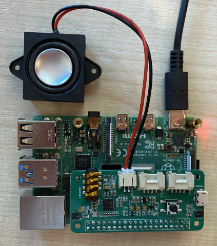

<!--
CO_OP_TRANSLATOR_METADATA:
{
  "original_hash": "7e45d884493c5222348b43fbc4481b6a",
  "translation_date": "2025-08-25T22:49:53+00:00",
  "source_file": "6-consumer/lessons/1-speech-recognition/pi-microphone.md",
  "language_code": "fa"
}
-->
# تنظیم میکروفون و بلندگوها - رزبری پای

در این بخش از درس، شما یک میکروفون و بلندگو به رزبری پای خود اضافه خواهید کرد.

## سخت‌افزار

رزبری پای به یک میکروفون نیاز دارد.

رزبری پای به صورت داخلی میکروفون ندارد، بنابراین باید یک میکروفون خارجی اضافه کنید. روش‌های مختلفی برای انجام این کار وجود دارد:

* میکروفون USB
* هدست USB
* اسپیکرفون USB همه‌کاره
* آداپتور صوتی USB و میکروفون با جک ۳.۵ میلی‌متری
* [ReSpeaker 2-Mics Pi HAT](https://www.seeedstudio.com/ReSpeaker-2-Mics-Pi-HAT.html)

> 💁 میکروفون‌های بلوتوثی به طور کامل توسط رزبری پای پشتیبانی نمی‌شوند، بنابراین اگر میکروفون یا هدست بلوتوثی دارید، ممکن است در اتصال یا ضبط صدا با مشکل مواجه شوید.

رزبری پای‌ها دارای جک هدفون ۳.۵ میلی‌متری هستند. می‌توانید از این جک برای اتصال هدفون، هدست یا بلندگو استفاده کنید. همچنین می‌توانید بلندگوها را با استفاده از موارد زیر اضافه کنید:

* صدای HDMI از طریق مانیتور یا تلویزیون
* بلندگوهای USB
* هدست USB
* اسپیکرفون USB همه‌کاره
* [ReSpeaker 2-Mics Pi HAT](https://www.seeedstudio.com/ReSpeaker-2-Mics-Pi-HAT.html) با بلندگو متصل شده، یا به جک ۳.۵ میلی‌متری یا به پورت JST

## اتصال و تنظیم میکروفون و بلندگوها

میکروفون و بلندگوها باید متصل و تنظیم شوند.

### وظیفه - اتصال و تنظیم میکروفون

1. میکروفون را با استفاده از روش مناسب وصل کنید. به عنوان مثال، آن را از طریق یکی از پورت‌های USB وصل کنید.

1. اگر از ReSpeaker 2-Mics Pi HAT استفاده می‌کنید، می‌توانید پایه Grove را بردارید و سپس HAT ReSpeaker را جایگزین کنید.

    

    شما در ادامه این درس به یک دکمه Grove نیاز خواهید داشت، اما یکی از این دکمه‌ها در این HAT تعبیه شده است، بنابراین پایه Grove لازم نیست.

    پس از نصب HAT، باید برخی درایورها را نصب کنید. برای دستورالعمل‌های نصب درایور به [راهنمای شروع Seeed](https://wiki.seeedstudio.com/ReSpeaker_2_Mics_Pi_HAT_Raspberry/#getting-started) مراجعه کنید.

    > ⚠️ دستورالعمل‌ها از `git` برای کلون کردن یک مخزن استفاده می‌کنند. اگر `git` روی رزبری پای شما نصب نشده است، می‌توانید با اجرای دستور زیر آن را نصب کنید:
    >
    > ```sh
    > sudo apt install git --yes
    > ```

1. دستور زیر را در ترمینال خود، چه روی رزبری پای یا از طریق VS Code و یک جلسه SSH از راه دور اجرا کنید تا اطلاعات مربوط به میکروفون متصل شده را مشاهده کنید:

    ```sh
    arecord -l
    ```

    لیستی از میکروفون‌های متصل شده را مشاهده خواهید کرد. چیزی شبیه به موارد زیر خواهد بود:

    ```output
    pi@raspberrypi:~ $ arecord -l
    **** List of CAPTURE Hardware Devices ****
    card 1: M0 [eMeet M0], device 0: USB Audio [USB Audio]
      Subdevices: 1/1
      Subdevice #0: subdevice #0
    ```

    فرض کنید فقط یک میکروفون دارید، باید فقط یک ورودی مشاهده کنید. تنظیم میکروفون‌ها در لینوکس ممکن است پیچیده باشد، بنابراین بهتر است فقط از یک میکروفون استفاده کنید و سایر میکروفون‌ها را جدا کنید.

    شماره کارت را یادداشت کنید، زیرا بعداً به آن نیاز خواهید داشت. در خروجی بالا شماره کارت ۱ است.

### وظیفه - اتصال و تنظیم بلندگو

1. بلندگوها را با استفاده از روش مناسب وصل کنید.

1. دستور زیر را در ترمینال خود، چه روی رزبری پای یا از طریق VS Code و یک جلسه SSH از راه دور اجرا کنید تا اطلاعات مربوط به بلندگوهای متصل شده را مشاهده کنید:

    ```sh
    aplay -l
    ```

    لیستی از بلندگوهای متصل شده را مشاهده خواهید کرد. چیزی شبیه به موارد زیر خواهد بود:

    ```output
    pi@raspberrypi:~ $ aplay -l
    **** List of PLAYBACK Hardware Devices ****
    card 0: Headphones [bcm2835 Headphones], device 0: bcm2835 Headphones [bcm2835 Headphones]
      Subdevices: 8/8
      Subdevice #0: subdevice #0
      Subdevice #1: subdevice #1
      Subdevice #2: subdevice #2
      Subdevice #3: subdevice #3
      Subdevice #4: subdevice #4
      Subdevice #5: subdevice #5
      Subdevice #6: subdevice #6
      Subdevice #7: subdevice #7
    card 1: M0 [eMeet M0], device 0: USB Audio [USB Audio]
      Subdevices: 1/1
      Subdevice #0: subdevice #0
    ```

    همیشه `card 0: Headphones` را مشاهده خواهید کرد زیرا این جک هدفون داخلی است. اگر بلندگوهای اضافی اضافه کرده باشید، مانند یک بلندگوی USB، این نیز در لیست نمایش داده خواهد شد.

1. اگر از بلندگوی اضافی استفاده می‌کنید و نه بلندگو یا هدفون متصل به جک هدفون داخلی، باید آن را به عنوان پیش‌فرض تنظیم کنید. برای این کار دستور زیر را اجرا کنید:

    ```sh
    sudo nano /usr/share/alsa/alsa.conf
    ```

    این دستور یک فایل تنظیمات را در `nano`، یک ویرایشگر متن مبتنی بر ترمینال باز می‌کند. با استفاده از کلیدهای جهت‌دار روی صفحه‌کلید خود به پایین اسکرول کنید تا خط زیر را پیدا کنید:

    ```output
    defaults.pcm.card 0
    ```

    مقدار را از `0` به شماره کارت مورد نظر از لیستی که از دستور `aplay -l` دریافت کردید تغییر دهید. به عنوان مثال، در خروجی بالا یک کارت صدا دوم به نام `card 1: M0 [eMeet M0], device 0: USB Audio [USB Audio]` وجود دارد که از کارت ۱ استفاده می‌کند. برای استفاده از این کارت، خط را به صورت زیر به‌روزرسانی می‌کنم:

    ```output
    defaults.pcm.card 1
    ```

    این مقدار را به شماره کارت مناسب تنظیم کنید. می‌توانید با استفاده از کلیدهای جهت‌دار روی صفحه‌کلید به شماره مورد نظر بروید، سپس هنگام ویرایش فایل‌های متنی، شماره را حذف کرده و مقدار جدید را تایپ کنید.

1. تغییرات را ذخیره کرده و فایل را با فشار دادن `Ctrl+x` ببندید. برای ذخیره فایل `y` را فشار دهید و سپس `return` را برای انتخاب نام فایل فشار دهید.

### وظیفه - تست میکروفون و بلندگو

1. دستور زیر را اجرا کنید تا ۵ ثانیه صدا از طریق میکروفون ضبط شود:

    ```sh
    arecord --format=S16_LE --duration=5 --rate=16000 --file-type=wav out.wav
    ```

    در حالی که این دستور در حال اجرا است، در میکروفون صدا ایجاد کنید، مانند صحبت کردن، آواز خواندن، بیت‌باکس کردن، نواختن ساز یا هر کاری که دوست دارید.

1. پس از ۵ ثانیه، ضبط متوقف خواهد شد. دستور زیر را اجرا کنید تا صدا پخش شود:

    ```sh
    aplay --format=S16_LE --rate=16000 out.wav
    ```

    صدای ضبط شده از طریق بلندگوها پخش خواهد شد. در صورت نیاز، حجم خروجی بلندگو را تنظیم کنید.

1. اگر نیاز به تنظیم حجم پورت میکروفون داخلی یا تنظیم گین میکروفون دارید، می‌توانید از ابزار `alsamixer` استفاده کنید. می‌توانید اطلاعات بیشتری درباره این ابزار در [صفحه راهنمای alsamixer لینوکس](https://linux.die.net/man/1/alsamixer) بخوانید.

1. اگر در پخش صدا خطا دریافت کردید، کارت تنظیم شده به عنوان `defaults.pcm.card` در فایل `alsa.conf` را بررسی کنید.

**سلب مسئولیت**:  
این سند با استفاده از سرویس ترجمه هوش مصنوعی [Co-op Translator](https://github.com/Azure/co-op-translator) ترجمه شده است. در حالی که ما تلاش می‌کنیم دقت را حفظ کنیم، لطفاً توجه داشته باشید که ترجمه‌های خودکار ممکن است شامل خطاها یا نادرستی‌ها باشند. سند اصلی به زبان اصلی آن باید به عنوان منبع معتبر در نظر گرفته شود. برای اطلاعات حساس، توصیه می‌شود از ترجمه حرفه‌ای انسانی استفاده کنید. ما مسئولیتی در قبال سوء تفاهم‌ها یا تفسیرهای نادرست ناشی از استفاده از این ترجمه نداریم.