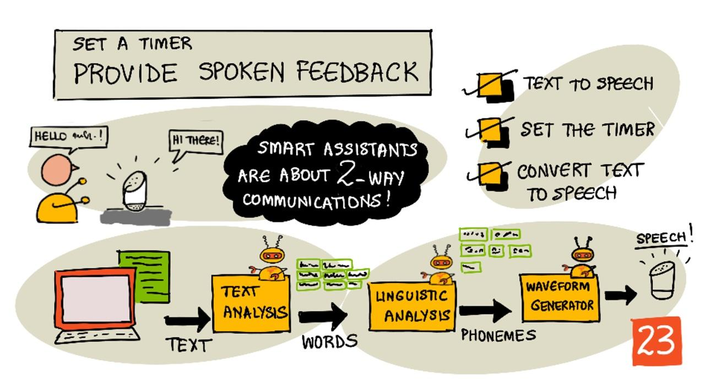

<!--
CO_OP_TRANSLATOR_METADATA:
{
  "original_hash": "b73fe10ec6b580fba2affb6f6e0a5c4d",
  "translation_date": "2025-08-25T22:35:36+00:00",
  "source_file": "6-consumer/lessons/3-spoken-feedback/README.md",
  "language_code": "fa"
}
-->
# تنظیم تایمر و ارائه بازخورد صوتی



> اسکچ‌نوت توسط [نیتیا ناراسیمهان](https://github.com/nitya). برای مشاهده نسخه بزرگ‌تر روی تصویر کلیک کنید.

## آزمون پیش از درس

[آزمون پیش از درس](https://black-meadow-040d15503.1.azurestaticapps.net/quiz/45)

## مقدمه

دستیارهای هوشمند دستگاه‌های ارتباطی یک‌طرفه نیستند. شما با آن‌ها صحبت می‌کنید و آن‌ها پاسخ می‌دهند:

"الکسا، یک تایمر سه دقیقه‌ای تنظیم کن"

"باشه، تایمر شما برای سه دقیقه تنظیم شد"

در دو درس قبلی یاد گرفتید که چگونه گفتار را به متن تبدیل کنید و سپس درخواست تنظیم تایمر را از متن استخراج کنید. در این درس یاد خواهید گرفت که چگونه تایمر را روی دستگاه IoT تنظیم کنید، با کلمات صوتی به کاربر تأییدیه بدهید و زمانی که تایمر به پایان رسید، به او هشدار دهید.

در این درس به موارد زیر خواهیم پرداخت:

* [تبدیل متن به گفتار](../../../../../6-consumer/lessons/3-spoken-feedback)
* [تنظیم تایمر](../../../../../6-consumer/lessons/3-spoken-feedback)
* [تبدیل متن به گفتار](../../../../../6-consumer/lessons/3-spoken-feedback)

## تبدیل متن به گفتار

تبدیل متن به گفتار، همان‌طور که از نامش پیداست، فرآیند تبدیل متن به صوتی است که متن را به صورت کلمات گفتاری ارائه می‌دهد. اصل اساسی این است که کلمات موجود در متن به صداهای تشکیل‌دهنده‌شان (که به آن‌ها فونم گفته می‌شود) شکسته شوند و سپس صوت این صداها، یا با استفاده از صوت‌های از پیش ضبط‌شده یا صوت‌های تولیدشده توسط مدل‌های هوش مصنوعی، کنار هم قرار گیرد.


سیستم‌های تبدیل متن به گفتار معمولاً سه مرحله دارند:

* تحلیل متن
* تحلیل زبانی
* تولید موج صوتی

### تحلیل متن

تحلیل متن شامل دریافت متن ارائه‌شده و تبدیل آن به کلماتی است که می‌توانند برای تولید گفتار استفاده شوند. برای مثال، اگر بخواهید "Hello world" را تبدیل کنید، نیازی به تحلیل متن نیست، این دو کلمه می‌توانند مستقیماً به گفتار تبدیل شوند. اما اگر "1234" داشته باشید، ممکن است نیاز باشد که به کلمات "یک هزار و دویست و سی و چهار" یا "یک، دو، سه، چهار" تبدیل شود، بسته به زمینه. برای "من 1234 سیب دارم"، باید "یک هزار و دویست و سی و چهار" باشد، اما برای "کودک 1234 را شمرد" باید "یک، دو، سه، چهار" باشد.

کلماتی که ایجاد می‌شوند نه تنها برای زبان بلکه برای منطقه جغرافیایی آن زبان متفاوت هستند. برای مثال، در انگلیسی آمریکایی، 120 به صورت "One hundred twenty" گفته می‌شود، در حالی که در انگلیسی بریتانیایی به صورت "One hundred and twenty" با استفاده از "and" بعد از صدها گفته می‌شود.

✅ برخی مثال‌های دیگر که نیاز به تحلیل متن دارند شامل "in" به عنوان کوتاه‌شده "اینچ" و "st" به عنوان کوتاه‌شده "سنت" و "خیابان" هستند. آیا می‌توانید مثال‌های دیگری در زبان خودتان پیدا کنید که بدون زمینه مبهم باشند؟

پس از تعریف کلمات، آن‌ها برای تحلیل زبانی ارسال می‌شوند.

### تحلیل زبانی

تحلیل زبانی کلمات را به فونم‌ها تقسیم می‌کند. فونم‌ها نه تنها بر اساس حروف استفاده‌شده بلکه بر اساس حروف دیگر در کلمه تعیین می‌شوند. برای مثال، در انگلیسی صدای 'a' در 'car' و 'care' متفاوت است. زبان انگلیسی دارای 44 فونم مختلف برای 26 حرف الفبا است، برخی از آن‌ها توسط حروف مختلف به اشتراک گذاشته می‌شوند، مانند فونم مشابهی که در ابتدای 'circle' و 'serpent' استفاده می‌شود.

✅ تحقیق کنید: فونم‌های زبان شما چیست؟

پس از تبدیل کلمات به فونم‌ها، این فونم‌ها نیاز به داده‌های اضافی برای پشتیبانی از لحن دارند، مانند تنظیم تن یا مدت زمان بسته به زمینه. یک مثال در انگلیسی این است که افزایش تن می‌تواند یک جمله را به یک سؤال تبدیل کند، افزایش تن برای کلمه آخر نشان‌دهنده یک سؤال است.

برای مثال - جمله "You have an apple" یک بیانیه است که می‌گوید شما یک سیب دارید. اگر تن در انتها بالا برود، افزایش برای کلمه "apple"، تبدیل به سؤال "You have an apple?" می‌شود که می‌پرسد آیا شما یک سیب دارید. تحلیل زبانی باید از علامت سؤال در انتها استفاده کند تا تصمیم بگیرد که تن را افزایش دهد.

پس از تولید فونم‌ها، آن‌ها برای تولید موج صوتی ارسال می‌شوند تا خروجی صوتی ایجاد شود.

### تولید موج صوتی

اولین سیستم‌های الکترونیکی تبدیل متن به گفتار از ضبط‌های صوتی منفرد برای هر فونم استفاده می‌کردند که منجر به صداهای بسیار یکنواخت و ربات‌گونه می‌شد. تحلیل زبانی فونم‌ها را تولید می‌کرد، این‌ها از یک پایگاه داده صوتی بارگذاری می‌شدند و برای ایجاد صوت کنار هم قرار می‌گرفتند.

✅ تحقیق کنید: برخی از ضبط‌های صوتی از سیستم‌های اولیه تبدیل گفتار را پیدا کنید. آن‌ها را با تبدیل گفتار مدرن، مانند آنچه در دستیارهای هوشمند استفاده می‌شود، مقایسه کنید.

تولید موج صوتی مدرن‌تر از مدل‌های یادگیری ماشین ساخته‌شده با یادگیری عمیق (شبکه‌های عصبی بسیار بزرگ که به شیوه‌ای مشابه نورون‌های مغز عمل می‌کنند) برای تولید صداهای طبیعی‌تر استفاده می‌کند که می‌توانند از انسان‌ها قابل تشخیص نباشند.

> 💁 برخی از این مدل‌های یادگیری ماشین می‌توانند با استفاده از یادگیری انتقالی دوباره آموزش داده شوند تا شبیه افراد واقعی شوند. این بدان معناست که استفاده از صدا به عنوان یک سیستم امنیتی، چیزی که بانک‌ها به طور فزاینده‌ای تلاش می‌کنند انجام دهند، دیگر ایده خوبی نیست زیرا هر کسی با ضبط چند دقیقه‌ای از صدای شما می‌تواند شما را جعل کند.

این مدل‌های یادگیری ماشین بزرگ در حال آموزش هستند تا هر سه مرحله را به سیستم‌های تبدیل گفتار انتها به انتها ترکیب کنند.

## تنظیم تایمر

برای تنظیم تایمر، دستگاه IoT شما باید نقطه پایانی REST که با استفاده از کد بدون سرور ایجاد کرده‌اید را فراخوانی کند و سپس از تعداد ثانیه‌های حاصل برای تنظیم تایمر استفاده کند.

### وظیفه - فراخوانی تابع بدون سرور برای دریافت زمان تایمر

راهنمای مربوطه را دنبال کنید تا نقطه پایانی REST را از دستگاه IoT خود فراخوانی کنید و تایمر را برای زمان مورد نیاز تنظیم کنید:

* [Arduino - Wio Terminal](wio-terminal-set-timer.md)
* [رایانه تک‌برد - Raspberry Pi/دستگاه IoT مجازی](single-board-computer-set-timer.md)

## تبدیل متن به گفتار

همان سرویس گفتاری که برای تبدیل گفتار به متن استفاده کردید، می‌تواند برای تبدیل متن به گفتار نیز استفاده شود و این گفتار می‌تواند از طریق بلندگوی دستگاه IoT شما پخش شود. متن برای تبدیل به سرویس گفتار ارسال می‌شود، همراه با نوع صوت مورد نیاز (مانند نرخ نمونه‌برداری)، و داده‌های باینری حاوی صوت بازگردانده می‌شود.

هنگام ارسال این درخواست، از *زبان نشانه‌گذاری ترکیب گفتار* (SSML)، یک زبان نشانه‌گذاری مبتنی بر XML برای برنامه‌های ترکیب گفتار، استفاده می‌کنید. این زبان نه تنها متن برای تبدیل بلکه زبان متن، صدای مورد استفاده، و حتی می‌تواند برای تعریف سرعت، حجم و تن برخی یا همه کلمات در متن استفاده شود.

برای مثال، این SSML درخواست تبدیل متن "تایمر سه دقیقه و پنج ثانیه شما تنظیم شده است" به گفتار با استفاده از صدای انگلیسی بریتانیایی به نام `en-GB-MiaNeural` را تعریف می‌کند:

```xml
<speak version='1.0' xml:lang='en-GB'>
    <voice xml:lang='en-GB' name='en-GB-MiaNeural'>
        Your 3 minute 5 second time has been set
    </voice>
</speak>
```

> 💁 اکثر سیستم‌های تبدیل متن به گفتار دارای چندین صدا برای زبان‌های مختلف هستند، با لهجه‌های مرتبط مانند صدای انگلیسی بریتانیایی با لهجه انگلیسی و صدای انگلیسی نیوزیلندی با لهجه نیوزیلندی.

### وظیفه - تبدیل متن به گفتار

راهنمای مربوطه را دنبال کنید تا متن را با استفاده از دستگاه IoT خود به گفتار تبدیل کنید:

* [Arduino - Wio Terminal](wio-terminal-text-to-speech.md)
* [رایانه تک‌برد - Raspberry Pi](pi-text-to-speech.md)
* [رایانه تک‌برد - دستگاه مجازی](virtual-device-text-to-speech.md)

---

## 🚀 چالش

SSML روش‌هایی برای تغییر نحوه گفتن کلمات دارد، مانند افزودن تأکید به کلمات خاص، افزودن مکث، یا تغییر تن. برخی از این موارد را امتحان کنید، SSML‌های مختلفی را از دستگاه IoT خود ارسال کنید و خروجی را مقایسه کنید. می‌توانید اطلاعات بیشتری درباره SSML، از جمله نحوه تغییر نحوه گفتن کلمات، در [مشخصات نسخه 1.1 زبان نشانه‌گذاری ترکیب گفتار (SSML) از کنسرسیوم جهانی وب](https://www.w3.org/TR/speech-synthesis11/) بخوانید.

## آزمون پس از درس

[آزمون پس از درس](https://black-meadow-040d15503.1.azurestaticapps.net/quiz/46)

## مرور و مطالعه شخصی

* اطلاعات بیشتری درباره ترکیب گفتار در [صفحه ترکیب گفتار در ویکی‌پدیا](https://wikipedia.org/wiki/Speech_synthesis) بخوانید.
* اطلاعات بیشتری درباره روش‌هایی که مجرمان از ترکیب گفتار برای سرقت استفاده می‌کنند در [داستان "صداهای جعلی به کلاهبرداران سایبری کمک می‌کنند پول سرقت کنند" در اخبار بی‌بی‌سی](https://www.bbc.com/news/technology-48908736) بخوانید.
* اطلاعات بیشتری درباره خطرات برای صداپیشگان از نسخه‌های ترکیب‌شده صدای آن‌ها در [مقاله "این شکایت TikTok نشان می‌دهد چگونه هوش مصنوعی به ضرر صداپیشگان عمل می‌کند" در Vice](https://www.vice.com/en/article/z3xqwj/this-tiktok-lawsuit-is-highlighting-how-ai-is-screwing-over-voice-actors) بخوانید.

## تکلیف

[لغو تایمر](assignment.md)

**سلب مسئولیت**:  
این سند با استفاده از سرویس ترجمه هوش مصنوعی [Co-op Translator](https://github.com/Azure/co-op-translator) ترجمه شده است. در حالی که ما تلاش می‌کنیم دقت را حفظ کنیم، لطفاً توجه داشته باشید که ترجمه‌های خودکار ممکن است شامل خطاها یا نادرستی‌ها باشند. سند اصلی به زبان اصلی آن باید به عنوان منبع معتبر در نظر گرفته شود. برای اطلاعات حساس، توصیه می‌شود از ترجمه انسانی حرفه‌ای استفاده کنید. ما مسئولیتی در قبال سوء تفاهم‌ها یا تفسیرهای نادرست ناشی از استفاده از این ترجمه نداریم.