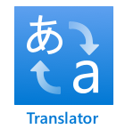

<!--
CO_OP_TRANSLATOR_METADATA:
{
  "original_hash": "c16de27b0074abe81d6a8bad5e5b1a6b",
  "translation_date": "2025-08-25T22:27:07+00:00",
  "source_file": "6-consumer/lessons/4-multiple-language-support/README.md",
  "language_code": "fa"
}
-->
# پشتیبانی از چند زبان


> اسکچ‌نوت توسط [نیتیا ناراسیمهان](https://github.com/nitya). برای مشاهده نسخه بزرگ‌تر روی تصویر کلیک کنید.

این ویدیو نمای کلی از خدمات گفتار Azure را ارائه می‌دهد، شامل تبدیل گفتار به متن و متن به گفتار از درس‌های قبلی، و همچنین ترجمه گفتار که موضوع این درس است:

[](https://www.youtube.com/watch?v=h6xbpMPSGEA)

> 🎥 برای مشاهده ویدیو روی تصویر بالا کلیک کنید

## آزمون پیش از درس

[آزمون پیش از درس](https://black-meadow-040d15503.1.azurestaticapps.net/quiz/47)

## مقدمه

در سه درس گذشته، شما درباره تبدیل گفتار به متن، درک زبان، و تبدیل متن به گفتار یاد گرفتید که همگی توسط هوش مصنوعی پشتیبانی می‌شوند. یکی دیگر از حوزه‌های ارتباط انسانی که هوش مصنوعی می‌تواند در آن کمک کند، ترجمه زبان است - تبدیل از یک زبان به زبان دیگر، مانند انگلیسی به فرانسوی.

در این درس، شما یاد خواهید گرفت که چگونه از هوش مصنوعی برای ترجمه متن استفاده کنید، به طوری که تایمر هوشمند شما بتواند با کاربران در چندین زبان تعامل داشته باشد.

در این درس، موارد زیر را پوشش خواهیم داد:

* [ترجمه متن](../../../../../6-consumer/lessons/4-multiple-language-support)
* [خدمات ترجمه](../../../../../6-consumer/lessons/4-multiple-language-support)
* [ایجاد یک منبع مترجم](../../../../../6-consumer/lessons/4-multiple-language-support)
* [پشتیبانی از چند زبان در برنامه‌ها با ترجمه](../../../../../6-consumer/lessons/4-multiple-language-support)
* [ترجمه متن با استفاده از یک سرویس هوش مصنوعی](../../../../../6-consumer/lessons/4-multiple-language-support)

> 🗑 این آخرین درس در این پروژه است، بنابراین پس از تکمیل این درس و تکلیف، فراموش نکنید که خدمات ابری خود را پاک کنید. شما برای تکمیل تکلیف به این خدمات نیاز دارید، بنابراین ابتدا مطمئن شوید که تکلیف را کامل کرده‌اید.
>
> در صورت نیاز، به [راهنمای پاکسازی پروژه](../../../clean-up.md) مراجعه کنید.

## ترجمه متن

ترجمه متن یک مسئله در علوم کامپیوتر است که بیش از ۷۰ سال مورد تحقیق قرار گرفته است و تنها اکنون، به لطف پیشرفت‌های هوش مصنوعی و قدرت کامپیوتر، به نقطه‌ای نزدیک شده است که تقریباً به اندازه مترجمان انسانی خوب است.

> 💁 منشأ این موضوع حتی به گذشته‌های دورتر، به [الکندی](https://wikipedia.org/wiki/Al-Kindi)، رمزنگار عرب قرن نهم که تکنیک‌هایی برای ترجمه زبان توسعه داد، بازمی‌گردد.

### ترجمه ماشینی

ترجمه متن به عنوان یک فناوری به نام ترجمه ماشینی (MT) آغاز شد که می‌تواند بین جفت‌های زبانی مختلف ترجمه کند. MT با جایگزینی کلمات در یک زبان با زبان دیگر کار می‌کند و تکنیک‌هایی را برای انتخاب روش‌های صحیح ترجمه عبارات یا بخش‌های جملات اضافه می‌کند، زمانی که ترجمه ساده کلمه به کلمه منطقی نیست.

> 🎓 هنگامی که مترجمان از ترجمه بین یک زبان و زبان دیگر پشتیبانی می‌کنند، این‌ها به عنوان *جفت‌های زبانی* شناخته می‌شوند. ابزارهای مختلف از جفت‌های زبانی مختلف پشتیبانی می‌کنند و این ممکن است کامل نباشد. به عنوان مثال، یک مترجم ممکن است از انگلیسی به اسپانیایی به عنوان یک جفت زبانی پشتیبانی کند و از اسپانیایی به ایتالیایی به عنوان یک جفت زبانی، اما نه از انگلیسی به ایتالیایی.

برای مثال، ترجمه "Hello world" از انگلیسی به فرانسوی می‌تواند با جایگزینی انجام شود - "Bonjour" برای "Hello"، و "le monde" برای "world"، که منجر به ترجمه صحیح "Bonjour le monde" می‌شود.

جایگزینی‌ها زمانی کار نمی‌کنند که زبان‌های مختلف از روش‌های متفاوتی برای بیان یک مفهوم استفاده کنند. برای مثال، جمله انگلیسی "My name is Jim"، به فرانسوی به "Je m'appelle Jim" ترجمه می‌شود - به معنای واقعی "من خودم را جیم می‌نامم". "Je" در فرانسوی به معنای "من" است، "moi" به معنای "من" است، اما با فعل ترکیب می‌شود زیرا با یک حرف صدادار شروع می‌شود، بنابراین به "m'" تبدیل می‌شود، "appelle" به معنای "نامیدن" است، و "Jim" ترجمه نمی‌شود زیرا یک نام است و نه کلمه‌ای که قابل ترجمه باشد. ترتیب کلمات نیز مسئله‌ای می‌شود - یک جایگزینی ساده "Je m'appelle Jim" به "I myself call Jim" تبدیل می‌شود، با ترتیبی متفاوت از انگلیسی.

> 💁 برخی کلمات هرگز ترجمه نمی‌شوند - نام من جیم است، صرف نظر از اینکه از کدام زبان برای معرفی خود استفاده کنم. هنگام ترجمه به زبان‌هایی که از الفباهای مختلف استفاده می‌کنند یا از حروف مختلف برای صداهای مختلف استفاده می‌کنند، کلمات می‌توانند *آوانویسی* شوند، یعنی انتخاب حروف یا کاراکترهایی که صدای مناسب را ایجاد کنند تا مشابه کلمه اصلی به نظر برسند.

اصطلاحات نیز برای ترجمه مشکل‌ساز هستند. این‌ها عباراتی هستند که معنای درک‌شده‌ای دارند که با تفسیر مستقیم کلمات متفاوت است. برای مثال، در انگلیسی اصطلاح "I've got ants in my pants" به معنای واقعی به داشتن مورچه در لباس اشاره نمی‌کند، بلکه به بی‌قراری اشاره دارد. اگر این اصطلاح را به آلمانی ترجمه کنید، شنونده را گیج خواهید کرد، زیرا نسخه آلمانی آن "I have bumble bees in the bottom" است.

> 💁 مناطق مختلف پیچیدگی‌های متفاوتی را اضافه می‌کنند. با اصطلاح "ants in your pants"، در انگلیسی آمریکایی "pants" به لباس بیرونی اشاره دارد، در حالی که در انگلیسی بریتانیایی، "pants" به لباس زیر اشاره دارد.

✅ اگر به چند زبان صحبت می‌کنید، به برخی از عباراتی فکر کنید که مستقیماً قابل ترجمه نیستند.

سیستم‌های ترجمه ماشینی به پایگاه‌های داده بزرگی از قوانین متکی هستند که نحوه ترجمه عبارات و اصطلاحات خاص را توصیف می‌کنند، همراه با روش‌های آماری برای انتخاب ترجمه‌های مناسب از گزینه‌های ممکن. این روش‌های آماری از پایگاه‌های داده عظیمی از آثار ترجمه‌شده توسط انسان به چندین زبان استفاده می‌کنند تا محتمل‌ترین ترجمه را انتخاب کنند، تکنیکی که به آن *ترجمه ماشینی آماری* گفته می‌شود. تعدادی از این‌ها از نمایش‌های میانی زبان استفاده می‌کنند، که اجازه می‌دهد یک زبان به میانی ترجمه شود، سپس از میانی به زبان دیگر. به این ترتیب، اضافه کردن زبان‌های بیشتر شامل ترجمه به و از میانی می‌شود، نه به و از همه زبان‌های دیگر.

### ترجمه‌های عصبی

ترجمه‌های عصبی شامل استفاده از قدرت هوش مصنوعی برای ترجمه است، معمولاً ترجمه کل جملات با استفاده از یک مدل. این مدل‌ها بر روی مجموعه داده‌های عظیمی که توسط انسان ترجمه شده‌اند، مانند صفحات وب، کتاب‌ها و مستندات سازمان ملل آموزش داده می‌شوند.

مدل‌های ترجمه عصبی معمولاً کوچک‌تر از مدل‌های ترجمه ماشینی هستند زیرا به پایگاه‌های داده عظیم از عبارات و اصطلاحات نیاز ندارند. خدمات هوش مصنوعی مدرن که ترجمه‌ها را ارائه می‌دهند اغلب چندین تکنیک را ترکیب می‌کنند، ترکیب ترجمه ماشینی آماری و ترجمه عصبی.

هیچ ترجمه ۱:۱ برای هیچ جفت زبانی وجود ندارد. مدل‌های ترجمه مختلف نتایج کمی متفاوت تولید می‌کنند، بسته به داده‌هایی که برای آموزش مدل استفاده شده‌اند. ترجمه‌ها همیشه متقارن نیستند - به این معنا که اگر یک جمله را از یک زبان به زبان دیگر ترجمه کنید، سپس به زبان اول بازگردانید، ممکن است جمله کمی متفاوتی به عنوان نتیجه ببینید.

✅ مترجم‌های آنلاین مختلف مانند [Bing Translate](https://www.bing.com/translator)، [Google Translate](https://translate.google.com)، یا اپلیکیشن ترجمه اپل را امتحان کنید. نسخه‌های ترجمه‌شده چند جمله را مقایسه کنید. همچنین سعی کنید در یکی ترجمه کنید، سپس در دیگری بازگردانید.

## خدمات ترجمه

تعدادی خدمات هوش مصنوعی وجود دارند که می‌توانند از برنامه‌های شما برای ترجمه گفتار و متن استفاده شوند.

### خدمات شناختی سرویس گفتار


سرویس گفتاری که در درس‌های گذشته استفاده کرده‌اید، قابلیت‌های ترجمه برای تشخیص گفتار دارد. هنگامی که گفتار را تشخیص می‌دهید، می‌توانید نه تنها متن گفتار را به همان زبان درخواست کنید، بلکه به زبان‌های دیگر نیز.

> 💁 این قابلیت فقط از طریق SDK گفتار در دسترس است، API REST ترجمه‌ها را به صورت داخلی ندارد.

### خدمات شناختی سرویس مترجم



سرویس مترجم یک سرویس ترجمه اختصاصی است که می‌تواند متن را از یک زبان به یک یا چند زبان هدف ترجمه کند. علاوه بر ترجمه، از طیف گسترده‌ای از ویژگی‌های اضافی مانند ماسک کردن کلمات نامناسب پشتیبانی می‌کند. همچنین به شما اجازه می‌دهد ترجمه خاصی برای یک کلمه یا جمله خاص ارائه دهید، برای کار با اصطلاحاتی که نمی‌خواهید ترجمه شوند یا ترجمه شناخته‌شده خاصی دارند.

برای مثال، هنگام ترجمه جمله "I have a Raspberry Pi"، که به کامپیوتر تک‌برد اشاره دارد، به زبان دیگری مانند فرانسوی، شما می‌خواهید نام "Raspberry Pi" را به همان شکل حفظ کنید و آن را ترجمه نکنید، که به "J’ai un Raspberry Pi" به جای "J’ai une pi aux framboises" منجر می‌شود.

## ایجاد یک منبع مترجم

برای این درس، شما به یک منبع مترجم نیاز دارید. شما از API REST برای ترجمه متن استفاده خواهید کرد.

### وظیفه - ایجاد یک منبع مترجم

1. از ترمینال یا خط فرمان خود، دستور زیر را اجرا کنید تا یک منبع مترجم در گروه منابع `smart-timer` خود ایجاد کنید.

    ```sh
    az cognitiveservices account create --name smart-timer-translator \
                                        --resource-group smart-timer \
                                        --kind TextTranslation \
                                        --sku F0 \
                                        --yes \
                                        --location <location>
    ```

    `<location>` را با مکانی که هنگام ایجاد گروه منابع استفاده کرده‌اید جایگزین کنید.

1. کلید سرویس مترجم را دریافت کنید:

    ```sh
    az cognitiveservices account keys list --name smart-timer-translator \
                                           --resource-group smart-timer \
                                           --output table
    ```

    یکی از کلیدها را کپی کنید.

## پشتیبانی از چند زبان در برنامه‌ها با ترجمه

در دنیای ایده‌آل، کل برنامه شما باید تا حد ممکن زبان‌های مختلف را درک کند، از گوش دادن به گفتار، تا درک زبان، تا پاسخ دادن با گفتار. این کار زیادی است، بنابراین خدمات ترجمه می‌توانند زمان تحویل برنامه شما را سرعت بخشند.


تصور کنید که در حال ساخت یک تایمر هوشمند هستید که از ابتدا تا انتها از انگلیسی استفاده می‌کند، گفتار انگلیسی را درک کرده و آن را به متن تبدیل می‌کند، پردازش زبان را در انگلیسی انجام می‌دهد، پاسخ‌ها را در انگلیسی ایجاد کرده و با گفتار انگلیسی پاسخ می‌دهد. اگر بخواهید پشتیبانی از ژاپنی را اضافه کنید، می‌توانید با ترجمه گفتار ژاپنی به متن انگلیسی شروع کنید، سپس هسته برنامه را همان‌طور که هست نگه دارید، سپس متن پاسخ را به ژاپنی ترجمه کنید قبل از اینکه پاسخ را به صورت گفتار ارائه دهید. این به شما اجازه می‌دهد تا به سرعت پشتیبانی از ژاپنی را اضافه کنید و می‌توانید بعداً به ارائه پشتیبانی کامل از ژاپنی بپردازید.

> 💁 نقطه ضعف تکیه بر ترجمه ماشینی این است که زبان‌ها و فرهنگ‌های مختلف روش‌های متفاوتی برای بیان یک مفهوم دارند، بنابراین ترجمه ممکن است با بیانی که انتظار دارید مطابقت نداشته باشد.

ترجمه‌های ماشینی همچنین امکاناتی را برای برنامه‌ها و دستگاه‌هایی که می‌توانند محتوای ایجاد شده توسط کاربر را در همان لحظه ترجمه کنند، باز می‌کنند. داستان‌های علمی تخیلی به طور مرتب شامل 'مترجم‌های جهانی' هستند، دستگاه‌هایی که می‌توانند زبان‌های بیگانه را به (معمولاً) انگلیسی آمریکایی ترجمه کنند. این دستگاه‌ها کمتر علمی تخیلی و بیشتر علمی واقعی هستند، اگر بخش بیگانه را نادیده بگیرید. در حال حاضر اپلیکیشن‌ها و دستگاه‌هایی وجود دارند که ترجمه هم‌زمان گفتار و متن نوشته شده را ارائه می‌دهند، با استفاده از ترکیبی از خدمات گفتار و ترجمه.

یک مثال، اپلیکیشن موبایل [Microsoft Translator](https://www.microsoft.com/translator/apps/?WT.mc_id=academic-17441-jabenn) است که در این ویدیو نشان داده شده است:

[](https://www.youtube.com/watch?v=16yAGeP2FuM)

> 🎥 برای مشاهده ویدیو روی تصویر بالا کلیک کنید

تصور کنید که چنین دستگاهی در دسترس شما باشد، به ویژه هنگام سفر یا تعامل با افرادی که زبان آن‌ها را نمی‌دانید. داشتن دستگاه‌های ترجمه خودکار در فرودگاه‌ها یا بیمارستان‌ها بهبودهای مورد نیاز در دسترسی را فراهم می‌کند.

✅ تحقیق کنید: آیا دستگاه‌های IoT ترجمه‌ای به صورت تجاری در دسترس هستند؟ چه قابلیت‌های ترجمه‌ای در دستگاه‌های هوشمند وجود دارد؟

> 👽 اگرچه هیچ مترجم جهانی واقعی وجود ندارد که به ما اجازه دهد با بیگانگان صحبت کنیم، [مترجم مایکروسافت از زبان کلینگون پشتیبانی می‌کند](https://www.microsoft.com/translator/blog/2013/05/14/announcing-klingon-for-bing-translator/?WT.mc_id=academic-17441-jabenn). Qapla’!

## ترجمه متن با استفاده از یک سرویس هوش مصنوعی

شما می‌توانید از یک سرویس هوش مصنوعی برای افزودن این قابلیت ترجمه به تایمر هوشمند خود استفاده کنید.

### وظیفه - ترجمه متن با استفاده از یک سرویس هوش مصنوعی

راهنمای مربوطه را دنبال کنید تا متن را در دستگاه IoT خود ترجمه کنید:

* [Arduino - Wio Terminal](wio-terminal-translate-speech.md)
* [کامپیوتر تک‌برد - Raspberry Pi](pi-translate-speech.md)
* [کامپیوتر تک‌برد - دستگاه مجازی](virtual-device-translate-speech.md)

---

## 🚀 چالش

ترجمه‌های ماشینی چگونه می‌توانند به برنامه‌های IoT دیگر فراتر از دستگاه‌های هوشمند کمک کنند؟ به روش‌های مختلفی فکر کنید که ترجمه‌ها می‌توانند کمک کنند، نه فقط با کلمات گفتاری بلکه با متن.

## آزمون پس از درس

[آزمون پس از درس](https://black-meadow-040d15503.1.azurestaticapps.net/quiz/48)

## مرور و مطالعه شخصی

* درباره ترجمه ماشینی در [صفحه ترجمه ماشینی در ویکی‌پدیا](https://wikipedia.org/wiki/Machine_translation) بیشتر بخوانید.
* درباره ترجمه ماشینی عصبی در [صفحه ترجمه ماشینی عصبی در ویکی‌پدیا](https://wikipedia.org/wiki/Neural_machine_translation) بیشتر بخوانید.
* لیست زبان‌های پشتیبانی‌شده برای خدمات گفتار مایکروسافت را در [پشتیبانی زبان و صدا برای مستندات سرویس گفتار در Microsoft Docs](https://docs.microsoft.com/azure/cognitive-services/speech-service/language-support?WT.mc_id=academic-17441-jabenn) بررسی کنید.

## تکلیف

[ساخت یک مترجم جهانی](assignment.md)

**سلب مسئولیت**:  
این سند با استفاده از سرویس ترجمه هوش مصنوعی [Co-op Translator](https://github.com/Azure/co-op-translator) ترجمه شده است. در حالی که ما تلاش می‌کنیم دقت را حفظ کنیم، لطفاً توجه داشته باشید که ترجمه‌های خودکار ممکن است شامل خطاها یا نادرستی‌ها باشند. سند اصلی به زبان اصلی آن باید به عنوان منبع معتبر در نظر گرفته شود. برای اطلاعات حساس، توصیه می‌شود از ترجمه انسانی حرفه‌ای استفاده کنید. ما مسئولیتی در قبال سوء تفاهم‌ها یا تفسیرهای نادرست ناشی از استفاده از این ترجمه نداریم.