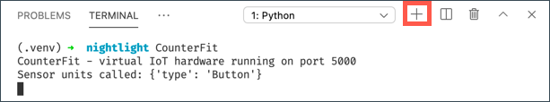

<!--
CO_OP_TRANSLATOR_METADATA:
{
  "original_hash": "52b4de6144b2efdced7797a5339d6035",
  "translation_date": "2025-08-27T22:01:09+00:00",
  "source_file": "1-getting-started/lessons/1-introduction-to-iot/virtual-device.md",
  "language_code": "fi"
}
-->
# Virtuaalinen yhden piirilevyn tietokone

Sen sijaan, että ostaisit IoT-laitteen, sensoreita ja toimilaitteita, voit käyttää tietokonettasi simuloimaan IoT-laitteistoa. [CounterFit-projekti](https://github.com/CounterFit-IoT/CounterFit) mahdollistaa sovelluksen ajamisen paikallisesti, joka simuloi IoT-laitteistoa, kuten sensoreita ja toimilaitteita, ja pääsyn näihin sensoreihin ja toimilaitteisiin paikallisesta Python-koodista, joka on kirjoitettu samalla tavalla kuin fyysisellä laitteistolla, kuten Raspberry Pi:llä.

## Asennus

CounterFitin käyttöä varten sinun tulee asentaa tietokoneellesi ilmaisia ohjelmistoja.

### Tehtävä

Asenna tarvittavat ohjelmistot.

1. Asenna Python. Katso [Pythonin lataussivu](https://www.python.org/downloads/) saadaksesi ohjeet Pythonin uusimman version asentamiseen.

1. Asenna Visual Studio Code (VS Code). Tämä on editori, jota käytät virtuaalisen laitteen koodin kirjoittamiseen Pythonilla. Katso [VS Code -dokumentaatio](https://code.visualstudio.com?WT.mc_id=academic-17441-jabenn) saadaksesi ohjeet VS Coden asentamiseen.

    > 💁 Voit käyttää mitä tahansa Python IDE:tä tai editoria näissä oppitunneissa, jos sinulla on mieluisampi työkalu, mutta oppitunnit antavat ohjeita perustuen VS Coden käyttöön.

1. Asenna VS Code Pylance -laajennus. Tämä on VS Code -laajennus, joka tarjoaa Python-kielen tukea. Katso [Pylance-laajennuksen dokumentaatio](https://marketplace.visualstudio.com/items?WT.mc_id=academic-17441-jabenn&itemName=ms-python.vscode-pylance) saadaksesi ohjeet tämän laajennuksen asentamiseen VS Codeen.

Ohjeet CounterFit-sovelluksen asentamiseen ja konfigurointiin annetaan tehtävän ohjeissa, sillä se asennetaan projektikohtaisesti.

## Hello world

On perinteistä aloittaa uuden ohjelmointikielen tai teknologian käyttö luomalla 'Hello World' -sovellus - pieni sovellus, joka tulostaa esimerkiksi tekstin `"Hello World"` osoittaakseen, että kaikki työkalut on konfiguroitu oikein.

Virtuaalisen IoT-laitteiston Hello World -sovellus varmistaa, että Python ja Visual Studio Code on asennettu oikein. Se myös yhdistää CounterFitiin virtuaalisia IoT-sensoreita ja toimilaitteita varten. Sovellus ei käytä mitään laitteistoa, vaan yhdistää vain varmistaakseen, että kaikki toimii.

Tämä sovellus sijaitsee kansiossa nimeltä `nightlight`, ja sitä käytetään uudelleen eri koodilla myöhemmissä osissa tätä tehtävää yövalosovelluksen rakentamiseksi.

### Konfiguroi Python-virtuaaliympäristö

Yksi Pythonin tehokkaista ominaisuuksista on mahdollisuus asentaa [Pip-paketteja](https://pypi.org) - nämä ovat muiden ihmisten kirjoittamia ja Internetiin julkaistuja koodipaketteja. Voit asentaa Pip-paketin tietokoneellesi yhdellä komennolla ja käyttää sitä koodissasi. Käytät Pip:iä CounterFitin kanssa keskustelemiseen.

Oletuksena, kun asennat paketin, se on käytettävissä kaikkialla tietokoneellasi, mikä voi johtaa ongelmiin pakettiversioiden kanssa - esimerkiksi yksi sovellus voi riippua yhdestä pakettiversiosta, joka rikkoutuu, kun asennat uuden version toista sovellusta varten. Tämän ongelman kiertämiseksi voit käyttää [Python-virtuaaliympäristöä](https://docs.python.org/3/library/venv.html), joka on käytännössä Pythonin kopio omassa kansiossaan, ja kun asennat Pip-paketteja, ne asennetaan vain siihen kansioon.

> 💁 Jos käytät Raspberry Pi:tä, et konfiguroinut virtuaaliympäristöä hallitaksesi Pip-paketteja, vaan käytät globaaleja paketteja, koska Grove-paketit asennetaan globaalisti asennusskriptin avulla.

#### Tehtävä - konfiguroi Python-virtuaaliympäristö

Konfiguroi Python-virtuaaliympäristö ja asenna CounterFitin Pip-paketit.

1. Aja seuraavat komennot terminaalissa tai komentorivillä haluamassasi sijainnissa luodaksesi ja siirtyäksesi uuteen hakemistoon:

    ```sh
    mkdir nightlight
    cd nightlight
    ```

1. Aja seuraava komento luodaksesi virtuaaliympäristön `.venv`-kansioon:

    ```sh
    python3 -m venv .venv
    ```

    > 💁 Sinun täytyy kutsua `python3` eksplisiittisesti luodaksesi virtuaaliympäristön, koska sinulla saattaa olla Python 2 asennettuna Python 3:n lisäksi (uusin versio). Jos sinulla on Python 2 asennettuna, `python` käyttää Python 2:ta Python 3:n sijaan.

1. Aktivoi virtuaaliympäristö:

    * Windowsissa:
        * Jos käytät Command Promptia tai Command Promptia Windows Terminalin kautta, aja:

            ```cmd
            .venv\Scripts\activate.bat
            ```

        * Jos käytät PowerShelliä, aja:

            ```powershell
            .\.venv\Scripts\Activate.ps1
            ```

            > Jos saat virheilmoituksen, että skriptien suorittaminen on estetty tällä järjestelmällä, sinun täytyy sallia skriptien suorittaminen asettamalla sopiva suorituskäytäntö. Voit tehdä tämän käynnistämällä PowerShellin järjestelmänvalvojana ja ajamalla seuraavan komennon:

            ```powershell
            Set-ExecutionPolicy -ExecutionPolicy Unrestricted
            ```

            Vahvista painamalla `Y`. Käynnistä sitten PowerShell uudelleen ja yritä uudelleen.

            Voit tarvittaessa palauttaa tämän suorituskäytännön myöhemmin. Voit lukea lisää tästä [Microsoft Docsin Execution Policies -sivulta](https://docs.microsoft.com/powershell/module/microsoft.powershell.core/about/about_execution_policies?WT.mc_id=academic-17441-jabenn).

    * macOS:ssä tai Linuxissa, aja:

        ```cmd
        source ./.venv/bin/activate
        ```

    > 💁 Nämä komennot tulee ajaa samasta sijainnista, jossa ajoit komennon virtuaaliympäristön luomiseksi. Sinun ei koskaan tarvitse siirtyä `.venv`-kansioon, vaan sinun tulee aina ajaa aktivointikomento ja kaikki komennot pakettien asentamiseksi tai koodin suorittamiseksi kansiosta, jossa olit virtuaaliympäristön luomisen aikana.

1. Kun virtuaaliympäristö on aktivoitu, oletus `python`-komento ajaa Python-version, jota käytettiin virtuaaliympäristön luomiseen. Aja seuraava komento saadaksesi version:

    ```sh
    python --version
    ```

    Tulosteen tulisi sisältää seuraava:

    ```output
    (.venv) ➜  nightlight python --version
    Python 3.9.1
    ```

    > 💁 Python-versiosi saattaa olla erilainen - kunhan se on versio 3.6 tai uudempi, olet hyvässä tilanteessa. Jos ei, poista tämä kansio, asenna uudempi Python-versio ja yritä uudelleen.

1. Aja seuraavat komennot asentaaksesi CounterFitin Pip-paketit. Nämä paketit sisältävät CounterFit-sovelluksen sekä Grove-laitteiston shimit. Nämä shimit mahdollistavat koodin kirjoittamisen ikään kuin ohjelmoisit fyysisiä sensoreita ja toimilaitteita Grove-ekosysteemistä, mutta yhdistettynä virtuaalisiin IoT-laitteisiin.

    ```sh
    pip install CounterFit
    pip install counterfit-connection
    pip install counterfit-shims-grove
    ```

    Nämä Pip-paketit asennetaan vain virtuaaliympäristöön, eivätkä ne ole käytettävissä sen ulkopuolella.

### Kirjoita koodi

Kun Python-virtuaaliympäristö on valmis, voit kirjoittaa 'Hello World' -sovelluksen koodin.

#### Tehtävä - kirjoita koodi

Luo Python-sovellus, joka tulostaa `"Hello World"` konsoliin.

1. Aja seuraava komento terminaalissa tai komentorivillä virtuaaliympäristön sisällä luodaksesi Python-tiedoston nimeltä `app.py`:

    * Windowsissa aja:

        ```cmd
        type nul > app.py
        ```

    * macOS:ssä tai Linuxissa aja:

        ```cmd
        touch app.py
        ```

1. Avaa nykyinen kansio VS Codessa:

    ```sh
    code .
    ```

    > 💁 Jos terminaalisi palauttaa `command not found` macOS:ssä, se tarkoittaa, että VS Codea ei ole lisätty PATH:iin. Voit lisätä VS Coden PATH:iin seuraamalla ohjeita [VS Code -dokumentaation Komentoriviltä käynnistäminen -osiossa](https://code.visualstudio.com/docs/setup/mac?WT.mc_id=academic-17441-jabenn#_launching-from-the-command-line) ja ajaa komennon sen jälkeen. VS Code lisätään oletuksena PATH:iin Windowsissa ja Linuxissa.

1. Kun VS Code käynnistyy, se aktivoi Python-virtuaaliympäristön. Valittu virtuaaliympäristö näkyy alareunan tilapalkissa:

    

1. Jos VS Coden terminaali on jo käynnissä, kun VS Code käynnistyy, virtuaaliympäristö ei ole aktivoitu siinä. Helpoin tapa on sulkea terminaali käyttämällä **Sulje aktiivinen terminaali** -painiketta:

    

    Voit tarkistaa, onko terminaalissa aktivoitu virtuaaliympäristö, sillä virtuaaliympäristön nimi näkyy terminaalin kehotteen etuliitteenä. Esimerkiksi se voi olla:

    ```sh
    (.venv) ➜  nightlight
    ```

    Jos kehotteessa ei ole `.venv`-etuliitettä, virtuaaliympäristö ei ole aktiivinen terminaalissa.

1. Käynnistä uusi VS Code -terminaali valitsemalla *Terminal -> New Terminal* tai painamalla `` CTRL+` ``. Uusi terminaali lataa virtuaaliympäristön, ja aktivointikutsu näkyy terminaalissa. Kehotteessa näkyy myös virtuaaliympäristön nimi (`.venv`):

    ```output
    ➜  nightlight source .venv/bin/activate
    (.venv) ➜  nightlight 
    ```

1. Avaa `app.py`-tiedosto VS Coden tiedostoselaimesta ja lisää seuraava koodi:

    ```python
    print('Hello World!')
    ```

    `print`-funktio tulostaa sille annetun sisällön konsoliin.

1. Aja seuraava komento VS Coden terminaalista suorittaaksesi Python-sovelluksesi:

    ```sh
    python app.py
    ```

    Tulosteessa näkyy seuraava:

    ```output
    (.venv) ➜  nightlight python app.py 
    Hello World!
    ```

😀 'Hello World' -ohjelmasi onnistui!

### Yhdistä 'laitteisto'

Toisena 'Hello World' -vaiheena käynnistät CounterFit-sovelluksen ja yhdistät koodisi siihen. Tämä vastaa virtuaalisesti IoT-laitteiston liittämistä kehityskorttiin.

#### Tehtävä - yhdistä 'laitteisto'

1. Käynnistä CounterFit-sovellus VS Coden terminaalista seuraavalla komennolla:

    ```sh
    counterfit
    ```

    Sovellus käynnistyy ja avautuu verkkoselaimessasi:

    

    Sovellus on merkitty *Disconnected*-tilaan, ja oikean yläkulman LED on sammutettu.

1. Lisää seuraava koodi `app.py`-tiedoston alkuun:

    ```python
    from counterfit_connection import CounterFitConnection
    CounterFitConnection.init('127.0.0.1', 5000)
    ```

    Tämä koodi tuo `CounterFitConnection`-luokan `counterfit_connection`-moduulista, joka tulee aiemmin asennetusta `counterfit-connection` Pip-paketista. Se alustaa yhteyden CounterFit-sovellukseen, joka toimii osoitteessa `127.0.0.1`, IP-osoite, jota voit aina käyttää paikallisen tietokoneesi (usein kutsutaan *localhost*) tavoittamiseen, portissa 5000.

    > 💁 Jos sinulla on muita sovelluksia käynnissä portissa 5000, voit muuttaa tätä päivittämällä portin koodissa ja käynnistämällä CounterFitin komennolla `CounterFit --port <port_number>`, korvaten `<port_number>` haluamallasi portilla.

1. Sinun täytyy käynnistää uusi VS Code -terminaali valitsemalla **Luo uusi integroitu terminaali** -painike. Tämä johtuu siitä, että CounterFit-sovellus on käynnissä nykyisessä terminaalissa.

    

1. Aja `app.py`-tiedosto uudessa terminaalissa kuten aiemmin. CounterFitin tila muuttuu **Connected**-tilaan ja LED syttyy.

    

> 💁 Löydät tämän koodin [code/virtual-device](../../../../../1-getting-started/lessons/1-introduction-to-iot/code/virtual-device) -kansiosta.

😀 Yhteys laitteistoon onnistui!

---

**Vastuuvapauslauseke**:  
Tämä asiakirja on käännetty käyttämällä tekoälypohjaista käännöspalvelua [Co-op Translator](https://github.com/Azure/co-op-translator). Vaikka pyrimme tarkkuuteen, huomioithan, että automaattiset käännökset voivat sisältää virheitä tai epätarkkuuksia. Alkuperäinen asiakirja sen alkuperäisellä kielellä tulisi pitää ensisijaisena lähteenä. Kriittisen tiedon osalta suositellaan ammattimaista ihmiskäännöstä. Emme ole vastuussa väärinkäsityksistä tai virhetulkinnoista, jotka johtuvat tämän käännöksen käytöstä.