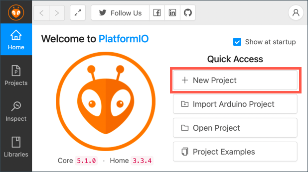

<!--
CO_OP_TRANSLATOR_METADATA:
{
  "original_hash": "a4f0c166010e31fd7b6ca20bc88dec6d",
  "translation_date": "2025-08-27T22:05:59+00:00",
  "source_file": "1-getting-started/lessons/1-introduction-to-iot/wio-terminal.md",
  "language_code": "fi"
}
-->
# Wio Terminal

[Wio Terminal Seeed Studiosilta](https://www.seeedstudio.com/Wio-Terminal-p-4509.html) on Arduino-yhteensopiva mikrokontrolleri, jossa on WiFi sekä sisäänrakennettuja sensoreita ja toimilaitteita. Lisäksi siinä on liitäntöjä, joiden avulla voit lisätä enemmän sensoreita ja toimilaitteita käyttäen laitteistoekosysteemiä nimeltä [Grove](https://www.seeedstudio.com/category/Grove-c-1003.html).


## Asennus

Jotta voit käyttää Wio Terminalia, sinun täytyy asentaa tietokoneellesi ilmainen ohjelmisto. Lisäksi sinun täytyy päivittää Wio Terminalin laiteohjelmisto ennen kuin voit yhdistää sen WiFi-verkkoon.

### Tehtävä - asennus

Asenna tarvittava ohjelmisto ja päivitä laiteohjelmisto.

1. Asenna Visual Studio Code (VS Code). Tämä on editori, jota käytät kirjoittaaksesi laitteen koodia C/C++-kielellä. Katso [VS Code -dokumentaatio](https://code.visualstudio.com?WT.mc_id=academic-17441-jabenn) saadaksesi ohjeet VS Coden asentamiseen.

    > 💁 Toinen suosittu IDE Arduino-kehitykseen on [Arduino IDE](https://www.arduino.cc/en/software). Jos olet jo tuttu tämän työkalun kanssa, voit käyttää sitä VS Coden ja PlatformIO:n sijaan, mutta oppitunneilla annetaan ohjeet käyttäen VS Codea.

1. Asenna VS Coden PlatformIO-laajennus. Tämä on VS Codeen tarkoitettu laajennus, joka tukee mikrokontrollerien ohjelmointia C/C++-kielellä. Katso [PlatformIO-laajennuksen dokumentaatio](https://marketplace.visualstudio.com/items?WT.mc_id=academic-17441-jabenn&itemName=platformio.platformio-ide) saadaksesi ohjeet tämän laajennuksen asentamiseen VS Codeen. Tämä laajennus vaatii Microsoftin C/C++-laajennuksen toimiakseen C- ja C++-koodin kanssa, ja C/C++-laajennus asennetaan automaattisesti, kun asennat PlatformIO:n.

1. Yhdistä Wio Terminal tietokoneeseesi. Wio Terminalissa on USB-C-portti pohjassa, ja tämä täytyy yhdistää tietokoneesi USB-porttiin. Wio Terminalin mukana tulee USB-C–USB-A-kaapeli, mutta jos tietokoneessasi on vain USB-C-portteja, tarvitset joko USB-C-kaapelin tai USB-A–USB-C-sovittimen.

1. Seuraa [Wio Terminal Wiki WiFi Overview -dokumentaation](https://wiki.seeedstudio.com/Wio-Terminal-Network-Overview/) ohjeita asentaaksesi Wio Terminalin ja päivittääksesi laiteohjelmiston.

## Hello World

On perinteistä aloittaa uuden ohjelmointikielen tai teknologian käyttö luomalla 'Hello World' -sovellus – pieni sovellus, joka tulostaa esimerkiksi tekstin `"Hello World"` osoittaakseen, että kaikki työkalut on asennettu oikein.

Wio Terminalin Hello World -sovellus varmistaa, että Visual Studio Code on asennettu oikein PlatformIO:n kanssa ja että se on valmis mikrokontrollerikehitykseen.

### Luo PlatformIO-projekti

Ensimmäinen askel on luoda uusi projekti PlatformIO:ssa, joka on konfiguroitu Wio Terminalille.

#### Tehtävä - luo PlatformIO-projekti

Luo PlatformIO-projekti.

1. Yhdistä Wio Terminal tietokoneeseesi.

1. Käynnistä VS Code.

1. PlatformIO-kuvake löytyy sivupalkista:

    

    Valitse tämä valikkovaihtoehto ja valitse *PIO Home -> Open*.

    

1. Tervetulonäytöstä valitse **+ New Project** -painike.

    

1. Konfiguroi projekti *Project Wizardissa*:

    1. Nimeä projektisi `nightlight`.

    1. *Board*-pudotusvalikosta kirjoita `WIO` suodattaaksesi lautoja ja valitse *Seeeduino Wio Terminal*.

    1. Jätä *Framework* kohdaksi *Arduino*.

    1. Jätä *Use default location* -valintaruutu valituksi tai poista valinta ja valitse sijainti projektillesi.

    1. Valitse **Finish**-painike.

    

    PlatformIO lataa tarvittavat komponentit koodin kääntämiseksi Wio Terminalille ja luo projektisi. Tämä voi kestää muutaman minuutin.

### Tutki PlatformIO-projektia

VS Coden resurssienhallinta näyttää joukon tiedostoja ja kansioita, jotka PlatformIO:n ohjattu toiminto on luonut.

#### Kansiot

* `.pio` - tämä kansio sisältää väliaikaista dataa, jota PlatformIO tarvitsee, kuten kirjastoja tai käännettyä koodia. Se luodaan automaattisesti uudelleen, jos se poistetaan, eikä sitä tarvitse lisätä versionhallintaan, jos jaat projektisi esimerkiksi GitHubissa.
* `.vscode` - tämä kansio sisältää PlatformIO:n ja VS Coden käyttämän konfiguraation. Se luodaan automaattisesti uudelleen, jos se poistetaan, eikä sitä tarvitse lisätä versionhallintaan, jos jaat projektisi esimerkiksi GitHubissa.
* `include` - tämä kansio on ulkoisille otsikkotiedostoille, joita tarvitaan lisäkirjastojen lisäämiseen koodiin. Et käytä tätä kansiota näissä oppitunneissa.
* `lib` - tämä kansio on ulkoisille kirjastoille, joita haluat kutsua koodistasi. Et käytä tätä kansiota näissä oppitunneissa.
* `src` - tämä kansio sisältää sovelluksesi pääkoodin. Aluksi siinä on yksi tiedosto - `main.cpp`.
* `test` - tämä kansio on tarkoitettu yksikkötesteille koodillesi.

#### Tiedostot

* `main.cpp` - tämä tiedosto `src`-kansiossa sisältää sovelluksesi aloituspisteen. Avaa tämä tiedosto, ja siinä on seuraava koodi:

    ```cpp
    #include <Arduino.h>
    
    void setup() {
      // put your setup code here, to run once:
    }
    
    void loop() {
      // put your main code here, to run repeatedly:
    }
    ```

    Kun laite käynnistyy, Arduino-kehys suorittaa `setup`-funktion kerran ja sen jälkeen `loop`-funktion toistuvasti, kunnes laite sammutetaan.

* `.gitignore` - tämä tiedosto listaa tiedostot ja kansiot, jotka tulee jättää huomiotta, kun lisäät koodisi git-versionhallintaan, kuten ladatessasi sen GitHub-repositorioon.

* `platformio.ini` - tämä tiedosto sisältää konfiguraation laitteellesi ja sovelluksellesi. Avaa tämä tiedosto, ja siinä on seuraava koodi:

    ```ini
    [env:seeed_wio_terminal]
    platform = atmelsam
    board = seeed_wio_terminal
    framework = arduino
    ```

    `[env:seeed_wio_terminal]`-osio sisältää konfiguraation Wio Terminalille. Voit lisätä useita `env`-osioita, jotta koodisi voidaan kääntää useille laudoille.

    Muut arvot vastaavat projektin ohjatun toiminnon konfiguraatiota:

  * `platform = atmelsam` määrittää laitteiston, jota Wio Terminal käyttää (ATSAMD51-pohjainen mikrokontrolleri).
  * `board = seeed_wio_terminal` määrittää mikrokontrollerilaudan tyypin (Wio Terminal).
  * `framework = arduino` määrittää, että tämä projekti käyttää Arduino-kehystä.

### Kirjoita Hello World -sovellus

Olet nyt valmis kirjoittamaan Hello World -sovelluksen.

#### Tehtävä - kirjoita Hello World -sovellus

Kirjoita Hello World -sovellus.

1. Avaa `main.cpp`-tiedosto VS Codessa.

1. Muuta koodi vastaamaan seuraavaa:

    ```cpp
    #include <Arduino.h>

    void setup()
    {
        Serial.begin(9600);

        while (!Serial)
            ; // Wait for Serial to be ready
    
        delay(1000);
    }
    
    void loop()
    {
        Serial.println("Hello World");
        delay(5000);
    }
    ```

    `setup`-funktio alustaa yhteyden sarjaporttiin – tässä tapauksessa USB-porttiin, jota käytetään Wio Terminalin yhdistämiseen tietokoneeseen. Parametri `9600` on [baudinopeus](https://wikipedia.org/wiki/Symbol_rate) (tunnetaan myös nimellä symbolinopeus), eli nopeus, jolla dataa lähetetään sarjaportin kautta bitteinä sekunnissa. Tämä asetus tarkoittaa, että 9 600 bittiä (0:ia ja 1:siä) dataa lähetetään sekunnissa. Se odottaa sitten, että sarjaportti on valmis.

    `loop`-funktio lähettää rivin `Hello World!` sarjaporttiin, eli `Hello World!`-merkit ja uuden rivin merkin. Se sitten nukkuu 5 000 millisekuntia eli 5 sekuntia. Kun `loop` päättyy, se suoritetaan uudelleen, ja uudelleen, ja niin edelleen niin kauan kuin mikrokontrolleri on päällä.

1. Aseta Wio Terminal lataustilaan. Sinun täytyy tehdä tämä joka kerta, kun lataat uutta koodia laitteeseen:

    1. Vedä virtakytkintä alas nopeasti kahdesti – se palautuu takaisin päälle-asentoon joka kerta.

    1. Tarkista sininen tilavalo USB-portin oikealla puolella. Sen pitäisi sykkiä.
    
    [](https://youtu.be/LeKU_7zLRrQ)
    
    Klikkaa yllä olevaa kuvaa nähdäksesi videon, joka näyttää, miten tämä tehdään.

1. Rakenna ja lataa koodi Wio Terminalille.

    1. Avaa VS Coden komentopaletti.

    1. Kirjoita `PlatformIO Upload` etsiäksesi latausvaihtoehdon ja valitse *PlatformIO: Upload*.

        

        PlatformIO kääntää koodin automaattisesti tarvittaessa ennen lataamista.

    1. Koodi käännetään ja ladataan Wio Terminalille.

        > 💁 Jos käytät macOS:ia, ilmoitus *DISK NOT EJECTED PROPERLY* ilmestyy. Tämä johtuu siitä, että Wio Terminal liitetään asemaksi osana ohjelmointiprosessia, ja se irrotetaan, kun käännetty koodi kirjoitetaan laitteeseen. Voit ohittaa tämän ilmoituksen.

    ⚠️ Jos saat virheitä, joissa latausportti ei ole käytettävissä, varmista ensin, että Wio Terminal on yhdistetty tietokoneeseesi ja kytketty päälle näytön vasemmalla puolella olevalla kytkimellä, ja asetettu lataustilaan. Vihreän valon pohjassa pitäisi olla päällä, ja sinisen valon pitäisi sykkiä. Jos virhe jatkuu, vedä virtakytkintä alas nopeasti kahdesti uudelleen pakottaaksesi Wio Terminal lataustilaan ja yritä latausta uudelleen.

PlatformIO:ssa on sarjaportin monitori, joka voi seurata USB-kaapelin kautta lähetettyä dataa Wio Terminalilta. Tämä mahdollistaa datan seuraamisen, jonka `Serial.println("Hello World");`-komento lähettää.

1. Avaa VS Coden komentopaletti.

1. Kirjoita `PlatformIO Serial` etsiäksesi sarjaportin monitorivaihtoehdon ja valitse *PlatformIO: Serial Monitor*.

    

    Uusi terminaali avautuu, ja sarjaportin kautta lähetetty data striimataan tähän terminaaliin:

    ```output
    > Executing task: platformio device monitor <
    
    --- Available filters and text transformations: colorize, debug, default, direct, hexlify, log2file, nocontrol, printable, send_on_enter, time
    --- More details at http://bit.ly/pio-monitor-filters
    --- Miniterm on /dev/cu.usbmodem101  9600,8,N,1 ---
    --- Quit: Ctrl+C | Menu: Ctrl+T | Help: Ctrl+T followed by Ctrl+H ---
    Hello World
    Hello World
    ```

    `Hello World` tulostuu sarjaportin monitoriin joka 5. sekunti.

> 💁 Löydät tämän koodin [code/wio-terminal](../../../../../1-getting-started/lessons/1-introduction-to-iot/code/wio-terminal)-kansiosta.

😀 'Hello World' -ohjelmasi onnistui!

---

**Vastuuvapauslauseke**:  
Tämä asiakirja on käännetty käyttämällä tekoälypohjaista käännöspalvelua [Co-op Translator](https://github.com/Azure/co-op-translator). Vaikka pyrimme tarkkuuteen, huomioithan, että automaattiset käännökset voivat sisältää virheitä tai epätarkkuuksia. Alkuperäinen asiakirja sen alkuperäisellä kielellä tulisi pitää ensisijaisena lähteenä. Kriittisen tiedon osalta suositellaan ammattimaista ihmiskäännöstä. Emme ole vastuussa väärinkäsityksistä tai virhetulkinnoista, jotka johtuvat tämän käännöksen käytöstä.