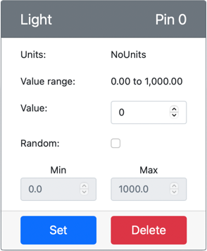

<!--
CO_OP_TRANSLATOR_METADATA:
{
  "original_hash": "11f10c6760fb8202cf368422702fdf70",
  "translation_date": "2025-08-27T21:55:35+00:00",
  "source_file": "1-getting-started/lessons/3-sensors-and-actuators/virtual-device-sensor.md",
  "language_code": "fi"
}
-->
# Rakenna yövalo - Virtuaalinen IoT-laitteisto

Tässä osassa oppituntia lisäät valosensorin virtuaaliseen IoT-laitteeseesi.

## Virtuaalinen laitteisto

Yövalo tarvitsee yhden sensorin, joka luodaan CounterFit-sovelluksessa.

Sensori on **valosensori**. Fyysisessä IoT-laitteessa se olisi [valodiodi](https://wikipedia.org/wiki/Photodiode), joka muuntaa valon sähköiseksi signaaliksi. Valosensorit ovat analogisia sensoreita, jotka lähettävät kokonaislukuarvon, joka ilmaisee suhteellisen valon määrän. Tämä arvo ei vastaa mitään standardoitua mittayksikköä, kuten [luksia](https://wikipedia.org/wiki/Lux).

### Lisää sensorit CounterFitiin

Virtuaalisen valosensorin käyttämiseksi sinun täytyy lisätä se CounterFit-sovellukseen.

#### Tehtävä - lisää sensorit CounterFitiin

Lisää valosensori CounterFit-sovellukseen.

1. Varmista, että CounterFit-verkkosovellus on käynnissä edellisen tehtävän osan jäljiltä. Jos ei, käynnistä se.

1. Luo valosensori:

    1. *Create sensor* -laatikossa *Sensors*-paneelissa avaa *Sensor type* -valikko ja valitse *Light*.

    1. Jätä *Units* asetukseksi *NoUnits*.

    1. Varmista, että *Pin* on asetettu arvoon *0*.

    1. Valitse **Add**-painike luodaksesi valosensorin Pin 0:aan.

    

    Valosensori luodaan ja se ilmestyy sensorilistaan.

    

## Ohjelmoi valosensori

Laite voidaan nyt ohjelmoida käyttämään sisäänrakennettua valosensoria.

### Tehtävä - ohjelmoi valosensori

Ohjelmoi laite.

1. Avaa yövaloprojekti VS Codessa, jonka loit edellisen tehtävän osassa. Sulje ja luo uusi pääte varmistaaksesi, että se käyttää virtuaaliympäristöä, jos tarpeen.

1. Avaa tiedosto `app.py`.

1. Lisää seuraava koodi `app.py`-tiedoston alkuun muiden `import`-lauselmien joukkoon tuodaksesi tarvittavat kirjastot:

    ```python
    import time
    from counterfit_shims_grove.grove_light_sensor_v1_2 import GroveLightSensor
    ```

    `import time` -lauselma tuo Pythonin `time`-moduulin, jota käytetään myöhemmin tässä tehtävässä.

    `from counterfit_shims_grove.grove_light_sensor_v1_2 import GroveLightSensor` -lauselma tuo `GroveLightSensor`-luokan CounterFit Grove -shim Python -kirjastoista. Tämä kirjasto sisältää koodin, jolla voidaan käyttää CounterFit-sovelluksessa luotua valosensoria.

1. Lisää seuraava koodi tiedoston loppuun luodaksesi luokkainstansseja, jotka hallitsevat valosensoria:

    ```python
    light_sensor = GroveLightSensor(0)
    ```

    Rivi `light_sensor = GroveLightSensor(0)` luo `GroveLightSensor`-luokan instanssin, joka yhdistyy pinniin **0** - CounterFit Grove -pinniin, johon valosensori on liitetty.

1. Lisää loputtomaan silmukkaan koodi, joka lukee valosensorin arvon ja tulostaa sen konsoliin:

    ```python
    while True:
        light = light_sensor.light
        print('Light level:', light)
    ```

    Tämä lukee nykyisen valotason käyttämällä `light`-ominaisuutta `GroveLightSensor`-luokasta. Tämä ominaisuus lukee analogisen arvon pinnistä. Tämä arvo tulostetaan sitten konsoliin.

1. Lisää pieni yhden sekunnin viive `while`-silmukan loppuun, koska valotasoja ei tarvitse tarkistaa jatkuvasti. Viive vähentää laitteen virrankulutusta.

    ```python
    time.sleep(1)
    ```

1. Suorita seuraava komento VS Coden päätteen kautta käynnistääksesi Python-sovelluksesi:

    ```sh
    python3 app.py
    ```

    Valoarvot tulostuvat konsoliin. Aluksi tämä arvo on 0.

1. Muuta CounterFit-sovelluksessa valosensorin arvoa, jonka sovellus lukee. Voit tehdä tämän kahdella tavalla:

    * Syötä numero *Value*-kenttään valosensorille ja valitse **Set**-painike. Syöttämäsi numero on arvo, jonka sensori palauttaa.

    * Valitse *Random*-valintaruutu ja syötä *Min*- ja *Max*-arvot, sitten valitse **Set**-painike. Joka kerta, kun sensori lukee arvon, se lukee satunnaisen numeron *Min*- ja *Max*-arvojen väliltä.

    Asettamasi arvot tulostuvat konsoliin. Muuta *Value*- tai *Random*-asetuksia saadaksesi arvon muuttumaan.

    ```output
    (.venv) ➜  GroveTest python3 app.py 
    Light level: 143
    Light level: 244
    Light level: 246
    Light level: 253
    ```

> 💁 Löydät tämän koodin [code-sensor/virtual-device](../../../../../1-getting-started/lessons/3-sensors-and-actuators/code-sensor/virtual-device) -kansiosta.

😀 Yövalosovelluksesi onnistui!

---

**Vastuuvapauslauseke**:  
Tämä asiakirja on käännetty käyttämällä tekoälypohjaista käännöspalvelua [Co-op Translator](https://github.com/Azure/co-op-translator). Vaikka pyrimme tarkkuuteen, huomioithan, että automaattiset käännökset voivat sisältää virheitä tai epätarkkuuksia. Alkuperäistä asiakirjaa sen alkuperäisellä kielellä tulee pitää ensisijaisena lähteenä. Kriittisen tiedon osalta suositellaan ammattimaista ihmiskääntämistä. Emme ole vastuussa tämän käännöksen käytöstä aiheutuvista väärinkäsityksistä tai virhetulkinnoista.