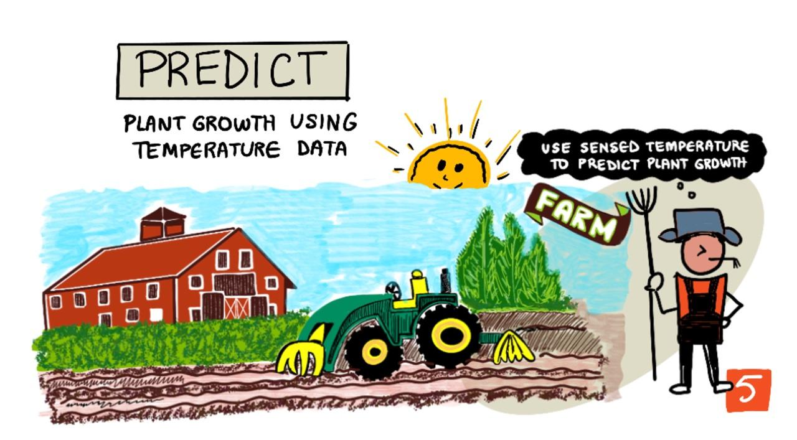

<!--
CO_OP_TRANSLATOR_METADATA:
{
  "original_hash": "d105b44deae539165855c976dcdeca99",
  "translation_date": "2025-08-27T20:59:54+00:00",
  "source_file": "2-farm/lessons/1-predict-plant-growth/README.md",
  "language_code": "fi"
}
-->
## Ennusta kasvien kasvua IoT:n avulla



> Sketchnote: [Nitya Narasimhan](https://github.com/nitya). Klikkaa kuvaa nähdäksesi suuremman version.

## Ennakkokysely

[Ennakkokysely](https://black-meadow-040d15503.1.azurestaticapps.net/quiz/9)

## Johdanto

Kasvit tarvitsevat tiettyjä asioita kasvaakseen - vettä, hiilidioksidia, ravinteita, valoa ja lämpöä. Tässä oppitunnissa opit laskemaan kasvien kasvun ja kypsymisen nopeutta mittaamalla ilman lämpötilaa.

Tässä oppitunnissa käsitellään:

* [Digitaalinen maatalous](../../../../../2-farm/lessons/1-predict-plant-growth)
* [Miksi lämpötila on tärkeä viljelyssä?](../../../../../2-farm/lessons/1-predict-plant-growth)
* [Mittaa ympäristön lämpötila](../../../../../2-farm/lessons/1-predict-plant-growth)
* [Kasvupäivien asteet (GDD)](../../../../../2-farm/lessons/1-predict-plant-growth)
* [Laske GDD lämpötila-anturin datan avulla](../../../../../2-farm/lessons/1-predict-plant-growth)

## Digitaalinen maatalous

Digitaalinen maatalous muuttaa viljelytapojamme, hyödyntäen työkaluja datan keräämiseen, tallentamiseen ja analysointiin. Olemme tällä hetkellä ajanjaksossa, jota Maailman talousfoorumi kutsuu "Neljänneksi teolliseksi vallankumoukseksi", ja digitaalisen maatalouden nousua on kutsuttu "Neljänneksi maatalousvallankumoukseksi" tai "Maatalous 4.0:ksi".

> 🎓 Termi "Digitaalinen maatalous" kattaa myös koko "maatalouden arvoketjun", eli matkan pellolta pöytään. Se sisältää tuotteen laadun seurannan kuljetuksen ja prosessoinnin aikana, varastointi- ja verkkokauppajärjestelmät, jopa traktoreiden vuokraussovellukset!

Nämä muutokset mahdollistavat viljelijöille suuremmat sadot, vähemmän lannoitteiden ja torjunta-aineiden käyttöä sekä tehokkaamman vedenkäytön. Vaikka näitä tekniikoita käytetään pääasiassa rikkaammissa maissa, anturit ja muut laitteet ovat hitaasti halventumassa, mikä tekee niistä saavutettavampia kehittyvissä maissa.

Joidenkin digitaalisen maatalouden mahdollistamien tekniikoiden esimerkkejä:

* Lämpötilan mittaus - lämpötilan mittaaminen auttaa viljelijöitä ennustamaan kasvien kasvua ja kypsymistä.
* Automaattinen kastelu - maaperän kosteuden mittaaminen ja kastelujärjestelmien käynnistäminen, kun maaperä on liian kuiva, sen sijaan että kastelu tapahtuisi ajastetusti. Ajastettu kastelu voi johtaa siihen, että kasvit saavat liian vähän vettä kuumalla ja kuivalla säällä tai liikaa vettä sateen aikana. Kastelun optimointi maaperän tarpeiden mukaan auttaa viljelijöitä käyttämään vettä tehokkaammin.
* Tuholaistorjunta - viljelijät voivat käyttää kameroita automatisoiduissa roboteissa tai droneissa tarkistaakseen tuholaisia ja levittää torjunta-aineita vain tarvittaviin paikkoihin, mikä vähentää torjunta-aineiden käyttöä ja niiden valumista paikallisiin vesistöihin.

✅ Tee tutkimusta. Mitä muita tekniikoita käytetään viljelytuottojen parantamiseen?

> 🎓 Termi "Tarkkuusmaatalous" tarkoittaa viljelykasvien tarkkailua, mittaamista ja niihin reagointia pelto- tai jopa osapeltotasolla. Tämä sisältää veden, ravinteiden ja tuholaisten määrän mittaamisen ja tarkat toimenpiteet, kuten kastelun vain pienelle osalle peltoa.

## Miksi lämpötila on tärkeä viljelyssä?

Kun opitaan kasveista, useimmat oppilaat saavat tietää veden, valon, hiilidioksidin ja ravinteiden tarpeellisuudesta. Kasvit tarvitsevat myös lämpöä kasvaakseen - siksi kasvit kukkivat keväällä lämpötilan noustessa, miksi lumikellot tai narsissit voivat puhjeta aikaisin lyhyen lämpimän jakson jälkeen, ja miksi kasvihuoneet ja lasihuoneet ovat niin hyviä kasvien kasvattamiseen.

> 🎓 Kasvihuoneet ja lasihuoneet tekevät samanlaista työtä, mutta tärkeällä erolla. Kasvihuoneet lämmitetään keinotekoisesti, mikä mahdollistaa lämpötilan tarkemman hallinnan, kun taas lasihuoneet luottavat auringon lämpöön, ja niiden hallinta rajoittuu yleensä ikkunoihin tai muihin aukkoihin, joista lämpöä päästetään ulos.

Kasveilla on perus- tai minimilämpötila, optimaalinen lämpötila ja maksimilämpötila, jotka kaikki perustuvat päivittäisiin keskilämpötiloihin.

* Peruslämpötila - tämä on minimipäivittäinen keskilämpötila, joka tarvitaan kasvin kasvuun.
* Optimaalinen lämpötila - tämä on paras päivittäinen keskilämpötila, joka tuottaa eniten kasvua.
* Maksimilämpötila - tämä on korkein lämpötila, jonka kasvi kestää. Tämän yläpuolella kasvi lopettaa kasvunsa yrittäen säästää vettä ja pysyä hengissä.

> 💁 Nämä ovat keskilämpötiloja, jotka on laskettu päivän ja yön lämpötilojen keskiarvona. Kasvit tarvitsevat myös erilaisia lämpötiloja päivällä ja yöllä, jotta ne voivat fotosyntetisoida tehokkaammin ja säästää energiaa yöllä.

Jokaisella kasvilajilla on erilaiset arvot perus-, optimaalisen ja maksimilämpötilan osalta. Siksi jotkut kasvit menestyvät kuumissa maissa ja toiset kylmissä maissa.

✅ Tee tutkimusta. Selvitä, mikä on peruslämpötila puutarhassasi, koulussasi tai paikallisessa puistossa oleville kasveille.


Yllä oleva kaavio näyttää esimerkin kasvunopeuden ja lämpötilan välisestä suhteesta. Peruslämpötilaan asti ei ole kasvua. Kasvunopeus kasvaa optimaaliseen lämpötilaan asti ja laskee sen jälkeen. Maksimilämpötilassa kasvu pysähtyy.

Tämän kaavion muoto vaihtelee kasvilajista toiseen. Joillakin kasveilla lasku optimaalisen lämpötilan jälkeen on jyrkempi, toisilla nousu peruslämpötilasta optimaaliseen on hitaampi.

> 💁 Viljelijän on saatava selville kolme lämpötilaarvoa ja ymmärrettävä kaavion muoto kasvatettaville kasveilleen saadakseen parhaan kasvun.

Jos viljelijä voi hallita lämpötilaa, esimerkiksi kaupallisessa kasvihuoneessa, hän voi optimoida kasvien kasvun. Esimerkiksi kaupallisessa kasvihuoneessa, jossa kasvatetaan tomaatteja, lämpötila asetetaan noin 25°C päivällä ja 20°C yöllä nopeimman kasvun saavuttamiseksi.

> 🍅 Yhdistämällä nämä lämpötilat keinotekoiseen valaistukseen, lannoitteisiin ja hallittuihin hiilidioksiditasoihin kaupalliset viljelijät voivat kasvattaa ja korjata satoa ympäri vuoden.

## Mittaa ympäristön lämpötila

Lämpötila-antureita voidaan käyttää IoT-laitteiden kanssa ympäristön lämpötilan mittaamiseen.

### Tehtävä - mittaa lämpötila

Seuraa sopivaa opasta lämpötilan seuraamiseksi IoT-laitteellasi:

* [Arduino - Wio Terminal](wio-terminal-temp.md)
* [Yksikorttitietokone - Raspberry Pi](pi-temp.md)
* [Yksikorttitietokone - Virtuaalinen laite](virtual-device-temp.md)

## Kasvupäivien asteet

Kasvupäivien asteet (tunnetaan myös nimellä kasvupäiväyksiköt) ovat tapa mitata kasvien kasvua lämpötilan perusteella. Olettaen, että kasvi saa riittävästi vettä, ravinteita ja hiilidioksidia, lämpötila määrittää kasvunopeuden.

Kasvupäivien asteet, eli GDD, lasketaan päivittäin päivän keskilämpötilana, joka ylittää kasvin peruslämpötilan. Jokainen kasvi tarvitsee tietyn määrän GDD:tä kasvaakseen, kukkiakseen tai tuottaakseen ja kypsyäkseen sadon. Mitä enemmän GDD:tä päivässä, sitä nopeammin kasvi kasvaa.

> 🇺🇸 Amerikkalaisille kasvupäivien asteet voidaan laskea myös Fahrenheit-asteina. 5 GDD (Celsius) vastaa 9 GDD (Fahrenheit).

Täydellinen GDD-kaava on hieman monimutkainen, mutta yksinkertaistettu yhtälö on usein hyvä arvio:


* **GDD** - tämä on kasvupäivien asteiden määrä
* **T max** - tämä on päivän maksimilämpötila Celsius-asteina
* **T min** - tämä on päivän minimilämpötila Celsius-asteina
* **T base** - tämä on kasvin peruslämpötila Celsius-asteina

> 💁 On olemassa muunnelmia, jotka käsittelevät T max yli 30°C tai T min alle T base, mutta jätämme nämä huomiotta tällä kertaa.

### Esimerkki - Maissi 🌽

Lajikkeesta riippuen maissi tarvitsee kypsyäkseen 800–2,700 GDD:tä, ja sen peruslämpötila on 10°C.

Ensimmäisenä päivänä, jolloin lämpötila ylitti peruslämpötilan, mitattiin seuraavat lämpötilat:

| Mittaus     | Lämpötila °C |
| :---------- | :----------: |
| Maksimi     | 16           |
| Minimi      | 12           |

Kun nämä luvut syötetään laskentaan:

* T max = 16
* T min = 12
* T base = 10

Tämä antaa laskennan:


Maissi sai 4 GDD:tä sinä päivänä. Oletetaan, että maissilajike tarvitsee kypsyäkseen 800 GDD:tä, jolloin se tarvitsee vielä 796 GDD:tä saavuttaakseen kypsyyden.

✅ Tee tutkimusta. Selvitä, kuinka monta GDD:tä puutarhassasi, koulussasi tai paikallisessa puistossa olevat kasvit tarvitsevat kypsyäkseen tai tuottaakseen satoa.

## Laske GDD lämpötila-anturin datan avulla

Kasvit eivät kasva kiinteinä päivämäärinä - esimerkiksi et voi istuttaa siementä ja tietää, että kasvi tuottaa hedelmiä tarkalleen 100 päivää myöhemmin. Sen sijaan viljelijä voi saada karkean käsityksen siitä, kuinka kauan kasvi kestää kasvaa, ja tarkistaa päivittäin, milloin sato on valmis.

Tällä on suuri työvoimavaikutus suurella tilalla, ja viljelijä voi missata sadon, joka on valmis odottamattoman aikaisin. Mittaamalla lämpötiloja viljelijä voi laskea kasvin saamat GDD:t, jolloin hänen tarvitsee tarkistaa vain lähellä odotettua kypsyyttä.

Keräämällä lämpötiladataa IoT-laitteella viljelijä voi saada automaattisen ilmoituksen, kun kasvit ovat lähellä kypsyyttä. Tyypillinen arkkitehtuuri tähän on, että IoT-laitteet mittaavat lämpötilaa ja lähettävät tämän telemetriadatan Internetin kautta esimerkiksi MQTT:n avulla. Palvelinkoodi kuuntelee tätä dataa ja tallentaa sen jonnekin, kuten tietokantaan. Näin dataa voidaan analysoida myöhemmin, esimerkiksi yöllä tehtävässä työssä, jossa lasketaan päivän GDD:t, summataan kunkin sadon tähän mennessä saadut GDD:t ja ilmoitetaan, jos kasvi on lähellä kypsyyttä.


Palvelinkoodi voi myös täydentää dataa lisäämällä lisätietoja. Esimerkiksi IoT-laite voi lähettää tunnisteen, joka kertoo, mikä laite on kyseessä, ja palvelinkoodi voi käyttää tätä tunnistetta laitteen sijainnin ja valvottavien kasvien selvittämiseen. Se voi myös lisätä perustietoja, kuten nykyisen ajan, koska jotkut IoT-laitteet eivät sisällä tarvittavaa laitteistoa tarkan ajan seuraamiseen tai vaativat lisäkoodia nykyisen ajan lukemiseen Internetistä.

✅ Miksi luulet, että eri pelloilla voi olla eri lämpötiloja?

### Tehtävä - julkaise lämpötilatiedot

Seuraa sopivaa opasta julkaistaksesi lämpötiladataa MQTT:n kautta IoT-laitteellasi, jotta sitä voidaan analysoida myöhemmin:

* [Arduino - Wio Terminal](wio-terminal-temp-publish.md)
* [Yksikorttitietokone - Raspberry Pi/Virtuaalinen IoT-laite](single-board-computer-temp-publish.md)

### Tehtävä - tallenna lämpötilatiedot

Kun IoT-laite julkaisee telemetriaa, palvelinkoodi voidaan kirjoittaa tilaamaan tämä data ja tallentamaan se. Sen sijaan, että data tallennettaisiin tietokantaan, palvelinkoodi tallentaa sen pilkkueroteltuun CSV-tiedostoon. CSV-tiedostot tallentavat dataa riveinä tekstinä, jossa jokainen arvo erotetaan pilkulla ja jokainen tietue on uudella rivillä. Ne ovat kätevä, ihmisen luettavissa oleva ja hyvin tuettu tapa tallentaa dataa tiedostona.

CSV-tiedostossa on kaksi saraketta - *päivämäärä* ja *lämpötila*. *Päivämäärä*-sarake asetetaan nykyiseksi päivämääräksi ja ajaksi, jolloin viesti vastaanotettiin palvelimella, ja *lämpötila* tulee telemetriaviestistä.

1. Toista oppitunnin 4 vaiheet luodaksesi palvelinkoodin telemetrian tilaamiseen. Sinun ei tarvitse lisätä koodia komentojen julkaisemiseen.

    Vaiheet tähän ovat:

    * Määritä ja aktivoi Python-virtuaaliympäristö

    * Asenna paho-mqtt pip-paketti

    * Kirjoita koodi kuuntelemaan MQTT-viestejä, jotka julkaistaan telemetria-aiheessa

      > ⚠️ Voit tarvittaessa viitata [ohjeisiin oppitunnissa 4 Python-sovelluksen luomiseksi telemetrian vastaanottamiseen](../../../1-getting-started/lessons/4-connect-internet/README.md#receive-telemetry-from-the-mqtt-broker).

    Nimeä tämän projektin kansio `temperature-sensor-server`.

1. Varmista, että `client_name` heijastaa tätä projektia:

    ```cpp
    client_name = id + 'temperature_sensor_server'
    ```

1. Lisää seuraavat tuonnit tiedoston alkuun, olemassa olevien tuontien alle:

    ```python
    from os import path
    import csv
    from datetime import datetime
    ```

    Tämä tuo kirjaston tiedostojen lukemiseen, kirjaston CSV-tiedostojen käsittelyyn ja kirjaston päivämäärien ja aikojen käsittelyyn.

1. Lisää seuraava koodi ennen `handle_telemetry`-funktiota:

    ```python
    temperature_file_name = 'temperature.csv'
    fieldnames = ['date', 'temperature']
    
    if not path.exists(temperature_file_name):
        with open(temperature_file_name, mode='w') as csv_file:
            writer = csv.DictWriter(csv_file, fieldnames=fieldnames)
            writer.writeheader()
    ```

    Tämä koodi määrittelee joitakin vakioita tiedoston nimeä ja CSV-tiedoston sarakeotsikoita varten. CSV-tiedoston ensimmäinen rivi sisältää perinteisesti sarakeotsikot pilkuilla eroteltuina.

    Koodi tarkistaa sitten, onko CSV-tiedosto jo olemassa. Jos sitä ei ole, se luodaan sarakeotsikoilla ensimmäisellä rivillä.

1. Lisää seuraava koodi `handle_telemetry`-funktion loppuun:

    ```python
    with open(temperature_file_name, mode='a') as temperature_file:        
        temperature_writer = csv.DictWriter(temperature_file, fieldnames=fieldnames)
        temperature_writer.writerow({'date' : datetime.now().astimezone().replace(microsecond=0).isoformat(), 'temperature' : payload['temperature']})
    ```
Tämä koodi avaa CSV-tiedoston ja lisää uuden rivin sen loppuun. Rivi sisältää nykyisen päivämäärän ja ajan ihmisen luettavassa muodossa, sekä IoT-laitteelta saadun lämpötilan. Tiedot tallennetaan [ISO 8601 -muodossa](https://wikipedia.org/wiki/ISO_8601) aikavyöhykkeen kanssa, mutta ilman mikrosekunteja.

1. Suorita tämä koodi samalla tavalla kuin aiemmin, varmistaen, että IoT-laitteesi lähettää dataa. Kansiosta luodaan CSV-tiedosto nimeltä `temperature.csv`. Kun tarkastelet sitä, näet päivämäärät/ajat ja lämpötilamittaukset:

    ```output
    date,temperature
    2021-04-19T17:21:36-07:00,25
    2021-04-19T17:31:36-07:00,24
    2021-04-19T17:41:36-07:00,25
    ```

1. Suorita tätä koodia jonkin aikaa datan keräämiseksi. Ihanteellisesti sinun tulisi ajaa tätä koko päivän ajan kerätäksesi tarpeeksi dataa GDD-laskelmia varten.

    
> 💁 Jos käytät virtuaalista IoT-laitetta, valitse satunnaisuus-valintaruutu ja aseta vaihteluväli välttääksesi saman lämpötilan saamisen joka kerta, kun lämpötila-arvo palautetaan.
     

    > 💁 Jos haluat ajaa tätä koko päivän ajan, sinun täytyy varmistaa, että tietokone, jossa palvelinkoodisi pyörii, ei mene lepotilaan. Voit tehdä tämän muuttamalla virta-asetuksia tai käyttämällä esimerkiksi [tätä Python-skriptiä, joka pitää järjestelmän aktiivisena](https://github.com/jaqsparow/keep-system-active).
    
> 💁 Löydät tämän koodin [code-server/temperature-sensor-server](../../../../../2-farm/lessons/1-predict-plant-growth/code-server/temperature-sensor-server) -kansiosta.

### Tehtävä - laske GDD tallennettujen tietojen avulla

Kun palvelin on kerännyt lämpötiladataa, kasvin GDD voidaan laskea.

Manuaaliset vaiheet tähän ovat:

1. Selvitä kasvin peruslämpötila. Esimerkiksi mansikoille peruslämpötila on 10°C.

1. Etsi `temperature.csv`-tiedostosta päivän korkeimmat ja matalimmat lämpötilat.

1. Käytä aiemmin annettua GDD-laskentakaavaa GDD:n laskemiseen.

Esimerkiksi, jos päivän korkein lämpötila on 25°C ja matalin 12°C:


* 25 + 12 = 37
* 37 / 2 = 18.5
* 18.5 - 10 = 8.5

Näin ollen mansikat ovat saaneet **8.5** GDD:tä. Mansikat tarvitsevat noin 250 GDD:tä tuottaakseen hedelmiä, joten vielä on matkaa.

---

## 🚀 Haaste

Kasvit tarvitsevat muutakin kuin lämpöä kasvaakseen. Mitä muita asioita tarvitaan?

Näitä varten selvitä, onko olemassa sensoreita, jotka voivat mitata niitä. Entä aktuaattorit näiden tasojen hallintaan? Miten voisit yhdistää yhden tai useamman IoT-laitteen optimoidaksesi kasvien kasvua?

## Luentojälkeinen kysely

[Luentojälkeinen kysely](https://black-meadow-040d15503.1.azurestaticapps.net/quiz/10)

## Katsaus & Itseopiskelu

* Lue lisää digitaalisesta maataloudesta [Digital Agriculture Wikipedia -sivulta](https://wikipedia.org/wiki/Digital_agriculture). Lue myös tarkkuusmaataloudesta [Precision Agriculture Wikipedia -sivulta](https://wikipedia.org/wiki/Precision_agriculture).
* Täydellinen kasvupäivälaskenta on monimutkaisempi kuin tässä annettu yksinkertaistettu versio. Lue lisää monimutkaisemmasta yhtälöstä ja siitä, miten käsitellä lämpötiloja, jotka ovat peruslämpötilan alapuolella, [Growing Degree Day Wikipedia -sivulta](https://wikipedia.org/wiki/Growing_degree-day).
* Ruoka voi olla tulevaisuudessa niukkaa, jos käytämme edelleen samoja viljelymenetelmiä. Opi lisää huipputeknologian viljelytekniikoista tässä [Hi-Tech Farms of Future -videossa YouTubessa](https://www.youtube.com/watch?v=KIEOuKD9KX8).

## Tehtävä

[Visualisoi GDD-data Jupyter Notebookilla](assignment.md)

---

**Vastuuvapauslauseke**:  
Tämä asiakirja on käännetty käyttämällä tekoälypohjaista käännöspalvelua [Co-op Translator](https://github.com/Azure/co-op-translator). Vaikka pyrimme tarkkuuteen, huomioithan, että automaattiset käännökset voivat sisältää virheitä tai epätarkkuuksia. Alkuperäinen asiakirja sen alkuperäisellä kielellä tulisi pitää ensisijaisena lähteenä. Kriittisen tiedon osalta suositellaan ammattimaista ihmiskäännöstä. Emme ole vastuussa väärinkäsityksistä tai virhetulkinnoista, jotka johtuvat tämän käännöksen käytöstä.