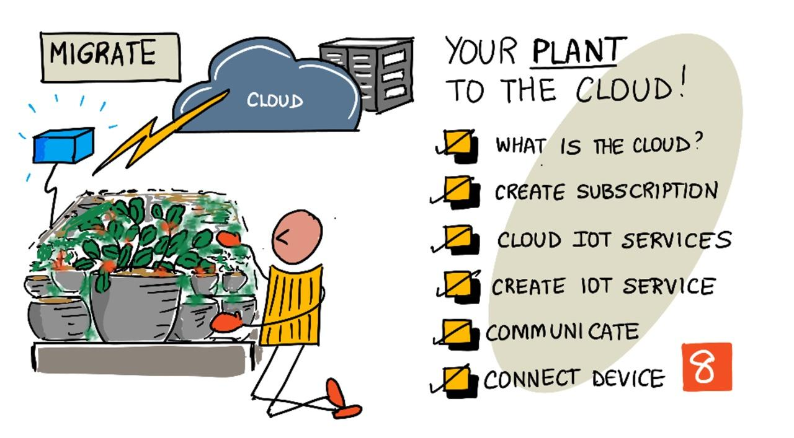

<!--
CO_OP_TRANSLATOR_METADATA:
{
  "original_hash": "4d8e7a066d75b625e7a979c14157041d",
  "translation_date": "2025-08-27T21:28:23+00:00",
  "source_file": "2-farm/lessons/4-migrate-your-plant-to-the-cloud/README.md",
  "language_code": "fi"
}
-->
# Siirrä kasvisi pilveen



> Sketchnote: [Nitya Narasimhan](https://github.com/nitya). Klikkaa kuvaa nähdäksesi suuremman version.

Tämä oppitunti oli osa [IoT for Beginners Project 2 - Digital Agriculture -sarjaa](https://youtube.com/playlist?list=PLmsFUfdnGr3yCutmcVg6eAUEfsGiFXgcx), jonka tuotti [Microsoft Reactor](https://developer.microsoft.com/reactor/?WT.mc_id=academic-17441-jabenn).

[](https://youtu.be/bNxjopXkhvk)

## Ennakkokysely

[Ennakkokysely](https://black-meadow-040d15503.1.azurestaticapps.net/quiz/15)

## Johdanto

Edellisessä oppitunnissa opit yhdistämään kasvisi MQTT-välityspalvelimeen ja ohjaamaan relettä paikallisesti toimivalla palvelinkoodilla. Tämä muodostaa perustan internetiin yhdistetylle automaattiselle kastelujärjestelmälle, jota voidaan käyttää yksittäisistä kotikasveista aina kaupallisiin maatiloihin asti.

IoT-laite kommunikoi julkisen MQTT-välityspalvelimen kanssa periaatteiden havainnollistamiseksi, mutta tämä ei ole luotettavin tai turvallisin tapa. Tässä oppitunnissa opit pilvipalveluista ja IoT-ominaisuuksista, joita julkiset pilvipalvelut tarjoavat. Lisäksi opit, kuinka voit siirtää kasvisi julkisesta MQTT-välityspalvelimesta yhteen näistä pilvipalveluista.

Tässä oppitunnissa käsitellään:

* [Mikä on pilvi?](../../../../../2-farm/lessons/4-migrate-your-plant-to-the-cloud)
* [Luo pilvitilaus](../../../../../2-farm/lessons/4-migrate-your-plant-to-the-cloud)
* [Pilven IoT-palvelut](../../../../../2-farm/lessons/4-migrate-your-plant-to-the-cloud)
* [Luo IoT-palvelu pilvessä](../../../../../2-farm/lessons/4-migrate-your-plant-to-the-cloud)
* [Kommunikoi IoT Hubin kanssa](../../../../../2-farm/lessons/4-migrate-your-plant-to-the-cloud)
* [Yhdistä laitteesi IoT-palveluun](../../../../../2-farm/lessons/4-migrate-your-plant-to-the-cloud)

## Mikä on pilvi?

Ennen pilvipalveluita yritykset, jotka halusivat tarjota palveluita työntekijöilleen (esim. tietokantoja tai tiedostojen tallennusta) tai yleisölle (esim. verkkosivustoja), rakensivat ja ylläpitivät omia datakeskuksiaan. Tämä vaihteli pienestä huoneesta, jossa oli muutama tietokone, aina kokonaisiin rakennuksiin, joissa oli satoja tietokoneita. Yritykset vastasivat kaikesta, mukaan lukien:

* Tietokoneiden hankinta
* Laitteiston ylläpito
* Sähkö ja jäähdytys
* Verkkoyhteydet
* Turvallisuus, mukaan lukien rakennuksen ja ohjelmistojen suojaaminen
* Ohjelmistojen asennus ja päivitykset

Tämä oli usein erittäin kallista, vaati laajaa osaamista ja oli hidasta muuttaa tarpeiden mukaan. Esimerkiksi, jos verkkokauppa halusi valmistautua kiireiseen joulusesonkiin, sen piti suunnitella kuukausia etukäteen hankkiakseen lisää laitteistoa, konfiguroidakseen sen ja asentaakseen tarvittavat ohjelmistot. Kun sesonki oli ohi ja myynti laski, yritykselle jäi käyttämättömiä tietokoneita odottamaan seuraavaa kiireistä kautta.

✅ Uskotko, että tämä mahdollisti yritysten nopean reagoinnin? Jos esimerkiksi verkkovaateliike nousisi yhtäkkiä suosioon julkkiksen käyttämien vaatteiden ansiosta, pystyisikö se lisäämään laskentatehoaan riittävän nopeasti vastatakseen tilauspiikkiin?

### Jonkun toisen tietokone

Pilveä kutsutaan usein vitsikkäästi "jonkun toisen tietokoneeksi". Alkuperäinen idea oli yksinkertainen – tietokoneiden ostamisen sijaan vuokrataan jonkun toisen tietokone. Pilvipalveluntarjoaja hallinnoi valtavia datakeskuksia ja vastaa kaikesta: laitteiston hankinnasta ja asennuksesta, sähkön ja jäähdytyksen hallinnasta, verkkoyhteyksistä, rakennusten turvallisuudesta sekä laitteiston ja ohjelmistojen päivityksistä. Asiakkaana vuokraat tarvitsemasi tietokoneet, lisäät kapasiteettia kysynnän kasvaessa ja vähennät sitä kysynnän laskiessa. Näitä pilvidatakeskuksia on ympäri maailmaa.


Nämä datakeskukset voivat olla useiden neliökilometrien kokoisia. Yllä olevat kuvat on otettu muutama vuosi sitten Microsoftin pilvidatakeskuksesta, ja ne näyttävät keskuksen alkuperäisen koon sekä suunnitellun laajennuksen. Laajennusta varten raivattu alue on yli 5 neliökilometriä.

> 💁 Nämä datakeskukset kuluttavat niin paljon energiaa, että joillakin on omat voimalaitoksensa. Suuren kokonsa ja pilvipalveluntarjoajien investointien ansiosta ne ovat yleensä erittäin ympäristöystävällisiä. Ne ovat tehokkaampia kuin lukuisat pienet datakeskukset, toimivat pääosin uusiutuvalla energialla, ja pilvipalveluntarjoajat pyrkivät vähentämään jätettä, säästämään vettä ja istuttamaan uusia metsiä korvaamaan rakennustöiden vuoksi kaadetut metsät. Voit lukea lisää pilvipalveluntarjoajien kestävän kehityksen toimista [Azure Sustainability -sivustolta](https://azure.microsoft.com/global-infrastructure/sustainability/?WT.mc_id=academic-17441-jabenn).

✅ Tee tutkimusta: Lue suurista pilvipalveluista, kuten [Microsoftin Azure](https://azure.microsoft.com/?WT.mc_id=academic-17441-jabenn) tai [Googlen GCP](https://cloud.google.com). Kuinka monta datakeskusta niillä on ja missä ne sijaitsevat?

Pilven käyttö alentaa yritysten kustannuksia ja antaa niiden keskittyä ydinosaamiseensa, jättäen pilvipalveluiden asiantuntemuksen palveluntarjoajalle. Yritysten ei enää tarvitse vuokrata tai ostaa datakeskustilaa, maksaa eri palveluntarjoajille yhteyksistä ja sähköstä tai palkata asiantuntijoita. Sen sijaan ne voivat maksaa yhden kuukausilaskun pilvipalveluntarjoajalle, joka huolehtii kaikesta.

Pilvipalveluntarjoajat voivat hyödyntää mittakaavaetuja alentamaan kustannuksia, ostamalla laitteistoa suurissa erissä halvemmalla, investoimalla työkaluihin ylläpitotyön vähentämiseksi ja jopa suunnittelemalla ja rakentamalla omaa laitteistoaan parantaakseen pilvipalveluitaan.

### Microsoft Azure

Azure on Microsoftin kehittäjille suunnattu pilvipalvelu, ja tätä pilvipalvelua käytät näissä oppitunneissa. Alla oleva video antaa lyhyen yleiskatsauksen Azuresta:

[](https://www.microsoft.com/videoplayer/embed/RE4Ibng?WT.mc_id=academic-17441-jabenn)

## Luo pilvitilaus

Jotta voit käyttää pilvipalveluita, sinun on rekisteröidyttävä pilvipalveluntarjoajan tilaukseen. Tässä oppitunnissa rekisteröidyt Microsoft Azuren tilaukseen. Jos sinulla on jo Azure-tilaus, voit ohittaa tämän tehtävän. Alla kuvatut tilausvaihtoehdot ovat ajankohtaisia kirjoitushetkellä, mutta ne voivat muuttua.

> 💁 Jos käytät näitä oppitunteja koulusi kautta, sinulla saattaa jo olla käytössä Azure-tilaus. Tarkista asia opettajaltasi.

On olemassa kaksi erilaista ilmaista Azure-tilausta, joihin voit rekisteröityä:

* **Azure for Students** - Tämä tilaus on suunnattu yli 18-vuotiaille opiskelijoille. Rekisteröitymiseen ei tarvita luottokorttia, ja koulun sähköpostiosoitetta käytetään opiskelijastatuksen vahvistamiseen. Rekisteröityessäsi saat 100 Yhdysvaltain dollaria käytettäväksi pilvipalveluihin sekä ilmaisia palveluita, kuten ilmaisen version IoT-palvelusta. Tämä kestää 12 kuukautta, ja voit uusia sen vuosittain niin kauan kuin olet opiskelija.

* **Azure Free Subscription** - Tämä tilaus on tarkoitettu kaikille, jotka eivät ole opiskelijoita. Rekisteröitymiseen tarvitaan luottokortti, mutta korttia ei veloiteta, vaan sitä käytetään vain henkilöllisyyden vahvistamiseen. Saat 200 dollaria luottoa käytettäväksi ensimmäisten 30 päivän aikana mihin tahansa palveluun sekä ilmaisia Azure-palveluiden tasoja. Kun luotto on käytetty, korttiasi ei veloiteta, ellei tilausta muuteta maksulliseksi.

> 💁 Microsoft tarjoaa myös Azure for Students Starter -tilauksen alle 18-vuotiaille opiskelijoille, mutta kirjoitushetkellä tämä ei tue IoT-palveluita.

### Tehtävä - rekisteröidy ilmaiseen pilvitilaukseen

Jos olet yli 18-vuotias opiskelija, voit rekisteröityä Azure for Students -tilaukseen. Sinun on vahvistettava koulun sähköpostiosoitteesi. Tämä voidaan tehdä kahdella tavalla:

* Rekisteröidy GitHubin opiskelijakehittäjäpakettiin osoitteessa [education.github.com/pack](https://education.github.com/pack). Tämä antaa sinulle pääsyn useisiin työkaluihin ja tarjouksiin, mukaan lukien GitHub ja Microsoft Azure. Kun olet rekisteröitynyt kehittäjäpakettiin, voit aktivoida Azure for Students -tarjouksen.

* Rekisteröidy suoraan Azure for Students -tilaukseen osoitteessa [azure.microsoft.com/free/students](https://azure.microsoft.com/free/students/?WT.mc_id=academic-17441-jabenn).

> ⚠️ Jos koulun sähköpostiosoitettasi ei tunnisteta, luo [ongelma tähän repoihin](https://github.com/Microsoft/IoT-For-Beginners/issues), niin yritämme lisätä sen Azure for Students -sallittujen listalle.

Jos et ole opiskelija tai sinulla ei ole voimassa olevaa koulun sähköpostiosoitetta, voit rekisteröityä Azure Free -tilaukseen.

* Rekisteröidy Azure Free -tilaukseen osoitteessa [azure.microsoft.com/free](https://azure.microsoft.com/free/?WT.mc_id=academic-17441-jabenn)

## Pilven IoT-palvelut

Käyttämäsi julkinen testikäyttöön tarkoitettu MQTT-välityspalvelin on loistava työkalu oppimiseen, mutta sillä on useita haittoja kaupallisessa käytössä:

* Luotettavuus - se on ilmainen palvelu ilman takuita, ja se voidaan sulkea milloin tahansa
* Turvallisuus - se on julkinen, joten kuka tahansa voi kuunnella telemetriatietojasi tai lähettää komentoja laitteidesi ohjaamiseksi
* Suorituskyky - se on suunniteltu vain muutamille testiviesteille, joten se ei kestä suurta viestimäärää
* Löydettävyys - ei ole keinoa tietää, mitkä laitteet ovat yhteydessä

Pilven IoT-palvelut ratkaisevat nämä ongelmat. Niitä ylläpitävät suuret pilvipalveluntarjoajat, jotka investoivat voimakkaasti luotettavuuteen ja ovat valmiina korjaamaan mahdolliset ongelmat. Niissä on sisäänrakennettu turvallisuus, joka estää hakkereita lukemasta tietojasi tai lähettämästä vääriä komentoja. Ne ovat myös erittäin suorituskykyisiä, pystyvät käsittelemään miljoonia viestejä päivittäin ja hyödyntävät pilven skaalautuvuutta tarpeen mukaan.

> 💁 Vaikka näistä eduista maksetaan kuukausimaksu, useimmat pilvipalveluntarjoajat tarjoavat ilmaisen version IoT-palvelustaan, jossa on rajoitettu määrä viestejä päivässä tai laitteita, jotka voivat yhdistää. Tämä ilmainen versio on yleensä enemmän kuin tarpeeksi kehittäjälle palvelun oppimiseen. Tässä oppitunnissa käytät ilmaista versiota.

IoT-laitteet yhdistävät pilvipalveluun joko laite-SDK:n (kirjasto, joka tarjoaa koodia palvelun ominaisuuksien hyödyntämiseen) avulla tai suoraan viestintäprotokollan, kuten MQTT:n tai HTTP:n, kautta. Laite-SDK on yleensä helpoin tapa, koska se hoitaa kaiken puolestasi, kuten tietää, mitä aiheita julkaista tai tilata, ja miten käsitellä turvallisuutta.


Laitteesi kommunikoi sitten sovelluksesi muiden osien kanssa tämän palvelun kautta – samalla tavalla kuin lähetit telemetriatietoja ja vastaanotit komentoja MQTT:n kautta. Tämä tapahtuu yleensä palvelu-SDK:n tai vastaavan kirjaston avulla. Viestit tulevat laitteeltasi palveluun, jossa sovelluksesi muut osat voivat lukea ne, ja viestit voidaan lähettää takaisin laitteellesi.


Nämä palvelut toteuttavat turvallisuuden tietämällä kaikista laitteista, jotka voivat yhdistää ja lähettää tietoja, joko rekisteröimällä laitteet etukäteen palveluun tai antamalla laitteille salaisia avaimia tai varmenteita, joita ne voivat käyttää rekisteröityessään palveluun ensimmäistä kertaa. Tuntemattomat laitteet eivät voi yhdistää; jos ne yrittävät, palvelu hylkää yhteyden ja jättää niiden lähettämät viestit huomiotta.

✅ Tee tutkimusta: Mitä haittoja on avoimessa IoT-palvelussa, johon mikä tahansa laite tai koodi voi yhdistää? Löydätkö esimerkkejä hakkereista, jotka ovat hyödyntäneet tällaisia palveluita?

Sovelluksesi muut osat voivat yhdistää IoT-palveluun ja saada tietoa kaikista yhdistetyistä tai rekisteröidyistä laitteista sekä kommunikoida niiden kanssa suoraan joko yksittäin tai massana.
💁 IoT-palvelut toteuttavat myös lisäominaisuuksia, ja pilvipalveluntarjoajilla on lisäpalveluita ja sovelluksia, jotka voidaan yhdistää palveluun. Esimerkiksi, jos haluat tallentaa kaikki laitteiden lähettämät telemetriaviestit tietokantaan, pilvipalveluntarjoajan asetustyökalussa on yleensä vain muutama klikkaus, jotta palvelu voidaan yhdistää tietokantaan ja dataa voidaan alkaa siirtää sinne.
## Luo IoT-palvelu pilveen

Nyt kun sinulla on Azure-tilaus, voit rekisteröityä IoT-palveluun. Microsoftin IoT-palvelu tunnetaan nimellä Azure IoT Hub.


Alla oleva video antaa lyhyen yleiskatsauksen Azure IoT Hubista:

[](https://www.youtube.com/watch?v=smuZaZZXKsU)

> 🎥 Klikkaa yllä olevaa kuvaa katsoaksesi videon

✅ Käytä hetki aikaa tutkiaksesi ja lue IoT Hubin yleiskatsaus [Microsoft IoT Hub -dokumentaatiosta](https://docs.microsoft.com/azure/iot-hub/about-iot-hub?WT.mc_id=academic-17441-jabenn).

Azure-pilvipalvelut voidaan määrittää joko verkkopohjaisen portaalin kautta tai komentorivikäyttöliittymän (CLI) avulla. Tässä tehtävässä käytät CLI:tä.

### Tehtävä - asenna Azure CLI

Jotta voit käyttää Azure CLI:tä, se on ensin asennettava tietokoneellesi tai Macillesi.

1. Seuraa ohjeita [Azure CLI -dokumentaatiossa](https://docs.microsoft.com/cli/azure/install-azure-cli?WT.mc_id=academic-17441-jabenn) asentaaksesi CLI:n.

1. Azure CLI tukee useita laajennuksia, jotka lisäävät ominaisuuksia monenlaisten Azure-palveluiden hallintaan. Asenna IoT-laajennus suorittamalla seuraava komento komentoriviltäsi tai terminaalistasi:

    ```sh
    az extension add --name azure-iot
    ```

1. Suorita seuraava komento komentoriviltäsi tai terminaalistasi kirjautuaksesi Azure-tilaukseesi Azure CLI:n kautta.

    ```sh
    az login
    ```

    Oletusselaimessasi avautuu verkkosivu. Kirjaudu sisään käyttämällä tiliä, jolla rekisteröidyit Azure-tilaukseen. Kun olet kirjautunut sisään, voit sulkea selainvälilehden.

1. Jos sinulla on useita Azure-tilauksia, kuten koulun tarjoama ja oma Azure for Students -tilaus, sinun on valittava, mitä haluat käyttää. Suorita seuraava komento nähdäksesi kaikki tilaukset, joihin sinulla on pääsy:

    ```sh
    az account list --output table
    ```

    Tulosteessa näet jokaisen tilauksen nimen ja sen `SubscriptionId`-tunnuksen.

    ```output
    ➜  ~ az account list --output table
    Name                    CloudName    SubscriptionId                        State    IsDefault
    ----------------------  -----------  ------------------------------------  -------  -----------
    School-subscription     AzureCloud   cb30cde9-814a-42f0-a111-754cb788e4e1  Enabled  True
    Azure for Students      AzureCloud   fa51c31b-162c-4599-add6-781def2e1fbf  Enabled  False
    ```

    Valitse haluamasi tilaus seuraavalla komennolla:

    ```sh
    az account set --subscription <SubscriptionId>
    ```

    Korvaa `<SubscriptionId>` sen tilauksen tunnuksella, jota haluat käyttää. Suoritettuasi tämän komennon, suorita komento uudelleen nähdäksesi tilisi. Näet, että `IsDefault`-sarake on merkitty `True`:ksi valitsemallesi tilaukselle.

### Tehtävä - luo resurssiryhmä

Azure-palvelut, kuten IoT Hub -instanssit, virtuaalikoneet, tietokannat tai tekoälypalvelut, tunnetaan nimellä **resurssit**. Jokaisen resurssin on kuuluttava **resurssiryhmään**, joka on looginen ryhmä yhdelle tai useammalle resurssille.

> 💁 Resurssiryhmien käyttö mahdollistaa useiden palveluiden hallinnan kerralla. Esimerkiksi, kun olet suorittanut kaikki tämän projektin oppitunnit, voit poistaa resurssiryhmän, jolloin kaikki sen sisältämät resurssit poistetaan automaattisesti.

1. Azurella on useita datakeskuksia ympäri maailmaa, ja ne on jaettu alueisiin. Kun luot Azure-resurssin tai resurssiryhmän, sinun on määritettävä, mihin haluat sen luotavan. Suorita seuraava komento saadaksesi luettelon sijainneista:

    ```sh
    az account list-locations --output table
    ```

    Näet pitkän luettelon sijainneista.

    > 💁 Tämän kirjoitushetkellä on 65 sijaintia, joihin voit sijoittaa resursseja.

    ```output
        ➜  ~ az account list-locations --output table
    DisplayName               Name                 RegionalDisplayName
    ------------------------  -------------------  -------------------------------------
    East US                   eastus               (US) East US
    East US 2                 eastus2              (US) East US 2
    South Central US          southcentralus       (US) South Central US
    ...
    ```

    Kirjoita muistiin lähimmän alueen `Name`-sarakkeen arvo. Voit tarkastella alueita kartalla [Azure geographies -sivulla](https://azure.microsoft.com/global-infrastructure/geographies/?WT.mc_id=academic-17441-jabenn).

1. Suorita seuraava komento luodaksesi resurssiryhmän nimeltä `soil-moisture-sensor`. Resurssiryhmän nimien on oltava yksilöllisiä tilauksessasi.

    ```sh
    az group create --name soil-moisture-sensor \
                    --location <location>
    ```

    Korvaa `<location>` valitsemallasi sijainnilla edellisessä vaiheessa.

### Tehtävä - luo IoT Hub

Nyt voit luoda IoT Hub -resurssin resurssiryhmääsi.

1. Käytä seuraavaa komentoa luodaksesi IoT Hub -resurssisi:

    ```sh
    az iot hub create --resource-group soil-moisture-sensor \
                      --sku F1 \
                      --partition-count 2 \
                      --name <hub_name>
    ```

    Korvaa `<hub_name>` hubillesi valitsemallasi nimellä. Nimen on oltava maailmanlaajuisesti yksilöllinen – toisin sanoen, mikään muu IoT Hub ei voi käyttää samaa nimeä. Tätä nimeä käytetään URL-osoitteessa, joka osoittaa hubiin, joten sen on oltava ainutlaatuinen. Käytä esimerkiksi `soil-moisture-sensor-` ja lisää loppuun yksilöllinen tunniste, kuten satunnaisia sanoja tai nimesi.

    `--sku F1` -vaihtoehto määrittää ilmaisen tason käytettäväksi. Ilmainen taso tukee 8 000 viestiä päivässä ja sisältää suurimman osan maksullisten tasojen ominaisuuksista.

    > 🎓 Eri Azure-palveluiden hinnoittelutasot tunnetaan nimellä tierit. Jokaisella tasolla on eri kustannukset ja ne tarjoavat erilaisia ominaisuuksia tai datamääriä.

    > 💁 Jos haluat oppia lisää hinnoittelusta, voit tutustua [Azure IoT Hub -hinnoitteluoppaaseen](https://azure.microsoft.com/pricing/details/iot-hub/?WT.mc_id=academic-17441-jabenn).

    `--partition-count 2` -vaihtoehto määrittää, kuinka monta datavirtaa IoT Hub tukee. Useammat osiot vähentävät datan tukkeutumista, kun useat tahot lukevat ja kirjoittavat IoT Hubiin. Osioiden käsittely on tämän oppitunnin ulkopuolella, mutta tämä arvo on asetettava ilmaisen tason IoT Hubin luomiseksi.

    > 💁 Voit luoda vain yhden ilmaisen tason IoT Hubin per tilaus.

IoT Hub luodaan. Tämä voi kestää minuutin tai kaksi.

## Kommunikoi IoT Hubin kanssa

Edellisessä oppitunnissa käytit MQTT:tä ja lähetit viestejä eri aiheisiin, joilla oli eri tarkoituksia. Sen sijaan, että viestit lähetettäisiin eri aiheiden kautta, IoT Hubilla on useita määriteltyjä tapoja, joilla laite voi kommunikoida hubin kanssa tai hubi laitteen kanssa.

> 💁 IoT Hubin ja laitteen välinen viestintä voi käyttää taustalla MQTT:tä, HTTPS:ää tai AMQP:tä.

* Laitteesta pilveen (D2C) -viestit – nämä ovat viestejä, jotka lähetetään laitteesta IoT Hubiin, kuten telemetriatietoja. Sovelluskoodisi voi lukea ne IoT Hubista.

    > 🎓 Taustalla IoT Hub käyttää Azure-palvelua nimeltä [Event Hubs](https://docs.microsoft.com/azure/event-hubs/?WT.mc_id=academic-17441-jabenn). Kun kirjoitat koodia lukemaan hubiin lähetettyjä viestejä, niitä kutsutaan usein tapahtumiksi.

* Pilvestä laitteeseen (C2D) -viestit – nämä ovat viestejä, jotka lähetetään sovelluskoodista IoT Hubin kautta IoT-laitteelle.

* Suorat metodipyynnöt – nämä ovat viestejä, jotka lähetetään sovelluskoodista IoT Hubin kautta IoT-laitteelle pyytämään laitteen suorittamaan jokin toiminto, kuten aktuaattorin ohjaaminen. Näihin viesteihin vaaditaan vastaus, jotta sovelluskoodi voi varmistaa, että pyyntö käsiteltiin onnistuneesti.

* Laitetwin – nämä ovat JSON-dokumentteja, jotka synkronoidaan laitteen ja IoT Hubin välillä. Niitä käytetään tallentamaan asetuksia tai muita ominaisuuksia, jotka joko laite raportoi tai jotka IoT Hubin tulisi asettaa laitteelle (kutsutaan halutuiksi ominaisuuksiksi).

IoT Hub voi tallentaa viestejä ja suoria metodipyyntöjä määritettävissä olevan ajan (oletuksena yksi päivä), joten jos laite tai sovelluskoodi menettää yhteyden, se voi silti noutaa viestit, jotka lähetettiin sen ollessa offline-tilassa, kun se yhdistää uudelleen. Laitetwin tallennetaan pysyvästi IoT Hubiin, joten laite voi milloin tahansa yhdistää uudelleen ja saada viimeisimmän laitetwinin.

✅ Tee tutkimusta: Lue lisää näistä viestityypeistä [Laitteesta pilveen -viestintäohjeista](https://docs.microsoft.com/azure/iot-hub/iot-hub-devguide-d2c-guidance?WT.mc_id=academic-17441-jabenn) ja [Pilvestä laitteeseen -viestintäohjeista](https://docs.microsoft.com/azure/iot-hub/iot-hub-devguide-c2d-guidance?WT.mc_id=academic-17441-jabenn) IoT Hub -dokumentaatiossa.

## Yhdistä laitteesi IoT-palveluun

Kun hubi on luotu, IoT-laitteesi voi yhdistää siihen. Vain rekisteröidyt laitteet voivat yhdistää palveluun, joten sinun on ensin rekisteröitävä laitteesi. Rekisteröinnin yhteydessä saat yhteysmerkkijonon, jota laite voi käyttää yhdistämiseen. Tämä yhteysmerkkijono on laitekohtainen ja sisältää tietoja IoT Hubista, laitteesta ja salaisen avaimen, joka mahdollistaa laitteen yhdistämisen.

> 🎓 Yhteysmerkkijono on yleinen termi tekstille, joka sisältää yhteystiedot. Näitä käytetään yhdistettäessä IoT Hubeihin, tietokantoihin ja moniin muihin palveluihin. Ne sisältävät yleensä palvelun tunnisteen, kuten URL-osoitteen, ja turvallisuustiedot, kuten salaisen avaimen. Näitä välitetään SDK:ille palveluun yhdistämistä varten.

> ⚠️ Yhteysmerkkijonot on pidettävä turvassa! Turvallisuutta käsitellään tarkemmin tulevassa oppitunnissa.

### Tehtävä - rekisteröi IoT-laitteesi

IoT-laite voidaan rekisteröidä IoT Hubiisi Azure CLI:n avulla.

1. Suorita seuraava komento rekisteröidäksesi laitteen:

    ```sh
    az iot hub device-identity create --device-id soil-moisture-sensor \
                                      --hub-name <hub_name>
    ```

    Korvaa `<hub_name>` IoT Hubillesi valitsemallasi nimellä.

    Tämä luo laitteen, jonka tunnus on `soil-moisture-sensor`.

1. Kun IoT-laitteesi yhdistää IoT Hubiisi SDK:n avulla, sen on käytettävä yhteysmerkkijonoa, joka antaa hubin URL-osoitteen ja salaisen avaimen. Suorita seuraava komento saadaksesi yhteysmerkkijonon:

    ```sh
    az iot hub device-identity connection-string show --device-id soil-moisture-sensor \
                                                      --output table \
                                                      --hub-name <hub_name>
    ```

    Korvaa `<hub_name>` IoT Hubillesi valitsemallasi nimellä.

1. Tallenna tulosteessa näkyvä yhteysmerkkijono, sillä tarvitset sitä myöhemmin.

### Tehtävä - yhdistä IoT-laitteesi pilveen

Käy läpi asiaankuuluva opas yhdistääksesi IoT-laitteesi pilveen:

* [Arduino - Wio Terminal](wio-terminal-connect-hub.md)
* [Yksikorttitietokone - Raspberry Pi/virtuaalinen IoT-laite](single-board-computer-connect-hub.md)

### Tehtävä - seuraa tapahtumia

Tällä hetkellä et päivitä palvelinkoodiasi. Sen sijaan voit käyttää Azure CLI:tä seurataksesi IoT-laitteesi lähettämiä tapahtumia.

1. Varmista, että IoT-laitteesi on käynnissä ja lähettää maaperän kosteuden telemetriatietoja.

1. Suorita seuraava komento komentorivilläsi tai terminaalissasi seurataksesi IoT-laitteesi IoT Hubiin lähettämiä viestejä:

    ```sh
    az iot hub monitor-events --hub-name <hub_name>
    ```

    Korvaa `<hub_name>` IoT Hubillesi valitsemallasi nimellä.

    Näet viestit ilmestyvän konsolin tulosteeseen sitä mukaa, kun IoT-laitteesi lähettää niitä.

    ```output
    Starting event monitor, use ctrl-c to stop...
    {
        "event": {
            "origin": "soil-moisture-sensor",
            "module": "",
            "interface": "",
            "component": "",
            "payload": "{\"soil_moisture\": 376}"
        }
    },
    {
        "event": {
            "origin": "soil-moisture-sensor",
            "module": "",
            "interface": "",
            "component": "",
            "payload": "{\"soil_moisture\": 381}"
        }
    }
    ```

    `payload`-sisältö vastaa IoT-laitteesi lähettämää viestiä.

    > Tämän kirjoitushetkellä `az iot` -laajennus ei toimi täysin Apple Silicon -laitteilla. Jos käytät Apple Silicon -laitetta, sinun on seurattava viestejä eri tavalla, esimerkiksi käyttämällä [Azure IoT Tools for Visual Studio Code](https://docs.microsoft.com/en-us/azure/iot-hub/iot-hub-vscode-iot-toolkit-cloud-device-messaging).

1. Näillä viesteillä on automaattisesti liitettynä useita ominaisuuksia, kuten aikaleima, jolloin ne lähetettiin. Näitä kutsutaan *annotaatioiksi*. Näytä kaikki viestien annotaatiot seuraavalla komennolla:

    ```sh
    az iot hub monitor-events --properties anno --hub-name <hub_name>
    ```

    Korvaa `<hub_name>` IoT Hubillesi valitsemallasi nimellä.

    Näet viestit ilmestyvän konsolin tulosteeseen sitä mukaa, kun IoT-laitteesi lähettää niitä.

    ```output
    Starting event monitor, use ctrl-c to stop...
    {
        "event": {
            "origin": "soil-moisture-sensor",
            "module": "",
            "interface": "",
            "component": "",
            "properties": {},
            "annotations": {
                "iothub-connection-device-id": "soil-moisture-sensor",
                "iothub-connection-auth-method": "{\"scope\":\"device\",\"type\":\"sas\",\"issuer\":\"iothub\",\"acceptingIpFilterRule\":null}",
                "iothub-connection-auth-generation-id": "637553997165220462",
                "iothub-enqueuedtime": 1619976150288,
                "iothub-message-source": "Telemetry",
                "x-opt-sequence-number": 1379,
                "x-opt-offset": "550576",
                "x-opt-enqueued-time": 1619976150277
            },
            "payload": "{\"soil_moisture\": 381}"
        }
    }
    ```

    Aika-arvot annotaatioissa ovat [UNIX-aikaa](https://wikipedia.org/wiki/Unix_time), joka edustaa sekuntien määrää keskiyöstä 1. tammikuuta 1970 alkaen.

    Poistu tapahtumien seurannasta, kun olet valmis.

### Tehtävä - ohjaa IoT-laitettasi

Voit myös käyttää Azure CLI:tä kutsuaksesi suoria metodeja IoT-laitteellasi.

1. Suorita seuraava komento komentorivilläsi tai terminaalissasi kutsuaksesi `relay_on`-metodia IoT-laitteellasi:

    ```sh
    az iot hub invoke-device-method --device-id soil-moisture-sensor \
                                    --method-name relay_on \
                                    --method-payload '{}' \
                                    --hub-name <hub_name>
    ```

    Korvaa `
<hub_name>
` käytä IoT Hubille antamaasi nimeä.

    Tämä lähettää suoran metodipyynnön määritetylle metodille `method-name`. Suorat metodit voivat sisältää hyötykuorman, joka sisältää dataa metodille, ja tämä voidaan määrittää `method-payload`-parametrissa JSON-muodossa.

    Näet releen kytkeytyvän päälle ja vastaavan tulosteen IoT-laitteeltasi:

    ```output
    Direct method received -  relay_on
    ```

1. Toista yllä oleva vaihe, mutta aseta `--method-name` arvoksi `relay_off`. Näet releen kytkeytyvän pois päältä ja vastaavan tulosteen IoT-laitteelta.

---

## 🚀 Haaste

IoT Hubin ilmaisversio sallii 8 000 viestiä päivässä. Kirjoittamasi koodi lähettää telemetriaviestejä joka 10. sekunti. Kuinka monta viestiä päivässä syntyy, jos viesti lähetetään joka 10. sekunti?

Mieti, kuinka usein maaperän kosteuden mittaukset tulisi lähettää? Kuinka voit muuttaa koodiasi pysyäksesi ilmaisversion rajoissa ja tarkistaa kosteuden tarpeeksi usein mutta ei liian usein? Entä jos haluaisit lisätä toisen laitteen?

## Luentojälkeinen kysely

[Luentojälkeinen kysely](https://black-meadow-040d15503.1.azurestaticapps.net/quiz/16)

## Kertaus & Itseopiskelu

IoT Hub SDK on avoimen lähdekoodin ratkaisu sekä Arduinolle että Pythonille. GitHubin koodivarastoista löytyy useita esimerkkejä, jotka näyttävät, kuinka työskennellä eri IoT Hub -ominaisuuksien kanssa.

* Jos käytät Wio Terminalia, tutustu [Arduinon esimerkkeihin GitHubissa](https://github.com/Azure/azure-iot-pal-arduino/tree/master/pal/samples)
* Jos käytät Raspberry Pi:tä tai virtuaalilaitetta, tutustu [Pythonin esimerkkeihin GitHubissa](https://github.com/Azure/azure-iot-sdk-python/tree/master/azure-iot-hub/samples)

## Tehtävä

[Lisätietoa pilvipalveluista](assignment.md)

---

**Vastuuvapauslauseke**:  
Tämä asiakirja on käännetty käyttämällä tekoälypohjaista käännöspalvelua [Co-op Translator](https://github.com/Azure/co-op-translator). Vaikka pyrimme tarkkuuteen, huomioithan, että automaattiset käännökset voivat sisältää virheitä tai epätarkkuuksia. Alkuperäistä asiakirjaa sen alkuperäisellä kielellä tulisi pitää ensisijaisena lähteenä. Kriittisen tiedon osalta suositellaan ammattimaista ihmiskäännöstä. Emme ole vastuussa väärinkäsityksistä tai virhetulkinnoista, jotka johtuvat tämän käännöksen käytöstä.