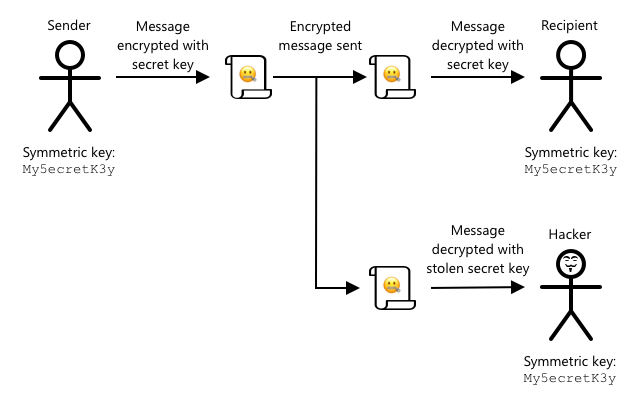

<!--
CO_OP_TRANSLATOR_METADATA:
{
  "original_hash": "81c437c568eee1b0dda1f04e88150d37",
  "translation_date": "2025-08-27T21:34:38+00:00",
  "source_file": "2-farm/lessons/6-keep-your-plant-secure/README.md",
  "language_code": "fi"
}
-->
# Pidä kasvisi turvassa


> Luonnoskuva: [Nitya Narasimhan](https://github.com/nitya). Klikkaa kuvaa nähdäksesi suuremman version.

## Ennakkokysely

[Ennakkokysely](https://black-meadow-040d15503.1.azurestaticapps.net/quiz/19)

## Johdanto

Viimeisissä oppitunneissa olet luonut IoT-laitteen maaperän kosteuden seurantaan ja yhdistänyt sen pilveen. Mutta mitä jos kilpailevan viljelijän palkkaamat hakkerit saisivat hallintaansa IoT-laitteesi? Entä jos he lähettäisivät jatkuvasti korkeita maaperän kosteusarvoja, jolloin kasvejasi ei koskaan kasteltaisi, tai kytkisivät kastelujärjestelmäsi päälle jatkuvasti, jolloin kasvit kuolisivat liikakasteluun ja vesilaskusi nousisi pilviin?

Tässä oppitunnissa opit IoT-laitteiden suojaamisesta. Koska tämä on projektin viimeinen oppitunti, opit myös, kuinka pilvipalveluresurssit siivotaan, jotta vältetään mahdolliset lisäkustannukset.

Tässä oppitunnissa käsitellään:

* [Miksi IoT-laitteet pitää suojata?](../../../../../2-farm/lessons/6-keep-your-plant-secure)
* [Salaustekniikka](../../../../../2-farm/lessons/6-keep-your-plant-secure)
* [IoT-laitteiden suojaaminen](../../../../../2-farm/lessons/6-keep-your-plant-secure)
* [X.509-sertifikaatin luominen ja käyttö](../../../../../2-farm/lessons/6-keep-your-plant-secure)

> 🗑 Tämä on projektin viimeinen oppitunti, joten tämän oppitunnin ja tehtävän suorittamisen jälkeen muista siivota pilvipalvelusi. Tarvitset palveluita tehtävän suorittamiseen, joten varmista, että teet sen ensin.
>
> Katso tarvittaessa [ohjeet projektin siivoamiseen](../../../clean-up.md).

## Miksi IoT-laitteet pitää suojata?

IoT-turvallisuus tarkoittaa sen varmistamista, että vain odotetut laitteet voivat yhdistää pilvipalveluusi ja lähettää telemetriatietoja, ja että vain pilvipalvelusi voi lähettää komentoja laitteillesi. IoT-data voi myös olla henkilökohtaista, kuten lääketieteellistä tai arkaluonteista tietoa, joten koko sovelluksen on otettava turvallisuus huomioon, jotta tietoja ei vuoda.

Jos IoT-sovelluksesi ei ole suojattu, siihen liittyy useita riskejä:

* Väärennetty laite voi lähettää virheellisiä tietoja, mikä saa sovelluksesi reagoimaan väärin. Esimerkiksi se voisi lähettää jatkuvasti korkeita maaperän kosteusarvoja, jolloin kastelujärjestelmäsi ei koskaan käynnisty ja kasvit kuolevat veden puutteeseen.
* Luvattomat käyttäjät voivat lukea IoT-laitteiden tietoja, mukaan lukien henkilökohtaisia tai liiketoiminnan kannalta kriittisiä tietoja.
* Hakkerit voivat lähettää komentoja ohjaamaan laitetta tavalla, joka voi vahingoittaa laitetta tai siihen liitettyjä laitteistoja.
* Yhdistämällä IoT-laitteeseen hakkerit voivat käyttää tätä väylänä päästäkseen muihin verkkoihin ja yksityisiin järjestelmiin.
* Pahantahtoiset käyttäjät voivat päästä käsiksi henkilökohtaisiin tietoihin ja käyttää niitä kiristykseen.

Nämä ovat todellisia tilanteita, joita tapahtuu jatkuvasti. Joitakin esimerkkejä annettiin aiemmissa oppitunneissa, mutta tässä on lisää:

* Vuonna 2018 hakkerit käyttivät avointa WiFi-yhteyspistettä akvaariolämpömittarissa päästäkseen kasinon verkkoon ja varastaakseen tietoja. [The Hacker News - Kasino hakkeroitiin internetiin yhdistetyn akvaariolämpömittarin kautta](https://thehackernews.com/2018/04/iot-hacking-thermometer.html)
* Vuonna 2016 Mirai Botnet käynnisti palvelunestohyökkäyksen Dyn-palveluntarjoajaa vastaan, mikä kaatoi suuren osan internetistä. Tämä botnet käytti haittaohjelmia yhdistääkseen IoT-laitteisiin, kuten DVR-laitteisiin ja kameroihin, jotka käyttivät oletuskäyttäjänimiä ja -salasanoja. [The Guardian - Historian suurin palvelunestohyökkäys](https://www.theguardian.com/technology/2016/oct/26/ddos-attack-dyn-mirai-botnet)
* Spiral Toys -yhtiön CloudPets-lelujen käyttäjätietokanta oli julkisesti saatavilla internetissä. [Troy Hunt - CloudPets-lelujen käyttäjätiedot vuotivat ja kiristettiin](https://www.troyhunt.com/data-from-connected-cloudpets-teddy-bears-leaked-and-ransomed-exposing-kids-voice-messages/).
* Strava-sovellus merkitsi juoksijoita, joita ohitit, ja näytti heidän reittinsä, jolloin tuntemattomat saattoivat selvittää, missä asut. [Kim Komando - Fitness-sovellus voi paljastaa kotisi sijainnin — muuta tämä asetus](https://www.komando.com/security-privacy/strava-fitness-app-privacy/755349/).

✅ Tee tutkimusta: Etsi lisää esimerkkejä IoT-hyökkäyksistä ja tietovuodoista, erityisesti henkilökohtaisiin esineisiin, kuten internetiin yhdistettyihin hammasharjoihin tai vaakoihin, liittyen. Mieti, millaisia vaikutuksia näillä hyökkäyksillä voisi olla uhreihin tai asiakkaisiin.

> 💁 Turvallisuus on valtava aihe, ja tämä oppitunti käsittelee vain perusasioita laitteen yhdistämisestä pilveen. Muita aiheita, joita ei käsitellä, ovat esimerkiksi tietojen muutosten seuranta siirron aikana, laitteiden suora hakkerointi tai laiteasetusten muutokset. IoT-hakkerointi on niin suuri uhka, että työkaluja, kuten [Azure Defender for IoT](https://azure.microsoft.com/services/azure-defender-for-iot/?WT.mc_id=academic-17441-jabenn), on kehitetty. Nämä työkalut ovat samanlaisia kuin tietokoneesi virustorjunta- ja tietoturvatyökalut, mutta ne on suunniteltu pienille, vähävirtaisille IoT-laitteille.

## Salaustekniikka

Kun laite yhdistää IoT-palveluun, se käyttää tunnistetta itsensä tunnistamiseen. Ongelma on, että tämä tunniste voidaan kopioida – hakkeri voisi asettaa haitallisen laitteen käyttämään samaa tunnistetta kuin oikea laite, mutta lähettämään vääriä tietoja.


Ratkaisu tähän on muuntaa lähetettävät tiedot salattuun muotoon käyttämällä arvoa, joka tunnetaan vain laitteelle ja pilvelle. Tätä prosessia kutsutaan *salaamiseksi*, ja arvoa, jota käytetään tietojen salaamiseen, kutsutaan *salausavaimeksi*.


Pilvipalvelu voi sitten muuntaa tiedot takaisin luettavaan muotoon prosessilla, jota kutsutaan *purkamiseksi*, käyttäen joko samaa salausavainta tai *purkuavainta*. Jos salattua viestiä ei voida purkaa avaimella, laite on hakkeroitu ja viesti hylätään.

Tätä salaamiseen ja purkamiseen käytettävää tekniikkaa kutsutaan *kryptografiaksi*.

### Varhainen kryptografia

Varhaisimmat kryptografian muodot olivat korvaussalauksia, jotka juontavat juurensa 3 500 vuoden taakse. Korvaussalauksessa yksi kirjain korvataan toisella. Esimerkiksi [Caesarin salaus](https://wikipedia.org/wiki/Caesar_cipher) siirtää aakkosia määritellyn määrän, ja vain salatun viestin lähettäjä ja vastaanottaja tietävät, kuinka monta kirjainta siirretään.

[Vigenèren salaus](https://wikipedia.org/wiki/Vigenère_cipher) vei tämän pidemmälle käyttämällä sanoja tekstin salaamiseen, jolloin alkuperäisen tekstin jokainen kirjain siirrettiin eri määrän verran, eikä aina samaa määrää.

Kryptografiaa käytettiin moniin tarkoituksiin, kuten saviastioiden lasitereseptien suojaamiseen muinaisessa Mesopotamiassa, salaisiin rakkauskirjeisiin Intiassa tai muinaisten egyptiläisten taikaloitsujen pitämiseen salassa.

### Moderni kryptografia

Moderni kryptografia on paljon kehittyneempää, mikä tekee siitä vaikeammin murrettavaa kuin varhaiset menetelmät. Moderni kryptografia käyttää monimutkaista matematiikkaa tietojen salaamiseen, ja mahdollisia avaimia on niin paljon, että raakavoimahyökkäykset eivät ole mahdollisia.

Kryptografiaa käytetään monin tavoin turvalliseen viestintään. Jos luet tätä sivua GitHubissa, saatat huomata, että verkkosivuston osoite alkaa *HTTPS*:llä, mikä tarkoittaa, että viestintä selaimesi ja GitHubin verkkopalvelimien välillä on salattu. Jos joku pystyisi lukemaan internetliikennettä selaimesi ja GitHubin välillä, hän ei pystyisi lukemaan tietoja, koska ne on salattu. Tietokoneesi saattaa jopa salata kaikki kiintolevyn tiedot, joten jos joku varastaa sen, hän ei pysty lukemaan tietojasi ilman salasanaasi.

> 🎓 HTTPS tarkoittaa HyperText Transfer Protocol **Secure**

Valitettavasti kaikki ei ole turvallista. Jotkut laitteet ovat täysin suojaamattomia, toiset on suojattu helposti murrettavilla avaimilla, tai joskus jopa kaikki saman tyyppiset laitteet käyttävät samaa avainta. On raportoitu erittäin henkilökohtaisista IoT-laitteista, joissa kaikilla on sama salasana WiFi- tai Bluetooth-yhteyden muodostamiseen. Jos voit yhdistää omaan laitteeseesi, voit yhdistää myös jonkun toisen laitteeseen. Kun yhteys on muodostettu, voit päästä käsiksi erittäin yksityisiin tietoihin tai hallita heidän laitettaan.

> 💁 Huolimatta modernin kryptografian monimutkaisuudesta ja väitteistä, että salauksen murtaminen voi kestää miljardeja vuosia, kvanttilaskennan nousu on mahdollistanut kaikkien tunnettujen salausten murtamisen erittäin lyhyessä ajassa!

### Symmetriset ja epäsymmetriset avaimet

Salaus jaetaan kahteen tyyppiin – symmetrinen ja epäsymmetrinen.

**Symmetrinen** salaus käyttää samaa avainta tietojen salaamiseen ja purkamiseen. Sekä lähettäjän että vastaanottajan on tiedettävä sama avain. Tämä on vähiten turvallinen tyyppi, koska avain on jaettava jollain tavalla. Jotta lähettäjä voisi lähettää salatun viestin vastaanottajalle, lähettäjän on ensin ehkä lähetettävä avain vastaanottajalle.


Jos avain varastetaan siirron aikana tai lähettäjä tai vastaanottaja hakkeroidaan ja avain löydetään, salaus voidaan murtaa.



**Epäsymmetrinen** salaus käyttää kahta avainta – salausavainta ja purkuavainta, joita kutsutaan julkisen ja yksityisen avaimen pariksi. Julkista avainta käytetään viestin salaamiseen, mutta sitä ei voida käyttää sen purkamiseen. Yksityistä avainta käytetään viestin purkamiseen, mutta sitä ei voida käyttää sen salaamiseen.


Vastaanottaja jakaa julkisen avaimensa, ja lähettäjä käyttää sitä viestin salaamiseen. Kun viesti on lähetetty, vastaanottaja purkaa sen yksityisellä avaimellaan. Epäsymmetrinen salaus on turvallisempi, koska yksityinen avain pidetään vastaanottajan hallussa eikä sitä koskaan jaeta. Julkisen avaimen voi antaa kenelle tahansa, koska sitä voidaan käyttää vain viestien salaamiseen.

Symmetrinen salaus on nopeampaa kuin epäsymmetrinen salaus, mutta epäsymmetrinen on turvallisempaa. Jotkin järjestelmät käyttävät molempia – käyttävät epäsymmetristä salausta symmetrisen avaimen salaamiseen ja jakamiseen, ja sitten symmetristä avainta kaikkien tietojen salaamiseen. Tämä tekee symmetrisen avaimen jakamisesta turvallisempaa lähettäjän ja vastaanottajan välillä ja nopeampaa tietojen salaamisessa ja purkamisessa.

## IoT-laitteiden suojaaminen

IoT-laitteet voidaan suojata käyttämällä symmetristä tai epäsymmetristä salausta. Symmetrinen on helpompi, mutta vähemmän turvallinen.

### Symmetriset avaimet

Kun määritit IoT-laitteesi toimimaan IoT Hubin kanssa, käytit yhteysmerkkijonoa. Esimerkki yhteysmerkkijonosta on:

```output
HostName=soil-moisture-sensor.azure-devices.net;DeviceId=soil-moisture-sensor;SharedAccessKey=Bhry+ind7kKEIDxubK61RiEHHRTrPl7HUow8cEm/mU0=
```

Tämä yhteysmerkkijono koostuu kolmesta osasta, jotka on erotettu puolipisteillä, ja jokainen osa sisältää avaimen ja arvon:

| Avain | Arvo | Kuvaus |
| --- | ----- | ----------- |
| HostName | `soil-moisture-sensor.azure-devices.net` | IoT Hubin URL |
| DeviceId | `soil-moisture-sensor` | Laitteen yksilöllinen tunniste |
| SharedAccessKey | `Bhry+ind7kKEIDxubK61RiEHHRTrPl7HUow8cEm/mU0=` | Symmetrinen avain, joka tunnetaan sekä laitteen että IoT Hubin toimesta |

Yhteysmerkkijonon viimeinen osa, `SharedAccessKey`, on symmetrinen avain, jonka sekä laite että IoT Hub tuntevat. Tätä avainta ei koskaan lähetetä laitteelta pilveen tai pilvestä laitteelle. Sen sijaan sitä käytetään lähetettävien tai vastaanotettavien tietojen salaamiseen.

✅ Tee kokeilu. Mitä luulet tapahtuvan, jos muutat yhteysmerkkijonon `SharedAccessKey`-osaa, kun yhdistät IoT-laitteesi? Kokeile ja katso.

Kun laite yrittää ensimmäisen kerran yhdistää, se lähettää jaetun pääsytunnuksen (SAS), joka koostuu IoT Hubin URL-osoitteesta, aikaleimasta, jolloin pääsytunnus vanhenee (yleensä yksi päivä nykyhetkestä), ja allekirjoituksesta. Tämä allekirjoitus koostuu URL-osoitteesta ja vanhenemisajasta, jotka on salattu yhteysmerkkijonon jaetulla pääsyavaimella.

IoT Hub purkaa tämän allekirjoituksen jaetulla pääsyavaimella, ja jos purettu arvo vastaa URL-osoitetta ja vanhenemisaikaa, laite saa yhdistää. Se myös tarkistaa, että nykyinen aika on ennen vanhenemisaikaa, jotta haitallinen laite ei voi siepata oikean laitteen SAS-tunnusta ja käyttää sitä.

Tämä on elegantti tapa varmistaa, että lähettäjä on oikea laite. Lähettämällä joitakin tunnettuja tietoja sekä salaamattomassa että salatussa muodossa palvelin voi varmistaa laitteen tarkistamalla, että kun se purkaa salatut tiedot, tulos vastaa lähetettyä salaamatonta versiota. Jos ne vastaavat, sekä lähettäjällä että vastaanottajalla on sama symmetrinen salausavain.
💁 Koska IoT-laitteen käyttöaika vanhenee, sen täytyy tietää tarkka aika, joka yleensä haetaan [NTP](https://wikipedia.org/wiki/Network_Time_Protocol)-palvelimelta. Jos aika ei ole tarkka, yhteys epäonnistuu.
Kun yhteys on muodostettu, kaikki IoT Hubiin laitteelta lähetetty data tai IoT Hubista laitteelle lähetetty data salataan jaettuun pääsyavaimeen perustuen.

✅ Mitä luulet tapahtuvan, jos useat laitteet jakavat saman yhteysmerkkijonon?

> 💁 On huono tietoturvakäytäntö tallentaa tämä avain koodiin. Jos hakkeri saa lähdekoodisi haltuunsa, hän voi saada avaimen. Lisäksi koodin julkaiseminen on vaikeampaa, koska jokaiselle laitteelle tarvitaan päivitetty avain, mikä vaatii koodin uudelleenkääntämistä. On parempi ladata tämä avain laitteiston turvamoduulista - IoT-laitteessa olevasta sirusta, joka tallentaa salattuja arvoja, joita koodi voi lukea.
>
> IoT:n oppimisen yhteydessä avaimen laittaminen koodiin, kuten teit aiemmassa oppitunnissa, on usein helpompaa, mutta sinun on varmistettava, ettei tätä avainta tallenneta julkiseen lähdekoodin hallintaan.

Laitteilla on kaksi avainta ja kaksi vastaavaa yhteysmerkkijonoa. Tämä mahdollistaa avainten kierrätyksen - eli siirtymisen yhdestä avaimesta toiseen, jos ensimmäinen vaarantuu, ja ensimmäisen avaimen uudelleenluomisen.

### X.509-sertifikaatit

Kun käytät epäsymmetristä salausta julkisen ja yksityisen avainparin kanssa, sinun on annettava julkinen avain kaikille, jotka haluavat lähettää sinulle dataa. Ongelma on, miten avaimen vastaanottaja voi olla varma, että kyseessä on juuri sinun julkinen avain, eikä joku muu, joka teeskentelee olevansa sinä? Sen sijaan, että tarjoaisit avaimen, voit tarjota julkisen avaimen sertifikaatin sisällä, joka on luotettavan kolmannen osapuolen, nimeltään X.509-sertifikaatti, vahvistama.

X.509-sertifikaatit ovat digitaalisia asiakirjoja, jotka sisältävät julkisen avainparin julkisen osan. Ne ovat yleensä luotettavien organisaatioiden, nimeltään [sertifikaattiviranomaiset](https://wikipedia.org/wiki/Certificate_authority) (CAs), myöntämiä ja digitaalisesti allekirjoittamia, mikä osoittaa, että avain on voimassa ja tulee sinulta. Luotat sertifikaattiin ja siihen, että julkinen avain on peräisin siitä, keneltä sertifikaatti väittää sen olevan, koska luotat CA:han, samalla tavalla kuin luottaisit passiin tai ajokorttiin, koska luotat sen myöntäneeseen maahan. Sertifikaatit maksavat rahaa, joten voit myös "itse allekirjoittaa", eli luoda sertifikaatin itse ja allekirjoittaa sen itse testitarkoituksiin.

> 💁 Itse allekirjoitettua sertifikaattia ei koskaan tulisi käyttää tuotantoversiossa.

Näissä sertifikaateissa on useita kenttiä, mukaan lukien keneltä julkinen avain on peräisin, CA:n tiedot, joka on myöntänyt sen, kuinka kauan se on voimassa, ja itse julkinen avain. Ennen sertifikaatin käyttöä on hyvä käytäntö varmistaa sen aitous tarkistamalla, että alkuperäinen CA on allekirjoittanut sen.

✅ Voit lukea täydellisen luettelon sertifikaatin kentistä [Microsoftin X.509-julkisten avainsertifikaattien opetusohjelmasta](https://docs.microsoft.com/azure/iot-hub/tutorial-x509-certificates?WT.mc_id=academic-17441-jabenn#certificate-fields).

Kun käytät X.509-sertifikaatteja, sekä lähettäjällä että vastaanottajalla on omat julkiset ja yksityiset avaimensa, sekä X.509-sertifikaatit, jotka sisältävät julkisen avaimen. He vaihtavat X.509-sertifikaatteja jollain tavalla, käyttäen toistensa julkisia avaimia salatakseen lähettämänsä datan ja omia yksityisiä avaimiaan purkaakseen vastaanottamansa datan.


Yksi suuri etu X.509-sertifikaattien käytössä on, että niitä voidaan jakaa laitteiden välillä. Voit luoda yhden sertifikaatin, ladata sen IoT Hubiin ja käyttää sitä kaikille laitteillesi. Jokaisen laitteen tarvitsee vain tietää yksityinen avain purkaakseen IoT Hubista vastaanottamansa viestit.

Laitteen käyttämä sertifikaatti viestien salaamiseen, jotka se lähettää IoT Hubiin, on Microsoftin julkaisema. Se on sama sertifikaatti, jota monet Azure-palvelut käyttävät, ja se on joskus sisäänrakennettu SDK:ihin.

> 💁 Muista, että julkinen avain on juuri sitä - julkinen. Azure-julkista avainta voidaan käyttää vain Azureen lähetettävän datan salaamiseen, ei sen purkamiseen, joten sitä voidaan jakaa kaikkialla, myös lähdekoodissa. Esimerkiksi voit nähdä sen [Azure IoT C SDK:n lähdekoodissa](https://github.com/Azure/azure-iot-sdk-c/blob/master/certs/certs.c).

✅ X.509-sertifikaateissa on paljon ammattikieltä. Voit lukea joidenkin termien määritelmät [Microsoftin X.509-sertifikaattien ammattikielen oppaasta](https://techcommunity.microsoft.com/t5/internet-of-things/the-layman-s-guide-to-x-509-certificate-jargon/ba-p/2203540?WT.mc_id=academic-17441-jabenn).

## Luo ja käytä X.509-sertifikaattia

X.509-sertifikaatin luomisen vaiheet ovat:

1. Luo julkisen ja yksityisen avaimen pari. Yksi yleisimmin käytetyistä algoritmeista julkisen ja yksityisen avainparin luomiseen on nimeltään [Rivest–Shamir–Adleman](https://wikipedia.org/wiki/RSA_(cryptosystem))(RSA).

1. Lähetä julkinen avain ja siihen liittyvät tiedot allekirjoitettavaksi, joko CA:lle tai itse allekirjoittamalla.

Azure CLI:ssä on komentoja uuden laitteen identiteetin luomiseen IoT Hubissa, julkisen ja yksityisen avainparin automaattiseen luomiseen ja itse allekirjoitetun sertifikaatin luomiseen.

> 💁 Jos haluat nähdä vaiheet yksityiskohtaisesti sen sijaan, että käyttäisit Azure CLI:tä, löydät ne [Microsoft IoT Hub -dokumentaation OpenSSL:n käyttöoppaasta itse allekirjoitettujen sertifikaattien luomiseen](https://docs.microsoft.com/azure/iot-hub/tutorial-x509-self-sign?WT.mc_id=academic-17441-jabenn).

### Tehtävä - luo laitteen identiteetti X.509-sertifikaatin avulla

1. Suorita seuraava komento rekisteröidäksesi uuden laitteen identiteetin, joka luo automaattisesti avaimet ja sertifikaatit:

    ```sh
    az iot hub device-identity create --device-id soil-moisture-sensor-x509 \
                                      --am x509_thumbprint \
                                      --output-dir . \
                                      --hub-name <hub_name>
    ```

    Korvaa `<hub_name>` IoT Hubille antamallasi nimellä.

    Tämä luo laitteen, jonka tunnus on `soil-moisture-sensor-x509`, erottamaan sen identiteetistä, jonka loit edellisessä oppitunnissa. Tämä komento luo myös kaksi tiedostoa nykyiseen hakemistoon:

    * `soil-moisture-sensor-x509-key.pem` - tämä tiedosto sisältää laitteen yksityisen avaimen.
    * `soil-moisture-sensor-x509-cert.pem` - tämä on laitteen X.509-sertifikaattitiedosto.

    Pidä nämä tiedostot turvassa! Yksityistä avaintiedostoa ei tulisi tallentaa julkiseen lähdekoodin hallintaan.

### Tehtävä - käytä X.509-sertifikaattia laitteen koodissa

Käy läpi asiaankuuluva opas IoT-laitteen yhdistämiseksi pilveen X.509-sertifikaatin avulla:

* [Arduino - Wio Terminal](wio-terminal-x509.md)
* [Yksikorttitietokone - Raspberry Pi/virtuaalinen IoT-laite](single-board-computer-x509.md)

---

## 🚀 Haaste

Azure-palveluiden, kuten resurssiryhmien ja IoT Hubien, luomiseen, hallintaan ja poistamiseen on useita tapoja. Yksi tapa on [Azure Portal](https://portal.azure.com?WT.mc_id=academic-17441-jabenn) - verkkopohjainen käyttöliittymä, joka tarjoaa graafisen käyttöliittymän Azure-palveluiden hallintaan.

Siirry [portal.azure.com](https://portal.azure.com?WT.mc_id=academic-17441-jabenn) ja tutki portaalia. Katso, voitko luoda IoT Hubin portaalin avulla ja poistaa sen.

**Vinkki** - kun luot palveluita portaalin kautta, sinun ei tarvitse luoda resurssiryhmää etukäteen, vaan se voidaan luoda palvelua luodessa. Varmista, että poistat sen, kun olet valmis!

Voit löytää runsaasti dokumentaatiota, opetusohjelmia ja oppaita Azure-portaalista [Azure-portaalin dokumentaatiosta](https://docs.microsoft.com/azure/azure-portal/?WT.mc_id=academic-17441-jabenn).

## Oppitunnin jälkeinen kysely

[Oppitunnin jälkeinen kysely](https://black-meadow-040d15503.1.azurestaticapps.net/quiz/20)

## Kertaus ja itseopiskelu

* Lue kryptografian historiaa [Wikipedia-sivulta kryptografian historia](https://wikipedia.org/wiki/History_of_cryptography).
* Lue X.509-sertifikaateista [Wikipedia-sivulta X.509](https://wikipedia.org/wiki/X.509).

## Tehtävä

[Rakenna uusi IoT-laite](assignment.md)

---

**Vastuuvapauslauseke**:  
Tämä asiakirja on käännetty käyttämällä tekoälypohjaista käännöspalvelua [Co-op Translator](https://github.com/Azure/co-op-translator). Vaikka pyrimme tarkkuuteen, huomioithan, että automaattiset käännökset voivat sisältää virheitä tai epätarkkuuksia. Alkuperäistä asiakirjaa sen alkuperäisellä kielellä tulisi pitää ensisijaisena lähteenä. Kriittisen tiedon osalta suositellaan ammattimaista ihmiskäännöstä. Emme ole vastuussa väärinkäsityksistä tai virhetulkinnoista, jotka johtuvat tämän käännöksen käytöstä.