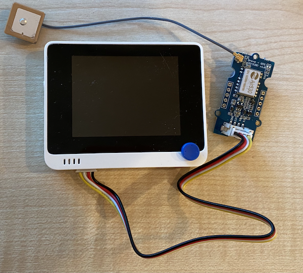

<!--
CO_OP_TRANSLATOR_METADATA:
{
  "original_hash": "da6ae0a795cf06be33d23ca5b8493fc8",
  "translation_date": "2025-08-27T22:49:09+00:00",
  "source_file": "3-transport/lessons/1-location-tracking/wio-terminal-gps-sensor.md",
  "language_code": "fi"
}
-->
# Lue GPS-data - Wio Terminal

Tässä osassa oppituntia lisäät GPS-anturin Wio Terminal -laitteeseesi ja luet sen antamia arvoja.

## Laitteisto

Wio Terminal tarvitsee GPS-anturin.

Käytettävä anturi on [Grove GPS Air530 -anturi](https://www.seeedstudio.com/Grove-GPS-Air530-p-4584.html). Tämä anturi voi yhdistyä useisiin GPS-järjestelmiin nopeaa ja tarkkaa paikannusta varten. Anturi koostuu kahdesta osasta - anturin ydinelektroniikasta ja ohuella johdolla liitetystä ulkoisesta antennista, joka vastaanottaa satelliittien radiotaajuuksia.

Tämä on UART-anturi, joten se lähettää GPS-dataa UARTin kautta.

### Yhdistä GPS-anturi

Grove GPS -anturi voidaan liittää Wio Terminal -laitteeseen.

#### Tehtävä - yhdistä GPS-anturi

Yhdistä GPS-anturi.


1. Työnnä Grove-kaapelin toinen pää GPS-anturin liittimeen. Se menee sisään vain yhdellä tavalla.

1. Kun Wio Terminal ei ole kytketty tietokoneeseen tai muuhun virtalähteeseen, liitä Grove-kaapelin toinen pää Wio Terminalin vasemmanpuoleiseen Grove-liittimeen, kun katsot näyttöä. Tämä liitin on lähimpänä virtapainiketta.

    

1. Aseta GPS-anturi niin, että siihen liitetty antenni on näkyvissä taivaalle - mieluiten avoimen ikkunan vieressä tai ulkona. On helpompi saada selkeä signaali, kun antennin edessä ei ole esteitä.

1. Nyt voit liittää Wio Terminalin tietokoneeseesi.

1. GPS-anturissa on kaksi LED-valoa - sininen LED vilkkuu, kun dataa lähetetään, ja vihreä LED vilkkuu sekunnin välein, kun se vastaanottaa dataa satelliiteista. Varmista, että sininen LED vilkkuu, kun käynnistät Wio Terminalin. Muutaman minuutin kuluttua vihreän LEDin pitäisi alkaa vilkkua - jos ei, saatat joutua siirtämään antennia.

## Ohjelmoi GPS-anturi

Nyt Wio Terminal voidaan ohjelmoida käyttämään liitettyä GPS-anturia.

### Tehtävä - ohjelmoi GPS-anturi

Ohjelmoi laite.

1. Luo uusi Wio Terminal -projekti käyttämällä PlatformIO:ta. Nimeä tämä projekti `gps-sensor`. Lisää koodi `setup`-funktioon sarjaportin konfiguroimiseksi.

1. Lisää seuraava include-direktiivi `main.cpp`-tiedoston alkuun. Tämä sisältää otsikkotiedoston, jossa on funktioita vasemman Grove-portin konfiguroimiseksi UARTille.

    ```cpp
    #include <wiring_private.h>
    ```

1. Tämän jälkeen lisää seuraava koodirivi määrittääksesi sarjaporttiyhteyden UART-porttiin:

    ```cpp
    static Uart Serial3(&sercom3, PIN_WIRE_SCL, PIN_WIRE_SDA, SERCOM_RX_PAD_1, UART_TX_PAD_0);
    ```

1. Sinun täytyy lisätä koodia ohjaamaan joitakin sisäisiä signaalinkäsittelijöitä tähän sarjaporttiin. Lisää seuraava koodi `Serial3`-määrittelyn alle:

    ```cpp
    void SERCOM3_0_Handler()
    {
        Serial3.IrqHandler();
    }
    
    void SERCOM3_1_Handler()
    {
        Serial3.IrqHandler();
    }
    
    void SERCOM3_2_Handler()
    {
        Serial3.IrqHandler();
    }
    
    void SERCOM3_3_Handler()
    {
        Serial3.IrqHandler();
    }
    ```

1. `setup`-funktiossa, kohdassa, jossa `Serial`-portti konfiguroidaan, konfiguroi UART-sarjaportti seuraavalla koodilla:

    ```cpp
    Serial3.begin(9600);

    while (!Serial3)
        ; // Wait for Serial3 to be ready

    delay(1000);
    ```

1. Tämän koodin alle `setup`-funktiossa lisää seuraava koodi yhdistääksesi Grove-pinnin sarjaporttiin:

    ```cpp
    pinPeripheral(PIN_WIRE_SCL, PIO_SERCOM_ALT);
    ```

1. Lisää seuraava funktio ennen `loop`-funktiota lähettääksesi GPS-dataa sarjamonitoriin:

    ```cpp
    void printGPSData()
    {
        Serial.println(Serial3.readStringUntil('\n'));
    }
    ```

1. Lisää `loop`-funktioon seuraava koodi lukeaksesi UART-sarjaportista ja tulostaaksesi tulosteen sarjamonitoriin:

    ```cpp
    while (Serial3.available() > 0)
    {
        printGPSData();
    }
    
    delay(1000);
    ```

    Tämä koodi lukee UART-sarjaportista. `readStringUntil`-funktio lukee, kunnes se kohtaa lopetusmerkin, tässä tapauksessa rivinvaihdon. Tämä lukee kokonaisen NMEA-lauseen (NMEA-lauseet päättyvät rivinvaihtomerkkiin). Niin kauan kuin dataa voidaan lukea UART-sarjaportista, se luetaan ja lähetetään sarjamonitoriin `printGPSData`-funktion kautta. Kun dataa ei enää voida lukea, `loop` viivästyy yhden sekunnin (1 000 ms).

1. Rakenna ja lataa koodi Wio Terminal -laitteeseen.

1. Kun koodi on ladattu, voit tarkastella GPS-dataa sarjamonitorin avulla.

    ```output
    > Executing task: platformio device monitor <
    
    --- Available filters and text transformations: colorize, debug, default, direct, hexlify, log2file, nocontrol, printable, send_on_enter, time
    --- More details at http://bit.ly/pio-monitor-filters
    --- Miniterm on /dev/cu.usbmodem1201  9600,8,N,1 ---
    --- Quit: Ctrl+C | Menu: Ctrl+T | Help: Ctrl+T followed by Ctrl+H ---
    $GNGGA,020604.001,4738.538654,N,12208.341758,W,1,3,,164.7,M,-17.1,M,,*67
    $GPGSA,A,1,,,,,,,,,,,,,,,*1E
    $BDGSA,A,1,,,,,,,,,,,,,,,*0F
    $GPGSV,1,1,00*79
    $BDGSV,1,1,00*68
    ```

> 💁 Löydät tämän koodin [code-gps/wio-terminal](../../../../../3-transport/lessons/1-location-tracking/code-gps/wio-terminal) -kansiosta.

😀 GPS-anturiohjelmasi onnistui!

---

**Vastuuvapauslauseke**:  
Tämä asiakirja on käännetty käyttämällä tekoälypohjaista käännöspalvelua [Co-op Translator](https://github.com/Azure/co-op-translator). Vaikka pyrimme tarkkuuteen, huomioithan, että automaattiset käännökset voivat sisältää virheitä tai epätarkkuuksia. Alkuperäinen asiakirja sen alkuperäisellä kielellä tulisi pitää ensisijaisena lähteenä. Kriittisen tiedon osalta suositellaan ammattimaista ihmiskäännöstä. Emme ole vastuussa väärinkäsityksistä tai virhetulkinnoista, jotka johtuvat tämän käännöksen käytöstä.