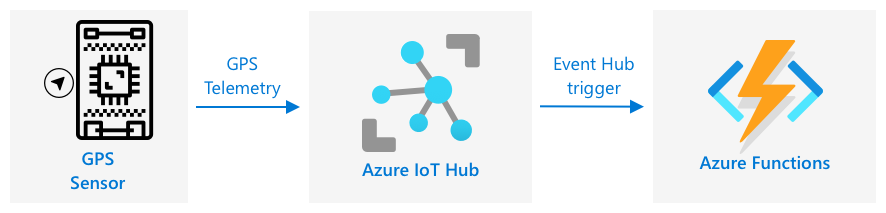

<!--
CO_OP_TRANSLATOR_METADATA:
{
  "original_hash": "e345843ccfeb7261d81500d19c64d476",
  "translation_date": "2025-08-27T22:59:49+00:00",
  "source_file": "3-transport/lessons/2-store-location-data/README.md",
  "language_code": "fi"
}
-->
# Tallenna sijaintitiedot


> Luonnoskuva: [Nitya Narasimhan](https://github.com/nitya). Klikkaa kuvaa nähdäksesi suuremman version.

## Ennakkokysely

[Ennakkokysely](https://black-meadow-040d15503.1.azurestaticapps.net/quiz/23)

## Johdanto

Edellisessä oppitunnissa opit käyttämään GPS-anturia sijaintitietojen tallentamiseen. Jotta näitä tietoja voidaan käyttää esimerkiksi ruokaa kuljettavan kuorma-auton sijainnin ja matkan visualisointiin, tiedot täytyy lähettää pilvessä toimivaan IoT-palveluun ja tallentaa jonnekin.

Tässä oppitunnissa opit erilaisista tavoista tallentaa IoT-tietoja ja siitä, miten voit tallentaa tietoja IoT-palvelustasi palvelimettoman koodin avulla.

Tässä oppitunnissa käsitellään:

* [Strukturoitu ja strukturoimaton data](../../../../../3-transport/lessons/2-store-location-data)
* [GPS-tietojen lähettäminen IoT Hubiin](../../../../../3-transport/lessons/2-store-location-data)
* [Kuuma, lämmin ja kylmä polku](../../../../../3-transport/lessons/2-store-location-data)
* [GPS-tapahtumien käsittely palvelimettomalla koodilla](../../../../../3-transport/lessons/2-store-location-data)
* [Azure Storage -tilit](../../../../../3-transport/lessons/2-store-location-data)
* [Yhdistä palvelimeton koodi tallennukseen](../../../../../3-transport/lessons/2-store-location-data)

## Strukturoitu ja strukturoimaton data

Tietokonejärjestelmät käsittelevät dataa, joka voi olla monenlaista ja eri muodoissa. Data voi vaihdella yksittäisistä numeroista suuriin tekstimääriin, videoihin, kuviin ja IoT-tietoihin. Data voidaan yleensä jakaa kahteen kategoriaan: *strukturoitu data* ja *strukturoimaton data*.

* **Strukturoitu data** on hyvin määriteltyä ja jäykkärakenteista dataa, joka ei muutu ja joka yleensä vastaa taulukoita, joissa on suhteita. Esimerkki tästä on henkilön tiedot, kuten nimi, syntymäaika ja osoite.

* **Strukturoimaton data** on dataa, jolla ei ole selkeää ja jäykkää rakennetta, ja joka voi muuttua usein. Esimerkki tästä on asiakirjat, kuten kirjoitetut dokumentit tai taulukot.

✅ Tee tutkimusta: Voitko keksiä muita esimerkkejä strukturoituneesta ja strukturoimattomasta datasta?

> 💁 On myös olemassa puolistrukturoitua dataa, joka on jossain määrin järjestettyä, mutta ei sovi kiinteisiin taulukoihin.

IoT-data luokitellaan yleensä strukturoimattomaksi dataksi.

Kuvittele, että lisäisit IoT-laitteita suuren kaupallisen maatilan ajoneuvokantaan. Saatat haluta käyttää erilaisia laitteita eri ajoneuvotyypeille. Esimerkiksi:

* Maatalousajoneuvoille, kuten traktoreille, haluat GPS-tietoja varmistaaksesi, että ne työskentelevät oikeilla pelloilla.
* Ruokaa varastoihin kuljettaville kuorma-autoille haluat GPS-tietojen lisäksi nopeus- ja kiihtyvyystietoja varmistaaksesi turvallisen ajon sekä kuljettajan tunnistustiedot ja käynnistys-/pysäytystiedot varmistaaksesi paikallisten työaikalakien noudattamisen.
* Jäähdytetyille kuorma-autoille haluat myös lämpötilatietoja varmistaaksesi, ettei ruoka pilaannu liian kuuman tai kylmän lämpötilan vuoksi.

Tämä data voi muuttua jatkuvasti. Esimerkiksi, jos IoT-laite on kuorma-auton ohjaamossa, sen lähettämät tiedot voivat muuttua perävaunun vaihtuessa, esimerkiksi lähettämällä lämpötilatietoja vain, kun käytössä on jäähdytetty perävaunu.

✅ Mitä muuta IoT-dataa voisi kerätä? Mieti, millaisia kuormia kuorma-autot voivat kuljettaa, sekä huoltotietoja.

Tämä data vaihtelee ajoneuvosta toiseen, mutta kaikki tiedot lähetetään samaan IoT-palveluun käsiteltäväksi. IoT-palvelun täytyy pystyä käsittelemään tätä strukturoimatonta dataa ja tallentamaan se tavalla, joka mahdollistaa sen hakemisen tai analysoinnin, mutta toimii eri rakenteiden kanssa.

### SQL vs NoSQL -tallennus

Tietokannat ovat palveluita, joiden avulla voit tallentaa ja hakea dataa. Tietokannat jaetaan kahteen tyyppiin: SQL ja NoSQL.

#### SQL-tietokannat

Ensimmäiset tietokannat olivat relaatiotietokantoja (RDBMS), joita kutsutaan myös SQL-tietokannoiksi niiden käyttämän Structured Query Language (SQL) -kielen mukaan. Näissä tietokannoissa on skeema – hyvin määritelty joukko taulukoita, jotka muistuttavat laskentataulukoita. Jokaisessa taulukossa on useita nimettyjä sarakkeita. Kun lisäät dataa, lisäät rivin taulukkoon ja täytät sarakkeet arvoilla. Tämä pitää datan hyvin jäykässä rakenteessa – vaikka voit jättää sarakkeita tyhjiksi, uuden sarakkeen lisääminen vaatii muutoksia tietokantaan ja olemassa olevien rivien arvojen täyttämistä. Nämä tietokannat ovat relaatiotietokantoja, eli yksi taulukko voi olla suhteessa toiseen.


Esimerkiksi, jos tallennat käyttäjän henkilökohtaisia tietoja taulukkoon, sinulla olisi jokaiselle käyttäjälle sisäinen yksilöllinen ID, jota käytetään rivillä taulukossa, joka sisältää käyttäjän nimen ja osoitteen. Jos haluat tallentaa muita tietoja kyseisestä käyttäjästä, kuten hänen ostoksensa, toiseen taulukkoon, sinulla olisi yksi sarake uudessa taulukossa kyseisen käyttäjän ID:lle. Kun haet käyttäjää, voit käyttää hänen ID:tään saadaksesi hänen henkilökohtaiset tietonsa yhdestä taulukosta ja ostotiedot toisesta.

SQL-tietokannat sopivat erinomaisesti strukturoituneen datan tallentamiseen ja tilanteisiin, joissa haluat varmistaa, että data vastaa skeemaasi.

✅ Jos et ole käyttänyt SQL:ää aiemmin, lue siitä lisää [SQL:n Wikipedia-sivulta](https://wikipedia.org/wiki/SQL).

Tunnettuja SQL-tietokantoja ovat Microsoft SQL Server, MySQL ja PostgreSQL.

✅ Tee tutkimusta: Lue lisää näistä SQL-tietokannoista ja niiden ominaisuuksista.

#### NoSQL-tietokannat

NoSQL-tietokannat on nimetty näin, koska niillä ei ole SQL-tietokantojen jäykkää rakennetta. Niitä kutsutaan myös dokumenttitietokannoiksi, koska ne voivat tallentaa strukturoimatonta dataa, kuten dokumentteja.

> 💁 Nimestään huolimatta jotkut NoSQL-tietokannat mahdollistavat SQL:n käytön datan hakemiseen.


NoSQL-tietokannoilla ei ole ennalta määriteltyä skeemaa, joka rajoittaisi datan tallennustapaa. Sen sijaan voit lisätä mitä tahansa strukturoimatonta dataa, yleensä JSON-dokumentteina. Nämä dokumentit voidaan järjestää kansioihin, kuten tiedostot tietokoneellasi. Jokaisella dokumentilla voi olla eri kenttiä kuin toisilla dokumenteilla – esimerkiksi, jos tallennat IoT-dataa maatilan ajoneuvoista, joillakin dokumenteilla voi olla kiihtyvyys- ja nopeustietokenttiä, kun taas toisilla voi olla perävaunun lämpötilatietokenttiä. Jos lisäisit uuden kuorma-autotyypin, kuten sellaisen, jossa on sisäänrakennetut vaa'at kuorman painon seuraamiseen, IoT-laite voisi lisätä tämän uuden kentän, ja se voitaisiin tallentaa ilman muutoksia tietokantaan.

Tunnettuja NoSQL-tietokantoja ovat Azure CosmosDB, MongoDB ja CouchDB.

✅ Tee tutkimusta: Lue lisää näistä NoSQL-tietokannoista ja niiden ominaisuuksista.

Tässä oppitunnissa käytät NoSQL-tallennusta IoT-datan tallentamiseen.

## Lähetä GPS-tietoja IoT Hubiin

Edellisessä oppitunnissa tallensit GPS-tietoja GPS-anturista, joka oli yhdistetty IoT-laitteeseesi. Jotta nämä IoT-tiedot voidaan tallentaa pilveen, ne täytyy lähettää IoT-palveluun. Käytät jälleen Azure IoT Hubia, samaa IoT-pilvipalvelua, jota käytit edellisessä projektissa.


### Tehtävä – lähetä GPS-tietoja IoT Hubiin

1. Luo uusi IoT Hub käyttämällä ilmaista tasoa.

    > ⚠️ Voit tarvittaessa viitata [ohjeisiin IoT Hubin luomisesta projektin 2, oppitunnin 4 kohdassa](../../../2-farm/lessons/4-migrate-your-plant-to-the-cloud/README.md#create-an-iot-service-in-the-cloud).

    Muista luoda uusi resurssiryhmä. Nimeä uusi resurssiryhmä `gps-sensor` ja uusi IoT Hub yksilöllisellä nimellä, joka perustuu `gps-sensor`-nimeen, kuten `gps-sensor-<nimesi>`.

    > 💁 Jos sinulla on vielä IoT Hub edellisestä projektista, voit käyttää sitä uudelleen. Muista käyttää tämän IoT Hubin nimeä ja sen resurssiryhmää, kun luot muita palveluita.

1. Lisää uusi laite IoT Hubiin. Nimeä tämä laite `gps-sensor`. Ota laitteen yhteysmerkkijono talteen.

1. Päivitä laitteesi koodi lähettämään GPS-tiedot uuteen IoT Hubiin käyttämällä edellisessä vaiheessa saatua laitteen yhteysmerkkijonoa.

    > ⚠️ Voit tarvittaessa viitata [ohjeisiin laitteen yhdistämisestä IoT-palveluun projektin 2, oppitunnin 4 kohdassa](../../../2-farm/lessons/4-migrate-your-plant-to-the-cloud/README.md#connect-your-device-to-the-iot-service).

1. Kun lähetät GPS-tietoja, tee se JSON-muodossa seuraavasti:

    ```json
    {
        "gps" :
        {
            "lat" : <latitude>,
            "lon" : <longitude>
        }
    }
    ```

1. Lähetä GPS-tietoja minuutin välein, jotta et ylitä päivittäistä viestirajoitustasi.

Jos käytät Wio Terminalia, muista lisätä kaikki tarvittavat kirjastot ja asettaa aika NTP-palvelimen avulla. Koodisi täytyy myös varmistaa, että se on lukenut kaikki tiedot sarjaportista ennen GPS-sijainnin lähettämistä, käyttämällä edellisen oppitunnin olemassa olevaa koodia. Käytä seuraavaa koodia JSON-dokumentin luomiseen:

```cpp
DynamicJsonDocument doc(1024);
doc["gps"]["lat"] = gps.location.lat();
doc["gps"]["lon"] = gps.location.lng();
```

Jos käytät virtuaalista IoT-laitetta, muista asentaa kaikki tarvittavat kirjastot virtuaaliympäristössä.

Sekä Raspberry Pi:lle että virtuaaliselle IoT-laitteelle käytä edellisen oppitunnin olemassa olevaa koodia saadaksesi leveys- ja pituusastearvot, ja lähetä ne oikeassa JSON-muodossa seuraavalla koodilla:

```python
message_json = { "gps" : { "lat":lat, "lon":lon } }
print("Sending telemetry", message_json)
message = Message(json.dumps(message_json))
```

> 💁 Löydät tämän koodin kansioista [code/wio-terminal](../../../../../3-transport/lessons/2-store-location-data/code/wio-terminal), [code/pi](../../../../../3-transport/lessons/2-store-location-data/code/pi) tai [code/virtual-device](../../../../../3-transport/lessons/2-store-location-data/code/virtual-device).

Aja laitteesi koodi ja varmista, että viestit virtaavat IoT Hubiin käyttämällä `az iot hub monitor-events` CLI-komentoa.

## Kuuma, lämmin ja kylmä polku

IoT-laitteesta pilveen virtaavaa dataa ei aina käsitellä reaaliajassa. Jotkin tiedot vaativat reaaliaikaista käsittelyä, toiset voidaan käsitellä hieman myöhemmin, ja jotkin tiedot voidaan käsitellä paljon myöhemmin. Datan virtausta eri palveluihin, jotka käsittelevät dataa eri aikoina, kutsutaan kuumaksi, lämpimäksi ja kylmäksi poluksi.

### Kuuma polku

Kuuma polku viittaa dataan, joka täytyy käsitellä reaaliajassa tai lähes reaaliajassa. Kuumaa polkua käytetään esimerkiksi hälytyksiin, kuten ilmoituksiin siitä, että ajoneuvo lähestyy varastoa, tai että jäähdytetyn kuorma-auton lämpötila on liian korkea.

Kuumaa polkua varten koodisi vastaisi tapahtumiin heti, kun ne vastaanotetaan pilvipalveluissa.

### Lämmin polku

Lämmin polku viittaa dataan, joka voidaan käsitellä hieman myöhemmin, esimerkiksi raportointia tai lyhyen aikavälin analytiikkaa varten. Lämmin polku voisi sisältää esimerkiksi päivittäisiä raportteja ajoneuvojen ajokilometreistä, käyttäen edellisen päivän kerättyjä tietoja.

Lämmin polku -data tallennetaan pilvipalveluun heti sen vastaanottamisen jälkeen, ja se on nopeasti saatavilla.

### Kylmä polku

Kylmä polku viittaa historialliseen dataan, joka tallennetaan pitkällä aikavälillä ja jota voidaan käsitellä tarvittaessa. Esimerkiksi kylmää polkua voitaisiin käyttää vuosittaisten ajokilometriraporttien luomiseen tai reittianalyysien tekemiseen polttoainekustannusten vähentämiseksi.

Kylmä polku -data tallennetaan datavarastoihin – tietokantoihin, jotka on suunniteltu suurten, muuttumattomien tietomäärien tallentamiseen ja nopeaan hakemiseen. Pilvisovelluksessasi olisi yleensä säännöllinen tehtävä, joka siirtää dataa lämpimän polun tallennuksesta datavarastoon päivittäin, viikoittain tai kuukausittain.

✅ Mieti tähän mennessä keräämääsi dataa näissä oppitunneissa. Onko se kuumaa, lämmintä vai kylmää polkua?

## GPS-tapahtumien käsittely palvelimettomalla koodilla

Kun data virtaa IoT Hubiin, voit kirjoittaa palvelimetonta koodia kuuntelemaan tapahtumia, jotka julkaistaan Event-Hub-yhteensopivaan päätepisteeseen. Tämä on lämmin polku – tämä data tallennetaan ja sitä käytetään seuraavassa oppitunnissa matkan raportointiin.



### Tehtävä – käsittele GPS-tapahtumia palvelimettomalla koodilla

1. Luo Azure Functions -sovellus käyttämällä Azure Functions CLI:ta. Käytä Python-ajoympäristöä ja luo se kansioon nimeltä `gps-trigger`, ja käytä samaa nimeä Functions App -projektin nimenä. Varmista, että luot virtuaaliympäristön tätä varten.
> ⚠️ Voit tarvittaessa viitata [ohjeisiin Azure Functions -projektin luomisesta projektista 2, oppitunti 5](../../../2-farm/lessons/5-migrate-application-to-the-cloud/README.md#create-a-serverless-application).
1. Lisää IoT Hub -tapahtumatriggeri, joka käyttää IoT Hubin Event Hub -yhteensopivaa päätepistettä.

    > ⚠️ Voit tarvittaessa viitata [ohjeisiin IoT Hub -tapahtumatriggerin luomisesta projektin 2, oppitunnin 5 kohdasta](../../../2-farm/lessons/5-migrate-application-to-the-cloud/README.md#create-an-iot-hub-event-trigger).

1. Aseta Event Hub -yhteensopivan päätepisteen yhteysmerkkijono `local.settings.json`-tiedostoon ja käytä sen merkintää `function.json`-tiedostossa.

1. Käytä Azurite-sovellusta paikallisena tallennusemulaattorina.

1. Suorita Functions-sovelluksesi varmistaaksesi, että se vastaanottaa tapahtumia GPS-laitteeltasi. Varmista, että IoT-laitteesi on myös käynnissä ja lähettää GPS-dataa.

    ```output
    Python EventHub trigger processed an event: {"gps": {"lat": 47.73481, "lon": -122.25701}}
    ```

## Azure Storage -tilit


Azure Storage -tilit ovat yleiskäyttöinen tallennuspalvelu, joka voi tallentaa dataa monin eri tavoin. Voit tallentaa dataa blobina, jonoissa, taulukoissa tai tiedostoina, ja kaikki nämä samanaikaisesti.

### Blob-tallennus

Sana *Blob* tarkoittaa suuria binääriobjekteja, mutta siitä on tullut yleinen termi rakenteettomalle datalle. Voit tallentaa mitä tahansa dataa blob-tallennukseen, kuten IoT-datan sisältäviä JSON-dokumentteja, kuvia ja elokuvatiedostoja. Blob-tallennuksessa on *säiliöiden* käsite, nimettyjä "ämpäreitä", joihin dataa voidaan tallentaa, vastaavasti kuin relaatiotietokannan taulukoihin. Nämä säiliöt voivat sisältää yhden tai useamman kansion blobien tallentamiseen, ja jokainen kansio voi sisältää muita kansioita, kuten tiedostot tietokoneesi kiintolevyllä.

Tässä oppitunnissa käytät blob-tallennusta IoT-datan tallentamiseen.

✅ Tee tutkimusta: Lue lisää [Azure Blob Storage](https://docs.microsoft.com/azure/storage/blobs/storage-blobs-overview?WT.mc_id=academic-17441-jabenn)

### Taulukkotallennus

Taulukkotallennus mahdollistaa puolirakenteisen datan tallentamisen. Taulukkotallennus on itse asiassa NoSQL-tietokanta, joten se ei vaadi ennalta määriteltyä taulukkosarjaa, mutta se on suunniteltu tallentamaan dataa yhteen tai useampaan taulukkoon, joissa jokaisella rivillä on yksilölliset avaimet.

✅ Tee tutkimusta: Lue lisää [Azure Table Storage](https://docs.microsoft.com/azure/storage/tables/table-storage-overview?WT.mc_id=academic-17441-jabenn)

### Jonotallennus

Jonotallennus mahdollistaa enintään 64KB:n kokoisten viestien tallentamisen jonoon. Voit lisätä viestejä jonon loppuun ja lukea niitä jonon alusta. Jonot tallentavat viestejä määräämättömän ajan, kunhan tallennustilaa on jäljellä, joten viestit voidaan tallentaa pitkäaikaisesti ja lukea tarvittaessa. Esimerkiksi, jos haluat suorittaa kuukausittaisen työn GPS-datan käsittelemiseksi, voit lisätä dataa jonoon joka päivä kuukauden ajan ja käsitellä kaikki viestit kuukauden lopussa.

✅ Tee tutkimusta: Lue lisää [Azure Queue Storage](https://docs.microsoft.com/azure/storage/queues/storage-queues-introduction?WT.mc_id=academic-17441-jabenn)

### Tiedostotallennus

Tiedostotallennus tarkoittaa tiedostojen tallentamista pilveen, ja kaikki sovellukset tai laitteet voivat muodostaa yhteyden käyttämällä alan standardiprotokollia. Voit kirjoittaa tiedostoja tiedostotallennukseen ja liittää sen asemaksi tietokoneellesi.

✅ Tee tutkimusta: Lue lisää [Azure File Storage](https://docs.microsoft.com/azure/storage/files/storage-files-introduction?WT.mc_id=academic-17441-jabenn)

## Yhdistä palvelukoodisi tallennukseen

Functions-sovelluksesi täytyy nyt yhdistää blob-tallennukseen IoT Hubin viestien tallentamiseksi. Tämä voidaan tehdä kahdella tavalla:

* Functions-koodin sisällä, yhdistä blob-tallennukseen käyttämällä blob-tallennuksen Python SDK:ta ja kirjoita data blobina.
* Käytä ulostulon funktiokytkentää sitomaan funktion palautusarvo blob-tallennukseen ja tallenna blob automaattisesti.

Tässä oppitunnissa käytät Python SDK:ta nähdäksesi, miten blob-tallennusta käytetään.


Data tallennetaan JSON-blobina seuraavassa muodossa:

```json
{
    "device_id": <device_id>,
    "timestamp" : <time>,
    "gps" :
    {
        "lat" : <latitude>,
        "lon" : <longitude>
    }
}
```

### Tehtävä - yhdistä palvelukoodisi tallennukseen

1. Luo Azure Storage -tili. Nimeä se esimerkiksi `gps<nimesi>`.

    > ⚠️ Voit tarvittaessa viitata [ohjeisiin tallennustilin luomisesta projektin 2, oppitunnin 5 kohdasta](../../../2-farm/lessons/5-migrate-application-to-the-cloud/README.md#task---create-the-cloud-resources).

    Jos sinulla on tallennustili edellisestä projektista, voit käyttää sitä uudelleen.

    > 💁 Voit käyttää samaa tallennustiliä Azure Functions -sovelluksesi julkaisemiseen myöhemmin tässä oppitunnissa.

1. Suorita seuraava komento saadaksesi tallennustilin yhteysmerkkijonon:

    ```sh
    az storage account show-connection-string --output table \
                                              --name <storage_name>
    ```

    Korvaa `<storage_name>` luomasi tallennustilin nimellä.

1. Lisää uusi merkintä `local.settings.json`-tiedostoon tallennustilin yhteysmerkkijonolle, käyttäen edellisen vaiheen arvoa. Nimeä se `STORAGE_CONNECTION_STRING`.

1. Lisää seuraava `requirements.txt`-tiedostoon Azure-tallennuksen Pip-pakettien asentamiseksi:

    ```sh
    azure-storage-blob
    ```

    Asenna paketit tästä tiedostosta virtuaaliympäristössäsi.

    > Jos saat virheen, päivitä Pip-versiosi virtuaaliympäristössäsi uusimpaan versioon seuraavalla komennolla ja yritä uudelleen:
    >
    > ```sh
    > pip install --upgrade pip
    > ```

1. Lisää `iot-hub-trigger`-kansion `__init__.py`-tiedostoon seuraavat tuontilauseet:

    ```python
    import json
    import os
    import uuid
    from azure.storage.blob import BlobServiceClient, PublicAccess
    ```

    `json`-järjestelmämoduulia käytetään JSON-datan lukemiseen ja kirjoittamiseen, `os`-järjestelmämoduulia käytetään yhteysmerkkijonon lukemiseen, ja `uuid`-järjestelmämoduulia käytetään GPS-lukeman yksilöllisen tunnuksen luomiseen.

    `azure.storage.blob`-paketti sisältää Python SDK:n blob-tallennuksen käsittelyyn.

1. Lisää ennen `main`-metodia seuraava apufunktio:

    ```python
    def get_or_create_container(name):
        connection_str = os.environ['STORAGE_CONNECTION_STRING']
        blob_service_client = BlobServiceClient.from_connection_string(connection_str)
    
        for container in blob_service_client.list_containers():
            if container.name == name:
                return blob_service_client.get_container_client(container.name)
        
        return blob_service_client.create_container(name, public_access=PublicAccess.Container)
    ```

    Pythonin blob SDK:sta puuttuu apufunktio säiliön luomiseksi, jos sitä ei ole olemassa. Tämä koodi lataa yhteysmerkkijonon `local.settings.json`-tiedostosta (tai pilveen julkaisemisen jälkeen Application Settings -asetuksista), luo `BlobServiceClient`-luokan tämän avulla blob-tallennustilin käsittelyyn, ja käy läpi kaikki blob-tallennustilin säiliöt etsien annettua nimeä - jos se löytyy, palautetaan `ContainerClient`-luokka, joka voi käsitellä säiliötä blobien luomiseksi. Jos säiliötä ei löydy, se luodaan ja uuden säiliön asiakas palautetaan.

    Kun uusi säiliö luodaan, julkinen pääsy myönnetään säiliön blobien kyselyyn. Tätä käytetään seuraavassa oppitunnissa GPS-datan visualisoimiseksi kartalla.

1. Toisin kuin maaperän kosteuden kanssa, tässä koodissa haluamme tallentaa jokaisen tapahtuman, joten lisää seuraava koodi `for event in events:`-silmukan sisään `main`-funktiossa, `logging`-lauseen alapuolelle:

    ```python
    device_id = event.iothub_metadata['connection-device-id']
    blob_name = f'{device_id}/{str(uuid.uuid1())}.json'
    ```

    Tämä koodi hakee laitteen tunnuksen tapahtuman metadatasta ja käyttää sitä blobin nimen luomiseen. Blobit voidaan tallentaa kansioihin, ja laitteen tunnusta käytetään kansion nimenä, joten jokaisen laitteen GPS-tapahtumat tallennetaan yhteen kansioon. Blobin nimi on tämä kansio, jota seuraa dokumentin nimi, erotettuna kauttaviivalla, vastaavasti kuin Linux- ja macOS-polut (vastaavasti myös Windowsissa, mutta Windows käyttää kenoviivaa). Dokumentin nimi on Pythonin `uuid`-moduulin avulla luotu yksilöllinen tunnus, jonka tiedostotyyppi on `json`.

    Esimerkiksi laitteen tunnukselle `gps-sensor` blobin nimi voisi olla `gps-sensor/a9487ac2-b9cf-11eb-b5cd-1e00621e3648.json`.

1. Lisää seuraava koodi tämän alapuolelle:

    ```python
    container_client = get_or_create_container('gps-data')
    blob = container_client.get_blob_client(blob_name)
    ```

    Tämä koodi hakee säiliön asiakasobjektin käyttämällä `get_or_create_container`-apuluokkaa ja saa blob-asiakasobjektin blobin nimeä käyttäen. Nämä blob-asiakkaat voivat viitata olemassa oleviin blobiin tai, kuten tässä tapauksessa, uusiin blobiin.

1. Lisää seuraava koodi tämän jälkeen:

    ```python
    event_body = json.loads(event.get_body().decode('utf-8'))
    blob_body = {
        'device_id' : device_id,
        'timestamp' : event.iothub_metadata['enqueuedtime'],
        'gps': event_body['gps']
    }
    ```

    Tämä rakentaa blobin sisällön, joka kirjoitetaan blob-tallennukseen. Se on JSON-dokumentti, joka sisältää laitteen tunnuksen, ajan, jolloin telemetria lähetettiin IoT Hubiin, ja GPS-koordinaatit telemetriasta.

    > 💁 On tärkeää käyttää viestin jonotusaikaa nykyisen ajan sijasta, jotta saadaan aika, jolloin viesti lähetettiin. Se voi olla jonossa jonkin aikaa ennen kuin se poimitaan, jos Functions-sovellus ei ole käynnissä.

1. Lisää seuraava tämän koodin alapuolelle:

    ```python
    logging.info(f'Writing blob to {blob_name} - {blob_body}')
    blob.upload_blob(json.dumps(blob_body).encode('utf-8'))
    ```

    Tämä koodi kirjaa, että blobia ollaan kirjoittamassa sen yksityiskohtien kanssa, ja lataa blobin sisällön uuden blobin sisällöksi.

1. Suorita Functions-sovellus. Näet, että blobit kirjoitetaan kaikille GPS-tapahtumille tulosteessa:

    ```output
    [2021-05-21T01:31:14.325Z] Python EventHub trigger processed an event: {"gps": {"lat": 47.73092, "lon": -122.26206}}
    ...
    [2021-05-21T01:31:14.351Z] Writing blob to gps-sensor/4b6089fe-ba8d-11eb-bc7b-1e00621e3648.json - {'device_id': 'gps-sensor', 'timestamp': '2021-05-21T00:57:53.878Z', 'gps': {'lat': 47.73092, 'lon': -122.26206}}
    ```

    > 💁 Varmista, että et suorita IoT Hub -tapahtumamonitoria samanaikaisesti.

> 💁 Löydät tämän koodin [code/functions](../../../../../3-transport/lessons/2-store-location-data/code/functions)-kansiosta.

### Tehtävä - varmista ladatut blobit

1. Blobien tarkastelemiseksi voit käyttää joko [Azure Storage Explorer](https://azure.microsoft.com/features/storage-explorer/?WT.mc_id=academic-17441-jabenn)-työkalua, joka on ilmainen työkalu tallennustilien tarkasteluun ja hallintaan, tai CLI:tä.

    1. CLI:n käyttämiseksi tarvitset ensin tilin avaimen. Suorita seuraava komento saadaksesi tämän avaimen:

        ```sh
        az storage account keys list --output table \
                                     --account-name <storage_name>
        ```

        Korvaa `<storage_name>` tallennustilin nimellä.

        Kopioi `key1`-arvo.

    1. Suorita seuraava komento listataksesi säiliön blobit:

        ```sh
        az storage blob list --container-name gps-data \
                             --output table \
                             --account-name <storage_name> \
                             --account-key <key1>
        ```

        Korvaa `<storage_name>` tallennustilin nimellä ja `<key1>` kopioimallasi `key1`-arvolla.

        Tämä listaa kaikki säiliön blobit:

        ```output
        Name                                                  Blob Type    Blob Tier    Length    Content Type              Last Modified              Snapshot
        ----------------------------------------------------  -----------  -----------  --------  ------------------------  -------------------------  ----------
        gps-sensor/1810d55e-b9cf-11eb-9f5b-1e00621e3648.json  BlockBlob    Hot          45        application/octet-stream  2021-05-21T00:54:27+00:00
        gps-sensor/18293e46-b9cf-11eb-9f5b-1e00621e3648.json  BlockBlob    Hot          45        application/octet-stream  2021-05-21T00:54:28+00:00
        gps-sensor/1844549c-b9cf-11eb-9f5b-1e00621e3648.json  BlockBlob    Hot          45        application/octet-stream  2021-05-21T00:54:28+00:00
        gps-sensor/1894d714-b9cf-11eb-9f5b-1e00621e3648.json  BlockBlob    Hot          45        application/octet-stream  2021-05-21T00:54:28+00:00
        ```

    1. Lataa yksi blob seuraavalla komennolla:

        ```sh
        az storage blob download --container-name gps-data \
                                 --account-name <storage_name> \
                                 --account-key <key1> \
                                 --name <blob_name> \
                                 --file <file_name>
        ```

        Korvaa `<storage_name>` tallennustilin nimellä ja `<key1>` kopioimallasi `key1`-arvolla.

        Korvaa `<blob_name>` täyden nimen `Name`-sarakkeesta edellisen vaiheen tulosteessa, mukaan lukien kansion nimi. Korvaa `<file_name>` paikallisen tiedoston nimellä, johon blob tallennetaan.

    Kun blob on ladattu, voit avata JSON-tiedoston VS Code:ssa ja nähdä blobin, joka sisältää GPS-sijaintitiedot:

    ```json
    {"device_id": "gps-sensor", "timestamp": "2021-05-21T00:57:53.878Z", "gps": {"lat": 47.73092, "lon": -122.26206}}
    ```

### Tehtävä - julkaise Functions-sovelluksesi pilveen

Nyt kun Functions-sovelluksesi toimii, voit julkaista sen pilveen.

1. Luo uusi Azure Functions -sovellus, käyttäen aiemmin luomaasi tallennustiliä. Nimeä se esimerkiksi `gps-sensor-` ja lisää loppuun yksilöllinen tunniste, kuten satunnaisia sanoja tai nimesi.

    > ⚠️ Voit tarvittaessa viitata [ohjeisiin Functions-sovelluksen luomisesta projektin 2, oppitunnin 5 kohdasta](../../../2-farm/lessons/5-migrate-application-to-the-cloud/README.md#task---create-the-cloud-resources).

1. Lataa `IOT_HUB_CONNECTION_STRING` ja `STORAGE_CONNECTION_STRING` arvot Application Settings -asetuksiin.

    > ⚠️ Voit tarvittaessa viitata [ohjeisiin Application Settings -asetusten lataamisesta projektin 2, oppitunnin 5 kohdasta](../../../2-farm/lessons/5-migrate-application-to-the-cloud/README.md#task---upload-your-application-settings).

1. Julkaise paikallinen Functions-sovelluksesi pilveen.
> ⚠️ Voit tarvittaessa viitata [ohjeisiin Functions-sovelluksesi käyttöönotosta projektin 2, oppitunnin 5 kohdasta](../../../2-farm/lessons/5-migrate-application-to-the-cloud/README.md#task---deploy-your-functions-app-to-the-cloud).
---

## 🚀 Haaste

GPS-data ei ole täysin tarkkaa, ja havaitut sijainnit voivat heittää muutamalla metrillä tai enemmänkin, erityisesti tunneleissa ja korkeiden rakennusten ympärillä.

Mieti, miten satelliittinavigointi voisi ratkaista tämän ongelman? Mitä tietoja satelliittinavigointilaitteellasi on käytettävissään, jotka voisivat auttaa tekemään tarkempia ennusteita sijainnistasi?

## Luentojälkeinen visailu

[Luentojälkeinen visailu](https://black-meadow-040d15503.1.azurestaticapps.net/quiz/24)

## Kertaus ja itseopiskelu

* Lue rakenteisesta datasta [Wikipedia-artikkelista tietomalli](https://wikipedia.org/wiki/Data_model)
* Lue puolirakenteisesta datasta [Wikipedia-artikkelista puolirakenteinen data](https://wikipedia.org/wiki/Semi-structured_data)
* Lue rakenteettomasta datasta [Wikipedia-artikkelista rakenteeton data](https://wikipedia.org/wiki/Unstructured_data)
* Lue lisää Azure Storagesta ja eri tallennustyypeistä [Azure Storage -dokumentaatiosta](https://docs.microsoft.com/azure/storage/?WT.mc_id=academic-17441-jabenn)

## Tehtävä

[Tutki funktiokytkentöjä](assignment.md)

---

**Vastuuvapauslauseke**:  
Tämä asiakirja on käännetty käyttämällä tekoälypohjaista käännöspalvelua [Co-op Translator](https://github.com/Azure/co-op-translator). Vaikka pyrimme tarkkuuteen, huomioithan, että automaattiset käännökset voivat sisältää virheitä tai epätarkkuuksia. Alkuperäinen asiakirja sen alkuperäisellä kielellä tulisi pitää ensisijaisena lähteenä. Kriittisen tiedon osalta suositellaan ammattimaista ihmiskäännöstä. Emme ole vastuussa väärinkäsityksistä tai virhetulkinnoista, jotka johtuvat tämän käännöksen käytöstä.