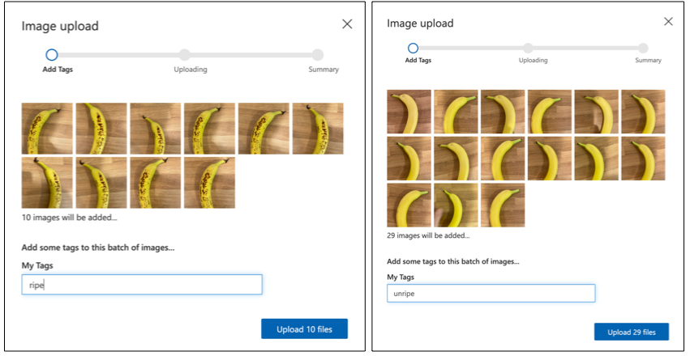

<!--
CO_OP_TRANSLATOR_METADATA:
{
  "original_hash": "f5e63c916d2dd97d58be12aaf76bd9f1",
  "translation_date": "2025-08-27T20:35:34+00:00",
  "source_file": "4-manufacturing/lessons/1-train-fruit-detector/README.md",
  "language_code": "fi"
}
-->
# Kouluta hedelmien laadun tunnistaja


> Sketchnote: [Nitya Narasimhan](https://github.com/nitya). Klikkaa kuvaa nähdäksesi suuremman version.

Tämä video tarjoaa yleiskatsauksen Azure Custom Vision -palvelusta, joka käsitellään tässä oppitunnissa.

[](https://www.youtube.com/watch?v=TETcDLJlWR4)

> 🎥 Klikkaa yllä olevaa kuvaa katsoaksesi videon

## Ennakkokysely

[Ennakkokysely](https://black-meadow-040d15503.1.azurestaticapps.net/quiz/29)

## Johdanto

Viime aikojen tekoälyn (AI) ja koneoppimisen (ML) nousu tarjoaa laajan valikoiman mahdollisuuksia nykyajan kehittäjille. ML-malleja voidaan kouluttaa tunnistamaan erilaisia asioita kuvista, kuten raakoja hedelmiä, ja tätä voidaan käyttää IoT-laitteissa auttamaan tuottamaan lajittelua joko sadonkorjuun aikana tai tehtaissa ja varastoissa tapahtuvan käsittelyn yhteydessä.

Tässä oppitunnissa opit kuvien luokittelusta - ML-mallien avulla erottamaan kuvia eri asioista. Opit kouluttamaan kuvien luokittelijan erottamaan hyvät hedelmät huonoista, kuten liian raaoista, ylikypsistä, kolhiintuneista tai pilaantuneista.

Tässä oppitunnissa käsitellään:

* [AI:n ja ML:n käyttö ruoan lajittelussa](../../../../../4-manufacturing/lessons/1-train-fruit-detector)
* [Kuvien luokittelu koneoppimisen avulla](../../../../../4-manufacturing/lessons/1-train-fruit-detector)
* [Kuvien luokittelijan kouluttaminen](../../../../../4-manufacturing/lessons/1-train-fruit-detector)
* [Kuvien luokittelijan testaaminen](../../../../../4-manufacturing/lessons/1-train-fruit-detector)
* [Kuvien luokittelijan uudelleenkouluttaminen](../../../../../4-manufacturing/lessons/1-train-fruit-detector)

## AI:n ja ML:n käyttö ruoan lajittelussa

Maailman väestön ruokkiminen on haastavaa, erityisesti hinnalla, joka tekee ruoasta kaikkien saatavilla. Yksi suurimmista kustannuksista on työvoima, joten viljelijät kääntyvät yhä enemmän automaation ja IoT-työkalujen puoleen vähentääkseen työvoimakustannuksiaan. Käsin korjaaminen on työlästä (ja usein raskasta työtä), ja sitä korvataan koneilla, erityisesti rikkaammissa maissa. Vaikka koneiden käyttö sadonkorjuussa säästää kustannuksia, siinä on haittapuoli - kyky lajitella ruokaa sadonkorjuun aikana.

Kaikki sadot eivät kypsy tasaisesti. Esimerkiksi tomaateissa voi olla vielä vihreitä hedelmiä, kun suurin osa on valmis korjattavaksi. Vaikka näiden varhainen korjaaminen on hukkaa, viljelijälle on halvempaa ja helpompaa korjata kaikki koneella ja hävittää raaka tuote myöhemmin.

✅ Tarkastele erilaisia hedelmiä tai vihanneksia, joko lähelläsi kasvavilla tiloilla tai puutarhassasi, tai kaupoissa. Ovatko ne kaikki saman kypsyisiä, vai näetkö vaihtelua?

Automaattisen sadonkorjuun nousu siirsi tuottelajittelun sadonkorjuusta tehtaaseen. Ruoka kulki pitkillä kuljetushihnoilla, joissa tiimit poimivat tuotteita ja poistivat kaiken, mikä ei täyttänyt vaadittua laatustandardia. Sadonkorjuu oli halvempaa koneiden ansiosta, mutta ruoan manuaalinen lajittelu oli edelleen kallista.


Seuraava kehitysaskel oli käyttää koneita lajitteluun, joko sadonkorjuukoneeseen sisäänrakennettuna tai käsittelylaitoksissa. Näiden koneiden ensimmäinen sukupolvi käytti optisia sensoreita värien havaitsemiseen, ohjaten toimilaitteita työntämään vihreät tomaatit jäteastiaan vipujen tai ilmapuhallusten avulla, jättäen punaiset tomaatit jatkamaan kuljetushihnoilla.

Tässä videossa, kun tomaatit putoavat yhdeltä kuljetushihnalta toiselle, vihreät tomaatit havaitaan ja heitetään astiaan vipujen avulla.

✅ Mitä olosuhteita tarvitsisit tehtaassa tai pellolla, jotta nämä optiset sensorit toimisivat oikein?

Näiden lajittelukoneiden viimeisimmät kehitysaskeleet hyödyntävät AI:ta ja ML:ää, käyttäen malleja, jotka on koulutettu erottamaan hyvä tuote huonosta, ei vain ilmeisten värieroavaisuuksien, kuten vihreät tomaatit vs punaiset, vaan myös hienovaraisempien ulkonäköerojen perusteella, jotka voivat viitata sairauteen tai kolhiintumiseen.

## Kuvien luokittelu koneoppimisen avulla

Perinteinen ohjelmointi tarkoittaa, että otat dataa, sovellat algoritmia siihen ja saat tuloksen. Esimerkiksi edellisessä projektissa otit GPS-koordinaatteja ja geoaidan, sovelsit Azure Mapsin tarjoamaa algoritmia ja sait tulokseksi, oliko piste geoaidan sisällä vai ulkopuolella. Syötit lisää dataa, sait lisää tuloksia.


Koneoppiminen kääntää tämän ympäri - aloitat datalla ja tunnetuilla tuloksilla, ja koneoppimisalgoritmi oppii datasta. Voit sitten ottaa tämän koulutetun algoritmin, jota kutsutaan *koneoppimismalliksi* tai *malliksi*, ja syöttää uutta dataa saadaksesi uusia tuloksia.

> 🎓 Prosessia, jossa koneoppimisalgoritmi oppii datasta, kutsutaan *kouluttamiseksi*. Syötteet ja tunnetut tulokset kutsutaan *koulutusdataksi*.

Esimerkiksi voisit antaa mallille miljoonia kuvia raaoista banaaneista syötteenä, ja koulutustuloksena `raaka`, sekä miljoonia kypsien banaanien kuvia syötteenä ja tuloksena `kypsä`. ML-algoritmi loisi sitten mallin tämän datan perusteella. Voit sitten antaa tälle mallille uuden kuvan banaanista, ja se ennustaisi, onko uusi kuva kypsä vai raaka banaani.

> 🎓 ML-mallien tuloksia kutsutaan *ennusteiksi*.


ML-mallit eivät anna binäärivastausta, vaan todennäköisyyksiä. Esimerkiksi malli voi saada kuvan banaanista ja ennustaa `kypsä` 99,7% ja `raaka` 0,3%. Koodisi valitsisi parhaan ennustuksen ja päättäisi, että banaani on kypsä.

ML-mallia, jota käytetään tällaisten kuvien tunnistamiseen, kutsutaan *kuvien luokittelijaksi* - sille annetaan merkittyjä kuvia, ja se luokittelee uusia kuvia näiden merkintöjen perusteella.

> 💁 Tämä on yksinkertaistus, ja on olemassa monia muita tapoja kouluttaa malleja, jotka eivät aina tarvitse merkittyjä tuloksia, kuten ohjaamaton oppiminen. Jos haluat oppia lisää ML:stä, tutustu [ML for beginners -koneoppimisen 24 oppitunnin kurssiin](https://aka.ms/ML-beginners).

## Kuvien luokittelijan kouluttaminen

Jotta voit onnistuneesti kouluttaa kuvien luokittelijan, tarvitset miljoonia kuvia. Kuitenkin, kun sinulla on kuvien luokittelija, joka on koulutettu miljoonilla tai miljardeilla erilaisilla kuvilla, voit käyttää sitä uudelleen ja kouluttaa sen uudelleen pienellä määrällä kuvia ja saada hyviä tuloksia, käyttäen prosessia nimeltä *siirto-oppiminen*.

> 🎓 Siirto-oppiminen tarkoittaa, että siirrät oppimisen olemassa olevasta ML-mallista uuteen malliin uuden datan perusteella.

Kun kuvien luokittelija on koulutettu laajalle valikoimalle kuvia, sen sisäiset mekanismit ovat erinomaisia muotojen, värien ja kuvioiden tunnistamisessa. Siirto-oppiminen mahdollistaa mallin käyttämään jo oppimaansa kuvien osien tunnistamisessa ja käyttämään sitä uusien kuvien tunnistamiseen.


Voit ajatella tätä vähän kuin lasten muotokirjoja, joissa kun osaat tunnistaa puolipyöreän, suorakulmion ja kolmion, voit tunnistaa purjeveneen tai kissan riippuen näiden muotojen järjestelystä. Kuvien luokittelija voi tunnistaa muodot, ja siirto-oppiminen opettaa sille, mikä yhdistelmä muodostaa veneen tai kissan - tai kypsän banaanin.

On olemassa laaja valikoima työkaluja, jotka voivat auttaa sinua tässä, mukaan lukien pilvipohjaiset palvelut, jotka voivat auttaa sinua kouluttamaan mallisi ja käyttämään sitä verkkosovellusrajapintojen kautta.

> 💁 Näiden mallien kouluttaminen vaatii paljon laskentatehoa, yleensä grafiikkaprosessoreiden (GPU) avulla. Sama erikoistunut laitteisto, joka tekee Xbox-peleistäsi upeita, voidaan käyttää koneoppimismallien kouluttamiseen. Pilvipalveluiden avulla voit vuokrata aikaa tehokkaille tietokoneille, joissa on GPU:t, kouluttaaksesi näitä malleja, saaden käyttöösi tarvitsemasi laskentatehon vain ajaksi, jonka tarvitset.

## Custom Vision

Custom Vision on pilvipohjainen työkalu kuvien luokittelijoiden kouluttamiseen. Sen avulla voit kouluttaa luokittelijan käyttämällä vain pientä määrää kuvia. Voit ladata kuvia verkkosivuston, verkkosovellusrajapinnan tai SDK:n kautta, antaen jokaiselle kuvalle *tunnisteen*, joka sisältää kuvan luokituksen. Sen jälkeen voit kouluttaa mallin ja testata sen suorituskykyä. Kun olet tyytyväinen malliin, voit julkaista sen versioita, joita voidaan käyttää verkkosovellusrajapinnan tai SDK:n kautta.


> 💁 Voit kouluttaa Custom Vision -mallin vain 5 kuvalla per luokitus, mutta enemmän on parempi. Saat parempia tuloksia vähintään 30 kuvalla.

Custom Vision on osa Microsoftin AI-työkalujen valikoimaa, jota kutsutaan Cognitive Servicesiksi. Nämä ovat AI-työkaluja, joita voidaan käyttää joko ilman koulutusta tai pienellä määrällä koulutusta. Ne sisältävät puheentunnistuksen ja käännöksen, kielen ymmärtämisen ja kuvien analysoinnin. Nämä ovat saatavilla ilmaisella tasolla Azure-palveluina.

> 💁 Ilmainen taso riittää mallin luomiseen, sen kouluttamiseen ja sen käyttämiseen kehitystyössä. Voit lukea ilmaisen tason rajoituksista [Custom Vision Limits and quotas -sivulta Microsoftin dokumentaatiossa](https://docs.microsoft.com/azure/cognitive-services/custom-vision-service/limits-and-quotas?WT.mc_id=academic-17441-jabenn).

### Tehtävä - luo Cognitive Services -resurssi

Custom Visionin käyttämiseksi sinun täytyy ensin luoda kaksi Cognitive Services -resurssia Azureen Azure CLI:n avulla, yksi Custom Vision -koulutusta varten ja toinen Custom Vision -ennustusta varten.

1. Luo resurssiryhmä tätä projektia varten nimeltä `fruit-quality-detector`.

1. Käytä seuraavaa komentoa luodaksesi ilmaisen Custom Vision -koulutusresurssin:

    ```sh
    az cognitiveservices account create --name fruit-quality-detector-training \
                                        --resource-group fruit-quality-detector \
                                        --kind CustomVision.Training \
                                        --sku F0 \
                                        --yes \
                                        --location <location>
    ```

    Korvaa `<location>` sijainnilla, jota käytit resurssiryhmän luomisessa.

    Tämä luo Custom Vision -koulutusresurssin resurssiryhmääsi. Sen nimi on `fruit-quality-detector-training` ja se käyttää `F0` SKU:ta, joka on ilmainen taso. `--yes` -vaihtoehto tarkoittaa, että hyväksyt Cognitive Servicesin ehdot ja edellytykset.

> 💁 Käytä `S0` SKU:ta, jos sinulla on jo ilmainen tili, joka käyttää mitä tahansa Cognitive Services -palvelua.

1. Käytä seuraavaa komentoa luodaksesi ilmaisen Custom Vision -ennustusresurssin:

    ```sh
    az cognitiveservices account create --name fruit-quality-detector-prediction \
                                        --resource-group fruit-quality-detector \
                                        --kind CustomVision.Prediction \
                                        --sku F0 \
                                        --yes \
                                        --location <location>
    ```

    Korvaa `<location>` sijainnilla, jota käytit resurssiryhmän luomisessa.

    Tämä luo Custom Vision -ennustusresurssin resurssiryhmääsi. Sen nimi on `fruit-quality-detector-prediction` ja se käyttää `F0` SKU:ta, joka on ilmainen taso. `--yes` -vaihtoehto tarkoittaa, että hyväksyt Cognitive Servicesin ehdot ja edellytykset.

### Tehtävä - luo kuvien luokitteluprojekti

1. Käynnistä Custom Vision -portaali osoitteessa [CustomVision.ai](https://customvision.ai) ja kirjaudu sisään Microsoft-tililläsi, jota käytit Azure-tiliäsi varten.

1. Seuraa [Microsoft-dokumentaation luokittelijan pikaohjeen uuden projektin luomisen osaa](https://docs.microsoft.com/azure/cognitive-services/custom-vision-service/getting-started-build-a-classifier?WT.mc_id=academic-17441-jabenn#create-a-new-project) luodaksesi uuden Custom Vision -projektin. Käyttöliittymä voi muuttua, ja nämä dokumentit ovat aina ajantasaisin viite.

    Nimeä projektisi `fruit-quality-detector`.

    Kun luot projektisi, varmista, että käytät aiemmin luomaasi `fruit-quality-detector-training` -resurssia. Käytä *Classification*-projektityyppiä, *Multiclass*-luokittelutyyppiä ja *Food*-toimialaa.

    

✅ Käytä aikaa tutustuaksesi Custom Vision -käyttöliittymään kuvien luokittelijallesi.

### Tehtävä - kouluta kuvien luokittelijaprojektisi

Kuvien luokittelijan kouluttamiseksi tarvitset useita kuvia hedelmistä, sekä hyvä- että huonolaatuisia, jotta voit merkitä ne hyviksi ja huonoiksi, kuten kypsäksi ja ylikypsäksi banaaniksi.
💁 Nämä luokittelijat voivat luokitella kuvia mistä tahansa, joten jos sinulla ei ole erilaista laatua olevia hedelmiä käsillä, voit käyttää kahta erilaista hedelmälajia tai kissoja ja koiria!
Ideaalisesti jokaisessa kuvassa tulisi olla vain hedelmä, joko yhtenäisellä taustalla tai monipuolisilla taustoilla. Varmista, ettei taustalla ole mitään, mikä viittaa kypsään tai raakaan hedelmään.

> 💁 On tärkeää, ettei taustat tai esineet, jotka eivät liity luokiteltavaan asiaan, ole spesifisiä jokaiselle tunnisteelle. Muuten luokitin saattaa luokitella pelkän taustan perusteella. Esimerkiksi ihosyövän luokitin koulutettiin normaaleilla ja syöpäisillä luomilla, ja syöpäiset luomet olivat aina mitattavina viivottimella. Lopulta luokitin oli lähes 100 % tarkka tunnistamaan viivottimia kuvista, ei syöpäisiä luomia.

Kuvien luokittimet toimivat hyvin matalalla resoluutiolla. Esimerkiksi Custom Vision voi käyttää koulutus- ja ennustekuvia, joiden koko on jopa 10240x10240, mutta malli koulutetaan ja toimii kuvilla, joiden koko on 227x227. Suuremmat kuvat pienennetään tähän kokoon, joten varmista, että luokiteltava asia täyttää suuren osan kuvasta, muuten se voi olla liian pieni luokittimen käyttämässä pienemmässä kuvassa.

1. Kerää kuvia luokittimellesi. Tarvitset vähintään 5 kuvaa jokaista tunnistetta varten kouluttaaksesi luokittimen, mutta mitä enemmän, sen parempi. Tarvitset myös muutamia lisäkuvia luokittimen testaamiseen. Näiden kuvien tulisi olla erilaisia kuvia samasta asiasta. Esimerkiksi:

    * Käytä 2 kypsää banaania ja ota kuvia kummastakin eri kulmista, vähintään 7 kuvaa (5 koulutukseen, 2 testaukseen), mutta mieluiten enemmän.

        

    * Toista sama prosessi käyttäen 2 raakaa banaania.

    Sinulla tulisi olla vähintään 10 koulutuskuvaa, joista vähintään 5 kypsää ja 5 raakaa, sekä 4 testauskuvaa, 2 kypsää ja 2 raakaa. Kuvien tulisi olla png- tai jpeg-muodossa, alle 6MB. Jos luot ne esimerkiksi iPhonella, ne voivat olla korkearesoluutioisia HEIC-kuvia, jotka täytyy muuntaa ja mahdollisesti pienentää. Mitä enemmän kuvia, sen parempi, ja sinulla tulisi olla saman verran kypsiä ja raakoja.

    Jos sinulla ei ole sekä kypsiä että raakoja hedelmiä, voit käyttää eri hedelmiä tai mitä tahansa kahta saatavilla olevaa esinettä. Voit myös löytää esimerkkikuvia [images](../../../../../4-manufacturing/lessons/1-train-fruit-detector/images)-kansiosta kypsistä ja raaoista banaaneista, joita voit käyttää.

1. Seuraa [Microsoft-dokumentaation luokittimen nopean aloituksen osion kuvat lataaminen ja tunnistaminen](https://docs.microsoft.com/azure/cognitive-services/custom-vision-service/getting-started-build-a-classifier?WT.mc_id=academic-17441-jabenn#upload-and-tag-images) ohjeita ladataksesi koulutuskuvasi. Tunnista kypsät hedelmät `ripe`-tunnisteella ja raa'at hedelmät `unripe`-tunnisteella.

    

1. Seuraa [Microsoft-dokumentaation luokittimen nopean aloituksen osion luokittimen kouluttaminen](https://docs.microsoft.com/azure/cognitive-services/custom-vision-service/getting-started-build-a-classifier?WT.mc_id=academic-17441-jabenn#train-the-classifier) ohjeita kouluttaaksesi kuvien luokittimen ladatuilla kuvillasi.

    Sinulle annetaan valinta koulutustyypistä. Valitse **Quick Training**.

Luokitin alkaa kouluttautua. Koulutus kestää muutaman minuutin.

> 🍌 Jos päätät syödä hedelmäsi luokittimen koulutuksen aikana, varmista, että sinulla on tarpeeksi kuvia testaukseen ensin!

## Testaa kuvien luokitin

Kun luokitin on koulutettu, voit testata sitä antamalla sille uuden kuvan luokiteltavaksi.

### Tehtävä - testaa kuvien luokitin

1. Seuraa [Microsoft-dokumentaation testaa mallisi -osio](https://docs.microsoft.com/azure/cognitive-services/custom-vision-service/test-your-model?WT.mc_id=academic-17441-jabenn#test-your-model) ohjeita testataksesi kuvien luokitinta. Käytä aiemmin luotuja testauskuvia, älä mitään koulutuksessa käytettyjä kuvia.

    

1. Kokeile kaikkia testauskuvia, joihin sinulla on pääsy, ja tarkkaile todennäköisyyksiä.

## Kouluta kuvien luokitin uudelleen

Kun testaat luokitinta, se ei välttämättä anna odottamiasi tuloksia. Kuvien luokittimet käyttävät koneoppimista tehdäkseen ennusteita siitä, mitä kuvassa on, perustuen todennäköisyyksiin, että tiettyjen kuvien ominaisuudet vastaavat tiettyä tunnistetta. Se ei ymmärrä, mitä kuvassa on – se ei tiedä, mikä banaani on tai ymmärrä, mikä tekee banaanista banaanin eikä veneen. Voit parantaa luokitinta kouluttamalla sitä uudelleen kuvilla, joissa se tekee virheitä.

Joka kerta, kun teet ennusteen nopean testauksen avulla, kuva ja tulokset tallennetaan. Voit käyttää näitä kuvia mallin uudelleenkoulutukseen.

### Tehtävä - kouluta kuvien luokitin uudelleen

1. Seuraa [Microsoft-dokumentaation käytä ennustettua kuvaa koulutukseen -osio](https://docs.microsoft.com/azure/cognitive-services/custom-vision-service/test-your-model?WT.mc_id=academic-17441-jabenn#use-the-predicted-image-for-training) ohjeita kouluttaaksesi mallin uudelleen, käyttäen oikeaa tunnistetta jokaiselle kuvalle.

1. Kun mallisi on koulutettu uudelleen, testaa sitä uusilla kuvilla.

---

## 🚀 Haaste

Mitä luulet tapahtuvan, jos käytät mansikan kuvaa mallilla, joka on koulutettu banaaneilla, tai kuvaa puhallettavasta banaanista, tai henkilöstä banaanipuvussa, tai jopa keltaisesta sarjakuvahahmosta, kuten Simpsonien hahmosta?

Kokeile ja katso, mitä ennusteet ovat. Voit löytää kuvia kokeiltavaksi käyttämällä [Bing-kuvahaun](https://www.bing.com/images/trending).

## Luentojälkeinen kysely

[Luentojälkeinen kysely](https://black-meadow-040d15503.1.azurestaticapps.net/quiz/30)

## Katsaus ja itseopiskelu

* Kun koulutit luokittimesi, näit arvoja *Precision*, *Recall* ja *AP*, jotka arvioivat luodun mallin. Lue, mitä nämä arvot tarkoittavat [Microsoft-dokumentaation luokittimen nopean aloituksen osion arvioi luokitin](https://docs.microsoft.com/azure/cognitive-services/custom-vision-service/getting-started-build-a-classifier?WT.mc_id=academic-17441-jabenn#evaluate-the-classifier) avulla.
* Lue, miten voit parantaa luokitinta [Microsoft-dokumentaation paranna Custom Vision -malliasi -osio](https://docs.microsoft.com/azure/cognitive-services/custom-vision-service/getting-started-improving-your-classifier?WT.mc_id=academic-17441-jabenn) avulla.

## Tehtävä

[Kouluta luokitin useille hedelmille ja vihanneksille](assignment.md)

---

**Vastuuvapauslauseke**:  
Tämä asiakirja on käännetty käyttämällä tekoälypohjaista käännöspalvelua [Co-op Translator](https://github.com/Azure/co-op-translator). Vaikka pyrimme tarkkuuteen, huomioithan, että automaattiset käännökset voivat sisältää virheitä tai epätarkkuuksia. Alkuperäistä asiakirjaa sen alkuperäisellä kielellä tulisi pitää ensisijaisena lähteenä. Kriittisen tiedon osalta suositellaan ammattimaista ihmiskäännöstä. Emme ole vastuussa väärinkäsityksistä tai virhetulkinnoista, jotka johtuvat tämän käännöksen käytöstä.