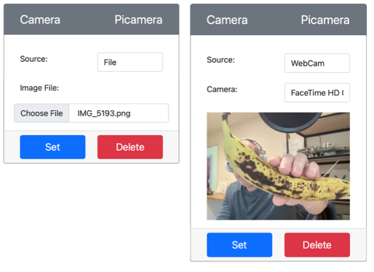

<!--
CO_OP_TRANSLATOR_METADATA:
{
  "original_hash": "3ba7150ffc4a6999f6c3cfb4906ec7df",
  "translation_date": "2025-08-27T20:43:49+00:00",
  "source_file": "4-manufacturing/lessons/2-check-fruit-from-device/virtual-device-camera.md",
  "language_code": "fi"
}
-->
# Tallenna kuva - Virtuaalinen IoT-laitteisto

Tässä osassa oppituntia lisäät kameran sensorin virtuaaliseen IoT-laitteeseesi ja luet kuvia siitä.

## Laitteisto

Virtuaalinen IoT-laite käyttää simuloitua kameraa, joka lähettää joko kuvia tiedostoista tai verkkokamerastasi.

### Lisää kamera CounterFitiin

Virtuaalisen kameran käyttämiseksi sinun täytyy lisätä se CounterFit-sovellukseen.

#### Tehtävä - lisää kamera CounterFitiin

Lisää kamera CounterFit-sovellukseen.

1. Luo uusi Python-sovellus tietokoneellesi kansioon nimeltä `fruit-quality-detector`, jossa on yksi tiedosto nimeltä `app.py` ja Python-virtuaaliympäristö, ja lisää CounterFit-pip-paketit.

    > ⚠️ Voit viitata [ohjeisiin CounterFit Python -projektin luomisesta ja asettamisesta oppitunnilla 1 tarvittaessa](../../../1-getting-started/lessons/1-introduction-to-iot/virtual-device.md).

1. Asenna lisäpaketti Pipin kautta, joka sisältää CounterFit-shimin, joka voi kommunikoida kameran sensoreiden kanssa simuloimalla osaa [Picamera Pip -paketista](https://pypi.org/project/picamera/). Varmista, että asennat tämän terminaalista, jossa virtuaaliympäristö on aktivoitu.

    ```sh
    pip install counterfit-shims-picamera
    ```

1. Varmista, että CounterFit-verkkosovellus on käynnissä.

1. Luo kamera:

    1. *Create sensor* -laatikossa *Sensors*-paneelissa, avaa *Sensor type* -valikko ja valitse *Camera*.

    1. Aseta *Name* arvoksi `Picamera`.

    1. Valitse **Add**-painike luodaksesi kameran.

    

    Kamera luodaan ja näkyy sensorilistassa.

    

## Ohjelmoi kamera

Virtuaalinen IoT-laite voidaan nyt ohjelmoida käyttämään virtuaalista kameraa.

### Tehtävä - ohjelmoi kamera

Ohjelmoi laite.

1. Varmista, että `fruit-quality-detector`-sovellus on auki VS Codessa.

1. Avaa `app.py`-tiedosto.

1. Lisää seuraava koodi `app.py`-tiedoston alkuun yhdistääksesi sovelluksen CounterFitiin:

    ```python
    from counterfit_connection import CounterFitConnection
    CounterFitConnection.init('127.0.0.1', 5000)
    ```

1. Lisää seuraava koodi `app.py`-tiedostoon:

    ```python
    import io
    from counterfit_shims_picamera import PiCamera
    ```

    Tämä koodi tuo tarvittavat kirjastot, mukaan lukien `PiCamera`-luokan counterfit_shims_picamera-kirjastosta.

1. Lisää seuraava koodi tämän alle kameran alustamiseksi:

    ```python
    camera = PiCamera()
    camera.resolution = (640, 480)
    camera.rotation = 0
    ```

    Tämä koodi luo PiCamera-objektin ja asettaa resoluution 640x480. Vaikka suurempia resoluutioita tuetaan, kuvanluokitin toimii paljon pienemmillä kuvilla (227x227), joten ei ole tarpeen tallentaa ja lähettää suurempia kuvia.

    Rivi `camera.rotation = 0` asettaa kuvan kierron asteina. Jos sinun täytyy kiertää kuvaa verkkokamerasta tai tiedostosta, aseta tämä sopivaksi. Esimerkiksi, jos haluat muuttaa verkkokameran vaakasuunnassa olevan banaanikuvan pystysuuntaiseksi, aseta `camera.rotation = 90`.

1. Lisää seuraava koodi tämän alle kuvan tallentamiseksi binääridatana:

    ```python
    image = io.BytesIO()
    camera.capture(image, 'jpeg')
    image.seek(0)
    ```

    Tämä koodi luo `BytesIO`-objektin binääridatan tallentamista varten. Kuva luetaan kamerasta JPEG-tiedostona ja tallennetaan tähän objektiin. Tämä objekti sisältää sijainti-indikaattorin, joka kertoo, missä kohtaa dataa ollaan, jotta lisää dataa voidaan kirjoittaa loppuun tarvittaessa. Rivi `image.seek(0)` siirtää tämän sijainnin takaisin alkuun, jotta kaikki data voidaan lukea myöhemmin.

1. Lisää tämän alle seuraava koodi kuvan tallentamiseksi tiedostoon:

    ```python
    with open('image.jpg', 'wb') as image_file:
        image_file.write(image.read())
    ```

    Tämä koodi avaa tiedoston nimeltä `image.jpg` kirjoittamista varten, lukee kaiken datan `BytesIO`-objektista ja kirjoittaa sen tiedostoon.

    > 💁 Voit tallentaa kuvan suoraan tiedostoon ilman `BytesIO`-objektia antamalla tiedostonimen `camera.capture`-kutsulle. Syynä `BytesIO`-objektin käyttöön on, että myöhemmin tässä oppitunnissa voit lähettää kuvan kuvantunnistimelle.

1. Määritä kuva, jonka kamera CounterFitissä tallentaa. Voit joko asettaa *Source*-asetuksen *File*-tilaan ja ladata kuvatiedoston, tai asettaa *Source*-asetuksen *WebCam*-tilaan, jolloin kuvat tallennetaan verkkokamerastasi. Varmista, että valitset **Set**-painikkeen kuvan valitsemisen tai verkkokameran valitsemisen jälkeen.

    

1. Kuva tallennetaan ja tallennetaan nimellä `image.jpg` nykyiseen kansioon. Näet tämän tiedoston VS Code -tiedostonhallinnassa. Valitse tiedosto nähdäksesi kuvan. Jos se tarvitsee kiertoa, päivitä rivi `camera.rotation = 0` tarpeen mukaan ja ota uusi kuva.

> 💁 Löydät tämän koodin [code-camera/virtual-iot-device](../../../../../4-manufacturing/lessons/2-check-fruit-from-device/code-camera/virtual-iot-device) -kansiosta.

😀 Kameran ohjelmointi onnistui!

---

**Vastuuvapauslauseke**:  
Tämä asiakirja on käännetty käyttämällä tekoälypohjaista käännöspalvelua [Co-op Translator](https://github.com/Azure/co-op-translator). Vaikka pyrimme tarkkuuteen, huomioithan, että automaattiset käännökset voivat sisältää virheitä tai epätarkkuuksia. Alkuperäinen asiakirja sen alkuperäisellä kielellä tulisi pitää ensisijaisena lähteenä. Kriittisen tiedon osalta suositellaan ammattimaista ihmiskäännöstä. Emme ole vastuussa väärinkäsityksistä tai virhetulkinnoista, jotka johtuvat tämän käännöksen käytöstä.