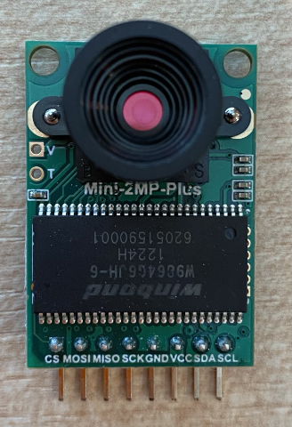

<!--
CO_OP_TRANSLATOR_METADATA:
{
  "original_hash": "160be8c0f558687f6686dca64f10f739",
  "translation_date": "2025-08-27T20:44:38+00:00",
  "source_file": "4-manufacturing/lessons/2-check-fruit-from-device/wio-terminal-camera.md",
  "language_code": "fi"
}
-->
# Tallenna kuva - Wio Terminal

Tässä oppitunnin osassa lisäät kameran Wio Terminaliin ja otat kuvia sillä.

## Laitteisto

Wio Terminal tarvitsee kameran.

Kamera, jota käytät, on [ArduCam Mini 2MP Plus](https://www.arducam.com/product/arducam-2mp-spi-camera-b0067-arduino/). Tämä on 2 megapikselin kamera, joka perustuu OV2640-kuvakennoon. Se kommunikoi SPI-liitännän kautta kuvien ottamiseksi ja käyttää I2C:tä anturin konfigurointiin.

## Yhdistä kamera

ArduCam ei sisällä Grove-liitintä, vaan se yhdistetään sekä SPI- että I2C-väylään GPIO-pinnien kautta Wio Terminalissa.

### Tehtävä - yhdistä kamera

Yhdistä kamera.



1. ArduCamin pohjassa olevat pinnit täytyy yhdistää Wio Terminalin GPIO-pinneihin. Jotta oikeat pinnit löytyvät helpommin, kiinnitä Wio Terminalin mukana tuleva GPIO-tarralappu pinneihin:

    

1. Käytä hyppylankoja ja tee seuraavat liitännät:

    | ArduCAM-pinni | Wio Terminal -pinni | Kuvaus                                 |
    | ------------- | -------------------- | -------------------------------------- |
    | CS            | 24 (SPI_CS)          | SPI Chip Select                        |
    | MOSI          | 19 (SPI_MOSI)        | SPI-ohjaimen ulostulo, laitteen sisääntulo |
    | MISO          | 21 (SPI_MISO)        | SPI-ohjaimen sisääntulo, laitteen ulostulo |
    | SCK           | 23 (SPI_SCLK)        | SPI-sarjakello                         |
    | GND           | 6 (GND)              | Maa - 0V                               |
    | VCC           | 4 (5V)               | 5V virtalähde                          |
    | SDA           | 3 (I2C1_SDA)         | I2C-sarjadata                          |
    | SCL           | 5 (I2C1_SCL)         | I2C-sarjakello                         |

    

    GND- ja VCC-liitännät tarjoavat 5V virtalähteen ArduCamille. Se toimii 5V:lla, toisin kuin Grove-anturit, jotka toimivat 3V:lla. Tämä virta tulee suoraan USB-C-liitännästä, joka syöttää virtaa laitteelle.

    > 💁 SPI-liitännässä ArduCamin pinni-merkinnät ja Wio Terminalin pinni-nimet, joita käytetään koodissa, käyttävät edelleen vanhaa nimeämiskäytäntöä. Tämän oppitunnin ohjeet käyttävät uutta nimeämiskäytäntöä, paitsi silloin kun pinni-nimiä käytetään koodissa.

1. Voit nyt yhdistää Wio Terminalin tietokoneeseesi.

## Ohjelmoi laite yhdistämään kameraan

Wio Terminal voidaan nyt ohjelmoida käyttämään liitettyä ArduCAM-kameraa.

### Tehtävä - ohjelmoi laite yhdistämään kameraan

1. Luo uusi Wio Terminal -projekti PlatformIO:ssa. Nimeä projekti `fruit-quality-detector`. Lisää koodia `setup`-funktioon sarjaportin konfiguroimiseksi.

1. Lisää koodia yhdistääksesi WiFiin, ja tallenna WiFi-tunnistetiedot tiedostoon nimeltä `config.h`. Älä unohda lisätä tarvittavia kirjastoja `platformio.ini`-tiedostoon.

1. ArduCam-kirjasto ei ole saatavilla Arduino-kirjastona, joka voidaan asentaa `platformio.ini`-tiedostosta. Sen sijaan se täytyy asentaa lähdekoodista heidän GitHub-sivultaan. Voit tehdä tämän joko:

    * Kloonaamalla repositorion osoitteesta [https://github.com/ArduCAM/Arduino.git](https://github.com/ArduCAM/Arduino.git)
    * Siirtymällä GitHub-repositorioon osoitteessa [github.com/ArduCAM/Arduino](https://github.com/ArduCAM/Arduino) ja lataamalla koodin zip-tiedostona **Code**-painikkeesta

1. Tarvitset vain `ArduCAM`-kansion tästä koodista. Kopioi koko kansio projektisi `lib`-kansioon.

    > ⚠️ Koko kansio täytyy kopioida, jotta koodi on `lib/ArduCam`. Älä kopioi vain `ArduCam`-kansion sisältöä `lib`-kansioon, vaan kopioi koko kansio.

1. ArduCam-kirjastokoodi toimii useille kameratyypeille. Käytettävä kameratyyppi konfiguroidaan kääntäjän lipuilla - tämä pitää rakennetun kirjaston mahdollisimman pienenä poistamalla koodin kameroille, joita et käytä. Konfiguroidaksesi kirjaston OV2640-kameralle, lisää seuraava `platformio.ini`-tiedoston loppuun:

    ```ini
    build_flags =
        -DARDUCAM_SHIELD_V2
        -DOV2640_CAM
    ```

    Tämä asettaa kaksi kääntäjän lippua:

      * `ARDUCAM_SHIELD_V2` kertoo kirjastolle, että kamera on Arduino-laudalla, joka tunnetaan nimellä shield.
      * `OV2640_CAM` kertoo kirjastolle, että mukaan otetaan vain OV2640-kameran koodi.

1. Lisää otsikkotiedosto `src`-kansioon nimeltä `camera.h`. Tämä sisältää koodin kameran kanssa kommunikointiin. Lisää seuraava koodi tähän tiedostoon:

    ```cpp
    #pragma once
    
    #include <ArduCAM.h>
    #include <Wire.h>
    
    class Camera
    {
    public:
        Camera(int format, int image_size) : _arducam(OV2640, PIN_SPI_SS)
        {
            _format = format;
            _image_size = image_size;
        }
    
        bool init()
        {
            // Reset the CPLD
            _arducam.write_reg(0x07, 0x80);
            delay(100);
    
            _arducam.write_reg(0x07, 0x00);
            delay(100);
    
            // Check if the ArduCAM SPI bus is OK
            _arducam.write_reg(ARDUCHIP_TEST1, 0x55);
            if (_arducam.read_reg(ARDUCHIP_TEST1) != 0x55)
            {
                return false;
            }
                
            // Change MCU mode
            _arducam.set_mode(MCU2LCD_MODE);
    
            uint8_t vid, pid;
    
            // Check if the camera module type is OV2640
            _arducam.wrSensorReg8_8(0xff, 0x01);
            _arducam.rdSensorReg8_8(OV2640_CHIPID_HIGH, &vid);
            _arducam.rdSensorReg8_8(OV2640_CHIPID_LOW, &pid);
            if ((vid != 0x26) && ((pid != 0x41) || (pid != 0x42)))
            {
                return false;
            }
            
            _arducam.set_format(_format);
            _arducam.InitCAM();
            _arducam.OV2640_set_JPEG_size(_image_size);
            _arducam.OV2640_set_Light_Mode(Auto);
            _arducam.OV2640_set_Special_effects(Normal);
            delay(1000);
    
            return true;
        }
    
        void startCapture()
        {
            _arducam.flush_fifo();
            _arducam.clear_fifo_flag();
            _arducam.start_capture();
        }
    
        bool captureReady()
        {
            return _arducam.get_bit(ARDUCHIP_TRIG, CAP_DONE_MASK);
        }
    
        bool readImageToBuffer(byte **buffer, uint32_t &buffer_length)
        {
            if (!captureReady()) return false;
    
            // Get the image file length
            uint32_t length = _arducam.read_fifo_length();
            buffer_length = length;
    
            if (length >= MAX_FIFO_SIZE)
            {
                return false;
            }
            if (length == 0)
            {
                return false;
            }
    
            // create the buffer
            byte *buf = new byte[length];
    
            uint8_t temp = 0, temp_last = 0;
            int i = 0;
            uint32_t buffer_pos = 0;
            bool is_header = false;
    
            _arducam.CS_LOW();
            _arducam.set_fifo_burst();
            
            while (length--)
            {
                temp_last = temp;
                temp = SPI.transfer(0x00);
                //Read JPEG data from FIFO
                if ((temp == 0xD9) && (temp_last == 0xFF)) //If find the end ,break while,
                {
                    buf[buffer_pos] = temp;
    
                    buffer_pos++;
                    i++;
                    
                    _arducam.CS_HIGH();
                }
                if (is_header == true)
                {
                    //Write image data to buffer if not full
                    if (i < 256)
                    {
                        buf[buffer_pos] = temp;
                        buffer_pos++;
                        i++;
                    }
                    else
                    {
                        _arducam.CS_HIGH();
    
                        i = 0;
                        buf[buffer_pos] = temp;
    
                        buffer_pos++;
                        i++;
    
                        _arducam.CS_LOW();
                        _arducam.set_fifo_burst();
                    }
                }
                else if ((temp == 0xD8) & (temp_last == 0xFF))
                {
                    is_header = true;
    
                    buf[buffer_pos] = temp_last;
                    buffer_pos++;
                    i++;
    
                    buf[buffer_pos] = temp;
                    buffer_pos++;
                    i++;
                }
            }
            
            _arducam.clear_fifo_flag();
    
            _arducam.set_format(_format);
            _arducam.InitCAM();
            _arducam.OV2640_set_JPEG_size(_image_size);
    
            // return the buffer
            *buffer = buf;
        }
    
    private:
        ArduCAM _arducam;
        int _format;
        int _image_size;
    };
    ```

    Tämä on matalan tason koodi, joka konfiguroi kameran ArduCam-kirjastojen avulla ja hakee kuvat tarvittaessa SPI-väylän kautta. Tämä koodi on hyvin spesifinen ArduCamille, joten sinun ei tarvitse huolehtia sen toiminnasta tässä vaiheessa.

1. Lisää `main.cpp`-tiedostoon seuraava koodi muiden `include`-lausuntojen alle sisällyttääksesi uuden tiedoston ja luodaksesi kameraluokan instanssin:

    ```cpp
    #include "camera.h"

    Camera camera = Camera(JPEG, OV2640_640x480);
    ```

    Tämä luo `Camera`-instanssin, joka tallentaa kuvat JPEG-muodossa resoluutiolla 640x480. Vaikka suurempia resoluutioita tuetaan (jopa 3280x2464), kuvien luokittelu toimii paljon pienemmillä kuvilla (227x227), joten ei ole tarpeen ottaa ja lähettää suurempia kuvia.

1. Lisää seuraava koodi tämän alle määrittääksesi funktion kameran asettamiseen:

    ```cpp
    void setupCamera()
    {
        pinMode(PIN_SPI_SS, OUTPUT);
        digitalWrite(PIN_SPI_SS, HIGH);
    
        Wire.begin();
        SPI.begin();
    
        if (!camera.init())
        {
            Serial.println("Error setting up the camera!");
        }
    }
    ```

    Tämä `setupCamera`-funktio aloittaa konfiguroimalla SPI Chip Select -pinnin (`PIN_SPI_SS`) korkeaksi, tehden Wio Terminalista SPI-ohjaimen. Se käynnistää sitten I2C- ja SPI-väylät. Lopuksi se alustaa kameraluokan, joka konfiguroi kameran anturiasetukset ja varmistaa, että kaikki on kytketty oikein.

1. Kutsu tätä funktiota `setup`-funktion lopussa:

    ```cpp
    setupCamera();
    ```

1. Rakenna ja lataa tämä koodi ja tarkista sarjaportin monitorin tuloste. Jos näet `Error setting up the camera!`, tarkista johdotukset varmistaaksesi, että kaikki kaapelit yhdistävät oikeat ArduCamin pinnit oikeisiin GPIO-pinneihin Wio Terminalissa ja että kaikki hyppylangat ovat kunnolla kiinni.

## Ota kuva

Wio Terminal voidaan nyt ohjelmoida ottamaan kuva, kun painiketta painetaan.

### Tehtävä - ota kuva

1. Mikro-ohjaimet suorittavat koodiasi jatkuvasti, joten ei ole helppoa käynnistää jotain, kuten valokuvan ottamista, ilman reaktiota anturiin. Wio Terminalissa on painikkeita, joten kamera voidaan asettaa käynnistymään yhdellä painikkeista. Lisää seuraava koodi `setup`-funktion loppuun konfiguroidaksesi C-painikkeen (yksi kolmesta yläpainikkeesta, lähimpänä virtakytkintä).

    

    ```cpp
    pinMode(WIO_KEY_C, INPUT_PULLUP);
    ```

    `INPUT_PULLUP`-tila kääntää syötteen. Esimerkiksi normaalisti painike lähettäisi matalan signaalin, kun sitä ei paineta, ja korkean signaalin, kun sitä painetaan. Kun tila on `INPUT_PULLUP`, se lähettää korkean signaalin, kun sitä ei paineta, ja matalan signaalin, kun sitä painetaan.

1. Lisää tyhjä funktio reagoimaan painikkeen painallukseen ennen `loop`-funktiota:

    ```cpp
    void buttonPressed()
    {
        
    }
    ```

1. Kutsu tätä funktiota `loop`-metodissa, kun painiketta painetaan:

    ```cpp
    void loop()
    {
        if (digitalRead(WIO_KEY_C) == LOW)
        {
            buttonPressed();
            delay(2000);
        }
    
        delay(200);
    }
    ```

    Tämä tarkistaa, onko painiketta painettu. Jos painiketta painetaan, kutsutaan `buttonPressed`-funktiota, ja silmukka viivästyy 2 sekuntia. Tämä antaa aikaa painikkeen vapauttamiselle, jotta pitkä painallus ei rekisteröidy kahdesti.

    > 💁 Wio Terminalin painike on asetettu `INPUT_PULLUP`-tilaan, joten se lähettää korkean signaalin, kun sitä ei paineta, ja matalan signaalin, kun sitä painetaan.

1. Lisää seuraava koodi `buttonPressed`-funktioon:

    ```cpp
    camera.startCapture();
 
    while (!camera.captureReady())
        delay(100);

    Serial.println("Image captured");

    byte *buffer;
    uint32_t length;

    if (camera.readImageToBuffer(&buffer, length))
    {
        Serial.print("Image read to buffer with length ");
        Serial.println(length);

        delete(buffer);
    }
    ```

    Tämä koodi aloittaa kameran kuvauksen kutsumalla `startCapture`. Kameran laitteisto ei toimi palauttamalla dataa pyynnön yhteydessä, vaan lähetät käskyn aloittaa kuvaus, ja kamera työskentelee taustalla kuvan ottamiseksi, sen muuntamiseksi JPEG-muotoon ja sen tallentamiseksi kameran paikalliseen puskuriin. `captureReady`-kutsu tarkistaa, onko kuvan ottaminen valmis.

    Kun kuvaus on valmis, kuvatiedot kopioidaan kameran puskurista paikalliseen puskuriin (tavujen taulukkoon) `readImageToBuffer`-kutsulla. Puskurin pituus lähetetään sitten sarjaportin monitoriin.

1. Rakenna ja lataa tämä koodi ja tarkista sarjaportin monitorin tuloste. Joka kerta, kun painat C-painiketta, kuva otetaan ja näet kuvan koon sarjaportin monitorissa.

    ```output
    Connecting to WiFi..
    Connected!
    Image captured
    Image read to buffer with length 9224
    Image captured
    Image read to buffer with length 11272
    ```

    Eri kuvat ovat eri kokoisia. Ne pakataan JPEG-muotoon, ja JPEG-tiedoston koko tietylle resoluutiolle riippuu siitä, mitä kuvassa on.

> 💁 Löydät tämän koodin [code-camera/wio-terminal](../../../../../4-manufacturing/lessons/2-check-fruit-from-device/code-camera/wio-terminal) -kansiosta.

😀 Olet onnistuneesti ottanut kuvia Wio Terminalilla.

## Valinnainen - varmista kameran kuvat SD-kortilla

Helpoin tapa nähdä kameran ottamat kuvat on kirjoittaa ne SD-kortille Wio Terminalissa ja tarkastella niitä tietokoneellasi. Tee tämä vaihe, jos sinulla on ylimääräinen microSD-kortti ja microSD-korttipaikka tietokoneessasi tai adapteri.

Wio Terminal tukee vain enintään 16GB:n microSD-kortteja. Jos sinulla on suurempi SD-kortti, se ei toimi.

### Tehtävä - varmista kameran kuvat SD-kortilla

1. Alusta microSD-kortti FAT32- tai exFAT-muotoon käyttämällä tietokoneesi sovelluksia (Disk Utility macOS:ssä, File Explorer Windowsissa tai komentorivityökaluja Linuxissa).

1. Aseta microSD-kortti virtakytkimen alapuolella olevaan korttipaikkaan. Varmista, että se menee kokonaan sisään, kunnes se napsahtaa ja pysyy paikallaan. Saatat joutua työntämään sitä kynnen tai ohuen työkalun avulla.

1. Lisää seuraavat `include`-lausunnot `main.cpp`-tiedoston alkuun:

    ```cpp
    #include "SD/Seeed_SD.h"
    #include <Seeed_FS.h>
    ```

1. Lisää seuraava funktio ennen `setup`-funktiota:

    ```cpp
    void setupSDCard()
    {
        while (!SD.begin(SDCARD_SS_PIN, SDCARD_SPI))
        {
            Serial.println("SD Card Error");
        }
    }
    ```

    Tämä konfiguroi SD-kortin käyttämällä SPI-väylää.

1. Kutsu tätä `setup`-funktiosta:

    ```cpp
    setupSDCard();
    ```

1. Lisää seuraava koodi `buttonPressed`-funktion yläpuolelle:

    ```cpp
    int fileNum = 1;

    void saveToSDCard(byte *buffer, uint32_t length)
    {
        char buff[16];
        sprintf(buff, "%d.jpg", fileNum);
        fileNum++;
    
        File outFile = SD.open(buff, FILE_WRITE );
        outFile.write(buffer, length);
        outFile.close();

        Serial.print("Image written to file ");
        Serial.println(buff);
    }
    ```

    Tämä määrittää globaalin muuttujan tiedostojen laskemiseen. Tätä käytetään kuvatiedoston nimissä, jotta useita kuvia voidaan tallentaa kasvavilla tiedostonimillä - `1.jpg`, `2.jpg` ja niin edelleen.

    Se määrittää myös `saveToSDCard`-funktion, joka ottaa tavupuskurin ja puskurin pituuden. Tiedostonimi luodaan tiedostolaskurin avulla, ja laskuria kasvatetaan seuraavaa tiedostoa varten. Puskurin binääridata kirjoitetaan tiedostoon.

1. Kutsu `saveToSDCard`-funktiota `buttonPressed`-funktiosta. Kutsun tulisi olla **ennen** puskurin poistamista:

    ```cpp
    Serial.print("Image read to buffer with length ");
    Serial.println(length);

    saveToSDCard(buffer, length);
    
    delete(buffer);
    ```

1. Rakenna ja lataa tämä koodi ja tarkista sarjaportin monitorin tuloste. Joka kerta, kun painat C-painiketta, kuva otetaan ja tallennetaan SD-kortille.

    ```output
    Connecting to WiFi..
    Connected!
    Image captured
    Image read to buffer with length 16392
    Image written to file 1.jpg
    Image captured
    Image read to buffer with length 14344
    Image written to file 2.jpg
    ```

1. Sammuta microSD-kortti ja poista se painamalla sitä hieman sisään ja vapauttamalla, jolloin se ponnahtaa ulos. Saatat joutua käyttämään ohutta työkalua tähän. Liitä microSD-kortti tietokoneeseesi nähdäksesi kuvat.

    
💁 Kameran valkotasapainon säätämiseen voi kulua muutama kuva. Huomaat tämän kuvien värin perusteella, ensimmäiset kuvat voivat näyttää väriltään poikkeavilta. Voit aina kiertää tämän muuttamalla koodia siten, että `setup`-funktiossa otetaan muutama kuva, jotka jätetään huomiotta.


---

**Vastuuvapauslauseke**:  
Tämä asiakirja on käännetty käyttämällä tekoälypohjaista käännöspalvelua [Co-op Translator](https://github.com/Azure/co-op-translator). Vaikka pyrimme tarkkuuteen, huomioithan, että automaattiset käännökset voivat sisältää virheitä tai epätarkkuuksia. Alkuperäinen asiakirja sen alkuperäisellä kielellä tulisi pitää ensisijaisena lähteenä. Kriittisen tiedon osalta suositellaan ammattimaista ihmiskäännöstä. Emme ole vastuussa väärinkäsityksistä tai virhetulkinnoista, jotka johtuvat tämän käännöksen käytöstä.