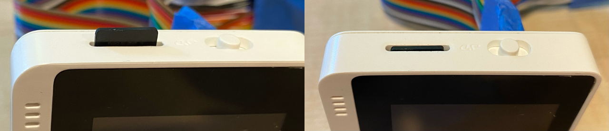

<!--
CO_OP_TRANSLATOR_METADATA:
{
  "original_hash": "93d352de36526b8990e41dd538100324",
  "translation_date": "2025-08-27T22:42:06+00:00",
  "source_file": "6-consumer/lessons/1-speech-recognition/wio-terminal-microphone.md",
  "language_code": "fi"
}
-->
# Konfiguroi mikrofonisi ja kaiuttimesi - Wio Terminal

Tässä oppitunnin osassa lisäät kaiuttimet Wio Terminal -laitteeseesi. Wio Terminalissa on jo sisäänrakennettu mikrofoni, jota voidaan käyttää puheen tallentamiseen.

## Laitteisto

Wio Terminalissa on jo sisäänrakennettu mikrofoni, jota voidaan käyttää äänen tallentamiseen puheentunnistusta varten.

Kaiuttimen lisäämiseksi voit käyttää [ReSpeaker 2-Mics Pi Hat](https://www.seeedstudio.com/ReSpeaker-2-Mics-Pi-HAT.html) -lisäosaa. Tämä on ulkoinen piirilevy, joka sisältää 2 MEMS-mikrofonia, kaiutinliitännän ja kuulokeliitännän.

Tarvitset joko kuulokkeet, kaiuttimen 3,5 mm liittimellä tai kaiuttimen JST-liitännällä, kuten [Mono Enclosed Speaker - 2W 6 Ohm](https://www.seeedstudio.com/Mono-Enclosed-Speaker-2W-6-Ohm-p-2832.html).

ReSpeaker 2-Mics Pi Hat -lisäosan liittämiseen tarvitset 40 pin-to-pin (tunnetaan myös nimellä uros-uros) hyppylankoja.

> 💁 Jos olet mukavuusalueellasi juottamisen kanssa, voit käyttää [40 Pin Raspberry Pi Hat Adapter Board For Wio Terminal](https://www.seeedstudio.com/40-Pin-Raspberry-Pi-Hat-Adapter-Board-For-Wio-Terminal-p-4730.html) -adapteria ReSpeakerin liittämiseen.

Tarvitset myös SD-kortin äänen lataamiseen ja toistamiseen. Wio Terminal tukee vain enintään 16 GB:n SD-kortteja, ja niiden on oltava FAT32- tai exFAT-muotoisia.

### Tehtävä - liitä ReSpeaker Pi Hat

1. Kun Wio Terminal on sammutettu, liitä ReSpeaker 2-Mics Pi Hat Wio Terminaliin hyppylankojen ja GPIO-liitäntöjen avulla laitteen takana:

    Nämä pinnit tulee liittää seuraavasti:

    

1. Aseta ReSpeaker ja Wio Terminal siten, että GPIO-liitännät ovat ylöspäin ja vasemmalla puolella.

1. Aloita GPIO-liitännän vasemman yläkulman liitännästä ReSpeakerissä. Liitä hyppylanka vasemman yläkulman liitännästä ReSpeakerissä vasemman yläkulman liitäntään Wio Terminalissa.

1. Toista tämä prosessi koko vasemman puolen GPIO-liitäntöjen osalta. Varmista, että pinnit ovat tiukasti kiinni.

    

    

    > 💁 Jos hyppylankasi ovat nauhoina, pidä ne yhdessä - tämä helpottaa kaikkien kaapeleiden järjestyksessä liittämistä.

1. Toista prosessi oikean puolen GPIO-liitäntöjen osalta ReSpeakerissä ja Wio Terminalissa. Nämä kaapelit tulee kiertää jo olemassa olevien kaapeleiden ympärille.

    

    

    > 💁 Jos hyppylankasi ovat nauhoina, jaa ne kahteen nauhaan. Vie yksi nauha kummallekin puolelle olemassa olevia kaapeleita.

    > 💁 Voit käyttää teippiä pitämään pinnit yhdessä estääksesi niiden irtoamisen liittämisen aikana.
    >
    > 

1. Sinun täytyy lisätä kaiutin.

    * Jos käytät kaiutinta JST-kaapelilla, liitä se ReSpeakerin JST-porttiin.

      

    * Jos käytät kaiutinta 3,5 mm liittimellä tai kuulokkeita, liitä ne 3,5 mm liitäntään.

      

### Tehtävä - SD-kortin asettaminen

1. Liitä SD-kortti tietokoneeseesi, käyttäen ulkoista lukijaa, jos tietokoneessasi ei ole SD-korttipaikkaa.

1. Alusta SD-kortti tietokoneesi sopivalla työkalulla, varmistaen että käytät FAT32- tai exFAT-tiedostojärjestelmää.

1. Aseta SD-kortti Wio Terminalin vasemmalla puolella olevaan SD-korttipaikkaan, juuri virtapainikkeen alapuolelle. Varmista, että kortti menee kokonaan sisään ja napsahtaa paikalleen - saatat tarvita ohutta työkalua tai toista SD-korttia auttamaan sen työntämisessä kokonaan sisään.

    

    > 💁 SD-kortin poistamiseksi sinun täytyy painaa sitä hieman sisään, jolloin se ponnahtaa ulos. Tarvitset tähän ohutta työkalua, kuten litteäpäistä ruuvimeisseliä tai toista SD-korttia.

---

**Vastuuvapauslauseke**:  
Tämä asiakirja on käännetty käyttämällä tekoälypohjaista käännöspalvelua [Co-op Translator](https://github.com/Azure/co-op-translator). Vaikka pyrimme tarkkuuteen, huomioithan, että automaattiset käännökset voivat sisältää virheitä tai epätarkkuuksia. Alkuperäinen asiakirja sen alkuperäisellä kielellä tulisi pitää ensisijaisena lähteenä. Kriittisen tiedon osalta suositellaan ammattimaista ihmiskäännöstä. Emme ole vastuussa väärinkäsityksistä tai virhetulkinnoista, jotka johtuvat tämän käännöksen käytöstä.