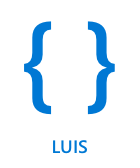

<!--
CO_OP_TRANSLATOR_METADATA:
{
  "original_hash": "6f4ba69d77f16c4a5110623a96a215c3",
  "translation_date": "2025-08-27T22:18:50+00:00",
  "source_file": "6-consumer/lessons/2-language-understanding/README.md",
  "language_code": "fi"
}
-->
# Ymmärrä kieli


> Sketchnote: [Nitya Narasimhan](https://github.com/nitya). Klikkaa kuvaa nähdäksesi suuremman version.

## Ennakkokysely

[Ennakkokysely](https://black-meadow-040d15503.1.azurestaticapps.net/quiz/43)

## Johdanto

Edellisessä oppitunnissa muunsit puheen tekstiksi. Jotta tätä voidaan käyttää älykkään ajastimen ohjelmointiin, koodisi täytyy ymmärtää, mitä sanottiin. Voisit olettaa, että käyttäjä sanoo ennalta määrätyn lauseen, kuten "Aseta 3 minuutin ajastin", ja jäsentää sen saadaksesi selville ajastimen keston. Tämä ei kuitenkaan ole kovin käyttäjäystävällistä. Jos käyttäjä sanoisi "Aseta ajastin 3 minuutiksi", sinä tai minä ymmärtäisimme, mitä hän tarkoittaa, mutta koodisi ei ymmärtäisi, koska se odottaisi ennalta määrättyä lausetta.

Tässä kohtaa kielentunnistus astuu kuvaan. Se käyttää tekoälymalleja tekstin tulkitsemiseen ja palauttaa tarvittavat tiedot, esimerkiksi ymmärtäen sekä "Aseta 3 minuutin ajastin" että "Aseta ajastin 3 minuutiksi" tarkoittavan, että tarvitaan ajastin 3 minuutiksi.

Tässä oppitunnissa opit kielentunnistusmalleista, niiden luomisesta, kouluttamisesta ja käyttämisestä koodissasi.

Tässä oppitunnissa käsitellään:

* [Kielentunnistus](../../../../../6-consumer/lessons/2-language-understanding)
* [Kielentunnistusmallin luominen](../../../../../6-consumer/lessons/2-language-understanding)
* [Aikomukset ja entiteetit](../../../../../6-consumer/lessons/2-language-understanding)
* [Kielentunnistusmallin käyttäminen](../../../../../6-consumer/lessons/2-language-understanding)

## Kielentunnistus

Ihmiset ovat käyttäneet kieltä viestintään satoja tuhansia vuosia. Viestimme sanoilla, äänillä tai toimilla ja ymmärrämme, mitä sanotaan, sekä sanojen, äänien tai toimien merkityksen että niiden kontekstin. Ymmärrämme vilpittömyyden ja sarkasmin, jolloin samat sanat voivat tarkoittaa eri asioita riippuen äänen sävystä.

✅ Mieti joitakin viimeaikaisia keskustelujasi. Kuinka suuri osa keskustelusta olisi vaikeaa tietokoneelle ymmärtää, koska se vaatii kontekstia?

Kielentunnistus, jota kutsutaan myös luonnollisen kielen ymmärtämiseksi, on osa tekoälyn alaa nimeltä luonnollisen kielen käsittely (NLP). Se käsittelee lukemisen ymmärtämistä ja pyrkii ymmärtämään sanojen tai lauseiden yksityiskohtia. Jos käytät ääniavustajaa, kuten Alexaa tai Siriä, olet käyttänyt kielentunnistuspalveluita. Nämä ovat taustalla toimivia tekoälypalveluita, jotka muuntavat "Alexa, soita Taylor Swiftin uusin albumi" tyttäreni tanssimiseksi olohuoneessa hänen suosikkikappaleidensa tahdissa.

> 💁 Tietokoneet, kaikista edistyksistään huolimatta, ovat vielä kaukana tekstin todellisesta ymmärtämisestä. Kun puhumme kielentunnistuksesta tietokoneiden kanssa, emme tarkoita mitään lähellekään ihmisen viestinnän tasoa, vaan yksinkertaisesti sanojen ottamista ja keskeisten tietojen poimimista.

Ihmisenä ymmärrämme kielen ajattelematta sitä sen kummemmin. Jos pyytäisin toista ihmistä "soittamaan Taylor Swiftin uusimman albumin", hän ymmärtäisi vaistomaisesti, mitä tarkoitan. Tietokoneelle tämä on vaikeampaa. Sen täytyisi ottaa sanat, jotka on muunnettu puheesta tekstiksi, ja selvittää seuraavat tiedot:

* Musiikkia täytyy soittaa
* Musiikki on artistilta Taylor Swift
* Musiikki on kokonainen albumi, jossa on useita kappaleita järjestyksessä
* Taylor Swiftillä on useita albumeja, joten ne täytyy järjestää kronologisesti, ja viimeksi julkaistu on se, jota tarvitaan

✅ Mieti joitakin muita lauseita, joita olet sanonut tehdessäsi pyyntöjä, kuten kahvin tilaamista tai pyytämistä perheenjäseneltä ojentamaan jotain. Yritä jakaa ne osiin, jotka tietokoneen täytyisi poimia ymmärtääkseen lauseen.

Kielentunnistusmallit ovat tekoälymalleja, jotka on koulutettu poimimaan tiettyjä yksityiskohtia kielestä ja sitten koulutettu tiettyihin tehtäviin siirto-oppimisen avulla, samalla tavalla kuin koulutit Custom Vision -mallin pienellä joukolla kuvia. Voit ottaa mallin ja kouluttaa sen tekstillä, jonka haluat sen ymmärtävän.

## Kielentunnistusmallin luominen



Voit luoda kielentunnistusmalleja LUIS-palvelulla, joka on Microsoftin kielentunnistuspalvelu ja osa Cognitive Services -palveluita.

### Tehtävä - luo kirjoitusresurssi

LUIS-palvelun käyttämiseksi sinun täytyy luoda kirjoitusresurssi.

1. Käytä seuraavaa komentoa luodaksesi kirjoitusresurssin `smart-timer`-resurssiryhmääsi:

    ```python
    az cognitiveservices account create --name smart-timer-luis-authoring \
                                        --resource-group smart-timer \
                                        --kind LUIS.Authoring \
                                        --sku F0 \
                                        --yes \
                                        --location <location>
    ```

    Korvaa `<location>` sijainnilla, jota käytit resurssiryhmän luomiseen.

    > ⚠️ LUIS ei ole saatavilla kaikilla alueilla, joten jos saat seuraavan virheen:
    >
    > ```output
    > InvalidApiSetId: The account type 'LUIS.Authoring' is either invalid or unavailable in given region.
    > ```
    >
    > valitse toinen alue.

    Tämä luo ilmaisen LUIS-kirjoitusresurssin.

### Tehtävä - luo kielentunnistussovellus

1. Avaa LUIS-portaali osoitteessa [luis.ai](https://luis.ai?WT.mc_id=academic-17441-jabenn) selaimessasi ja kirjaudu sisään samalla tilillä, jota olet käyttänyt Azureen.

1. Seuraa dialogin ohjeita valitaksesi Azure-tilauksesi ja valitse sitten juuri luomasi `smart-timer-luis-authoring`-resurssi.

1. *Keskustelusovellukset*-listasta valitse **Uusi sovellus** -painike luodaksesi uuden sovelluksen. Nimeä uusi sovellus `smart-timer` ja aseta *Kulttuuri* kieleksesi.

    > 💁 Ennustamisresurssille on kenttä. Voit luoda toisen resurssin pelkästään ennustamista varten, mutta ilmainen kirjoitusresurssi sallii 1 000 ennustetta kuukaudessa, mikä riittää kehitykseen, joten voit jättää tämän kentän tyhjäksi.

1. Lue opas, joka ilmestyy sovelluksen luomisen jälkeen, saadaksesi käsityksen vaiheista, jotka sinun täytyy tehdä kielentunnistusmallin kouluttamiseksi. Sulje opas, kun olet valmis.

## Aikomukset ja entiteetit

Kielentunnistus perustuu *aikomuksiin* ja *entiteetteihin*. Aikomukset ovat sanojen tarkoitus, esimerkiksi musiikin soittaminen, ajastimen asettaminen tai ruoan tilaaminen. Entiteetit ovat se, mihin aikomus viittaa, kuten albumi, ajastimen kesto tai ruoan tyyppi. Jokaisella mallin tulkitsemalla lauseella tulisi olla vähintään yksi aikomus ja mahdollisesti yksi tai useampi entiteetti.

Esimerkkejä:

| Lause                                                | Aikomus          | Entiteetit                                 |
| ---------------------------------------------------- | ---------------- | ------------------------------------------ |
| "Soita Taylor Swiftin uusin albumi"                 | *soita musiikkia* | *Taylor Swiftin uusin albumi*              |
| "Aseta 3 minuutin ajastin"                          | *aseta ajastin*   | *3 minuuttia*                              |
| "Peruuta ajastimeni"                                | *peruuta ajastin* | Ei mitään                                  |
| "Tilaa 3 suurta ananaspizzaa ja caesar-salaatti"    | *tilaa ruokaa*    | *3 suurta ananaspizzaa*, *caesar-salaatti* |

✅ Lauseiden, joita mietit aiemmin, mitä olisi niiden aikomus ja entiteetit?

LUIS-mallin kouluttamiseksi ensin määritetään entiteetit. Nämä voivat olla ennalta määrätty lista termejä tai opittuja tekstistä. Esimerkiksi voit tarjota ennalta määrätyn listan ruokia valikostasi, jossa on variaatioita (tai synonyymejä) jokaiselle sanalle, kuten *munakoiso* ja *aubergine* synonyymeinä *aubergine*-sanalle. LUIS sisältää myös valmiita entiteettejä, joita voidaan käyttää, kuten numerot ja sijainnit.

Ajastimen asettamiseksi voisit käyttää yhtä entiteettiä, joka hyödyntää valmiita numeroentiteettejä ajan määrittämiseen, ja toista entiteettiä yksiköille, kuten minuutit ja sekunnit. Jokaisella yksiköllä olisi useita variaatioita kattamaan yksikkö- ja monikkomuodot - kuten minuutti ja minuutit.

Kun entiteetit on määritelty, luodaan aikomukset. Nämä opitaan mallin avulla esimerkkilauseiden perusteella, joita tarjoat (tunnetaan nimellä *utterances*). Esimerkiksi *aseta ajastin* -aikomukselle voisit tarjota seuraavat lauseet:

* `aseta 1 sekunnin ajastin`
* `aseta ajastin 1 minuutiksi ja 12 sekunniksi`
* `aseta ajastin 3 minuutiksi`
* `aseta 9 minuutin 30 sekunnin ajastin`

Sitten kerrot LUIS:lle, mitkä osat näistä lauseista vastaavat entiteettejä:


Lause `aseta ajastin 1 minuutiksi ja 12 sekunniksi` sisältää aikomuksen `aseta ajastin`. Siinä on myös 2 entiteettiä, joilla on 2 arvoa:

|            | aika | yksikkö |
| ---------- | ---: | ------- |
| 1 minuutti | 1    | minuutti |
| 12 sekuntia | 12   | sekunti |

Hyvän mallin kouluttamiseksi tarvitset monipuolisen joukon erilaisia esimerkkilauseita kattamaan monet eri tavat, joilla joku voisi pyytää samaa asiaa.

> 💁 Kuten minkä tahansa tekoälymallin kohdalla, mitä enemmän dataa ja mitä tarkempaa dataa käytät koulutukseen, sitä parempi malli.

✅ Mieti eri tapoja, joilla voisit pyytää samaa asiaa ja odottaa ihmisen ymmärtävän.

### Tehtävä - lisää entiteetit kielentunnistusmalleihin

Ajastinta varten sinun täytyy lisätä 2 entiteettiä - yksi ajan yksikölle (minuutit tai sekunnit) ja yksi minuuttien tai sekuntien määrälle.

Voit löytää ohjeet LUIS-portaalin käyttämiseen [Microsoft Docsin LUIS-portaalin pikaoppaasta](https://docs.microsoft.com/azure/cognitive-services/luis/luis-get-started-create-app?WT.mc_id=academic-17441-jabenn).

1. LUIS-portaalista valitse *Entiteetit*-välilehti ja lisää *numero*-valmiiksi rakennettu entiteetti valitsemalla **Lisää valmiiksi rakennettu entiteetti** -painike ja valitsemalla *numero* listasta.

1. Luo uusi entiteetti ajan yksikölle käyttämällä **Luo**-painiketta. Nimeä entiteetti `ajan yksikkö` ja aseta tyyppi *Lista*. Lisää arvot `minuutti` ja `sekunti` *Normalisoidut arvot* -listaan ja lisää yksikkö- ja monikkomuodot *synonyymit*-listaan. Paina `return` jokaisen synonyymin lisäämisen jälkeen lisätäksesi sen listaan.

    | Normalisoitu arvo | Synonyymit        |
    | ----------------- | ----------------- |
    | minuutti          | minuutti, minuutit |
    | sekunti           | sekunti, sekunnit |

### Tehtävä - lisää aikomukset kielentunnistusmalleihin

1. *Aikomukset*-välilehdeltä valitse **Luo**-painike luodaksesi uuden aikomuksen. Nimeä tämä aikomus `aseta ajastin`.

1. Esimerkeissä syötä erilaisia tapoja asettaa ajastin käyttäen sekä minuutteja, sekunteja että minuutteja ja sekunteja yhdistettynä. Esimerkkejä voisivat olla:

    * `aseta 1 sekunnin ajastin`
    * `aseta 4 minuutin ajastin`
    * `aseta neljän minuutin kuuden sekunnin ajastin`
    * `aseta 9 minuutin 30 sekunnin ajastin`
    * `aseta ajastin 1 minuutiksi ja 12 sekunniksi`
    * `aseta ajastin 3 minuutiksi`
    * `aseta ajastin 3 minuutiksi ja 1 sekunniksi`
    * `aseta ajastin kolmeksi minuutiksi ja yhdeksi sekunniksi`
    * `aseta ajastin 1 minuutiksi ja 1 sekunniksi`
    * `aseta ajastin 30 sekunniksi`
    * `aseta ajastin 1 sekunniksi`

    Vaihtele numerot sanoina ja numeromuotoina, jotta malli oppii käsittelemään molempia.

1. Kun syötät jokaisen esimerkin, LUIS alkaa tunnistaa entiteettejä ja alleviivaa ja merkitsee ne.

    

### Tehtävä - kouluta ja testaa malli

1. Kun entiteetit ja aikomukset on määritetty, voit kouluttaa mallin käyttämällä **Kouluta**-painiketta ylävalikossa. Valitse tämä painike, ja mallin pitäisi kouluttautua muutamassa sekunnissa. Painike on harmaana koulutuksen aikana ja aktivoituu uudelleen, kun koulutus on valmis.

1. Valitse **Testaa**-painike ylävalikosta testataksesi kielentunnistusmallia. Syötä teksti, kuten `aseta ajastin 5 minuutiksi ja 4 sekunniksi`, ja paina return. Lause ilmestyy laatikkoon tekstikentän alle, johon kirjoitit sen, ja sen alapuolella näkyy *paras aikomus*, eli aikomus, joka tunnistettiin suurimmalla todennäköisyydellä. Tämän pitäisi olla `aseta ajastin`. Aikomuksen nimi seuraa todennäköisyysprosenttia siitä, että tunnistettu aikomus oli oikea.

1. Valitse **Tarkastele**-vaihtoehto nähdäksesi tulosten erittelyn. Näet parhaan aikomuksen todennäköisyysprosentin sekä listat tunnistetuista entiteeteistä.

1. Sulje *Testaa*-paneeli, kun olet valmis testaamaan.

### Tehtävä - julkaise malli

Jotta voit käyttää tätä mallia koodista, sinun täytyy julkaista se. Julkaistaessa LUIS:sta voit julkaista joko testausympäristöön tai tuotantoympäristöön. Tässä oppitunnissa testausympäristö riittää.

1. LUIS-portaalista valitse **Julkaise**-painike ylävalikosta.

1. Varmista, että *Testauspaikka* on valittuna, ja valitse **Valmis**. Näet ilmoituksen, kun sovellus on julkaistu.

1. Voit testata tätä käyttämällä curl-komentoa. Curl-komennon rakentamiseen tarvitset kolme arvoa - päätepisteen, sovelluksen tunnuksen (App ID) ja API-avaimen. Nämä löytyvät **HALLINTA**-välilehdeltä, jonka voit valita ylävalikosta.

    1. *Asetukset*-osiosta kopioi sovelluksen tunnus
1. Valitse *Azure Resources* -osiosta *Authoring Resource* ja kopioi *Primary Key* ja *Endpoint URL*.

1. Suorita seuraava curl-komento komentokehotteessa tai terminaalissa:

    ```sh
    curl "<endpoint url>/luis/prediction/v3.0/apps/<app id>/slots/staging/predict" \
          --request GET \
          --get \
          --data "subscription-key=<primary key>" \
          --data "verbose=false" \
          --data "show-all-intents=true" \
          --data-urlencode "query=<sentence>"
    ```

    Korvaa `<endpoint url>` *Azure Resources* -osiosta kopioidulla Endpoint URL:lla.

    Korvaa `<app id>` *Settings*-osiosta löytyvällä App ID:llä.

    Korvaa `<primary key>` *Azure Resources* -osiosta kopioidulla Primary Key:llä.

    Korvaa `<sentence>` lauseella, jota haluat testata.

1. Tämän kutsun tuloksena saadaan JSON-dokumentti, joka sisältää kyselyn, parhaan intentin ja listan entiteeteistä tyypeittäin jaoteltuna.

    ```JSON
    {
        "query": "set a timer for 45 minutes and 12 seconds",
        "prediction": {
            "topIntent": "set timer",
            "intents": {
                "set timer": {
                    "score": 0.97031575
                },
                "None": {
                    "score": 0.02205793
                }
            },
            "entities": {
                "number": [
                    45,
                    12
                ],
                "time-unit": [
                    [
                        "minute"
                    ],
                    [
                        "second"
                    ]
                ]
            }
        }
    }
    ```

    Yllä oleva JSON saatiin kyselyllä `set a timer for 45 minutes and 12 seconds`:

    * `set timer` oli paras intentti 97 % todennäköisyydellä.
    * Kaksi *number*-entiteettiä havaittiin: `45` ja `12`.
    * Kaksi *time-unit*-entiteettiä havaittiin: `minute` ja `second`.

## Kielen ymmärtämismallin käyttö

Kun LUIS-malli on julkaistu, sitä voidaan kutsua koodista. Aiemmissa oppitunneissa olet käyttänyt IoT Hubia pilvipalveluiden kanssa viestimiseen, telemetrian lähettämiseen ja komentojen vastaanottamiseen. Tämä on hyvin asynkronista – kun telemetria lähetetään, koodi ei odota vastausta, ja jos pilvipalvelu on alhaalla, et tiedä siitä.

Älykkäälle ajastimelle haluamme vastauksen heti, jotta voimme kertoa käyttäjälle, että ajastin on asetettu, tai ilmoittaa, että pilvipalvelut eivät ole käytettävissä. Tätä varten IoT-laitteemme kutsuu verkkopäätettä suoraan sen sijaan, että luottaisi IoT Hubiin.

Sen sijaan, että kutsuisit LUIS:ia IoT-laitteesta, voit käyttää palvelutonta koodia eri tyyppisellä laukaisimella – HTTP-laukaisulla. Tämä mahdollistaa sen, että funktiosovelluksesi kuuntelee REST-pyyntöjä ja vastaa niihin. Tämä funktio toimii REST-päätteenä, jota laitteesi voi kutsua.

> 💁 Vaikka voit kutsua LUIS:ia suoraan IoT-laitteestasi, on parempi käyttää esimerkiksi palvelutonta koodia. Näin, kun haluat vaihtaa kutsuttavaa LUIS-sovellusta, esimerkiksi kun koulutat paremman mallin tai koulutat mallin eri kielellä, sinun tarvitsee päivittää vain pilvikoodisi, eikä uudelleenasentaa koodia mahdollisesti tuhansiin tai miljooniin IoT-laitteisiin.

### Tehtävä – luo palveluton funktiosovellus

1. Luo Azure Functions -sovellus nimeltä `smart-timer-trigger` ja avaa se VS Codessa.

1. Lisää tähän sovellukseen HTTP-laukaisin nimeltä `speech-trigger` käyttämällä seuraavaa komentoa VS Coden terminaalissa:

    ```sh
    func new --name text-to-timer --template "HTTP trigger"
    ```

    Tämä luo HTTP-laukaisimen nimeltä `text-to-timer`.

1. Testaa HTTP-laukaisinta suorittamalla funktiosovellus. Kun se suoritetaan, näet päätteen luettelossa:

    ```output
    Functions:
    
            text-to-timer: [GET,POST] http://localhost:7071/api/text-to-timer
    ```

    Testaa tätä lataamalla [http://localhost:7071/api/text-to-timer](http://localhost:7071/api/text-to-timer) selaimessasi.

    ```output
    This HTTP triggered function executed successfully. Pass a name in the query string or in the request body for a personalized response.
    ```

### Tehtävä – käytä kielen ymmärtämismallia

1. LUIS:n SDK on saatavilla Pip-pakettina. Lisää seuraava rivi `requirements.txt`-tiedostoon lisätäksesi riippuvuuden tähän pakettiin:

    ```sh
    azure-cognitiveservices-language-luis
    ```

1. Varmista, että VS Coden terminaalissa on aktivoitu virtuaaliympäristö, ja suorita seuraava komento Pip-pakettien asentamiseksi:

    ```sh
    pip install -r requirements.txt
    ```

    > 💁 Jos saat virheitä, saatat joutua päivittämään pipin seuraavalla komennolla:
    >
    > ```sh
    > pip install --upgrade pip
    > ```

1. Lisää uusia merkintöjä `local.settings.json`-tiedostoon LUIS API Key:lle, Endpoint URL:lle ja App ID:lle, jotka löytyvät LUIS-portaalin **MANAGE**-välilehdeltä:

    ```JSON
    "LUIS_KEY": "<primary key>",
    "LUIS_ENDPOINT_URL": "<endpoint url>",
    "LUIS_APP_ID": "<app id>"
    ```

    Korvaa `<endpoint url>` *Azure Resources* -osion Endpoint URL:lla **MANAGE**-välilehdeltä. Tämä on muotoa `https://<location>.api.cognitive.microsoft.com/`.

    Korvaa `<app id>` *Settings*-osion App ID:llä **MANAGE**-välilehdeltä.

    Korvaa `<primary key>` *Azure Resources* -osion Primary Key:llä **MANAGE**-välilehdeltä.

1. Lisää seuraavat tuonnit `__init__.py`-tiedostoon:

    ```python
    import json
    import os
    from azure.cognitiveservices.language.luis.runtime import LUISRuntimeClient
    from msrest.authentication import CognitiveServicesCredentials
    ```

    Tämä tuo joitakin järjestelmäkirjastoja sekä kirjastot LUIS:n kanssa vuorovaikuttamiseen.

1. Poista `main`-metodin sisältö ja lisää seuraava koodi:

    ```python
    luis_key = os.environ['LUIS_KEY']
    endpoint_url = os.environ['LUIS_ENDPOINT_URL']
    app_id = os.environ['LUIS_APP_ID']
    
    credentials = CognitiveServicesCredentials(luis_key)
    client = LUISRuntimeClient(endpoint=endpoint_url, credentials=credentials)
    ```

    Tämä lataa `local.settings.json`-tiedostoon lisäämäsi arvot LUIS-sovelluksellesi, luo tunnistetieto-olion API-avaimellasi ja sitten LUIS-asiakasolion vuorovaikuttamiseen LUIS-sovelluksesi kanssa.

1. Tämä HTTP-laukaisin kutsutaan JSON-muotoisella tekstillä, jossa teksti on ominaisuudessa nimeltä `text`. Seuraava koodi hakee arvon HTTP-pyynnön rungosta ja kirjaa sen konsoliin. Lisää tämä koodi `main`-funktioon:

    ```python
    req_body = req.get_json()
    text = req_body['text']
    logging.info(f'Request - {text}')
    ```

1. Ennusteita pyydetään LUIS:lta lähettämällä ennustepyyntö – JSON-dokumentti, joka sisältää ennustettavan tekstin. Luo tämä seuraavalla koodilla:

    ```python
    prediction_request = { 'query' : text }
    ```

1. Tämä pyyntö voidaan sitten lähettää LUIS:lle käyttämällä sovelluksesi julkaistua staging-paikkaa:

    ```python
    prediction_response = client.prediction.get_slot_prediction(app_id, 'Staging', prediction_request)
    ```

1. Ennustevastaus sisältää parhaan intentin – intentin, jolla on korkein ennustepistemäärä, sekä entiteetit. Jos paras intentti on `set timer`, entiteeteistä voidaan lukea ajastimen tarvitsema aika:

    ```python
    if prediction_response.prediction.top_intent == 'set timer':
        numbers = prediction_response.prediction.entities['number']
        time_units = prediction_response.prediction.entities['time unit']
        total_seconds = 0
    ```

    `number`-entiteetit ovat kokonaislukujen taulukko. Esimerkiksi, jos sanoit *"Set a four minute 17 second timer."*, `number`-taulukko sisältää kaksi kokonaislukua – 4 ja 17.

    `time unit` -entiteetit ovat merkkijonojen taulukoiden taulukko, jossa jokainen aikayksikkö on yksittäisenä taulukkona. Esimerkiksi, jos sanoit *"Set a four minute 17 second timer."*, `time unit` -taulukko sisältää kaksi yksittäistä arvoa sisältävää taulukkoa – `['minute']` ja `['second']`.

    JSON-versio näistä entiteeteistä lauseelle *"Set a four minute 17 second timer."* on:

    ```json
    {
        "number": [4, 17],
        "time unit": [
            ["minute"],
            ["second"]
        ]
    }
    ```

    Tämä koodi määrittelee myös kokonaisajan ajastimelle sekunteina. Tämä täytetään entiteettien arvoilla.

1. Entiteetit eivät ole linkitettyjä, mutta voimme tehdä niistä joitakin oletuksia. Ne ovat puheessa esiintymisjärjestyksessä, joten taulukon sijaintia voidaan käyttää määrittämään, mikä numero vastaa mitäkin aikayksikköä. Esimerkiksi:

    * *"Set a 30 second timer"* – tässä on yksi numero, `30`, ja yksi aikayksikkö, `second`, joten yksittäinen numero vastaa yksittäistä aikayksikköä.
    * *"Set a 2 minute and 30 second timer"* – tässä on kaksi numeroa, `2` ja `30`, ja kaksi aikayksikköä, `minute` ja `second`, joten ensimmäinen numero vastaa ensimmäistä aikayksikköä (2 minuuttia) ja toinen numero toista aikayksikköä (30 sekuntia).

    Seuraava koodi hakee `number`-entiteettien määrän ja käyttää sitä poimiakseen ensimmäisen kohteen jokaisesta taulukosta, sitten toisen ja niin edelleen. Lisää tämä `if`-lohkon sisään.

    ```python
    for i in range(0, len(numbers)):
        number = numbers[i]
        time_unit = time_units[i][0]
    ```

    Lauseelle *"Set a four minute 17 second timer."* tämä silmukka suoritetaan kahdesti, antaen seuraavat arvot:

    | silmukkakerta | `number` | `time_unit` |
    | -------------: | -------: | ----------- |
    | 0              | 4        | minute      |
    | 1              | 17       | second      |

1. Tämän silmukan sisällä käytä numeroa ja aikayksikköä ajastimen kokonaisajan laskemiseen lisäämällä 60 sekuntia jokaisesta minuutista ja sekuntien määrä sekunneista.

    ```python
    if time_unit == 'minute':
        total_seconds += number * 60
    else:
        total_seconds += number
    ```

1. Tämän entiteettien läpikäyntisilmukan ulkopuolella kirjaa ajastimen kokonaisaika:

    ```python
    logging.info(f'Timer required for {total_seconds} seconds')
    ```

1. Sekuntien määrä täytyy palauttaa funktiosta HTTP-vastauksena. Lisää tämä `if`-lohkon loppuun:

    ```python
    payload = {
        'seconds': total_seconds
    }
    return func.HttpResponse(json.dumps(payload), status_code=200)
    ```

    Tämä koodi luo hyötykuorman, joka sisältää ajastimen kokonaissekuntien määrän, muuntaa sen JSON-merkkijonoksi ja palauttaa sen HTTP-tuloksena tilakoodilla 200, mikä tarkoittaa, että kutsu onnistui.

1. Lopuksi, `if`-lohkon ulkopuolella, käsittele tilanne, jossa intenttiä ei tunnistettu, palauttamalla virhekoodi:

    ```python
    return func.HttpResponse(status_code=404)
    ```

    404 on tilakoodi, joka tarkoittaa *ei löydy*.

1. Suorita funktiosovellus ja testaa sitä curl-komennolla.

    ```sh
    curl --request POST 'http://localhost:7071/api/text-to-timer' \
         --header 'Content-Type: application/json' \
         --include \
         --data '{"text":"<text>"}'
    ```

    Korvaa `<text>` pyyntösi tekstillä, esimerkiksi `set a 2 minutes 27 second timer`.

    Näet seuraavan tulosteen funktiosovelluksesta:

    ```output
    Functions:

            text-to-timer: [GET,POST] http://localhost:7071/api/text-to-timer
    
    For detailed output, run func with --verbose flag.
    [2021-06-26T19:45:14.502Z] Worker process started and initialized.
    [2021-06-26T19:45:19.338Z] Host lock lease acquired by instance ID '000000000000000000000000951CAE4E'.
    [2021-06-26T19:45:52.059Z] Executing 'Functions.text-to-timer' (Reason='This function was programmatically called via the host APIs.', Id=f68bfb90-30e4-47a5-99da-126b66218e81)
    [2021-06-26T19:45:53.577Z] Timer required for 147 seconds
    [2021-06-26T19:45:53.746Z] Executed 'Functions.text-to-timer' (Succeeded, Id=f68bfb90-30e4-47a5-99da-126b66218e81, Duration=1750ms)
    ```

    Curl-komennon tulos on seuraava:

    ```output
    HTTP/1.1 200 OK
    Date: Tue, 29 Jun 2021 01:14:11 GMT
    Content-Type: text/plain; charset=utf-8
    Server: Kestrel
    Transfer-Encoding: chunked
    
    {"seconds": 147}
    ```

    Ajastimen sekuntien määrä on `"seconds"`-arvossa.

> 💁 Löydät tämän koodin [code/functions](../../../../../6-consumer/lessons/2-language-understanding/code/functions) -kansiosta.

### Tehtävä – tee funktiosi saataville IoT-laitteellesi

1. Jotta IoT-laitteesi voi kutsua REST-päätettäsi, sen täytyy tietää URL-osoite. Kun käytit sitä aiemmin, käytit `localhost`-osoitetta, joka on pikakuvake REST-päätteiden käyttämiseen paikallisessa koneessasi. Jotta IoT-laitteesi pääsee siihen käsiksi, sinun täytyy joko julkaista se pilveen tai hankkia IP-osoitteesi paikallista käyttöä varten.

    > ⚠️ Jos käytät Wio Terminalia, on helpompaa suorittaa funktiosovellus paikallisesti, sillä siinä on riippuvuuksia kirjastoihin, jotka estävät funktiosovelluksen käyttöönoton samalla tavalla kuin aiemmin. Suorita funktiosovellus paikallisesti ja käytä sitä tietokoneesi IP-osoitteen kautta. Jos haluat julkaista sen pilveen, myöhemmässä oppitunnissa annetaan ohjeet tämän tekemiseen.

    * Julkaise funktiosovellus – seuraa aiemmissa oppitunneissa annettuja ohjeita funktiosovelluksen julkaisemiseksi pilveen. Kun se on julkaistu, URL-osoite on `https://<APP_NAME>.azurewebsites.net/api/text-to-timer`, missä `<APP_NAME>` on funktiosovelluksesi nimi. Muista myös julkaista paikalliset asetuksesi.

      HTTP-laukaisimet ovat oletuksena suojattuja funktiosovellusavaimella. Hanki tämä avain suorittamalla seuraava komento:

      ```sh
      az functionapp keys list --resource-group smart-timer \
                               --name <APP_NAME>                               
      ```

      Kopioi `default`-merkinnän arvo `functionKeys`-osiosta.

      ```output
      {
        "functionKeys": {
          "default": "sQO1LQaeK9N1qYD6SXeb/TctCmwQEkToLJU6Dw8TthNeUH8VA45hlA=="
        },
        "masterKey": "RSKOAIlyvvQEQt9dfpabJT018scaLpQu9p1poHIMCxx5LYrIQZyQ/g==",
        "systemKeys": {}
      }
      ```

      Tämä avain täytyy lisätä URL-osoitteeseen kyselyparametrina, joten lopullinen URL-osoite on `https://<APP_NAME>.azurewebsites.net/api/text-to-timer?code=<FUNCTION_KEY>`, missä `<APP_NAME>` on funktiosovelluksesi nimi ja `<FUNCTION_KEY>` on oletusfunktioavaimesi.

      > 💁 Voit muuttaa HTTP-laukaisimen valtuutustyyppiä käyttämällä `authlevel`-asetusta `function.json`-tiedostossa. Voit lukea lisää tästä [Azure Functions HTTP -laukaisimen dokumentaation konfigurointiosasta Microsoftin sivustolla](https://docs.microsoft.com/azure/azure-functions/functions-bindings-http-webhook-trigger?WT.mc_id=academic-17441-jabenn&tabs=python#configuration).

    * Suorita funktiosovellus paikallisesti ja käytä sitä IP-osoitteen kautta – voit hankkia tietokoneesi IP-osoitteen paikallisessa verkossa ja käyttää sitä URL-osoitteen rakentamiseen.

      Hanki IP-osoitteesi:

      * Windows 10:ssä seuraa [IP-osoitteen löytämisopasta](https://support.microsoft.com/windows/find-your-ip-address-f21a9bbc-c582-55cd-35e0-73431160a1b9?WT.mc_id=academic-17441-jabenn).
      * macOS:ssä seuraa [ohjetta IP-osoitteen löytämiseksi Macilla](https://www.hellotech.com/guide/for/how-to-find-ip-address-on-mac).
      * Linuxissa seuraa osaa yksityisen IP-osoitteen löytämisestä [Linuxin IP-osoitteen löytämisoppaassa](https://opensource.com/article/18/5/how-find-ip-address-linux).

      Kun sinulla on IP-osoitteesi, voit käyttää funktiota osoitteessa `http://`.

:7071/api/text-to-timer`, jossa `<IP_ADDRESS>` on IP-osoitteesi, esimerkiksi `http://192.168.1.10:7071/api/text-to-timer`.

      > 💁 Huomaa, että tämä käyttää porttia 7071, joten IP-osoitteen jälkeen sinun tulee lisätä `:7071`.

      > 💁 Tämä toimii vain, jos IoT-laitteesi on samassa verkossa kuin tietokoneesi.

1. Testaa päätepistettä käyttämällä curl-komentoa.

---

## 🚀 Haaste

On olemassa monia tapoja pyytää samaa asiaa, kuten ajastimen asettamista. Mieti erilaisia tapoja tehdä tämä ja käytä niitä esimerkkeinä LUIS-sovelluksessasi. Testaa näitä nähdäksesi, kuinka hyvin mallisi pystyy käsittelemään useita tapoja pyytää ajastinta.

## Luentojälkeinen kysely

[Luentojälkeinen kysely](https://black-meadow-040d15503.1.azurestaticapps.net/quiz/44)

## Katsaus & Itseopiskelu

* Lue lisää LUIS:sta ja sen ominaisuuksista [Microsoftin dokumentaation Language Understanding (LUIS) -sivulta](https://docs.microsoft.com/azure/cognitive-services/luis/?WT.mc_id=academic-17441-jabenn)
* Lue lisää kielen ymmärtämisestä [Wikipedia-sivulta luonnollisen kielen ymmärtämisestä](https://wikipedia.org/wiki/Natural-language_understanding)
* Lue lisää HTTP-liipaisimista [Microsoftin dokumentaation Azure Functions HTTP trigger -sivulta](https://docs.microsoft.com/azure/azure-functions/functions-bindings-http-webhook-trigger?WT.mc_id=academic-17441-jabenn&tabs=python)

## Tehtävä

[Peruuta ajastin](assignment.md)

---

**Vastuuvapauslauseke**:  
Tämä asiakirja on käännetty käyttämällä tekoälypohjaista käännöspalvelua [Co-op Translator](https://github.com/Azure/co-op-translator). Pyrimme tarkkuuteen, mutta huomioithan, että automaattiset käännökset voivat sisältää virheitä tai epätarkkuuksia. Alkuperäistä asiakirjaa sen alkuperäisellä kielellä tulee pitää ensisijaisena lähteenä. Kriittisen tiedon osalta suositellaan ammattimaista ihmiskäännöstä. Emme ole vastuussa tämän käännöksen käytöstä aiheutuvista väärinkäsityksistä tai virhetulkinnoista.