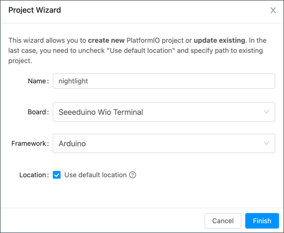

<!--
CO_OP_TRANSLATOR_METADATA:
{
  "original_hash": "a4f0c166010e31fd7b6ca20bc88dec6d",
  "translation_date": "2025-08-24T23:39:03+00:00",
  "source_file": "1-getting-started/lessons/1-introduction-to-iot/wio-terminal.md",
  "language_code": "fr"
}
-->
# Wio Terminal

Le [Wio Terminal de Seeed Studios](https://www.seeedstudio.com/Wio-Terminal-p-4509.html) est un microcontrôleur compatible Arduino, doté du WiFi, de capteurs et d'actionneurs intégrés, ainsi que de ports permettant d'ajouter d'autres capteurs et actionneurs grâce à un écosystème matériel appelé [Grove](https://www.seeedstudio.com/category/Grove-c-1003.html).


## Configuration

Pour utiliser votre Wio Terminal, vous devrez installer des logiciels gratuits sur votre ordinateur. Vous devrez également mettre à jour le firmware du Wio Terminal avant de pouvoir le connecter au WiFi.

### Tâche - configuration

Installez les logiciels requis et mettez à jour le firmware.

1. Installez Visual Studio Code (VS Code). C'est l'éditeur que vous utiliserez pour écrire le code de votre appareil en C/C++. Consultez la [documentation de VS Code](https://code.visualstudio.com?WT.mc_id=academic-17441-jabenn) pour les instructions d'installation.

    > 💁 Un autre IDE populaire pour le développement Arduino est l'[Arduino IDE](https://www.arduino.cc/en/software). Si vous êtes déjà familier avec cet outil, vous pouvez l'utiliser à la place de VS Code et PlatformIO, mais les leçons fourniront des instructions basées sur l'utilisation de VS Code.

1. Installez l'extension PlatformIO pour VS Code. Cette extension prend en charge la programmation des microcontrôleurs en C/C++. Consultez la [documentation de l'extension PlatformIO](https://marketplace.visualstudio.com/items?WT.mc_id=academic-17441-jabenn&itemName=platformio.platformio-ide) pour les instructions d'installation. Cette extension dépend de l'extension Microsoft C/C++ pour fonctionner avec le code C et C++, et cette dernière est installée automatiquement avec PlatformIO.

1. Connectez votre Wio Terminal à votre ordinateur. Le Wio Terminal dispose d'un port USB-C en bas, qui doit être connecté à un port USB de votre ordinateur. Le Wio Terminal est fourni avec un câble USB-C vers USB-A, mais si votre ordinateur ne dispose que de ports USB-C, vous aurez besoin d'un câble USB-C ou d'un adaptateur USB-A vers USB-C.

1. Suivez les instructions de la [documentation WiFi Overview du Wiki Wio Terminal](https://wiki.seeedstudio.com/Wio-Terminal-Network-Overview/) pour configurer votre Wio Terminal et mettre à jour le firmware.

## Hello World

Il est traditionnel, lorsqu'on débute avec un nouveau langage de programmation ou une nouvelle technologie, de créer une application 'Hello World' - une petite application qui affiche un texte comme `"Hello World"` pour vérifier que tous les outils sont correctement configurés.

L'application Hello World pour le Wio Terminal vous permettra de vous assurer que Visual Studio Code est correctement installé avec PlatformIO et configuré pour le développement de microcontrôleurs.

### Créer un projet PlatformIO

La première étape consiste à créer un nouveau projet avec PlatformIO configuré pour le Wio Terminal.

#### Tâche - créer un projet PlatformIO

Créez le projet PlatformIO.

1. Connectez le Wio Terminal à votre ordinateur.

1. Lancez VS Code.

1. L'icône PlatformIO se trouve dans la barre de menu latérale :

    

    Sélectionnez cet élément de menu, puis sélectionnez *PIO Home -> Open*.

    

1. Depuis l'écran d'accueil, sélectionnez le bouton **+ New Project**.

    

1. Configurez le projet dans l'*Assistant de Projet* :

    1. Nommez votre projet `nightlight`.

    1. Dans le menu déroulant *Board*, tapez `WIO` pour filtrer les cartes, et sélectionnez *Seeeduino Wio Terminal*.

    1. Laissez le *Framework* sur *Arduino*.

    1. Cochez ou décochez la case *Use default location* selon vos préférences pour choisir l'emplacement du projet.

    1. Sélectionnez le bouton **Finish**.

    

    PlatformIO téléchargera les composants nécessaires pour compiler le code pour le Wio Terminal et créera votre projet. Cela peut prendre quelques minutes.

### Explorer le projet PlatformIO

L'explorateur de VS Code affichera plusieurs fichiers et dossiers créés par l'assistant PlatformIO.

#### Dossiers

* `.pio` - ce dossier contient des données temporaires nécessaires à PlatformIO, comme des bibliothèques ou du code compilé. Il est recréé automatiquement s'il est supprimé, et vous n'avez pas besoin de l'ajouter au contrôle de version si vous partagez votre projet sur des sites comme GitHub.
* `.vscode` - ce dossier contient la configuration utilisée par PlatformIO et VS Code. Il est recréé automatiquement s'il est supprimé, et vous n'avez pas besoin de l'ajouter au contrôle de version si vous partagez votre projet sur des sites comme GitHub.
* `include` - ce dossier est destiné aux fichiers d'en-tête externes nécessaires lors de l'ajout de bibliothèques supplémentaires à votre code. Vous n'utiliserez pas ce dossier dans ces leçons.
* `lib` - ce dossier est destiné aux bibliothèques externes que vous souhaitez appeler depuis votre code. Vous n'utiliserez pas ce dossier dans ces leçons.
* `src` - ce dossier contient le code source principal de votre application. Initialement, il contiendra un seul fichier - `main.cpp`.
* `test` - ce dossier est destiné aux tests unitaires de votre code.

#### Fichiers

* `main.cpp` - ce fichier dans le dossier `src` contient le point d'entrée de votre application. Ouvrez ce fichier, et il contiendra le code suivant :

    ```cpp
    #include <Arduino.h>
    
    void setup() {
      // put your setup code here, to run once:
    }
    
    void loop() {
      // put your main code here, to run repeatedly:
    }
    ```

    Lorsque l'appareil démarre, le framework Arduino exécute la fonction `setup` une fois, puis exécute la fonction `loop` en boucle jusqu'à ce que l'appareil soit éteint.

* `.gitignore` - ce fichier liste les fichiers et répertoires à ignorer lors de l'ajout de votre code au contrôle de version git, comme lors du téléchargement vers un dépôt sur GitHub.

* `platformio.ini` - ce fichier contient la configuration pour votre appareil et votre application. Ouvrez ce fichier, et il contiendra le code suivant :

    ```ini
    [env:seeed_wio_terminal]
    platform = atmelsam
    board = seeed_wio_terminal
    framework = arduino
    ```

    La section `[env:seeed_wio_terminal]` contient la configuration pour le Wio Terminal. Vous pouvez avoir plusieurs sections `env` pour que votre code puisse être compilé pour plusieurs cartes.

    Les autres valeurs correspondent à la configuration de l'assistant de projet :

  * `platform = atmelsam` définit le matériel utilisé par le Wio Terminal (un microcontrôleur basé sur ATSAMD51).
  * `board = seeed_wio_terminal` définit le type de carte microcontrôleur (le Wio Terminal).
  * `framework = arduino` définit que ce projet utilise le framework Arduino.

### Écrire l'application Hello World

Vous êtes maintenant prêt à écrire l'application Hello World.

#### Tâche - écrire l'application Hello World

Écrivez l'application Hello World.

1. Ouvrez le fichier `main.cpp` dans VS Code.

1. Modifiez le code pour qu'il corresponde à ce qui suit :

    ```cpp
    #include <Arduino.h>

    void setup()
    {
        Serial.begin(9600);

        while (!Serial)
            ; // Wait for Serial to be ready
    
        delay(1000);
    }
    
    void loop()
    {
        Serial.println("Hello World");
        delay(5000);
    }
    ```

    La fonction `setup` initialise une connexion au port série - dans ce cas, le port USB utilisé pour connecter le Wio Terminal à votre ordinateur. Le paramètre `9600` est le [débit en bauds](https://wikipedia.org/wiki/Symbol_rate) (également appelé taux de symboles), ou vitesse à laquelle les données seront envoyées sur le port série en bits par seconde. Ce paramètre signifie que 9 600 bits (0 et 1) de données sont envoyés chaque seconde. Ensuite, il attend que le port série soit prêt.

    La fonction `loop` envoie la ligne `Hello World!` au port série, donc les caractères de `Hello World!` suivis d'un caractère de nouvelle ligne. Ensuite, elle attend 5 000 millisecondes ou 5 secondes. Une fois la `loop` terminée, elle est exécutée à nouveau, et ainsi de suite tant que le microcontrôleur est sous tension.

1. Mettez votre Wio Terminal en mode upload. Vous devrez le faire à chaque fois que vous téléchargez un nouveau code sur l'appareil :

    1. Abaissez deux fois rapidement l'interrupteur d'alimentation - il reviendra à la position allumée à chaque fois.

    1. Vérifiez que la LED bleue à droite du port USB clignote doucement.
    
    [](https://youtu.be/LeKU_7zLRrQ)
    
    Cliquez sur l'image ci-dessus pour une vidéo montrant comment faire cela.

1. Compilez et téléchargez le code sur le Wio Terminal.

    1. Ouvrez la palette de commandes de VS Code.

    1. Tapez `PlatformIO Upload` pour rechercher l'option de téléchargement, et sélectionnez *PlatformIO: Upload*.

        

        PlatformIO compilera automatiquement le code si nécessaire avant de le télécharger.

    1. Le code sera compilé et téléchargé sur le Wio Terminal.

        > 💁 Si vous utilisez macOS, une notification concernant un *DISQUE NON ÉJECTÉ CORRECTEMENT* apparaîtra. Cela est dû au fait que le Wio Terminal est monté comme un lecteur pendant le processus de flashage, et il est déconnecté lorsque le code compilé est écrit sur l'appareil. Vous pouvez ignorer cette notification.

    ⚠️ Si vous obtenez des erreurs concernant le port de téléchargement indisponible, assurez-vous d'abord que le Wio Terminal est connecté à votre ordinateur, allumé à l'aide de l'interrupteur sur le côté gauche de l'écran, et mis en mode upload. La lumière verte en bas doit être allumée, et la lumière bleue doit clignoter doucement. Si l'erreur persiste, abaissez l'interrupteur marche/arrêt deux fois rapidement pour forcer le Wio Terminal en mode upload et réessayez le téléchargement.

PlatformIO dispose d'un Moniteur Série qui peut surveiller les données envoyées via le câble USB depuis le Wio Terminal. Cela vous permet de surveiller les données envoyées par la commande `Serial.println("Hello World");`.

1. Ouvrez la palette de commandes de VS Code.

1. Tapez `PlatformIO Serial` pour rechercher l'option Moniteur Série, et sélectionnez *PlatformIO: Serial Monitor*.

    

    Un nouveau terminal s'ouvrira, et les données envoyées sur le port série seront affichées dans ce terminal :

    ```output
    > Executing task: platformio device monitor <
    
    --- Available filters and text transformations: colorize, debug, default, direct, hexlify, log2file, nocontrol, printable, send_on_enter, time
    --- More details at http://bit.ly/pio-monitor-filters
    --- Miniterm on /dev/cu.usbmodem101  9600,8,N,1 ---
    --- Quit: Ctrl+C | Menu: Ctrl+T | Help: Ctrl+T followed by Ctrl+H ---
    Hello World
    Hello World
    ```

    `Hello World` s'affichera dans le moniteur série toutes les 5 secondes.

> 💁 Vous pouvez trouver ce code dans le dossier [code/wio-terminal](../../../../../1-getting-started/lessons/1-introduction-to-iot/code/wio-terminal).

😀 Votre programme 'Hello World' est un succès !

**Avertissement** :  
Ce document a été traduit à l'aide du service de traduction automatique [Co-op Translator](https://github.com/Azure/co-op-translator). Bien que nous nous efforcions d'assurer l'exactitude, veuillez noter que les traductions automatisées peuvent contenir des erreurs ou des inexactitudes. Le document original dans sa langue d'origine doit être considéré comme la source faisant autorité. Pour des informations critiques, il est recommandé de recourir à une traduction humaine professionnelle. Nous déclinons toute responsabilité en cas de malentendus ou d'interprétations erronées résultant de l'utilisation de cette traduction.