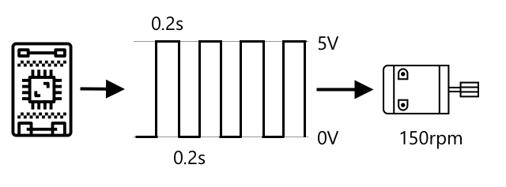
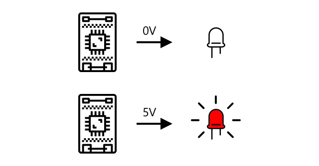

<!--
CO_OP_TRANSLATOR_METADATA:
{
  "original_hash": "e9ee00eb5fc55922a73762acc542166b",
  "translation_date": "2025-08-24T23:16:28+00:00",
  "source_file": "1-getting-started/lessons/3-sensors-and-actuators/README.md",
  "language_code": "fr"
}
-->
# Interagir avec le monde physique avec des capteurs et des actionneurs


> Sketchnote par [Nitya Narasimhan](https://github.com/nitya). Cliquez sur l'image pour une version agrandie.

Cette leçon a été enseignée dans le cadre de la série [Hello IoT](https://youtube.com/playlist?list=PLmsFUfdnGr3xRts0TIwyaHyQuHaNQcb6-) du [Microsoft Reactor](https://developer.microsoft.com/reactor/?WT.mc_id=academic-17441-jabenn). Elle a été présentée en deux vidéos : une leçon d'une heure et une session de questions-réponses d'une heure approfondissant certains aspects de la leçon.

[](https://youtu.be/Lqalu1v6aF4)

[](https://youtu.be/qR3ekcMlLWA)

> 🎥 Cliquez sur les images ci-dessus pour regarder les vidéos

## Quiz avant la leçon

[Quiz avant la leçon](https://black-meadow-040d15503.1.azurestaticapps.net/quiz/5)

## Introduction

Cette leçon introduit deux concepts essentiels pour votre appareil IoT : les capteurs et les actionneurs. Vous allez également les manipuler directement, en ajoutant un capteur de lumière à votre projet IoT, puis une LED contrôlée par les niveaux de lumière, créant ainsi une veilleuse.

Dans cette leçon, nous aborderons :

* [Qu'est-ce qu'un capteur ?](../../../../../1-getting-started/lessons/3-sensors-and-actuators)
* [Utiliser un capteur](../../../../../1-getting-started/lessons/3-sensors-and-actuators)
* [Types de capteurs](../../../../../1-getting-started/lessons/3-sensors-and-actuators)
* [Qu'est-ce qu'un actionneur ?](../../../../../1-getting-started/lessons/3-sensors-and-actuators)
* [Utiliser un actionneur](../../../../../1-getting-started/lessons/3-sensors-and-actuators)
* [Types d'actionneurs](../../../../../1-getting-started/lessons/3-sensors-and-actuators)

## Qu'est-ce qu'un capteur ?

Les capteurs sont des dispositifs matériels qui détectent le monde physique, c'est-à-dire qu'ils mesurent une ou plusieurs propriétés autour d'eux et envoient l'information à un appareil IoT. Il existe une grande variété de capteurs, car de nombreux éléments peuvent être mesurés, allant des propriétés naturelles comme la température de l'air aux interactions physiques comme le mouvement.

Quelques capteurs courants incluent :

* Capteurs de température - ils mesurent la température de l'air ou celle de l'objet dans lequel ils sont immergés. Pour les amateurs et les développeurs, ces capteurs sont souvent combinés avec des capteurs de pression atmosphérique et d'humidité.
* Boutons - ils détectent lorsqu'ils sont pressés.
* Capteurs de lumière - ils mesurent les niveaux de lumière et peuvent être spécifiques à certaines couleurs, à la lumière UV, à la lumière infrarouge ou à la lumière visible en général.
* Caméras - elles capturent une représentation visuelle du monde en prenant des photos ou en diffusant des vidéos.
* Accéléromètres - ils détectent les mouvements dans plusieurs directions.
* Microphones - ils captent les sons, qu'il s'agisse de niveaux sonores généraux ou de sons directionnels.

✅ Faites des recherches. Quels capteurs votre téléphone possède-t-il ?

Tous les capteurs ont un point commun : ils convertissent ce qu'ils détectent en un signal électrique qui peut être interprété par un appareil IoT. La manière dont ce signal est interprété dépend du capteur ainsi que du protocole de communication utilisé pour transmettre les données à l'appareil IoT.

## Utiliser un capteur

Suivez le guide correspondant ci-dessous pour ajouter un capteur à votre appareil IoT :

* [Arduino - Wio Terminal](wio-terminal-sensor.md)
* [Ordinateur monocarte - Raspberry Pi](pi-sensor.md)
* [Ordinateur monocarte - Appareil virtuel](virtual-device-sensor.md)

## Types de capteurs

Les capteurs peuvent être analogiques ou numériques.

### Capteurs analogiques

Certains des capteurs les plus simples sont analogiques. Ces capteurs reçoivent une tension de l'appareil IoT, les composants du capteur ajustent cette tension, et la tension retournée par le capteur est mesurée pour obtenir la valeur du capteur.

> 🎓 La tension est une mesure de la force qui pousse l'électricité d'un endroit à un autre, comme du terminal positif d'une batterie au terminal négatif. Par exemple, une batterie AA standard est de 1,5V (V est le symbole pour volts) et peut pousser l'électricité avec une force de 1,5V de son terminal positif à son terminal négatif. Différents matériels électriques nécessitent différentes tensions pour fonctionner, par exemple, une LED peut s'allumer avec une tension entre 2-3V, mais une ampoule à filament de 100W nécessiterait 240V. Vous pouvez en savoir plus sur la tension sur la [page Wikipédia sur la tension](https://wikipedia.org/wiki/Voltage).

Un exemple est un potentiomètre. C'est un cadran que vous pouvez tourner entre deux positions, et le capteur mesure la rotation.


L'appareil IoT envoie un signal électrique au potentiomètre à une tension, par exemple 5 volts (5V). Lorsque le potentiomètre est ajusté, il modifie la tension qui sort de l'autre côté. Imaginez un potentiomètre étiqueté comme un cadran allant de 0 à [11](https://wikipedia.org/wiki/Up_to_eleven), comme un bouton de volume sur un amplificateur. Lorsque le potentiomètre est en position complètement éteinte (0), alors 0V (0 volts) sortent. Lorsqu'il est en position complètement allumée (11), 5V (5 volts) sortent.

> 🎓 Ceci est une simplification, et vous pouvez en savoir plus sur les potentiomètres et les résistances variables sur la [page Wikipédia sur les potentiomètres](https://wikipedia.org/wiki/Potentiometer).

La tension qui sort du capteur est ensuite lue par l'appareil IoT, et l'appareil peut y répondre. Selon le capteur, cette tension peut être une valeur arbitraire ou correspondre à une unité standard. Par exemple, un capteur de température analogique basé sur un [thermistor](https://wikipedia.org/wiki/Thermistor) modifie sa résistance en fonction de la température. La tension de sortie peut ensuite être convertie en température en Kelvin, et correspondamment en °C ou °F, par des calculs dans le code.

✅ Que pensez-vous qu'il se passe si le capteur retourne une tension supérieure à celle envoyée (par exemple provenant d'une alimentation externe) ? ⛔️ NE TESTEZ PAS cela.

#### Conversion analogique-numérique

Les appareils IoT sont numériques - ils ne peuvent pas travailler avec des valeurs analogiques, seulement avec des 0 et des 1. Cela signifie que les valeurs des capteurs analogiques doivent être converties en un signal numérique avant de pouvoir être traitées. De nombreux appareils IoT disposent de convertisseurs analogique-numérique (ADC) pour convertir les entrées analogiques en représentations numériques de leur valeur. Les capteurs peuvent également fonctionner avec des ADC via une carte connecteur. Par exemple, dans l'écosystème Seeed Grove avec un Raspberry Pi, les capteurs analogiques se connectent à des ports spécifiques sur un "hat" qui se fixe au Pi connecté aux broches GPIO du Pi, et ce hat dispose d'un ADC pour convertir la tension en un signal numérique qui peut être envoyé via les broches GPIO du Pi.

Imaginez un capteur de lumière analogique connecté à un appareil IoT fonctionnant à 3,3V et retournant une valeur de 1V. Ce 1V n'a pas de sens dans le monde numérique, il doit donc être converti. La tension sera convertie en une valeur analogique en utilisant une échelle dépendant de l'appareil et du capteur. Un exemple est le capteur de lumière Seeed Grove qui produit des valeurs de 0 à 1 023. Pour ce capteur fonctionnant à 3,3V, une sortie de 1V correspondrait à une valeur de 300. Un appareil IoT ne peut pas gérer 300 comme valeur analogique, donc la valeur serait convertie en `0000000100101100`, la représentation binaire de 300 par le hat Grove. Cela serait ensuite traité par l'appareil IoT.

✅ Si vous ne connaissez pas le binaire, faites quelques recherches pour apprendre comment les nombres sont représentés par des 0 et des 1. La [leçon d'introduction au binaire de BBC Bitesize](https://www.bbc.co.uk/bitesize/guides/zwsbwmn/revision/1) est un excellent point de départ.

Du point de vue du codage, tout cela est généralement géré par des bibliothèques fournies avec les capteurs, donc vous n'avez pas besoin de vous soucier de cette conversion vous-même. Pour le capteur de lumière Grove, vous utiliseriez la bibliothèque Python et appelleriez la propriété `light`, ou utiliseriez la bibliothèque Arduino et appelleriez `analogRead` pour obtenir une valeur de 300.

### Capteurs numériques

Les capteurs numériques, comme les capteurs analogiques, détectent le monde qui les entoure en utilisant des variations de tension électrique. La différence est qu'ils produisent un signal numérique, soit en mesurant uniquement deux états, soit en utilisant un ADC intégré. Les capteurs numériques deviennent de plus en plus courants pour éviter la nécessité d'utiliser un ADC soit dans une carte connecteur, soit directement sur l'appareil IoT.

Le capteur numérique le plus simple est un bouton ou un interrupteur. C'est un capteur avec deux états : activé ou désactivé.


Les broches des appareils IoT, comme les broches GPIO, peuvent mesurer ce signal directement comme un 0 ou un 1. Si la tension envoyée est la même que la tension retournée, la valeur lue est 1, sinon la valeur lue est 0. Il n'est pas nécessaire de convertir le signal, il ne peut être que 1 ou 0.

> 💁 Les tensions ne sont jamais exactes, surtout car les composants d'un capteur auront une certaine résistance, donc il y a généralement une tolérance. Par exemple, les broches GPIO d'un Raspberry Pi fonctionnent à 3,3V et lisent un signal de retour supérieur à 1,8V comme un 1, et inférieur à 1,8V comme un 0.

* 3,3V entrent dans le bouton. Le bouton est désactivé, donc 0V sortent, donnant une valeur de 0.
* 3,3V entrent dans le bouton. Le bouton est activé, donc 3,3V sortent, donnant une valeur de 1.

Les capteurs numériques plus avancés lisent des valeurs analogiques, puis les convertissent en utilisant des ADC intégrés pour produire des signaux numériques. Par exemple, un capteur de température numérique utilisera toujours un thermocouple de la même manière qu'un capteur analogique, et mesurera toujours la variation de tension causée par la résistance du thermocouple à la température actuelle. Au lieu de retourner une valeur analogique et de compter sur l'appareil ou la carte connecteur pour la convertir en signal numérique, un ADC intégré au capteur convertira la valeur et l'enverra sous forme de série de 0 et de 1 à l'appareil IoT. Ces 0 et 1 sont envoyés de la même manière que le signal numérique d'un bouton, avec 1 correspondant à la tension maximale et 0 à 0V.


L'envoi de données numériques permet aux capteurs de devenir plus complexes et d'envoyer des données plus détaillées, voire des données cryptées pour des capteurs sécurisés. Un exemple est une caméra. C'est un capteur qui capture une image et l'envoie sous forme de données numériques contenant cette image, généralement dans un format compressé comme JPEG, pour être lue par l'appareil IoT. Elle peut même diffuser des vidéos en capturant des images et en envoyant soit l'image complète image par image, soit un flux vidéo compressé.

## Qu'est-ce qu'un actionneur ?

Les actionneurs sont l'opposé des capteurs : ils convertissent un signal électrique provenant de votre appareil IoT en une interaction avec le monde physique, comme émettre de la lumière ou du son, ou déplacer un moteur.

Quelques actionneurs courants incluent :

* LED - elles émettent de la lumière lorsqu'elles sont activées.
* Haut-parleur - ils émettent du son en fonction du signal envoyé, allant d'un simple buzzer à un haut-parleur audio capable de jouer de la musique.
* Moteur pas à pas - ils convertissent un signal en une rotation définie, comme tourner un cadran de 90°.
* Relais - ce sont des interrupteurs qui peuvent être activés ou désactivés par un signal électrique. Ils permettent à une petite tension provenant d'un appareil IoT d'activer des tensions plus importantes.
* Écrans - ce sont des actionneurs plus complexes qui affichent des informations sur un écran multi-segments. Les écrans varient des simples affichages LED aux moniteurs vidéo haute résolution.

✅ Faites des recherches. Quels actionneurs votre téléphone possède-t-il ?

## Utiliser un actionneur

Suivez le guide correspondant ci-dessous pour ajouter un actionneur à votre appareil IoT, contrôlé par le capteur, afin de créer une veilleuse IoT. Elle recueillera les niveaux de lumière du capteur de lumière et utilisera un actionneur sous forme de LED pour émettre de la lumière lorsque le niveau de lumière détecté est trop faible.


* [Arduino - Wio Terminal](wio-terminal-actuator.md)
* [Ordinateur monocarte - Raspberry Pi](pi-actuator.md)
* [Ordinateur monocarte - Appareil virtuel](virtual-device-actuator.md)

## Types d'actionneurs

Comme les capteurs, les actionneurs peuvent être analogiques ou numériques.

### Actionneurs analogiques

Les actionneurs analogiques prennent un signal analogique et le convertissent en une interaction quelconque, où l'interaction varie en fonction de la tension fournie.

Un exemple est une lumière réglable, comme celles que vous pourriez avoir chez vous. La quantité de tension fournie à la lumière détermine sa luminosité.


Comme pour les capteurs, le véritable appareil IoT fonctionne avec des signaux numériques, et non analogiques. Cela signifie que pour envoyer un signal analogique, l'appareil IoT a besoin d'un convertisseur numérique-analogique (DAC), soit directement sur l'appareil IoT, soit sur une carte connecteur. Cela convertira les 0 et 1 de l'appareil IoT en une tension analogique que l'actionneur peut utiliser.

✅ Que pensez-vous qu'il se passe si l'appareil IoT envoie une tension plus élevée que celle que l'actionneur peut supporter ?  
⛔️ NE TESTEZ PAS cela.

#### Modulation de largeur d'impulsion

Une autre option pour convertir les signaux numériques d'un appareil IoT en un signal analogique est la modulation de largeur d'impulsion (PWM). Cela consiste à envoyer de nombreuses impulsions numériques courtes qui agissent comme si elles étaient un signal analogique.

Par exemple, vous pouvez utiliser la PWM pour contrôler la vitesse d'un moteur.

Imaginez que vous contrôlez un moteur avec une alimentation de 5V. Vous envoyez une impulsion courte à votre moteur, passant la tension à haute (5V) pendant deux centièmes de seconde (0,02s). Pendant ce temps, votre moteur peut effectuer un dixième de rotation, soit 36°. Le signal s'interrompt ensuite pendant deux centièmes de seconde (0,02s), envoyant un signal bas (0V). Chaque cycle de marche puis d'arrêt dure 0,04s. Le cycle se répète ensuite.



Cela signifie qu'en une seconde, vous avez 25 impulsions de 5V de 0,02s qui font tourner le moteur, chacune suivie d'une pause de 0,02s à 0V où le moteur ne tourne pas. Chaque impulsion fait tourner le moteur d'un dixième de rotation, ce qui signifie que le moteur effectue 2,5 rotations par seconde. Vous avez utilisé un signal numérique pour faire tourner le moteur à 2,5 rotations par seconde, soit 150 [tours par minute](https://wikipedia.org/wiki/Revolutions_per_minute) (une mesure non standard de la vitesse de rotation).

```output
25 pulses per second x 0.1 rotations per pulse = 2.5 rotations per second
2.5 rotations per second x 60 seconds in a minute = 150rpm
```

> 🎓 Lorsque le signal PWM est activé pendant la moitié du temps et désactivé pendant l'autre moitié, on parle d'un [cycle de service de 50%](https://wikipedia.org/wiki/Duty_cycle). Les cycles de service sont mesurés en pourcentage du temps où le signal est en état activé par rapport à l'état désactivé.


Vous pouvez modifier la vitesse du moteur en changeant la taille des impulsions. Par exemple, avec le même moteur, vous pouvez conserver le même temps de cycle de 0,04s, avec l'impulsion activée réduite de moitié à 0,01s, et l'impulsion désactivée augmentée à 0,03s. Vous avez le même nombre d'impulsions par seconde (25), mais chaque impulsion activée est deux fois plus courte. Une impulsion réduite de moitié ne fait tourner le moteur que d'un vingtième de rotation, et à 25 impulsions par seconde, il effectuera 1,25 rotation par seconde, soit 75 RPM. En modifiant la vitesse des impulsions d'un signal numérique, vous avez réduit de moitié la vitesse d'un moteur analogique.

```output
25 pulses per second x 0.05 rotations per pulse = 1.25 rotations per second
1.25 rotations per second x 60 seconds in a minute = 75rpm
```

✅ Comment garderiez-vous la rotation du moteur fluide, en particulier à basse vitesse ? Utiliseriez-vous un petit nombre d'impulsions longues avec de longues pauses ou de nombreuses impulsions très courtes avec des pauses très courtes ?

> 💁 Certains capteurs utilisent également la PWM pour convertir des signaux analogiques en signaux numériques.

> 🎓 Vous pouvez en apprendre davantage sur la modulation de largeur d'impulsion sur la [page Wikipedia dédiée](https://wikipedia.org/wiki/Pulse-width_modulation).

### Actionneurs numériques

Les actionneurs numériques, comme les capteurs numériques, ont soit deux états contrôlés par une tension haute ou basse, soit un DAC intégré qui peut convertir un signal numérique en un signal analogique.

Un actionneur numérique simple est une LED. Lorsqu'un appareil envoie un signal numérique de 1, une tension haute est envoyée pour allumer la LED. Lorsqu'un signal numérique de 0 est envoyé, la tension tombe à 0V et la LED s'éteint.



✅ Quels autres actionneurs simples à 2 états pouvez-vous imaginer ? Un exemple est un solénoïde, qui est un électroaimant pouvant être activé pour effectuer des actions comme déplacer un verrou de porte pour la verrouiller/déverrouiller.

Les actionneurs numériques plus avancés, comme les écrans, nécessitent que les données numériques soient envoyées dans des formats spécifiques. Ils sont généralement accompagnés de bibliothèques qui facilitent l'envoi des données correctes pour les contrôler.

---

## 🚀 Défi

Le défi des deux dernières leçons était de lister autant d'appareils IoT que possible présents chez vous, à l'école ou sur votre lieu de travail, et de déterminer s'ils sont basés sur des microcontrôleurs ou des ordinateurs monocarte, ou même un mélange des deux.

Pour chaque appareil que vous avez listé, quels capteurs et actionneurs y sont connectés ? Quel est le rôle de chaque capteur et actionneur connecté à ces appareils ?

## Quiz après le cours

[Quiz après le cours](https://black-meadow-040d15503.1.azurestaticapps.net/quiz/6)

## Révision et étude personnelle

* Lisez sur l'électricité et les circuits sur [ThingLearn](http://thinglearn.jenlooper.com/curriculum/).  
* Lisez sur les différents types de capteurs de température dans le [guide des capteurs de température de Seeed Studios](https://www.seeedstudio.com/blog/2019/10/14/temperature-sensors-for-arduino-projects/).  
* Lisez sur les LEDs sur la [page Wikipedia dédiée aux LEDs](https://wikipedia.org/wiki/Light-emitting_diode).  

## Devoir

[Recherche sur les capteurs et actionneurs](assignment.md)

**Avertissement** :  
Ce document a été traduit à l'aide du service de traduction automatique [Co-op Translator](https://github.com/Azure/co-op-translator). Bien que nous nous efforcions d'assurer l'exactitude, veuillez noter que les traductions automatisées peuvent contenir des erreurs ou des inexactitudes. Le document original dans sa langue d'origine doit être considéré comme la source faisant autorité. Pour des informations critiques, il est recommandé de recourir à une traduction humaine professionnelle. Nous déclinons toute responsabilité en cas de malentendus ou d'interprétations erronées résultant de l'utilisation de cette traduction.