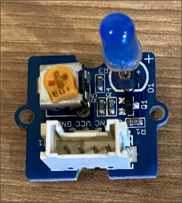

<!--
CO_OP_TRANSLATOR_METADATA:
{
  "original_hash": "4db8a3879a53490513571df2f6cf7641",
  "translation_date": "2025-08-24T23:20:38+00:00",
  "source_file": "1-getting-started/lessons/3-sensors-and-actuators/pi-actuator.md",
  "language_code": "fr"
}
-->
# Construire une veilleuse - Raspberry Pi

Dans cette partie de la leçon, vous allez ajouter une LED à votre Raspberry Pi et l'utiliser pour créer une veilleuse.

## Matériel

La veilleuse a maintenant besoin d'un actionneur.

L'actionneur est une **LED**, une [diode électroluminescente](https://wikipedia.org/wiki/Diode_%C3%A9lectroluminescente) qui émet de la lumière lorsqu'un courant la traverse. C'est un actionneur numérique qui possède deux états : allumé et éteint. Envoyer une valeur de 1 allume la LED, et une valeur de 0 l'éteint. La LED est un actionneur externe Grove et doit être connectée au Grove Base Hat sur le Raspberry Pi.

La logique de la veilleuse en pseudo-code est :

```output
Check the light level.
If the light is less than 300
    Turn the LED on
Otherwise
    Turn the LED off
```

### Connecter la LED

La LED Grove est livrée sous forme de module avec une sélection de LEDs, vous permettant de choisir la couleur.

#### Tâche - connecter la LED

Connectez la LED.



1. Choisissez votre LED préférée et insérez les pattes dans les deux trous du module LED.

    Les LEDs sont des diodes électroluminescentes, et les diodes sont des dispositifs électroniques qui ne peuvent transporter le courant que dans un seul sens. Cela signifie que la LED doit être connectée dans le bon sens, sinon elle ne fonctionnera pas.

    Une des pattes de la LED est la broche positive, l'autre est la broche négative. La LED n'est pas parfaitement ronde et est légèrement plus plate d'un côté. Le côté légèrement plus plat est la broche négative. Lorsque vous connectez la LED au module, assurez-vous que la patte du côté arrondi est connectée à la prise marquée **+** à l'extérieur du module, et que le côté plat est connecté à la prise plus proche du centre du module.

1. Le module LED possède un bouton rotatif qui vous permet de contrôler la luminosité. Tournez-le complètement au départ en le faisant pivoter dans le sens antihoraire autant que possible à l'aide d'un petit tournevis cruciforme.

1. Insérez une extrémité d'un câble Grove dans la prise du module LED. Il ne peut être inséré que dans un seul sens.

1. Avec le Raspberry Pi éteint, connectez l'autre extrémité du câble Grove à la prise numérique marquée **D5** sur le Grove Base Hat attaché au Pi. Cette prise est la deuxième à partir de la gauche, sur la rangée de prises à côté des broches GPIO.


## Programmer la veilleuse

La veilleuse peut maintenant être programmée en utilisant le capteur de lumière Grove et la LED Grove.

### Tâche - programmer la veilleuse

Programmez la veilleuse.

1. Allumez le Pi et attendez qu'il démarre.

1. Ouvrez le projet de veilleuse dans VS Code que vous avez créé dans la partie précédente de cet exercice, soit directement sur le Pi, soit en utilisant l'extension Remote SSH.

1. Ajoutez le code suivant au fichier `app.py` pour importer une bibliothèque requise. Cela doit être ajouté en haut, sous les autres lignes `import`.

    ```python
    from grove.grove_led import GroveLed
    ```

    L'instruction `from grove.grove_led import GroveLed` importe la classe `GroveLed` des bibliothèques Python Grove. Cette bibliothèque contient du code pour interagir avec une LED Grove.

1. Ajoutez le code suivant après la déclaration `light_sensor` pour créer une instance de la classe qui gère la LED :

    ```python
    led = GroveLed(5)
    ```

    La ligne `led = GroveLed(5)` crée une instance de la classe `GroveLed` connectée à la broche **D5** - la broche numérique Grove à laquelle la LED est connectée.

    > 💁 Toutes les prises ont des numéros de broche uniques. Les broches 0, 2, 4 et 6 sont des broches analogiques, les broches 5, 16, 18, 22, 24 et 26 sont des broches numériques.

1. Ajoutez une vérification à l'intérieur de la boucle `while`, et avant le `time.sleep`, pour vérifier les niveaux de lumière et allumer ou éteindre la LED :

    ```python
    if light < 300:
        led.on()
    else:
        led.off()
    ```

    Ce code vérifie la valeur `light`. Si celle-ci est inférieure à 300, il appelle la méthode `on` de la classe `GroveLed`, qui envoie une valeur numérique de 1 à la LED, l'allumant. Si la valeur de lumière est supérieure ou égale à 300, il appelle la méthode `off`, envoyant une valeur numérique de 0 à la LED, l'éteignant.

    > 💁 Ce code doit être indenté au même niveau que la ligne `print('Light level:', light)` pour être à l'intérieur de la boucle while !

    > 💁 Lors de l'envoi de valeurs numériques aux actionneurs, une valeur de 0 correspond à 0V, et une valeur de 1 correspond à la tension maximale pour le dispositif. Pour le Raspberry Pi avec les capteurs et actionneurs Grove, la tension de 1 est de 3,3V.

1. Depuis le terminal de VS Code, exécutez la commande suivante pour lancer votre application Python :

    ```sh
    python3 app.py
    ```

    Les valeurs de lumière seront affichées dans la console.

    ```output
    pi@raspberrypi:~/nightlight $ python3 app.py 
    Light level: 634
    Light level: 634
    Light level: 634
    Light level: 230
    Light level: 104
    Light level: 290
    ```

1. Couvrez et découvrez le capteur de lumière. Remarquez comment la LED s'allume si le niveau de lumière est de 300 ou moins, et s'éteint lorsque le niveau de lumière est supérieur à 300.

    > 💁 Si la LED ne s'allume pas, assurez-vous qu'elle est connectée dans le bon sens et que le bouton rotatif est réglé au maximum.


> 💁 Vous pouvez trouver ce code dans le dossier [code-actuator/pi](../../../../../1-getting-started/lessons/3-sensors-and-actuators/code-actuator/pi).

😀 Votre programme de veilleuse est un succès !

**Avertissement** :  
Ce document a été traduit à l'aide du service de traduction automatique [Co-op Translator](https://github.com/Azure/co-op-translator). Bien que nous nous efforcions d'assurer l'exactitude, veuillez noter que les traductions automatisées peuvent contenir des erreurs ou des inexactitudes. Le document original dans sa langue d'origine doit être considéré comme la source faisant autorité. Pour des informations critiques, il est recommandé de faire appel à une traduction humaine professionnelle. Nous déclinons toute responsabilité en cas de malentendus ou d'interprétations erronées résultant de l'utilisation de cette traduction.