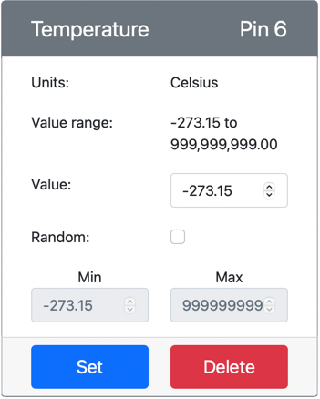

<!--
CO_OP_TRANSLATOR_METADATA:
{
  "original_hash": "70e5a428b607cd5a9a4f422c2a4df03d",
  "translation_date": "2025-08-24T22:06:59+00:00",
  "source_file": "2-farm/lessons/1-predict-plant-growth/virtual-device-temp.md",
  "language_code": "fr"
}
-->
# Mesurer la température - Matériel IoT Virtuel

Dans cette partie de la leçon, vous allez ajouter un capteur de température à votre appareil IoT virtuel.

## Matériel Virtuel

L'appareil IoT virtuel utilisera un capteur simulé Grove Digital Humidity and Temperature. Cela permet de garder ce laboratoire similaire à l'utilisation d'un Raspberry Pi avec un capteur physique Grove DHT11.

Le capteur combine un **capteur de température** avec un **capteur d'humidité**, mais dans ce laboratoire, vous vous concentrez uniquement sur le composant du capteur de température. Sur un appareil IoT physique, le capteur de température serait une [thermistance](https://wikipedia.org/wiki/Thermistor) qui mesure la température en détectant un changement de résistance lorsque la température varie. Les capteurs de température sont généralement des capteurs numériques qui convertissent en interne la résistance mesurée en une température en degrés Celsius (ou Kelvin, ou Fahrenheit).

### Ajouter les capteurs à CounterFit

Pour utiliser un capteur virtuel d'humidité et de température, vous devez ajouter les deux capteurs à l'application CounterFit.

#### Tâche - ajouter les capteurs à CounterFit

Ajoutez les capteurs d'humidité et de température à l'application CounterFit.

1. Créez une nouvelle application Python sur votre ordinateur dans un dossier appelé `temperature-sensor` avec un fichier unique nommé `app.py`, un environnement virtuel Python, et ajoutez les packages pip de CounterFit.

    > ⚠️ Vous pouvez vous référer [aux instructions pour créer et configurer un projet Python CounterFit dans la leçon 1 si nécessaire](../../../1-getting-started/lessons/1-introduction-to-iot/virtual-device.md).

1. Installez un package Pip supplémentaire pour installer un shim CounterFit pour le capteur DHT11. Assurez-vous de l'installer depuis un terminal avec l'environnement virtuel activé.

    ```sh
    pip install counterfit-shims-seeed-python-dht
    ```

1. Assurez-vous que l'application web CounterFit est en cours d'exécution.

1. Créez un capteur d'humidité :

    1. Dans la boîte *Create sensor* du volet *Sensors*, déroulez la boîte *Sensor type* et sélectionnez *Humidity*.

    1. Laissez les *Units* sur *Percentage*.

    1. Assurez-vous que le *Pin* est réglé sur *5*.

    1. Sélectionnez le bouton **Add** pour créer le capteur d'humidité sur le Pin 5.

    

    Le capteur d'humidité sera créé et apparaîtra dans la liste des capteurs.

    

1. Créez un capteur de température :

    1. Dans la boîte *Create sensor* du volet *Sensors*, déroulez la boîte *Sensor type* et sélectionnez *Temperature*.

    1. Laissez les *Units* sur *Celsius*.

    1. Assurez-vous que le *Pin* est réglé sur *6*.

    1. Sélectionnez le bouton **Add** pour créer le capteur de température sur le Pin 6.

    

    Le capteur de température sera créé et apparaîtra dans la liste des capteurs.

    

## Programmer l'application du capteur de température

L'application du capteur de température peut maintenant être programmée en utilisant les capteurs CounterFit.

### Tâche - programmer l'application du capteur de température

Programmez l'application du capteur de température.

1. Assurez-vous que l'application `temperature-sensor` est ouverte dans VS Code.

1. Ouvrez le fichier `app.py`.

1. Ajoutez le code suivant en haut de `app.py` pour connecter l'application à CounterFit :

    ```python
    from counterfit_connection import CounterFitConnection
    CounterFitConnection.init('127.0.0.1', 5000)
    ```

1. Ajoutez le code suivant au fichier `app.py` pour importer les bibliothèques nécessaires :

    ```python
    import time
    from counterfit_shims_seeed_python_dht import DHT
    ```

    L'instruction `from seeed_dht import DHT` importe la classe `DHT` pour interagir avec un capteur virtuel Grove de température en utilisant un shim du module `counterfit_shims_seeed_python_dht`.

1. Ajoutez le code suivant après le code ci-dessus pour créer une instance de la classe qui gère le capteur virtuel d'humidité et de température :

    ```python
    sensor = DHT("11", 5)
    ```

    Cela déclare une instance de la classe `DHT` qui gère le capteur virtuel **D**igital **H**umidity and **T**emperature. Le premier paramètre indique au code que le capteur utilisé est un capteur virtuel *DHT11*. Le second paramètre indique au code que le capteur est connecté au port `5`.

    > 💁 CounterFit simule ce capteur combiné d'humidité et de température en se connectant à 2 capteurs : un capteur d'humidité sur le pin donné lors de la création de la classe `DHT`, et un capteur de température qui fonctionne sur le pin suivant. Si le capteur d'humidité est sur le pin 5, le shim attend que le capteur de température soit sur le pin 6.

1. Ajoutez une boucle infinie après le code ci-dessus pour interroger la valeur du capteur de température et l'afficher dans la console :

    ```python
    while True:
        _, temp = sensor.read()
        print(f'Temperature {temp}°C')
    ```

    L'appel à `sensor.read()` retourne un tuple contenant l'humidité et la température. Vous n'avez besoin que de la valeur de la température, donc l'humidité est ignorée. La valeur de la température est ensuite affichée dans la console.

1. Ajoutez une petite pause de dix secondes à la fin de la boucle, car les niveaux de température n'ont pas besoin d'être vérifiés en continu. Une pause réduit la consommation d'énergie de l'appareil.

    ```python
    time.sleep(10)
    ```

1. Depuis le terminal de VS Code avec un environnement virtuel activé, exécutez la commande suivante pour lancer votre application Python :

    ```sh
    python app.py
    ```

1. Depuis l'application CounterFit, modifiez la valeur du capteur de température qui sera lue par l'application. Vous pouvez le faire de deux manières :

    * Entrez un nombre dans la boîte *Value* du capteur de température, puis sélectionnez le bouton **Set**. Le nombre que vous entrez sera la valeur retournée par le capteur.

    * Cochez la case *Random*, et entrez une valeur *Min* et *Max*, puis sélectionnez le bouton **Set**. Chaque fois que le capteur lit une valeur, il lira un nombre aléatoire entre *Min* et *Max*.

    Vous devriez voir les valeurs que vous avez définies apparaître dans la console. Modifiez la *Value* ou les paramètres *Random* pour voir les valeurs changer.

    ```output
    (.venv) ➜  temperature-sensor python app.py
    Temperature 28.25°C
    Temperature 30.71°C
    Temperature 25.17°C
    ```

> 💁 Vous pouvez trouver ce code dans le dossier [code-temperature/virtual-device](../../../../../2-farm/lessons/1-predict-plant-growth/code-temperature/virtual-device).

😀 Votre programme de capteur de température a été un succès !

**Avertissement** :  
Ce document a été traduit à l'aide du service de traduction automatique [Co-op Translator](https://github.com/Azure/co-op-translator). Bien que nous nous efforcions d'assurer l'exactitude, veuillez noter que les traductions automatisées peuvent contenir des erreurs ou des inexactitudes. Le document original dans sa langue d'origine doit être considéré comme la source faisant autorité. Pour des informations critiques, il est recommandé de recourir à une traduction humaine professionnelle. Nous déclinons toute responsabilité en cas de malentendus ou d'interprétations erronées résultant de l'utilisation de cette traduction.