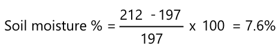

<!--
CO_OP_TRANSLATOR_METADATA:
{
  "original_hash": "506d21b544d5de47406c89ad496a21cd",
  "translation_date": "2025-08-24T22:38:32+00:00",
  "source_file": "2-farm/lessons/2-detect-soil-moisture/assignment.md",
  "language_code": "fr"
}
-->
# Calibrez votre capteur

## Instructions

Dans cette leçon, vous avez recueilli des relevés de capteur d'humidité du sol, mesurés en valeurs de 0 à 1023. Pour convertir ces relevés en mesures réelles d'humidité du sol, vous devez calibrer votre capteur. Vous pouvez le faire en prenant des relevés à partir d'échantillons de sol, puis en calculant la teneur en humidité gravimétrique du sol à partir de ces échantillons.

Vous devrez répéter ces étapes plusieurs fois pour obtenir les relevés nécessaires, avec des niveaux d'humidité différents à chaque fois.

1. Prenez une mesure d'humidité du sol à l'aide du capteur d'humidité du sol. Notez cette mesure.

1. Prélevez un échantillon de sol et pesez-le. Notez ce poids.

1. Séchez le sol - un four chaud à 110°C (230°F) pendant quelques heures est la meilleure méthode. Vous pouvez également le faire sécher au soleil ou le placer dans un endroit chaud et sec jusqu'à ce qu'il soit complètement sec. Le sol doit devenir poudreux et friable.

    > 💁 Dans un laboratoire, pour des résultats plus précis, vous sécheriez le sol dans un four pendant 48 à 72 heures. Si votre école dispose de fours de séchage, voyez si vous pouvez les utiliser pour un séchage plus long. Plus le séchage est long, plus l'échantillon sera sec et les résultats précis.

1. Pesez à nouveau le sol.

    > 🔥 Si vous l'avez séché dans un four, assurez-vous qu'il a refroidi avant de le peser !

L'humidité gravimétrique du sol se calcule comme suit :

* W - le poids du sol humide  
* W - le poids du sol sec  

Par exemple, supposons que vous avez un échantillon de sol pesant 212 g humide et 197 g sec.

* W = 212 g  
* W = 197 g  
* 212 - 197 = 15  
* 15 / 197 = 0,076  
* 0,076 * 100 = 7,6 %  

Dans cet exemple, le sol a une humidité gravimétrique de 7,6 %.

Une fois que vous avez les relevés pour au moins 3 échantillons, tracez un graphique de l'humidité du sol (%) en fonction des relevés du capteur d'humidité du sol et ajoutez une ligne de meilleure correspondance aux points. Vous pourrez ensuite utiliser ce graphique pour calculer la teneur en humidité gravimétrique du sol pour une mesure donnée du capteur en lisant la valeur sur la ligne.

## Grille d'évaluation

| Critères | Exemplaire | Adéquat | À améliorer |
| -------- | ---------- | ------- | ----------- |
| Recueillir des données de calibration | Capturer au moins 3 échantillons de calibration | Capturer au moins 2 échantillons de calibration | Capturer au moins 1 échantillon de calibration |
| Faire une lecture calibrée | Tracer avec succès le graphique de calibration, effectuer une lecture à partir du capteur et la convertir en teneur en humidité gravimétrique du sol | Tracer avec succès le graphique de calibration | Incapable de tracer le graphique |

**Avertissement** :  
Ce document a été traduit à l'aide du service de traduction automatique [Co-op Translator](https://github.com/Azure/co-op-translator). Bien que nous nous efforcions d'assurer l'exactitude, veuillez noter que les traductions automatisées peuvent contenir des erreurs ou des inexactitudes. Le document original dans sa langue d'origine doit être considéré comme la source faisant autorité. Pour des informations critiques, il est recommandé de faire appel à une traduction humaine professionnelle. Nous déclinons toute responsabilité en cas de malentendus ou d'interprétations erronées résultant de l'utilisation de cette traduction.