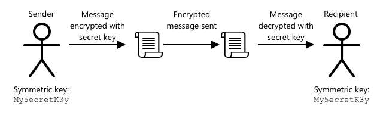

<!--
CO_OP_TRANSLATOR_METADATA:
{
  "original_hash": "81c437c568eee1b0dda1f04e88150d37",
  "translation_date": "2025-08-24T22:53:25+00:00",
  "source_file": "2-farm/lessons/6-keep-your-plant-secure/README.md",
  "language_code": "fr"
}
-->
# Gardez votre plante en sécurité


> Sketchnote par [Nitya Narasimhan](https://github.com/nitya). Cliquez sur l'image pour une version agrandie.

## Quiz avant la leçon

[Quiz avant la leçon](https://black-meadow-040d15503.1.azurestaticapps.net/quiz/19)

## Introduction

Dans les dernières leçons, vous avez créé un dispositif IoT de surveillance du sol et l'avez connecté au cloud. Mais que se passerait-il si des hackers travaillant pour un agriculteur rival prenaient le contrôle de vos appareils IoT ? Et s'ils envoyaient des relevés d'humidité du sol élevés pour que vos plantes ne soient jamais arrosées, ou s'ils activaient votre système d'arrosage en continu, tuant vos plantes par sur-arrosage et vous coûtant une petite fortune en eau ?

Dans cette leçon, vous apprendrez à sécuriser les appareils IoT. Étant donné qu'il s'agit de la dernière leçon de ce projet, vous apprendrez également à nettoyer vos ressources cloud, réduisant ainsi les coûts potentiels.

Dans cette leçon, nous aborderons :

* [Pourquoi devez-vous sécuriser les appareils IoT ?](../../../../../2-farm/lessons/6-keep-your-plant-secure)
* [Cryptographie](../../../../../2-farm/lessons/6-keep-your-plant-secure)
* [Sécurisez vos appareils IoT](../../../../../2-farm/lessons/6-keep-your-plant-secure)
* [Générer et utiliser un certificat X.509](../../../../../2-farm/lessons/6-keep-your-plant-secure)

> 🗑 C'est la dernière leçon de ce projet, donc après avoir terminé cette leçon et l'exercice, n'oubliez pas de nettoyer vos services cloud. Vous aurez besoin des services pour terminer l'exercice, alors assurez-vous de le faire en premier.
>
> Consultez [le guide de nettoyage de votre projet](../../../clean-up.md) si nécessaire pour obtenir des instructions sur la façon de procéder.

## Pourquoi devez-vous sécuriser les appareils IoT ?

La sécurité IoT consiste à garantir que seuls les appareils attendus peuvent se connecter à votre service cloud IoT et lui envoyer des télémétries, et que seul votre service cloud peut envoyer des commandes à vos appareils. Les données IoT peuvent également être personnelles, incluant des données médicales ou intimes, donc toute votre application doit prendre en compte la sécurité pour éviter que ces données ne soient divulguées.

Si votre application IoT n'est pas sécurisée, plusieurs risques peuvent survenir :

* Un faux appareil pourrait envoyer des données incorrectes, entraînant une réponse incorrecte de votre application. Par exemple, il pourrait envoyer des relevés d'humidité du sol constamment élevés, ce qui empêcherait votre système d'irrigation de s'activer et vos plantes mourraient par manque d'eau.
* Des utilisateurs non autorisés pourraient lire les données des appareils IoT, y compris des données personnelles ou critiques pour l'entreprise.
* Des hackers pourraient envoyer des commandes pour contrôler un appareil d'une manière qui pourrait endommager l'appareil ou le matériel connecté.
* En se connectant à un appareil IoT, des hackers pourraient utiliser cela pour accéder à des réseaux supplémentaires et obtenir un accès à des systèmes privés.
* Des utilisateurs malveillants pourraient accéder à des données personnelles et les utiliser pour du chantage.

Ce sont des scénarios réels qui se produisent fréquemment. Certains exemples ont été donnés dans les leçons précédentes, mais en voici d'autres :

* En 2018, des hackers ont utilisé un point d'accès WiFi ouvert sur un thermostat d'aquarium pour accéder au réseau d'un casino et voler des données. [The Hacker News - Casino Gets Hacked Through Its Internet-Connected Fish Tank Thermometer](https://thehackernews.com/2018/04/iot-hacking-thermometer.html)
* En 2016, le botnet Mirai a lancé une attaque par déni de service contre Dyn, un fournisseur de services Internet, mettant hors service de grandes parties d'Internet. Ce botnet utilisait des malwares pour se connecter à des appareils IoT tels que des DVR et des caméras utilisant des noms d'utilisateur et mots de passe par défaut, et lançait ensuite l'attaque. [The Guardian - DDoS attack that disrupted internet was largest of its kind in history, experts say](https://www.theguardian.com/technology/2016/oct/26/ddos-attack-dyn-mirai-botnet)
* Spiral Toys avait une base de données d'utilisateurs de leurs jouets connectés CloudPets accessible publiquement sur Internet. [Troy Hunt - Data from connected CloudPets teddy bears leaked and ransomed, exposing kids' voice messages](https://www.troyhunt.com/data-from-connected-cloudpets-teddy-bears-leaked-and-ransomed-exposing-kids-voice-messages/).
* Strava identifiait les coureurs que vous croisiez et montrait leurs itinéraires, permettant à des inconnus de voir où vous vivez. [Kim Komndo - Fitness app could lead a stranger right to your home — change this setting](https://www.komando.com/security-privacy/strava-fitness-app-privacy/755349/).

✅ Faites des recherches : Cherchez d'autres exemples de piratages IoT et de violations de données IoT, en particulier avec des objets personnels tels que des brosses à dents ou des balances connectées. Réfléchissez à l'impact que ces piratages pourraient avoir sur les victimes ou les clients.

> 💁 La sécurité est un sujet vaste, et cette leçon ne couvrira que quelques bases concernant la connexion de votre appareil au cloud. D'autres sujets qui ne seront pas abordés incluent la surveillance des modifications de données en transit, le piratage direct des appareils ou les modifications des configurations des appareils. Le piratage IoT est une menace si importante que des outils comme [Azure Defender for IoT](https://azure.microsoft.com/services/azure-defender-for-iot/?WT.mc_id=academic-17441-jabenn) ont été développés. Ces outils sont similaires aux antivirus et outils de sécurité que vous pourriez avoir sur votre ordinateur, mais conçus pour des appareils IoT petits et peu puissants.

## Cryptographie

Lorsqu'un appareil se connecte à un service IoT, il utilise un identifiant pour s'identifier. Le problème est que cet identifiant peut être cloné - un hacker pourrait configurer un appareil malveillant utilisant le même identifiant qu'un appareil réel mais envoyant des données erronées.


La solution consiste à convertir les données envoyées en un format brouillé, en utilisant une valeur connue uniquement de l'appareil et du cloud pour brouiller les données. Ce processus est appelé *chiffrement*, et la valeur utilisée pour chiffrer les données est appelée une *clé de chiffrement*.


Le service cloud peut ensuite convertir les données en un format lisible, en utilisant un processus appelé *déchiffrement*, soit avec la même clé de chiffrement, soit avec une *clé de déchiffrement*. Si le message chiffré ne peut pas être déchiffré par la clé, l'appareil a été piraté et le message est rejeté.

La technique utilisée pour effectuer le chiffrement et le déchiffrement est appelée *cryptographie*.

### Cryptographie ancienne

Les premiers types de cryptographie étaient des chiffres de substitution, datant de 3 500 ans. Les chiffres de substitution impliquent de substituer une lettre par une autre. Par exemple, le [chiffre de César](https://wikipedia.org/wiki/Caesar_cipher) consiste à décaler l'alphabet d'un montant défini, avec seulement l'expéditeur du message chiffré et le destinataire prévu connaissant le nombre de lettres à décaler.

Le [chiffre de Vigenère](https://wikipedia.org/wiki/Vigenère_cipher) a poussé cela plus loin en utilisant des mots pour chiffrer le texte, de sorte que chaque lettre du texte original était décalée d'un montant différent, plutôt que toujours du même nombre de lettres.

La cryptographie était utilisée à des fins variées, comme protéger une recette de glaçure de potier en Mésopotamie ancienne, écrire des notes d'amour secrètes en Inde ou garder des sorts magiques égyptiens anciens secrets.

### Cryptographie moderne

La cryptographie moderne est beaucoup plus avancée, ce qui la rend plus difficile à casser que les méthodes anciennes. Elle utilise des mathématiques complexes pour chiffrer les données avec un nombre de clés possibles bien trop élevé pour permettre des attaques par force brute.

La cryptographie est utilisée de nombreuses façons pour des communications sécurisées. Si vous lisez cette page sur GitHub, vous remarquerez peut-être que l'adresse du site Web commence par *HTTPS*, ce qui signifie que la communication entre votre navigateur et les serveurs Web de GitHub est chiffrée. Si quelqu'un pouvait lire le trafic Internet entre votre navigateur et GitHub, il ne pourrait pas lire les données car elles sont chiffrées. Votre ordinateur pourrait même chiffrer toutes les données sur votre disque dur afin que si quelqu'un le vole, il ne puisse pas lire vos données sans votre mot de passe.

> 🎓 HTTPS signifie HyperText Transfer Protocol **Secure**

Malheureusement, tout n'est pas sécurisé. Certains appareils n'ont aucune sécurité, d'autres sont sécurisés avec des clés faciles à casser, ou parfois même tous les appareils du même type utilisent la même clé. Il y a eu des cas d'appareils IoT très personnels ayant tous le même mot de passe pour se connecter via WiFi ou Bluetooth. Si vous pouvez vous connecter à votre propre appareil, vous pouvez vous connecter à celui de quelqu'un d'autre. Une fois connecté, vous pourriez accéder à des données très privées ou contrôler leur appareil.

> 💁 Malgré les complexités de la cryptographie moderne et les affirmations selon lesquelles casser le chiffrement pourrait prendre des milliards d'années, l'essor de l'informatique quantique a ouvert la possibilité de casser tous les chiffrement connus en très peu de temps !

### Clés symétriques et asymétriques

Le chiffrement existe en deux types : symétrique et asymétrique.

**Symétrique** utilise la même clé pour chiffrer et déchiffrer les données. L'expéditeur et le destinataire doivent connaître la même clé. Ce type est le moins sécurisé, car la clé doit être partagée d'une manière ou d'une autre. Pour qu'un expéditeur envoie un message chiffré à un destinataire, l'expéditeur doit d'abord envoyer la clé au destinataire.



Si la clé est volée en transit, ou si l'expéditeur ou le destinataire sont piratés et que la clé est découverte, le chiffrement peut être cassé.


**Asymétrique** utilise deux clés : une clé de chiffrement et une clé de déchiffrement, appelées paire de clés publique/privée. La clé publique est utilisée pour chiffrer le message, mais ne peut pas être utilisée pour le déchiffrer, tandis que la clé privée est utilisée pour déchiffrer le message mais ne peut pas être utilisée pour le chiffrer.


Le destinataire partage sa clé publique, et l'expéditeur l'utilise pour chiffrer le message. Une fois le message envoyé, le destinataire le déchiffre avec sa clé privée. Le chiffrement asymétrique est plus sécurisé car la clé privée est conservée privée par le destinataire et n'est jamais partagée. Tout le monde peut avoir la clé publique car elle ne peut être utilisée que pour chiffrer des messages.

Le chiffrement symétrique est plus rapide que le chiffrement asymétrique, mais le chiffrement asymétrique est plus sécurisé. Certains systèmes utilisent les deux : le chiffrement asymétrique pour chiffrer et partager la clé symétrique, puis la clé symétrique pour chiffrer toutes les données. Cela rend le partage de la clé symétrique entre l'expéditeur et le destinataire plus sécurisé, et le chiffrement/déchiffrement des données plus rapide.

## Sécurisez vos appareils IoT

Les appareils IoT peuvent être sécurisés en utilisant un chiffrement symétrique ou asymétrique. Le chiffrement symétrique est plus simple, mais moins sécurisé.

### Clés symétriques

Lorsque vous configurez votre appareil IoT pour interagir avec IoT Hub, vous avez utilisé une chaîne de connexion. Un exemple de chaîne de connexion est :

```output
HostName=soil-moisture-sensor.azure-devices.net;DeviceId=soil-moisture-sensor;SharedAccessKey=Bhry+ind7kKEIDxubK61RiEHHRTrPl7HUow8cEm/mU0=
```

Cette chaîne de connexion est composée de trois parties séparées par des points-virgules, chaque partie étant une clé et une valeur :

| Clé | Valeur | Description |
| --- | ----- | ----------- |
| HostName | `soil-moisture-sensor.azure-devices.net` | L'URL de l'IoT Hub |
| DeviceId | `soil-moisture-sensor` | L'identifiant unique de l'appareil |
| SharedAccessKey | `Bhry+ind7kKEIDxubK61RiEHHRTrPl7HUow8cEm/mU0=` | Une clé symétrique connue par l'appareil et l'IoT Hub |

La dernière partie de cette chaîne de connexion, le `SharedAccessKey`, est la clé symétrique connue par l'appareil et l'IoT Hub. Cette clé n'est jamais envoyée de l'appareil au cloud, ni du cloud à l'appareil. Elle est utilisée pour chiffrer les données envoyées ou reçues.

✅ Faites une expérience. Que pensez-vous qu'il se passera si vous modifiez la partie `SharedAccessKey` de la chaîne de connexion lors de la connexion de votre appareil IoT ? Essayez-le.

Lorsque l'appareil tente de se connecter pour la première fois, il envoie un jeton de signature d'accès partagé (SAS) composé de l'URL de l'IoT Hub, d'un horodatage indiquant l'expiration de la signature d'accès (généralement 1 jour à partir de l'heure actuelle), et d'une signature. Cette signature est composée de l'URL et de l'heure d'expiration chiffrées avec la clé d'accès partagée de la chaîne de connexion.

L'IoT Hub déchiffre cette signature avec la clé d'accès partagée, et si la valeur déchiffrée correspond à l'URL et à l'expiration, l'appareil est autorisé à se connecter. Il vérifie également que l'heure actuelle est avant l'expiration, pour empêcher un appareil malveillant de capturer le jeton SAS d'un appareil réel et de l'utiliser.

C'est une manière élégante de vérifier que l'expéditeur est le bon appareil. En envoyant des données connues à la fois sous forme déchiffrée et chiffrée, le serveur peut vérifier l'appareil en s'assurant que lorsqu'il déchiffre les données chiffrées, le résultat correspond à la version déchiffrée envoyée. Si cela correspond, alors l'expéditeur et le destinataire possèdent la même clé de chiffrement symétrique.
💁 En raison de la durée d'expiration, votre appareil IoT doit connaître l'heure exacte, généralement obtenue à partir d'un serveur [NTP](https://wikipedia.org/wiki/Network_Time_Protocol). Si l'heure n'est pas précise, la connexion échouera.
Après la connexion, toutes les données envoyées au IoT Hub depuis l'appareil, ou de l'IoT Hub vers l'appareil, seront chiffrées avec la clé d'accès partagée.

✅ Que pensez-vous qu'il se passera si plusieurs appareils partagent la même chaîne de connexion ?

> 💁 Ce n'est pas une bonne pratique de sécurité de stocker cette clé dans le code. Si un pirate accède à votre code source, il pourra obtenir votre clé. Cela complique également la publication du code, car vous devrez recompiler avec une clé mise à jour pour chaque appareil. Il est préférable de charger cette clé depuis un module de sécurité matériel - une puce sur l'appareil IoT qui stocke des valeurs chiffrées accessibles par votre code.
>
> Lors de l'apprentissage de l'IoT, il est souvent plus simple de mettre la clé dans le code, comme vous l'avez fait dans une leçon précédente, mais vous devez vous assurer que cette clé n'est pas incluse dans un contrôle de code source public.

Les appareils disposent de 2 clés et de 2 chaînes de connexion correspondantes. Cela permet de faire une rotation des clés - c'est-à-dire de passer d'une clé à une autre si la première est compromise, et de régénérer la première clé.

### Certificats X.509

Lorsque vous utilisez un chiffrement asymétrique avec une paire de clés publique/privée, vous devez fournir votre clé publique à toute personne souhaitant vous envoyer des données. Le problème est : comment le destinataire de votre clé peut-il être sûr qu'il s'agit bien de votre clé publique, et non de celle de quelqu'un d'autre se faisant passer pour vous ? Au lieu de fournir une clé, vous pouvez fournir votre clé publique dans un certificat qui a été vérifié par une tierce partie de confiance, appelée certificat X.509.

Les certificats X.509 sont des documents numériques contenant la partie publique de la paire de clés publique/privée. Ils sont généralement émis par un certain nombre d'organisations de confiance appelées [autorités de certification](https://wikipedia.org/wiki/Certificate_authority) (CAs) et signés numériquement par la CA pour indiquer que la clé est valide et provient de vous. Vous faites confiance au certificat et à la clé publique qu'il contient parce que vous faites confiance à la CA, de la même manière que vous faites confiance à un passeport ou un permis de conduire parce que vous faites confiance au pays qui l'a émis. Les certificats coûtent de l'argent, mais vous pouvez également "auto-signer", c'est-à-dire créer un certificat vous-même et le signer pour des tests.

> 💁 Vous ne devez jamais utiliser un certificat auto-signé pour une version de production.

Ces certificats contiennent plusieurs champs, notamment l'identité de la clé publique, les détails de la CA qui l'a émis, la durée de validité, et la clé publique elle-même. Avant d'utiliser un certificat, il est recommandé de le vérifier en s'assurant qu'il a été signé par la CA d'origine.

✅ Vous pouvez consulter une liste complète des champs d'un certificat dans le [tutoriel Microsoft sur les certificats de clé publique X.509](https://docs.microsoft.com/azure/iot-hub/tutorial-x509-certificates?WT.mc_id=academic-17441-jabenn#certificate-fields).

Lors de l'utilisation de certificats X.509, l'expéditeur et le destinataire disposent chacun de leurs propres clés publique et privée, ainsi que de certificats X.509 contenant leurs clés publiques. Ils échangent ensuite leurs certificats X.509, utilisent les clés publiques de l'autre pour chiffrer les données qu'ils envoient, et leurs propres clés privées pour déchiffrer les données qu'ils reçoivent.


Un grand avantage des certificats X.509 est qu'ils peuvent être partagés entre plusieurs appareils. Vous pouvez créer un certificat, le télécharger sur IoT Hub, et l'utiliser pour tous vos appareils. Chaque appareil n'a alors besoin que de connaître la clé privée pour déchiffrer les messages qu'il reçoit de l'IoT Hub.

Le certificat utilisé par votre appareil pour chiffrer les messages qu'il envoie à l'IoT Hub est publié par Microsoft. C'est le même certificat utilisé par de nombreux services Azure, et il est parfois intégré dans les SDK.

> 💁 Rappelez-vous, une clé publique est justement publique. La clé publique Azure ne peut être utilisée que pour chiffrer les données envoyées à Azure, et non pour les déchiffrer, elle peut donc être partagée partout, y compris dans le code source. Par exemple, vous pouvez la voir dans le [code source du SDK Azure IoT pour C](https://github.com/Azure/azure-iot-sdk-c/blob/master/certs/certs.c).

✅ Il y a beaucoup de jargon autour des certificats X.509. Vous pouvez lire les définitions de certains termes que vous pourriez rencontrer dans [Le guide simplifié du jargon des certificats X.509](https://techcommunity.microsoft.com/t5/internet-of-things/the-layman-s-guide-to-x-509-certificate-jargon/ba-p/2203540?WT.mc_id=academic-17441-jabenn).

## Générer et utiliser un certificat X.509

Les étapes pour générer un certificat X.509 sont :

1. Créer une paire de clés publique/privée. L'un des algorithmes les plus couramment utilisés pour générer une paire de clés publique/privée est appelé [Rivest–Shamir–Adleman](https://wikipedia.org/wiki/RSA_(cryptosystem)) (RSA).

1. Soumettre la clé publique avec des données associées pour signature, soit par une CA, soit par auto-signature.

L'interface en ligne de commande Azure (Azure CLI) propose des commandes pour créer une nouvelle identité d'appareil dans IoT Hub, générer automatiquement la paire de clés publique/privée et créer un certificat auto-signé.

> 💁 Si vous souhaitez voir les étapes en détail, plutôt que d'utiliser Azure CLI, vous pouvez les trouver dans le [tutoriel sur l'utilisation d'OpenSSL pour créer des certificats auto-signés dans la documentation Microsoft IoT Hub](https://docs.microsoft.com/azure/iot-hub/tutorial-x509-self-sign?WT.mc_id=academic-17441-jabenn).

### Tâche - créer une identité d'appareil à l'aide d'un certificat X.509

1. Exécutez la commande suivante pour enregistrer la nouvelle identité d'appareil, en générant automatiquement les clés et certificats :

    ```sh
    az iot hub device-identity create --device-id soil-moisture-sensor-x509 \
                                      --am x509_thumbprint \
                                      --output-dir . \
                                      --hub-name <hub_name>
    ```

    Remplacez `<hub_name>` par le nom que vous avez utilisé pour votre IoT Hub.

    Cela créera un appareil avec un ID de `soil-moisture-sensor-x509` pour le distinguer de l'identité d'appareil que vous avez créée dans la leçon précédente. Cette commande créera également 2 fichiers dans le répertoire actuel :

    * `soil-moisture-sensor-x509-key.pem` - ce fichier contient la clé privée de l'appareil.
    * `soil-moisture-sensor-x509-cert.pem` - ce fichier est le certificat X.509 de l'appareil.

    Gardez ces fichiers en sécurité ! Le fichier de clé privée ne doit pas être inclus dans un contrôle de code source public.

### Tâche - utiliser le certificat X.509 dans le code de votre appareil

Suivez le guide correspondant pour connecter votre appareil IoT au cloud en utilisant le certificat X.509 :

* [Arduino - Wio Terminal](wio-terminal-x509.md)
* [Ordinateur monocarte - Raspberry Pi/Appareil IoT virtuel](single-board-computer-x509.md)

---

## 🚀 Défi

Il existe plusieurs façons de créer, gérer et supprimer des services Azure tels que les groupes de ressources et les IoT Hubs. Une méthode consiste à utiliser le [portail Azure](https://portal.azure.com?WT.mc_id=academic-17441-jabenn) - une interface web qui vous permet de gérer vos services Azure via une interface graphique.

Rendez-vous sur [portal.azure.com](https://portal.azure.com?WT.mc_id=academic-17441-jabenn) et explorez le portail. Essayez de créer un IoT Hub via le portail, puis supprimez-le.

**Astuce** - lorsque vous créez des services via le portail, vous n'avez pas besoin de créer un groupe de ressources à l'avance, un groupe peut être créé lors de la création du service. Assurez-vous de le supprimer une fois que vous avez terminé !

Vous trouverez de nombreuses documentations, tutoriels et guides sur le portail Azure dans la [documentation du portail Azure](https://docs.microsoft.com/azure/azure-portal/?WT.mc_id=academic-17441-jabenn).

## Quiz post-cours

[Quiz post-cours](https://black-meadow-040d15503.1.azurestaticapps.net/quiz/20)

## Révision et auto-apprentissage

* Lisez l'histoire de la cryptographie sur la [page Histoire de la cryptographie sur Wikipedia](https://wikipedia.org/wiki/History_of_cryptography).
* Renseignez-vous sur les certificats X.509 sur la [page X.509 sur Wikipedia](https://wikipedia.org/wiki/X.509).

## Devoir

[Construire un nouvel appareil IoT](assignment.md)

**Avertissement** :  
Ce document a été traduit à l'aide du service de traduction automatique [Co-op Translator](https://github.com/Azure/co-op-translator). Bien que nous nous efforcions d'assurer l'exactitude, veuillez noter que les traductions automatisées peuvent contenir des erreurs ou des inexactitudes. Le document original dans sa langue d'origine doit être considéré comme la source faisant autorité. Pour des informations critiques, il est recommandé de recourir à une traduction humaine professionnelle. Nous déclinons toute responsabilité en cas de malentendus ou d'interprétations erronées résultant de l'utilisation de cette traduction.