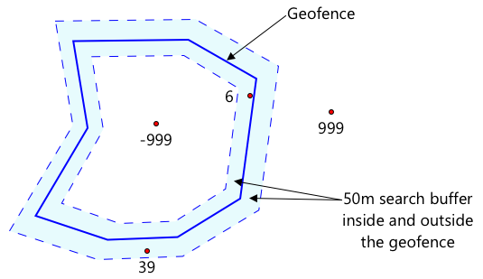

<!--
CO_OP_TRANSLATOR_METADATA:
{
  "original_hash": "078ae664c7b686bf069545e9a5fc95b2",
  "translation_date": "2025-08-25T00:38:36+00:00",
  "source_file": "3-transport/lessons/4-geofences/README.md",
  "language_code": "fr"
}
-->
# Clôtures géographiques


> Illustration par [Nitya Narasimhan](https://github.com/nitya). Cliquez sur l'image pour une version plus grande.

Cette vidéo donne un aperçu des clôtures géographiques et de leur utilisation dans Azure Maps, des sujets qui seront abordés dans cette leçon :

[](https://www.youtube.com/watch?v=nsrgYhaYNVY)

> 🎥 Cliquez sur l'image ci-dessus pour regarder une vidéo

## Quiz avant la leçon

[Quiz avant la leçon](https://black-meadow-040d15503.1.azurestaticapps.net/quiz/27)

## Introduction

Dans les 3 dernières leçons, vous avez utilisé l'IoT pour localiser les camions transportant vos produits de votre ferme à un centre de traitement. Vous avez capturé des données GPS, les avez envoyées dans le cloud pour les stocker, et les avez visualisées sur une carte. La prochaine étape pour améliorer l'efficacité de votre chaîne d'approvisionnement est de recevoir une alerte lorsqu'un camion est sur le point d'arriver au centre de traitement, afin que l'équipe chargée du déchargement puisse se préparer avec des chariots élévateurs et d'autres équipements dès l'arrivée du véhicule. Cela permet un déchargement rapide, et vous évite de payer un camion et un chauffeur en attente.

Dans cette leçon, vous apprendrez ce que sont les clôtures géographiques - des zones géospatiales définies, comme une zone située à moins de 2 km en voiture d'un centre de traitement - et comment tester si des coordonnées GPS se trouvent à l'intérieur ou à l'extérieur d'une clôture géographique, afin de savoir si votre capteur GPS est arrivé ou a quitté une zone.

Dans cette leçon, nous aborderons :

* [Qu'est-ce qu'une clôture géographique](../../../../../3-transport/lessons/4-geofences)
* [Définir une clôture géographique](../../../../../3-transport/lessons/4-geofences)
* [Tester des points par rapport à une clôture géographique](../../../../../3-transport/lessons/4-geofences)
* [Utiliser des clôtures géographiques dans du code sans serveur](../../../../../3-transport/lessons/4-geofences)

> 🗑 C'est la dernière leçon de ce projet, donc après avoir terminé cette leçon et l'exercice, n'oubliez pas de nettoyer vos services cloud. Vous aurez besoin des services pour terminer l'exercice, alors assurez-vous de le faire en premier.
>
> Consultez [le guide de nettoyage de votre projet](../../../clean-up.md) si nécessaire pour des instructions sur la façon de procéder.

## Qu'est-ce qu'une clôture géographique

Une clôture géographique est un périmètre virtuel pour une région géographique réelle. Les clôtures géographiques peuvent être des cercles définis par un point et un rayon (par exemple, un cercle de 100 m autour d'un bâtiment), ou un polygone couvrant une zone comme une zone scolaire, les limites d'une ville, ou un campus universitaire ou d'entreprise.


> 💁 Vous avez peut-être déjà utilisé des clôtures géographiques sans le savoir. Si vous avez défini un rappel dans l'application Rappels d'iOS ou Google Keep basé sur un emplacement, vous avez utilisé une clôture géographique. Ces applications configurent une clôture géographique en fonction de l'emplacement donné et vous alertent lorsque votre téléphone entre dans la clôture.

Il existe de nombreuses raisons pour lesquelles vous pourriez vouloir savoir si un véhicule se trouve à l'intérieur ou à l'extérieur d'une clôture géographique :

* Préparation au déchargement - recevoir une notification qu'un véhicule est arrivé sur le site permet à une équipe de se préparer pour décharger le véhicule, réduisant ainsi le temps d'attente du véhicule. Cela peut permettre à un chauffeur de faire plus de livraisons en une journée avec moins de temps d'attente.
* Conformité fiscale - certains pays, comme la Nouvelle-Zélande, imposent des taxes routières pour les véhicules diesel en fonction du poids du véhicule lorsqu'il circule uniquement sur les routes publiques. L'utilisation de clôtures géographiques permet de suivre les kilomètres parcourus sur les routes publiques par opposition aux routes privées sur des sites tels que des fermes ou des zones forestières.
* Surveillance des vols - si un véhicule doit rester dans une certaine zone, comme une ferme, et qu'il quitte la clôture géographique, il pourrait avoir été volé.
* Conformité aux emplacements - certaines parties d'un site de travail, d'une ferme ou d'une usine peuvent être interdites à certains véhicules, comme empêcher les véhicules transportant des engrais artificiels et des pesticides d'entrer dans des champs cultivant des produits biologiques. Si une clôture géographique est franchie, alors un véhicule est hors conformité et le chauffeur peut être averti.

✅ Pouvez-vous penser à d'autres utilisations des clôtures géographiques ?

Azure Maps, le service que vous avez utilisé dans la dernière leçon pour visualiser les données GPS, vous permet de définir des clôtures géographiques, puis de tester si un point se trouve à l'intérieur ou à l'extérieur de la clôture.

## Définir une clôture géographique

Les clôtures géographiques sont définies à l'aide de GeoJSON, comme les points ajoutés à la carte dans la leçon précédente. Dans ce cas, au lieu d'être une `FeatureCollection` de valeurs `Point`, il s'agit d'une `FeatureCollection` contenant un `Polygon`.

```json
{
   "type": "FeatureCollection",
   "features": [
     {
       "type": "Feature",
       "geometry": {
         "type": "Polygon",
         "coordinates": [
           [
             [
               -122.13393688201903,
               47.63829579223815
             ],
             [
               -122.13389128446579,
               47.63782047131512
             ],
             [
               -122.13240802288054,
               47.63783312249837
             ],
             [
               -122.13238388299942,
               47.63829037035086
             ],
             [
               -122.13393688201903,
               47.63829579223815
             ]
           ]
         ]
       },
       "properties": {
         "geometryId": "1"
       }
     }
   ]
}
```

Chaque point du polygone est défini comme une paire longitude, latitude dans un tableau, et ces points se trouvent dans un tableau défini comme les `coordinates`. Dans un `Point` de la leçon précédente, les `coordinates` étaient un tableau contenant 2 valeurs, latitude et longitude. Pour un `Polygon`, il s'agit d'un tableau de tableaux contenant 2 valeurs, longitude et latitude.

> 💁 Rappelez-vous, GeoJSON utilise `longitude, latitude` pour les points, et non `latitude, longitude`.

Le tableau des coordonnées du polygone contient toujours une entrée de plus que le nombre de points du polygone, la dernière entrée étant identique à la première, fermant ainsi le polygone. Par exemple, pour un rectangle, il y aurait 5 points.


Dans l'image ci-dessus, il y a un rectangle. Les coordonnées du polygone commencent en haut à gauche à 47,-122, puis se déplacent à droite à 47,-121, puis descendent à 46,-121, puis à gauche à 46,-122, puis remontent au point de départ à 47,-122. Cela donne au polygone 5 points - en haut à gauche, en haut à droite, en bas à droite, en bas à gauche, puis en haut à gauche pour le fermer.

✅ Essayez de créer un polygone GeoJSON autour de votre domicile ou de votre école. Utilisez un outil comme [GeoJSON.io](https://geojson.io/).

### Tâche - définir une clôture géographique

Pour utiliser une clôture géographique dans Azure Maps, elle doit d'abord être téléchargée dans votre compte Azure Maps. Une fois téléchargée, vous obtiendrez un ID unique que vous pourrez utiliser pour tester un point par rapport à la clôture géographique. Pour télécharger des clôtures géographiques dans Azure Maps, vous devez utiliser l'API web de cartes. Vous pouvez appeler l'API web Azure Maps à l'aide d'un outil appelé [curl](https://curl.se).

> 🎓 Curl est un outil en ligne de commande pour effectuer des requêtes vers des points de terminaison web.

1. Si vous utilisez Linux, macOS ou une version récente de Windows 10, vous avez probablement déjà curl installé. Exécutez la commande suivante depuis votre terminal ou ligne de commande pour vérifier :

    ```sh
    curl --version
    ```

    Si vous ne voyez pas d'informations de version pour curl, vous devrez l'installer depuis la [page de téléchargement de curl](https://curl.se/download.html).

    > 💁 Si vous êtes expérimenté avec Postman, vous pouvez l'utiliser à la place si vous préférez.

1. Créez un fichier GeoJSON contenant un polygone. Vous testerez cela à l'aide de votre capteur GPS, alors créez un polygone autour de votre emplacement actuel. Vous pouvez soit en créer un manuellement en modifiant l'exemple GeoJSON donné ci-dessus, soit utiliser un outil comme [GeoJSON.io](https://geojson.io/).

    Le GeoJSON devra contenir une `FeatureCollection`, contenant une `Feature` avec une `geometry` de type `Polygon`.

    Vous **DEVEZ** également ajouter un élément `properties` au même niveau que l'élément `geometry`, et celui-ci doit contenir un `geometryId` :

    ```json
    "properties": {
        "geometryId": "1"
    }
    ```

    Si vous utilisez [GeoJSON.io](https://geojson.io/), vous devrez ajouter manuellement cet élément à l'élément `properties` vide, soit après avoir téléchargé le fichier JSON, soit dans l'éditeur JSON de l'application.

    Ce `geometryId` doit être unique dans ce fichier. Vous pouvez télécharger plusieurs clôtures géographiques en tant que plusieurs `Features` dans la `FeatureCollection` du même fichier GeoJSON, tant que chacune a un `geometryId` différent. Les polygones peuvent avoir le même `geometryId` s'ils sont téléchargés à partir d'un fichier différent à un moment différent.

1. Enregistrez ce fichier sous le nom `geofence.json`, et naviguez jusqu'à l'endroit où il est enregistré dans votre terminal ou console.

1. Exécutez la commande curl suivante pour créer la clôture géographique :

    ```sh
    curl --request POST 'https://atlas.microsoft.com/mapData/upload?api-version=1.0&dataFormat=geojson&subscription-key=<subscription_key>' \
         --header 'Content-Type: application/json' \
         --include \
         --data @geofence.json
    ```

    Remplacez `<subscription_key>` dans l'URL par la clé API de votre compte Azure Maps.

    L'URL est utilisée pour télécharger des données cartographiques via l'API `https://atlas.microsoft.com/mapData/upload`. L'appel inclut un paramètre `api-version` pour spécifier quelle version de l'API Azure Maps utiliser, afin de permettre à l'API d'évoluer tout en maintenant la compatibilité ascendante. Le format des données téléchargées est défini sur `geojson`.

    Cela exécutera la requête POST vers l'API de téléchargement et renverra une liste d'en-têtes de réponse, y compris un en-tête appelé `location`.

    ```output
    content-type: application/json
    location: https://us.atlas.microsoft.com/mapData/operations/1560ced6-3a80-46f2-84b2-5b1531820eab?api-version=1.0
    x-ms-azuremaps-region: West US 2
    x-content-type-options: nosniff
    strict-transport-security: max-age=31536000; includeSubDomains
    x-cache: CONFIG_NOCACHE
    date: Sat, 22 May 2021 21:34:57 GMT
    content-length: 0
    ```

    > 🎓 Lors de l'appel d'un point de terminaison web, vous pouvez passer des paramètres à l'appel en ajoutant un `?` suivi de paires clé-valeur sous la forme `clé=valeur`, en séparant les paires clé-valeur par un `&`.

1. Azure Maps ne traite pas cela immédiatement, vous devrez donc vérifier si la demande de téléchargement est terminée en utilisant l'URL donnée dans l'en-tête `location`. Effectuez une requête GET à cet emplacement pour voir le statut. Vous devrez ajouter votre clé d'abonnement à la fin de l'URL `location` en ajoutant `&subscription-key=<subscription_key>` à la fin, en remplaçant `<subscription_key>` par la clé API de votre compte Azure Maps. Exécutez la commande suivante :

    ```sh
    curl --request GET '<location>&subscription-key=<subscription_key>'
    ```

    Remplacez `<location>` par la valeur de l'en-tête `location`, et `<subscription_key>` par la clé API de votre compte Azure Maps.

1. Vérifiez la valeur de `status` dans la réponse. Si ce n'est pas `Succeeded`, attendez une minute et réessayez.

1. Une fois que le statut revient comme `Succeeded`, regardez le `resourceLocation` dans la réponse. Cela contient des détails sur l'ID unique (connu sous le nom de UDID) pour l'objet GeoJSON. Le UDID est la valeur après `metadata/`, sans inclure le `api-version`. Par exemple, si le `resourceLocation` était :

    ```json
    {
      "resourceLocation": "https://us.atlas.microsoft.com/mapData/metadata/7c3776eb-da87-4c52-ae83-caadf980323a?api-version=1.0"
    }
    ```

    Alors le UDID serait `7c3776eb-da87-4c52-ae83-caadf980323a`.

    Gardez une copie de ce UDID car vous en aurez besoin pour tester la clôture géographique.

## Tester des points par rapport à une clôture géographique

Une fois le polygone téléchargé dans Azure Maps, vous pouvez tester un point pour voir s'il se trouve à l'intérieur ou à l'extérieur de la clôture géographique. Vous faites cela en effectuant une requête API web, en passant le UDID de la clôture géographique, ainsi que la latitude et la longitude du point à tester.

Lorsque vous effectuez cette requête, vous pouvez également passer une valeur appelée `searchBuffer`. Cela indique à l'API Maps le niveau de précision à utiliser pour renvoyer les résultats. La raison en est que le GPS n'est pas parfaitement précis, et parfois les emplacements peuvent être décalés de plusieurs mètres, voire plus. La valeur par défaut pour le `searchBuffer` est de 50 m, mais vous pouvez définir des valeurs de 0 m à 500 m.

Lorsque les résultats sont renvoyés par l'appel API, l'une des parties du résultat est une `distance` mesurée jusqu'au point le plus proche sur le bord de la clôture géographique, avec une valeur positive si le point est à l'extérieur de la clôture géographique, et une valeur négative s'il est à l'intérieur. Si cette distance est inférieure au `searchBuffer`, la distance réelle est renvoyée en mètres, sinon la valeur est 999 ou -999. 999 signifie que le point est à l'extérieur de la clôture géographique de plus que le `searchBuffer`, -999 signifie qu'il est à l'intérieur de la clôture géographique de plus que le `searchBuffer`.



Dans l'image ci-dessus, la clôture géographique a un tampon de recherche de 50 m.

* Un point au centre de la clôture géographique, bien à l'intérieur du tampon de recherche, a une distance de **-999**.
* Un point bien à l'extérieur du tampon de recherche a une distance de **999**.
* Un point à l'intérieur de la clôture géographique et à l'intérieur du tampon de recherche, à 6 m de la clôture géographique, a une distance de **6 m**.
* Un point à l'extérieur de la clôture géographique et à l'intérieur du tampon de recherche, à 39 m de la clôture géographique, a une distance de **39 m**.

Il est important de connaître la distance jusqu'au bord de la clôture géographique, et de combiner cela avec d'autres informations telles que d'autres relevés GPS, la vitesse et les données routières lors de la prise de décisions basées sur la localisation d'un véhicule.

Par exemple, imaginez des relevés GPS montrant qu'un véhicule roulait sur une route qui finit par passer à côté d'une clôture géographique. Si une seule valeur GPS est inexacte et place le véhicule à l'intérieur de la clôture géographique, malgré l'absence d'accès pour les véhicules, alors elle peut être ignorée.


Dans l'image ci-dessus, il y a une géofence couvrant une partie du campus de Microsoft. La ligne rouge montre un camion circulant le long de la 520, avec des cercles indiquant les relevés GPS. La plupart de ces relevés sont précis et suivent la 520, mais un relevé erroné apparaît à l'intérieur de la géofence. Il est impossible que ce relevé soit correct - il n'y a pas de routes permettant au camion de quitter soudainement la 520 pour entrer sur le campus, puis revenir sur la 520. Le code qui vérifie cette géofence devra prendre en compte les relevés précédents avant d'agir sur les résultats du test de la géofence.

✅ Quelles données supplémentaires auriez-vous besoin de vérifier pour déterminer si un relevé GPS peut être considéré comme correct ?

### Tâche - tester des points par rapport à une géofence

1. Commencez par construire l'URL pour la requête de l'API web. Le format est :

    ```output
    https://atlas.microsoft.com/spatial/geofence/json?api-version=1.0&deviceId=gps-sensor&subscription-key=<subscription-key>&udid=<UDID>&lat=<lat>&lon=<lon>
    ```

    Remplacez `<subscription_key>` par la clé API de votre compte Azure Maps.

    Remplacez `<UDID>` par l'UDID de la géofence de la tâche précédente.

    Remplacez `<lat>` et `<lon>` par la latitude et la longitude que vous souhaitez tester.

    Cette URL utilise l'API `https://atlas.microsoft.com/spatial/geofence/json` pour interroger une géofence définie à l'aide de GeoJSON. Elle cible la version `1.0` de l'API. Le paramètre `deviceId` est requis et doit être le nom de l'appareil d'où proviennent la latitude et la longitude.

    Le tampon de recherche par défaut est de 50 m, et vous pouvez le modifier en passant un paramètre supplémentaire `searchBuffer=<distance>`, en définissant `<distance>` comme la distance du tampon de recherche en mètres, entre 0 et 500.

1. Utilisez curl pour effectuer une requête GET à cette URL :

    ```sh
    curl --request GET '<URL>'
    ```

    > 💁 Si vous obtenez un code de réponse `BadRequest`, avec une erreur :
    >
    > ```output
    > Invalid GeoJSON: All feature properties should contain a geometryId, which is used for identifying the geofence.
    > ```
    >
    > alors votre GeoJSON manque de la section `properties` avec le `geometryId`. Vous devrez corriger votre GeoJSON, puis répéter les étapes ci-dessus pour le recharger et obtenir un nouvel UDID.

1. La réponse contiendra une liste de `geometries`, une pour chaque polygone défini dans le GeoJSON utilisé pour créer la géofence. Chaque géométrie comporte 3 champs d'intérêt : `distance`, `nearestLat` et `nearestLon`.

    ```output
    {
        "geometries": [
            {
                "deviceId": "gps-sensor",
                "udId": "7c3776eb-da87-4c52-ae83-caadf980323a",
                "geometryId": "1",
                "distance": 999.0,
                "nearestLat": 47.645875,
                "nearestLon": -122.142713
            }
        ],
        "expiredGeofenceGeometryId": [],
        "invalidPeriodGeofenceGeometryId": []
    }
    ```

    * `nearestLat` et `nearestLon` sont la latitude et la longitude d'un point sur le bord de la géofence le plus proche de l'emplacement testé.

    * `distance` est la distance entre l'emplacement testé et le point le plus proche sur le bord de la géofence. Les nombres négatifs signifient à l'intérieur de la géofence, les nombres positifs à l'extérieur. Cette valeur sera inférieure à 50 (le tampon de recherche par défaut), ou 999.

1. Répétez cette opération plusieurs fois avec des emplacements à l'intérieur et à l'extérieur de la géofence.

## Utiliser des géofences depuis du code serverless

Vous pouvez maintenant ajouter un nouveau déclencheur à votre application Functions pour tester les données GPS des événements IoT Hub par rapport à la géofence.

### Groupes de consommateurs

Comme vous vous en souvenez des leçons précédentes, l'IoT Hub vous permet de rejouer les événements reçus par le hub mais non traités. Mais que se passe-t-il si plusieurs déclencheurs se connectent ? Comment saura-t-il lequel a traité quels événements ?

La réponse est qu'il ne peut pas ! À la place, vous pouvez définir plusieurs connexions distinctes pour lire les événements, et chacune peut gérer la relecture des messages non lus. Ces connexions sont appelées *groupes de consommateurs*. Lorsque vous vous connectez au point de terminaison, vous pouvez spécifier le groupe de consommateurs auquel vous souhaitez vous connecter. Chaque composant de votre application se connectera à un groupe de consommateurs différent.


En théorie, jusqu'à 5 applications peuvent se connecter à chaque groupe de consommateurs, et elles recevront toutes les messages lorsqu'ils arriveront. Il est recommandé de n'avoir qu'une seule application accédant à chaque groupe de consommateurs pour éviter le traitement en double des messages et garantir qu'au redémarrage, tous les messages en file d'attente sont correctement traités. Par exemple, si vous lancez votre application Functions localement tout en l'exécutant dans le cloud, elles traiteront toutes les deux les messages, ce qui entraînera des blobs en double stockés dans le compte de stockage.

Si vous examinez le fichier `function.json` pour le déclencheur IoT Hub que vous avez créé dans une leçon précédente, vous verrez le groupe de consommateurs dans la section de liaison du déclencheur Event Hub :

```json
"consumerGroup": "$Default"
```

Lorsque vous créez un IoT Hub, le groupe de consommateurs `$Default` est créé par défaut. Si vous souhaitez ajouter un déclencheur supplémentaire, vous pouvez le faire en utilisant un nouveau groupe de consommateurs.

> 💁 Dans cette leçon, vous utiliserez une fonction différente pour tester la géofence de celle utilisée pour stocker les données GPS. Cela permet de montrer comment utiliser les groupes de consommateurs et de séparer le code pour le rendre plus lisible et compréhensible. Dans une application de production, il existe de nombreuses façons d'architecturer cela - en mettant les deux dans une seule fonction, en utilisant un déclencheur sur le compte de stockage pour exécuter une fonction vérifiant la géofence, ou en utilisant plusieurs fonctions. Il n'y a pas de "bonne méthode", cela dépend du reste de votre application et de vos besoins.

### Tâche - créer un nouveau groupe de consommateurs

1. Exécutez la commande suivante pour créer un nouveau groupe de consommateurs appelé `geofence` pour votre IoT Hub :

    ```sh
    az iot hub consumer-group create --name geofence \
                                     --hub-name <hub_name>
    ```

    Remplacez `<hub_name>` par le nom que vous avez utilisé pour votre IoT Hub.

1. Si vous souhaitez voir tous les groupes de consommateurs pour un IoT Hub, exécutez la commande suivante :

    ```sh
    az iot hub consumer-group list --output table \
                                   --hub-name <hub_name>
    ```

    Remplacez `<hub_name>` par le nom que vous avez utilisé pour votre IoT Hub. Cela listera tous les groupes de consommateurs.

    ```output
    Name      ResourceGroup
    --------  ---------------
    $Default  gps-sensor
    geofence  gps-sensor
    ```

> 💁 Lorsque vous avez exécuté le moniteur d'événements IoT Hub dans une leçon précédente, il s'est connecté au groupe de consommateurs `$Default`. C'est pourquoi vous ne pouvez pas exécuter le moniteur d'événements et un déclencheur d'événements. Si vous souhaitez exécuter les deux, vous pouvez utiliser d'autres groupes de consommateurs pour toutes vos applications Functions, et conserver `$Default` pour le moniteur d'événements.

### Tâche - créer un nouveau déclencheur IoT Hub

1. Ajoutez un nouveau déclencheur d'événements IoT Hub à votre application `gps-trigger` que vous avez créée dans une leçon précédente. Appelez cette fonction `geofence-trigger`.

    > ⚠️ Vous pouvez vous référer [aux instructions pour créer un déclencheur d'événements IoT Hub du projet 2, leçon 5 si nécessaire](../../../2-farm/lessons/5-migrate-application-to-the-cloud/README.md#create-an-iot-hub-event-trigger).

1. Configurez la chaîne de connexion IoT Hub dans le fichier `function.json`. Le fichier `local.settings.json` est partagé entre tous les déclencheurs de l'application Functions.

1. Mettez à jour la valeur de `consumerGroup` dans le fichier `function.json` pour référencer le nouveau groupe de consommateurs `geofence` :

    ```json
    "consumerGroup": "geofence"
    ```

1. Vous devrez utiliser la clé d'abonnement de votre compte Azure Maps dans ce déclencheur, alors ajoutez une nouvelle entrée au fichier `local.settings.json` appelée `MAPS_KEY`.

1. Exécutez l'application Functions pour vérifier qu'elle se connecte et traite les messages. Le déclencheur `iot-hub-trigger` de la leçon précédente s'exécutera également et téléversera des blobs dans le stockage.

    > Pour éviter les relevés GPS en double dans le stockage blob, vous pouvez arrêter l'application Functions que vous avez exécutée dans le cloud. Pour ce faire, utilisez la commande suivante :
    >
    > ```sh
    > az functionapp stop --resource-group gps-sensor \
    >                     --name <functions_app_name>
    > ```
    >
    > Remplacez `<functions_app_name>` par le nom que vous avez utilisé pour votre application Functions.
    >
    > Vous pouvez la redémarrer plus tard avec la commande suivante :
    >
    > ```sh
    > az functionapp start --resource-group gps-sensor \
    >                     --name <functions_app_name>
    > ```
    >
    > Remplacez `<functions_app_name>` par le nom que vous avez utilisé pour votre application Functions.

### Tâche - tester la géofence depuis le déclencheur

Plus tôt dans cette leçon, vous avez utilisé curl pour interroger une géofence afin de voir si un point se trouvait à l'intérieur ou à l'extérieur. Vous pouvez effectuer une requête web similaire depuis votre déclencheur.

1. Pour interroger la géofence, vous avez besoin de son UDID. Ajoutez une nouvelle entrée au fichier `local.settings.json` appelée `GEOFENCE_UDID` avec cette valeur.

1. Ouvrez le fichier `__init__.py` du nouveau déclencheur `geofence-trigger`.

1. Ajoutez l'import suivant en haut du fichier :

    ```python
    import json
    import os
    import requests
    ```

    Le package `requests` permet de faire des appels API web. Azure Maps n'a pas de SDK Python, vous devez faire des appels API web pour l'utiliser depuis du code Python.

1. Ajoutez les 2 lignes suivantes au début de la méthode `main` pour obtenir la clé d'abonnement Maps :

    ```python
    maps_key = os.environ['MAPS_KEY']
    geofence_udid = os.environ['GEOFENCE_UDID']    
    ```

1. À l'intérieur de la boucle `for event in events`, ajoutez le code suivant pour obtenir la latitude et la longitude de chaque événement :

    ```python
    event_body = json.loads(event.get_body().decode('utf-8'))
    lat = event_body['gps']['lat']
    lon = event_body['gps']['lon']
    ```

    Ce code convertit le JSON du corps de l'événement en un dictionnaire, puis extrait les `lat` et `lon` du champ `gps`.

1. Lorsque vous utilisez `requests`, au lieu de construire une URL longue comme vous l'avez fait avec curl, vous pouvez utiliser uniquement la partie URL et passer les paramètres sous forme de dictionnaire. Ajoutez le code suivant pour définir l'URL à appeler et configurer les paramètres :

    ```python
    url = 'https://atlas.microsoft.com/spatial/geofence/json'

    params = {
        'api-version': 1.0,
        'deviceId': 'gps-sensor',
        'subscription-key': maps_key,
        'udid' : geofence_udid,
        'lat' : lat,
        'lon' : lon
    }
    ```

    Les éléments du dictionnaire `params` correspondront aux paires clé-valeur que vous avez utilisées lors de l'appel de l'API web via curl.

1. Ajoutez les lignes de code suivantes pour appeler l'API web :

    ```python
    response = requests.get(url, params=params)
    response_body = json.loads(response.text)
    ```

    Cela appelle l'URL avec les paramètres et obtient un objet de réponse.

1. Ajoutez le code suivant en dessous :

    ```python
    distance = response_body['geometries'][0]['distance']

    if distance == 999:
        logging.info('Point is outside geofence')
    elif distance > 0:
        logging.info(f'Point is just outside geofence by a distance of {distance}m')
    elif distance == -999:
        logging.info(f'Point is inside geofence')
    else:
        logging.info(f'Point is just inside geofence by a distance of {distance}m')
    ```

    Ce code suppose une seule géométrie et extrait la distance de cette géométrie unique. Il enregistre ensuite différents messages en fonction de la distance.

1. Exécutez ce code. Vous verrez dans les journaux si les coordonnées GPS sont à l'intérieur ou à l'extérieur de la géofence, avec une distance si le point est à moins de 50 m. Essayez ce code avec différentes géofences en fonction de l'emplacement de votre capteur GPS, essayez de déplacer le capteur (par exemple en le connectant au WiFi d'un téléphone mobile ou avec des coordonnées différentes sur l'appareil IoT virtuel) pour voir ce changement.

1. Lorsque vous êtes prêt, déployez ce code dans votre application Functions dans le cloud. N'oubliez pas de déployer les nouveaux paramètres d'application.

    > ⚠️ Vous pouvez vous référer [aux instructions pour téléverser les paramètres d'application du projet 2, leçon 5 si nécessaire](../../../2-farm/lessons/5-migrate-application-to-the-cloud/README.md#task---upload-your-application-settings).

    > ⚠️ Vous pouvez vous référer [aux instructions pour déployer votre application Functions du projet 2, leçon 5 si nécessaire](../../../2-farm/lessons/5-migrate-application-to-the-cloud/README.md#task---deploy-your-functions-app-to-the-cloud).

> 💁 Vous pouvez trouver ce code dans le dossier [code/functions](../../../../../3-transport/lessons/4-geofences/code/functions).

---

## 🚀 Défi

Dans cette leçon, vous avez ajouté une géofence en utilisant un fichier GeoJSON avec un seul polygone. Vous pouvez téléverser plusieurs polygones en même temps, tant qu'ils ont des valeurs `geometryId` différentes dans la section `properties`.

Essayez de téléverser un fichier GeoJSON avec plusieurs polygones et ajustez votre code pour trouver quel polygone est le plus proche ou contient les coordonnées GPS.

## Quiz post-lecture

[Quiz post-lecture](https://black-meadow-040d15503.1.azurestaticapps.net/quiz/28)

## Révision et auto-apprentissage

* Lisez davantage sur les géofences et leurs cas d'utilisation sur la [page Geofencing de Wikipédia](https://en.wikipedia.org/wiki/Geo-fence).
* Lisez davantage sur l'API de géofencing d'Azure Maps dans la [documentation Microsoft Azure Maps Spatial - Get Geofence](https://docs.microsoft.com/rest/api/maps/spatial/getgeofence?WT.mc_id=academic-17441-jabenn).
* Lisez davantage sur les groupes de consommateurs dans la [documentation sur les fonctionnalités et la terminologie d'Azure Event Hubs - Event consumers](https://docs.microsoft.com/azure/event-hubs/event-hubs-features?WT.mc_id=academic-17441-jabenn#event-consumers).

## Devoir

[Envoyer des notifications avec Twilio](assignment.md)

**Avertissement** :  
Ce document a été traduit à l'aide du service de traduction automatique [Co-op Translator](https://github.com/Azure/co-op-translator). Bien que nous nous efforcions d'assurer l'exactitude, veuillez noter que les traductions automatisées peuvent contenir des erreurs ou des inexactitudes. Le document original dans sa langue d'origine doit être considéré comme la source faisant autorité. Pour des informations critiques, il est recommandé de recourir à une traduction humaine professionnelle. Nous déclinons toute responsabilité en cas de malentendus ou d'interprétations erronées résultant de l'utilisation de cette traduction.