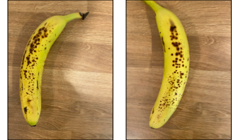

<!--
CO_OP_TRANSLATOR_METADATA:
{
  "original_hash": "f5e63c916d2dd97d58be12aaf76bd9f1",
  "translation_date": "2025-08-24T21:21:51+00:00",
  "source_file": "4-manufacturing/lessons/1-train-fruit-detector/README.md",
  "language_code": "fr"
}
-->
# Former un détecteur de qualité des fruits


> Illustration par [Nitya Narasimhan](https://github.com/nitya). Cliquez sur l'image pour une version agrandie.

Cette vidéo donne un aperçu du service Azure Custom Vision, un service qui sera abordé dans cette leçon.

[](https://www.youtube.com/watch?v=TETcDLJlWR4)

> 🎥 Cliquez sur l'image ci-dessus pour regarder la vidéo

## Quiz avant la leçon

[Quiz avant la leçon](https://black-meadow-040d15503.1.azurestaticapps.net/quiz/29)

## Introduction

La montée récente de l'Intelligence Artificielle (IA) et de l'Apprentissage Automatique (ML) offre une large gamme de capacités aux développeurs d'aujourd'hui. Les modèles de ML peuvent être entraînés à reconnaître différentes choses dans des images, y compris des fruits non mûrs, et cela peut être utilisé dans des dispositifs IoT pour aider à trier les produits, soit lors de la récolte, soit pendant le traitement dans les usines ou les entrepôts.

Dans cette leçon, vous apprendrez la classification d'images - utiliser des modèles de ML pour distinguer des images de différentes choses. Vous apprendrez à entraîner un classificateur d'images pour distinguer les fruits de bonne qualité des fruits de mauvaise qualité, qu'ils soient trop mûrs, abîmés ou pourris.

Dans cette leçon, nous aborderons :

* [Utiliser l'IA et le ML pour trier les aliments](../../../../../4-manufacturing/lessons/1-train-fruit-detector)
* [Classification d'images via l'apprentissage automatique](../../../../../4-manufacturing/lessons/1-train-fruit-detector)
* [Entraîner un classificateur d'images](../../../../../4-manufacturing/lessons/1-train-fruit-detector)
* [Tester votre classificateur d'images](../../../../../4-manufacturing/lessons/1-train-fruit-detector)
* [Réentraîner votre classificateur d'images](../../../../../4-manufacturing/lessons/1-train-fruit-detector)

## Utiliser l'IA et le ML pour trier les aliments

Nourrir la population mondiale est difficile, surtout à un prix qui rend la nourriture abordable pour tous. L'un des coûts les plus importants est la main-d'œuvre, donc les agriculteurs se tournent de plus en plus vers l'automatisation et des outils comme l'IoT pour réduire leurs coûts de main-d'œuvre. La récolte manuelle est intensive (et souvent épuisante), et elle est remplacée par des machines, surtout dans les pays riches. Malgré les économies réalisées grâce à l'utilisation de machines pour la récolte, il y a un inconvénient : la capacité à trier les aliments au moment de la récolte.

Toutes les cultures ne mûrissent pas uniformément. Les tomates, par exemple, peuvent encore avoir des fruits verts sur la vigne alors que la majorité est prête à être récoltée. Bien qu'il soit dommage de récolter ces fruits trop tôt, il est moins coûteux et plus facile pour l'agriculteur de tout récolter avec des machines et de jeter les produits non mûrs par la suite.

✅ Regardez différents fruits ou légumes, soit en train de pousser près de chez vous dans des fermes ou dans votre jardin, soit dans des magasins. Sont-ils tous au même stade de maturité ou voyez-vous des variations ?

L'essor de la récolte automatisée a déplacé le tri des produits de la récolte à l'usine. Les aliments voyagent sur de longs tapis roulants avec des équipes de personnes qui trient les produits en retirant tout ce qui ne répond pas aux normes de qualité requises. La récolte était moins chère grâce aux machines, mais il y avait toujours un coût pour trier manuellement les aliments.


L'évolution suivante a été d'utiliser des machines pour trier, soit intégrées dans la moissonneuse, soit dans les usines de traitement. La première génération de ces machines utilisait des capteurs optiques pour détecter les couleurs, contrôlant des actionneurs pour pousser les tomates vertes dans une poubelle à l'aide de leviers ou de jets d'air, laissant les tomates rouges continuer sur un réseau de tapis roulants.

Dans cette vidéo, alors que les tomates tombent d'un tapis roulant à un autre, les tomates vertes sont détectées et poussées dans une poubelle à l'aide de leviers.

✅ Quelles conditions seraient nécessaires dans une usine ou dans un champ pour que ces capteurs optiques fonctionnent correctement ?

Les dernières évolutions de ces machines de tri tirent parti de l'IA et du ML, utilisant des modèles entraînés à distinguer les bons produits des mauvais, non seulement par des différences évidentes de couleur comme les tomates vertes contre les rouges, mais par des différences plus subtiles d'apparence qui peuvent indiquer une maladie ou des contusions.

## Classification d'images via l'apprentissage automatique

La programmation traditionnelle consiste à prendre des données, appliquer un algorithme à ces données, et obtenir un résultat. Par exemple, dans le dernier projet, vous avez pris des coordonnées GPS et une géofence, appliqué un algorithme fourni par Azure Maps, et obtenu un résultat indiquant si le point était à l'intérieur ou à l'extérieur de la géofence. Vous entrez plus de données, vous obtenez plus de résultats.


L'apprentissage automatique inverse ce processus - vous commencez avec des données et des résultats connus, et l'algorithme d'apprentissage automatique apprend à partir des données. Vous pouvez ensuite prendre cet algorithme entraîné, appelé *modèle d'apprentissage automatique* ou *modèle*, et entrer de nouvelles données pour obtenir de nouveaux résultats.

> 🎓 Le processus par lequel un algorithme d'apprentissage automatique apprend à partir des données est appelé *entraînement*. Les données d'entrée et les résultats connus sont appelés *données d'entraînement*.

Par exemple, vous pourriez donner à un modèle des millions de photos de bananes non mûres comme données d'entraînement, avec le résultat d'entraînement défini comme `non mûr`, et des millions de photos de bananes mûres comme données d'entraînement avec le résultat défini comme `mûr`. L'algorithme de ML créera alors un modèle basé sur ces données. Vous donnez ensuite à ce modèle une nouvelle photo de banane et il prédit si la nouvelle photo représente une banane mûre ou non mûre.

> 🎓 Les résultats des modèles de ML sont appelés *prédictions*


Les modèles de ML ne donnent pas une réponse binaire, mais plutôt des probabilités. Par exemple, un modèle peut recevoir une photo de banane et prédire `mûr` à 99,7% et `non mûr` à 0,3%. Votre code choisirait alors la meilleure prédiction et déciderait que la banane est mûre.

Le modèle de ML utilisé pour détecter des images comme celle-ci est appelé un *classificateur d'images* - il reçoit des images étiquetées, puis classe de nouvelles images en fonction de ces étiquettes.

> 💁 Ceci est une simplification, et il existe de nombreuses autres façons d'entraîner des modèles qui ne nécessitent pas toujours des résultats étiquetés, comme l'apprentissage non supervisé. Si vous souhaitez en savoir plus sur le ML, consultez [ML pour débutants, un programme de 24 leçons sur l'apprentissage automatique](https://aka.ms/ML-beginners).

## Entraîner un classificateur d'images

Pour entraîner avec succès un classificateur d'images, vous avez besoin de millions d'images. Cependant, une fois qu'un classificateur d'images a été entraîné sur des millions ou des milliards d'images variées, vous pouvez le réutiliser et le réentraîner avec un petit ensemble d'images pour obtenir d'excellents résultats, grâce à un processus appelé *apprentissage par transfert*.

> 🎓 L'apprentissage par transfert consiste à transférer l'apprentissage d'un modèle de ML existant vers un nouveau modèle basé sur de nouvelles données.

Une fois qu'un classificateur d'images a été entraîné pour une grande variété d'images, ses mécanismes internes sont excellents pour reconnaître les formes, les couleurs et les motifs. L'apprentissage par transfert permet au modèle d'utiliser ce qu'il a déjà appris pour reconnaître des parties d'images et l'appliquer à de nouvelles images.


Vous pouvez penser à cela comme à des livres de formes pour enfants, où une fois que vous pouvez reconnaître un demi-cercle, un rectangle et un triangle, vous pouvez reconnaître un voilier ou un chat selon la configuration de ces formes. Le classificateur d'images peut reconnaître les formes, et l'apprentissage par transfert lui apprend quelle combinaison représente un bateau ou un chat - ou une banane mûre.

Il existe une large gamme d'outils qui peuvent vous aider à faire cela, y compris des services basés sur le cloud qui peuvent vous aider à entraîner votre modèle, puis à l'utiliser via des API web.

> 💁 L'entraînement de ces modèles nécessite beaucoup de puissance informatique, généralement via des unités de traitement graphique (GPU). Le même matériel spécialisé qui rend les jeux sur votre Xbox incroyables peut également être utilisé pour entraîner des modèles d'apprentissage automatique. En utilisant le cloud, vous pouvez louer du temps sur des ordinateurs puissants équipés de GPU pour entraîner ces modèles, en accédant à la puissance de calcul dont vous avez besoin, juste pour le temps nécessaire.

## Custom Vision

Custom Vision est un outil basé sur le cloud pour entraîner des classificateurs d'images. Il vous permet d'entraîner un classificateur en utilisant seulement un petit nombre d'images. Vous pouvez télécharger des images via un portail web, une API web ou un SDK, en attribuant à chaque image une *étiquette* correspondant à sa classification. Vous entraînez ensuite le modèle et le testez pour voir ses performances. Une fois satisfait du modèle, vous pouvez publier des versions accessibles via une API web ou un SDK.


> 💁 Vous pouvez entraîner un modèle Custom Vision avec seulement 5 images par classification, mais plus il y en a, mieux c'est. Vous obtiendrez de meilleurs résultats avec au moins 30 images.

Custom Vision fait partie d'une gamme d'outils d'IA de Microsoft appelés Cognitive Services. Ce sont des outils d'IA qui peuvent être utilisés soit sans aucun entraînement, soit avec un petit entraînement. Ils incluent la reconnaissance et la traduction vocale, la compréhension du langage et l'analyse d'images. Ces services sont disponibles avec un niveau gratuit dans Azure.

> 💁 Le niveau gratuit est largement suffisant pour créer un modèle, l'entraîner, puis l'utiliser pour le développement. Vous pouvez consulter les limites du niveau gratuit sur la [page des limites et quotas de Custom Vision sur la documentation Microsoft](https://docs.microsoft.com/azure/cognitive-services/custom-vision-service/limits-and-quotas?WT.mc_id=academic-17441-jabenn).

### Tâche - créer une ressource Cognitive Services

Pour utiliser Custom Vision, vous devez d'abord créer deux ressources Cognitive Services dans Azure en utilisant l'Azure CLI, une pour l'entraînement Custom Vision et une pour la prédiction Custom Vision.

1. Créez un groupe de ressources pour ce projet appelé `fruit-quality-detector`.

1. Utilisez la commande suivante pour créer une ressource d'entraînement Custom Vision gratuite :

    ```sh
    az cognitiveservices account create --name fruit-quality-detector-training \
                                        --resource-group fruit-quality-detector \
                                        --kind CustomVision.Training \
                                        --sku F0 \
                                        --yes \
                                        --location <location>
    ```

    Remplacez `<location>` par l'emplacement utilisé lors de la création du groupe de ressources.

    Cela créera une ressource d'entraînement Custom Vision dans votre groupe de ressources. Elle sera appelée `fruit-quality-detector-training` et utilisera le SKU `F0`, qui correspond au niveau gratuit. L'option `--yes` signifie que vous acceptez les termes et conditions des services cognitifs.

> 💁 Utilisez le SKU `S0` si vous avez déjà un compte gratuit utilisant l'un des services cognitifs.

1. Utilisez la commande suivante pour créer une ressource de prédiction Custom Vision gratuite :

    ```sh
    az cognitiveservices account create --name fruit-quality-detector-prediction \
                                        --resource-group fruit-quality-detector \
                                        --kind CustomVision.Prediction \
                                        --sku F0 \
                                        --yes \
                                        --location <location>
    ```

    Remplacez `<location>` par l'emplacement utilisé lors de la création du groupe de ressources.

    Cela créera une ressource de prédiction Custom Vision dans votre groupe de ressources. Elle sera appelée `fruit-quality-detector-prediction` et utilisera le SKU `F0`, qui correspond au niveau gratuit. L'option `--yes` signifie que vous acceptez les termes et conditions des services cognitifs.

### Tâche - créer un projet de classificateur d'images

1. Lancez le portail Custom Vision à [CustomVision.ai](https://customvision.ai), et connectez-vous avec le compte Microsoft utilisé pour votre compte Azure.

1. Suivez la [section "Créer un nouveau projet" du guide de démarrage rapide pour construire un classificateur sur la documentation Microsoft](https://docs.microsoft.com/azure/cognitive-services/custom-vision-service/getting-started-build-a-classifier?WT.mc_id=academic-17441-jabenn#create-a-new-project) pour créer un nouveau projet Custom Vision. L'interface utilisateur peut changer, et cette documentation est toujours la référence la plus à jour.

    Nommez votre projet `fruit-quality-detector`.

    Lors de la création de votre projet, assurez-vous d'utiliser la ressource `fruit-quality-detector-training` que vous avez créée précédemment. Utilisez un type de projet *Classification*, un type de classification *Multiclass*, et le domaine *Food*.

    

✅ Prenez le temps d'explorer l'interface utilisateur Custom Vision pour votre classificateur d'images.

### Tâche - entraîner votre projet de classificateur d'images

Pour entraîner un classificateur d'images, vous aurez besoin de plusieurs photos de fruits, à la fois de bonne et de mauvaise qualité, à étiqueter comme bons ou mauvais, comme une banane mûre et une banane trop mûre.
💁 Ces classificateurs peuvent classer des images de n'importe quoi, donc si vous n'avez pas de fruits de qualité différente sous la main, vous pouvez utiliser deux types de fruits différents, ou des chats et des chiens !
Idéalement, chaque photo devrait uniquement montrer le fruit, avec soit un fond uniforme, soit une grande variété de fonds. Assurez-vous qu'il n'y ait rien dans le fond qui soit spécifique à un fruit mûr ou non mûr.

> 💁 Il est important de ne pas avoir de fonds spécifiques ou d'éléments non liés à ce qui est classifié pour chaque étiquette, sinon le classificateur pourrait se baser uniquement sur le fond. Par exemple, un classificateur pour le cancer de la peau a été entraîné sur des grains de beauté normaux et cancéreux, et les grains de beauté cancéreux avaient tous des règles pour mesurer leur taille. Il s'est avéré que le classificateur était presque 100 % précis pour identifier les règles sur les photos, mais pas les grains de beauté cancéreux.

Les classificateurs d'images fonctionnent à très basse résolution. Par exemple, Custom Vision peut accepter des images d'entraînement et de prédiction jusqu'à 10240x10240, mais entraîne et exécute le modèle sur des images de 227x227. Les images plus grandes sont réduites à cette taille, donc assurez-vous que l'objet que vous classifiez occupe une grande partie de l'image, sinon il pourrait être trop petit dans l'image réduite utilisée par le classificateur.

1. Rassemblez des photos pour votre classificateur. Vous aurez besoin d'au moins 5 photos pour chaque étiquette afin d'entraîner le classificateur, mais plus il y en a, mieux c'est. Vous aurez également besoin de quelques images supplémentaires pour tester le classificateur. Ces images doivent toutes être différentes mais représenter la même chose. Par exemple :

    * En utilisant 2 bananes mûres, prenez plusieurs photos de chacune sous différents angles, en prenant au moins 7 photos (5 pour l'entraînement, 2 pour le test), mais idéalement plus.

        

    * Répétez le même processus avec 2 bananes non mûres.

    Vous devriez avoir au moins 10 images d'entraînement, avec au moins 5 mûres et 5 non mûres, et 4 images de test, 2 mûres et 2 non mûres. Vos images doivent être au format png ou jpeg, et faire moins de 6 Mo. Si vous les créez avec un iPhone, par exemple, elles pourraient être en haute résolution au format HEIC, et devront donc être converties et éventuellement réduites. Plus vous avez d'images, mieux c'est, et vous devriez avoir un nombre similaire de fruits mûrs et non mûrs.

    Si vous n'avez pas à disposition des fruits mûrs et non mûrs, vous pouvez utiliser différents fruits ou tout autre objet disponible. Vous pouvez également trouver des exemples d'images dans le dossier [images](../../../../../4-manufacturing/lessons/1-train-fruit-detector/images) de bananes mûres et non mûres que vous pouvez utiliser.

1. Suivez la [section sur le téléchargement et l'étiquetage des images du guide de démarrage rapide pour créer un classificateur sur la documentation Microsoft](https://docs.microsoft.com/azure/cognitive-services/custom-vision-service/getting-started-build-a-classifier?WT.mc_id=academic-17441-jabenn#upload-and-tag-images) pour télécharger vos images d'entraînement. Étiquetez les fruits mûrs comme `ripe` et les fruits non mûrs comme `unripe`.

    

1. Suivez la [section sur l'entraînement du classificateur du guide de démarrage rapide pour créer un classificateur sur la documentation Microsoft](https://docs.microsoft.com/azure/cognitive-services/custom-vision-service/getting-started-build-a-classifier?WT.mc_id=academic-17441-jabenn#train-the-classifier) pour entraîner le classificateur d'images avec vos images téléchargées.

    Vous aurez le choix du type d'entraînement. Sélectionnez **Entraînement rapide**.

Le classificateur s'entraînera alors. Cela prendra quelques minutes pour terminer l'entraînement.

> 🍌 Si vous décidez de manger vos fruits pendant que le classificateur s'entraîne, assurez-vous d'avoir suffisamment d'images pour les tests au préalable !

## Testez votre classificateur d'images

Une fois votre classificateur entraîné, vous pouvez le tester en lui fournissant une nouvelle image à classer.

### Tâche - testez votre classificateur d'images

1. Suivez la [documentation sur le test de votre modèle sur la documentation Microsoft](https://docs.microsoft.com/azure/cognitive-services/custom-vision-service/test-your-model?WT.mc_id=academic-17441-jabenn#test-your-model) pour tester votre classificateur d'images. Utilisez les images de test que vous avez créées précédemment, et non celles utilisées pour l'entraînement.

    

1. Essayez toutes les images de test dont vous disposez et observez les probabilités.

## Réentraînez votre classificateur d'images

Lorsque vous testez votre classificateur, il se peut qu'il ne donne pas les résultats attendus. Les classificateurs d'images utilisent l'apprentissage automatique pour faire des prédictions sur ce qui se trouve dans une image, en se basant sur des probabilités que certaines caractéristiques d'une image correspondent à une étiquette particulière. Il ne comprend pas ce qui se trouve dans l'image - il ne sait pas ce qu'est une banane ni ce qui différencie une banane d'un bateau. Vous pouvez améliorer votre classificateur en le réentraînant avec des images qu'il a mal classées.

Chaque fois que vous faites une prédiction en utilisant l'option de test rapide, l'image et les résultats sont enregistrés. Vous pouvez utiliser ces images pour réentraîner votre modèle.

### Tâche - réentraînez votre classificateur d'images

1. Suivez la [documentation sur l'utilisation des images prédites pour l'entraînement sur la documentation Microsoft](https://docs.microsoft.com/azure/cognitive-services/custom-vision-service/test-your-model?WT.mc_id=academic-17441-jabenn#use-the-predicted-image-for-training) pour réentraîner votre modèle, en utilisant l'étiquette correcte pour chaque image.

1. Une fois votre modèle réentraîné, testez-le avec de nouvelles images.

---

## 🚀 Défi

Que pensez-vous qu'il se passerait si vous utilisiez une photo de fraise avec un modèle entraîné sur des bananes, ou une photo d'une banane gonflable, ou une personne déguisée en banane, ou même un personnage de dessin animé jaune comme quelqu'un des Simpsons ?

Essayez et voyez quelles sont les prédictions. Vous pouvez trouver des images à tester en utilisant [Bing Image search](https://www.bing.com/images/trending).

## Quiz post-cours

[Quiz post-cours](https://black-meadow-040d15503.1.azurestaticapps.net/quiz/30)

## Révision et auto-apprentissage

* Lorsque vous avez entraîné votre classificateur, vous avez vu des valeurs pour *Précision*, *Rappel* et *AP* qui évaluent le modèle créé. Lisez à propos de ces valeurs en consultant [la section sur l'évaluation du classificateur dans le guide de démarrage rapide pour créer un classificateur sur la documentation Microsoft](https://docs.microsoft.com/azure/cognitive-services/custom-vision-service/getting-started-build-a-classifier?WT.mc_id=academic-17441-jabenn#evaluate-the-classifier).
* Lisez comment améliorer votre classificateur dans [la section sur l'amélioration de votre modèle Custom Vision sur la documentation Microsoft](https://docs.microsoft.com/azure/cognitive-services/custom-vision-service/getting-started-improving-your-classifier?WT.mc_id=academic-17441-jabenn).

## Devoir

[Entraînez votre classificateur pour plusieurs fruits et légumes](assignment.md)

**Avertissement** :  
Ce document a été traduit à l'aide du service de traduction automatique [Co-op Translator](https://github.com/Azure/co-op-translator). Bien que nous nous efforcions d'assurer l'exactitude, veuillez noter que les traductions automatisées peuvent contenir des erreurs ou des inexactitudes. Le document original dans sa langue d'origine doit être considéré comme la source faisant autorité. Pour des informations critiques, il est recommandé de recourir à une traduction humaine professionnelle. Nous déclinons toute responsabilité en cas de malentendus ou d'interprétations erronées résultant de l'utilisation de cette traduction.