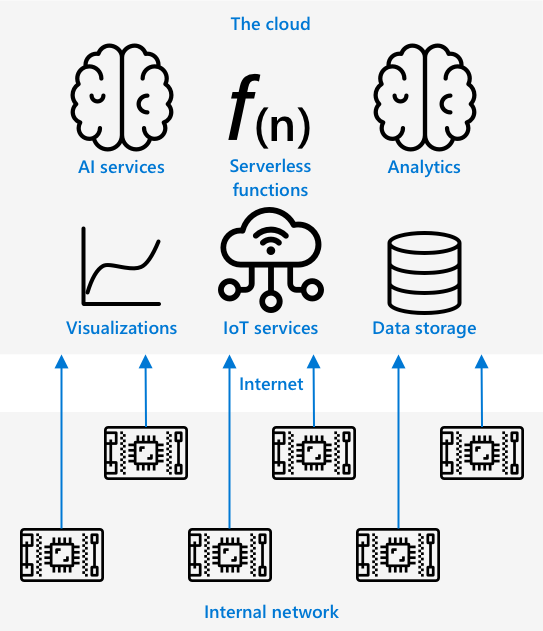
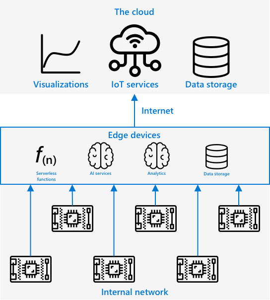

<!--
CO_OP_TRANSLATOR_METADATA:
{
  "original_hash": "2625af24587465c5547ae33d6cc000a5",
  "translation_date": "2025-08-24T21:40:24+00:00",
  "source_file": "4-manufacturing/lessons/3-run-fruit-detector-edge/README.md",
  "language_code": "fr"
}
-->
# Exécutez votre détecteur de fruits en périphérie


> Illustration par [Nitya Narasimhan](https://github.com/nitya). Cliquez sur l'image pour une version agrandie.

Cette vidéo donne un aperçu de l'exécution de classificateurs d'images sur des appareils IoT, le sujet abordé dans cette leçon.

[](https://www.youtube.com/watch?v=_K5fqGLO8us)

## Quiz avant la leçon

[Quiz avant la leçon](https://black-meadow-040d15503.1.azurestaticapps.net/quiz/33)

## Introduction

Dans la dernière leçon, vous avez utilisé votre classificateur d'images pour distinguer les fruits mûrs des fruits non mûrs, en envoyant une image capturée par la caméra de votre appareil IoT via Internet à un service cloud. Ces appels prennent du temps, coûtent de l'argent et, selon le type de données d'image utilisées, peuvent poser des problèmes de confidentialité.

Dans cette leçon, vous apprendrez à exécuter des modèles d'apprentissage automatique (ML) en périphérie - sur des appareils IoT fonctionnant sur votre propre réseau plutôt que dans le cloud. Vous découvrirez les avantages et les inconvénients de l'informatique en périphérie par rapport à l'informatique dans le cloud, comment déployer votre modèle d'IA en périphérie et comment y accéder depuis votre appareil IoT.

Dans cette leçon, nous aborderons :

* [L'informatique en périphérie](../../../../../4-manufacturing/lessons/3-run-fruit-detector-edge)
* [Azure IoT Edge](../../../../../4-manufacturing/lessons/3-run-fruit-detector-edge)
* [Enregistrer un appareil IoT Edge](../../../../../4-manufacturing/lessons/3-run-fruit-detector-edge)
* [Configurer un appareil IoT Edge](../../../../../4-manufacturing/lessons/3-run-fruit-detector-edge)
* [Exporter votre modèle](../../../../../4-manufacturing/lessons/3-run-fruit-detector-edge)
* [Préparer votre conteneur pour le déploiement](../../../../../4-manufacturing/lessons/3-run-fruit-detector-edge)
* [Déployer votre conteneur](../../../../../4-manufacturing/lessons/3-run-fruit-detector-edge)
* [Utiliser votre appareil IoT Edge](../../../../../4-manufacturing/lessons/3-run-fruit-detector-edge)

## L'informatique en périphérie

L'informatique en périphérie consiste à traiter les données IoT aussi près que possible de l'endroit où elles sont générées. Au lieu de traiter ces données dans le cloud, ce traitement est déplacé à la périphérie du cloud - sur votre réseau interne.



Dans les leçons précédentes, vos appareils collectaient des données et les envoyaient au cloud pour analyse, en exécutant des fonctions sans serveur ou des modèles d'IA dans le cloud.



L'informatique en périphérie consiste à déplacer certains services cloud hors du cloud et sur des ordinateurs fonctionnant sur le même réseau que les appareils IoT, ne communiquant avec le cloud que si nécessaire. Par exemple, vous pouvez exécuter des modèles d'IA sur des appareils en périphérie pour analyser la maturité des fruits, et n'envoyer que des analyses au cloud, comme le nombre de fruits mûrs par rapport aux fruits non mûrs.

✅ Réfléchissez aux applications IoT que vous avez développées jusqu'à présent. Quelles parties pourraient être déplacées en périphérie ?

### Avantages

Les avantages de l'informatique en périphérie sont :

1. **Vitesse** - l'informatique en périphérie est idéale pour les données sensibles au temps, car les actions sont effectuées sur le même réseau que l'appareil, plutôt que de faire des appels via Internet. Cela permet des vitesses plus élevées, car les réseaux internes peuvent fonctionner à des vitesses beaucoup plus rapides que les connexions Internet, avec des données parcourant une distance beaucoup plus courte.

    > 💁 Bien que les câbles optiques soient utilisés pour les connexions Internet, permettant aux données de voyager à la vitesse de la lumière, les données peuvent prendre du temps pour parcourir le monde jusqu'aux fournisseurs de cloud. Par exemple, si vous envoyez des données d'Europe vers des services cloud aux États-Unis, il faut au moins 28 ms pour que les données traversent l'Atlantique dans un câble optique, sans compter le temps nécessaire pour acheminer les données jusqu'au câble transatlantique, les convertir de signaux électriques en signaux lumineux et vice-versa de l'autre côté, puis du câble optique au fournisseur de cloud.

    L'informatique en périphérie nécessite également moins de trafic réseau, réduisant le risque de ralentissement des données en raison de la congestion sur la bande passante limitée disponible pour une connexion Internet.

1. **Accessibilité à distance** - l'informatique en périphérie fonctionne lorsque vous avez une connectivité limitée ou inexistante, ou lorsque la connectivité est trop coûteuse pour être utilisée en continu. Par exemple, dans des zones de catastrophe humanitaire où l'infrastructure est limitée, ou dans des pays en développement.

1. **Coûts réduits** - collecter, stocker, analyser des données et déclencher des actions sur un appareil en périphérie réduit l'utilisation des services cloud, ce qui peut réduire le coût global de votre application IoT. On observe une augmentation récente des appareils conçus pour l'informatique en périphérie, comme les cartes accélératrices d'IA telles que le [Jetson Nano de NVIDIA](https://developer.nvidia.com/embedded/jetson-nano-developer-kit), capables d'exécuter des charges de travail d'IA à l'aide de matériel basé sur GPU pour moins de 100 USD.

1. **Confidentialité et sécurité** - avec l'informatique en périphérie, les données restent sur votre réseau et ne sont pas téléchargées dans le cloud. Cela est souvent préférable pour les informations sensibles et identifiables personnellement, d'autant plus que les données n'ont pas besoin d'être stockées après analyse, ce qui réduit considérablement le risque de fuites de données. Des exemples incluent les données médicales et les images de caméras de sécurité.

1. **Gestion des appareils non sécurisés** - si vous avez des appareils avec des failles de sécurité connues que vous ne souhaitez pas connecter directement à votre réseau ou à Internet, vous pouvez les connecter à un réseau séparé via un appareil IoT Edge passerelle. Cet appareil en périphérie peut également avoir une connexion à votre réseau plus large ou à Internet, et gérer les flux de données dans les deux sens.

1. **Support pour les appareils incompatibles** - si vous avez des appareils qui ne peuvent pas se connecter à IoT Hub, par exemple des appareils qui ne peuvent se connecter qu'en utilisant des connexions HTTP ou des appareils qui n'ont que le Bluetooth, vous pouvez utiliser un appareil IoT Edge comme passerelle pour transmettre les messages à IoT Hub.

✅ Faites des recherches : Quels autres avantages l'informatique en périphérie pourrait-elle offrir ?

### Inconvénients

Il existe des inconvénients à l'informatique en périphérie, où le cloud peut être une option préférable :

1. **Échelle et flexibilité** - le cloud peut s'adapter aux besoins réseau et de données en temps réel en ajoutant ou réduisant des serveurs et d'autres ressources. Ajouter plus d'ordinateurs en périphérie nécessite d'ajouter manuellement des appareils.

1. **Fiabilité et résilience** - le cloud offre plusieurs serveurs souvent situés dans plusieurs endroits pour la redondance et la récupération après sinistre. Obtenir le même niveau de redondance en périphérie nécessite de gros investissements et beaucoup de travail de configuration.

1. **Maintenance** - les fournisseurs de services cloud assurent la maintenance et les mises à jour des systèmes.

✅ Faites des recherches : Quels autres inconvénients l'informatique en périphérie pourrait-elle avoir ?

Les inconvénients sont en réalité l'opposé des avantages du cloud - vous devez construire et gérer ces appareils vous-même, plutôt que de vous appuyer sur l'expertise et l'échelle des fournisseurs de cloud.

Certains risques sont atténués par la nature même de l'informatique en périphérie. Par exemple, si vous avez un appareil en périphérie fonctionnant dans une usine collectant des données de machines, vous n'avez pas besoin de penser à certains scénarios de récupération après sinistre. Si l'usine perd l'électricité, vous n'avez pas besoin d'un appareil de secours, car les machines qui génèrent les données que l'appareil en périphérie traite seront également sans électricité.

Pour les systèmes IoT, vous voudrez souvent un mélange d'informatique en périphérie et dans le cloud, en tirant parti de chaque service en fonction des besoins du système, de ses utilisateurs et de ses mainteneurs.

## Azure IoT Edge


Azure IoT Edge est un service qui peut vous aider à déplacer des charges de travail hors du cloud vers la périphérie. Vous configurez un appareil comme appareil en périphérie, et depuis le cloud, vous pouvez déployer du code sur cet appareil. Cela vous permet de combiner les capacités du cloud et de la périphérie.

> 🎓 *Charges de travail* est un terme désignant tout service effectuant un travail, comme des modèles d'IA, des applications ou des fonctions sans serveur.

Par exemple, vous pouvez entraîner un classificateur d'images dans le cloud, puis le déployer sur un appareil en périphérie. Votre appareil IoT envoie alors des images à l'appareil en périphérie pour classification, plutôt que d'envoyer les images via Internet. Si vous devez déployer une nouvelle version du modèle, vous pouvez l'entraîner dans le cloud et utiliser IoT Edge pour mettre à jour le modèle sur l'appareil en périphérie.

> 🎓 Les logiciels déployés sur IoT Edge sont appelés *modules*. Par défaut, IoT Edge exécute des modules qui communiquent avec IoT Hub, tels que les modules `edgeAgent` et `edgeHub`. Lorsque vous déployez un classificateur d'images, celui-ci est déployé comme un module supplémentaire.

IoT Edge est intégré à IoT Hub, vous permettant de gérer les appareils en périphérie avec le même service que vous utiliseriez pour gérer les appareils IoT, avec le même niveau de sécurité.

IoT Edge exécute du code à partir de *conteneurs* - des applications autonomes exécutées en isolation des autres applications sur votre ordinateur. Lorsqu'un conteneur est exécuté, il agit comme un ordinateur distinct fonctionnant à l'intérieur de votre ordinateur, avec ses propres logiciels, services et applications. La plupart du temps, les conteneurs ne peuvent accéder à rien sur votre ordinateur, sauf si vous choisissez de partager des éléments comme un dossier avec le conteneur. Le conteneur expose ensuite des services via un port ouvert auquel vous pouvez vous connecter ou exposer à votre réseau.


Par exemple, vous pouvez avoir un conteneur avec un site web fonctionnant sur le port 80, le port HTTP par défaut, et vous pouvez ensuite l'exposer depuis votre ordinateur également sur le port 80.

✅ Faites des recherches : Lisez sur les conteneurs et des services comme Docker ou Moby.

Vous pouvez utiliser Custom Vision pour télécharger des classificateurs d'images et les déployer sous forme de conteneurs, soit directement sur un appareil, soit via IoT Edge. Une fois qu'ils fonctionnent dans un conteneur, ils peuvent être accessibles en utilisant la même API REST que la version cloud, mais avec le point de terminaison pointant vers l'appareil en périphérie exécutant le conteneur.

## Enregistrer un appareil IoT Edge

Pour utiliser un appareil IoT Edge, il doit être enregistré dans IoT Hub.

### Tâche - Enregistrer un appareil IoT Edge

1. Créez un IoT Hub dans le groupe de ressources `fruit-quality-detector`. Donnez-lui un nom unique basé sur `fruit-quality-detector`.

1. Enregistrez un appareil IoT Edge appelé `fruit-quality-detector-edge` dans votre IoT Hub. La commande pour cela est similaire à celle utilisée pour enregistrer un appareil non-edge, sauf que vous passez l'option `--edge-enabled`.

    ```sh
    az iot hub device-identity create --edge-enabled \
                                      --device-id fruit-quality-detector-edge \
                                      --hub-name <hub_name>
    ```

    Remplacez `<hub_name>` par le nom de votre IoT Hub.

1. Obtenez la chaîne de connexion pour votre appareil en utilisant la commande suivante :

    ```sh
    az iot hub device-identity connection-string show --device-id fruit-quality-detector-edge \
                                                      --output table \
                                                      --hub-name <hub_name>
    ```

    Remplacez `<hub_name>` par le nom de votre IoT Hub.

    Prenez une copie de la chaîne de connexion affichée dans la sortie.

## Configurer un appareil IoT Edge

Une fois que vous avez créé l'enregistrement de l'appareil en périphérie dans votre IoT Hub, vous pouvez configurer l'appareil en périphérie.

### Tâche - Installer et démarrer le runtime IoT Edge

**Le runtime IoT Edge ne fonctionne qu'avec des conteneurs Linux.** Il peut être exécuté sur Linux ou sur Windows en utilisant des machines virtuelles Linux.

* Si vous utilisez un Raspberry Pi comme appareil IoT, celui-ci exécute une version de Linux prise en charge et peut héberger le runtime IoT Edge. Suivez le [guide d'installation d'Azure IoT Edge pour Linux sur la documentation Microsoft](https://docs.microsoft.com/azure/iot-edge/how-to-install-iot-edge?WT.mc_id=academic-17441-jabenn) pour installer IoT Edge et définir la chaîne de connexion.

    > 💁 Rappelez-vous, Raspberry Pi OS est une variante de Debian Linux.

* Si vous n'utilisez pas de Raspberry Pi mais avez un ordinateur Linux, vous pouvez exécuter le runtime IoT Edge. Suivez le [guide d'installation d'Azure IoT Edge pour Linux sur la documentation Microsoft](https://docs.microsoft.com/azure/iot-edge/how-to-install-iot-edge?WT.mc_id=academic-17441-jabenn) pour installer IoT Edge et définir la chaîne de connexion.

* Si vous utilisez Windows, vous pouvez installer le runtime IoT Edge dans une machine virtuelle Linux en suivant la section [installer et démarrer le runtime IoT Edge du guide de démarrage rapide pour déployer votre premier module IoT Edge sur un appareil Windows dans la documentation Microsoft](https://docs.microsoft.com/azure/iot-edge/quickstart?WT.mc_id=academic-17441-jabenn#install-and-start-the-iot-edge-runtime). Vous pouvez arrêter lorsque vous atteignez la section *Déployer un module*.

* Si vous utilisez macOS, vous pouvez créer une machine virtuelle (VM) dans le cloud pour l'utiliser comme appareil IoT Edge. Ce sont des ordinateurs que vous pouvez créer dans le cloud et auxquels vous pouvez accéder via Internet. Vous pouvez créer une VM Linux avec IoT Edge installé. Suivez le [guide de création d'une machine virtuelle exécutant IoT Edge](vm-iotedge.md) pour des instructions sur la façon de procéder.

## Exporter votre modèle

Pour exécuter le classificateur en périphérie, il doit être exporté depuis Custom Vision. Custom Vision peut générer deux types de modèles - des modèles standards et des modèles compacts. Les modèles compacts utilisent diverses techniques pour réduire la taille du modèle, le rendant suffisamment petit pour être téléchargé et déployé sur des appareils IoT.

Lorsque vous avez créé le classificateur d'images, vous avez utilisé le domaine *Food*, une version du modèle optimisée pour l'entraînement sur des images alimentaires. Dans Custom Vision, vous changez le domaine de votre projet, en utilisant vos données d'entraînement pour entraîner un nouveau modèle avec le nouveau domaine. Tous les domaines pris en charge par Custom Vision sont disponibles en versions standard et compactes.

### Tâche - Entraîner votre modèle en utilisant le domaine Food (compact)
1. Lancez le portail Custom Vision sur [CustomVision.ai](https://customvision.ai) et connectez-vous si ce n'est pas déjà fait. Ensuite, ouvrez votre projet `fruit-quality-detector`.

1. Sélectionnez le bouton **Paramètres** (l'icône ⚙).

1. Dans la liste *Domaines*, sélectionnez *Food (compact)*.

1. Sous *Capacités d'exportation*, assurez-vous que *Plateformes de base (Tensorflow, CoreML, ONNX, ...)* est sélectionné.

1. En bas de la page des paramètres, sélectionnez **Enregistrer les modifications**.

1. Réentraînez le modèle avec le bouton **Entraîner**, en sélectionnant *Entraînement rapide*.

### Tâche - exporter votre modèle

Une fois le modèle entraîné, il doit être exporté sous forme de conteneur.

1. Sélectionnez l'onglet **Performance**, et trouvez votre dernière itération entraînée avec le domaine compact.

1. Cliquez sur le bouton **Exporter** en haut.

1. Sélectionnez **DockerFile**, puis choisissez une version correspondant à votre appareil edge :

    * Si vous exécutez IoT Edge sur un ordinateur Linux, un ordinateur Windows ou une machine virtuelle, sélectionnez la version *Linux*.
    * Si vous exécutez IoT Edge sur un Raspberry Pi, sélectionnez la version *ARM (Raspberry Pi 3)*.

    
> 🎓 Docker est l'un des outils les plus populaires pour gérer les conteneurs, et un DockerFile est un ensemble d'instructions pour configurer le conteneur.

1. Cliquez sur **Exporter** pour que Custom Vision crée les fichiers nécessaires, puis sur **Télécharger** pour les télécharger dans un fichier zip.

1. Enregistrez les fichiers sur votre ordinateur, puis décompressez le dossier.

## Préparer votre conteneur pour le déploiement


Une fois que vous avez téléchargé votre modèle, il doit être construit dans un conteneur, puis poussé vers un registre de conteneurs - un emplacement en ligne où vous pouvez stocker des conteneurs. IoT Edge peut ensuite télécharger le conteneur depuis le registre et le pousser vers votre appareil.


Le registre de conteneurs que vous utiliserez pour cette leçon est Azure Container Registry. Ce n'est pas un service gratuit, donc pour économiser de l'argent, assurez-vous de [nettoyer votre projet](../../../clean-up.md) une fois terminé.

> 💁 Vous pouvez consulter les coûts d'utilisation d'un registre de conteneurs Azure sur la [page de tarification Azure Container Registry](https://azure.microsoft.com/pricing/details/container-registry/?WT.mc_id=academic-17441-jabenn).

### Tâche - installer Docker

Pour construire et déployer le classificateur, vous devrez peut-être installer [Docker](https://www.docker.com/).

Vous n'aurez besoin de le faire que si vous prévoyez de construire votre conteneur sur un appareil différent de celui sur lequel vous avez installé IoT Edge - lors de l'installation de IoT Edge, Docker est installé pour vous.

1. Si vous construisez le conteneur Docker sur un appareil différent de votre appareil IoT Edge, suivez les instructions d'installation de Docker sur la [page d'installation de Docker](https://www.docker.com/products/docker-desktop) pour installer Docker Desktop ou le moteur Docker. Assurez-vous qu'il fonctionne après l'installation.

### Tâche - créer une ressource de registre de conteneurs

1. Exécutez la commande suivante depuis votre terminal ou invite de commande pour créer une ressource Azure Container Registry :

    ```sh
    az acr create --resource-group fruit-quality-detector \
                  --sku Basic \
                  --name <Container registry name>
    ```

    Remplacez `<Container registry name>` par un nom unique pour votre registre de conteneurs, en utilisant uniquement des lettres et des chiffres. Basez ce nom sur `fruitqualitydetector`. Ce nom devient une partie de l'URL pour accéder au registre de conteneurs, donc il doit être globalement unique.

1. Connectez-vous au registre de conteneurs Azure avec la commande suivante :

    ```sh
    az acr login --name <Container registry name>
    ```

    Remplacez `<Container registry name>` par le nom que vous avez utilisé pour votre registre de conteneurs.

1. Activez le mode administrateur pour le registre de conteneurs afin de générer un mot de passe avec la commande suivante :

    ```sh
    az acr update --admin-enabled true \
                 --name <Container registry name>
    ```

    Remplacez `<Container registry name>` par le nom que vous avez utilisé pour votre registre de conteneurs.

1. Générez des mots de passe pour votre registre de conteneurs avec la commande suivante :

    ```sh
     az acr credential renew --password-name password \
                             --output table \
                             --name <Container registry name>
    ```

    Remplacez `<Container registry name>` par le nom que vous avez utilisé pour votre registre de conteneurs.

    Prenez une copie de la valeur de `PASSWORD`, car vous en aurez besoin plus tard.

### Tâche - construire votre conteneur

Ce que vous avez téléchargé depuis Custom Vision était un DockerFile contenant des instructions sur la façon dont le conteneur doit être construit, ainsi que du code d'application qui sera exécuté à l'intérieur du conteneur pour héberger votre modèle Custom Vision, ainsi qu'une API REST pour l'appeler. Vous pouvez utiliser Docker pour construire un conteneur tagué à partir du DockerFile, puis le pousser vers votre registre de conteneurs.

> 🎓 Les conteneurs reçoivent un tag qui définit un nom et une version pour eux. Lorsque vous devez mettre à jour un conteneur, vous pouvez le construire avec le même tag mais une version plus récente.

1. Ouvrez votre terminal ou invite de commande et naviguez vers le modèle décompressé que vous avez téléchargé depuis Custom Vision.

1. Exécutez la commande suivante pour construire et taguer l'image :

    ```sh
    docker build --platform <platform> -t <Container registry name>.azurecr.io/classifier:v1 .
    ```

    Remplacez `<platform>` par la plateforme sur laquelle ce conteneur sera exécuté. Si vous exécutez IoT Edge sur un Raspberry Pi, définissez cette valeur sur `linux/armhf`, sinon définissez-la sur `linux/amd64`.

    > 💁 Si vous exécutez cette commande depuis l'appareil sur lequel vous exécutez IoT Edge, comme depuis votre Raspberry Pi, vous pouvez omettre la partie `--platform <platform>` car elle par défaut à la plateforme actuelle.

    Remplacez `<Container registry name>` par le nom que vous avez utilisé pour votre registre de conteneurs.

    > 💁 Si vous utilisez Linux ou Raspberry Pi OS, vous devrez peut-être utiliser `sudo` pour exécuter cette commande.

    Docker construira l'image, configurant tous les logiciels nécessaires. L'image sera ensuite taguée comme `classifier:v1`.

    ```output
    ➜  d4ccc45da0bb478bad287128e1274c3c.DockerFile.Linux docker build --platform linux/amd64 -t  fruitqualitydetectorjimb.azurecr.io/classifier:v1 .
    [+] Building 102.4s (11/11) FINISHED
     => [internal] load build definition from Dockerfile
     => => transferring dockerfile: 131B
     => [internal] load .dockerignore
     => => transferring context: 2B
     => [internal] load metadata for docker.io/library/python:3.7-slim
     => [internal] load build context
     => => transferring context: 905B
     => [1/6] FROM docker.io/library/python:3.7-slim@sha256:b21b91c9618e951a8cbca5b696424fa5e820800a88b7e7afd66bba0441a764d6
     => => resolve docker.io/library/python:3.7-slim@sha256:b21b91c9618e951a8cbca5b696424fa5e820800a88b7e7afd66bba0441a764d6
     => => sha256:b4d181a07f8025e00e0cb28f1cc14613da2ce26450b80c54aea537fa93cf3bda 27.15MB / 27.15MB
     => => sha256:de8ecf497b753094723ccf9cea8a46076e7cb845f333df99a6f4f397c93c6ea9 2.77MB / 2.77MB
     => => sha256:707b80804672b7c5d8f21e37c8396f319151e1298d976186b4f3b76ead9f10c8 10.06MB / 10.06MB
     => => sha256:b21b91c9618e951a8cbca5b696424fa5e820800a88b7e7afd66bba0441a764d6 1.86kB / 1.86kB
     => => sha256:44073386687709c437586676b572ff45128ff1f1570153c2f727140d4a9accad 1.37kB / 1.37kB
     => => sha256:3d94f0f2ca798607808b771a7766f47ae62a26f820e871dd488baeccc69838d1 8.31kB / 8.31kB
     => => sha256:283715715396fd56d0e90355125fd4ec57b4f0773f306fcd5fa353b998beeb41 233B / 233B
     => => sha256:8353afd48f6b84c3603ea49d204bdcf2a1daada15f5d6cad9cc916e186610a9f 2.64MB / 2.64MB
     => => extracting sha256:b4d181a07f8025e00e0cb28f1cc14613da2ce26450b80c54aea537fa93cf3bda
     => => extracting sha256:de8ecf497b753094723ccf9cea8a46076e7cb845f333df99a6f4f397c93c6ea9
     => => extracting sha256:707b80804672b7c5d8f21e37c8396f319151e1298d976186b4f3b76ead9f10c8
     => => extracting sha256:283715715396fd56d0e90355125fd4ec57b4f0773f306fcd5fa353b998beeb41
     => => extracting sha256:8353afd48f6b84c3603ea49d204bdcf2a1daada15f5d6cad9cc916e186610a9f
     => [2/6] RUN pip install -U pip
     => [3/6] RUN pip install --no-cache-dir numpy~=1.17.5 tensorflow~=2.0.2 flask~=1.1.2 pillow~=7.2.0
     => [4/6] RUN pip install --no-cache-dir mscviplib==2.200731.16
     => [5/6] COPY app /app
     => [6/6] WORKDIR /app
     => exporting to image
     => => exporting layers
     => => writing image sha256:1846b6f134431f78507ba7c079358ed66d944c0e185ab53428276bd822400386
     => => naming to fruitqualitydetectorjimb.azurecr.io/classifier:v1
    ```

### Tâche - pousser votre conteneur vers votre registre de conteneurs

1. Utilisez la commande suivante pour pousser votre conteneur vers votre registre de conteneurs :

    ```sh
    docker push <Container registry name>.azurecr.io/classifier:v1
    ```

    Remplacez `<Container registry name>` par le nom que vous avez utilisé pour votre registre de conteneurs.

    > 💁 Si vous utilisez Linux, vous devrez peut-être utiliser `sudo` pour exécuter cette commande.

    Le conteneur sera poussé vers le registre de conteneurs.

    ```output
    ➜  d4ccc45da0bb478bad287128e1274c3c.DockerFile.Linux docker push fruitqualitydetectorjimb.azurecr.io/classifier:v1
    The push refers to repository [fruitqualitydetectorjimb.azurecr.io/classifier]
    5f70bf18a086: Pushed 
    8a1ba9294a22: Pushed 
    56cf27184a76: Pushed 
    b32154f3f5dd: Pushed 
    36103e9a3104: Pushed 
    e2abb3cacca0: Pushed 
    4213fd357bbe: Pushed 
    7ea163ba4dce: Pushed 
    537313a13d90: Pushed 
    764055ebc9a7: Pushed 
    v1: digest: sha256:ea7894652e610de83a5a9e429618e763b8904284253f4fa0c9f65f0df3a5ded8 size: 2423
    ```

1. Pour vérifier le push, vous pouvez lister les conteneurs dans votre registre avec la commande suivante :

    ```sh
    az acr repository list --output table \
                           --name <Container registry name> 
    ```

    Remplacez `<Container registry name>` par le nom que vous avez utilisé pour votre registre de conteneurs.

    ```output
    ➜  d4ccc45da0bb478bad287128e1274c3c.DockerFile.Linux az acr repository list --name fruitqualitydetectorjimb --output table
    Result
    ----------
    classifier
    ```

    Vous verrez votre classificateur listé dans la sortie.

## Déployer votre conteneur

Votre conteneur peut maintenant être déployé sur votre appareil IoT Edge. Pour le déployer, vous devez définir un manifeste de déploiement - un document JSON qui liste les modules qui seront déployés sur l'appareil edge.

### Tâche - créer le manifeste de déploiement

1. Créez un nouveau fichier appelé `deployment.json` quelque part sur votre ordinateur.

1. Ajoutez ce qui suit à ce fichier :

    ```json
    {
        "content": {
            "modulesContent": {
                "$edgeAgent": {
                    "properties.desired": {
                        "schemaVersion": "1.1",
                        "runtime": {
                            "type": "docker",
                            "settings": {
                                "minDockerVersion": "v1.25",
                                "loggingOptions": "",
                                "registryCredentials": {
                                    "ClassifierRegistry": {
                                        "username": "<Container registry name>",
                                        "password": "<Container registry password>",
                                        "address": "<Container registry name>.azurecr.io"
                                      }
                                }
                            }
                        },
                        "systemModules": {
                            "edgeAgent": {
                                "type": "docker",
                                "settings": {
                                    "image": "mcr.microsoft.com/azureiotedge-agent:1.1",
                                    "createOptions": "{}"
                                }
                            },
                            "edgeHub": {
                                "type": "docker",
                                "status": "running",
                                "restartPolicy": "always",
                                "settings": {
                                    "image": "mcr.microsoft.com/azureiotedge-hub:1.1",
                                    "createOptions": "{\"HostConfig\":{\"PortBindings\":{\"5671/tcp\":[{\"HostPort\":\"5671\"}],\"8883/tcp\":[{\"HostPort\":\"8883\"}],\"443/tcp\":[{\"HostPort\":\"443\"}]}}}"
                                }
                            }
                        },
                        "modules": {
                            "ImageClassifier": {
                                "version": "1.0",
                                "type": "docker",
                                "status": "running",
                                "restartPolicy": "always",
                                "settings": {
                                    "image": "<Container registry name>.azurecr.io/classifier:v1",
                                    "createOptions": "{\"ExposedPorts\": {\"80/tcp\": {}},\"HostConfig\": {\"PortBindings\": {\"80/tcp\": [{\"HostPort\": \"80\"}]}}}"
                                }
                            }
                        }
                    }
                },
                "$edgeHub": {
                    "properties.desired": {
                        "schemaVersion": "1.1",
                        "routes": {
                            "upstream": "FROM /messages/* INTO $upstream"
                        },
                        "storeAndForwardConfiguration": {
                            "timeToLiveSecs": 7200
                        }
                    }
                }
            }
        }
    }
    ```

    > 💁 Vous pouvez trouver ce fichier dans le dossier [code-deployment/deployment](../../../../../4-manufacturing/lessons/3-run-fruit-detector-edge/code-deployment/deployment).

    Remplacez les trois instances de `<Container registry name>` par le nom que vous avez utilisé pour votre registre de conteneurs. Une est dans la section du module `ImageClassifier`, les deux autres sont dans la section `registryCredentials`.

    Remplacez `<Container registry password>` dans la section `registryCredentials` par le mot de passe de votre registre de conteneurs.

1. Depuis le dossier contenant votre manifeste de déploiement, exécutez la commande suivante :

    ```sh
    az iot edge set-modules --device-id fruit-quality-detector-edge \
                            --content deployment.json \
                            --hub-name <hub_name>
    ```

    Remplacez `<hub_name>` par le nom de votre IoT Hub.

    Le module de classificateur d'images sera déployé sur votre appareil edge.

### Tâche - vérifier que le classificateur fonctionne

1. Connectez-vous à l'appareil IoT Edge :

    * Si vous utilisez un Raspberry Pi pour exécuter IoT Edge, connectez-vous via ssh depuis votre terminal ou via une session SSH distante dans VS Code.
    * Si vous exécutez IoT Edge dans un conteneur Linux sur Windows, suivez les étapes du [guide de vérification de la configuration réussie](https://docs.microsoft.com/azure/iot-edge/how-to-install-iot-edge-on-windows?WT.mc_id=academic-17441-jabenn&view=iotedge-2018-06&tabs=powershell#verify-successful-configuration) pour vous connecter à l'appareil IoT Edge.
    * Si vous exécutez IoT Edge sur une machine virtuelle, vous pouvez vous connecter en SSH à la machine en utilisant le `adminUsername` et le `password` que vous avez définis lors de la création de la VM, et en utilisant soit l'adresse IP soit le nom DNS :

        ```sh
        ssh <adminUsername>@<IP address>
        ```

        Ou :

        ```sh
        ssh <adminUsername>@<DNS Name>
        ```

        Entrez votre mot de passe lorsque demandé.

1. Une fois connecté, exécutez la commande suivante pour obtenir la liste des modules IoT Edge :

    ```sh
    iotedge list
    ```

    > 💁 Vous devrez peut-être exécuter cette commande avec `sudo`.

    Vous verrez les modules en cours d'exécution :

    ```output
    jim@fruit-quality-detector-jimb:~$ iotedge list
    NAME             STATUS           DESCRIPTION      CONFIG
    ImageClassifier  running          Up 42 minutes    fruitqualitydetectorjimb.azurecr.io/classifier:v1
    edgeAgent        running          Up 42 minutes    mcr.microsoft.com/azureiotedge-agent:1.1
    edgeHub          running          Up 42 minutes    mcr.microsoft.com/azureiotedge-hub:1.1
    ```

1. Vérifiez les journaux du module de classificateur d'images avec la commande suivante :

    ```sh
    iotedge logs ImageClassifier
    ```

    > 💁 Vous devrez peut-être exécuter cette commande avec `sudo`.

    ```output
    jim@fruit-quality-detector-jimb:~$ iotedge logs ImageClassifier
    2021-07-05 20:30:15.387144: I tensorflow/core/platform/cpu_feature_guard.cc:142] Your CPU supports instructions that this TensorFlow binary was not compiled to use: AVX2 FMA
    2021-07-05 20:30:15.392185: I tensorflow/core/platform/profile_utils/cpu_utils.cc:94] CPU Frequency: 2394450000 Hz
    2021-07-05 20:30:15.392712: I tensorflow/compiler/xla/service/service.cc:168] XLA service 0x55ed9ac83470 executing computations on platform Host. Devices:
    2021-07-05 20:30:15.392806: I tensorflow/compiler/xla/service/service.cc:175]   StreamExecutor device (0): Host, Default Version
    Loading model...Success!
    Loading labels...2 found. Success!
     * Serving Flask app "app" (lazy loading)
     * Environment: production
       WARNING: This is a development server. Do not use it in a production deployment.
       Use a production WSGI server instead.
     * Debug mode: off
     * Running on http://0.0.0.0:80/ (Press CTRL+C to quit)
    ```

### Tâche - tester le classificateur d'images

1. Vous pouvez utiliser CURL pour tester le classificateur d'images en utilisant l'adresse IP ou le nom d'hôte de l'ordinateur exécutant l'agent IoT Edge. Trouvez l'adresse IP :

    * Si vous êtes sur la même machine que celle où IoT Edge est exécuté, vous pouvez utiliser `localhost` comme nom d'hôte.
    * Si vous utilisez une VM, vous pouvez utiliser soit l'adresse IP soit le nom DNS de la VM.
    * Sinon, vous pouvez obtenir l'adresse IP de la machine exécutant IoT Edge :
      * Sur Windows 10, suivez le [guide pour trouver votre adresse IP](https://support.microsoft.com/windows/find-your-ip-address-f21a9bbc-c582-55cd-35e0-73431160a1b9?WT.mc_id=academic-17441-jabenn).
      * Sur macOS, suivez le [guide pour trouver votre adresse IP sur un Mac](https://www.hellotech.com/guide/for/how-to-find-ip-address-on-mac).
      * Sur Linux, suivez la section sur la recherche de votre adresse IP privée dans le [guide pour trouver votre adresse IP sous Linux](https://opensource.com/article/18/5/how-find-ip-address-linux).

1. Vous pouvez tester le conteneur avec un fichier local en exécutant la commande curl suivante :

    ```sh
    curl --location \
         --request POST 'http://<IP address or name>/image' \
         --header 'Content-Type: image/png' \
         --data-binary '@<file_Name>' 
    ```

    Remplacez `<IP address or name>` par l'adresse IP ou le nom d'hôte de l'ordinateur exécutant IoT Edge. Remplacez `<file_Name>` par le nom du fichier à tester.

    Vous verrez les résultats de la prédiction dans la sortie :

    ```output
    {
        "created": "2021-07-05T21:44:39.573181",
        "id": "",
        "iteration": "",
        "predictions": [
            {
                "boundingBox": null,
                "probability": 0.9995615482330322,
                "tagId": "",
                "tagName": "ripe"
            },
            {
                "boundingBox": null,
                "probability": 0.0004384400090202689,
                "tagId": "",
                "tagName": "unripe"
            }
        ],
        "project": ""
    }
    ```

    > 💁 Il n'est pas nécessaire de fournir une clé de prédiction ici, car cela n'utilise pas une ressource Azure. La sécurité serait plutôt configurée sur le réseau interne en fonction des besoins de sécurité internes, plutôt que de s'appuyer sur un point de terminaison public et une clé API.

## Utiliser votre appareil IoT Edge

Maintenant que votre classificateur d'images a été déployé sur un appareil IoT Edge, vous pouvez l'utiliser depuis votre appareil IoT.

### Tâche - utiliser votre appareil IoT Edge

Suivez le guide correspondant pour classifier des images en utilisant le classificateur IoT Edge :

* [Arduino - Wio Terminal](wio-terminal.md)
* [Ordinateur monocarte - Raspberry Pi/Appareil IoT virtuel](single-board-computer.md)

### Réentraînement du modèle

L'un des inconvénients de l'exécution de classificateurs d'images sur IoT Edge est qu'ils ne sont pas connectés à votre projet Custom Vision. Si vous regardez l'onglet **Prédictions** dans Custom Vision, vous ne verrez pas les images qui ont été classifiées en utilisant le classificateur basé sur Edge.

C'est le comportement attendu - les images ne sont pas envoyées au cloud pour être classifiées, donc elles ne seront pas disponibles dans le cloud. L'un des avantages de l'utilisation de IoT Edge est la confidentialité, en s'assurant que les images ne quittent pas votre réseau, un autre est de pouvoir travailler hors ligne, sans dépendre du téléchargement d'images lorsque l'appareil n'a pas de connexion Internet. L'inconvénient est l'amélioration de votre modèle - vous devrez mettre en œuvre un autre moyen de stocker les images qui peuvent être reclassifiées manuellement pour améliorer et réentraîner le classificateur d'images.

✅ Réfléchissez à des moyens de télécharger des images pour réentraîner le classificateur.

---

## 🚀 Défi

Exécuter des modèles d'IA sur des appareils edge peut être plus rapide que dans le cloud - le saut réseau est plus court. Ils peuvent également être plus lents car le matériel qui exécute le modèle peut ne pas être aussi puissant que le cloud.

Faites des mesures de temps et comparez si l'appel à votre appareil edge est plus rapide ou plus lent que l'appel au cloud. Réfléchissez aux raisons pour expliquer la différence, ou l'absence de différence. Recherchez des moyens d'exécuter des modèles d'IA plus rapidement sur le edge en utilisant du matériel spécialisé.

## Quiz post-lecture

[Quiz post-lecture](https://black-meadow-040d15503.1.azurestaticapps.net/quiz/34)

## Revue & Auto-étude

* Lisez-en plus sur les conteneurs sur la [page de virtualisation au niveau du système d'exploitation sur Wikipedia](https://wikipedia.org/wiki/OS-level_virtualization).
* Lisez-en davantage sur l'informatique en périphérie, en mettant l'accent sur la manière dont la 5G peut contribuer à son expansion, dans l'[article "Qu'est-ce que l'informatique en périphérie et pourquoi est-ce important ?" sur NetworkWorld](https://www.networkworld.com/article/3224893/what-is-edge-computing-and-how-its-changing-the-network.html)
* Apprenez-en plus sur l'exécution de services d'IA dans IoT Edge en regardant l'[épisode "Apprenez à utiliser Azure IoT Edge sur un service d'IA préconstruit en périphérie pour effectuer une détection de langue" de Learn Live sur Microsoft Channel9](https://channel9.msdn.com/Shows/Learn-Live/Sharpen-Your-AI-Edge-Skills-Episode-4-Learn-How-to-Use-Azure-IoT-Edge-on-a-Pre-Built-AI-Service-on-t?WT.mc_id=academic-17441-jabenn)

## Devoir

[Exécutez d'autres services en périphérie](assignment.md)

**Avertissement** :  
Ce document a été traduit à l'aide du service de traduction automatique [Co-op Translator](https://github.com/Azure/co-op-translator). Bien que nous nous efforcions d'assurer l'exactitude, veuillez noter que les traductions automatisées peuvent contenir des erreurs ou des inexactitudes. Le document original dans sa langue d'origine doit être considéré comme la source faisant autorité. Pour des informations critiques, il est recommandé de recourir à une traduction humaine professionnelle. Nous déclinons toute responsabilité en cas de malentendus ou d'interprétations erronées résultant de l'utilisation de cette traduction.