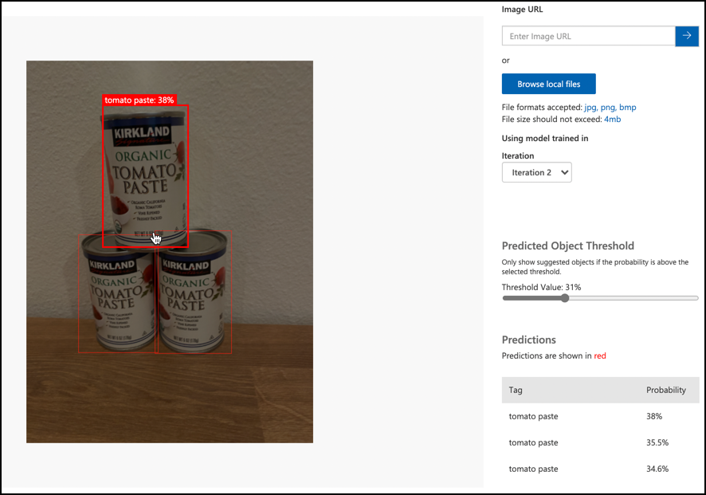

<!--
CO_OP_TRANSLATOR_METADATA:
{
  "original_hash": "8df310a42f902139a01417dacb1ffbef",
  "translation_date": "2025-08-24T21:15:58+00:00",
  "source_file": "5-retail/lessons/1-train-stock-detector/README.md",
  "language_code": "fr"
}
-->
# Entraîner un détecteur de stock

> Illustration par [Nitya Narasimhan](https://github.com/nitya). Cliquez sur l'image pour une version plus grande.

Cette vidéo donne un aperçu de la détection d'objets avec le service Azure Custom Vision, un service qui sera abordé dans cette leçon.

> 🎥 Cliquez sur l'image ci-dessus pour regarder la vidéo

## Quiz avant la leçon

[Quiz avant la leçon](https://black-meadow-040d15503.1.azurestaticapps.net/quiz/37)

## Introduction

Dans le projet précédent, vous avez utilisé l'IA pour entraîner un classificateur d'images - un modèle capable de déterminer si une image contient quelque chose, comme un fruit mûr ou non mûr. Un autre type de modèle d'IA pouvant être utilisé avec des images est la détection d'objets. Ces modèles ne classifient pas une image par des étiquettes, mais sont entraînés à reconnaître des objets et à les localiser dans des images, détectant non seulement leur présence, mais aussi leur emplacement dans l'image. Cela permet de compter les objets dans les images.

Dans cette leçon, vous apprendrez la détection d'objets, y compris son utilisation dans le commerce de détail. Vous apprendrez également à entraîner un détecteur d'objets dans le cloud.

Dans cette leçon, nous aborderons :

* [Détection d'objets](../../../../../5-retail/lessons/1-train-stock-detector)
* [Utilisation de la détection d'objets dans le commerce de détail](../../../../../5-retail/lessons/1-train-stock-detector)
* [Entraîner un détecteur d'objets](../../../../../5-retail/lessons/1-train-stock-detector)
* [Tester votre détecteur d'objets](../../../../../5-retail/lessons/1-train-stock-detector)
* [Réentraîner votre détecteur d'objets](../../../../../5-retail/lessons/1-train-stock-detector)

## Détection d'objets

La détection d'objets consiste à détecter des objets dans des images à l'aide de l'IA. Contrairement au classificateur d'images que vous avez entraîné dans le dernier projet, la détection d'objets ne consiste pas à prédire la meilleure étiquette pour une image dans son ensemble, mais à trouver un ou plusieurs objets dans une image.

### Détection d'objets vs classification d'images

La classification d'images consiste à classer une image dans son ensemble - quelles sont les probabilités que l'image entière corresponde à chaque étiquette. Vous obtenez des probabilités pour chaque étiquette utilisée pour entraîner le modèle.

Dans l'exemple ci-dessus, deux images sont classées à l'aide d'un modèle entraîné pour classer des pots de noix de cajou ou des boîtes de concentré de tomate. La première image est un pot de noix de cajou, et les résultats du classificateur d'images sont :

| Étiquette       | Probabilité |
| --------------- | ----------: |
| `noix de cajou` | 98,4%       |
| `concentré de tomate` | 1,6% |

La deuxième image est une boîte de concentré de tomate, et les résultats sont :

| Étiquette       | Probabilité |
| --------------- | ----------: |
| `noix de cajou` | 0,7%        |
| `concentré de tomate` | 99,3% |

Vous pourriez utiliser ces valeurs avec un seuil de pourcentage pour prédire ce que contient l'image. Mais que se passe-t-il si une image contient plusieurs boîtes de concentré de tomate, ou à la fois des noix de cajou et du concentré de tomate ? Les résultats ne donneraient probablement pas ce que vous voulez. C'est là qu'intervient la détection d'objets.

La détection d'objets consiste à entraîner un modèle à reconnaître des objets. Au lieu de lui donner des images contenant l'objet et de lui dire que chaque image correspond à une étiquette ou une autre, vous mettez en évidence la section d'une image qui contient l'objet spécifique et vous l'étiquetez. Vous pouvez étiqueter un seul objet dans une image ou plusieurs. De cette façon, le modèle apprend à quoi ressemble l'objet lui-même, et non seulement à quoi ressemblent les images contenant l'objet.

Lorsque vous l'utilisez ensuite pour prédire des images, au lieu d'obtenir une liste d'étiquettes et de pourcentages, vous obtenez une liste d'objets détectés, avec leur boîte englobante et la probabilité que l'objet corresponde à l'étiquette attribuée.

> 🎓 *Les boîtes englobantes* sont les cadres autour d'un objet.

L'image ci-dessus contient à la fois un pot de noix de cajou et trois boîtes de concentré de tomate. Le détecteur d'objets a détecté les noix de cajou, renvoyant la boîte englobante qui contient les noix de cajou avec le pourcentage de probabilité que la boîte englobante contienne l'objet, dans ce cas 97,6%. Le détecteur d'objets a également détecté trois boîtes de concentré de tomate et fournit trois boîtes englobantes distinctes, une pour chaque boîte détectée, chacune avec une probabilité que la boîte englobante contienne une boîte de concentré de tomate.

✅ Pensez à différents scénarios pour lesquels vous pourriez vouloir utiliser des modèles d'IA basés sur des images. Lesquels nécessiteraient une classification et lesquels nécessiteraient une détection d'objets ?

### Comment fonctionne la détection d'objets

La détection d'objets utilise des modèles d'apprentissage automatique complexes. Ces modèles fonctionnent en divisant l'image en plusieurs cellules, puis en vérifiant si le centre de la boîte englobante correspond au centre d'une image qui correspond à l'une des images utilisées pour entraîner le modèle. Vous pouvez considérer cela comme une sorte de classificateur d'images appliqué à différentes parties de l'image pour rechercher des correspondances.

> 💁 Ceci est une simplification extrême. Il existe de nombreuses techniques pour la détection d'objets, et vous pouvez en lire davantage sur la [page Détection d'objets sur Wikipédia](https://wikipedia.org/wiki/Object_detection).

Il existe plusieurs modèles différents capables de réaliser la détection d'objets. Un modèle particulièrement célèbre est [YOLO (You Only Look Once)](https://pjreddie.com/darknet/yolo/), qui est incroyablement rapide et peut détecter 20 classes d'objets différentes, comme des personnes, des chiens, des bouteilles et des voitures.

✅ Lisez des informations sur le modèle YOLO sur [pjreddie.com/darknet/yolo/](https://pjreddie.com/darknet/yolo/)

Les modèles de détection d'objets peuvent être réentraînés à l'aide de l'apprentissage par transfert pour détecter des objets personnalisés.

## Utilisation de la détection d'objets dans le commerce de détail

La détection d'objets a de nombreuses applications dans le commerce de détail. Parmi celles-ci :

* **Vérification et comptage des stocks** - reconnaître quand les stocks sont faibles sur les étagères. Si les stocks sont trop faibles, des notifications peuvent être envoyées au personnel ou aux robots pour réapprovisionner les étagères.
* **Détection de masques** - dans les magasins avec des politiques de port de masque lors d'événements de santé publique, la détection d'objets peut reconnaître les personnes portant un masque et celles qui n'en portent pas.
* **Facturation automatisée** - détecter les articles pris sur les étagères dans les magasins automatisés et facturer les clients en conséquence.
* **Détection de dangers** - reconnaître des objets cassés sur le sol ou des liquides renversés, alertant les équipes de nettoyage.

✅ Faites des recherches : Quels sont d'autres cas d'utilisation de la détection d'objets dans le commerce de détail ?

## Entraîner un détecteur d'objets

Vous pouvez entraîner un détecteur d'objets à l'aide de Custom Vision, de manière similaire à l'entraînement d'un classificateur d'images.

### Tâche - créer un détecteur d'objets

1. Créez un groupe de ressources pour ce projet appelé `stock-detector`.

1. Créez une ressource d'entraînement Custom Vision gratuite et une ressource de prédiction Custom Vision gratuite dans le groupe de ressources `stock-detector`. Nommez-les `stock-detector-training` et `stock-detector-prediction`.

    > 💁 Vous ne pouvez avoir qu'une seule ressource d'entraînement et de prédiction gratuite, alors assurez-vous d'avoir nettoyé votre projet des leçons précédentes.

    > ⚠️ Vous pouvez vous référer aux [instructions pour créer des ressources d'entraînement et de prédiction du projet 4, leçon 1 si nécessaire](../../../4-manufacturing/lessons/1-train-fruit-detector/README.md#task---create-a-cognitive-services-resource).

1. Lancez le portail Custom Vision sur [CustomVision.ai](https://customvision.ai) et connectez-vous avec le compte Microsoft que vous avez utilisé pour votre compte Azure.

1. Suivez la [section Créer un nouveau projet du guide de démarrage rapide sur la création d'un détecteur d'objets dans la documentation Microsoft](https://docs.microsoft.com/azure/cognitive-services/custom-vision-service/get-started-build-detector?WT.mc_id=academic-17441-jabenn#create-a-new-project) pour créer un nouveau projet Custom Vision. L'interface utilisateur peut changer et cette documentation est toujours la référence la plus à jour.

    Appelez votre projet `stock-detector`.

    Lorsque vous créez votre projet, assurez-vous d'utiliser la ressource `stock-detector-training` que vous avez créée précédemment. Utilisez le type de projet *Détection d'objets* et le domaine *Produits sur étagères*.

    

    ✅ Le domaine des produits sur étagères est spécifiquement conçu pour détecter les stocks sur les étagères des magasins. Lisez-en davantage sur les différents domaines dans la [documentation Sélectionner un domaine sur Microsoft Docs](https://docs.microsoft.com/azure/cognitive-services/custom-vision-service/select-domain?WT.mc_id=academic-17441-jabenn#object-detection)

✅ Prenez le temps d'explorer l'interface utilisateur de Custom Vision pour votre détecteur d'objets.

### Tâche - entraîner votre détecteur d'objets

Pour entraîner votre modèle, vous aurez besoin d'un ensemble d'images contenant les objets que vous souhaitez détecter.

1. Rassemblez des images contenant l'objet à détecter. Vous aurez besoin d'au moins 15 images contenant chaque objet à détecter, prises sous différents angles et dans différentes conditions d'éclairage, mais plus il y en a, mieux c'est. Ce détecteur d'objets utilise le domaine *Produits sur étagères*, alors essayez de disposer les objets comme s'ils étaient sur une étagère de magasin. Vous aurez également besoin de quelques images pour tester le modèle. Si vous détectez plus d'un objet, vous voudrez des images de test contenant tous les objets.

    > 💁 Les images contenant plusieurs objets différents comptent pour le minimum de 15 images pour tous les objets présents dans l'image.

    Vos images doivent être au format png ou jpeg, de moins de 6 Mo. Si vous les créez avec un iPhone, par exemple, elles peuvent être des images HEIC haute résolution, donc elles devront être converties et éventuellement réduites. Plus vous avez d'images, mieux c'est, et vous devriez avoir un nombre similaire d'objets mûrs et non mûrs.

    Le modèle est conçu pour les produits sur étagères, alors essayez de prendre les photos des objets sur des étagères.

    Vous pouvez trouver des images d'exemple que vous pouvez utiliser dans le dossier [images](../../../../../5-retail/lessons/1-train-stock-detector/images) de noix de cajou et de concentré de tomate.

1. Suivez la [section Télécharger et étiqueter des images du guide de démarrage rapide sur la création d'un détecteur d'objets dans la documentation Microsoft](https://docs.microsoft.com/azure/cognitive-services/custom-vision-service/get-started-build-detector?WT.mc_id=academic-17441-jabenn#upload-and-tag-images) pour télécharger vos images d'entraînement. Créez des étiquettes pertinentes en fonction des types d'objets que vous souhaitez détecter.

    

    Lorsque vous dessinez des boîtes englobantes pour les objets, gardez-les bien ajustées autour de l'objet. Cela peut prendre un certain temps pour délimiter toutes les images, mais l'outil détectera ce qu'il pense être les boîtes englobantes, ce qui accélérera le processus.

    

    > 💁 Si vous avez plus de 15 images pour chaque objet, vous pouvez entraîner après 15 images, puis utiliser la fonction **Étiquettes suggérées**. Cela utilisera le modèle entraîné pour détecter les objets dans les images non étiquetées. Vous pouvez ensuite confirmer les objets détectés ou rejeter et redessiner les boîtes englobantes. Cela peut faire gagner *beaucoup* de temps.

1. Suivez la [section Entraîner le détecteur du guide de démarrage rapide sur la création d'un détecteur d'objets dans la documentation Microsoft](https://docs.microsoft.com/azure/cognitive-services/custom-vision-service/get-started-build-detector?WT.mc_id=academic-17441-jabenn#train-the-detector) pour entraîner le détecteur d'objets sur vos images étiquetées.

    Vous aurez le choix du type d'entraînement. Sélectionnez **Entraînement rapide**.

Le détecteur d'objets s'entraînera alors. Cela prendra quelques minutes pour que l'entraînement soit terminé.

## Tester votre détecteur d'objets

Une fois votre détecteur d'objets entraîné, vous pouvez le tester en lui fournissant de nouvelles images pour détecter les objets.

### Tâche - tester votre détecteur d'objets

1. Utilisez le bouton **Test rapide** pour télécharger des images de test et vérifier que les objets sont détectés. Utilisez les images de test que vous avez créées précédemment, et non celles utilisées pour l'entraînement.

    

1. Essayez toutes les images de test dont vous disposez et observez les probabilités.

## Réentraîner votre détecteur d'objets

Lorsque vous testez votre détecteur d'objets, il se peut qu'il ne donne pas les résultats attendus, comme avec les classificateurs d'images dans le projet précédent. Vous pouvez améliorer votre détecteur d'objets en le réentraînant avec des images qu'il analyse incorrectement.

Chaque fois que vous effectuez une prédiction à l'aide de l'option de test rapide, l'image et les résultats sont stockés. Vous pouvez utiliser ces images pour réentraîner votre modèle.

1. Utilisez l'onglet **Prédictions** pour localiser les images que vous avez utilisées pour les tests.

1. Confirmez les détections précises, supprimez celles incorrectes et ajoutez les objets manquants.

1. Réentraînez et retestez le modèle.

---

## 🚀 Défi

Que se passerait-il si vous utilisiez le détecteur d'objets avec des articles ayant une apparence similaire, comme des boîtes de concentré de tomate et de tomates concassées de la même marque ?

Si vous avez des articles ayant une apparence similaire, testez-les en ajoutant des images d'eux à votre détecteur d'objets.

## Quiz après la leçon
[Quiz après la conférence](https://black-meadow-040d15503.1.azurestaticapps.net/quiz/38)

## Révision et étude personnelle

* Lorsque vous avez entraîné votre détecteur d'objets, vous avez dû voir des valeurs pour *Précision*, *Rappel* et *mAP* qui évaluent le modèle créé. Informez-vous sur ce que signifient ces valeurs en consultant [la section Évaluer le détecteur du guide rapide Construire un détecteur d'objets sur la documentation Microsoft](https://docs.microsoft.com/azure/cognitive-services/custom-vision-service/get-started-build-detector?WT.mc_id=academic-17441-jabenn#evaluate-the-detector)
* Lisez davantage sur la détection d'objets sur [la page Détection d'objets de Wikipédia](https://wikipedia.org/wiki/Object_detection)

## Devoir

[Comparer les domaines](assignment.md)

**Avertissement** :  
Ce document a été traduit à l'aide du service de traduction automatique [Co-op Translator](https://github.com/Azure/co-op-translator). Bien que nous nous efforcions d'assurer l'exactitude, veuillez noter que les traductions automatisées peuvent contenir des erreurs ou des inexactitudes. Le document original dans sa langue d'origine doit être considéré comme la source faisant autorité. Pour des informations critiques, il est recommandé de recourir à une traduction humaine professionnelle. Nous déclinons toute responsabilité en cas de malentendus ou d'interprétations erronées résultant de l'utilisation de cette traduction.