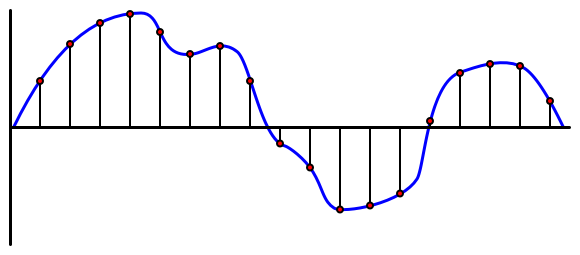

<!--
CO_OP_TRANSLATOR_METADATA:
{
  "original_hash": "6d6aa1be033625d201a190fc9c5cbfb4",
  "translation_date": "2025-08-25T00:19:55+00:00",
  "source_file": "6-consumer/lessons/1-speech-recognition/README.md",
  "language_code": "fr"
}
-->
# Reconnaître la parole avec un appareil IoT


> Illustration par [Nitya Narasimhan](https://github.com/nitya). Cliquez sur l'image pour une version plus grande.

Cette vidéo donne un aperçu du service vocal Azure, un sujet qui sera abordé dans cette leçon :

[](https://www.youtube.com/watch?v=iW0Fw0l3mrA)

> 🎥 Cliquez sur l'image ci-dessus pour regarder une vidéo

## Quiz avant la leçon

[Quiz avant la leçon](https://black-meadow-040d15503.1.azurestaticapps.net/quiz/41)

## Introduction

'Alexa, règle un minuteur de 12 minutes'

'Alexa, statut du minuteur'

'Alexa, règle un minuteur de 8 minutes appelé cuire à la vapeur des brocolis'

Les appareils intelligents deviennent de plus en plus omniprésents. Non seulement sous forme d'enceintes connectées comme les HomePods, Echos et Google Homes, mais aussi intégrés dans nos téléphones, montres, et même dans les luminaires et thermostats.

> 💁 J'ai au moins 19 appareils dans ma maison qui possèdent des assistants vocaux, et ce ne sont que ceux dont je suis conscient !

Le contrôle vocal améliore l'accessibilité en permettant aux personnes ayant une mobilité réduite d'interagir avec des appareils. Que ce soit pour un handicap permanent, comme être né sans bras, un handicap temporaire, comme un bras cassé, ou simplement avoir les mains occupées par des courses ou des enfants, pouvoir contrôler nos maisons avec notre voix plutôt qu'avec nos mains ouvre un monde d'accès. Crier 'Hey Siri, ferme ma porte de garage' tout en gérant un bébé à langer et un enfant turbulent peut être une petite mais précieuse amélioration de la vie quotidienne.

L'une des utilisations les plus populaires des assistants vocaux est la gestion des minuteurs, en particulier dans la cuisine. Pouvoir régler plusieurs minuteurs uniquement avec sa voix est d'une grande aide - pas besoin d'arrêter de pétrir une pâte, de remuer une soupe ou de nettoyer ses mains pleines de farce pour utiliser un minuteur physique.

Dans cette leçon, vous apprendrez à intégrer la reconnaissance vocale dans des appareils IoT. Vous découvrirez les microphones en tant que capteurs, comment capturer de l'audio à partir d'un microphone connecté à un appareil IoT, et comment utiliser l'IA pour convertir ce qui est entendu en texte. Tout au long de ce projet, vous construirez un minuteur de cuisine intelligent, capable de régler des minuteurs en utilisant votre voix dans plusieurs langues.

Dans cette leçon, nous aborderons :

* [Les microphones](../../../../../6-consumer/lessons/1-speech-recognition)
* [Capturer de l'audio depuis votre appareil IoT](../../../../../6-consumer/lessons/1-speech-recognition)
* [De la parole au texte](../../../../../6-consumer/lessons/1-speech-recognition)
* [Convertir la parole en texte](../../../../../6-consumer/lessons/1-speech-recognition)

## Les microphones

Les microphones sont des capteurs analogiques qui convertissent les ondes sonores en signaux électriques. Les vibrations dans l'air font bouger de minuscules composants dans le microphone, ce qui entraîne de légers changements dans les signaux électriques. Ces changements sont ensuite amplifiés pour générer une sortie électrique.

### Types de microphones

Les microphones existent en plusieurs types :

* Dynamique - Les microphones dynamiques possèdent un aimant attaché à une membrane mobile qui se déplace dans une bobine de fil, créant un courant électrique. C'est l'inverse de la plupart des haut-parleurs, qui utilisent un courant électrique pour déplacer un aimant dans une bobine de fil, faisant vibrer une membrane pour produire du son. Cela signifie que les haut-parleurs peuvent être utilisés comme microphones dynamiques, et vice versa. Dans des dispositifs comme les interphones, où l'utilisateur écoute ou parle, mais pas les deux en même temps, un seul appareil peut agir à la fois comme haut-parleur et microphone.

    Les microphones dynamiques n'ont pas besoin d'alimentation pour fonctionner, le signal électrique est entièrement généré par le microphone.

    

* Ruban - Les microphones à ruban sont similaires aux microphones dynamiques, sauf qu'ils utilisent un ruban métallique au lieu d'une membrane. Ce ruban se déplace dans un champ magnétique, générant un courant électrique. Comme les microphones dynamiques, les microphones à ruban n'ont pas besoin d'alimentation pour fonctionner.

    

* Condensateur - Les microphones à condensateur possèdent une fine membrane métallique et une plaque arrière métallique fixe. Un courant électrique est appliqué aux deux, et lorsque la membrane vibre, la charge statique entre les plaques change, générant un signal. Les microphones à condensateur nécessitent une alimentation pour fonctionner - appelée *alimentation fantôme*.

    

* MEMS - Les microphones à systèmes microélectromécaniques, ou MEMS, sont des microphones sur puce. Ils possèdent une membrane sensible à la pression gravée sur une puce de silicium, et fonctionnent de manière similaire à un microphone à condensateur. Ces microphones peuvent être minuscules et intégrés dans des circuits.

    

    Dans l'image ci-dessus, la puce étiquetée **LEFT** est un microphone MEMS, avec une membrane minuscule de moins d'un millimètre de large.

✅ Faites des recherches : Quels microphones avez-vous autour de vous - dans votre ordinateur, votre téléphone, votre casque ou d'autres appareils ? De quel type sont-ils ?

### Audio numérique

L'audio est un signal analogique contenant des informations très détaillées. Pour convertir ce signal en numérique, il doit être échantillonné des milliers de fois par seconde.

> 🎓 L'échantillonnage consiste à convertir le signal audio en une valeur numérique représentant le signal à un moment donné.



L'audio numérique est échantillonné en utilisant la modulation par impulsions codées, ou PCM. La PCM consiste à lire la tension du signal et à sélectionner la valeur discrète la plus proche correspondant à cette tension selon une taille définie.

> 💁 Vous pouvez considérer la PCM comme la version capteur de la modulation par largeur d'impulsion, ou PWM (la PWM a été abordée dans [la leçon 3 du projet de démarrage](../../../1-getting-started/lessons/3-sensors-and-actuators/README.md#pulse-width-modulation)). La PCM convertit un signal analogique en numérique, tandis que la PWM convertit un signal numérique en analogique.

Par exemple, la plupart des services de musique en streaming proposent de l'audio en 16 bits ou 24 bits. Cela signifie qu'ils convertissent la tension en une valeur qui tient dans un entier de 16 bits ou de 24 bits. L'audio en 16 bits correspond à une plage de valeurs allant de -32 768 à 32 767, tandis que le 24 bits va de −8 388 608 à 8 388 607. Plus il y a de bits, plus l'échantillon est proche de ce que nos oreilles perçoivent réellement.

> 💁 Vous avez peut-être entendu parler de l'audio en 8 bits, souvent appelé LoFi. Il s'agit d'un audio échantillonné en utilisant seulement 8 bits, soit une plage de -128 à 127. Les premiers ordinateurs étaient limités à l'audio en 8 bits en raison des contraintes matérielles, ce qui est souvent associé aux jeux rétro.

Ces échantillons sont pris des milliers de fois par seconde, avec des taux d'échantillonnage bien définis mesurés en KHz (milliers de lectures par seconde). Les services de musique en streaming utilisent 48 KHz pour la plupart des audios, mais certains audios 'sans perte' vont jusqu'à 96 KHz ou même 192 KHz. Plus le taux d'échantillonnage est élevé, plus l'audio est proche de l'original, jusqu'à un certain point. Il existe un débat sur la capacité des humains à percevoir une différence au-delà de 48 KHz.

✅ Faites des recherches : Si vous utilisez un service de musique en streaming, quel est son taux d'échantillonnage et sa taille ? Si vous utilisez des CD, quel est le taux d'échantillonnage et la taille de l'audio sur CD ?

Il existe plusieurs formats pour les données audio. Vous avez probablement entendu parler des fichiers mp3 - des données audio compressées pour les rendre plus petites sans perte de qualité. L'audio non compressé est souvent stocké sous forme de fichier WAV - un fichier contenant 44 octets d'informations d'en-tête, suivis des données audio brutes. L'en-tête contient des informations telles que le taux d'échantillonnage (par exemple 16 000 pour 16 KHz), la taille de l'échantillon (16 pour 16 bits) et le nombre de canaux. Après l'en-tête, le fichier WAV contient les données audio brutes.

> 🎓 Les canaux font référence au nombre de flux audio différents qui composent l'audio. Par exemple, pour un son stéréo avec gauche et droite, il y aurait 2 canaux. Pour un son surround 7.1 dans un système home cinéma, il y aurait 8 canaux.

### Taille des données audio

Les données audio sont relativement volumineuses. Par exemple, capturer de l'audio non compressé en 16 bits à 16 KHz (un taux suffisant pour un modèle de reconnaissance vocale) nécessite 32 Ko de données par seconde d'audio :

* 16 bits signifie 2 octets par échantillon (1 octet = 8 bits).
* 16 KHz correspond à 16 000 échantillons par seconde.
* 16 000 x 2 octets = 32 000 octets par seconde.

Cela peut sembler peu, mais si vous utilisez un microcontrôleur avec une mémoire limitée, cela peut être beaucoup. Par exemple, le Wio Terminal dispose de 192 Ko de mémoire, qui doivent également stocker le code du programme et les variables. Même si votre code était minuscule, vous ne pourriez pas capturer plus de 5 secondes d'audio.

Les microcontrôleurs peuvent accéder à un stockage supplémentaire, comme des cartes SD ou de la mémoire flash. Lors de la création d'un appareil IoT capturant de l'audio, vous devrez vous assurer non seulement de disposer d'un stockage supplémentaire, mais aussi que votre code écrit l'audio capturé directement dans ce stockage. Lorsque vous envoyez les données dans le cloud, vous devrez les diffuser depuis le stockage vers la requête web. Cela permet d'éviter de manquer de mémoire en essayant de conserver tout le bloc de données audio en mémoire en même temps.

## Capturer de l'audio depuis votre appareil IoT

Votre appareil IoT peut être connecté à un microphone pour capturer de l'audio, prêt à être converti en texte. Il peut également être connecté à des haut-parleurs pour diffuser de l'audio. Dans les leçons suivantes, cela sera utilisé pour fournir des retours audio, mais il est utile de configurer les haut-parleurs dès maintenant pour tester le microphone.

### Tâche - configurer votre microphone et vos haut-parleurs

Suivez le guide correspondant pour configurer le microphone et les haut-parleurs de votre appareil IoT :

* [Arduino - Wio Terminal](wio-terminal-microphone.md)
* [Ordinateur monocarte - Raspberry Pi](pi-microphone.md)
* [Ordinateur monocarte - Appareil virtuel](virtual-device-microphone.md)

### Tâche - capturer de l'audio

Suivez le guide correspondant pour capturer de l'audio sur votre appareil IoT :

* [Arduino - Wio Terminal](wio-terminal-audio.md)
* [Ordinateur monocarte - Raspberry Pi](pi-audio.md)
* [Ordinateur monocarte - Appareil virtuel](virtual-device-audio.md)

## De la parole au texte

La conversion de la parole en texte, ou reconnaissance vocale, consiste à utiliser l'IA pour transformer les mots d'un signal audio en texte.

### Modèles de reconnaissance vocale

Pour convertir la parole en texte, les échantillons du signal audio sont regroupés et transmis à un modèle d'apprentissage automatique basé sur un réseau neuronal récurrent (RNN). Ce type de modèle peut utiliser des données précédentes pour prendre une décision sur les données entrantes. Par exemple, le RNN pourrait détecter un bloc d'échantillons audio comme le son 'Hel', et lorsqu'il reçoit un autre bloc qu'il identifie comme 'lo', il peut combiner ces sons, reconnaître que 'Hello' est un mot valide et le sélectionner comme résultat.

Les modèles d'apprentissage automatique acceptent toujours des données de taille fixe. Le classificateur d'images que vous avez construit dans une leçon précédente redimensionne les images à une taille fixe avant de les traiter. Il en va de même pour les modèles de reconnaissance vocale, qui doivent traiter des blocs audio de taille fixe. Ces modèles doivent être capables de combiner les résultats de plusieurs prédictions pour obtenir une réponse, afin de distinguer entre 'Hi' et 'Highway', ou 'flock' et 'floccinaucinihilipilification'.

Les modèles de reconnaissance vocale sont également suffisamment avancés pour comprendre le contexte et corriger les mots détectés au fur et à mesure que d'autres sons sont traités. Par exemple, si vous dites "Je suis allé au magasin pour acheter deux bananes et une pomme aussi", vous utilisez trois mots qui sonnent de la même manière mais s'écrivent différemment - to, two et too. Les modèles de reconnaissance vocale peuvent comprendre le contexte et utiliser l'orthographe appropriée du mot.
💁 Certains services de reconnaissance vocale permettent des personnalisations pour mieux fonctionner dans des environnements bruyants comme les usines, ou avec des termes spécifiques à une industrie, tels que des noms chimiques. Ces personnalisations sont entraînées en fournissant des exemples audio et une transcription, et fonctionnent grâce à l'apprentissage par transfert, de la même manière que vous avez entraîné un classificateur d'images avec seulement quelques images dans une leçon précédente.
### Confidentialité

Lors de l'utilisation de la reconnaissance vocale sur un appareil IoT destiné aux consommateurs, la confidentialité est extrêmement importante. Ces appareils écoutent en continu, et en tant que consommateur, vous ne souhaitez pas que tout ce que vous dites soit envoyé dans le cloud et converti en texte. Non seulement cela consommerait beaucoup de bande passante Internet, mais cela aurait également d'énormes implications en matière de confidentialité, surtout lorsque certains fabricants d'appareils intelligents sélectionnent aléatoirement des enregistrements audio pour [les faire valider par des humains par rapport au texte généré afin d'améliorer leur modèle](https://www.theverge.com/2019/4/10/18305378/amazon-alexa-ai-voice-assistant-annotation-listen-private-recordings).

Vous souhaitez que votre appareil intelligent n'envoie de l'audio au cloud pour traitement que lorsque vous l'utilisez, et non lorsqu'il capte des sons dans votre maison, des sons qui pourraient inclure des réunions privées ou des interactions intimes. La plupart des appareils intelligents fonctionnent avec un *mot déclencheur*, une phrase clé comme "Alexa", "Hey Siri" ou "OK Google", qui fait que l'appareil "s'active" et écoute ce que vous dites jusqu'à ce qu'il détecte une pause dans votre discours, indiquant que vous avez terminé de parler à l'appareil.

> 🎓 La détection de mot déclencheur est également appelée *détection de mot clé* ou *reconnaissance de mot clé*.

Ces mots déclencheurs sont détectés sur l'appareil, et non dans le cloud. Ces appareils intelligents possèdent de petits modèles d'IA qui fonctionnent sur l'appareil et écoutent le mot déclencheur. Lorsqu'il est détecté, ils commencent à transmettre l'audio au cloud pour reconnaissance. Ces modèles sont très spécialisés et se concentrent uniquement sur le mot déclencheur.

> 💁 Certaines entreprises technologiques ajoutent davantage de confidentialité à leurs appareils en réalisant une partie de la conversion de la parole en texte directement sur l'appareil. Apple a annoncé qu'à partir de ses mises à jour iOS et macOS de 2021, ils prendront en charge la conversion de la parole en texte sur l'appareil et pourront gérer de nombreuses requêtes sans avoir besoin d'utiliser le cloud. Cela est rendu possible grâce à des processeurs puissants dans leurs appareils capables d'exécuter des modèles de machine learning.

✅ Selon vous, quelles sont les implications en matière de confidentialité et d'éthique liées au stockage des enregistrements audio envoyés au cloud ? Ces enregistrements devraient-ils être conservés, et si oui, comment ? Pensez-vous que l'utilisation des enregistrements à des fins d'application de la loi est un compromis acceptable pour la perte de confidentialité ?

La détection de mot déclencheur utilise généralement une technique appelée TinyML, qui consiste à convertir des modèles de machine learning pour qu'ils puissent fonctionner sur des microcontrôleurs. Ces modèles sont de petite taille et consomment très peu d'énergie.

Pour éviter la complexité de l'entraînement et de l'utilisation d'un modèle de mot déclencheur, le minuteur intelligent que vous construisez dans cette leçon utilisera un bouton pour activer la reconnaissance vocale.

> 💁 Si vous souhaitez essayer de créer un modèle de détection de mot déclencheur pour fonctionner sur le Wio Terminal ou le Raspberry Pi, consultez ce [tutoriel sur la réponse à votre voix par Edge Impulse](https://docs.edgeimpulse.com/docs/responding-to-your-voice). Si vous souhaitez utiliser votre ordinateur pour cela, vous pouvez essayer le [guide rapide pour démarrer avec les mots clés personnalisés sur la documentation Microsoft](https://docs.microsoft.com/azure/cognitive-services/speech-service/keyword-recognition-overview?WT.mc_id=academic-17441-jabenn).

## Convertir la parole en texte


Tout comme pour la classification d'images dans un projet précédent, il existe des services d'IA préconstruits qui peuvent prendre un fichier audio et le convertir en texte. L'un de ces services est le Speech Service, qui fait partie des Cognitive Services, des services d'IA préconstruits que vous pouvez utiliser dans vos applications.

### Tâche - configurer une ressource d'IA vocale

1. Créez un groupe de ressources pour ce projet appelé `smart-timer`.

1. Utilisez la commande suivante pour créer une ressource vocale gratuite :

    ```sh
    az cognitiveservices account create --name smart-timer \
                                        --resource-group smart-timer \
                                        --kind SpeechServices \
                                        --sku F0 \
                                        --yes \
                                        --location <location>
    ```

    Remplacez `<location>` par l'emplacement que vous avez utilisé lors de la création du groupe de ressources.

1. Vous aurez besoin d'une clé API pour accéder à la ressource vocale depuis votre code. Exécutez la commande suivante pour obtenir la clé :

    ```sh
    az cognitiveservices account keys list --name smart-timer \
                                           --resource-group smart-timer \
                                           --output table
    ```

    Copiez l'une des clés.

### Tâche - convertir la parole en texte

Suivez le guide correspondant pour convertir la parole en texte sur votre appareil IoT :

* [Arduino - Wio Terminal](wio-terminal-speech-to-text.md)
* [Ordinateur monocarte - Raspberry Pi](pi-speech-to-text.md)
* [Ordinateur monocarte - Appareil virtuel](virtual-device-speech-to-text.md)

---

## 🚀 Défi

La reconnaissance vocale existe depuis longtemps et ne cesse de s'améliorer. Faites des recherches sur les capacités actuelles et comparez comment elles ont évolué au fil du temps, notamment en ce qui concerne la précision des transcriptions automatiques par rapport à celles réalisées par des humains.

Selon vous, quel avenir attend la reconnaissance vocale ?

## Quiz post-lecture

[Quiz post-lecture](https://black-meadow-040d15503.1.azurestaticapps.net/quiz/42)

## Révision et étude personnelle

* Lisez sur les différents types de microphones et leur fonctionnement dans l'article [quelle est la différence entre les microphones dynamiques et à condensateur sur Musician's HQ](https://musicianshq.com/whats-the-difference-between-dynamic-and-condenser-microphones/).
* Lisez davantage sur le service vocal des Cognitive Services dans la [documentation sur le service vocal sur Microsoft Docs](https://docs.microsoft.com/azure/cognitive-services/speech-service/?WT.mc_id=academic-17441-jabenn).
* Lisez sur la détection de mots clés dans la [documentation sur la reconnaissance de mots clés sur Microsoft Docs](https://docs.microsoft.com/azure/cognitive-services/speech-service/keyword-recognition-overview?WT.mc_id=academic-17441-jabenn).

## Devoir

[](assignment.md)

**Avertissement** :  
Ce document a été traduit à l'aide du service de traduction automatique [Co-op Translator](https://github.com/Azure/co-op-translator). Bien que nous nous efforcions d'assurer l'exactitude, veuillez noter que les traductions automatisées peuvent contenir des erreurs ou des inexactitudes. Le document original dans sa langue d'origine doit être considéré comme la source faisant autorité. Pour des informations critiques, il est recommandé de faire appel à une traduction humaine professionnelle. Nous déclinons toute responsabilité en cas de malentendus ou d'interprétations erronées résultant de l'utilisation de cette traduction.