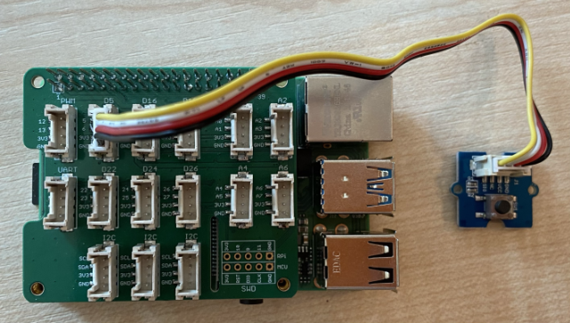

<!--
CO_OP_TRANSLATOR_METADATA:
{
  "original_hash": "0ac0afcfb40cb5970ef4cb74f01c32e9",
  "translation_date": "2025-08-25T00:17:21+00:00",
  "source_file": "6-consumer/lessons/1-speech-recognition/pi-audio.md",
  "language_code": "fr"
}
-->
# Capturer de l'audio - Raspberry Pi

Dans cette partie de la leçon, vous allez écrire du code pour capturer de l'audio sur votre Raspberry Pi. La capture audio sera contrôlée par un bouton.

## Matériel

Le Raspberry Pi nécessite un bouton pour contrôler la capture audio.

Le bouton que vous utiliserez est un bouton Grove. C'est un capteur numérique qui active ou désactive un signal. Ces boutons peuvent être configurés pour envoyer un signal haut lorsque le bouton est pressé, et bas lorsqu'il ne l'est pas, ou bas lorsqu'il est pressé et haut lorsqu'il ne l'est pas.

Si vous utilisez un microphone ReSpeaker 2-Mics Pi HAT, il n'est pas nécessaire de connecter un bouton, car ce HAT en possède déjà un intégré. Passez à la section suivante.

### Connecter le bouton

Le bouton peut être connecté au Grove Base Hat.

#### Tâche - connecter le bouton


1. Insérez une extrémité d'un câble Grove dans la prise du module bouton. Il ne peut être inséré que dans un seul sens.

1. Avec le Raspberry Pi éteint, connectez l'autre extrémité du câble Grove à la prise numérique marquée **D5** sur le Grove Base Hat attaché au Pi. Cette prise est la deuxième à partir de la gauche, sur la rangée de prises à côté des broches GPIO.



## Capturer de l'audio

Vous pouvez capturer de l'audio depuis le microphone en utilisant du code Python.

### Tâche - capturer de l'audio

1. Allumez le Pi et attendez qu'il démarre.

1. Lancez VS Code, soit directement sur le Pi, soit en vous connectant via l'extension Remote SSH.

1. Le package PyAudio Pip contient des fonctions pour enregistrer et lire de l'audio. Ce package dépend de certaines bibliothèques audio qui doivent être installées au préalable. Exécutez les commandes suivantes dans le terminal pour les installer :

    ```sh
    sudo apt update
    sudo apt install libportaudio0 libportaudio2 libportaudiocpp0 portaudio19-dev libasound2-plugins --yes 
    ```

1. Installez le package PyAudio Pip.

    ```sh
    pip3 install pyaudio
    ```

1. Créez un nouveau dossier appelé `smart-timer` et ajoutez un fichier nommé `app.py` à ce dossier.

1. Ajoutez les imports suivants en haut de ce fichier :

    ```python
    import io
    import pyaudio
    import time
    import wave
    
    from grove.factory import Factory
    ```

    Cela importe le module `pyaudio`, quelques modules Python standards pour gérer les fichiers wave, et le module `grove.factory` pour importer une `Factory` permettant de créer une classe bouton.

1. En dessous, ajoutez du code pour créer un bouton Grove.

    Si vous utilisez le ReSpeaker 2-Mics Pi HAT, utilisez le code suivant :

    ```python
    # The button on the ReSpeaker 2-Mics Pi HAT
    button = Factory.getButton("GPIO-LOW", 17)
    ```

    Cela crée un bouton sur le port **D17**, le port auquel le bouton du ReSpeaker 2-Mics Pi HAT est connecté. Ce bouton est configuré pour envoyer un signal bas lorsqu'il est pressé.

    Si vous n'utilisez pas le ReSpeaker 2-Mics Pi HAT, mais un bouton Grove connecté au Base Hat, utilisez ce code :

    ```python
    button = Factory.getButton("GPIO-HIGH", 5)
    ```

    Cela crée un bouton sur le port **D5**, configuré pour envoyer un signal haut lorsqu'il est pressé.

1. En dessous, créez une instance de la classe PyAudio pour gérer l'audio :

    ```python
    audio = pyaudio.PyAudio()
    ```

1. Déclarez le numéro de carte matériel pour le microphone et le haut-parleur. Ce sera le numéro de la carte que vous avez trouvé en exécutant `arecord -l` et `aplay -l` plus tôt dans cette leçon.

    ```python
    microphone_card_number = <microphone card number>
    speaker_card_number = <speaker card number>
    ```

    Remplacez `<microphone card number>` par le numéro de la carte de votre microphone.

    Remplacez `<speaker card number>` par le numéro de la carte de votre haut-parleur, le même numéro que vous avez défini dans le fichier `alsa.conf`.

1. En dessous, déclarez la fréquence d'échantillonnage à utiliser pour la capture et la lecture audio. Vous devrez peut-être modifier cette valeur en fonction du matériel que vous utilisez.

    ```python
    rate = 48000 #48KHz
    ```

    Si vous obtenez des erreurs de fréquence d'échantillonnage lors de l'exécution de ce code, modifiez cette valeur à `44100` ou `16000`. Plus la valeur est élevée, meilleure est la qualité du son.

1. En dessous, créez une nouvelle fonction appelée `capture_audio`. Elle sera appelée pour capturer l'audio depuis le microphone :

    ```python
    def capture_audio():
    ```

1. À l'intérieur de cette fonction, ajoutez le code suivant pour capturer l'audio :

    ```python
    stream = audio.open(format = pyaudio.paInt16,
                        rate = rate,
                        channels = 1, 
                        input_device_index = microphone_card_number,
                        input = True,
                        frames_per_buffer = 4096)

    frames = []

    while button.is_pressed():
        frames.append(stream.read(4096))

    stream.stop_stream()
    stream.close()
    ```

    Ce code ouvre un flux d'entrée audio en utilisant l'objet PyAudio. Ce flux capturera l'audio du microphone à 16KHz, en le capturant dans des tampons de 4096 octets.

    Le code boucle ensuite tant que le bouton Grove est pressé, lisant ces tampons de 4096 octets dans un tableau à chaque fois.

    > 💁 Vous pouvez en savoir plus sur les options passées à la méthode `open` dans la [documentation PyAudio](https://people.csail.mit.edu/hubert/pyaudio/docs/).

    Une fois le bouton relâché, le flux est arrêté et fermé.

1. Ajoutez le code suivant à la fin de cette fonction :

    ```python
    wav_buffer = io.BytesIO()
    with wave.open(wav_buffer, 'wb') as wavefile:
        wavefile.setnchannels(1)
        wavefile.setsampwidth(audio.get_sample_size(pyaudio.paInt16))
        wavefile.setframerate(rate)
        wavefile.writeframes(b''.join(frames))
        wav_buffer.seek(0)

    return wav_buffer
    ```

    Ce code crée un tampon binaire et écrit tout l'audio capturé dedans sous forme de fichier [WAV](https://wikipedia.org/wiki/WAV). C'est une méthode standard pour écrire de l'audio non compressé dans un fichier. Ce tampon est ensuite retourné.

1. Ajoutez la fonction suivante `play_audio` pour lire le tampon audio :

    ```python
    def play_audio(buffer):
        stream = audio.open(format = pyaudio.paInt16,
                            rate = rate,
                            channels = 1,
                            output_device_index = speaker_card_number,
                            output = True)
    
        with wave.open(buffer, 'rb') as wf:
            data = wf.readframes(4096)
    
            while len(data) > 0:
                stream.write(data)
                data = wf.readframes(4096)
    
            stream.close()
    ```

    Cette fonction ouvre un autre flux audio, cette fois pour la sortie - pour lire l'audio. Elle utilise les mêmes paramètres que le flux d'entrée. Le tampon est ensuite ouvert comme un fichier wave et écrit dans le flux de sortie par morceaux de 4096 octets, jouant l'audio. Le flux est ensuite fermé.

1. Ajoutez le code suivant sous la fonction `capture_audio` pour boucler jusqu'à ce que le bouton soit pressé. Une fois le bouton pressé, l'audio est capturé, puis joué.

    ```python
    while True:
        while not button.is_pressed():
            time.sleep(.1)
        
        buffer = capture_audio()
        play_audio(buffer)
    ```

1. Exécutez le code. Appuyez sur le bouton et parlez dans le microphone. Relâchez le bouton lorsque vous avez terminé, et vous entendrez l'enregistrement.

    Vous pouvez obtenir des erreurs ALSA lorsque l'instance PyAudio est créée. Cela est dû à la configuration du Pi pour des périphériques audio que vous n'avez pas. Vous pouvez ignorer ces erreurs.

    ```output
    pi@raspberrypi:~/smart-timer $ python3 app.py 
    ALSA lib pcm.c:2565:(snd_pcm_open_noupdate) Unknown PCM cards.pcm.front
    ALSA lib pcm.c:2565:(snd_pcm_open_noupdate) Unknown PCM cards.pcm.rear
    ALSA lib pcm.c:2565:(snd_pcm_open_noupdate) Unknown PCM cards.pcm.center_lfe
    ALSA lib pcm.c:2565:(snd_pcm_open_noupdate) Unknown PCM cards.pcm.side
    ```

    Si vous obtenez l'erreur suivante :

    ```output
    OSError: [Errno -9997] Invalid sample rate
    ```

    alors modifiez le `rate` à 44100 ou 16000.

> 💁 Vous pouvez trouver ce code dans le dossier [code-record/pi](../../../../../6-consumer/lessons/1-speech-recognition/code-record/pi).

😀 Votre programme d'enregistrement audio est un succès !

**Avertissement** :  
Ce document a été traduit à l'aide du service de traduction automatique [Co-op Translator](https://github.com/Azure/co-op-translator). Bien que nous nous efforcions d'assurer l'exactitude, veuillez noter que les traductions automatisées peuvent contenir des erreurs ou des inexactitudes. Le document original dans sa langue d'origine doit être considéré comme la source faisant autorité. Pour des informations critiques, il est recommandé de recourir à une traduction humaine professionnelle. Nous déclinons toute responsabilité en cas de malentendus ou d'interprétations erronées résultant de l'utilisation de cette traduction.