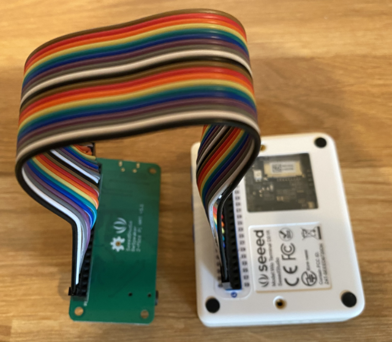

<!--
CO_OP_TRANSLATOR_METADATA:
{
  "original_hash": "93d352de36526b8990e41dd538100324",
  "translation_date": "2025-08-25T00:32:12+00:00",
  "source_file": "6-consumer/lessons/1-speech-recognition/wio-terminal-microphone.md",
  "language_code": "fr"
}
-->
# Configurez votre microphone et vos haut-parleurs - Wio Terminal

Dans cette partie de la leçon, vous allez ajouter des haut-parleurs à votre Wio Terminal. Le Wio Terminal dispose déjà d'un microphone intégré, qui peut être utilisé pour capturer la voix.

## Matériel

Le Wio Terminal possède déjà un microphone intégré, qui peut être utilisé pour capturer de l'audio pour la reconnaissance vocale.

Pour ajouter un haut-parleur, vous pouvez utiliser le [ReSpeaker 2-Mics Pi Hat](https://www.seeedstudio.com/ReSpeaker-2-Mics-Pi-HAT.html). Il s'agit d'une carte externe contenant 2 microphones MEMS, ainsi qu'un connecteur pour haut-parleur et une prise casque.

Vous devrez ajouter soit des écouteurs, soit un haut-parleur avec une prise jack 3,5 mm, soit un haut-parleur avec une connexion JST comme le [Mono Enclosed Speaker - 2W 6 Ohm](https://www.seeedstudio.com/Mono-Enclosed-Speaker-2W-6-Ohm-p-2832.html).

Pour connecter le ReSpeaker 2-Mics Pi Hat, vous aurez besoin de câbles de raccordement à broches (également appelés mâle-mâle) de 40 broches.

> 💁 Si vous êtes à l'aise avec le soudage, vous pouvez utiliser le [40 Pin Raspberry Pi Hat Adapter Board For Wio Terminal](https://www.seeedstudio.com/40-Pin-Raspberry-Pi-Hat-Adapter-Board-For-Wio-Terminal-p-4730.html) pour connecter le ReSpeaker.

Vous aurez également besoin d'une carte SD pour télécharger et lire de l'audio. Le Wio Terminal ne prend en charge que les cartes SD d'une capacité maximale de 16 Go, et celles-ci doivent être formatées en FAT32 ou exFAT.

### Tâche - connecter le ReSpeaker Pi Hat

1. Avec le Wio Terminal éteint, connectez le ReSpeaker 2-Mics Pi Hat au Wio Terminal en utilisant les câbles de raccordement et les prises GPIO situées à l'arrière du Wio Terminal :

    Les broches doivent être connectées de cette manière :

    

1. Positionnez le ReSpeaker et le Wio Terminal avec les prises GPIO orientées vers le haut, sur le côté gauche.

1. Commencez par la prise située en haut à gauche de la prise GPIO sur le ReSpeaker. Connectez un câble de raccordement de la prise en haut à gauche du ReSpeaker à la prise en haut à gauche du Wio Terminal.

1. Répétez cette opération tout le long des prises GPIO sur le côté gauche. Assurez-vous que les broches sont bien enfoncées.

    

    

    > 💁 Si vos câbles de raccordement sont regroupés en rubans, gardez-les ensemble - cela facilite la vérification que tous les câbles sont connectés dans l'ordre.

1. Répétez le processus en utilisant les prises GPIO du côté droit du ReSpeaker et du Wio Terminal. Ces câbles doivent contourner les câbles déjà en place.

    

    

    > 💁 Si vos câbles de raccordement sont regroupés en rubans, divisez-les en deux rubans. Passez-en un de chaque côté des câbles existants.

    > 💁 Vous pouvez utiliser du ruban adhésif pour maintenir les broches en bloc afin d'éviter qu'elles ne se détachent pendant la connexion.
    >
    > 

1. Vous devrez ajouter un haut-parleur.

    * Si vous utilisez un haut-parleur avec un câble JST, connectez-le au port JST du ReSpeaker.

      

    * Si vous utilisez un haut-parleur avec une prise jack 3,5 mm ou des écouteurs, insérez-les dans la prise jack 3,5 mm.

      

### Tâche - configurer la carte SD

1. Connectez la carte SD à votre ordinateur, en utilisant un lecteur externe si votre ordinateur ne dispose pas d'un emplacement pour carte SD.

1. Formatez la carte SD en utilisant l'outil approprié sur votre ordinateur, en veillant à utiliser un système de fichiers FAT32 ou exFAT.

1. Insérez la carte SD dans l'emplacement prévu à cet effet sur le côté gauche du Wio Terminal, juste en dessous du bouton d'alimentation. Assurez-vous que la carte est complètement insérée et qu'elle s'enclenche - vous pourriez avoir besoin d'un outil fin ou d'une autre carte SD pour l'enfoncer complètement.

    

    > 💁 Pour éjecter la carte SD, vous devez la pousser légèrement et elle s'éjectera. Vous aurez besoin d'un outil fin, comme un tournevis plat ou une autre carte SD.

**Avertissement** :  
Ce document a été traduit à l'aide du service de traduction automatique [Co-op Translator](https://github.com/Azure/co-op-translator). Bien que nous nous efforcions d'assurer l'exactitude, veuillez noter que les traductions automatisées peuvent contenir des erreurs ou des inexactitudes. Le document original dans sa langue d'origine doit être considéré comme la source faisant autorité. Pour des informations critiques, il est recommandé de recourir à une traduction humaine professionnelle. Nous déclinons toute responsabilité en cas de malentendus ou d'interprétations erronées résultant de l'utilisation de cette traduction.