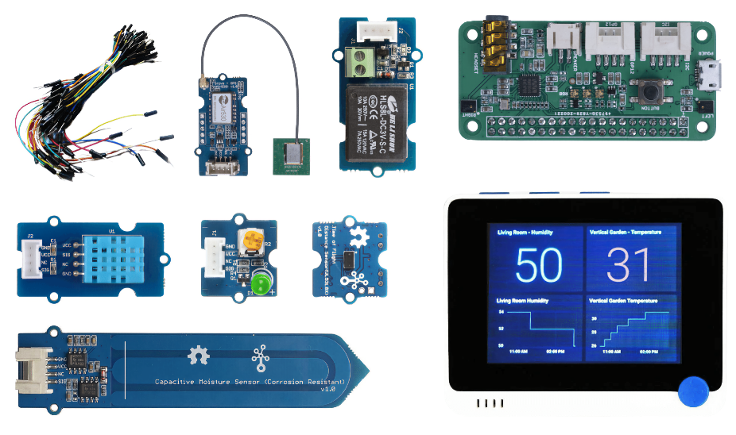
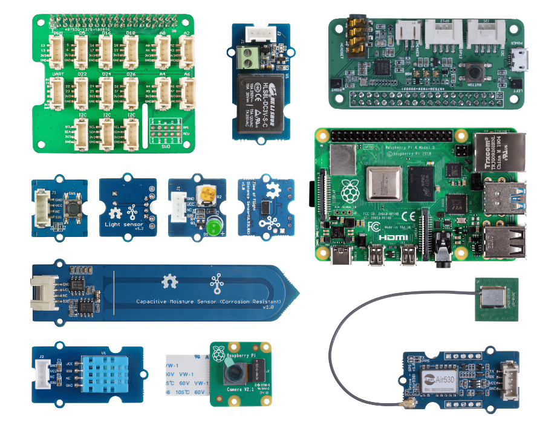

# Matériel

Le **T** dans IoT est **Things** et fait référence aux dispositifs qui interagissent avec le monde qui nous entoure. Chaque projet est basé sur du matériel du monde réel disponible pour les étudiants et les amateurs. Nous proposons deux choix de matériel IoT à utiliser en fonction des préférences personnelles, des connaissances ou des préférences en matière de langage de programmation, des objectifs d'apprentissage et de la disponibilité. Nous avons également prévu une version "matériel virtuel" pour ceux qui n'ont pas accès au matériel ou qui souhaitent en savoir plus avant de s'engager dans un achat.

> 💁 Vous n'avez pas besoin d'acheter de matériel IoT pour réaliser les missions. Vous pouvez tout faire en utilisant du matériel IoT virtuel.

Les choix de matériel physique sont Arduino ou Raspberry Pi. Chaque plateforme a ses propres avantages et inconvénients, qui sont tous abordés dans l'une des premières leçons. Si vous n'avez pas encore choisi de plate-forme matérielle, vous pouvez consulter [la deuxième leçon du premier projet](./1-getting-started/lessons/2-deeper-dive/translations/README.fr.md) to decide which hardware platform you are most interested in learning.

Le matériel spécifique a été choisi pour réduire la complexité des leçons et des devoirs. Bien que d'autres matériels puissent fonctionner, nous ne pouvons pas garantir que toutes les missions seront prises en charge par votre appareil sans matériel supplémentaire. Par exemple, de nombreux appareils Arduino ne disposent pas du WiFi, qui est nécessaire pour se connecter au cloud - le terminal Wio a été choisi parce qu'il dispose du WiFi intégré.

Vous aurez également besoin de quelques articles non techniques, comme de la terre ou une plante en pot, et des fruits ou des légumes.

## Acheter les kits

Seeed Studios a très aimablement mis à disposition tout le matériel sous forme de kits faciles à acheter :

### Arduino - Terminal Wio

**[IoT pour les débutants avec Seeed et Microsoft - Wio Terminal Starter Kit](https://www.seeedstudio.com/IoT-for-beginners-with-Seeed-and-Microsoft-Wio-Terminal-Starter-Kit-p-5006.html)**

### Raspberry Pi

**[IoT pour les débutants avec Seeed et Microsoft - Kit de démarrage Raspberry Pi 4](https://www.seeedstudio.com/IoT-for-beginners-with-Seeed-and-Microsoft-Raspberry-Pi-Starter-Kit.html)**

## Arduino

Tout le code du dispositif pour Arduino est en C++. Pour réaliser tous les travaux, vous aurez besoin des éléments suivants :

### Carte Arduino

* [Terminal Wio](https://www.seeedstudio.com/Wio-Terminal-p-4509.html)
* *Optionnel* - Câble USB-C ou adaptateur USB-A vers USB-C. Le terminal Wio possède un port USB-C et est livré avec un câble USB-C vers USB-A. Si votre PC ou Mac ne possède que des ports USB-C, vous aurez besoin d'un câble USB-C ou d'un adaptateur USB-A vers USB-C.

### Capteurs et actionneurs spécifiques à Arduino

Ils sont spécifiques à l'utilisation du terminal Wio Arduino, et ne sont pas pertinentes pour l'utilisation du Raspberry Pi.

* [ArduCam Mini 2MP Plus - OV2640](https://www.arducam.com/product/arducam-2mp-spi-camera-b0067-arduino/)
* [ReSpeaker 2-Mics Pi HAT](https://www.seeedstudio.com/ReSpeaker-2-Mics-Pi-HAT.html)
* [Breadboard Jumper Wires](https://www.seeedstudio.com/Breadboard-Jumper-Wire-Pack-241mm-200mm-160mm-117m-p-234.html)
* Un casque ou un autre haut-parleur avec une prise de 3,5 mm, ou un haut-parleur JST tel que :
  * [Mono Enclosed Speaker - 2W 6 Ohm](https://www.seeedstudio.com/Mono-Enclosed-Speaker-2W-6-Ohm-p-2832.html)
* Carte microSD de 16 Go ou moins, ainsi qu'un connecteur pour utiliser la carte SD avec votre ordinateur si vous n'en avez pas un intégré. **REMARQUE** - le terminal Wio ne prend en charge que les cartes SD jusqu'à 16 Go, il ne prend pas en charge les capacités supérieures.

## Raspberry Pi

Tout le code du dispositif pour Raspberry Pi est en Python. Pour réaliser tous les travaux, vous aurez besoin des éléments suivants :

### Carte Raspberry Pi

* [Raspberry Pi](https://www.raspberrypi.org/products/raspberry-pi-4-model-b/)
  > 💁 Les versions du Pi 2B et plus devraient fonctionner avec les devoirs de ces leçons.
* Carte microSD (vous pouvez obtenir des kits Raspberry Pi fournis avec une carte microSD), ainsi qu'un connecteur pour utiliser la carte SD avec votre ordinateur si vous n'en avez pas un intégré.
* Alimentation électrique USB (vous pouvez obtenir des kits Raspberry Pi 4 fournis avec une alimentation électrique). Si vous utilisez un Raspberry Pi 4, vous avez besoin d'une alimentation USB-C. Les appareils plus anciens ont besoin d'une alimentation micro-USB.

### Capteurs et actionneurs spécifiques à Raspberry Pi

Ils sont spécifiques à l'utilisation du Raspberry Pi et ne sont pas pertinentes pour l'utilisation du dispositif Arduino.

* [Grove Pi base hat](https://www.seeedstudio.com/Grove-Base-Hat-for-Raspberry-Pi.html)
* [Raspberry Pi Camera module](https://www.raspberrypi.org/products/camera-module-v2/)
* Microphone et speaker:

  Utilisez l'une des options suivantes (ou un équivalent) :
  * Tout microphone USB avec tout haut-parleur USB, ou haut-parleur avec un câble jack 3,5 mm, ou en utilisant la sortie audio HDMI si votre Raspberry Pi est connecté à un moniteur ou un téléviseur avec des haut-parleurs.
  * Tout casque d'écoute USB avec un microphone intégré
  * [ReSpeaker 2-Mics Pi HAT](https://www.seeedstudio.com/ReSpeaker-2-Mics-Pi-HAT.html) with
    * Un casque ou un autre haut-parleur avec une prise de 3,5 mm, ou un haut-parleur JST tel que :
    * [Mono Enclosed Speaker - 2W 6 Ohm](https://www.seeedstudio.com/Mono-Enclosed-Speaker-2W-6-Ohm-p-2832.html)
  * [USB Speakerphone](https://www.amazon.com/USB-Speakerphone-Conference-Business-Microphones/dp/B07Q3D7F8S/ref=sr_1_1?dchild=1&keywords=m0&qid=1614647389&sr=8-1)
* [Senseur Grove Light](https://www.seeedstudio.com/Grove-Light-Sensor-v1-2-LS06-S-phototransistor.html)
* [Boutton Grove](https://www.seeedstudio.com/Grove-Button.html)

## Capteurs et actionneurs

Most of the sensors and actuators needed are used by both the Arduino and Raspberry Pi learning paths:

* [Grove LED](https://www.seeedstudio.com/Grove-LED-Pack-p-4364.html) x 2
* [Grove humidity and temperature sensor](https://www.seeedstudio.com/Grove-Temperature-Humidity-Sensor-DHT11.html)
* [Grove capacitive soil moisture sensor](https://www.seeedstudio.com/Grove-Capacitive-Moisture-Sensor-Corrosion-Resistant.html)
* [Grove relay](https://www.seeedstudio.com/Grove-Relay.html)
* [Grove GPS (Air530)](https://www.seeedstudio.com/Grove-GPS-Air530-p-4584.html)
* [Grove Time of flight Distance Sensor](https://www.seeedstudio.com/Grove-Time-of-Flight-Distance-Sensor-VL53L0X.html)

## Matériel Optionel

Les leçons sur l'arrosage automatique fonctionnent à l'aide d'un relais. En option, vous pouvez connecter ce relais à une pompe à eau alimentée par USB en utilisant le matériel indiqué ci-dessous.

* [Pompe à eau 6V](https://www.seeedstudio.com/6V-Mini-Water-Pump-p-1945.html)
* [Terminal USB](https://www.adafruit.com/product/3628)
* Tubes en silicone
* Fils rouge et noir
* Petit tournevis à tête plate

## Matériel virtuel

La route du matériel virtuel fournira des simulateurs pour les capteurs et les actionneurs, implémentés en Python. En fonction de la disponibilité de votre matériel, vous pouvez l'exécuter sur votre périphérique de développement habituel, tel qu'un Mac ou un PC, ou l'exécuter sur un Raspberry Pi et simuler uniquement le matériel dont vous ne disposez pas. Par exemple, si vous avez la caméra Raspberry Pi mais pas les capteurs Grove, vous pourrez exécuter le code du dispositif virtuel sur votre Pi et simuler les capteurs Grove, mais utiliser une caméra physique.

Le matériel virtuel utilisera le [projet CounterFit](https://github.com/CounterFit-IoT/CounterFit).

Pour suivre ces leçons, vous devez disposer d'une webcam, d'un microphone et d'une sortie audio (haut-parleurs ou casque). Ces éléments peuvent être intégrés ou externes, et doivent être configurés pour fonctionner avec votre système d'exploitation et être disponibles pour toutes les applications.
