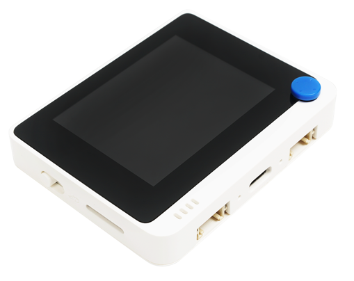

<!--
CO_OP_TRANSLATOR_METADATA:
{
  "original_hash": "9bae08314d8487cb76ddf3d8797e1544",
  "translation_date": "2025-08-27T21:59:42+00:00",
  "source_file": "1-getting-started/lessons/1-introduction-to-iot/README.md",
  "language_code": "he"
}
-->
# מבוא ל-IoT

> סקיצה מאת [ניטיה נאראסימן](https://github.com/nitya). לחצו על התמונה לגרסה גדולה יותר.

השיעור הזה נלמד כחלק מסדרת [Hello IoT](https://youtube.com/playlist?list=PLmsFUfdnGr3xRts0TIwyaHyQuHaNQcb6-) של [Microsoft Reactor](https://developer.microsoft.com/reactor/?WT.mc_id=academic-17441-jabenn). השיעור הועבר בשני סרטונים - שיעור של שעה אחת ושעת משרד נוספת שבה נבחנים לעומק חלקים מהשיעור ונענים שאלות.

> 🎥 לחצו על התמונות למעלה לצפייה בסרטונים

## שאלון לפני השיעור

[שאלון לפני השיעור](https://black-meadow-040d15503.1.azurestaticapps.net/quiz/1)

## מבוא

השיעור הזה מכסה נושאים בסיסיים הקשורים לאינטרנט של הדברים (IoT) ומסייע לכם להתחיל בהגדרת החומרה שלכם.

בשיעור הזה נעסוק ב:

* [מהו 'אינטרנט של הדברים'?](../../../../../1-getting-started/lessons/1-introduction-to-iot)
* [מכשירי IoT](../../../../../1-getting-started/lessons/1-introduction-to-iot)
* [הגדרת המכשיר שלכם](../../../../../1-getting-started/lessons/1-introduction-to-iot)
* [יישומים של IoT](../../../../../1-getting-started/lessons/1-introduction-to-iot)
* [דוגמאות למכשירי IoT שסביר להניח שיש סביבכם](../../../../../1-getting-started/lessons/1-introduction-to-iot)

## מהו 'אינטרנט של הדברים'?

המונח 'אינטרנט של הדברים' נטבע על ידי [קווין אשטון](https://wikipedia.org/wiki/Kevin_Ashton) בשנת 1999, כדי לתאר חיבור האינטרנט לעולם הפיזי באמצעות חיישנים. מאז, המונח משמש לתיאור כל מכשיר שמתקשר עם העולם הפיזי סביבו, בין אם על ידי איסוף נתונים מחיישנים או ביצוע אינטראקציות פיזיות באמצעות מפעילים (מכשירים שעושים משהו כמו להדליק מתג או להפעיל נורת LED), בדרך כלל מחוברים למכשירים אחרים או לאינטרנט.

> **חיישנים** אוספים מידע מהעולם, כמו מדידת מהירות, טמפרטורה או מיקום.
>
> **מפעילים** ממירים אותות חשמליים לאינטראקציות פיזיות כמו הפעלת מתג, הדלקת אורות, יצירת צלילים או שליחת אותות שליטה לחומרה אחרת, לדוגמה, להפעיל שקע חשמל.

IoT כתחום טכנולוגי כולל יותר ממכשירים בלבד - הוא כולל שירותים מבוססי ענן שיכולים לעבד את נתוני החיישנים או לשלוח בקשות למפעילים המחוברים למכשירי IoT. הוא גם כולל מכשירים שאין להם או אינם זקוקים לחיבור לאינטרנט, המכונים לעיתים מכשירי קצה. אלו מכשירים שיכולים לעבד ולהגיב לנתוני חיישנים בעצמם, בדרך כלל באמצעות מודלים של AI שאומנו בענן.

IoT הוא תחום טכנולוגי שצומח במהירות. ההערכה היא שעד סוף 2020, היו מחוברים לאינטרנט 30 מיליארד מכשירי IoT. מבט לעתיד מראה שעד 2025, מכשירי IoT יאספו כמעט 80 זטה-בייט של נתונים, או 80 טריליון גיגה-בייט. זה הרבה נתונים!

✅ בצעו מחקר קטן: כמה מהנתונים שנוצרים על ידי מכשירי IoT באמת מנוצלים, וכמה מתבזבזים? מדוע כל כך הרבה נתונים מתעלמים?

הנתונים הללו הם המפתח להצלחת IoT. כדי להיות מפתח IoT מצליח, עליכם להבין אילו נתונים אתם צריכים לאסוף, כיצד לאסוף אותם, כיצד לקבל החלטות על בסיסם, וכיצד להשתמש בהחלטות הללו כדי לתקשר עם העולם הפיזי אם יש צורך.

## מכשירי IoT

ה-**T** ב-IoT מייצג **דברים** - מכשירים שמתקשרים עם העולם הפיזי סביבם, בין אם על ידי איסוף נתונים מחיישנים או ביצוע אינטראקציות פיזיות באמצעות מפעילים.

מכשירים לשימוש ייצור או מסחרי, כמו צמידי כושר לצרכן או בקרי מכונות תעשייתיים, בדרך כלל מיוצרים בהתאמה אישית. הם משתמשים בלוחות מעגלים מותאמים אישית, ואולי אפילו במעבדים מותאמים אישית, שנועדו לענות על צרכים ספציפיים, בין אם זה להיות קטנים מספיק כדי להתאים לפרק כף היד או חזקים מספיק כדי לעבוד בסביבה תעשייתית עם טמפרטורות גבוהות, לחץ גבוה או רטט גבוה.

כמפתח שלומד על IoT או יוצר אב-טיפוס של מכשיר, תצטרכו להתחיל עם ערכת פיתוח. אלו מכשירי IoT רב-שימושיים שנועדו למפתחים, לעיתים עם תכונות שלא יהיו במכשיר ייצור, כמו סט פינים חיצוניים לחיבור חיישנים או מפעילים, חומרה לתמיכה בניפוי שגיאות או משאבים נוספים שיגרמו לעלויות מיותרות בייצור המוני.

ערכות פיתוח אלו בדרך כלל מתחלקות לשתי קטגוריות - מיקרו-בקרים ומחשבים חד-לוחיים. הם יובאו כאן, ונעמיק בהם בשיעור הבא.

> 💁 הטלפון שלכם יכול גם להיחשב כמכשיר IoT רב-שימושי, עם חיישנים ומפעילים מובנים, כאשר אפליקציות שונות משתמשות בהם בדרכים שונות עם שירותי ענן שונים. תוכלו אפילו למצוא מדריכי IoT שמשתמשים באפליקציית טלפון כמכשיר IoT.

### מיקרו-בקרים

מיקרו-בקר (המכונה גם MCU, קיצור של Microcontroller Unit) הוא מחשב קטן שמורכב מ:

🧠 יחידת עיבוד מרכזית אחת או יותר (CPU) - ה'מוח' של המיקרו-בקר שמריץ את התוכנית שלכם

💾 זיכרון (RAM וזיכרון תוכנה) - המקום שבו התוכנית, הנתונים והמשתנים שלכם נשמרים

🔌 חיבורים קלט/פלט (I/O) ניתנים לתכנות - לתקשורת עם התקנים חיצוניים (מכשירים מחוברים) כמו חיישנים ומפעילים

מיקרו-בקרים הם בדרך כלל מכשירי מחשוב זולים, עם מחירים ממוצעים של אלו המשמשים בחומרה מותאמת אישית שמגיעים לכ-0.50 דולר, וחלק מהמכשירים זולים עד כדי 0.03 דולר. ערכות פיתוח יכולות להתחיל במחיר של 4 דולר, עם עלויות שעולות ככל שמוסיפים יותר תכונות. ה-[Wio Terminal](https://www.seeedstudio.com/Wio-Terminal-p-4509.html), ערכת פיתוח מיקרו-בקר מ-[Seeed Studios](https://www.seeedstudio.com) שמכילה חיישנים, מפעילים, WiFi ומסך, עולה כ-30 דולר.

> 💁 כשאתם מחפשים באינטרנט מיקרו-בקרים, היזהרו מחיפוש המונח **MCU**, שכן זה עשוי להחזיר הרבה תוצאות שקשורות ליקום הקולנועי של מארוול ולא למיקרו-בקרים.

מיקרו-בקרים נועדו להיות מתוכנתים לביצוע מספר מוגבל של משימות מאוד ספציפיות, ולא להיות מחשבים רב-שימושיים כמו מחשבים אישיים או מחשבי Mac. למעט תרחישים מאוד ספציפיים, לא ניתן לחבר להם מסך, מקלדת ועכבר ולהשתמש בהם למשימות כלליות.

ערכות פיתוח מיקרו-בקרים בדרך כלל מגיעות עם חיישנים ומפעילים נוספים מובנים. רוב הלוחות יכילו נורת LED אחת או יותר שניתן לתכנת, יחד עם התקנים אחרים כמו חיבורים סטנדרטיים להוספת חיישנים או מפעילים נוספים באמצעות מערכות אקולוגיות של יצרנים שונים או חיישנים מובנים (בדרך כלל הפופולריים ביותר כמו חיישני טמפרטורה). חלק מהמיקרו-בקרים כוללים קישוריות אלחוטית מובנית כמו Bluetooth או WiFi או מכילים מיקרו-בקרים נוספים בלוח כדי להוסיף קישוריות זו.

> 💁 מיקרו-בקרים בדרך כלל מתוכנתים בשפת C/C++.

### מחשבים חד-לוחיים

מחשב חד-לוחי הוא מכשיר מחשוב קטן שמכיל את כל האלמנטים של מחשב שלם על לוח קטן אחד. אלו מכשירים עם מפרט קרוב למחשב שולחני או נייד, מריצים מערכת הפעלה מלאה, אך קטנים יותר, צורכים פחות חשמל וזולים משמעותית.

ה-Raspberry Pi הוא אחד המחשבים החד-לוחיים הפופולריים ביותר.

כמו מיקרו-בקר, מחשבים חד-לוחיים מכילים CPU, זיכרון ופינים קלט/פלט, אך יש להם תכונות נוספות כמו שבב גרפי שמאפשר לחבר מסכים, יציאות שמע ויציאות USB לחיבור מקלדות, עכברים והתקני USB סטנדרטיים אחרים כמו מצלמות רשת או אחסון חיצוני. תוכניות נשמרות בכרטיסי SD או כוננים קשיחים יחד עם מערכת הפעלה, במקום שבב זיכרון מובנה בלוח.

> 🎓 ניתן לחשוב על מחשב חד-לוחי כגרסה קטנה וזולה יותר של המחשב האישי או ה-Mac שאתם קוראים עליו עכשיו, עם תוספת של פיני GPIO (קלט/פלט רב-שימושי) לתקשורת עם חיישנים ומפעילים.

מחשבים חד-לוחיים הם מחשבים מלאים, ולכן ניתן לתכנת אותם בכל שפה. מכשירי IoT בדרך כלל מתוכנתים בפייתון.

### בחירת חומרה לשאר השיעורים

כל השיעורים הבאים כוללים משימות שמשתמשות במכשיר IoT לתקשורת עם העולם הפיזי ועם הענן. כל שיעור תומך בשלוש אפשרויות מכשירים - Arduino (שימוש ב-Seeed Studios Wio Terminal), או מחשב חד-לוחי, בין אם מכשיר פיזי (Raspberry Pi 4) או מחשב חד-לוחי וירטואלי שמריץ על המחשב האישי או ה-Mac שלכם.

תוכלו לקרוא על החומרה הנדרשת להשלמת כל המשימות במדריך החומרה [hardware guide](../../../hardware.md).

> 💁 אין צורך לרכוש חומרת IoT כדי להשלים את המשימות, ניתן לעשות הכל באמצעות מחשב חד-לוחי וירטואלי.

איזו חומרה תבחרו תלויה במה שיש לכם בבית או בבית הספר, ובאיזו שפת תכנות אתם מכירים או מתכננים ללמוד. שתי אפשרויות החומרה ישתמשו באותה מערכת אקולוגית של חיישנים, כך שאם תתחילו באחת מהן, תוכלו לעבור לשנייה מבלי להחליף את רוב הערכה. המחשב החד-לוחי הווירטואלי יהיה שווה ערך ללמידה על Raspberry Pi, עם רוב הקוד שניתן להעביר ל-Pi אם בסופו של דבר תרכשו מכשיר וחיישנים.

### ערכת פיתוח Arduino

אם אתם מעוניינים ללמוד פיתוח מיקרו-בקרים, תוכלו להשלים את המשימות באמצעות מכשיר Arduino. תצטרכו הבנה בסיסית של תכנות ב-C/C++, שכן השיעורים ילמדו רק קוד שרלוונטי למסגרת Arduino, החיישנים והמפעילים שבהם משתמשים, והספריות שמתקשרות עם הענן.

המשימות ישתמשו ב-[Visual Studio Code](https://code.visualstudio.com/?WT.mc_id=academic-17441-jabenn) עם הרחבת [PlatformIO לפיתוח מיקרו-בקרים](https://platformio.org). תוכלו גם להשתמש ב-Arduino IDE אם יש לכם ניסיון עם הכלי הזה, שכן לא יינתנו הוראות.

### ערכת פיתוח מחשב חד-לוחי

אם אתם מעוניינים ללמוד פיתוח IoT באמצעות מחשבים חד-לוחיים, תוכלו להשלים את המשימות באמצעות Raspberry Pi או מכשיר וירטואלי שמריץ על המחשב האישי או ה-Mac שלכם.

תצטרכו הבנה בסיסית של תכנות בפייתון, שכן השיעורים ילמדו רק קוד שרלוונטי לחיישנים והמפעילים שבהם משתמשים, והספריות שמתקשרות עם הענן.

> 💁 אם אתם רוצים ללמוד לתכנת בפייתון, בדקו את שתי סדרות הסרטונים הבאות:
>
> * [Python למתחילים](https://channel9.msdn.com/Series/Intro-to-Python-Development?WT.mc_id=academic-17441-jabenn)
> * [עוד Python למתחילים](https://channel9.msdn.com/Series/More-Python-for-Beginners?WT.mc_id=academic-7372-jabenn)

המשימות ישתמשו ב-[Visual Studio Code](https://code.visualstudio.com/?WT.mc_id=academic-17441-jabenn).

אם אתם משתמשים ב-Raspberry Pi, תוכלו להריץ את ה-Pi באמצעות גרסת שולחן העבודה המלאה של Raspberry Pi OS ולעשות את כל הקידוד ישירות על ה-Pi באמצעות [גרסת VS Code של Raspberry Pi OS](https://code.visualstudio.com/docs/setup/raspberry-pi?WT.mc_id=academic-17441-jabenn), או להריץ את ה-Pi כמכשיר ללא ראש ולכתוב קוד מהמחשב האישי או ה-Mac שלכם באמצעות VS Code עם הרחבת [Remote SSH](https://code.visualstudio.com/docs/remote/ssh?WT.mc_id=academic-17441-jabenn) שמאפשרת לכם להתחבר ל-Pi ולערוך, לנפות שגיאות ולהריץ קוד כאילו אתם עובדים עליו ישירות.

אם תשתמשו באפשרות המכשיר הווירטואלי, תכתבו קוד ישירות על המחשב שלכם. במקום לגשת לחיישנים ומפעילים, תשתמשו בכלי שמדמה את החומרה הזו, מספק ערכי חיישנים שתוכלו להגדיר ומציג את תוצאות המפעילים על המסך.

## הגדרת המכשיר שלכם

לפני שתוכלו להתחיל לתכנת את מכשיר ה-IoT שלכם, תצטרכו לבצע מעט הגדרות. עקבו אחר ההוראות הרלוונטיות בהתאם למכשיר שבו תשתמשו.
💁 אם עדיין אין לך מכשיר, עיין במדריך החומרה [hardware guide](../../../hardware.md) כדי לעזור להחליט איזה מכשיר אתה הולך להשתמש, ואיזה חומרה נוספת עליך לרכוש. אין צורך לרכוש חומרה, מכיוון שכל הפרויקטים יכולים לפעול על חומרה וירטואלית.
ההוראות הללו כוללות קישורים לאתרים של צד שלישי שנוצרו על ידי יוצרי החומרה או הכלים שבהם תשתמשו. זאת כדי להבטיח שתמיד תשתמשו בהוראות העדכניות ביותר עבור הכלים והחומרה השונים.

עבדו דרך המדריך הרלוונטי כדי להגדיר את המכשיר שלכם ולהשלים פרויקט 'Hello World'. זה יהיה הצעד הראשון ביצירת מנורת לילה IoT במהלך 4 השיעורים בחלק זה של ההתחלה.

* [Arduino - Wio Terminal](wio-terminal.md)
* [Single-board computer - Raspberry Pi](pi.md)
* [Single-board computer - Virtual device](virtual-device.md)

✅ תשתמשו ב-VS Code גם עבור Arduino וגם עבור מחשבים חד-לוחיים. אם לא השתמשתם בזה בעבר, קראו עוד על כך באתר [VS Code](https://code.visualstudio.com?WT.mc_id=academic-17441-jabenn)

## יישומים של IoT

IoT מכסה מגוון רחב של שימושים, המחולקים לכמה קבוצות עיקריות:

* IoT לצרכן
* IoT מסחרי
* IoT תעשייתי
* IoT תשתיתי

✅ בצעו מחקר קטן: עבור כל אחד מהתחומים המתוארים למטה, מצאו דוגמה מוחשית שאינה מופיעה בטקסט.

### IoT לצרכן

IoT לצרכן מתייחס למכשירי IoT שהצרכנים רוכשים ומשתמשים בהם בבית. חלק מהמכשירים הללו מועילים מאוד, כמו רמקולים חכמים, מערכות חימום חכמות ושואבי אבק רובוטיים. אחרים מעוררים שאלות לגבי מידת התועלת שלהם, כמו ברזים הנשלטים בקול, שמקשים על סגירתם כאשר השליטה הקולית לא מצליחה לשמוע אתכם מעל רעש המים הזורמים.

מכשירי IoT לצרכן מעניקים לאנשים יכולת להשיג יותר בסביבתם, במיוחד למיליארד אנשים עם מוגבלות. שואבי אבק רובוטיים יכולים לספק רצפות נקיות לאנשים עם בעיות ניידות שאינם יכולים לשאוב בעצמם, תנורים הנשלטים בקול מאפשרים לאנשים עם ראייה מוגבלת או בעיות מוטוריות לחמם את התנור שלהם באמצעות הקול בלבד, ומכשירי ניטור בריאות מאפשרים לחולים לעקוב אחר מצבים כרוניים עם עדכונים תכופים ומפורטים יותר. מכשירים אלו הופכים לכל כך נפוצים, שגם ילדים צעירים משתמשים בהם כחלק מחיי היומיום שלהם, למשל, תלמידים בלמידה מרחוק במהלך מגפת הקורונה שהשתמשו במכשירים חכמים כדי להגדיר טיימרים למעקב אחר עבודות בית הספר או תזכורות לפגישות כיתתיות.

✅ אילו מכשירי IoT לצרכן יש לכם בבית או עליכם?

### IoT מסחרי

IoT מסחרי מכסה את השימוש ב-IoT במקום העבודה. בסביבת משרד, עשויים להיות חיישני תפוסה וגלאי תנועה לניהול תאורה וחימום כך שיפעלו רק כשצריך, מה שמפחית עלויות ופליטת פחמן. במפעל, מכשירי IoT יכולים לנטר מפגעי בטיחות כמו עובדים שאינם חובשים קסדות או רעש שהגיע לרמות מסוכנות. בקמעונאות, מכשירי IoT יכולים למדוד את הטמפרטורה של אחסון קר, ולהתריע לבעל החנות אם מקרר או מקפיא נמצאים מחוץ לטווח הטמפרטורה הנדרש, או לנטר פריטים על המדפים כדי לכוון עובדים למלא מחדש מוצרים שנמכרו. תעשיית התחבורה מסתמכת יותר ויותר על IoT לניטור מיקומי רכבים, מעקב אחר קילומטראז' בכביש לצורך חיוב משתמשי דרך, מעקב אחר שעות נהיגה ועמידה בהפסקות, או הודעה לצוות כאשר רכב מתקרב למרכז לוגיסטי כדי להתכונן לטעינה או פריקה.

✅ אילו מכשירי IoT מסחריים יש בבית הספר או במקום העבודה שלכם?

### IoT תעשייתי (IIoT)

IoT תעשייתי, או IIoT, הוא השימוש במכשירי IoT לניהול ושליטה על מכונות בקנה מידה גדול. זה מכסה מגוון רחב של שימושים, ממפעלים ועד חקלאות דיגיטלית.

מפעלים משתמשים במכשירי IoT בדרכים רבות ושונות. ניתן לנטר מכונות באמצעות חיישנים רבים כדי לעקוב אחר דברים כמו טמפרטורה, רעידות ומהירות סיבוב. נתונים אלו יכולים להיות מנוטרים כדי לאפשר עצירת המכונה אם היא חורגת מטווחים מסוימים - למשל, אם היא מתחממת יתר על המידה. נתונים אלו יכולים גם להיאסף ולהיות מנותחים לאורך זמן לצורך תחזוקה חזויה, שבה מודלים של AI מנתחים את הנתונים המובילים לכשל ומשתמשים בהם כדי לחזות כשלים נוספים לפני שהם מתרחשים.

חקלאות דיגיטלית חשובה אם העולם רוצה להאכיל את האוכלוסייה הגדלה, במיוחד עבור 2 מיליארד אנשים ב-500 מיליון משקי בית שמתקיימים מ[חקלאות קיום](https://wikipedia.org/wiki/Subsistence_agriculture). חקלאות דיגיטלית יכולה לנוע מחיישנים זולים בודדים ועד מערכות מסחריות גדולות. חקלאי יכול להתחיל בניטור טמפרטורות ושימוש ב[ימי גידול](https://wikipedia.org/wiki/Growing_degree-day) כדי לחזות מתי יבול יהיה מוכן לקציר. הם יכולים לחבר ניטור לחות קרקע למערכות השקיה אוטומטיות כדי לתת לצמחים שלהם בדיוק את כמות המים הנדרשת, אך לא יותר, כדי להבטיח שהיבול לא יתייבש מבלי לבזבז מים. חקלאים אף לוקחים זאת רחוק יותר ומשתמשים ברחפנים, נתוני לוויין ו-AI לניטור צמיחת יבולים, מחלות ואיכות הקרקע על פני שטחים עצומים של אדמות חקלאיות.

✅ אילו מכשירי IoT נוספים יכולים לעזור לחקלאים?

### IoT תשתיתי

IoT תשתיתי עוסק בניטור ושליטה על התשתיות המקומיות והגלובליות שאנשים משתמשים בהן מדי יום.

[ערים חכמות](https://wikipedia.org/wiki/Smart_city) הן אזורים עירוניים שמשתמשים במכשירי IoT לאיסוף נתונים על העיר ומשתמשים בהם לשיפור תפקוד העיר. ערים אלו בדרך כלל מנוהלות בשיתופי פעולה בין ממשלות מקומיות, אקדמיה ועסקים מקומיים, ועוקבות ומנהלות דברים כמו תחבורה, חניה וזיהום. לדוגמה, בקופנהגן, דנמרק, זיהום אוויר חשוב לתושבים המקומיים, ולכן הוא נמדד והנתונים משמשים לספק מידע על מסלולי רכיבה וריצה נקיים יותר.

[רשתות חשמל חכמות](https://wikipedia.org/wiki/Smart_grid) מאפשרות ניתוחים טובים יותר של ביקוש לחשמל על ידי איסוף נתוני שימוש ברמת הבתים הבודדים. נתונים אלו יכולים להנחות החלטות ברמה הלאומית, כמו היכן לבנות תחנות כוח חדשות, וברמה האישית על ידי מתן תובנות למשתמשים על כמות החשמל שהם צורכים, מתי הם צורכים אותו, ואפילו הצעות כיצד להפחית עלויות, כמו טעינת רכבים חשמליים בלילה.

✅ אם הייתם יכולים להוסיף מכשירי IoT למדידת משהו במקום מגוריכם, מה זה היה?

## דוגמאות למכשירי IoT שייתכן שיש סביבכם

תתפלאו כמה מכשירי IoT יש סביבכם. אני כותב זאת מהבית ויש לי את המכשירים הבאים שמחוברים לאינטרנט עם תכונות חכמות כמו שליטה דרך אפליקציה, שליטה קולית או היכולת לשלוח נתונים אליי דרך הטלפון:

* רמקולים חכמים מרובים  
* מקרר, מדיח כלים, תנור ומיקרוגל  
* מד חשמל לפאנלים סולאריים  
* שקעים חכמים  
* פעמון דלת וידאו ומצלמות אבטחה  
* תרמוסטט חכם עם חיישני חדר חכמים מרובים  
* פותחן דלתות מוסך  
* מערכות בידור ביתיות וטלוויזיות הנשלטות בקול  
* תאורה  
* עוקבי כושר ובריאות  

כל סוגי המכשירים הללו כוללים חיישנים ו/או מפעילים ומתקשרים עם האינטרנט. אני יכול לדעת מהטלפון שלי אם דלת המוסך שלי פתוחה, ולבקש מהרמקול החכם שלי לסגור אותה עבורי. אני יכול אפילו להגדיר טיימר כך שאם היא עדיין פתוחה בלילה, היא תיסגר אוטומטית. כשפעמון הדלת מצלצל, אני יכול לראות מהטלפון שלי מי שם, בכל מקום בעולם, ולדבר איתם דרך רמקול ומיקרופון מובנים בפעמון הדלת. אני יכול לנטר את רמת הסוכר בדם שלי, קצב הלב ודפוסי השינה, ולחפש דפוסים בנתונים כדי לשפר את הבריאות שלי. אני יכול לשלוט בתאורה שלי דרך הענן, ולשבת בחושך כשהחיבור לאינטרנט מתנתק.

---

## 🚀 אתגר

רשמו כמה שיותר מכשירי IoT שיש בביתכם, בבית הספר או במקום העבודה שלכם - ייתכן שיש יותר ממה שאתם חושבים!

## שאלון לאחר ההרצאה

[שאלון לאחר ההרצאה](https://black-meadow-040d15503.1.azurestaticapps.net/quiz/2)

## סקירה ולימוד עצמי

קראו על היתרונות והכישלונות של פרויקטי IoT לצרכן. בדקו אתרי חדשות למאמרים על מקרים שבהם זה השתבש, כמו בעיות פרטיות, בעיות חומרה או בעיות שנגרמו מחוסר קישוריות.

כמה דוגמאות:

* בדקו את חשבון הטוויטר **[Internet of Sh*t](https://twitter.com/internetofshit)** *(אזהרת גסויות)* לדוגמאות טובות של כישלונות עם IoT לצרכן.  
* [c|net - השעון של אפל הציל את חיי: 5 אנשים משתפים את סיפוריהם](https://www.cnet.com/news/apple-watch-lifesaving-health-features-read-5-peoples-stories/)  
* [c|net - טכנאי ADT הודה באשמה על ריגול במצלמות לקוחות במשך שנים](https://www.cnet.com/news/adt-home-security-technician-pleads-guilty-to-spying-on-customer-camera-feeds-for-years/) *(אזהרת טריגר - מציצנות לא מוסכמת)*  

## משימה

[חקירת פרויקט IoT](assignment.md)  

---

**כתב ויתור**:  
מסמך זה תורגם באמצעות שירות תרגום מבוסס בינה מלאכותית [Co-op Translator](https://github.com/Azure/co-op-translator). למרות שאנו שואפים לדיוק, יש לקחת בחשבון שתרגומים אוטומטיים עשויים להכיל שגיאות או אי דיוקים. המסמך המקורי בשפתו המקורית צריך להיחשב כמקור סמכותי. עבור מידע קריטי, מומלץ להשתמש בתרגום מקצועי על ידי אדם. איננו נושאים באחריות לאי הבנות או לפרשנויות שגויות הנובעות משימוש בתרגום זה.