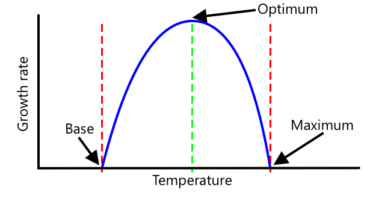

<!--
CO_OP_TRANSLATOR_METADATA:
{
  "original_hash": "d105b44deae539165855c976dcdeca99",
  "translation_date": "2025-08-27T21:02:48+00:00",
  "source_file": "2-farm/lessons/1-predict-plant-growth/README.md",
  "language_code": "he"
}
-->
## נבא את צמיחת הצמחים עם IoT


> סקיצה מאת [ניטיה נאראסימן](https://github.com/nitya). לחצו על התמונה לגרסה גדולה יותר.

## שאלון לפני השיעור

[שאלון לפני השיעור](https://black-meadow-040d15503.1.azurestaticapps.net/quiz/9)

## מבוא

צמחים זקוקים לדברים מסוימים כדי לגדול - מים, פחמן דו-חמצני, חומרים מזינים, אור וחום. בשיעור זה תלמדו כיצד לחשב את שיעורי הצמיחה והבגרות של צמחים על ידי מדידת טמפרטורת האוויר.

בשיעור זה נעסוק ב:

* [חקלאות דיגיטלית](../../../../../2-farm/lessons/1-predict-plant-growth)
* [מדוע הטמפרטורה חשובה בחקלאות?](../../../../../2-farm/lessons/1-predict-plant-growth)
* [מדידת טמפרטורה סביבתית](../../../../../2-farm/lessons/1-predict-plant-growth)
* [ימי דרגת צמיחה (GDD)](../../../../../2-farm/lessons/1-predict-plant-growth)
* [חישוב GDD באמצעות נתוני חיישן טמפרטורה](../../../../../2-farm/lessons/1-predict-plant-growth)

## חקלאות דיגיטלית

חקלאות דיגיטלית משנה את הדרך שבה אנו חקלאים, באמצעות כלים לאיסוף, אחסון וניתוח נתונים מחקלאות. אנו נמצאים כיום בתקופה המתוארת כ'מהפכה התעשייתית הרביעית' על ידי הפורום הכלכלי העולמי, והעלייה של חקלאות דיגיטלית כונתה 'המהפכה החקלאית הרביעית', או 'חקלאות 4.0'.

> 🎓 המונח חקלאות דיגיטלית כולל גם את כל 'שרשרת הערך החקלאית', כלומר המסע כולו מהחווה לשולחן. זה כולל מעקב אחר איכות התוצרת כשהיא נשלחת ומעובדת, מערכות מחסנים ומסחר אלקטרוני, ואפילו אפליקציות להשכרת טרקטורים!

שינויים אלו מאפשרים לחקלאים להגדיל את התפוקה, להשתמש בפחות דשנים וחומרי הדברה, ולהשקות בצורה יעילה יותר. למרות שהטכנולוגיה משמשת בעיקר במדינות עשירות, חיישנים ומכשירים אחרים הולכים ומוזלים, מה שהופך אותם לנגישים יותר במדינות מתפתחות.

כמה טכניקות שמאפשרות חקלאות דיגיטלית הן:

* מדידת טמפרטורה - מדידת טמפרטורה מאפשרת לחקלאים לחזות את צמיחת הצמחים ואת הבגרות שלהם.
* השקיה אוטומטית - מדידת לחות הקרקע והפעלת מערכות השקיה כשהקרקע יבשה מדי, במקום השקיה מתוזמנת. השקיה מתוזמנת יכולה להוביל לצמחים שלא מקבלים מספיק מים בתקופות חמות ויבשות, או להשקיית יתר בזמן גשם. על ידי השקיה רק כשהקרקע זקוקה לכך, חקלאים יכולים לייעל את השימוש במים.
* הדברת מזיקים - חקלאים יכולים להשתמש במצלמות על רובוטים אוטומטיים או רחפנים כדי לבדוק מזיקים, ואז ליישם חומרי הדברה רק היכן שצריך, מה שמפחית את כמות חומרי ההדברה ואת זיהום מקורות המים המקומיים.

✅ בצעו מחקר. אילו טכניקות נוספות משמשות לשיפור תפוקת החקלאות?

> 🎓 המונח 'חקלאות מדויקת' מתאר תצפית, מדידה ותגובה לצמחים על בסיס שדה או אפילו חלקים משדה. זה כולל מדידת מים, חומרים מזינים ורמות מזיקים ותגובה מדויקת, כמו השקיה רק לחלק קטן מהשדה.

## מדוע הטמפרטורה חשובה בחקלאות?

כשמלמדים על צמחים, רוב התלמידים לומדים על הצורך במים, אור, פחמן דו-חמצני וחומרים מזינים. צמחים גם זקוקים לחום כדי לגדול - זו הסיבה שצמחים פורחים באביב כשהטמפרטורה עולה, מדוע פרחי שלג או נרקיסים יכולים לנבוט מוקדם בעקבות תקופת חום קצרה, ומדוע חממות כל כך טובות בגידול צמחים.

> 🎓 חממות וחממות חימום עושות עבודה דומה, אך עם הבדל חשוב. חממות חימום מחוממות באופן מלאכותי ומאפשרות לחקלאים לשלוט בטמפרטורה בצורה מדויקת יותר, חממות מסתמכות על השמש לחימום ובדרך כלל השליטה היחידה היא חלונות או פתחים אחרים לשחרור חום.

לצמחים יש טמפרטורה בסיסית או מינימלית, טמפרטורה אופטימלית וטמפרטורה מקסימלית, הכל מבוסס על טמפרטורות ממוצעות יומיות.

* טמפרטורה בסיסית - זו הטמפרטורה הממוצעת היומית המינימלית הדרושה לצמח כדי לגדול.
* טמפרטורה אופטימלית - זו הטמפרטורה הממוצעת היומית הטובה ביותר להשגת הצמיחה המקסימלית.
* טמפרטורה מקסימלית - זו הטמפרטורה המקסימלית שהצמח יכול לעמוד בה. מעליה הצמח יפסיק את הצמיחה בניסיון לשמר מים ולהישאר חי.

> 💁 אלו טמפרטורות ממוצעות, מחושבות על בסיס טמפרטורות יום ולילה. צמחים גם זקוקים לטמפרטורות שונות ביום ובלילה כדי לעזור להם לבצע פוטוסינתזה בצורה יעילה יותר ולחסוך באנרגיה בלילה.

לכל מין של צמח יש ערכים שונים לטמפרטורה בסיסית, אופטימלית ומקסימלית. זו הסיבה שחלק מהצמחים משגשגים במדינות חמות, ואחרים במדינות קרות.

✅ בצעו מחקר. עבור כל צמח שיש לכם בגינה, בבית הספר או בפארק המקומי, נסו למצוא את הטמפרטורה הבסיסית שלו.



הגרף לעיל מציג דוגמה לגרף שיעור צמיחה ביחס לטמפרטורה. עד לטמפרטורה הבסיסית אין צמיחה. שיעור הצמיחה עולה עד לטמפרטורה האופטימלית, ואז יורד לאחר שהגיע לשיא זה. 

צורת הגרף משתנה ממין צמח אחד למשנהו. לחלקם יש ירידות חדות מעל האופטימום, ולאחרים עליות איטיות יותר מהבסיס לאופטימום.

> 💁 כדי שחקלאי ישיג את הצמיחה הטובה ביותר, עליו לדעת את שלושת ערכי הטמפרטורה ולהבין את צורת הגרפים עבור הצמחים שהוא מגדל.

אם לחקלאי יש שליטה בטמפרטורה, למשל בחממה מסחרית, אז הוא יכול לייעל את התנאים עבור הצמחים שלו. חממה מסחרית שמגדלת עגבניות, למשל, תכוון את הטמפרטורה ל-25°C במהלך היום ול-20°C בלילה כדי להשיג את הצמיחה המהירה ביותר.

> 🍅 שילוב של טמפרטורות אלו עם תאורה מלאכותית, דשנים ושליטה ברמות פחמן דו-חמצני מאפשר למגדלים מסחריים לגדל ולקצור לאורך כל השנה.

## מדידת טמפרטורה סביבתית

חיישני טמפרטורה יכולים לשמש עם מכשירי IoT למדידת טמפרטורה סביבתית.

### משימה - מדידת טמפרטורה

עבדו דרך המדריך הרלוונטי כדי לנטר טמפרטורות באמצעות מכשיר ה-IoT שלכם:

* [Arduino - Wio Terminal](wio-terminal-temp.md)
* [מחשב לוח יחיד - Raspberry Pi](pi-temp.md)
* [מחשב לוח יחיד - מכשיר וירטואלי](virtual-device-temp.md)

## ימי דרגת צמיחה

ימי דרגת צמיחה (המכונים גם יחידות דרגת צמיחה) הם דרך למדוד את צמיחת הצמחים בהתבסס על הטמפרטורה. בהנחה שלצמח יש מספיק מים, חומרים מזינים ופחמן דו-חמצני, הטמפרטורה קובעת את שיעור הצמיחה.

ימי דרגת צמיחה, או GDD, מחושבים ליום כטמפרטורה הממוצעת בצלזיוס ליום מעל הטמפרטורה הבסיסית של הצמח. כל צמח זקוק למספר מסוים של GDD כדי לגדול, לפרוח או לייצר ולבגר יבול. ככל שיש יותר GDD בכל יום, כך הצמח יגדל מהר יותר.

> 🇺🇸 עבור אמריקאים, ימי דרגת צמיחה יכולים גם להיות מחושבים באמצעות פרנהייט. 5 GDD (בצלזיוס) שווים ל-9 GDD (בפרנהייט).

הנוסחה המלאה ל-GDD מעט מורכבת, אבל יש משוואה פשוטה שמשמשת לעיתים קרובות כהערכה טובה:


* **GDD** - זהו מספר ימי דרגת הצמיחה
* **T max** - זו הטמפרטורה היומית המקסימלית בצלזיוס
* **T min** - זו הטמפרטורה היומית המינימלית בצלזיוס
* **T base** - זו הטמפרטורה הבסיסית של הצמח בצלזיוס

> 💁 יש וריאציות שמתמודדות עם T max מעל 30°C או T min מתחת ל-T base, אבל נתעלם מהן כרגע.

### דוגמה - תירס 🌽

בהתאם לזן, תירס (או תירס מתוק) זקוק ל-800 עד 2,700 GDD כדי להבשיל, עם טמפרטורה בסיסית של 10°C.

ביום הראשון מעל הטמפרטורה הבסיסית, נמדדו הטמפרטורות הבאות:

| מדידה      | טמפ °C |
| :---------- | :-----: |
| מקסימום     | 16      |
| מינימום     | 12      |

הכנסת המספרים הללו לחישוב שלנו:

* T max = 16
* T min = 12
* T base = 10

זה נותן חישוב של:


התירס קיבל 4 GDD באותו יום. בהנחה של זן תירס שזקוק ל-800 GDD כדי להבשיל, הוא יזדקק לעוד 796 GDD כדי להגיע לבגרות.

✅ בצעו מחקר. עבור כל צמח שיש לכם בגינה, בבית הספר או בפארק המקומי, נסו למצוא את מספר ה-GDD הנדרש כדי להגיע לבגרות או לייצר יבול.

## חישוב GDD באמצעות נתוני חיישן טמפרטורה

צמחים לא גדלים בתאריכים קבועים - למשל, אי אפשר לשתול זרע ולדעת שהצמח יניב פרי בדיוק 100 ימים לאחר מכן. במקום זאת, כחלק מהחקלאות, ניתן לקבל מושג כללי כמה זמן לוקח לצמח לגדול, ואז לבדוק מדי יום מתי היבול מוכן.

זה משפיע מאוד על העבודה בחווה גדולה, ומסכן את החקלאי שיפספס יבולים שמוכנים מוקדם מהצפוי. על ידי מדידת טמפרטורות, החקלאי יכול לחשב את ה-GDD שהצמח קיבל, מה שמאפשר לו לבדוק רק קרוב למועד הבגרות הצפוי.

על ידי איסוף נתוני טמפרטורה באמצעות מכשיר IoT, החקלאי יכול לקבל התראה אוטומטית כאשר הצמחים קרובים לבגרות. ארכיטקטורה טיפוסית לכך היא שמכשירי IoT מודדים טמפרטורה, ואז מפרסמים את נתוני הטלמטריה הללו דרך האינטרנט באמצעות משהו כמו MQTT. קוד שרת מקשיב לנתונים הללו ושומר אותם במקום כלשהו, כמו מסד נתונים. זה מאפשר לנתונים להיות מנותחים מאוחר יותר, כמו עבודה לילית לחישוב ה-GDD ליום, סיכום ה-GDD לכל יבול עד כה והתראה אם צמח קרוב לבגרות.


קוד השרת יכול גם להוסיף מידע נוסף לנתונים. לדוגמה, מכשיר ה-IoT יכול לפרסם מזהה כדי לציין איזה מכשיר הוא, וקוד השרת יכול להשתמש בזה כדי לחפש את מיקום המכשיר ואת היבולים שהוא מנטר. הוא יכול גם להוסיף נתונים בסיסיים כמו הזמן הנוכחי, שכן חלק ממכשירי IoT אינם כוללים את החומרה הנדרשת לשמירה על זמן מדויק, או דורשים קוד נוסף לקריאת הזמן הנוכחי דרך האינטרנט.

✅ מדוע לדעתכם שדות שונים עשויים להיות בעלי טמפרטורות שונות?

### משימה - פרסום מידע על טמפרטורה

עבדו דרך המדריך הרלוונטי כדי לפרסם נתוני טמפרטורה דרך MQTT באמצעות מכשיר ה-IoT שלכם כך שניתן יהיה לנתח אותם מאוחר יותר:

* [Arduino - Wio Terminal](wio-terminal-temp-publish.md)
* [מחשב לוח יחיד - Raspberry Pi/מכשיר IoT וירטואלי](single-board-computer-temp-publish.md)

### משימה - לכידת ושמירת מידע על טמפרטורה

לאחר שמכשיר ה-IoT מפרסם טלמטריה, ניתן לכתוב קוד שרת שירשם לנתונים הללו וישמור אותם. במקום לשמור אותם במסד נתונים, קוד השרת ישמור אותם בקובץ ערכים מופרדים בפסיקים (CSV). קבצי CSV שומרים נתונים כשורות של ערכים כטקסט, כאשר כל ערך מופרד בפסיק וכל רשומה בשורה חדשה. הם דרך נוחה, קריאה לאדם ותומכת היטב לשמירת נתונים כקובץ.

קובץ ה-CSV יכלול שני עמודות - *תאריך* ו-*טמפרטורה*. עמודת *תאריך* מוגדרת כתאריך והשעה הנוכחיים שבהם ההודעה התקבלה על ידי השרת, וה-*טמפרטורה* מגיעה מהודעת הטלמטריה.

1. חזרו על השלבים בשיעור 4 כדי ליצור קוד שרת שירשם לטלמטריה. אין צורך להוסיף קוד לפרסום פקודות.

    השלבים לכך הם:

    * הגדרת והפעלת סביבה וירטואלית של Python

    * התקנת חבילת pip בשם paho-mqtt

    * כתיבת קוד להאזנה להודעות MQTT שפורסמו בנושא הטלמטריה

      > ⚠️ ניתן להתייחס [להוראות בשיעור 4 ליצירת אפליקציית Python לקבלת טלמטריה אם יש צורך](../../../1-getting-started/lessons/4-connect-internet/README.md#receive-telemetry-from-the-mqtt-broker).

    שם התיקייה לפרויקט זה יהיה `temperature-sensor-server`.

1. ודאו ש-`client_name` משקף את הפרויקט הזה:

    ```cpp
    client_name = id + 'temperature_sensor_server'
    ```

1. הוסיפו את הייבוא הבא לראש הקובץ, מתחת לייבוא הקיים:

    ```python
    from os import path
    import csv
    from datetime import datetime
    ```

    זה מייבא ספרייה לקריאת קבצים, ספרייה לאינטראקציה עם קבצי CSV, וספרייה לעבודה עם תאריכים ושעות.

1. הוסיפו את הקוד הבא לפני הפונקציה `handle_telemetry`:

    ```python
    temperature_file_name = 'temperature.csv'
    fieldnames = ['date', 'temperature']
    
    if not path.exists(temperature_file_name):
        with open(temperature_file_name, mode='w') as csv_file:
            writer = csv.DictWriter(csv_file, fieldnames=fieldnames)
            writer.writeheader()
    ```

    קוד זה מצהיר על כמה קבועים עבור שם הקובץ לכתיבה ושמות כותרות העמודות עבור קובץ ה-CSV. השורה הראשונה של קובץ CSV מכילה באופן מסורתי כותרות עמודות המופרדות בפסיקים.

    הקוד לאחר מכן בודק אם קובץ ה-CSV כבר קיים. אם הוא לא קיים, הוא נוצר עם כותרות העמודות בשורה הראשונה.

1. הוסיפו את הקוד הבא לסוף הפונקציה `handle_telemetry`:

    ```python
    with open(temperature_file_name, mode='a') as temperature_file:        
        temperature_writer = csv.DictWriter(temperature_file, fieldnames=fieldnames)
        temperature_writer.writerow({'date' : datetime.now().astimezone().replace(microsecond=0).isoformat(), 'temperature' : payload['temperature']})
    ```
קוד זה פותח את קובץ ה-CSV, ואז מוסיף שורה חדשה בסופו. השורה מכילה את התאריך והשעה הנוכחיים בפורמט קריא לבני אדם, ולאחר מכן את הטמפרטורה שהתקבלה ממכשיר ה-IoT. הנתונים נשמרים בפורמט [ISO 8601](https://wikipedia.org/wiki/ISO_8601) עם אזור הזמן, אך ללא מיקרו-שניות.

1. הריצו את הקוד באותו אופן כמו קודם, וודאו שמכשיר ה-IoT שלכם שולח נתונים. קובץ CSV בשם `temperature.csv` ייווצר באותה תיקייה. אם תצפו בו, תראו תאריכים/שעות ומדידות טמפרטורה:

    ```output
    date,temperature
    2021-04-19T17:21:36-07:00,25
    2021-04-19T17:31:36-07:00,24
    2021-04-19T17:41:36-07:00,25
    ```

1. הריצו את הקוד למשך זמן מה כדי לאסוף נתונים. באופן אידיאלי, כדאי להריץ אותו למשך יום שלם כדי לאסוף מספיק נתונים לחישובי GDD.

    
> 💁 אם אתם משתמשים במכשיר IoT וירטואלי, סמנו את תיבת הסימון של "אקראי" והגדירו טווח כדי להימנע מקבלת אותה טמפרטורה בכל פעם שהערך מוחזר.
     

    > 💁 אם אתם רוצים להריץ את זה למשך יום שלם, עליכם לוודא שהמחשב שעליו הקוד שלכם רץ לא ייכנס למצב שינה, או על ידי שינוי הגדרות צריכת החשמל, או על ידי הרצת משהו כמו [סקריפט פייתון זה לשמירה על פעילות המערכת](https://github.com/jaqsparow/keep-system-active).
    
> 💁 תוכלו למצוא את הקוד הזה בתיקייה [code-server/temperature-sensor-server](../../../../../2-farm/lessons/1-predict-plant-growth/code-server/temperature-sensor-server).

### משימה - חישוב GDD באמצעות הנתונים שנשמרו

לאחר שהשרת אסף נתוני טמפרטורה, ניתן לחשב את ה-GDD עבור צמח.

השלבים לביצוע ידני הם:

1. מצאו את טמפרטורת הבסיס של הצמח. לדוגמה, עבור תותים טמפרטורת הבסיס היא 10°C.

1. מתוך `temperature.csv`, מצאו את הטמפרטורות הגבוהות והנמוכות ביותר של היום.

1. השתמשו בנוסחת חישוב ה-GDD שניתנה קודם כדי לחשב את ה-GDD.

לדוגמה, אם הטמפרטורה הגבוהה ביותר של היום היא 25°C, והנמוכה ביותר היא 12°C:


* 25 + 12 = 37  
* 37 / 2 = 18.5  
* 18.5 - 10 = 8.5  

לכן, התותים קיבלו **8.5** GDD. תותים זקוקים לכ-250 GDD כדי להניב פרי, כך שעדיין יש זמן.

---

## 🚀 אתגר

צמחים זקוקים ליותר מחום כדי לגדול. אילו דברים נוספים הם צריכים?

עבור כל אחד מהם, בדקו אם קיימים חיישנים שיכולים למדוד אותם. מה לגבי מפעילים (actuators) לשליטה ברמות אלו? כיצד הייתם מרכיבים מכשיר או מכשירים מבוססי IoT כדי למקסם את צמיחת הצמח?

## חידון לאחר ההרצאה

[חידון לאחר ההרצאה](https://black-meadow-040d15503.1.azurestaticapps.net/quiz/10)

## סקירה ולמידה עצמית

* קראו עוד על חקלאות דיגיטלית בעמוד הוויקיפדיה של [חקלאות דיגיטלית](https://wikipedia.org/wiki/Digital_agriculture). קראו גם על חקלאות מדויקת בעמוד הוויקיפדיה של [חקלאות מדויקת](https://wikipedia.org/wiki/Precision_agriculture).
* חישוב ימי גידול (GDD) מלא הוא מורכב יותר מהנוסחה הפשוטה שניתנה כאן. קראו עוד על הנוסחה המורכבת וכיצד להתמודד עם טמפרטורות מתחת לבסיס בעמוד הוויקיפדיה של [ימי גידול](https://wikipedia.org/wiki/Growing_degree-day).
* ייתכן שמזון יהיה נדיר בעתיד אם נמשיך להשתמש באותן שיטות חקלאות. למדו עוד על טכניקות חקלאות מתקדמות בסרטון [חוות היי-טק של העתיד ביוטיוב](https://www.youtube.com/watch?v=KIEOuKD9KX8).

## משימה

[המחישו נתוני GDD באמצעות Jupyter Notebook](assignment.md)

---

**כתב ויתור**:  
מסמך זה תורגם באמצעות שירות תרגום מבוסס בינה מלאכותית [Co-op Translator](https://github.com/Azure/co-op-translator). למרות שאנו שואפים לדיוק, יש לקחת בחשבון שתרגומים אוטומטיים עשויים להכיל שגיאות או אי דיוקים. המסמך המקורי בשפתו המקורית צריך להיחשב כמקור סמכותי. עבור מידע קריטי, מומלץ להשתמש בתרגום מקצועי על ידי אדם. איננו נושאים באחריות לאי הבנות או לפרשנויות שגויות הנובעות משימוש בתרגום זה.