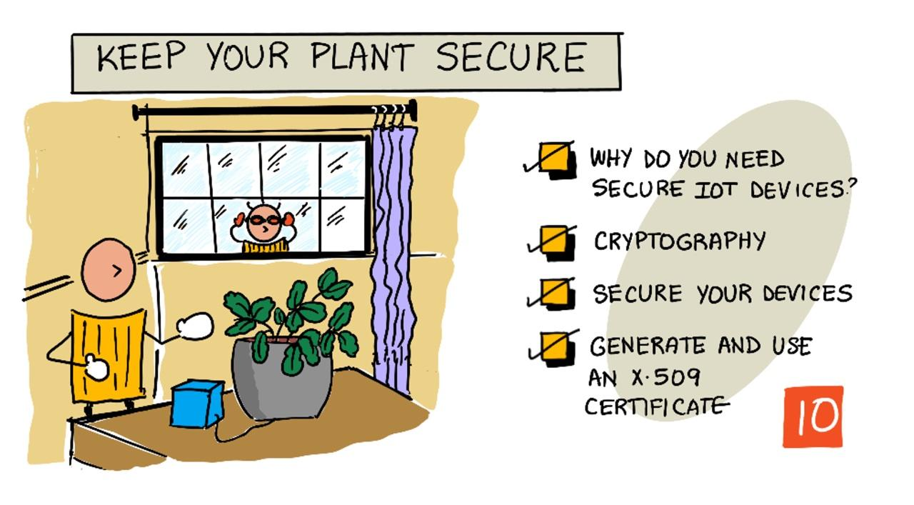

<!--
CO_OP_TRANSLATOR_METADATA:
{
  "original_hash": "81c437c568eee1b0dda1f04e88150d37",
  "translation_date": "2025-08-27T21:37:01+00:00",
  "source_file": "2-farm/lessons/6-keep-your-plant-secure/README.md",
  "language_code": "he"
}
-->
# שמור על הצמח שלך בטוח



> סקיצה מאת [ניטיה נאראסימהן](https://github.com/nitya). לחץ על התמונה לגרסה גדולה יותר.

## שאלון לפני השיעור

[שאלון לפני השיעור](https://black-meadow-040d15503.1.azurestaticapps.net/quiz/19)

## מבוא

בשיעורים האחרונים יצרת מכשיר IoT לניטור קרקע וחיברת אותו לענן. אבל מה יקרה אם האקרים שעובדים עבור חקלאי מתחרה ישתלטו על מכשירי ה-IoT שלך? מה אם הם ישלחו נתוני לחות קרקע גבוהים כך שהצמחים שלך לעולם לא יקבלו מים, או יפעילו את מערכת ההשקיה שלך ללא הפסקה, מה שיגרום לצמחים שלך למות מהשקיית יתר ויעלה לך הון קטן במים?

בשיעור הזה תלמד כיצד לאבטח מכשירי IoT. מכיוון שזהו השיעור האחרון בפרויקט הזה, תלמד גם כיצד לנקות את משאבי הענן שלך, כדי להפחית עלויות פוטנציאליות.

בשיעור הזה נעסוק ב:

* [למה צריך לאבטח מכשירי IoT?](../../../../../2-farm/lessons/6-keep-your-plant-secure)
* [קריפטוגרפיה](../../../../../2-farm/lessons/6-keep-your-plant-secure)
* [אבטחת מכשירי IoT](../../../../../2-farm/lessons/6-keep-your-plant-secure)
* [יצירה ושימוש בתעודת X.509](../../../../../2-farm/lessons/6-keep-your-plant-secure)

> 🗑 זהו השיעור האחרון בפרויקט הזה, אז לאחר שתסיים את השיעור ואת המשימה, אל תשכח לנקות את שירותי הענן שלך. תצטרך את השירותים כדי להשלים את המשימה, אז וודא שאתה מסיים אותה קודם.
>
> עיין ב[מדריך לניקוי הפרויקט שלך](../../../clean-up.md) אם אתה זקוק להוראות כיצד לעשות זאת.

## למה צריך לאבטח מכשירי IoT?

אבטחת IoT כוללת הבטחה שרק מכשירים צפויים יכולים להתחבר לשירות הענן שלך ולשלוח אליו נתונים, ורק שירות הענן שלך יכול לשלוח פקודות למכשירים שלך. נתוני IoT יכולים להיות גם אישיים, כולל נתונים רפואיים או אינטימיים, ולכן כל האפליקציה שלך צריכה לקחת בחשבון אבטחה כדי למנוע דליפת נתונים אלו.

אם אפליקציית ה-IoT שלך אינה מאובטחת, ישנם מספר סיכונים:

* מכשיר מזויף יכול לשלוח נתונים שגויים, מה שיגרום לאפליקציה שלך להגיב בצורה שגויה. לדוגמה, הם יכולים לשלוח נתוני לחות קרקע גבוהים באופן קבוע, כך שמערכת ההשקיה שלך לעולם לא תופעל והצמחים שלך ימותו מחוסר מים.
* משתמשים לא מורשים יכולים לקרוא נתונים ממכשירי IoT, כולל נתונים אישיים או קריטיים לעסק.
* האקרים יכולים לשלוח פקודות לשלוט במכשיר בצורה שעלולה לגרום נזק למכשיר או לחומרה המחוברת אליו.
* על ידי התחברות למכשיר IoT, האקרים יכולים להשתמש בו כדי לגשת לרשתות נוספות ולהשיג גישה למערכות פרטיות.
* משתמשים זדוניים יכולים לגשת לנתונים אישיים ולהשתמש בהם לסחיטה.

אלו תרחישים אמיתיים, והם מתרחשים כל הזמן. כמה דוגמאות ניתנו בשיעורים קודמים, אבל הנה עוד כמה:

* בשנת 2018, האקרים השתמשו בנקודת גישה WiFi פתוחה על תרמוסטט של אקווריום כדי להשיג גישה לרשת של קזינו ולגנוב נתונים. [The Hacker News - Casino Gets Hacked Through Its Internet-Connected Fish Tank Thermometer](https://thehackernews.com/2018/04/iot-hacking-thermometer.html)
* בשנת 2016, רשת הבוטים Mirai השיקה מתקפת מניעת שירות נגד Dyn, ספק שירותי אינטרנט, וגרמה להשבתת חלקים גדולים מהאינטרנט. רשת הבוטים הזו השתמשה בתוכנה זדונית כדי להתחבר למכשירי IoT כמו DVRs ומצלמות שהשתמשו בשמות משתמש וסיסמאות ברירת מחדל, ומשם השיקה את המתקפה. [The Guardian - DDoS attack that disrupted internet was largest of its kind in history, experts say](https://www.theguardian.com/technology/2016/oct/26/ddos-attack-dyn-mirai-botnet)
* Spiral Toys החזיקה מסד נתונים של משתמשי צעצועי CloudPets המחוברים שלה זמין לציבור באינטרנט. [Troy Hunt - Data from connected CloudPets teddy bears leaked and ransomed, exposing kids' voice messages](https://www.troyhunt.com/data-from-connected-cloudpets-teddy-bears-leaked-and-ransomed-exposing-kids-voice-messages/).
* אפליקציית Strava תייגה רצים שעברו לידך והראתה את המסלולים שלהם, מה שאיפשר לזרים לראות למעשה היכן אתה גר. [Kim Komndo - Fitness app could lead a stranger right to your home — change this setting](https://www.komando.com/security-privacy/strava-fitness-app-privacy/755349/).

✅ בצע מחקר: חפש דוגמאות נוספות לפריצות IoT ודליפות נתונים של IoT, במיוחד עם פריטים אישיים כמו מברשות שיניים או מאזניים המחוברים לאינטרנט. חשוב על ההשפעה שיכולה להיות לפריצות אלו על הקורבנות או הלקוחות.

> 💁 אבטחה היא נושא עצום, והשיעור הזה ייגע רק בכמה מהיסודות סביב חיבור המכשיר שלך לענן. נושאים אחרים שלא יכוסו כוללים ניטור שינויים בנתונים בזמן מעבר, פריצה ישירה למכשירים, או שינויים בתצורות מכשירים. פריצות IoT הן איום כה גדול, כלים כמו [Azure Defender for IoT](https://azure.microsoft.com/services/azure-defender-for-iot/?WT.mc_id=academic-17441-jabenn) פותחו. כלים אלו דומים לכלי האנטי-וירוס והאבטחה שיש לך במחשב, רק שהם מיועדים למכשירי IoT קטנים ובעלי צריכת חשמל נמוכה.

## קריפטוגרפיה

כאשר מכשיר מתחבר לשירות IoT, הוא משתמש במזהה כדי לזהות את עצמו. הבעיה היא שמזהה זה יכול להיות משוכפל - האקר יכול להקים מכשיר זדוני שמשתמש באותו מזהה כמו מכשיר אמיתי אך שולח נתונים מזויפים.


הפתרון לכך הוא להמיר את הנתונים הנשלחים לפורמט מוצפן, באמצעות ערך מסוים הידוע רק למכשיר ולענן. תהליך זה נקרא *הצפנה*, והערך המשמש להצפנת הנתונים נקרא *מפתח הצפנה*.


שירות הענן יכול אז להמיר את הנתונים בחזרה לפורמט קריא, באמצעות תהליך שנקרא *פענוח*, באמצעות אותו מפתח הצפנה או *מפתח פענוח*. אם ההודעה המוצפנת לא ניתנת לפענוח על ידי המפתח, המכשיר נפרץ וההודעה נדחית.

הטכניקה לביצוע הצפנה ופענוח נקראת *קריפטוגרפיה*.

### קריפטוגרפיה מוקדמת

סוגי הקריפטוגרפיה הראשונים היו צופנים החלפה, המתוארכים ל-3,500 שנים אחורה. צופני החלפה כוללים החלפת אות אחת באחרת. לדוגמה, [צופן קיסר](https://wikipedia.org/wiki/Caesar_cipher) כולל הזזת האלפבית בכמות מוגדרת, כאשר רק שולח ההודעה המוצפנת והמקבל המיועד יודעים כמה אותיות להזיז.

[צופן ויז'נר](https://wikipedia.org/wiki/Vigenère_cipher) לקח זאת צעד קדימה על ידי שימוש במילים להצפנת טקסט, כך שכל אות בטקסט המקורי הוזזה בכמות שונה, במקום תמיד להזיז באותו מספר אותיות.

קריפטוגרפיה שימשה למגוון רחב של מטרות, כמו הגנה על מתכון לזיגוג של קדרים במסופוטמיה העתיקה, כתיבת פתקים אהבה סודיים בהודו, או שמירה על סודות של לחשים קסומים במצרים העתיקה.

### קריפטוגרפיה מודרנית

קריפטוגרפיה מודרנית מתקדמת הרבה יותר, מה שהופך אותה לקשה יותר לפיצוח מאשר שיטות מוקדמות. קריפטוגרפיה מודרנית משתמשת במתמטיקה מורכבת להצפנת נתונים עם יותר מדי מפתחות אפשריים מכדי לאפשר מתקפות כוח גס.

קריפטוגרפיה משמשת בדרכים רבות לתקשורת מאובטחת. אם אתה קורא את הדף הזה ב-GitHub, ייתכן שתבחין שכתובת האתר מתחילה ב-*HTTPS*, מה שאומר שהתקשורת בין הדפדפן שלך לשרתי האינטרנט של GitHub מוצפנת. אם מישהו היה מצליח לקרוא את תעבורת האינטרנט בין הדפדפן שלך ל-GitHub, הוא לא היה יכול לקרוא את הנתונים מכיוון שהם מוצפנים. ייתכן שהמחשב שלך אפילו מצפין את כל הנתונים על הכונן הקשיח כך שאם מישהו יגנוב אותו, הוא לא יוכל לקרוא אף אחד מהנתונים שלך ללא הסיסמה שלך.

> 🎓 HTTPS מייצג HyperText Transfer Protocol **Secure**

למרבה הצער, לא הכל מאובטח. חלק מהמכשירים אינם מאובטחים כלל, אחרים מאובטחים באמצעות מפתחות שקל לפצח, או לפעמים אפילו כל המכשירים מאותו סוג משתמשים באותו מפתח. היו דיווחים על מכשירי IoT אישיים מאוד שלכולם יש את אותה סיסמה להתחבר אליהם דרך WiFi או Bluetooth. אם אתה יכול להתחבר למכשיר שלך, אתה יכול להתחבר למכשיר של מישהו אחר. ברגע שמתחברים, ניתן לגשת לנתונים אישיים מאוד או לשלוט במכשיר שלהם.

> 💁 למרות המורכבות של קריפטוגרפיה מודרנית והטענות שפיצוח הצפנה יכול לקחת מיליארדי שנים, עליית המחשוב הקוונטי הובילה לאפשרות של פיצוח כל ההצפנות הידועות בזמן קצר מאוד!

### מפתחות סימטריים ואסימטריים

הצפנה מגיעה בשני סוגים - סימטרית ואסימטרית.

**הצפנה סימטרית** משתמשת באותו מפתח להצפנה ולפענוח הנתונים. גם השולח וגם המקבל צריכים לדעת את אותו מפתח. זהו הסוג הפחות מאובטח, מכיוון שהמפתח צריך להיות משותף איכשהו. כדי שהשולח ישלח הודעה מוצפנת למקבל, השולח עשוי קודם לשלוח למקבל את המפתח.


אם המפתח נגנב במהלך השיתוף, או אם השולח או המקבל נפרצים והמפתח מתגלה, ההצפנה יכולה להיפרץ.


**הצפנה אסימטרית** משתמשת בשני מפתחות - מפתח הצפנה ומפתח פענוח, המכונים זוג מפתחות ציבורי/פרטי. המפתח הציבורי משמש להצפנת ההודעה, אך לא ניתן להשתמש בו לפענוח, והמפתח הפרטי משמש לפענוח ההודעה אך לא ניתן להשתמש בו להצפנה.


המקבל משתף את המפתח הציבורי שלו, והשולח משתמש בו להצפנת ההודעה. לאחר שליחת ההודעה, המקבל מפענח אותה באמצעות המפתח הפרטי שלו. הצפנה אסימטרית מאובטחת יותר מכיוון שהמפתח הפרטי נשמר פרטי על ידי המקבל ולעולם לא משותף. כל אחד יכול לקבל את המפתח הציבורי מכיוון שניתן להשתמש בו רק להצפנת הודעות.

הצפנה סימטרית מהירה יותר מהצפנה אסימטרית, הצפנה אסימטרית מאובטחת יותר. חלק מהמערכות ישתמשו בשתיהן - ישתמשו בהצפנה אסימטרית להצפנה ושיתוף של המפתח הסימטרי, ואז ישתמשו במפתח הסימטרי להצפנת כל הנתונים. זה הופך את שיתוף המפתח הסימטרי בין השולח והמקבל לבטוח יותר, ומהיר יותר בעת הצפנה ופענוח נתונים.

## אבטחת מכשירי IoT

ניתן לאבטח מכשירי IoT באמצעות הצפנה סימטרית או אסימטרית. הצפנה סימטרית קלה יותר, אך פחות מאובטחת.

### מפתחות סימטריים

כאשר הגדרת את מכשיר ה-IoT שלך לתקשר עם IoT Hub, השתמשת במחרוזת חיבור. דוגמה למחרוזת חיבור היא:

```output
HostName=soil-moisture-sensor.azure-devices.net;DeviceId=soil-moisture-sensor;SharedAccessKey=Bhry+ind7kKEIDxubK61RiEHHRTrPl7HUow8cEm/mU0=
```

מחרוזת החיבור הזו מורכבת משלושה חלקים המופרדים בנקודה-פסיק, כאשר כל חלק הוא מפתח וערך:

| מפתח | ערך | תיאור |
| --- | ----- | ----------- |
| HostName | `soil-moisture-sensor.azure-devices.net` | כתובת ה-URL של ה-IoT Hub |
| DeviceId | `soil-moisture-sensor` | מזהה ייחודי של המכשיר |
| SharedAccessKey | `Bhry+ind7kKEIDxubK61RiEHHRTrPl7HUow8cEm/mU0=` | מפתח סימטרי הידוע למכשיר ול-IoT Hub |

החלק האחרון של מחרוזת החיבור הזו, ה-`SharedAccessKey`, הוא המפתח הסימטרי הידוע גם למכשיר וגם ל-IoT Hub. מפתח זה לעולם לא נשלח מהמכשיר לענן או מהענן למכשיר. במקום זאת, הוא משמש להצפנת נתונים שנשלחים או מתקבלים.

✅ בצע ניסוי. מה לדעתך יקרה אם תשנה את החלק `SharedAccessKey` במחרוזת החיבור בעת חיבור מכשיר ה-IoT שלך? נסה זאת.

כאשר המכשיר מנסה להתחבר לראשונה, הוא שולח אסימון גישה משותפת (SAS) שמורכב מכתובת ה-URL של ה-IoT Hub, חותמת זמן שבה האסימון יפוג (בדרך כלל יום אחד מהזמן הנוכחי), וחתימה. החתימה הזו מורכבת מכתובת ה-URL וזמן הפקיעה מוצפנים עם המפתח הסימטרי ממחרוזת החיבור.

ה-IoT Hub מפענח את החתימה הזו עם המפתח הסימטרי, ואם הערך המפוענח תואם לכתובת ה-URL ולזמן הפקיעה, המכשיר מורשה להתחבר. הוא גם מאמת שהזמן הנוכחי הוא לפני זמן הפקיעה, כדי למנוע ממכשיר זדוני ללכוד את אסימון ה-SAS של מכשיר אמיתי ולהשתמש בו.

זהו פתרון אלגנטי לאימות שהשולח הוא המכשיר הנכון. על ידי שליחת נתונים ידועים הן בצורה מפוענחת והן בצורה מוצפנת, השרת יכול לאמת את המכשיר על ידי הבטחה שכאשר הוא מפענח את הנתונים המוצפנים, התוצאה תואמת לגרסה המפוענחת שנשלחה. אם זה תואם, אז גם השולח וגם המקבל מחזיקים באותו מפתח הצפנה סימטרי.
💁 בגלל זמן התפוגה, מכשיר ה-IoT שלך צריך לדעת את הזמן המדויק, בדרך כלל נקרא משרת [NTP](https://wikipedia.org/wiki/Network_Time_Protocol). אם הזמן אינו מדויק, החיבור ייכשל.
לאחר החיבור, כל הנתונים שנשלחים ל-IoT Hub מהמכשיר, או למכשיר מה-IoT Hub, יותאמו באמצעות מפתח הגישה המשותף.

✅ מה לדעתך יקרה אם מספר מכשירים ישתמשו באותו מחרוזת חיבור?

> 💁 זו פרקטיקה אבטחתית גרועה לשמור את המפתח הזה בקוד. אם האקר יקבל גישה לקוד המקור שלך, הוא יוכל להשיג את המפתח. בנוסף, זה מקשה על שחרור קוד, מכיוון שתצטרך לקמפל מחדש עם מפתח מעודכן לכל מכשיר. עדיף לטעון את המפתח הזה ממודול אבטחה חומרתי - שבב במכשיר ה-IoT שמאחסן ערכים מוצפנים שניתן לקרוא על ידי הקוד שלך.
>
> כאשר לומדים IoT, לעיתים קל יותר לשים את המפתח בקוד, כפי שעשית בשיעור קודם, אך עליך לוודא שהמפתח הזה לא נבדק לתוך מערכת בקרת קוד מקור ציבורית.

למכשירים יש שני מפתחות ושתי מחרוזות חיבור תואמות. זה מאפשר לך לסובב את המפתחות - כלומר לעבור ממפתח אחד לשני אם הראשון נפרץ, וליצור מחדש את המפתח הראשון.

### תעודות X.509

כאשר אתה משתמש בהצפנה אסימטרית עם זוג מפתחות ציבורי/פרטי, עליך לספק את המפתח הציבורי שלך לכל מי שרוצה לשלוח לך נתונים. הבעיה היא, איך יכול המקבל של המפתח שלך להיות בטוח שזה באמת המפתח הציבורי שלך, ולא של מישהו שמעמיד פנים שהוא אתה? במקום לספק מפתח, אתה יכול לספק את המפתח הציבורי שלך בתוך תעודה שאושרה על ידי צד שלישי מהימן, הנקראת תעודת X.509.

תעודות X.509 הן מסמכים דיגיטליים שמכילים את החלק הציבורי של זוג המפתחות הציבורי/פרטי. בדרך כלל הן מונפקות על ידי אחד מארגונים מהימנים הנקראים [רשויות אישור](https://wikipedia.org/wiki/Certificate_authority) (CAs), ונחתמות דיגיטלית על ידי ה-CA כדי לציין שהמפתח תקף ומגיע ממך. אתה סומך על התעודה ועל כך שהמפתח הציבורי מגיע ממי שהתעודה אומרת שהוא מגיע ממנו, כי אתה סומך על ה-CA, בדומה לאיך שאתה סומך על דרכון או רישיון נהיגה כי אתה סומך על המדינה שהנפיקה אותו. תעודות עולות כסף, אז אתה יכול גם 'לחתום בעצמך', כלומר ליצור תעודה בעצמך שחתומה על ידך, לצורכי בדיקה.

> 💁 לעולם אל תשתמש בתעודה חתומה בעצמך לשחרור בייצור.

לתעודות אלו יש מספר שדות, כולל מי המפתח הציבורי מגיע ממנו, פרטי ה-CA שהנפיק אותה, כמה זמן היא תקפה, והמפתח הציבורי עצמו. לפני השימוש בתעודה, זהו נוהג טוב לאמת אותה על ידי בדיקה שהיא נחתמה על ידי ה-CA המקורי.

✅ תוכל לקרוא רשימה מלאה של השדות בתעודה במדריך [Microsoft Understanding X.509 Public Key Certificates tutorial](https://docs.microsoft.com/azure/iot-hub/tutorial-x509-certificates?WT.mc_id=academic-17441-jabenn#certificate-fields)

כאשר משתמשים בתעודות X.509, גם השולח וגם המקבל יהיו בעלי מפתחות ציבוריים ופרטיים משלהם, כמו גם תעודות X.509 שמכילות את המפתח הציבורי. הם מחליפים תעודות X.509 בדרך כלשהי, ומשתמשים במפתחות הציבוריים של זה כדי להצפין את הנתונים שהם שולחים, ובמפתח הפרטי שלהם כדי לפענח את הנתונים שהם מקבלים.


יתרון גדול בשימוש בתעודות X.509 הוא שניתן לשתף אותן בין מכשירים. אתה יכול ליצור תעודה אחת, להעלות אותה ל-IoT Hub, ולהשתמש בה עבור כל המכשירים שלך. כל מכשיר צריך רק לדעת את המפתח הפרטי כדי לפענח את ההודעות שהוא מקבל מ-IoT Hub.

התעודה שבה המכשיר שלך משתמש כדי להצפין הודעות שהוא שולח ל-IoT Hub מתפרסמת על ידי Microsoft. זו אותה תעודה שבה משתמשים שירותים רבים של Azure, ולעיתים היא מובנית ב-SDKs.

> 💁 זכור, מפתח ציבורי הוא בדיוק זה - ציבורי. המפתח הציבורי של Azure יכול לשמש רק להצפנת נתונים שנשלחים ל-Azure, לא לפענוחם, ולכן ניתן לשתף אותו בכל מקום, כולל בקוד המקור. לדוגמה, תוכל לראות אותו בקוד המקור של [Azure IoT C SDK](https://github.com/Azure/azure-iot-sdk-c/blob/master/certs/certs.c).

✅ יש הרבה מונחים מקצועיים עם תעודות X.509. תוכל לקרוא את ההגדרות של כמה מהמונחים שאתה עשוי להיתקל בהם במדריך [The layman’s guide to X.509 certificate jargon](https://techcommunity.microsoft.com/t5/internet-of-things/the-layman-s-guide-to-x-509-certificate-jargon/ba-p/2203540?WT.mc_id=academic-17441-jabenn)

## יצירה ושימוש בתעודת X.509

השלבים ליצירת תעודת X.509 הם:

1. יצירת זוג מפתחות ציבורי/פרטי. אחד האלגוריתמים הנפוצים ביותר ליצירת זוג מפתחות ציבורי/פרטי נקרא [Rivest–Shamir–Adleman](https://wikipedia.org/wiki/RSA_(cryptosystem))(RSA).

1. הגשת המפתח הציבורי עם נתונים קשורים לחתימה, על ידי CA או על ידי חתימה עצמית.

ל-Azure CLI יש פקודות ליצירת זהות מכשיר חדשה ב-IoT Hub, וליצירת זוג מפתחות ציבורי/פרטי ותעודה חתומה עצמית באופן אוטומטי.

> 💁 אם ברצונך לראות את השלבים בפירוט, במקום להשתמש ב-Azure CLI, תוכל למצוא אותם במדריך [Using OpenSSL to create self-signed certificates tutorial in the Microsoft IoT Hub documentation](https://docs.microsoft.com/azure/iot-hub/tutorial-x509-self-sign?WT.mc_id=academic-17441-jabenn)

### משימה - יצירת זהות מכשיר באמצעות תעודת X.509

1. הרץ את הפקודה הבאה כדי לרשום את זהות המכשיר החדשה, וליצור באופן אוטומטי את המפתחות והתעודות:

    ```sh
    az iot hub device-identity create --device-id soil-moisture-sensor-x509 \
                                      --am x509_thumbprint \
                                      --output-dir . \
                                      --hub-name <hub_name>
    ```

    החלף את `<hub_name>` בשם שבו השתמשת עבור ה-IoT Hub שלך.

    פעולה זו תיצור מכשיר עם מזהה `soil-moisture-sensor-x509` כדי להבדיל מזהות המכשיר שיצרת בשיעור הקודם. פקודה זו תיצור גם שני קבצים בתיקייה הנוכחית:

    * `soil-moisture-sensor-x509-key.pem` - קובץ זה מכיל את המפתח הפרטי של המכשיר.
    * `soil-moisture-sensor-x509-cert.pem` - זהו קובץ תעודת X.509 של המכשיר.

    שמור את הקבצים הללו במקום בטוח! קובץ המפתח הפרטי לא צריך להיבדק לתוך מערכת בקרת קוד מקור ציבורית.

### משימה - שימוש בתעודת X.509 בקוד המכשיר שלך

עבור דרך המדריך הרלוונטי כדי לחבר את מכשיר ה-IoT שלך לענן באמצעות תעודת X.509:

* [Arduino - Wio Terminal](wio-terminal-x509.md)
* [מחשב לוח יחיד - Raspberry Pi/מכשיר IoT וירטואלי](single-board-computer-x509.md)

---

## 🚀 אתגר

ישנן דרכים רבות ליצור, לנהל ולמחוק שירותי Azure כמו קבוצות משאבים ו-IoT Hubs. אחת הדרכים היא [Azure Portal](https://portal.azure.com?WT.mc_id=academic-17441-jabenn) - ממשק מבוסס אינטרנט שמספק לך GUI לניהול שירותי Azure שלך.

גש ל-[portal.azure.com](https://portal.azure.com?WT.mc_id=academic-17441-jabenn) וחקור את הפורטל. נסה ליצור IoT Hub באמצעות הפורטל, ואז למחוק אותו.

**רמז** - כאשר יוצרים שירותים דרך הפורטל, אין צורך ליצור קבוצת משאבים מראש, ניתן ליצור אחת בזמן יצירת השירות. ודא שאתה מוחק אותה כשאתה מסיים!

תוכל למצוא שפע של תיעוד, מדריכים והנחיות על Azure Portal בתיעוד [Azure portal documentation](https://docs.microsoft.com/azure/azure-portal/?WT.mc_id=academic-17441-jabenn).

## שאלון לאחר ההרצאה

[שאלון לאחר ההרצאה](https://black-meadow-040d15503.1.azurestaticapps.net/quiz/20)

## סקירה ולימוד עצמי

* קרא על ההיסטוריה של קריפטוגרפיה בעמוד [History of cryptography page on Wikipedia](https://wikipedia.org/wiki/History_of_cryptography).
* קרא על תעודות X.509 בעמוד [X.509 page on Wikipedia](https://wikipedia.org/wiki/X.509).

## משימה

[בנה מכשיר IoT חדש](assignment.md)

---

**כתב ויתור**:  
מסמך זה תורגם באמצעות שירות תרגום מבוסס בינה מלאכותית [Co-op Translator](https://github.com/Azure/co-op-translator). למרות שאנו שואפים לדיוק, יש לקחת בחשבון שתרגומים אוטומטיים עשויים להכיל שגיאות או אי דיוקים. המסמך המקורי בשפתו המקורית צריך להיחשב כמקור סמכותי. עבור מידע קריטי, מומלץ להשתמש בתרגום מקצועי על ידי אדם. איננו נושאים באחריות לאי הבנות או לפרשנויות שגויות הנובעות משימוש בתרגום זה.