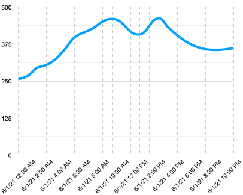

<!--
CO_OP_TRANSLATOR_METADATA:
{
  "original_hash": "9095c61445c2bca7245ef9b59a186a11",
  "translation_date": "2025-08-27T22:58:37+00:00",
  "source_file": "3-transport/lessons/3-visualize-location-data/README.md",
  "language_code": "he"
}
-->
# הצגת נתוני מיקום


> סקיצה מאת [ניטיה נאראסימן](https://github.com/nitya). לחצו על התמונה לגרסה גדולה יותר.

הווידאו הזה מספק סקירה כללית על Azure Maps עם IoT, שירות שיכוסה בשיעור הזה.

[](https://www.youtube.com/watch?v=P5i2GFTtb2s)

> 🎥 לחצו על התמונה למעלה לצפייה בווידאו

## שאלון לפני השיעור

[שאלון לפני השיעור](https://black-meadow-040d15503.1.azurestaticapps.net/quiz/25)

## מבוא

בשיעור הקודם למדתם כיצד לקבל נתוני GPS מהחיישנים שלכם ולשמור אותם בענן במיכל אחסון באמצעות קוד ללא שרת. עכשיו תגלו כיצד להציג את הנקודות הללו על מפה של Azure. תלמדו כיצד ליצור מפה בדף אינטרנט, להכיר את פורמט הנתונים GeoJSON וכיצד להשתמש בו כדי למקם את כל נקודות ה-GPS שנאספו על המפה שלכם.

בשיעור הזה נעסוק ב:

* [מהי הצגת נתונים](../../../../../3-transport/lessons/3-visualize-location-data)
* [שירותי מפות](../../../../../3-transport/lessons/3-visualize-location-data)
* [יצירת משאב Azure Maps](../../../../../3-transport/lessons/3-visualize-location-data)
* [הצגת מפה בדף אינטרנט](../../../../../3-transport/lessons/3-visualize-location-data)
* [פורמט GeoJSON](../../../../../3-transport/lessons/3-visualize-location-data)
* [מיקום נתוני GPS על מפה באמצעות GeoJSON](../../../../../3-transport/lessons/3-visualize-location-data)

> 💁 השיעור הזה יכלול כמות קטנה של HTML ו-JavaScript. אם תרצו ללמוד יותר על פיתוח אתרים באמצעות HTML ו-JavaScript, עיינו ב-[פיתוח אתרים למתחילים](https://github.com/microsoft/Web-Dev-For-Beginners).

## מהי הצגת נתונים

הצגת נתונים, כפי שהשם מרמז, עוסקת בהצגת נתונים בדרכים שמקלות על בני אדם להבין אותם. בדרך כלל היא קשורה לגרפים וטבלאות, אך היא כל דרך לייצוג נתונים בצורה חזותית שמסייעת לבני אדם לא רק להבין את הנתונים טוב יותר, אלא גם לקבל החלטות.

לדוגמה פשוטה - בפרויקט החווה אספתם נתוני לחות קרקע. טבלה של נתוני לחות קרקע שנאספו כל שעה ב-1 ביוני 2021 עשויה להיראות כך:

| תאריך           | קריאה |
| ---------------- | ------: |
| 01/06/2021 00:00 |     257 |
| 01/06/2021 01:00 |     268 |
| 01/06/2021 02:00 |     295 |
| 01/06/2021 03:00 |     305 |
| 01/06/2021 04:00 |     325 |
| 01/06/2021 05:00 |     359 |
| 01/06/2021 06:00 |     398 |
| 01/06/2021 07:00 |     410 |
| 01/06/2021 08:00 |     429 |
| 01/06/2021 09:00 |     451 |
| 01/06/2021 10:00 |     460 |
| 01/06/2021 11:00 |     452 |
| 01/06/2021 12:00 |     420 |
| 01/06/2021 13:00 |     408 |
| 01/06/2021 14:00 |     431 |
| 01/06/2021 15:00 |     462 |
| 01/06/2021 16:00 |     432 |
| 01/06/2021 17:00 |     402 |
| 01/06/2021 18:00 |     387 |
| 01/06/2021 19:00 |     360 |
| 01/06/2021 20:00 |     358 |
| 01/06/2021 21:00 |     354 |
| 01/06/2021 22:00 |     356 |
| 01/06/2021 23:00 |     362 |

כבן אדם, להבין את הנתונים הללו יכול להיות קשה. זו חומת מספרים ללא משמעות. כצעד ראשון להצגת הנתונים, ניתן למקם אותם על גרף קו:


ניתן לשפר את הגרף הזה על ידי הוספת קו שמציין מתי מערכת ההשקיה האוטומטית הופעלה בקריאת לחות קרקע של 450:



הגרף הזה מראה במהירות לא רק מה היו רמות לחות הקרקע, אלא גם את הנקודות שבהן מערכת ההשקיה הופעלה.

גרפים אינם הכלי היחיד להצגת נתונים. מכשירי IoT שעוקבים אחר מזג האוויר יכולים לכלול אפליקציות אינטרנט או אפליקציות מובייל שמציגות תנאי מזג אוויר באמצעות סמלים, כמו סמל ענן לימים מעוננים, ענן גשם לימים גשומים וכדומה. ישנם דרכים רבות להצגת נתונים, חלקן רציניות, חלקן משעשעות.

✅ חשבו על דרכים שבהן ראיתם נתונים מוצגים. אילו שיטות היו הברורות ביותר ואפשרו לכם לקבל החלטות במהירות?

ההצגות הטובות ביותר מאפשרות לבני אדם לקבל החלטות במהירות. לדוגמה, קיר של מדדים שמציג כל מיני קריאות ממכונות תעשייתיות קשה לעיבוד, אך אור אדום מהבהב כאשר משהו משתבש מאפשר לאדם לקבל החלטה. לפעמים ההצגה הטובה ביותר היא אור מהבהב!

כאשר עובדים עם נתוני GPS, ההצגה הברורה ביותר יכולה להיות למקם את הנתונים על מפה. מפה שמראה משאיות משלוחים, למשל, יכולה לעזור לעובדים במפעל לעיבוד לראות מתי משאיות יגיעו. אם המפה הזו מראה יותר מאשר רק תמונות של משאיות במיקומן הנוכחי, אלא גם נותנת מושג על תכולת המשאית, אז העובדים במפעל יכולים לתכנן בהתאם - אם הם רואים משאית קירור קרובה, הם יודעים להכין מקום במקרר.

## שירותי מפות

עבודה עם מפות היא תרגיל מעניין, ויש הרבה שירותים לבחירה כמו Bing Maps, Leaflet, Open Street Maps ו-Google Maps. בשיעור הזה תלמדו על [Azure Maps](https://azure.microsoft.com/services/azure-maps/?WT.mc_id=academic-17441-jabenn) וכיצד הם יכולים להציג את נתוני ה-GPS שלכם.


Azure Maps הוא "אוסף של שירותים גיאו-מרחביים ו-SDKs שמשתמשים בנתוני מפות עדכניים כדי לספק הקשר גיאוגרפי לאפליקציות אינטרנט ומובייל." מפתחים מקבלים כלים ליצירת מפות יפות ואינטראקטיביות שיכולות לעשות דברים כמו לספק מסלולי תנועה מומלצים, לתת מידע על תקריות תנועה, ניווט פנימי, יכולות חיפוש, מידע על גובה, שירותי מזג אוויר ועוד.

✅ נסו כמה [דוגמאות קוד של מפות](https://docs.microsoft.com/samples/browse?WT.mc_id=academic-17441-jabenn&products=azure-maps)

ניתן להציג את המפות כקנבס ריק, אריחים, תמונות לוויין, תמונות לוויין עם כבישים, סוגים שונים של מפות בגווני אפור, מפות עם הקלה מוצלת שמראות גובה, מפות תצוגת לילה ומפה עם ניגודיות גבוהה. ניתן לקבל עדכונים בזמן אמת על המפות שלכם על ידי שילוב עם [Azure Event Grid](https://azure.microsoft.com/services/event-grid/?WT.mc_id=academic-17441-jabenn). ניתן לשלוט בהתנהגות ובמראה של המפות שלכם על ידי הפעלת בקרות שונות שמאפשרות למפה להגיב לאירועים כמו צביטה, גרירה ולחיצה. כדי לשלוט במראה המפה, ניתן להוסיף שכבות שכוללות בועות, קווים, פוליגונים, מפות חום ועוד. סגנון המפה שתבחרו תלוי בבחירת ה-SDK שלכם.

ניתן לגשת ל-APIs של Azure Maps באמצעות [REST API](https://docs.microsoft.com/javascript/api/azure-maps-rest/?WT.mc_id=academic-17441-jabenn&view=azure-maps-typescript-latest), [Web SDK](https://docs.microsoft.com/azure/azure-maps/how-to-use-map-control?WT.mc_id=academic-17441-jabenn), או, אם אתם בונים אפליקציית מובייל, [Android SDK](https://docs.microsoft.com/azure/azure-maps/how-to-use-android-map-control-library?WT.mc_id=academic-17441-jabenn&pivots=programming-language-java-android).

בשיעור הזה, תשתמשו ב-Web SDK כדי לצייר מפה ולהציג את מסלול מיקום ה-GPS של החיישן שלכם.

## יצירת משאב Azure Maps

הצעד הראשון שלכם הוא ליצור חשבון Azure Maps.

### משימה - יצירת משאב Azure Maps

1. הריצו את הפקודה הבאה מהטרמינל או שורת הפקודה שלכם כדי ליצור משאב Azure Maps בקבוצת המשאבים `gps-sensor`:

    ```sh
    az maps account create --name gps-sensor \
                           --resource-group gps-sensor \
                           --accept-tos \
                           --sku S1
    ```

    זה ייצור משאב Azure Maps בשם `gps-sensor`. הרמה שבה משתמשים היא `S1`, שהיא רמה בתשלום שכוללת מגוון תכונות, אך עם כמות נדיבה של קריאות בחינם.

    > 💁 כדי לראות את העלות של שימוש ב-Azure Maps, עיינו ב-[דף המחירים של Azure Maps](https://azure.microsoft.com/pricing/details/azure-maps/?WT.mc_id=academic-17441-jabenn).

1. תצטרכו מפתח API עבור משאב המפות. השתמשו בפקודה הבאה כדי לקבל את המפתח הזה:

    ```sh
    az maps account keys list --name gps-sensor \
                              --resource-group gps-sensor \
                              --output table
    ```

    העתיקו את הערך של `PrimaryKey`.

## הצגת מפה בדף אינטרנט

עכשיו תוכלו לקחת את הצעד הבא שהוא להציג את המפה שלכם בדף אינטרנט. נשתמש רק בקובץ `html` אחד עבור אפליקציית האינטרנט הקטנה שלכם; זכרו שבסביבת ייצור או צוות, אפליקציית האינטרנט שלכם ככל הנראה תכלול יותר חלקים נעים!

### משימה - הצגת מפה בדף אינטרנט

1. צרו קובץ בשם index.html בתיקייה כלשהי במחשב המקומי שלכם. הוסיפו סימון HTML כדי להכיל מפה:

    ```html
    <html>
    <head>
        <style>
            #myMap {
                width:100%;
                height:100%;
            }
        </style>
    </head>
    
    <body onload="init()">
        <div id="myMap"></div>
    </body>
    </html>
    ```

    המפה תיטען בתוך ה-`div` בשם `myMap`. כמה סגנונות מאפשרים לה להתפרס על רוחב וגובה הדף.

    > 🎓 `div` הוא חלק מדף אינטרנט שניתן לתת לו שם ולעצב אותו.

1. מתחת לתג הפתיחה `<head>`, הוסיפו גיליון סגנונות חיצוני לשליטה בתצוגת המפה, וסקריפט חיצוני מ-Web SDK לניהול ההתנהגות שלה:

    ```html
    <link rel="stylesheet" href="https://atlas.microsoft.com/sdk/javascript/mapcontrol/2/atlas.min.css" type="text/css" />
    <script src="https://atlas.microsoft.com/sdk/javascript/mapcontrol/2/atlas.min.js"></script>
    ```

    גיליון הסגנונות הזה מכיל את ההגדרות למראה המפה, וקובץ הסקריפט מכיל קוד לטעינת המפה. הוספת הקוד הזה דומה להוספת קבצי כותרת ב-C++ או ייבוא מודולים ב-Python.

1. מתחת לסקריפט הזה, הוסיפו בלוק סקריפט להפעלת המפה.

    ```javascript
    <script type='text/javascript'>
        function init() {
            var map = new atlas.Map('myMap', {
                center: [-122.26473, 47.73444],
                zoom: 12,
                authOptions: {
                    authType: "subscriptionKey",
                    subscriptionKey: "<subscription_key>",

                }
            });
        }
    </script>
    ```

    החליפו `<subscription_key>` במפתח ה-API עבור חשבון Azure Maps שלכם.

    אם תפתחו את קובץ `index.html` שלכם בדפדפן אינטרנט, אתם אמורים לראות מפה נטענת, ממוקדת באזור סיאטל.

    

    ✅ נסו לשנות את פרמטרי הזום והמרכז כדי לשנות את תצוגת המפה שלכם. תוכלו להוסיף קואורדינטות שונות בהתאם לנתוני הרוחב והאורך שלכם כדי למרכז מחדש את המפה.

> 💁 דרך טובה יותר לעבוד עם אפליקציות אינטרנט באופן מקומי היא להתקין [http-server](https://www.npmjs.com/package/http-server). תצטרכו להתקין [node.js](https://nodejs.org/) ו-[npm](https://www.npmjs.com/) לפני השימוש בכלי הזה. לאחר התקנת הכלים הללו, תוכלו לנווט למיקום של קובץ `index.html` שלכם ולהקליד `http-server`. אפליקציית האינטרנט תיפתח בשרת אינטרנט מקומי [http://127.0.0.1:8080/](http://127.0.0.1:8080/).

## פורמט GeoJSON

עכשיו כשיש לכם את אפליקציית האינטרנט שלכם עם המפה מוצגת, אתם צריכים לחלץ נתוני GPS מחשבון האחסון שלכם ולהציג אותם בשכבת סמנים מעל המפה. לפני שנעשה זאת, בואו נסתכל על פורמט [GeoJSON](https://wikipedia.org/wiki/GeoJSON) הנדרש על ידי Azure Maps.

[GeoJSON](https://geojson.org/) הוא תקן פתוח של JSON עם פורמט מיוחד שמיועד לטיפול בנתונים גיאוגרפיים. תוכלו ללמוד עליו על ידי בדיקת נתונים לדוגמה באמצעות [geojson.io](https://geojson.io), שהוא גם כלי שימושי לניפוי שגיאות בקבצי GeoJSON.

נתוני GeoJSON לדוגמה נראים כך:

```json
{
  "type": "FeatureCollection",
  "features": [
    {
      "type": "Feature",
      "geometry": {
        "type": "Point",
        "coordinates": [
          -2.10237979888916,
          57.164918677004714
        ]
      }
    }
  ]
}
```

מה שמעניין במיוחד הוא הדרך שבה הנתונים מקוננים כ-`Feature` בתוך `FeatureCollection`. בתוך האובייקט הזה ניתן למצוא `geometry` עם `coordinates` שמציינים רוחב ואורך.

✅ כשאתם בונים את ה-GeoJSON שלכם, שימו לב לסדר של `latitude` ו-`longitude` באובייקט, אחרת הנקודות שלכם לא יופיעו במקום הנכון! GeoJSON מצפה לנתונים בסדר `lon,lat` עבור נקודות, ולא `lat,lon`.

`Geometry` יכול להיות בעל סוגים שונים, כמו נקודה אחת או פוליגון. בדוגמה הזו, מדובר בנקודה עם שני קואורדינטות שצוינו, האורך והרוחב.
✅ Azure Maps תומך ב-GeoJSON סטנדרטי בנוסף לכמה [תכונות מתקדמות](https://docs.microsoft.com/azure/azure-maps/extend-geojson?WT.mc_id=academic-17441-jabenn), כולל היכולת לצייר מעגלים וגיאומטריות אחרות.

## הצגת נתוני GPS על מפה באמצעות GeoJSON

עכשיו אתם מוכנים להשתמש בנתונים מהאחסון שבניתם בשיעור הקודם. כתזכורת, הנתונים נשמרים כקבצים באחסון Blob, ולכן תצטרכו לשלוף את הקבצים ולנתח אותם כך ש-Azure Maps יוכל להשתמש בנתונים.

### משימה - הגדרת אחסון לגישה מדף אינטרנט

אם תבצעו קריאה לאחסון שלכם כדי לשלוף את הנתונים, ייתכן שתופתעו לראות שגיאות שמופיעות בקונסול של הדפדפן שלכם. זה קורה מכיוון שעליכם להגדיר הרשאות ל-[CORS](https://developer.mozilla.org/docs/Web/HTTP/CORS) באחסון הזה כדי לאפשר לאפליקציות אינטרנט חיצוניות לקרוא את הנתונים.

> 🎓 CORS הוא ראשי תיבות של "שיתוף משאבים בין-מקורות" ובדרך כלל יש להגדיר אותו באופן מפורש ב-Azure מסיבות אבטחה. הוא מונע מאתרים לא צפויים לגשת לנתונים שלכם.

1. הריצו את הפקודה הבאה כדי להפעיל CORS:

    ```sh
    az storage cors add --methods GET \
                        --origins "*" \
                        --services b \
                        --account-name <storage_name> \
                        --account-key <key1>
    ```

    החליפו `<storage_name>` בשם חשבון האחסון שלכם. החליפו `<key1>` במפתח החשבון של חשבון האחסון שלכם.

    הפקודה הזו מאפשרת לכל אתר (הסימן `*` מייצג כל אתר) לבצע בקשת *GET*, כלומר לשלוף נתונים, מחשבון האחסון שלכם. `--services b` אומר להחיל את ההגדרה הזו רק על Blobs.

### משימה - טעינת נתוני GPS מהאחסון

1. החליפו את כל התוכן של פונקציית `init` בקוד הבא:

    ```javascript
    fetch("https://<storage_name>.blob.core.windows.net/gps-data/?restype=container&comp=list")
        .then(response => response.text())
        .then(str => new window.DOMParser().parseFromString(str, "text/xml"))
        .then(xml => {
            let blobList = Array.from(xml.querySelectorAll("Url"));
                blobList.forEach(async blobUrl => {
                    loadJSON(blobUrl.innerHTML)                
        });
    })
    .then( response => {
        map = new atlas.Map('myMap', {
            center: [-122.26473, 47.73444],
            zoom: 14,
            authOptions: {
                authType: "subscriptionKey",
                subscriptionKey: "<subscription_key>",
    
            }
        });
        map.events.add('ready', function () {
            var source = new atlas.source.DataSource();
            map.sources.add(source);
            map.layers.add(new atlas.layer.BubbleLayer(source));
            source.add(features);
        })
    })
    ```

    החליפו `<storage_name>` בשם חשבון האחסון שלכם. החליפו `<subscription_key>` במפתח ה-API של חשבון Azure Maps שלכם.

    יש כאן כמה דברים שמתרחשים. ראשית, הקוד שולף את נתוני ה-GPS שלכם ממיכל ה-Blob באמצעות כתובת URL שנבנית עם שם חשבון האחסון שלכם. כתובת ה-URL הזו שולפת מ-`gps-data`, מה שמצביע על כך שסוג המשאב הוא מיכל (`restype=container`), ומציגה מידע על כל ה-Blobs. הרשימה הזו לא תחזיר את ה-Blobs עצמם, אלא תחזיר כתובת URL לכל Blob שניתן להשתמש בה כדי לטעון את נתוני ה-Blob.

    > 💁 אתם יכולים להכניס את כתובת ה-URL הזו לדפדפן שלכם כדי לראות פרטים על כל ה-Blobs במיכל שלכם. לכל פריט תהיה תכונת `Url` שתוכלו גם לטעון בדפדפן כדי לראות את תוכן ה-Blob.

    הקוד הזה טוען לאחר מכן כל Blob, קורא לפונקציית `loadJSON`, שתיווצר בהמשך. לאחר מכן הוא יוצר את בקרת המפה ומוסיף קוד לאירוע `ready`. האירוע הזה מופעל כאשר המפה מוצגת בדף האינטרנט.

    האירוע `ready` יוצר מקור נתונים של Azure Maps - מיכל שמכיל נתוני GeoJSON שיתמלאו מאוחר יותר. מקור הנתונים הזה משמש ליצירת שכבת בועות - כלומר סט של מעגלים על המפה שממוקמים מעל כל נקודה ב-GeoJSON.

1. הוסיפו את פונקציית `loadJSON` לבלוק הסקריפט שלכם, מתחת לפונקציית `init`:

    ```javascript
    var map, features;

    function loadJSON(file) {
        var xhr = new XMLHttpRequest();
        features = [];
        xhr.onreadystatechange = function () {
            if (xhr.readyState === XMLHttpRequest.DONE) {
                if (xhr.status === 200) {
                    gps = JSON.parse(xhr.responseText)
                    features.push(
                        new atlas.data.Feature(new atlas.data.Point([parseFloat(gps.gps.lon), parseFloat(gps.gps.lat)]))
                    )
                }
            }
        };
        xhr.open("GET", file, true);
        xhr.send();
    }    
    ```

    הפונקציה הזו נקראת על ידי שגרת השליפה כדי לעבור דרך נתוני ה-JSON ולנתח אותם כך שניתן יהיה לקרוא אותם כקואורדינטות אורך ורוחב כ-GeoJSON.
    לאחר הניתוח, הנתונים מוגדרים כחלק מ-`Feature` של GeoJSON. המפה תאותחל ובועות קטנות יופיעו סביב המסלול שהנתונים שלכם מציירים:

1. טענו את דף ה-HTML בדפדפן שלכם. הוא יטען את המפה, ואז יטען את כל נתוני ה-GPS מהאחסון ויציג אותם על המפה.

    

> 💁 תוכלו למצוא את הקוד הזה בתיקיית [code](../../../../../3-transport/lessons/3-visualize-location-data/code).

---

## 🚀 אתגר

נחמד להציג נתונים סטטיים על מפה כנקודות ציון. האם תוכלו לשדרג את אפליקציית האינטרנט הזו כדי להוסיף אנימציה ולהציג את המסלול של הנקודות לאורך זמן, באמצעות קבצי JSON עם חותמות זמן? הנה [כמה דוגמאות](https://azuremapscodesamples.azurewebsites.net/) לשימוש באנימציה בתוך מפות.

## שאלון לאחר ההרצאה

[שאלון לאחר ההרצאה](https://black-meadow-040d15503.1.azurestaticapps.net/quiz/26)

## סקירה ולימוד עצמי

Azure Maps שימושי במיוחד לעבודה עם מכשירי IoT.

* חקרו כמה מהשימושים ב-[תיעוד Azure Maps באתר Microsoft Docs](https://docs.microsoft.com/azure/azure-maps/tutorial-iot-hub-maps?WT.mc_id=academic-17441-jabenn).
* העמיקו את הידע שלכם ביצירת מפות ונקודות ציון עם [מודול הלימוד העצמי "צור את אפליקציית המסלול הראשונה שלך עם Azure Maps" באתר Microsoft Learn](https://docs.microsoft.com/learn/modules/create-your-first-app-with-azure-maps/?WT.mc_id=academic-17441-jabenn).

## משימה

[פרסמו את האפליקציה שלכם](assignment.md)

---

**כתב ויתור**:  
מסמך זה תורגם באמצעות שירות תרגום מבוסס בינה מלאכותית [Co-op Translator](https://github.com/Azure/co-op-translator). למרות שאנו שואפים לדיוק, יש לקחת בחשבון שתרגומים אוטומטיים עשויים להכיל שגיאות או אי דיוקים. המסמך המקורי בשפתו המקורית צריך להיחשב כמקור סמכותי. עבור מידע קריטי, מומלץ להשתמש בתרגום מקצועי על ידי אדם. איננו נושאים באחריות לאי הבנות או לפרשנויות שגויות הנובעות משימוש בתרגום זה.