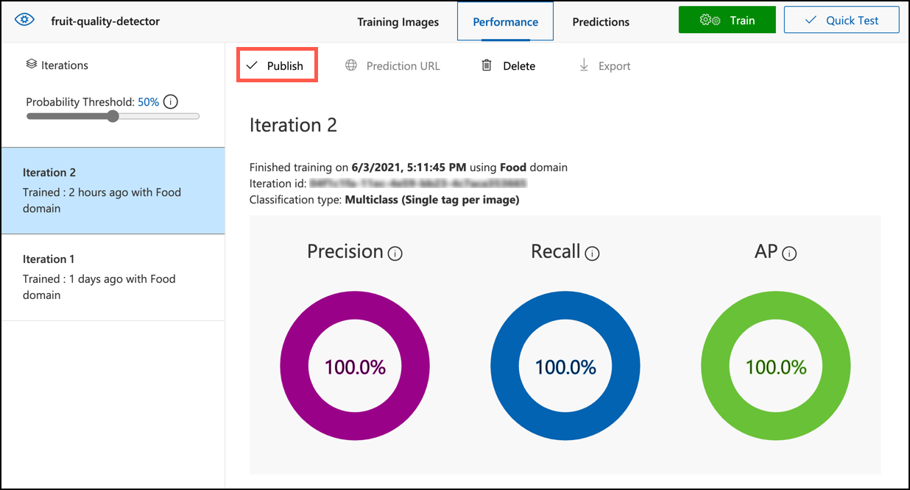

<!--
CO_OP_TRANSLATOR_METADATA:
{
  "original_hash": "557f4ee96b752e0651d2e6e74aa6bd14",
  "translation_date": "2025-08-27T20:40:02+00:00",
  "source_file": "4-manufacturing/lessons/2-check-fruit-from-device/README.md",
  "language_code": "he"
}
-->
# בדיקת איכות פירות באמצעות מכשיר IoT


> סקיצה מאת [ניטיה נאראסימן](https://github.com/nitya). לחצו על התמונה לגרסה גדולה יותר.

## שאלון לפני השיעור

[שאלון לפני השיעור](https://black-meadow-040d15503.1.azurestaticapps.net/quiz/31)

## הקדמה

בשיעור הקודם למדתם על מסווגי תמונות וכיצד לאמן אותם לזהות פירות טובים ורעים. כדי להשתמש במסווג תמונות זה באפליקציית IoT, עליכם להיות מסוגלים לצלם תמונה באמצעות מצלמה כלשהי ולשלוח אותה לענן לצורך סיווג.

בשיעור זה תלמדו על חיישני מצלמה וכיצד להשתמש בהם עם מכשיר IoT לצילום תמונה. בנוסף, תלמדו כיצד לקרוא למסווג התמונות ממכשיר ה-IoT שלכם.

בשיעור זה נעסוק ב:

* [חיישני מצלמה](../../../../../4-manufacturing/lessons/2-check-fruit-from-device)
* [צילום תמונה באמצעות מכשיר IoT](../../../../../4-manufacturing/lessons/2-check-fruit-from-device)
* [פרסום מסווג התמונות שלכם](../../../../../4-manufacturing/lessons/2-check-fruit-from-device)
* [סיווג תמונות ממכשיר ה-IoT שלכם](../../../../../4-manufacturing/lessons/2-check-fruit-from-device)
* [שיפור המודל](../../../../../4-manufacturing/lessons/2-check-fruit-from-device)

## חיישני מצלמה

חיישני מצלמה, כפי שהשם מרמז, הם מצלמות שניתן לחבר למכשיר IoT. הם יכולים לצלם תמונות סטילס או להקליט וידאו זורם. חלקם יחזירו נתוני תמונה גולמיים, בעוד אחרים ידחסו את הנתונים לקובץ תמונה כמו JPEG או PNG. בדרך כלל, המצלמות שעובדות עם מכשירי IoT קטנות יותר ובעלות רזולוציה נמוכה יותר ממה שאתם רגילים, אך ניתן להשיג מצלמות ברזולוציה גבוהה שמתחרות במצלמות של טלפונים מתקדמים. ניתן להשיג עדשות מתחלפות, מערכות מצלמות מרובות, מצלמות תרמיות אינפרא-אדום או מצלמות UV.


רוב חיישני המצלמה משתמשים בחיישני תמונה שבהם כל פיקסל הוא פוטודיודה. עדשה ממקדת את התמונה על חיישן התמונה, ואלפי או מיליוני פוטודיודות מזהות את האור הנופל על כל אחת מהן ומקליטות אותו כנתוני פיקסלים.

> 💁 עדשות הופכות תמונות, חיישן המצלמה הופך את התמונה חזרה לכיוון הנכון. זה אותו הדבר בעיניים שלכם - מה שאתם רואים מזוהה הפוך על גב העין והמוח מתקן זאת.

> 🎓 חיישן התמונה ידוע כחיישן פיקסלים פעיל (APS), והסוג הפופולרי ביותר של APS הוא חיישן מתכת-תחמוצת-משלימה (CMOS). ייתכן ששמעתם את המונח חיישן CMOS בהקשר של חיישני מצלמה.

חיישני מצלמה הם חיישנים דיגיטליים, שולחים נתוני תמונה כנתונים דיגיטליים, בדרך כלל בעזרת ספרייה שמספקת את התקשורת. מצלמות מתחברות באמצעות פרוטוקולים כמו SPI כדי לאפשר להן לשלוח כמויות גדולות של נתונים - תמונות גדולות משמעותית ממספרים בודדים מחיישן כמו חיישן טמפרטורה.

✅ מהם המגבלות סביב גודל תמונה במכשירי IoT? חשבו על המגבלות במיוחד בחומרת מיקרו-בקרים.

## צילום תמונה באמצעות מכשיר IoT

ניתן להשתמש במכשיר IoT שלכם לצילום תמונה לצורך סיווג.

### משימה - צילום תמונה באמצעות מכשיר IoT

עבדו לפי המדריך הרלוונטי לצילום תמונה באמצעות מכשיר IoT שלכם:

* [Arduino - Wio Terminal](wio-terminal-camera.md)
* [מחשב חד-לוח - Raspberry Pi](pi-camera.md)
* [מחשב חד-לוח - מכשיר וירטואלי](virtual-device-camera.md)

## פרסום מסווג התמונות שלכם

אימנתם את מסווג התמונות שלכם בשיעור הקודם. לפני שתוכלו להשתמש בו ממכשיר IoT שלכם, עליכם לפרסם את המודל.

### איטרציות של מודל

כאשר המודל שלכם היה בתהליך אימון בשיעור הקודם, ייתכן ששמתם לב כי בלשונית **ביצועים** מופיעות איטרציות בצד. כאשר אימנתם את המודל לראשונה, ראיתם *איטרציה 1* באימון. כאשר שיפרתם את המודל באמצעות תמונות התחזית, ראיתם *איטרציה 2* באימון.

בכל פעם שאתם מאמנים את המודל, נוצרת איטרציה חדשה. זוהי דרך לעקוב אחר גרסאות שונות של המודל שאומנו על מערכי נתונים שונים. כאשר אתם מבצעים **בדיקה מהירה**, יש תפריט נפתח שבו ניתן לבחור את האיטרציה, כך שתוכלו להשוות את התוצאות בין מספר איטרציות.

כאשר אתם מרוצים מאיטרציה מסוימת, ניתן לפרסם אותה כדי שתהיה זמינה לשימוש באפליקציות חיצוניות. כך תוכלו להחזיק גרסה שפורסמה ומשמשת את המכשירים שלכם, ואז לעבוד על גרסה חדשה לאורך מספר איטרציות ולפרסם אותה כאשר תהיו מרוצים ממנה.

### משימה - פרסום איטרציה

איטרציות מתפרסמות מפורטל Custom Vision.

1. פתחו את פורטל Custom Vision בכתובת [CustomVision.ai](https://customvision.ai) והתחברו אם הוא לא פתוח כבר. לאחר מכן פתחו את פרויקט `fruit-quality-detector` שלכם.

1. בחרו בלשונית **ביצועים** מתוך האפשרויות בראש הדף.

1. בחרו את האיטרציה האחרונה מתוך רשימת *איטרציות* בצד.

1. לחצו על כפתור **פרסום** עבור האיטרציה.

    

1. בדיאלוג *פרסום מודל*, הגדירו את *משאב התחזית* למשאב `fruit-quality-detector-prediction` שיצרתם בשיעור הקודם. השאירו את השם כ-`Iteration2`, ולחצו על כפתור **פרסום**.

1. לאחר הפרסום, לחצו על כפתור **כתובת URL לתחזית**. זה יציג את פרטי API התחזית, ותצטרכו אותם כדי לקרוא למודל ממכשיר IoT שלכם. החלק התחתון מסומן כ-*אם יש לכם קובץ תמונה*, וזה הפרטים שאתם צריכים. העתיקו את כתובת ה-URL שמוצגת, שתהיה משהו כמו:

    ```output
    https://<location>.api.cognitive.microsoft.com/customvision/v3.0/Prediction/<id>/classify/iterations/Iteration2/image
    ```

    כאשר `<location>` יהיה המיקום שבו יצרתם את משאב Custom Vision שלכם, ו-`<id>` יהיה מזהה ארוך המורכב מאותיות ומספרים.

    בנוסף, העתיקו את ערך *מפתח התחזית*. זהו מפתח מאובטח שעליכם להעביר כאשר אתם קוראים למודל. רק אפליקציות שמעבירות את המפתח הזה מורשות להשתמש במודל, כל אפליקציה אחרת תידחה.

    

✅ כאשר איטרציה חדשה מתפרסמת, יהיה לה שם שונה. כיצד לדעתכם ניתן לשנות את האיטרציה שבה משתמש מכשיר IoT?

## סיווג תמונות ממכשיר IoT שלכם

כעת תוכלו להשתמש בפרטי החיבור הללו כדי לקרוא למסווג התמונות ממכשיר IoT שלכם.

### משימה - סיווג תמונות ממכשיר IoT שלכם

עבדו לפי המדריך הרלוונטי לסיווג תמונות באמצעות מכשיר IoT שלכם:

* [Arduino - Wio Terminal](wio-terminal-classify-image.md)
* [מחשב חד-לוח - Raspberry Pi/מכשיר IoT וירטואלי](single-board-computer-classify-image.md)

## שיפור המודל

ייתכן שתגלו שהתוצאות שאתם מקבלים כאשר משתמשים במצלמה המחוברת למכשיר IoT שלכם אינן תואמות למה שציפיתם. התחזיות לא תמיד מדויקות כמו שימוש בתמונות שהועלו מהמחשב שלכם. הסיבה לכך היא שהמודל אומן על נתונים שונים מאלה שמשמשים לתחזיות.

כדי לקבל את התוצאות הטובות ביותר ממסווג תמונות, כדאי לאמן את המודל עם תמונות שדומות ככל האפשר לתמונות המשמשות לתחזיות. אם השתמשתם במצלמת הטלפון שלכם לצילום תמונות לאימון, למשל, איכות התמונה, החדות והצבע יהיו שונים ממצלמה המחוברת למכשיר IoT.


בתמונה למעלה, תמונת הבננה משמאל צולמה באמצעות מצלמת Raspberry Pi, והתמונה מימין צולמה של אותה בננה באותו מיקום באמצעות iPhone. יש הבדל ניכר באיכות - תמונת ה-iPhone חדה יותר, עם צבעים בהירים יותר ויותר ניגודיות.

✅ מה עוד יכול לגרום לתמונות שצולמו על ידי מכשיר IoT שלכם להניב תחזיות שגויות? חשבו על הסביבה שבה מכשיר IoT עשוי להיות בשימוש, אילו גורמים יכולים להשפיע על התמונה הנקלטת?

כדי לשפר את המודל, ניתן לאמן אותו מחדש באמצעות התמונות שצולמו ממכשיר IoT.

### משימה - שיפור המודל

1. סווגו תמונות רבות של פירות בשלים ולא בשלים באמצעות מכשיר IoT שלכם.

1. בפורטל Custom Vision, אימנו מחדש את המודל באמצעות התמונות בלשונית *תחזיות*.

    > ⚠️ ניתן להתייחס [להוראות לאימון מחדש של המסווג בשיעור 1 אם יש צורך](../1-train-fruit-detector/README.md#retrain-your-image-classifier).

1. אם התמונות שלכם נראות שונות מאוד מהתמונות המקוריות ששימשו לאימון, ניתן למחוק את כל התמונות המקוריות על ידי בחירתן בלשונית *תמונות אימון* ולחיצה על כפתור **מחיקה**. כדי לבחור תמונה, הזיזו את הסמן מעליה ותופיע סימן וי, לחצו על הסימן כדי לבחור או לבטל את הבחירה בתמונה.

1. אימנו איטרציה חדשה של המודל ופרסמו אותה באמצעות השלבים לעיל.

1. עדכנו את כתובת ה-URL בקוד שלכם והריצו את האפליקציה מחדש.

1. חזרו על השלבים הללו עד שתהיו מרוצים מתוצאות התחזיות.

---

## 🚀 אתגר

כמה משפיעים רזולוציית התמונה או התאורה על התחזית?

נסו לשנות את רזולוציית התמונות בקוד המכשיר שלכם ובדקו אם זה משפיע על איכות התמונות. כמו כן, נסו לשנות את התאורה.

אם הייתם יוצרים מכשיר ייצור למכירה לחוות או מפעלים, כיצד הייתם מבטיחים שהוא יספק תוצאות עקביות כל הזמן?

## שאלון לאחר השיעור

[שאלון לאחר השיעור](https://black-meadow-040d15503.1.azurestaticapps.net/quiz/32)

## סקירה ולימוד עצמי

אימנתם את מודל ה-Custom Vision שלכם באמצעות הפורטל. זה תלוי בכך שיש תמונות זמינות - ובמציאות ייתכן שלא תוכלו להשיג נתוני אימון שתואמים למה שהמצלמה במכשיר שלכם מצלמת. ניתן לעקוף זאת על ידי אימון ישירות מהמכשיר שלכם באמצעות API האימון, כדי לאמן מודל באמצעות תמונות שצולמו ממכשיר IoT שלכם.

* קראו על API האימון ב-[מדריך ההתחלה המהירה לשימוש ב-SDK של Custom Vision](https://docs.microsoft.com/azure/cognitive-services/custom-vision-service/quickstarts/image-classification?WT.mc_id=academic-17441-jabenn&tabs=visual-studio&pivots=programming-language-python)

## משימה

[הגיבו לתוצאות הסיווג](assignment.md)

---

**כתב ויתור**:  
מסמך זה תורגם באמצעות שירות תרגום מבוסס בינה מלאכותית [Co-op Translator](https://github.com/Azure/co-op-translator). למרות שאנו שואפים לדיוק, יש לקחת בחשבון שתרגומים אוטומטיים עשויים להכיל שגיאות או אי דיוקים. המסמך המקורי בשפתו המקורית צריך להיחשב כמקור סמכותי. עבור מידע קריטי, מומלץ להשתמש בתרגום מקצועי על ידי אדם. איננו נושאים באחריות לאי הבנות או לפרשנויות שגויות הנובעות משימוש בתרגום זה.