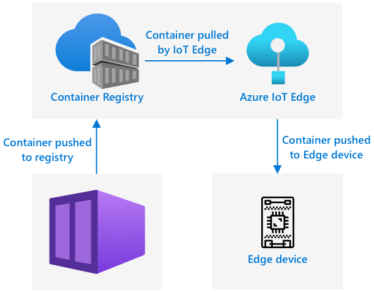
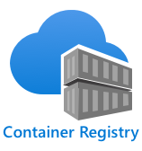

<!--
CO_OP_TRANSLATOR_METADATA:
{
  "original_hash": "2625af24587465c5547ae33d6cc000a5",
  "translation_date": "2025-08-27T20:49:12+00:00",
  "source_file": "4-manufacturing/lessons/3-run-fruit-detector-edge/README.md",
  "language_code": "he"
}
-->
# הפעלת גלאי הפירות שלך בקצה


> סקיצה מאת [ניטיה נאראסימן](https://github.com/nitya). לחצו על התמונה לגרסה גדולה יותר.

הווידאו הזה מספק סקירה כללית על הפעלת מסווגי תמונות על מכשירי IoT, הנושא שמכוסה בשיעור זה.

[](https://www.youtube.com/watch?v=_K5fqGLO8us)

## חידון לפני השיעור

[חידון לפני השיעור](https://black-meadow-040d15503.1.azurestaticapps.net/quiz/33)

## מבוא

בשיעור הקודם השתמשתם במסווג התמונות שלכם כדי לסווג פירות בשלים ולא בשלים, ושלחתם תמונה שצולמה על ידי המצלמה במכשיר ה-IoT שלכם דרך האינטרנט לשירות ענן. שיחות אלו לוקחות זמן, עולות כסף, ותלויות בסוג הנתונים שאתם משתמשים בהם, ייתכן שיש להן השלכות על פרטיות.

בשיעור זה תלמדו כיצד להפעיל מודלים של למידת מכונה (ML) בקצה - על מכשירי IoT שפועלים ברשת שלכם ולא בענן. תלמדו על היתרונות והחסרונות של מחשוב קצה לעומת מחשוב ענן, כיצד לפרוס את מודל ה-AI שלכם לקצה, וכיצד לגשת אליו ממכשיר ה-IoT שלכם.

בשיעור זה נעסוק ב:

* [מחשוב קצה](../../../../../4-manufacturing/lessons/3-run-fruit-detector-edge)
* [Azure IoT Edge](../../../../../4-manufacturing/lessons/3-run-fruit-detector-edge)
* [רישום מכשיר IoT Edge](../../../../../4-manufacturing/lessons/3-run-fruit-detector-edge)
* [הגדרת מכשיר IoT Edge](../../../../../4-manufacturing/lessons/3-run-fruit-detector-edge)
* [ייצוא המודל שלכם](../../../../../4-manufacturing/lessons/3-run-fruit-detector-edge)
* [הכנת הקונטיינר שלכם לפריסה](../../../../../4-manufacturing/lessons/3-run-fruit-detector-edge)
* [פריסת הקונטיינר שלכם](../../../../../4-manufacturing/lessons/3-run-fruit-detector-edge)
* [שימוש במכשיר IoT Edge שלכם](../../../../../4-manufacturing/lessons/3-run-fruit-detector-edge)

## מחשוב קצה

מחשוב קצה כולל מחשבים שמעבדים נתוני IoT קרוב ככל האפשר למקום שבו הנתונים נוצרים. במקום לעבד את הנתונים בענן, העיבוד מועבר לקצה הענן - הרשת הפנימית שלכם.


בשיעורים עד כה, היו לכם מכשירים שאספו נתונים ושלחו אותם לענן לניתוח, תוך הפעלת פונקציות ללא שרת או מודלים של AI בענן.


מחשוב קצה כולל העברת חלק משירותי הענן מהמחשוב בענן למחשבים שפועלים באותה רשת כמו מכשירי ה-IoT, תוך תקשורת עם הענן רק במידת הצורך. לדוגמה, ניתן להפעיל מודלים של AI על מכשירי קצה כדי לנתח בשלות של פירות, ולשלוח לענן רק ניתוחים, כמו מספר הפירות הבשלים לעומת הלא בשלים.

✅ חשבו על יישומי ה-IoT שבניתם עד כה. אילו חלקים מהם ניתן להעביר לקצה?

### יתרונות

היתרונות של מחשוב קצה הם:

1. **מהירות** - מחשוב קצה אידיאלי לנתונים רגישים לזמן, מכיוון שהפעולות מתבצעות באותה רשת כמו המכשיר, במקום לבצע שיחות דרך האינטרנט. זה מאפשר מהירויות גבוהות יותר, מכיוון שרשתות פנימיות יכולות לפעול במהירויות גבוהות משמעותית מחיבורי אינטרנט, עם נתונים שנוסעים מרחק קצר יותר.

    > 💁 למרות שכבלים אופטיים משמשים לחיבורי אינטרנט ומאפשרים לנתונים לנוע במהירות האור, נתונים יכולים לקחת זמן לעבור ברחבי העולם לספקי ענן. לדוגמה, אם אתם שולחים נתונים מאירופה לשירותי ענן בארה"ב, זה לוקח לפחות 28ms לנתונים לחצות את האוקיינוס האטלנטי בכבל אופטי, וזה מבלי להתחשב בזמן שלוקח לנתונים להגיע לכבל הטרנס-אטלנטי, להמיר אותות חשמליים לאור וחזרה בצד השני, ואז מהכבל האופטי לספק הענן.

    מחשוב קצה גם דורש פחות תעבורת רשת, מה שמפחית את הסיכון שהנתונים שלכם יואטו עקב עומס על רוחב הפס המוגבל של חיבור האינטרנט.

1. **נגישות מרחוק** - מחשוב קצה עובד כאשר יש לכם חיבור מוגבל או ללא חיבור כלל, או כאשר החיבור יקר מדי לשימוש מתמשך. לדוגמה, בעבודה באזורים של אסונות הומניטריים שבהם התשתית מוגבלת, או במדינות מתפתחות.

1. **עלויות נמוכות יותר** - איסוף, אחסון, ניתוח והפעלת פעולות על מכשיר קצה מפחיתים את השימוש בשירותי ענן, מה שיכול להפחית את העלות הכוללת של יישום ה-IoT שלכם. לאחרונה חלה עלייה במכשירים שתוכננו למחשוב קצה, כמו כרטיסי מאיץ AI כגון [Jetson Nano של NVIDIA](https://developer.nvidia.com/embedded/jetson-nano-developer-kit), שיכולים להפעיל עומסי עבודה של AI באמצעות חומרת GPU על מכשירים שעולים פחות מ-100 דולר.

1. **פרטיות ואבטחה** - עם מחשוב קצה, הנתונים נשארים ברשת שלכם ולא מועלים לענן. זה לעיתים קרובות מועדף עבור מידע רגיש ומזהה אישית, במיוחד מכיוון שאין צורך לאחסן את הנתונים לאחר ניתוחם, מה שמפחית מאוד את הסיכון לדליפות נתונים. דוגמאות כוללות נתונים רפואיים וצילומי מצלמות אבטחה.

1. **התמודדות עם מכשירים לא מאובטחים** - אם יש לכם מכשירים עם פגמי אבטחה ידועים שאינכם רוצים לחבר ישירות לרשת שלכם או לאינטרנט, תוכלו לחבר אותם לרשת נפרדת למכשיר שער IoT Edge. מכשיר הקצה הזה יכול גם להיות מחובר לרשת הרחבה שלכם או לאינטרנט, ולנהל את זרימות הנתונים הלוך ושוב.

1. **תמיכה במכשירים לא תואמים** - אם יש לכם מכשירים שלא יכולים להתחבר ל-IoT Hub, לדוגמה מכשירים שיכולים להתחבר רק באמצעות חיבורי HTTP או מכשירים שיש להם רק Bluetooth, תוכלו להשתמש במכשיר IoT Edge כמכשיר שער, שמעביר הודעות ל-IoT Hub.

✅ בצעו מחקר: אילו יתרונות נוספים עשויים להיות למחשוב קצה?

### חסרונות

ישנם חסרונות למחשוב קצה, שבהם הענן עשוי להיות אפשרות מועדפת:

1. **סקיילביליות וגמישות** - מחשוב ענן יכול להתאים את עצמו לצרכי הרשת והנתונים בזמן אמת על ידי הוספה או הפחתה של שרתים ומשאבים אחרים. הוספת מחשבי קצה נוספים דורשת הוספה ידנית של מכשירים נוספים.

1. **אמינות ועמידות** - מחשוב ענן מספק שרתים מרובים לעיתים קרובות במיקומים מרובים לצורך יתירות והתאוששות מאסון. כדי להשיג את אותה רמת יתירות בקצה נדרשות השקעות גדולות ועבודת קונפיגורציה רבה.

1. **תחזוקה** - ספקי שירותי ענן מספקים תחזוקה ועדכונים למערכת.

✅ בצעו מחקר: אילו חסרונות נוספים עשויים להיות למחשוב קצה?

החסרונות הם למעשה ההפך מהיתרונות של שימוש בענן - עליכם לבנות ולנהל את המכשירים הללו בעצמכם, במקום להסתמך על המומחיות והסקייל של ספקי הענן.

חלק מהסיכונים מופחתים מעצם טבעו של מחשוב קצה. לדוגמה, אם יש לכם מכשיר קצה שפועל במפעל ואוסף נתונים ממכונות, אינכם צריכים לחשוב על תרחישי התאוששות מאסון מסוימים. אם החשמל במפעל ייכבה, אינכם צריכים מכשיר קצה גיבוי, מכיוון שהמכונות שמייצרות את הנתונים שהמכשיר הקצה מעבד גם הן יהיו ללא חשמל.

עבור מערכות IoT, לעיתים קרובות תרצו שילוב של מחשוב ענן וקצה, תוך ניצול כל שירות בהתאם לצרכי המערכת, לקוחותיה ולמתחזקים שלה.

## Azure IoT Edge


Azure IoT Edge הוא שירות שיכול לעזור לכם להעביר עומסי עבודה מהענן לקצה. אתם מגדירים מכשיר כמכשיר קצה, ומהענן תוכלו לפרוס קוד למכשיר הקצה הזה. זה מאפשר לכם לשלב את היכולות של הענן והקצה.

> 🎓 *עומסי עבודה* הוא מונח לכל שירות שעושה סוג כלשהו של עבודה, כמו מודלים של AI, יישומים או פונקציות ללא שרת.

לדוגמה, תוכלו לאמן מסווג תמונות בענן, ואז לפרוס אותו ממכשיר הקצה. מכשיר ה-IoT שלכם ישלח תמונות למכשיר הקצה לצורך סיווג, במקום לשלוח את התמונות דרך האינטרנט. אם תצטרכו לפרוס גרסה חדשה של המודל, תוכלו לאמן אותה בענן ולהשתמש ב-IoT Edge כדי לעדכן את המודל במכשיר הקצה לגרסה החדשה.

> 🎓 תוכנה שמופעלת ב-IoT Edge נקראת *מודולים*. כברירת מחדל, IoT Edge מפעיל מודולים שמתקשרים עם IoT Hub, כמו המודולים `edgeAgent` ו-`edgeHub`. כאשר אתם פורסים מסווג תמונות, הוא נפרס כמודול נוסף.

IoT Edge מובנה ב-IoT Hub, כך שתוכלו לנהל מכשירי קצה באמצעות אותו שירות שבו הייתם משתמשים לניהול מכשירי IoT, עם אותה רמת אבטחה.

IoT Edge מפעיל קוד מתוך *קונטיינרים* - יישומים עצמאיים שפועלים בבידוד משאר היישומים במחשב שלכם. כאשר אתם מפעילים קונטיינר, הוא מתנהג כמו מחשב נפרד שפועל בתוך המחשב שלכם, עם התוכנה, השירותים והיישומים שלו. ברוב המקרים, קונטיינרים לא יכולים לגשת לשום דבר במחשב שלכם אלא אם תבחרו לשתף דברים כמו תיקייה עם הקונטיינר. הקונטיינר חושף אז שירותים דרך פורט פתוח שניתן להתחבר אליו או לחשוף לרשת שלכם.


לדוגמה, תוכלו להחזיק קונטיינר עם אתר אינטרנט שפועל על פורט 80, פורט ה-HTTP המוגדר כברירת מחדל, ואז לחשוף אותו מהמחשב שלכם גם על פורט 80.

✅ בצעו מחקר: קראו על קונטיינרים ושירותים כמו Docker או Moby.

תוכלו להשתמש ב-Custom Vision כדי להוריד מסווגי תמונות ולפרוס אותם כקונטיינרים, בין אם הם פועלים ישירות על מכשיר או נפרסים דרך IoT Edge. ברגע שהם פועלים בקונטיינר, ניתן לגשת אליהם באמצעות אותו API REST כמו הגרסה בענן, אך עם נקודת הקצה שמצביעה על מכשיר הקצה שמריץ את הקונטיינר.

## רישום מכשיר IoT Edge

כדי להשתמש במכשיר IoT Edge, יש לרשום אותו ב-IoT Hub.

### משימה - רישום מכשיר IoT Edge

1. צרו IoT Hub בקבוצת המשאבים `fruit-quality-detector`. תנו לו שם ייחודי המבוסס על `fruit-quality-detector`.

1. רשמו מכשיר IoT Edge בשם `fruit-quality-detector-edge` ב-IoT Hub שלכם. הפקודה לעשות זאת דומה לזו ששימשה לרישום מכשיר שאינו קצה, פרט לכך שאתם מוסיפים את הדגל `--edge-enabled`.

    ```sh
    az iot hub device-identity create --edge-enabled \
                                      --device-id fruit-quality-detector-edge \
                                      --hub-name <hub_name>
    ```

    החליפו `<hub_name>` בשם ה-IoT Hub שלכם.

1. קבלו את מחרוזת החיבור למכשיר שלכם באמצעות הפקודה הבאה:

    ```sh
    az iot hub device-identity connection-string show --device-id fruit-quality-detector-edge \
                                                      --output table \
                                                      --hub-name <hub_name>
    ```

    החליפו `<hub_name>` בשם ה-IoT Hub שלכם.

    העתיקו את מחרוזת החיבור שמוצגת בפלט.

## הגדרת מכשיר IoT Edge

לאחר שיצרתם את רישום מכשיר הקצה ב-IoT Hub שלכם, תוכלו להגדיר את מכשיר הקצה.

### משימה - התקנה והפעלה של IoT Edge Runtime

**ה-IoT Edge Runtime פועל רק על קונטיינרים של לינוקס.** ניתן להפעיל אותו על לינוקס, או על Windows באמצעות מכונות וירטואליות של לינוקס.

* אם אתם משתמשים ב-Raspberry Pi כמכשיר ה-IoT שלכם, הוא מריץ גרסה נתמכת של לינוקס ויכול לארח את ה-IoT Edge Runtime. עקבו אחר [המדריך להתקנת Azure IoT Edge ללינוקס במדריכי Microsoft](https://docs.microsoft.com/azure/iot-edge/how-to-install-iot-edge?WT.mc_id=academic-17441-jabenn) כדי להתקין את IoT Edge ולהגדיר את מחרוזת החיבור.

    > 💁 זכרו, Raspberry Pi OS הוא גרסה של Debian Linux.

* אם אינכם משתמשים ב-Raspberry Pi, אך יש לכם מחשב לינוקס, תוכלו להפעיל את ה-IoT Edge Runtime. עקבו אחר [המדריך להתקנת Azure IoT Edge ללינוקס במדריכי Microsoft](https://docs.microsoft.com/azure/iot-edge/how-to-install-iot-edge?WT.mc_id=academic-17441-jabenn) כדי להתקין את IoT Edge ולהגדיר את מחרוזת החיבור.

* אם אתם משתמשים ב-Windows, תוכלו להתקין את ה-IoT Edge Runtime במכונה וירטואלית של לינוקס על ידי ביצוע [החלק להתקנה והפעלה של IoT Edge Runtime במדריך המהיר לפריסת המודול הראשון שלכם ב-IoT Edge במכשיר Windows במדריכי Microsoft](https://docs.microsoft.com/azure/iot-edge/quickstart?WT.mc_id=academic-17441-jabenn#install-and-start-the-iot-edge-runtime). תוכלו לעצור כאשר תגיעו לחלק *פריסת מודול*.

* אם אתם משתמשים ב-macOS, תוכלו ליצור מכונה וירטואלית (VM) בענן לשימוש כמכשיר ה-IoT Edge שלכם. אלו מחשבים שתוכלו ליצור בענן ולגשת אליהם דרך האינטרנט. תוכלו ליצור VM לינוקס שמותקן עליו IoT Edge. עקבו אחר [המדריך ליצירת מכונה וירטואלית שמריצה IoT Edge](vm-iotedge.md) להוראות כיצד לעשות זאת.

## ייצוא המודל שלכם

כדי להפעיל את המסווג בקצה, יש לייצא אותו מ-Custom Vision. Custom Vision יכול ליצור שני סוגי מודלים - מודלים סטנדרטיים ומודלים קומפקטיים. מודלים קומפקטיים משתמשים בטכניקות שונות כדי להקטין את גודל המודל, מה שהופך אותו לקטן מספיק להורדה ולפריסה על מכשירי IoT.

כאשר יצרתם את מסווג התמונות, השתמשתם בתחום *מזון*, גרסה של המודל שמותאמת לאימון על תמונות מזון. ב-Custom Vision, תוכלו לשנות את התחום של הפרויקט שלכם, תוך שימוש בנתוני האימון שלכם לאימון מודל חדש עם התחום החדש. כל התחומים הנתמכים על ידי Custom Vision זמינים כסטנדרטיים וכקומפקטיים.

### משימה - אימון המודל שלכם באמצעות תחום מזון (קומפקטי)
1. פתח את פורטל Custom Vision ב-[CustomVision.ai](https://customvision.ai) והתחבר אם הוא לא פתוח כבר. לאחר מכן, פתח את פרויקט `fruit-quality-detector`.

1. לחץ על כפתור **Settings** (סמל ⚙).

1. ברשימת *Domains*, בחר *Food (compact)*.

1. תחת *Export Capabilities*, ודא ש-*Basic platforms (Tensorflow, CoreML, ONNX, ...)* נבחר.

1. בתחתית דף ההגדרות, לחץ על **Save Changes**.

1. אימן מחדש את המודל באמצעות כפתור **Train**, ובחר *Quick training*.

### משימה - ייצוא המודל שלך

לאחר שהמודל אומן, יש לייצא אותו כקונטיינר.

1. לחץ על לשונית **Performance**, ומצא את האיטרציה האחרונה שאומנה באמצעות הדומיין הקומפקטי.

1. לחץ על כפתור **Export** בראש הדף.

1. בחר **DockerFile**, ואז בחר גרסה שמתאימה למכשיר הקצה שלך:

    * אם אתה מפעיל IoT Edge על מחשב לינוקס, מחשב Windows או מכונה וירטואלית, בחר את גרסת *Linux*.
    * אם אתה מפעיל IoT Edge על Raspberry Pi, בחר את גרסת *ARM (Raspberry Pi 3)*.

> 🎓 Docker הוא אחד הכלים הפופולריים ביותר לניהול קונטיינרים, ו-DockerFile הוא סט הוראות כיצד להגדיר את הקונטיינר.

1. לחץ על **Export** כדי לגרום ל-Custom Vision ליצור את הקבצים הרלוונטיים, ואז לחץ על **Download** כדי להוריד אותם כקובץ zip.

1. שמור את הקבצים במחשב שלך, ואז חלץ את התיקייה.

## הכנת הקונטיינר לפריסה



לאחר שהורדת את המודל שלך, יש לבנות אותו כקונטיינר ואז לדחוף אותו לרג'יסטרי קונטיינרים - מיקום מקוון שבו ניתן לאחסן קונטיינרים. IoT Edge יכול להוריד את הקונטיינר מהמאגרים ולדחוף אותו למכשיר שלך.



רג'יסטרי הקונטיינרים שבו תשתמש בשיעור זה הוא Azure Container Registry. זו אינה שירות חינמי, ולכן כדי לחסוך כסף ודא שאתה [מנקה את הפרויקט שלך](../../../clean-up.md) לאחר שתסיים.

> 💁 תוכל לראות את העלויות של שימוש ב-Azure Container Registry בדף [תמחור Azure Container Registry](https://azure.microsoft.com/pricing/details/container-registry/?WT.mc_id=academic-17441-jabenn).

### משימה - התקנת Docker

כדי לבנות ולפרוס את המודל המסווג, ייתכן שתצטרך להתקין [Docker](https://www.docker.com/).

תצטרך לעשות זאת רק אם אתה מתכנן לבנות את הקונטיינר ממכשיר שונה מזה שבו התקנת IoT Edge - כחלק מהתקנת IoT Edge, Docker מותקן עבורך.

1. אם אתה בונה את הקונטיינר במכשיר שונה ממכשיר IoT Edge שלך, עקוב אחר הוראות ההתקנה של Docker בדף [Docker install page](https://www.docker.com/products/docker-desktop) כדי להתקין את Docker Desktop או את מנוע Docker. ודא שהוא פועל לאחר ההתקנה.

### משימה - יצירת משאב רג'יסטרי קונטיינרים

1. הרץ את הפקודה הבאה מהטרמינל או שורת הפקודה שלך כדי ליצור משאב Azure Container Registry:

    ```sh
    az acr create --resource-group fruit-quality-detector \
                  --sku Basic \
                  --name <Container registry name>
    ```

    החלף `<Container registry name>` בשם ייחודי עבור רג'יסטרי הקונטיינרים שלך, תוך שימוש באותיות ומספרים בלבד. בנה את השם סביב `fruitqualitydetector`. שם זה הופך לחלק מה-URL לגישה לרג'יסטרי הקונטיינרים, ולכן צריך להיות ייחודי גלובלית.

1. התחבר ל-Azure Container Registry באמצעות הפקודה הבאה:

    ```sh
    az acr login --name <Container registry name>
    ```

    החלף `<Container registry name>` בשם שבו השתמשת עבור רג'יסטרי הקונטיינרים שלך.

1. הפעל את רג'יסטרי הקונטיינרים במצב מנהל כדי שתוכל ליצור סיסמה באמצעות הפקודה הבאה:

    ```sh
    az acr update --admin-enabled true \
                 --name <Container registry name>
    ```

    החלף `<Container registry name>` בשם שבו השתמשת עבור רג'יסטרי הקונטיינרים שלך.

1. צור סיסמאות עבור רג'יסטרי הקונטיינרים שלך באמצעות הפקודה הבאה:

    ```sh
     az acr credential renew --password-name password \
                             --output table \
                             --name <Container registry name>
    ```

    החלף `<Container registry name>` בשם שבו השתמשת עבור רג'יסטרי הקונטיינרים שלך.

    שמור עותק של הערך `PASSWORD`, מכיוון שתצטרך אותו מאוחר יותר.

### משימה - בניית הקונטיינר שלך

מה שהורדת מ-Custom Vision היה DockerFile המכיל הוראות כיצד יש לבנות את הקונטיינר, יחד עם קוד יישום שירוץ בתוך הקונטיינר כדי לארח את מודל ה-Custom Vision שלך, יחד עם REST API לקריאה אליו. תוכל להשתמש ב-Docker כדי לבנות קונטיינר מתויג מ-DockerFile, ואז לדחוף אותו לרג'יסטרי הקונטיינרים שלך.

> 🎓 קונטיינרים מקבלים תג שמגדיר שם וגרסה עבורם. כאשר תצטרך לעדכן קונטיינר תוכל לבנות אותו עם אותו תג אך גרסה חדשה יותר.

1. פתח את הטרמינל או שורת הפקודה שלך ונווט למודל שחולץ שהורדת מ-Custom Vision.

1. הרץ את הפקודה הבאה כדי לבנות ולתייג את התמונה:

    ```sh
    docker build --platform <platform> -t <Container registry name>.azurecr.io/classifier:v1 .
    ```

    החלף `<platform>` בפלטפורמה שעליה הקונטיינר ירוץ. אם אתה מפעיל IoT Edge על Raspberry Pi, הגדר זאת ל-`linux/armhf`, אחרת הגדר זאת ל-`linux/amd64`.

    > 💁 אם אתה מריץ את הפקודה מהמכשיר שבו אתה מריץ IoT Edge, כמו Raspberry Pi, תוכל להשמיט את החלק `--platform <platform>` מכיוון שהוא מוגדר כברירת מחדל לפלטפורמה הנוכחית.

    החלף `<Container registry name>` בשם שבו השתמשת עבור רג'יסטרי הקונטיינרים שלך.

    > 💁 אם אתה מריץ על לינוקס או Raspberry Pi OS ייתכן שתצטרך להשתמש ב-`sudo` כדי להריץ את הפקודה.

    Docker יבנה את התמונה, יגדיר את כל התוכנה הנדרשת. התמונה תתויג כ-`classifier:v1`.

    ```output
    ➜  d4ccc45da0bb478bad287128e1274c3c.DockerFile.Linux docker build --platform linux/amd64 -t  fruitqualitydetectorjimb.azurecr.io/classifier:v1 .
    [+] Building 102.4s (11/11) FINISHED
     => [internal] load build definition from Dockerfile
     => => transferring dockerfile: 131B
     => [internal] load .dockerignore
     => => transferring context: 2B
     => [internal] load metadata for docker.io/library/python:3.7-slim
     => [internal] load build context
     => => transferring context: 905B
     => [1/6] FROM docker.io/library/python:3.7-slim@sha256:b21b91c9618e951a8cbca5b696424fa5e820800a88b7e7afd66bba0441a764d6
     => => resolve docker.io/library/python:3.7-slim@sha256:b21b91c9618e951a8cbca5b696424fa5e820800a88b7e7afd66bba0441a764d6
     => => sha256:b4d181a07f8025e00e0cb28f1cc14613da2ce26450b80c54aea537fa93cf3bda 27.15MB / 27.15MB
     => => sha256:de8ecf497b753094723ccf9cea8a46076e7cb845f333df99a6f4f397c93c6ea9 2.77MB / 2.77MB
     => => sha256:707b80804672b7c5d8f21e37c8396f319151e1298d976186b4f3b76ead9f10c8 10.06MB / 10.06MB
     => => sha256:b21b91c9618e951a8cbca5b696424fa5e820800a88b7e7afd66bba0441a764d6 1.86kB / 1.86kB
     => => sha256:44073386687709c437586676b572ff45128ff1f1570153c2f727140d4a9accad 1.37kB / 1.37kB
     => => sha256:3d94f0f2ca798607808b771a7766f47ae62a26f820e871dd488baeccc69838d1 8.31kB / 8.31kB
     => => sha256:283715715396fd56d0e90355125fd4ec57b4f0773f306fcd5fa353b998beeb41 233B / 233B
     => => sha256:8353afd48f6b84c3603ea49d204bdcf2a1daada15f5d6cad9cc916e186610a9f 2.64MB / 2.64MB
     => => extracting sha256:b4d181a07f8025e00e0cb28f1cc14613da2ce26450b80c54aea537fa93cf3bda
     => => extracting sha256:de8ecf497b753094723ccf9cea8a46076e7cb845f333df99a6f4f397c93c6ea9
     => => extracting sha256:707b80804672b7c5d8f21e37c8396f319151e1298d976186b4f3b76ead9f10c8
     => => extracting sha256:283715715396fd56d0e90355125fd4ec57b4f0773f306fcd5fa353b998beeb41
     => => extracting sha256:8353afd48f6b84c3603ea49d204bdcf2a1daada15f5d6cad9cc916e186610a9f
     => [2/6] RUN pip install -U pip
     => [3/6] RUN pip install --no-cache-dir numpy~=1.17.5 tensorflow~=2.0.2 flask~=1.1.2 pillow~=7.2.0
     => [4/6] RUN pip install --no-cache-dir mscviplib==2.200731.16
     => [5/6] COPY app /app
     => [6/6] WORKDIR /app
     => exporting to image
     => => exporting layers
     => => writing image sha256:1846b6f134431f78507ba7c079358ed66d944c0e185ab53428276bd822400386
     => => naming to fruitqualitydetectorjimb.azurecr.io/classifier:v1
    ```

### משימה - דחיפת הקונטיינר שלך לרג'יסטרי הקונטיינרים שלך

1. השתמש בפקודה הבאה כדי לדחוף את הקונטיינר שלך לרג'יסטרי הקונטיינרים שלך:

    ```sh
    docker push <Container registry name>.azurecr.io/classifier:v1
    ```

    החלף `<Container registry name>` בשם שבו השתמשת עבור רג'יסטרי הקונטיינרים שלך.

    > 💁 אם אתה מריץ לינוקס ייתכן שתצטרך להשתמש ב-`sudo` כדי להריץ את הפקודה.

    הקונטיינר יידחף לרג'יסטרי הקונטיינרים.

    ```output
    ➜  d4ccc45da0bb478bad287128e1274c3c.DockerFile.Linux docker push fruitqualitydetectorjimb.azurecr.io/classifier:v1
    The push refers to repository [fruitqualitydetectorjimb.azurecr.io/classifier]
    5f70bf18a086: Pushed 
    8a1ba9294a22: Pushed 
    56cf27184a76: Pushed 
    b32154f3f5dd: Pushed 
    36103e9a3104: Pushed 
    e2abb3cacca0: Pushed 
    4213fd357bbe: Pushed 
    7ea163ba4dce: Pushed 
    537313a13d90: Pushed 
    764055ebc9a7: Pushed 
    v1: digest: sha256:ea7894652e610de83a5a9e429618e763b8904284253f4fa0c9f65f0df3a5ded8 size: 2423
    ```

1. כדי לוודא שהדחיפה הצליחה, תוכל לרשום את הקונטיינרים ברג'יסטרי שלך באמצעות הפקודה הבאה:

    ```sh
    az acr repository list --output table \
                           --name <Container registry name> 
    ```

    החלף `<Container registry name>` בשם שבו השתמשת עבור רג'יסטרי הקונטיינרים שלך.

    ```output
    ➜  d4ccc45da0bb478bad287128e1274c3c.DockerFile.Linux az acr repository list --name fruitqualitydetectorjimb --output table
    Result
    ----------
    classifier
    ```

    תראה את המסווג שלך מופיע בתוצאה.

## פריסת הקונטיינר שלך

כעת ניתן לפרוס את הקונטיינר שלך למכשיר IoT Edge שלך. כדי לפרוס, עליך להגדיר מניפסט פריסה - מסמך JSON שמפרט את המודולים שיופעלו במכשיר הקצה.

### משימה - יצירת מניפסט הפריסה

1. צור קובץ חדש בשם `deployment.json` במקום כלשהו במחשב שלך.

1. הוסף את התוכן הבא לקובץ:

    ```json
    {
        "content": {
            "modulesContent": {
                "$edgeAgent": {
                    "properties.desired": {
                        "schemaVersion": "1.1",
                        "runtime": {
                            "type": "docker",
                            "settings": {
                                "minDockerVersion": "v1.25",
                                "loggingOptions": "",
                                "registryCredentials": {
                                    "ClassifierRegistry": {
                                        "username": "<Container registry name>",
                                        "password": "<Container registry password>",
                                        "address": "<Container registry name>.azurecr.io"
                                      }
                                }
                            }
                        },
                        "systemModules": {
                            "edgeAgent": {
                                "type": "docker",
                                "settings": {
                                    "image": "mcr.microsoft.com/azureiotedge-agent:1.1",
                                    "createOptions": "{}"
                                }
                            },
                            "edgeHub": {
                                "type": "docker",
                                "status": "running",
                                "restartPolicy": "always",
                                "settings": {
                                    "image": "mcr.microsoft.com/azureiotedge-hub:1.1",
                                    "createOptions": "{\"HostConfig\":{\"PortBindings\":{\"5671/tcp\":[{\"HostPort\":\"5671\"}],\"8883/tcp\":[{\"HostPort\":\"8883\"}],\"443/tcp\":[{\"HostPort\":\"443\"}]}}}"
                                }
                            }
                        },
                        "modules": {
                            "ImageClassifier": {
                                "version": "1.0",
                                "type": "docker",
                                "status": "running",
                                "restartPolicy": "always",
                                "settings": {
                                    "image": "<Container registry name>.azurecr.io/classifier:v1",
                                    "createOptions": "{\"ExposedPorts\": {\"80/tcp\": {}},\"HostConfig\": {\"PortBindings\": {\"80/tcp\": [{\"HostPort\": \"80\"}]}}}"
                                }
                            }
                        }
                    }
                },
                "$edgeHub": {
                    "properties.desired": {
                        "schemaVersion": "1.1",
                        "routes": {
                            "upstream": "FROM /messages/* INTO $upstream"
                        },
                        "storeAndForwardConfiguration": {
                            "timeToLiveSecs": 7200
                        }
                    }
                }
            }
        }
    }
    ```

    > 💁 תוכל למצוא את הקובץ הזה בתיקיית [code-deployment/deployment](../../../../../4-manufacturing/lessons/3-run-fruit-detector-edge/code-deployment/deployment).

    החלף את שלושת המופעים של `<Container registry name>` בשם שבו השתמשת עבור רג'יסטרי הקונטיינרים שלך. אחד נמצא בסעיף `ImageClassifier` module, והשניים האחרים נמצאים בסעיף `registryCredentials`.

    החלף `<Container registry password>` בסעיף `registryCredentials` בסיסמה של רג'יסטרי הקונטיינרים שלך.

1. מתיקיית מניפסט הפריסה שלך, הרץ את הפקודה הבאה:

    ```sh
    az iot edge set-modules --device-id fruit-quality-detector-edge \
                            --content deployment.json \
                            --hub-name <hub_name>
    ```

    החלף `<hub_name>` בשם של IoT Hub שלך.

    מודול המסווג ייפרס למכשיר הקצה שלך.

### משימה - אימות שהמסווג פועל

1. התחבר למכשיר IoT Edge:

    * אם אתה משתמש ב-Raspberry Pi כדי להפעיל IoT Edge, התחבר באמצעות ssh מהטרמינל שלך או דרך חיבור SSH מרחוק ב-VS Code.
    * אם אתה מפעיל IoT Edge במיכל לינוקס על Windows, עקוב אחר השלבים במדריך [אימות תצורה מוצלחת](https://docs.microsoft.com/azure/iot-edge/how-to-install-iot-edge-on-windows?WT.mc_id=academic-17441-jabenn&view=iotedge-2018-06&tabs=powershell#verify-successful-configuration) כדי להתחבר למכשיר IoT Edge.
    * אם אתה מפעיל IoT Edge על מכונה וירטואלית, תוכל להתחבר באמצעות SSH למכונה באמצעות `adminUsername` והסיסמה שהגדרת בעת יצירת ה-VM, תוך שימוש בכתובת ה-IP או בשם ה-DNS:

        ```sh
        ssh <adminUsername>@<IP address>
        ```

        או:

        ```sh
        ssh <adminUsername>@<DNS Name>
        ```

        הזן את הסיסמה שלך כאשר תתבקש.

1. לאחר שהתחברת, הרץ את הפקודה הבאה כדי לקבל את רשימת המודולים של IoT Edge:

    ```sh
    iotedge list
    ```

    > 💁 ייתכן שתצטרך להריץ את הפקודה עם `sudo`.

    תראה את המודולים הפועלים:

    ```output
    jim@fruit-quality-detector-jimb:~$ iotedge list
    NAME             STATUS           DESCRIPTION      CONFIG
    ImageClassifier  running          Up 42 minutes    fruitqualitydetectorjimb.azurecr.io/classifier:v1
    edgeAgent        running          Up 42 minutes    mcr.microsoft.com/azureiotedge-agent:1.1
    edgeHub          running          Up 42 minutes    mcr.microsoft.com/azureiotedge-hub:1.1
    ```

1. בדוק את הלוגים של מודול המסווג באמצעות הפקודה הבאה:

    ```sh
    iotedge logs ImageClassifier
    ```

    > 💁 ייתכן שתצטרך להריץ את הפקודה עם `sudo`.

    ```output
    jim@fruit-quality-detector-jimb:~$ iotedge logs ImageClassifier
    2021-07-05 20:30:15.387144: I tensorflow/core/platform/cpu_feature_guard.cc:142] Your CPU supports instructions that this TensorFlow binary was not compiled to use: AVX2 FMA
    2021-07-05 20:30:15.392185: I tensorflow/core/platform/profile_utils/cpu_utils.cc:94] CPU Frequency: 2394450000 Hz
    2021-07-05 20:30:15.392712: I tensorflow/compiler/xla/service/service.cc:168] XLA service 0x55ed9ac83470 executing computations on platform Host. Devices:
    2021-07-05 20:30:15.392806: I tensorflow/compiler/xla/service/service.cc:175]   StreamExecutor device (0): Host, Default Version
    Loading model...Success!
    Loading labels...2 found. Success!
     * Serving Flask app "app" (lazy loading)
     * Environment: production
       WARNING: This is a development server. Do not use it in a production deployment.
       Use a production WSGI server instead.
     * Debug mode: off
     * Running on http://0.0.0.0:80/ (Press CTRL+C to quit)
    ```

### משימה - בדיקת המסווג

1. תוכל להשתמש ב-CURL כדי לבדוק את המסווג באמצעות כתובת ה-IP או שם המחשב שמפעיל את סוכן IoT Edge. מצא את כתובת ה-IP:

    * אם אתה על אותו מחשב שבו IoT Edge פועל, תוכל להשתמש ב-`localhost` כשם המחשב.
    * אם אתה משתמש ב-VM, תוכל להשתמש בכתובת ה-IP או בשם ה-DNS של ה-VM.
    * אחרת תוכל להשיג את כתובת ה-IP של המחשב שמפעיל IoT Edge:
      * ב-Windows 10, עקוב אחר המדריך [מצא את כתובת ה-IP שלך](https://support.microsoft.com/windows/find-your-ip-address-f21a9bbc-c582-55cd-35e0-73431160a1b9?WT.mc_id=academic-17441-jabenn).
      * ב-macOS, עקוב אחר המדריך [כיצד למצוא את כתובת ה-IP שלך ב-Mac](https://www.hellotech.com/guide/for/how-to-find-ip-address-on-mac).
      * בלינוקס, עקוב אחר הסעיף על מציאת כתובת ה-IP הפרטית במדריך [כיצד למצוא את כתובת ה-IP שלך בלינוקס](https://opensource.com/article/18/5/how-find-ip-address-linux).

1. תוכל לבדוק את הקונטיינר עם קובץ מקומי על ידי הרצת הפקודה הבאה של curl:

    ```sh
    curl --location \
         --request POST 'http://<IP address or name>/image' \
         --header 'Content-Type: image/png' \
         --data-binary '@<file_Name>' 
    ```

    החלף `<IP address or name>` בכתובת ה-IP או שם המחשב שמפעיל את IoT Edge. החלף `<file_Name>` בשם הקובץ לבדיקה.

    תראה את תוצאות התחזית בתוצאה:

    ```output
    {
        "created": "2021-07-05T21:44:39.573181",
        "id": "",
        "iteration": "",
        "predictions": [
            {
                "boundingBox": null,
                "probability": 0.9995615482330322,
                "tagId": "",
                "tagName": "ripe"
            },
            {
                "boundingBox": null,
                "probability": 0.0004384400090202689,
                "tagId": "",
                "tagName": "unripe"
            }
        ],
        "project": ""
    }
    ```

    > 💁 אין צורך לספק מפתח תחזית כאן, מכיוון שזה לא משתמש במשאב Azure. במקום זאת, האבטחה תוגדר ברשת הפנימית בהתבסס על צרכי אבטחה פנימיים, ולא על נקודת קצה ציבורית ומפתח API.

## שימוש במכשיר IoT Edge שלך

כעת שהמסווג שלך נפרס למכשיר IoT Edge, תוכל להשתמש בו מהמכשיר IoT שלך.

### משימה - שימוש במכשיר IoT Edge שלך

עבור דרך המדריך הרלוונטי כדי לסווג תמונות באמצעות המסווג של IoT Edge:

* [Arduino - Wio Terminal](wio-terminal.md)
* [מחשב חד-לוח - Raspberry Pi/מכשיר IoT וירטואלי](single-board-computer.md)

### אימון מחדש של המודל

אחד החסרונות של הפעלת מסווגי תמונות על IoT Edge הוא שהם לא מחוברים לפרויקט Custom Vision שלך. אם תסתכל בלשונית **Predictions** ב-Custom Vision לא תראה את התמונות שסווגו באמצעות המסווג מבוסס Edge.

זהו התנהגות צפויה - תמונות לא נשלחות לענן לסיווג, ולכן הן לא יהיו זמינות בענן. אחד היתרונות של שימוש ב-IoT Edge הוא פרטיות, שמבטיחה שהתמונות לא עוזבות את הרשת שלך, יתרון נוסף הוא היכולת לעבוד במצב לא מקוון, כך שאין תלות בהעלאת תמונות כאשר למכשיר אין חיבור לאינטרנט. החיסרון הוא שיפור המודל שלך - תצטרך ליישם דרך אחרת לאחסן תמונות שניתן לסווג מחדש באופן ידני כדי לשפר ולאמן מחדש את המסווג.

✅ חשבו על דרכים להעלות תמונות כדי לאמן מחדש את המסווג.

---

## 🚀 אתגר

הרצת מודלים של AI על מכשירי קצה יכולה להיות מהירה יותר מאשר בענן - הקפיצה ברשת קצרה יותר. היא יכולה גם להיות איטית יותר מכיוון שהחומרה שמפעילה את המודל עשויה להיות פחות חזקה מהענן.

בצעו מדידות זמן והשוו אם הקריאה למכשיר הקצה שלכם מהירה או איטית יותר מהקריאה לענן? חשבו על סיבות להסביר את ההבדל, או היעדר ההבדל. חקרו דרכים להריץ מודלים של AI מהר יותר בקצה באמצעות חומרה מתמחה.

## שאלון לאחר ההרצאה

[שאלון לאחר ההרצאה](https://black-meadow-040d15503.1.azurestaticapps.net/quiz/34)

## סקירה ולימוד עצמי

* קראו עוד על קונטיינרים בדף [וירטואליזציה ברמת מערכת ההפעלה בוויקיפדיה](https://wikipedia.org/wiki/OS-level_virtualization).
* קראו עוד על מחשוב קצה, עם דגש על איך 5G יכול לעזור להרחיב את מחשוב הקצה במאמר [מהו מחשוב קצה ולמה הוא חשוב? ב-NetworkWorld](https://www.networkworld.com/article/3224893/what-is-edge-computing-and-how-its-changing-the-network.html)  
* למדו עוד על הפעלת שירותי AI ב-IoT Edge על ידי צפייה בפרק [למדו כיצד להשתמש ב-Azure IoT Edge על שירות AI מוכן בקצה לזיהוי שפה בפרק של Learn Live בערוץ Microsoft Channel9](https://channel9.msdn.com/Shows/Learn-Live/Sharpen-Your-AI-Edge-Skills-Episode-4-Learn-How-to-Use-Azure-IoT-Edge-on-a-Pre-Built-AI-Service-on-t?WT.mc_id=academic-17441-jabenn)

## משימה

[הפעילו שירותים נוספים בקצה](assignment.md)

---

**כתב ויתור**:  
מסמך זה תורגם באמצעות שירות תרגום מבוסס בינה מלאכותית [Co-op Translator](https://github.com/Azure/co-op-translator). למרות שאנו שואפים לדיוק, יש לקחת בחשבון שתרגומים אוטומטיים עשויים להכיל שגיאות או אי דיוקים. המסמך המקורי בשפתו המקורית צריך להיחשב כמקור סמכותי. עבור מידע קריטי, מומלץ להשתמש בתרגום מקצועי על ידי אדם. איננו נושאים באחריות לאי הבנות או לפרשנויות שגויות הנובעות משימוש בתרגום זה.