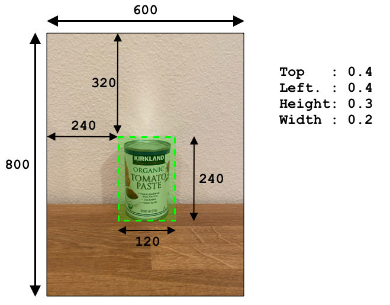

<!--
CO_OP_TRANSLATOR_METADATA:
{
  "original_hash": "1c9e5fa8b7be726c75a97232b1e41c97",
  "translation_date": "2025-08-27T20:28:39+00:00",
  "source_file": "5-retail/lessons/2-check-stock-device/README.md",
  "language_code": "he"
}
-->
# בדיקת מלאי ממכשיר IoT


> סקיצה מאת [ניטיה נאראסימן](https://github.com/nitya). לחצו על התמונה לגרסה גדולה יותר.

## שאלון לפני השיעור

[שאלון לפני השיעור](https://black-meadow-040d15503.1.azurestaticapps.net/quiz/39)

## מבוא

בשיעור הקודם למדתם על השימושים השונים של זיהוי אובייקטים בתחום הקמעונאות. בנוסף, למדתם כיצד לאמן מודל לזיהוי אובייקטים כדי לזהות מלאי. בשיעור הזה תלמדו כיצד להשתמש במודל הזיהוי שלכם ממכשיר IoT כדי לספור מלאי.

בשיעור הזה נעסוק ב:

* [ספירת מלאי](../../../../../5-retail/lessons/2-check-stock-device)
* [קריאה למודל הזיהוי ממכשיר IoT](../../../../../5-retail/lessons/2-check-stock-device)
* [תיבות גבול](../../../../../5-retail/lessons/2-check-stock-device)
* [אימון מחדש של המודל](../../../../../5-retail/lessons/2-check-stock-device)
* [ספירת מלאי](../../../../../5-retail/lessons/2-check-stock-device)

> 🗑 זהו השיעור האחרון בפרויקט הזה, אז לאחר השלמת השיעור והמשימה, אל תשכחו לנקות את שירותי הענן שלכם. תזדקקו לשירותים כדי להשלים את המשימה, אז ודאו שאתם מסיימים אותה קודם.
>
> עיינו ב[מדריך לניקוי הפרויקט](../../../clean-up.md) אם יש צורך בהוראות כיצד לעשות זאת.

## ספירת מלאי

מודלים לזיהוי אובייקטים יכולים לשמש לבדיקה של מלאי, בין אם לספירת מלאי או לווידוא שהמלאי נמצא במקום הנכון. מכשירי IoT עם מצלמות יכולים להיות פרוסים ברחבי החנות כדי לעקוב אחר מלאי, במיוחד באזורים חשובים שבהם יש צורך במלאי זמין, כמו אזורים שבהם מאוחסנים פריטים יקרי ערך בכמויות קטנות.

לדוגמה, אם מצלמה מכוונת למדפים שיכולים להכיל 8 קופסאות של רסק עגבניות, ומודל הזיהוי מזהה רק 7 קופסאות, אז אחת חסרה ויש צורך למלא אותה מחדש.


בתמונה למעלה, מודל הזיהוי זיהה 7 קופסאות רסק עגבניות על מדף שיכול להכיל 8 קופסאות. לא רק שמכשיר ה-IoT יכול לשלוח התראה על הצורך במילוי מחדש, אלא שהוא יכול גם לספק מידע על מיקום הפריט החסר, מידע חשוב אם אתם משתמשים ברובוטים למילוי המדפים.

> 💁 תלוי בחנות ובפופולריות של הפריט, מילוי מחדש כנראה לא יקרה אם רק קופסה אחת חסרה. תצטרכו לבנות אלגוריתם שיקבע מתי למלא מחדש בהתבסס על המוצרים, הלקוחות וקריטריונים נוספים.

✅ באילו תרחישים נוספים ניתן לשלב זיהוי אובייקטים ורובוטים?

לפעמים מלאי שגוי יכול להימצא על המדפים. זה יכול לקרות כתוצאה מטעות אנוש בזמן מילוי מחדש, או מלקוחות ששינו את דעתם והחזירו פריט למקום הראשון הזמין. כאשר מדובר בפריט שאינו מתכלה כמו שימורים, זהו מטרד. אם מדובר בפריט מתכלה כמו מוצרים קפואים או מצוננים, זה יכול לגרום לכך שהמוצר לא יוכל להימכר מכיוון שלא ניתן לדעת כמה זמן הפריט היה מחוץ למקפיא.

זיהוי אובייקטים יכול לשמש לזיהוי פריטים לא צפויים, שוב על ידי התראה לאדם או רובוט להחזיר את הפריט ברגע שהוא מזוהה.


בתמונה למעלה, קופסת תירס תינוקות הונחה על המדף ליד רסק העגבניות. מודל הזיהוי זיהה זאת, ומכשיר ה-IoT יכול להתריע לאדם או רובוט להחזיר את הקופסה למיקומה הנכון.

## קריאה למודל הזיהוי ממכשיר IoT

מודל הזיהוי שאימנתם בשיעור הקודם יכול להיקרא ממכשיר ה-IoT שלכם.

### משימה - פרסום איטרציה של מודל הזיהוי

איטרציות מתפרסמות מפורטל Custom Vision.

1. פתחו את פורטל Custom Vision ב-[CustomVision.ai](https://customvision.ai) והתחברו אם הוא לא פתוח כבר. לאחר מכן פתחו את פרויקט `stock-detector`.

1. בחרו בלשונית **Performance** מתוך האפשרויות בראש הדף.

1. בחרו את האיטרציה האחרונה מתוך רשימת *Iterations* בצד.

1. לחצו על כפתור **Publish** עבור האיטרציה.

    

1. בדיאלוג *Publish Model*, הגדירו את *Prediction resource* למשאב `stock-detector-prediction` שיצרתם בשיעור הקודם. השאירו את השם כ-`Iteration2`, ולחצו על כפתור **Publish**.

1. לאחר הפרסום, לחצו על כפתור **Prediction URL**. זה יציג את פרטי ה-API של התחזית, ותצטרכו אותם כדי לקרוא למודל ממכשיר ה-IoT שלכם. החלק התחתון מסומן כ-*If you have an image file*, וזהו הפרטים הרצויים. העתיקו את ה-URL שמוצג, שיהיה משהו כמו:

    ```output
    https://<location>.api.cognitive.microsoft.com/customvision/v3.0/Prediction/<id>/detect/iterations/Iteration2/image
    ```

    כאשר `<location>` יהיה המיקום שבו יצרתם את משאב ה-Custom Vision, ו-`<id>` יהיה מזהה ארוך המורכב מאותיות ומספרים.

    בנוסף, העתיקו את ערך *Prediction-Key*. זהו מפתח מאובטח שעליכם להעביר כאשר אתם קוראים למודל. רק אפליקציות שמעבירות את המפתח הזה מורשות להשתמש במודל, וכל אפליקציה אחרת תידחה.

    

✅ כאשר איטרציה חדשה מתפרסמת, יהיה לה שם שונה. איך לדעתכם ניתן לשנות את האיטרציה שמכשיר IoT משתמש בה?

### משימה - קריאה למודל הזיהוי ממכשיר IoT

עקבו אחר המדריך הרלוונטי למכשיר שלכם כדי להשתמש במודל הזיהוי ממכשיר IoT:

* [Arduino - Wio Terminal](wio-terminal-object-detector.md)
* [מחשב חד-לוח - Raspberry Pi/מכשיר וירטואלי](single-board-computer-object-detector.md)

## תיבות גבול

כאשר אתם משתמשים במודל הזיהוי, אתם לא רק מקבלים את האובייקטים שזוהו עם התגים וההסתברויות שלהם, אלא גם את תיבות הגבול של האובייקטים. תיבות אלו מגדירות היכן מודל הזיהוי זיהה את האובייקט עם ההסתברות הנתונה.

> 💁 תיבת גבול היא תיבה שמגדירה את האזור שמכיל את האובייקט שזוהה, תיבה שמגדירה את הגבול של האובייקט.

תוצאות התחזית בלשונית **Predictions** ב-Custom Vision מציגות את תיבות הגבול על התמונה שנשלחה לתחזית.


בתמונה למעלה, זוהו 4 קופסאות רסק עגבניות. בתוצאות, ריבוע אדום מונח על כל אובייקט שזוהה בתמונה, ומציין את תיבת הגבול של התמונה.

✅ פתחו את התחזיות ב-Custom Vision ובדקו את תיבות הגבול.

תיבות גבול מוגדרות עם 4 ערכים - עליון, שמאלי, גובה ורוחב. ערכים אלו נמצאים בסקאלה של 0-1, ומייצגים את המיקומים כאחוז מגודל התמונה. המקור (המיקום 0,0) הוא הפינה השמאלית העליונה של התמונה, כך שהערך העליון הוא המרחק מהחלק העליון, והתחתון של תיבת הגבול הוא העליון בתוספת הגובה.



התמונה למעלה היא ברוחב של 600 פיקסלים ובגובה של 800 פיקסלים. תיבת הגבול מתחילה ב-320 פיקסלים למטה, מה שנותן ערך עליון של 0.4 (800 x 0.4 = 320). מהשמאל, תיבת הגבול מתחילה ב-240 פיקסלים, מה שנותן ערך שמאלי של 0.4 (600 x 0.4 = 240). הגובה של תיבת הגבול הוא 240 פיקסלים, מה שנותן ערך גובה של 0.3 (800 x 0.3 = 240). הרוחב של תיבת הגבול הוא 120 פיקסלים, מה שנותן ערך רוחב של 0.2 (600 x 0.2 = 120).

| קואורדינטה | ערך |
| ---------- | ----: |
| עליון      | 0.4   |
| שמאלי      | 0.4   |
| גובה       | 0.3   |
| רוחב       | 0.2   |

שימוש בערכים באחוזים בין 0 ל-1 אומר שלא משנה לאיזה גודל התמונה תוקנה, תיבת הגבול מתחילה ב-0.4 מהדרך לאורך ולמטה, והיא בגובה של 0.3 וברוחב של 0.2.

ניתן להשתמש בתיבות גבול בשילוב עם הסתברויות כדי להעריך עד כמה זיהוי מדויק. לדוגמה, מודל זיהוי יכול לזהות מספר אובייקטים שמצטלבים, לדוגמה זיהוי קופסה אחת בתוך אחרת. הקוד שלכם יכול לבדוק את תיבות הגבול, להבין שזה בלתי אפשרי, ולהתעלם מכל אובייקט שיש לו חפיפה משמעותית עם אובייקטים אחרים.


בדוגמה למעלה, תיבת גבול אחת מציינת קופסת רסק עגבניות עם הסתברות של 78.3%. תיבת גבול שנייה קטנה יותר, ונמצאת בתוך תיבת הגבול הראשונה עם הסתברות של 64.3%. הקוד שלכם יכול לבדוק את תיבות הגבול, לראות שהן חופפות לחלוטין, ולהתעלם מההסתברות הנמוכה יותר מכיוון שאין דרך שקופסה אחת תהיה בתוך אחרת.

✅ האם אתם יכולים לחשוב על מצב שבו זה תקף לזהות אובייקט אחד בתוך אחר?

## אימון מחדש של המודל

כמו עם מסווג תמונות, ניתן לאמן מחדש את המודל שלכם באמצעות נתונים שנאספו ממכשיר ה-IoT שלכם. שימוש בנתוני עולם אמיתי יבטיח שהמודל שלכם יעבוד היטב כאשר הוא מופעל ממכשיר ה-IoT.

בניגוד למסווג תמונות, לא ניתן פשוט לתייג תמונה. במקום זאת, יש לבדוק כל תיבת גבול שזוהתה על ידי המודל. אם התיבה נמצאת סביב הדבר הלא נכון, יש למחוק אותה, ואם היא נמצאת במיקום הלא נכון, יש להתאים אותה.

### משימה - אימון מחדש של המודל

1. ודאו שאספתם מגוון תמונות באמצעות מכשיר ה-IoT שלכם.

1. מתוך לשונית **Predictions**, בחרו תמונה. תראו תיבות אדומות שמציינות את תיבות הגבול של האובייקטים שזוהו.

1. עברו על כל תיבת גבול. בחרו אותה תחילה ותראו חלון קופץ שמציג את התג. השתמשו בידיות בפינות תיבת הגבול כדי להתאים את הגודל אם יש צורך. אם התג שגוי, הסירו אותו באמצעות כפתור **X** והוסיפו את התג הנכון. אם תיבת הגבול לא מכילה אובייקט, מחקו אותה באמצעות כפתור הפח.

1. סגרו את העורך כאשר סיימתם והתמונה תעבור מלשונית **Predictions** ללשונית **Training Images**. חזרו על התהליך עבור כל התחזיות.

1. השתמשו בכפתור **Train** כדי לאמן מחדש את המודל שלכם. לאחר שהוא אומן, פרסמו את האיטרציה ועדכנו את מכשיר ה-IoT שלכם להשתמש ב-URL של האיטרציה החדשה.

1. פרסו מחדש את הקוד שלכם ובדקו את מכשיר ה-IoT שלכם.

## ספירת מלאי

באמצעות שילוב של מספר האובייקטים שזוהו ותיבות הגבול, ניתן לספור את המלאי על מדף.

### משימה - ספירת מלאי

עקבו אחר המדריך הרלוונטי למכשיר שלכם כדי לספור מלאי באמצעות התוצאות ממודל הזיהוי ממכשיר ה-IoT:

* [Arduino - Wio Terminal](wio-terminal-count-stock.md)
* [מחשב חד-לוח - Raspberry Pi/מכשיר וירטואלי](single-board-computer-count-stock.md)

---

## 🚀 אתגר

האם אתם יכולים לזהות מלאי שגוי? אימנו את המודל שלכם על מספר אובייקטים, ואז עדכנו את האפליקציה שלכם להתריע אם זוהה מלאי שגוי.

אולי אפילו קחו את זה צעד קדימה וזיהו מלאי זה לצד זה על אותו מדף, ובדקו אם משהו הונח במקום הלא נכון על ידי הגדרת גבולות לתיבות הגבול.

## שאלון לאחר השיעור

[שאלון לאחר השיעור](https://black-meadow-040d15503.1.azurestaticapps.net/quiz/40)

## סקירה ולימוד עצמי

* למדו עוד על איך לארכיטקט מערכת זיהוי מלאי מקצה לקצה מהמדריך [Out of stock detection at the edge pattern guide on Microsoft Docs](https://docs.microsoft.com/hybrid/app-solutions/pattern-out-of-stock-at-edge?WT.mc_id=academic-17441-jabenn)
* למדו דרכים נוספות לבנות פתרונות קמעונאות מקצה לקצה שמשלבים מגוון שירותי IoT וענן על ידי צפייה בסרטון [Behind the scenes of a retail solution - Hands On! video on YouTube](https://www.youtube.com/watch?v=m3Pc300x2Mw).

## משימה

[השתמשו במודל הזיהוי שלכם בקצה](assignment.md)

---

**כתב ויתור**:  
מסמך זה תורגם באמצעות שירות תרגום מבוסס בינה מלאכותית [Co-op Translator](https://github.com/Azure/co-op-translator). למרות שאנו שואפים לדיוק, יש לקחת בחשבון שתרגומים אוטומטיים עשויים להכיל שגיאות או אי-דיוקים. המסמך המקורי בשפתו המקורית צריך להיחשב כמקור הסמכותי. למידע קריטי, מומלץ להשתמש בתרגום מקצועי על ידי בני אדם. איננו נושאים באחריות לאי-הבנות או לפרשנויות שגויות הנובעות משימוש בתרגום זה.