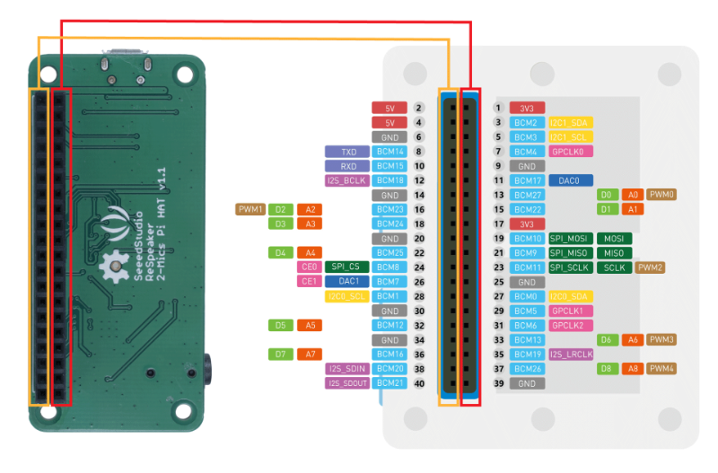
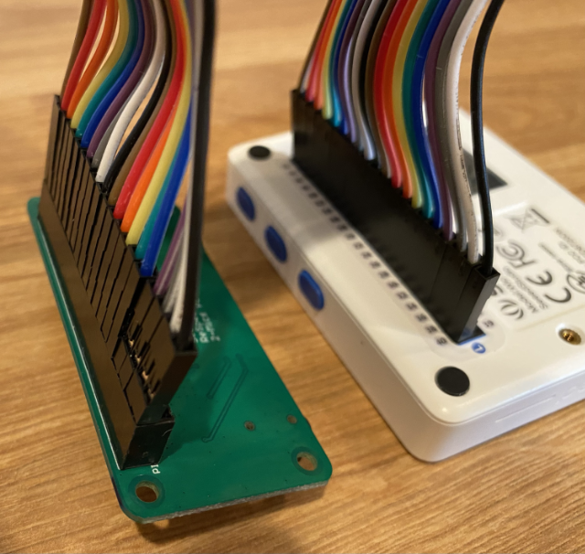

<!--
CO_OP_TRANSLATOR_METADATA:
{
  "original_hash": "93d352de36526b8990e41dd538100324",
  "translation_date": "2025-08-27T22:42:47+00:00",
  "source_file": "6-consumer/lessons/1-speech-recognition/wio-terminal-microphone.md",
  "language_code": "he"
}
-->
# הגדר את המיקרופון והרמקולים שלך - Wio Terminal

בחלק זה של השיעור, תוסיף רמקולים ל-Wio Terminal שלך. ל-Wio Terminal כבר יש מיקרופון מובנה, שניתן להשתמש בו כדי להקליט דיבור.

## חומרה

ל-Wio Terminal כבר יש מיקרופון מובנה, שניתן להשתמש בו כדי להקליט שמע לצורך זיהוי דיבור.

 כדי להוסיף רמקול, ניתן להשתמש ב-[ReSpeaker 2-Mics Pi Hat](https://www.seeedstudio.com/ReSpeaker-2-Mics-Pi-HAT.html). מדובר בלוח חיצוני שמכיל שני מיקרופונים MEMS, כמו גם חיבור לרמקול ושקע לאוזניות.

תצטרך להוסיף אוזניות, רמקול עם חיבור 3.5 מ"מ, או רמקול עם חיבור JST כמו [Mono Enclosed Speaker - 2W 6 Ohm](https://www.seeedstudio.com/Mono-Enclosed-Speaker-2W-6-Ohm-p-2832.html).

 כדי לחבר את ה-ReSpeaker 2-Mics Pi Hat תצטרך כבלי ג'אמפר 40 פינים (המכונים גם זכר-לזכר).

> 💁 אם אתה מיומן בהלחמה, תוכל להשתמש ב-[40 Pin Raspberry Pi Hat Adapter Board For Wio Terminal](https://www.seeedstudio.com/40-Pin-Raspberry-Pi-Hat-Adapter-Board-For-Wio-Terminal-p-4730.html) כדי לחבר את ה-ReSpeaker.

תצטרך גם כרטיס SD כדי להוריד ולהשמיע שמע. ה-Wio Terminal תומך רק בכרטיסי SD עד גודל של 16GB, ויש לעצב אותם כ-FAT32 או exFAT.

### משימה - חיבור ה-ReSpeaker Pi Hat

1. כשה-Wio Terminal כבוי, חבר את ה-ReSpeaker 2-Mics Pi Hat ל-Wio Terminal באמצעות כבלי הג'אמפר ושקעי ה-GPIO בגב ה-Wio Terminal:

    יש לחבר את הפינים בצורה הבאה:

    

1. מקם את ה-ReSpeaker ואת ה-Wio Terminal כך ששקעי ה-GPIO פונים כלפי מעלה, ובצד השמאלי.

1. התחל מהשקע בפינה השמאלית העליונה של שקע ה-GPIO ב-ReSpeaker. חבר כבל ג'אמפר מהשקע השמאלי העליון של ה-ReSpeaker לשקע השמאלי העליון של ה-Wio Terminal.

1. חזור על הפעולה לאורך כל שקעי ה-GPIO בצד השמאלי. ודא שהפינים מחוברים היטב.

    

    

    > 💁 אם כבלי הג'אמפר שלך מחוברים ברצועות, שמור אותם יחד - זה מקל על הבטחת חיבור כל הכבלים בסדר הנכון.

1. חזור על התהליך באמצעות שקעי ה-GPIO בצד הימני של ה-ReSpeaker וה-Wio Terminal. הכבלים הללו צריכים לעבור מסביב לכבלים שכבר מחוברים.

    

    

    > 💁 אם כבלי הג'אמפר שלך מחוברים ברצועות, חלק אותם לשתי רצועות. העבר אחת מכל צד של הכבלים הקיימים.

    > 💁 ניתן להשתמש בנייר דבק כדי להחזיק את הפינים כבלוק ולמנוע יציאה שלהם בזמן החיבור.
    >
    > 

1. תצטרך להוסיף רמקול.

    * אם אתה משתמש ברמקול עם כבל JST, חבר אותו ליציאת ה-JST ב-ReSpeaker.

      

    * אם אתה משתמש ברמקול עם חיבור 3.5 מ"מ או אוזניות, הכנס אותם לשקע 3.5 מ"מ.

      

### משימה - הגדרת כרטיס ה-SD

1. חבר את כרטיס ה-SD למחשב שלך, באמצעות קורא חיצוני אם אין לך חריץ לכרטיס SD.

1. עצב את כרטיס ה-SD באמצעות הכלי המתאים במחשב שלך, וודא שאתה משתמש במערכת קבצים FAT32 או exFAT.

1. הכנס את כרטיס ה-SD לחריץ ה-SD בצד השמאלי של ה-Wio Terminal, ממש מתחת לכפתור ההפעלה. ודא שהכרטיס נכנס עד הסוף ונלחץ פנימה - ייתכן שתצטרך כלי דק או כרטיס SD נוסף כדי לדחוף אותו עד הסוף.

    

    > 💁 כדי להוציא את כרטיס ה-SD, יש ללחוץ עליו מעט והוא ייצא. תצטרך כלי דק כמו מברג שטוח או כרטיס SD נוסף כדי לעשות זאת.

---

**כתב ויתור**:  
מסמך זה תורגם באמצעות שירות תרגום מבוסס בינה מלאכותית [Co-op Translator](https://github.com/Azure/co-op-translator). למרות שאנו שואפים לדיוק, יש לקחת בחשבון שתרגומים אוטומטיים עשויים להכיל שגיאות או אי דיוקים. המסמך המקורי בשפתו המקורית צריך להיחשב כמקור סמכותי. עבור מידע קריטי, מומלץ להשתמש בתרגום מקצועי על ידי אדם. איננו נושאים באחריות לאי הבנות או לפרשנויות שגויות הנובעות משימוש בתרגום זה.