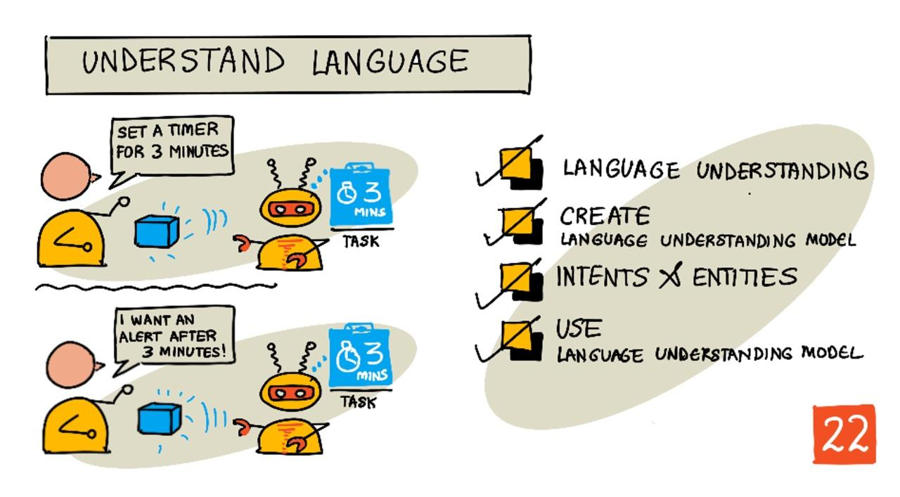

<!--
CO_OP_TRANSLATOR_METADATA:
{
  "original_hash": "6f4ba69d77f16c4a5110623a96a215c3",
  "translation_date": "2025-08-27T22:22:03+00:00",
  "source_file": "6-consumer/lessons/2-language-understanding/README.md",
  "language_code": "he"
}
-->
# להבין שפה



> סקיצה מאת [ניטיה נאראסימן](https://github.com/nitya). לחצו על התמונה לגרסה גדולה יותר.

## שאלון לפני השיעור

[שאלון לפני השיעור](https://black-meadow-040d15503.1.azurestaticapps.net/quiz/43)

## הקדמה

בשיעור הקודם המרתם דיבור לטקסט. כדי להשתמש בזה לתכנות טיימר חכם, הקוד שלכם יצטרך להבין מה נאמר. אפשר להניח שהמשתמש יאמר ביטוי קבוע, כמו "הגדר טיימר ל-3 דקות", ולנתח את הביטוי כדי להבין כמה זמן הטיימר צריך להיות, אבל זה לא מאוד ידידותי למשתמש. אם משתמש יאמר "הגדר טיימר ל-3 דקות", אתם ואני נבין למה הוא מתכוון, אבל הקוד שלכם לא, כי הוא מצפה לביטוי קבוע.

כאן נכנסת הבנת שפה לתמונה, באמצעות מודלים של בינה מלאכותית שמפרשים טקסט ומחזירים את הפרטים הנדרשים, למשל היכולת להבין גם "הגדר טיימר ל-3 דקות" וגם "הגדר טיימר ל-3 דקות", ולהבין שצריך טיימר ל-3 דקות.

בשיעור הזה תלמדו על מודלים להבנת שפה, איך ליצור אותם, לאמן אותם ולהשתמש בהם בקוד שלכם.

בשיעור הזה נעסוק ב:

* [הבנת שפה](../../../../../6-consumer/lessons/2-language-understanding)
* [יצירת מודל להבנת שפה](../../../../../6-consumer/lessons/2-language-understanding)
* [כוונות וישויות](../../../../../6-consumer/lessons/2-language-understanding)
* [שימוש במודל להבנת שפה](../../../../../6-consumer/lessons/2-language-understanding)

## הבנת שפה

בני אדם משתמשים בשפה לתקשורת במשך מאות אלפי שנים. אנחנו מתקשרים באמצעות מילים, צלילים או פעולות ומבינים מה נאמר, גם את משמעות המילים, הצלילים או הפעולות, וגם את ההקשר שלהן. אנחנו מבינים כנות וסרקזם, ומאפשרים לאותן מילים לקבל משמעויות שונות בהתאם לטון הדיבור שלנו.

✅ חשבו על כמה מהשיחות שניהלתם לאחרונה. כמה מהשיחה יהיה קשה למחשב להבין כי היא דורשת הקשר?

הבנת שפה, שנקראת גם הבנת שפה טבעית, היא חלק מתחום הבינה המלאכותית שנקרא עיבוד שפה טבעית (או NLP), ועוסקת בהבנת טקסט, בניסיון להבין את הפרטים של מילים או משפטים. אם אתם משתמשים בעוזר קולי כמו אלקסה או סירי, אתם משתמשים בשירותי הבנת שפה. אלו הם שירותי AI מאחורי הקלעים שממירים "אלקסה, נגן את האלבום האחרון של טיילור סוויפט" לריקוד של בתי בסלון לצלילי השירים האהובים עליה.

> 💁 מחשבים, למרות כל ההתקדמות שלהם, עדיין רחוקים מאוד מלהבין טקסט באמת. כשאנחנו מדברים על הבנת שפה במחשבים, אנחנו לא מתכוונים לשום דבר שמתקרב לתקשורת אנושית מתקדמת, אלא ללקיחת מילים והפקת פרטים מרכזיים.

כבני אדם, אנחנו מבינים שפה בלי לחשוב על זה יותר מדי. אם הייתי מבקש מאדם אחר "לנגן את האלבום האחרון של טיילור סוויפט", הוא היה מבין מיד למה אני מתכוון. עבור מחשב, זה קשה יותר. הוא יצטרך לקחת את המילים, שהומרו מדיבור לטקסט, ולפענח את הפרטים הבאים:

* צריך לנגן מוזיקה
* המוזיקה היא של האמן טיילור סוויפט
* המוזיקה הספציפית היא אלבום שלם עם מספר שירים בסדר מסוים
* לטיילור סוויפט יש הרבה אלבומים, ולכן צריך למיין אותם לפי סדר כרונולוגי והאלבום האחרון שפורסם הוא זה שנדרש

✅ חשבו על משפטים אחרים שאמרתם כשביקשתם משהו, כמו הזמנת קפה או בקשה מבני משפחה להעביר לכם משהו. נסו לפרק אותם לפרטים שמחשב יצטרך להפיק כדי להבין את המשפט.

מודלים להבנת שפה הם מודלים של AI שמאומנים להפיק פרטים מסוימים משפה, ואז מאומנים למשימות ספציפיות באמצעות למידה מעבירה, באותו אופן שבו אימנתם מודל Custom Vision באמצעות סט קטן של תמונות. אפשר לקחת מודל, ואז לאמן אותו באמצעות הטקסט שאתם רוצים שהוא יבין.

## יצירת מודל להבנת שפה


אפשר ליצור מודלים להבנת שפה באמצעות LUIS, שירות להבנת שפה של מיקרוסופט שהוא חלק משירותי Cognitive Services.

### משימה - יצירת משאב מחבר

כדי להשתמש ב-LUIS, צריך ליצור משאב מחבר.

1. השתמשו בפקודה הבאה כדי ליצור משאב מחבר בקבוצת המשאבים `smart-timer`:

    ```python
    az cognitiveservices account create --name smart-timer-luis-authoring \
                                        --resource-group smart-timer \
                                        --kind LUIS.Authoring \
                                        --sku F0 \
                                        --yes \
                                        --location <location>
    ```

    החליפו `<location>` במיקום שבו יצרתם את קבוצת המשאבים.

    > ⚠️ LUIS לא זמין בכל האזורים, אז אם אתם מקבלים את השגיאה הבאה:
    >
    > ```output
    > InvalidApiSetId: The account type 'LUIS.Authoring' is either invalid or unavailable in given region.
    > ```
    >
    > בחרו אזור אחר.

    זה ייצור משאב מחבר ברמת חינם.

### משימה - יצירת אפליקציה להבנת שפה

1. פתחו את פורטל LUIS בכתובת [luis.ai](https://luis.ai?WT.mc_id=academic-17441-jabenn) בדפדפן שלכם, והתחברו עם אותו חשבון שבו השתמשתם עבור Azure.

1. עקבו אחר ההוראות בדיאלוג כדי לבחור את המנוי שלכם ב-Azure, ואז בחרו במשאב `smart-timer-luis-authoring` שיצרתם זה עתה.

1. מרשימת *אפליקציות שיחה*, בחרו בכפתור **אפליקציה חדשה** כדי ליצור אפליקציה חדשה. תנו לאפליקציה החדשה את השם `smart-timer`, והגדירו את *התרבות* לשפה שלכם.

    > 💁 יש שדה למשאב חיזוי. אפשר ליצור משאב נוסף רק לחיזוי, אבל המשאב המחבר ברמת חינם מאפשר 1,000 חיזויים בחודש וזה אמור להספיק לפיתוח, אז אפשר להשאיר את זה ריק.

1. קראו את המדריך שמופיע לאחר יצירת האפליקציה כדי להבין את השלבים שצריך לבצע כדי לאמן את המודל להבנת שפה. סגרו את המדריך כשסיימתם.

## כוונות וישויות

הבנת שפה מבוססת על *כוונות* ו*ישויות*. כוונות הן מה הכוונה של המילים, למשל לנגן מוזיקה, להגדיר טיימר או להזמין אוכל. ישויות הן למה הכוונה מתייחסת, כמו האלבום, משך הטיימר או סוג האוכל. כל משפט שהמודל מפרש צריך לכלול לפחות כוונה אחת, ואופציונלית אחת או יותר ישויות.

כמה דוגמאות:

| משפט                                                | כוונה            | ישויות                                    |
| --------------------------------------------------- | ---------------- | ------------------------------------------ |
| "נגן את האלבום האחרון של טיילור סוויפט"             | *נגן מוזיקה*     | *האלבום האחרון של טיילור סוויפט*          |
| "הגדר טיימר ל-3 דקות"                               | *הגדר טיימר*     | *3 דקות*                                  |
| "בטל את הטיימר שלי"                                 | *בטל טיימר*      | אין                                       |
| "הזמן 3 פיצות גדולות עם אננס וסלט קיסר"             | *הזמן אוכל*      | *3 פיצות גדולות עם אננס*, *סלט קיסר*      |

✅ עם המשפטים שחשבתם עליהם קודם, מה תהיה הכוונה ואילו ישויות יהיו במשפט?

כדי לאמן את LUIS, קודם מגדירים את הישויות. אלו יכולות להיות רשימה קבועה של מונחים, או נלמדות מהטקסט. למשל, אפשר לספק רשימה קבועה של אוכל זמין מהתפריט שלכם, עם וריאציות (או מילים נרדפות) לכל מילה, כמו *חציל* ו*אוברג'ין* כווריאציות של *אוברג'ין*. ל-LUIS יש גם ישויות מובנות שניתן להשתמש בהן, כמו מספרים ומיקומים.

להגדרת טיימר, אפשר להגדיר ישות אחת שמשתמשת בישויות המספר המובנות עבור הזמן, ואחת נוספת עבור היחידות, כמו דקות ושניות. כל יחידה תכלול מספר וריאציות כדי לכסות את הצורות היחידניות והרבות - כמו דקה ודקות.

לאחר הגדרת הישויות, יוצרים כוונות. אלו נלמדות על ידי המודל על בסיס משפטי דוגמה שאתם מספקים (שנקראים ביטויים). למשל, עבור כוונת *הגדר טיימר*, אפשר לספק את המשפטים הבאים:

* `הגדר טיימר ל-1 שנייה`
* `הגדר טיימר ל-1 דקה ו-12 שניות`
* `הגדר טיימר ל-3 דקות`
* `הגדר טיימר ל-9 דקות ו-30 שניות`

לאחר מכן, אומרים ל-LUIS אילו חלקים מהמשפטים מתאימים לישויות:


המשפט `הגדר טיימר ל-1 דקה ו-12 שניות` כולל את הכוונה `הגדר טיימר`. הוא גם כולל 2 ישויות עם 2 ערכים כל אחת:

|            | זמן | יחידה   |
| ---------- | ---: | ------ |
| 1 דקה      | 1    | דקה    |
| 12 שניות   | 12   | שנייה  |

כדי לאמן מודל טוב, צריך מגוון רחב של משפטי דוגמה שונים כדי לכסות את הדרכים הרבות שבהן מישהו עשוי לבקש את אותו הדבר.

> 💁 כמו בכל מודל AI, ככל שיש יותר נתונים ונתונים מדויקים יותר לאימון, כך המודל יהיה טוב יותר.

✅ חשבו על הדרכים השונות שבהן אתם עשויים לבקש את אותו הדבר ולצפות שאדם יבין.

### משימה - הוספת ישויות למודלים להבנת שפה

עבור הטיימר, צריך להוסיף 2 ישויות - אחת עבור יחידת הזמן (דקות או שניות), ואחת עבור מספר הדקות או השניות.

אפשר למצוא הוראות לשימוש בפורטל LUIS בתיעוד [Quickstart: Build your app in LUIS portal documentation on Microsoft docs](https://docs.microsoft.com/azure/cognitive-services/luis/luis-get-started-create-app?WT.mc_id=academic-17441-jabenn).

1. מתוך פורטל LUIS, בחרו בלשונית *ישויות* והוסיפו את ישות המספר המובנית על ידי בחירת כפתור **הוסף ישות מובנית**, ואז בחירת *מספר* מהרשימה.

1. צרו ישות חדשה עבור יחידת הזמן באמצעות כפתור **צור**. תנו לישות את השם `יחידת זמן` והגדירו את הסוג ל*רשימה*. הוסיפו ערכים עבור `דקה` ו`שנייה` לרשימת *ערכים מנורמלים*, והוסיפו את הצורות היחידניות והרבות לרשימת *מילים נרדפות*. לחצו `Enter` לאחר הוספת כל מילה נרדפת כדי להוסיף אותה לרשימה.

    | ערך מנורמל | מילים נרדפות        |
    | ---------- | ------------------- |
    | דקה        | דקה, דקות           |
    | שנייה      | שנייה, שניות        |

### משימה - הוספת כוונות למודלים להבנת שפה

1. מתוך לשונית *כוונות*, בחרו בכפתור **צור** כדי ליצור כוונה חדשה. תנו לכוונה את השם `הגדר טיימר`.

1. בדוגמאות, הכניסו דרכים שונות להגדיר טיימר באמצעות דקות, שניות ושילוב של דקות ושניות. דוגמאות יכולות להיות:

    * `הגדר טיימר ל-1 שנייה`
    * `הגדר טיימר ל-4 דקות`
    * `הגדר טיימר ל-4 דקות ו-6 שניות`
    * `הגדר טיימר ל-9 דקות ו-30 שניות`
    * `הגדר טיימר ל-1 דקה ו-12 שניות`
    * `הגדר טיימר ל-3 דקות`
    * `הגדר טיימר ל-3 דקות ו-1 שנייה`
    * `הגדר טיימר ל-3 דקות ו-1 שנייה`
    * `הגדר טיימר ל-1 דקה ו-1 שנייה`
    * `הגדר טיימר ל-30 שניות`
    * `הגדר טיימר ל-1 שנייה`

    ערבבו בין מספרים כמילים ומספרים כדי שהמודל ילמד להתמודד עם שניהם.

1. כשאתם מכניסים כל דוגמה, LUIS יתחיל לזהות ישויות, ויתחיל להדגיש ולתייג כל ישות שהוא מוצא.

    

### משימה - אימון ובדיקת המודל

1. לאחר הגדרת הישויות והכוונות, אפשר לאמן את המודל באמצעות כפתור **אמן** בתפריט העליון. בחרו בכפתור הזה, והמודל אמור להתאמן תוך כמה שניות. הכפתור יהיה אפור בזמן האימון, ויופעל מחדש כשהאימון יסתיים.

1. בחרו בכפתור **בדוק** מהתפריט העליון כדי לבדוק את המודל להבנת שפה. הכניסו טקסט כמו `הגדר טיימר ל-5 דקות ו-4 שניות` ולחצו Enter. המשפט יופיע בתיבה מתחת לתיבת הטקסט שהקלדתם לתוכה, ומתחת לזה תופיע *הכוונה העליונה*, או הכוונה שזוהתה עם ההסתברות הגבוהה ביותר. זה אמור להיות `הגדר טיימר`. שם הכוונה ילווה באחוז ההסתברות שהכוונה שזוהתה היא הנכונה.

1. בחרו באפשרות **בדוק** כדי לראות פירוט של התוצאות. תוכלו לראות את הכוונה עם ההסתברות הגבוהה ביותר, יחד עם רשימות של הישויות שזוהו.

1. סגרו את חלונית *בדוק* כשסיימתם לבדוק.

### משימה - פרסום המודל

כדי להשתמש במודל הזה מהקוד, צריך לפרסם אותו. כשמפרסמים מ-LUIS, אפשר לפרסם לסביבת בדיקות או לסביבת מוצר לשחרור מלא. בשיעור הזה, סביבת בדיקות מספיקה.

1. מתוך פורטל LUIS, בחרו בכפתור **פרסם** מהתפריט העליון.

1. ודאו ש*סביבת בדיקות* נבחרה, ואז בחרו **סיום**. תראו הודעה כשהאפליקציה פורסמה.

1. אפשר לבדוק את זה באמצעות curl. כדי לבנות את פקודת curl, צריך שלושה ערכים - נקודת הקצה, מזהה האפליקציה (App ID) ומפתח API. אפשר לגשת אליהם מתוך לשונית **ניהול** שניתן לבחור מהתפריט העליון.

    1. מתוך סעיף *הגדרות*, העתיקו את מזהה האפליקציה.
1. מתוך הסעיף *Azure Resources*, בחרו את *Authoring Resource*, והעתיקו את ה-*Primary Key* ואת ה-*Endpoint URL*.

1. הריצו את פקודת ה-curl הבאה ב-command prompt או ב-terminal שלכם:

    ```sh
    curl "<endpoint url>/luis/prediction/v3.0/apps/<app id>/slots/staging/predict" \
          --request GET \
          --get \
          --data "subscription-key=<primary key>" \
          --data "verbose=false" \
          --data "show-all-intents=true" \
          --data-urlencode "query=<sentence>"
    ```

    החליפו `<endpoint url>` ב-Endpoint URL מהסעיף *Azure Resources*.

    החליפו `<app id>` ב-App ID מהסעיף *Settings*.

    החליפו `<primary key>` ב-Primary Key מהסעיף *Azure Resources*.

    החליפו `<sentence>` במשפט שברצונכם לבדוק.

1. הפלט של הקריאה הזו יהיה מסמך JSON שמפרט את השאילתה, הכוונה המרכזית (top intent), ורשימה של ישויות (entities) המחולקות לפי סוג.

    ```JSON
    {
        "query": "set a timer for 45 minutes and 12 seconds",
        "prediction": {
            "topIntent": "set timer",
            "intents": {
                "set timer": {
                    "score": 0.97031575
                },
                "None": {
                    "score": 0.02205793
                }
            },
            "entities": {
                "number": [
                    45,
                    12
                ],
                "time-unit": [
                    [
                        "minute"
                    ],
                    [
                        "second"
                    ]
                ]
            }
        }
    }
    ```

    ה-JSON למעלה נוצר משאילתה עם המשפט `set a timer for 45 minutes and 12 seconds`:

    * ה-`set timer` הייתה הכוונה המרכזית עם הסתברות של 97%.
    * זוהו שתי ישויות מסוג *number*, `45` ו-`12`.
    * זוהו שתי ישויות מסוג *time-unit*, `minute` ו-`second`.

## שימוש במודל הבנת השפה

לאחר פרסום, ניתן לקרוא למודל LUIS מתוך קוד. בשיעורים קודמים השתמשתם ב-IoT Hub לניהול תקשורת עם שירותי ענן, שליחת טלמטריה והאזנה לפקודות. זהו תהליך אסינכרוני מאוד - לאחר שליחת הטלמטריה, הקוד שלכם לא ממתין לתגובה, ואם שירות הענן אינו זמין, לא תדעו על כך.

לטיימר חכם, נרצה תגובה מיידית, כך שנוכל להודיע למשתמש שטיימר הוגדר, או להתריע ששירותי הענן אינם זמינים. לשם כך, המכשיר ה-IoT שלנו יקרא ישירות ל-web endpoint במקום להסתמך על IoT Hub.

במקום לקרוא ל-LUIS ישירות ממכשיר ה-IoT, ניתן להשתמש בקוד serverless עם טריגר מסוג שונה - טריגר HTTP. זה מאפשר לאפליקציית הפונקציות שלכם להאזין לבקשות REST ולהגיב להן. פונקציה זו תהיה REST endpoint שהמכשיר שלכם יוכל לקרוא לו.

> 💁 למרות שניתן לקרוא ל-LUIS ישירות ממכשיר ה-IoT שלכם, עדיף להשתמש במשהו כמו קוד serverless. כך, כאשר תרצו לשנות את אפליקציית LUIS שאתם קוראים לה, למשל כאשר תאמנו מודל טוב יותר או מודל בשפה שונה, תצטרכו לעדכן רק את הקוד בענן ולא לפרוס מחדש קוד לאלפי או מיליוני מכשירי IoT.

### משימה - יצירת אפליקציית פונקציות serverless

1. צרו אפליקציית Azure Functions בשם `smart-timer-trigger`, ופתחו אותה ב-VS Code.

1. הוסיפו טריגר HTTP לאפליקציה בשם `speech-trigger` באמצעות הפקודה הבאה מתוך הטרמינל של VS Code:

    ```sh
    func new --name text-to-timer --template "HTTP trigger"
    ```

    פעולה זו תיצור טריגר HTTP בשם `text-to-timer`.

1. בדקו את טריגר ה-HTTP על ידי הרצת אפליקציית הפונקציות. כאשר היא תרוץ, תראו את ה-endpoint מופיע בפלט:

    ```output
    Functions:
    
            text-to-timer: [GET,POST] http://localhost:7071/api/text-to-timer
    ```

    בדקו זאת על ידי טעינת ה-URL [http://localhost:7071/api/text-to-timer](http://localhost:7071/api/text-to-timer) בדפדפן שלכם.

    ```output
    This HTTP triggered function executed successfully. Pass a name in the query string or in the request body for a personalized response.
    ```

### משימה - שימוש במודל הבנת השפה

1. ה-SDK של LUIS זמין דרך חבילת Pip. הוסיפו את השורה הבאה לקובץ `requirements.txt` כדי להוסיף את התלות בחבילה זו:

    ```sh
    azure-cognitiveservices-language-luis
    ```

1. ודאו שהטרמינל של VS Code מפעיל את הסביבה הווירטואלית, והריצו את הפקודה הבאה להתקנת חבילות ה-Pip:

    ```sh
    pip install -r requirements.txt
    ```

    > 💁 אם אתם מקבלים שגיאות, ייתכן שתצטרכו לעדכן את pip באמצעות הפקודה הבאה:
    >
    > ```sh
    > pip install --upgrade pip
    > ```

1. הוסיפו ערכים חדשים לקובץ `local.settings.json` עבור מפתח ה-API של LUIS, ה-Endpoint URL, וה-App ID מהכרטיסייה **MANAGE** בפורטל LUIS:

    ```JSON
    "LUIS_KEY": "<primary key>",
    "LUIS_ENDPOINT_URL": "<endpoint url>",
    "LUIS_APP_ID": "<app id>"
    ```

    החליפו `<endpoint url>` ב-Endpoint URL מהסעיף *Azure Resources* בכרטיסייה **MANAGE**. זה יהיה `https://<location>.api.cognitive.microsoft.com/`.

    החליפו `<app id>` ב-App ID מהסעיף *Settings* בכרטיסייה **MANAGE**.

    החליפו `<primary key>` ב-Primary Key מהסעיף *Azure Resources* בכרטיסייה **MANAGE**.

1. הוסיפו את הייבוא הבא לקובץ `__init__.py`:

    ```python
    import json
    import os
    from azure.cognitiveservices.language.luis.runtime import LUISRuntimeClient
    from msrest.authentication import CognitiveServicesCredentials
    ```

    זה מייבא ספריות מערכת, כמו גם את הספריות לאינטראקציה עם LUIS.

1. מחקו את התוכן של המתודה `main`, והוסיפו את הקוד הבא:

    ```python
    luis_key = os.environ['LUIS_KEY']
    endpoint_url = os.environ['LUIS_ENDPOINT_URL']
    app_id = os.environ['LUIS_APP_ID']
    
    credentials = CognitiveServicesCredentials(luis_key)
    client = LUISRuntimeClient(endpoint=endpoint_url, credentials=credentials)
    ```

    קוד זה טוען את הערכים שהוספתם לקובץ `local.settings.json` עבור אפליקציית LUIS שלכם, יוצר אובייקט credentials עם מפתח ה-API שלכם, ואז יוצר אובייקט לקוח LUIS לאינטראקציה עם האפליקציה.

1. טריגר HTTP זה ייקרא עם טקסט להבנה כ-JSON, כאשר הטקסט נמצא במאפיין בשם `text`. הקוד הבא שולף את הערך מגוף בקשת ה-HTTP ורושם אותו לקונסול. הוסיפו קוד זה לפונקציה `main`:

    ```python
    req_body = req.get_json()
    text = req_body['text']
    logging.info(f'Request - {text}')
    ```

1. תחזיות נשלחות ל-LUIS על ידי שליחת בקשת תחזית - מסמך JSON המכיל את הטקסט לחיזוי. צרו זאת עם הקוד הבא:

    ```python
    prediction_request = { 'query' : text }
    ```

1. בקשה זו יכולה להישלח ל-LUIS, תוך שימוש ב-slot ה-staging שאליו פורסמה האפליקציה שלכם:

    ```python
    prediction_response = client.prediction.get_slot_prediction(app_id, 'Staging', prediction_request)
    ```

1. תגובת התחזית מכילה את הכוונה המרכזית - הכוונה עם ציון התחזית הגבוה ביותר, יחד עם הישויות. אם הכוונה המרכזית היא `set timer`, ניתן לקרוא את הישויות כדי לקבל את הזמן הדרוש לטיימר:

    ```python
    if prediction_response.prediction.top_intent == 'set timer':
        numbers = prediction_response.prediction.entities['number']
        time_units = prediction_response.prediction.entities['time unit']
        total_seconds = 0
    ```

    הישויות מסוג `number` יהיו מערך של מספרים. לדוגמה, אם אמרתם *"Set a four minute 17 second timer."*, אז המערך `number` יכיל שני מספרים - 4 ו-17.

    הישויות מסוג `time unit` יהיו מערך של מערכים של מחרוזות, כאשר כל יחידת זמן היא מערך של מחרוזות בתוך המערך. לדוגמה, אם אמרתם *"Set a four minute 17 second timer."*, אז המערך `time unit` יכיל שני מערכים עם ערך יחיד כל אחד - `['minute']` ו-`['second']`.

    גרסת ה-JSON של ישויות אלו עבור *"Set a four minute 17 second timer."* היא:

    ```json
    {
        "number": [4, 17],
        "time unit": [
            ["minute"],
            ["second"]
        ]
    }
    ```

    קוד זה גם מגדיר משתנה לספירה הכוללת של הזמן לטיימר בשניות. משתנה זה יתמלא על ידי הערכים מהישויות.

1. הישויות אינן מקושרות, אך ניתן להניח הנחות מסוימות לגביהן. הן יהיו בסדר שבו נאמרו, כך שניתן להשתמש במיקום במערך כדי לקבוע איזה מספר מתאים לאיזו יחידת זמן. לדוגמה:

    * *"Set a 30 second timer"* - יהיה מספר אחד, `30`, ויחידת זמן אחת, `second`, כך שהמספר היחיד יתאים ליחידת הזמן היחידה.
    * *"Set a 2 minute and 30 second timer"* - יהיו שני מספרים, `2` ו-`30`, ושתי יחידות זמן, `minute` ו-`second`, כך שהמספר הראשון יהיה עבור יחידת הזמן הראשונה (2 דקות), והמספר השני עבור יחידת הזמן השנייה (30 שניות).

    הקוד הבא מקבל את מספר הפריטים בישויות המספר, ומשתמש בכך כדי לשלוף את הפריט הראשון מכל מערך, ואז את השני וכן הלאה. הוסיפו זאת בתוך הבלוק `if`.

    ```python
    for i in range(0, len(numbers)):
        number = numbers[i]
        time_unit = time_units[i][0]
    ```

    עבור *"Set a four minute 17 second timer."*, זה ירוץ פעמיים, וייתן את הערכים הבאים:

    | מספר לולאה | `number` | `time_unit` |
    | ---------: | -------: | ----------- |
    | 0          | 4        | minute      |
    | 1          | 17       | second      |

1. בתוך לולאה זו, השתמשו במספר וביחידת הזמן כדי לחשב את הזמן הכולל לטיימר, תוך הוספת 60 שניות עבור כל דקה, ומספר השניות עבור כל שניות.

    ```python
    if time_unit == 'minute':
        total_seconds += number * 60
    else:
        total_seconds += number
    ```

1. מחוץ ללולאה זו דרך הישויות, רשמו את הזמן הכולל לטיימר:

    ```python
    logging.info(f'Timer required for {total_seconds} seconds')
    ```

1. מספר השניות צריך להיות מוחזר מהפונקציה כתשובת HTTP. בסוף הבלוק `if`, הוסיפו את הקוד הבא:

    ```python
    payload = {
        'seconds': total_seconds
    }
    return func.HttpResponse(json.dumps(payload), status_code=200)
    ```

    קוד זה יוצר מטען המכיל את המספר הכולל של השניות לטיימר, ממיר אותו למחרוזת JSON ומחזיר אותו כתוצאה של HTTP עם קוד סטטוס 200, שמשמעותו שהקריאה הצליחה.

1. לבסוף, מחוץ לבלוק `if`, טפלו במקרה שבו הכוונה לא זוהתה על ידי החזרת קוד שגיאה:

    ```python
    return func.HttpResponse(status_code=404)
    ```

    404 הוא קוד הסטטוס עבור *לא נמצא*.

1. הריצו את אפליקציית הפונקציות ובדקו אותה באמצעות curl.

    ```sh
    curl --request POST 'http://localhost:7071/api/text-to-timer' \
         --header 'Content-Type: application/json' \
         --include \
         --data '{"text":"<text>"}'
    ```

    החליפו `<text>` בטקסט של הבקשה שלכם, לדוגמה `set a 2 minutes 27 second timer`.

    תראו את הפלט הבא מאפליקציית הפונקציות:

    ```output
    Functions:

            text-to-timer: [GET,POST] http://localhost:7071/api/text-to-timer
    
    For detailed output, run func with --verbose flag.
    [2021-06-26T19:45:14.502Z] Worker process started and initialized.
    [2021-06-26T19:45:19.338Z] Host lock lease acquired by instance ID '000000000000000000000000951CAE4E'.
    [2021-06-26T19:45:52.059Z] Executing 'Functions.text-to-timer' (Reason='This function was programmatically called via the host APIs.', Id=f68bfb90-30e4-47a5-99da-126b66218e81)
    [2021-06-26T19:45:53.577Z] Timer required for 147 seconds
    [2021-06-26T19:45:53.746Z] Executed 'Functions.text-to-timer' (Succeeded, Id=f68bfb90-30e4-47a5-99da-126b66218e81, Duration=1750ms)
    ```

    הקריאה ל-curl תחזיר את הפלט הבא:

    ```output
    HTTP/1.1 200 OK
    Date: Tue, 29 Jun 2021 01:14:11 GMT
    Content-Type: text/plain; charset=utf-8
    Server: Kestrel
    Transfer-Encoding: chunked
    
    {"seconds": 147}
    ```

    מספר השניות לטיימר נמצא בערך `"seconds"`.

> 💁 ניתן למצוא את הקוד הזה בתיקייה [code/functions](../../../../../6-consumer/lessons/2-language-understanding/code/functions).

### משימה - הפיכת הפונקציה לזמינה למכשיר ה-IoT שלכם

1. כדי שמכשיר ה-IoT שלכם יוכל לקרוא ל-REST endpoint שלכם, הוא יצטרך לדעת את ה-URL. כאשר ניגשתם אליו קודם, השתמשתם ב-`localhost`, שהוא קיצור לגישה ל-REST endpoints במחשב המקומי שלכם. כדי לאפשר למכשיר ה-IoT שלכם גישה, תצטרכו או לפרסם לענן, או לקבל את כתובת ה-IP שלכם כדי לגשת אליו מקומית.

    > ⚠️ אם אתם משתמשים ב-Wio Terminal, קל יותר להריץ את אפליקציית הפונקציות מקומית, מכיוון שתהיה תלות בספריות שלא תאפשר לפרוס את אפליקציית הפונקציות באותו אופן כמו שעשיתם קודם. הריצו את אפליקציית הפונקציות מקומית וגשתם אליה דרך כתובת ה-IP של המחשב שלכם. אם בכל זאת תרצו לפרוס לענן, מידע יינתן בשיעור מאוחר יותר על הדרך לעשות זאת.

    * פרסמו את אפליקציית הפונקציות - עקבו אחר ההוראות בשיעורים קודמים לפרסום אפליקציית הפונקציות שלכם לענן. לאחר הפרסום, ה-URL יהיה `https://<APP_NAME>.azurewebsites.net/api/text-to-timer`, כאשר `<APP_NAME>` יהיה שם אפליקציית הפונקציות שלכם. ודאו גם שאתם מפרסמים את ההגדרות המקומיות שלכם.

      כאשר עובדים עם טריגרי HTTP, הם מאובטחים כברירת מחדל עם מפתח אפליקציית פונקציות. כדי לקבל מפתח זה, הריצו את הפקודה הבאה:

      ```sh
      az functionapp keys list --resource-group smart-timer \
                               --name <APP_NAME>                               
      ```

      העתיקו את הערך של הערך `default` מתוך הסעיף `functionKeys`.

      ```output
      {
        "functionKeys": {
          "default": "sQO1LQaeK9N1qYD6SXeb/TctCmwQEkToLJU6Dw8TthNeUH8VA45hlA=="
        },
        "masterKey": "RSKOAIlyvvQEQt9dfpabJT018scaLpQu9p1poHIMCxx5LYrIQZyQ/g==",
        "systemKeys": {}
      }
      ```

      מפתח זה יצטרך להיתוסף כפרמטר שאילתה ל-URL, כך שה-URL הסופי יהיה `https://<APP_NAME>.azurewebsites.net/api/text-to-timer?code=<FUNCTION_KEY>`, כאשר `<APP_NAME>` יהיה שם אפליקציית הפונקציות שלכם, ו-`<FUNCTION_KEY>` יהיה מפתח הפונקציה שלכם.

      > 💁 ניתן לשנות את סוג ההרשאה של טריגר ה-HTTP באמצעות ההגדרה `authlevel` בקובץ `function.json`. ניתן לקרוא עוד על כך בסעיף [הגדרות בתיעוד טריגר HTTP של Azure Functions במיקרוסופט דוקס](https://docs.microsoft.com/azure/azure-functions/functions-bindings-http-webhook-trigger?WT.mc_id=academic-17441-jabenn&tabs=python#configuration).

    * הריצו את אפליקציית הפונקציות מקומית, וגשתם אליה באמצעות כתובת ה-IP - תוכלו לקבל את כתובת ה-IP של המחשב שלכם ברשת המקומית, ולהשתמש בה לבניית ה-URL.

      מצאו את כתובת ה-IP שלכם:

      * ב-Windows 10, עקבו אחר [המדריך למציאת כתובת ה-IP שלכם](https://support.microsoft.com/windows/find-your-ip-address-f21a9bbc-c582-55cd-35e0-73431160a1b9?WT.mc_id=academic-17441-jabenn)
      * ב-macOS, עקבו אחר [המדריך למציאת כתובת ה-IP שלכם ב-Mac](https://www.hellotech.com/guide/for/how-to-find-ip-address-on-mac)
      * ב-Linux, עקבו אחר הסעיף למציאת כתובת ה-IP הפרטית שלכם במדריך [כיצד למצוא את כתובת ה-IP שלכם ב-Linux](https://opensource.com/article/18/5/how-find-ip-address-linux)

      לאחר שיש לכם את כתובת ה-IP, תוכלו לגשת לפונקציה ב-`http://`.
<כתובת_IP>
:7071/api/text-to-timer`, כאשר `<IP_ADDRESS>` יהיה כתובת ה-IP שלך, לדוגמה `http://192.168.1.10:7071/api/text-to-timer`.

      > 💁 שים לב שזה משתמש בפורט 7071, אז לאחר כתובת ה-IP תצטרך להוסיף `:7071`.

      > 💁 זה יעבוד רק אם מכשיר ה-IoT שלך נמצא באותה רשת כמו המחשב שלך.

1. בדוק את נקודת הקצה על ידי גישה אליה באמצעות curl.

---

## 🚀 אתגר

ישנן דרכים רבות לבקש את אותו הדבר, כמו להגדיר טיימר. חשוב על דרכים שונות לעשות זאת, והשתמש בהן כדוגמאות באפליקציית LUIS שלך. בדוק אותן, כדי לראות עד כמה המודל שלך יכול להתמודד עם דרכים שונות לבקש טיימר.

## שאלון לאחר ההרצאה

[שאלון לאחר ההרצאה](https://black-meadow-040d15503.1.azurestaticapps.net/quiz/44)

## סקירה ולימוד עצמי

* קרא עוד על LUIS ועל היכולות שלו בעמוד [תיעוד Language Understanding (LUIS) במיקרוסופט דוקס](https://docs.microsoft.com/azure/cognitive-services/luis/?WT.mc_id=academic-17441-jabenn)
* קרא עוד על הבנת שפה בעמוד [הבנת שפה טבעית בויקיפדיה](https://wikipedia.org/wiki/Natural-language_understanding)
* קרא עוד על טריגרים של HTTP בעמוד [תיעוד טריגר HTTP של Azure Functions במיקרוסופט דוקס](https://docs.microsoft.com/azure/azure-functions/functions-bindings-http-webhook-trigger?WT.mc_id=academic-17441-jabenn&tabs=python)

## משימה

[בטל את הטיימר](assignment.md)

---

**כתב ויתור**:  
מסמך זה תורגם באמצעות שירות תרגום מבוסס בינה מלאכותית [Co-op Translator](https://github.com/Azure/co-op-translator). למרות שאנו שואפים לדיוק, יש לקחת בחשבון שתרגומים אוטומטיים עשויים להכיל שגיאות או אי דיוקים. המסמך המקורי בשפתו המקורית צריך להיחשב כמקור סמכותי. עבור מידע קריטי, מומלץ להשתמש בתרגום מקצועי על ידי אדם. איננו נושאים באחריות לאי הבנות או לפרשנויות שגויות הנובעות משימוש בתרגום זה.