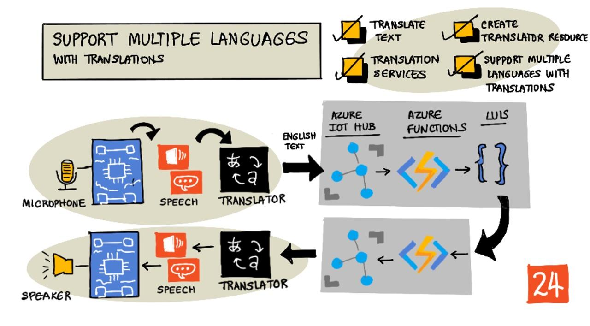

<!--
CO_OP_TRANSLATOR_METADATA:
{
  "original_hash": "c16de27b0074abe81d6a8bad5e5b1a6b",
  "translation_date": "2025-08-27T22:15:45+00:00",
  "source_file": "6-consumer/lessons/4-multiple-language-support/README.md",
  "language_code": "he"
}
-->
# תמיכה בשפות מרובות



> סקיצה מאת [ניטיה נאראסימן](https://github.com/nitya). לחצו על התמונה לגרסה גדולה יותר.

הווידאו הזה מספק סקירה של שירותי הדיבור של Azure, כולל המרה מדיבור לטקסט וטקסט לדיבור מהשיעורים הקודמים, וכן תרגום דיבור, נושא שמכוסה בשיעור הזה:

[](https://www.youtube.com/watch?v=h6xbpMPSGEA)

> 🎥 לחצו על התמונה למעלה לצפייה בווידאו

## שאלון לפני השיעור

[שאלון לפני השיעור](https://black-meadow-040d15503.1.azurestaticapps.net/quiz/47)

## מבוא

בשלושת השיעורים האחרונים למדתם על המרה מדיבור לטקסט, הבנת שפה, והמרה מטקסט לדיבור, כולם מופעלים על ידי בינה מלאכותית. תחום נוסף בתקשורת אנושית שבו AI יכול לעזור הוא תרגום שפה - המרה משפה אחת לאחרת, כמו מאנגלית לצרפתית.

בשיעור הזה תלמדו כיצד להשתמש ב-AI לתרגום טקסט, מה שיאפשר לטיימר החכם שלכם לתקשר עם משתמשים בשפות מרובות.

בשיעור הזה נעסוק ב:

* [תרגום טקסט](../../../../../6-consumer/lessons/4-multiple-language-support)
* [שירותי תרגום](../../../../../6-consumer/lessons/4-multiple-language-support)
* [יצירת משאב מתרגם](../../../../../6-consumer/lessons/4-multiple-language-support)
* [תמיכה בשפות מרובות באפליקציות באמצעות תרגומים](../../../../../6-consumer/lessons/4-multiple-language-support)
* [תרגום טקסט באמצעות שירות AI](../../../../../6-consumer/lessons/4-multiple-language-support)

> 🗑 זהו השיעור האחרון בפרויקט הזה, אז לאחר השלמת השיעור והמשימה, אל תשכחו לנקות את שירותי הענן שלכם. תצטרכו את השירותים כדי להשלים את המשימה, אז ודאו שאתם מסיימים אותה קודם.
>
> עיינו ב[מדריך לניקוי הפרויקט שלכם](../../../clean-up.md) אם יש צורך בהוראות כיצד לעשות זאת.

## תרגום טקסט

תרגום טקסט היה בעיה במדעי המחשב שנחקרה במשך יותר מ-70 שנה, ורק עכשיו, בזכות התקדמות ב-AI ובכוח מחשוב, מתקרבת לפתרון ברמה כמעט שוות ערך למתרגמים אנושיים.

> 💁 המקורות יכולים להיות מתחקים אפילו רחוק יותר, ל-[אל-קינדי](https://wikipedia.org/wiki/Al-Kindi), קריפטוגרף ערבי מהמאה ה-9 שפיתח טכניקות לתרגום שפה.

### תרגומים ממוחשבים

תרגום טקסט התחיל כטכנולוגיה הידועה בשם תרגום ממוחשב (MT), שיכולה לתרגם בין זוגות שפות שונות. MT עובד על ידי החלפת מילים בשפה אחת באחרות, תוך שימוש בטכניקות לבחירת הדרכים הנכונות לתרגום ביטויים או חלקי משפטים כאשר תרגום מילולי פשוט אינו הגיוני.

> 🎓 כאשר מתרגמים תומכים בתרגום בין שפה אחת לאחרת, אלו נקראים *זוגות שפות*. כלים שונים תומכים בזוגות שפות שונים, ואלו עשויים לא להיות שלמים. לדוגמה, מתרגם עשוי לתמוך באנגלית לספרדית כזוג שפות, ובספרדית לאיטלקית כזוג שפות, אך לא באנגלית לאיטלקית.

לדוגמה, תרגום "Hello world" מאנגלית לצרפתית יכול להתבצע באמצעות החלפה - "Bonjour" עבור "Hello", ו-"le monde" עבור "world", מה שמוביל לתרגום הנכון "Bonjour le monde".

החלפות אינן עובדות כאשר שפות שונות משתמשות בדרכים שונות לומר את אותו הדבר. לדוגמה, המשפט באנגלית "My name is Jim" מתורגם ל-"Je m'appelle Jim" בצרפתית - באופן מילולי "אני קורא לעצמי ג'ים". "Je" הוא "אני" בצרפתית, "moi" הוא "אני", אך הוא מתחבר עם הפועל מכיוון שהוא מתחיל בתנועה, ולכן הופך ל-"m'", "appelle" הוא לקרוא, ו-"Jim" אינו מתורגם מכיוון שזהו שם ולא מילה שניתן לתרגם. גם סדר המילים הופך לבעיה - החלפה פשוטה של "Je m'appelle Jim" הופכת ל-"I myself call Jim", עם סדר מילים שונה מאנגלית.

> 💁 יש מילים שלעולם אינן מתורגמות - שמי הוא ג'ים ללא קשר לאיזו שפה משתמשים כדי להציג אותי. כאשר מתרגמים לשפות שמשתמשות באלפביתים שונים, או באותיות שונות לצלילים שונים, אז מילים יכולות להיות *מתועתקות*, כלומר בחירת אותיות או תווים שמייצרים את הצליל המתאים כדי להישמע כמו המילה הנתונה.

גם ביטויים מהווים בעיה בתרגום. אלו הם ביטויים שיש להם משמעות מובנת השונה מפירוש ישיר של המילים. לדוגמה, באנגלית הביטוי "I've got ants in my pants" אינו מתייחס באופן מילולי לנמלים בבגדים, אלא לחוסר מנוחה. אם תתרגמו זאת לגרמנית, תבלבלו את המאזין, מכיוון שהגרסה הגרמנית היא "יש לי דבורים בתחת".

> 💁 מקומות שונים מוסיפים מורכבויות שונות. עם הביטוי "נמלים במכנסיים שלך", באנגלית אמריקאית "pants" מתייחס לבגדי חוץ, באנגלית בריטית, "pants" הוא תחתונים.

✅ אם אתם דוברים שפות מרובות, חשבו על כמה ביטויים שלא מתורגמים ישירות.

מערכות תרגום ממוחשבות מסתמכות על מאגרי נתונים גדולים של כללים שמתארים כיצד לתרגם ביטויים ואידיומים מסוימים, יחד עם שיטות סטטיסטיות לבחירת התרגומים המתאימים מתוך אפשרויות אפשריות. שיטות סטטיסטיות אלו משתמשות במאגרי נתונים עצומים של יצירות שתורגמו על ידי בני אדם לשפות מרובות כדי לבחור את התרגום הסביר ביותר, טכניקה הנקראת *תרגום ממוחשב סטטיסטי*. מספר מערכות אלו משתמשות בייצוגים ביניים של השפה, מה שמאפשר לשפה אחת להיות מתורגמת לביניים, ואז מהביניים לשפה אחרת. כך הוספת שפות נוספות כוללת תרגומים אל ומביניים, ולא אל ומכל השפות האחרות.

### תרגומים נוירוניים

תרגומים נוירוניים כוללים שימוש בכוח של AI לתרגום, בדרך כלל תרגום משפטים שלמים באמצעות מודל אחד. מודלים אלו מאומנים על מערכי נתונים עצומים שתורגמו על ידי בני אדם, כמו דפי אינטרנט, ספרים ותיעוד של האומות המאוחדות.

מודלי תרגום נוירוניים בדרך כלל קטנים יותר ממודלי תרגום ממוחשבים מכיוון שאין צורך במאגרי נתונים עצומים של ביטויים ואידיומים. שירותי AI מודרניים המספקים תרגומים לעיתים קרובות מערבבים טכניקות מרובות, ומשלבים תרגום ממוחשב סטטיסטי ותרגום נוירוני.

אין תרגום 1:1 עבור אף זוג שפות. מודלי תרגום שונים יפיקו תוצאות מעט שונות בהתאם לנתונים שבהם השתמשו לאימון המודל. תרגומים אינם תמיד סימטריים - כלומר אם תתרגמו משפט משפה אחת לאחרת, ואז חזרה לשפה הראשונה, ייתכן שתראו משפט מעט שונה כתוצאה.

✅ נסו מתרגמים מקוונים שונים כמו [Bing Translate](https://www.bing.com/translator), [Google Translate](https://translate.google.com), או אפליקציית התרגום של Apple. השוו את הגרסאות המתורגמות של כמה משפטים. נסו גם לתרגם באחד, ואז לתרגם חזרה באחר.

## שירותי תרגום

ישנם מספר שירותי AI שניתן להשתמש בהם מתוך האפליקציות שלכם לתרגום דיבור וטקסט.

### שירות הדיבור של Cognitive Services


שירות הדיבור שבו השתמשתם בשיעורים האחרונים כולל יכולות תרגום לזיהוי דיבור. כאשר אתם מזהים דיבור, תוכלו לבקש לא רק את הטקסט של הדיבור באותה שפה, אלא גם בשפות אחרות.

> 💁 זה זמין רק מ-SDK הדיבור, ה-REST API אינו כולל תרגומים מובנים.

### שירות המתרגם של Cognitive Services


שירות המתרגם הוא שירות תרגום ייעודי שיכול לתרגם טקסט משפה אחת, לאחת או יותר שפות יעד. בנוסף לתרגום, הוא תומך במגוון רחב של תכונות נוספות כולל הסתרת מילים גסות. הוא גם מאפשר לכם לספק תרגום ספציפי למילה או משפט מסוימים, לעבוד עם מונחים שאתם לא רוצים לתרגם, או שיש להם תרגום ידוע ספציפי.

לדוגמה, כאשר מתרגמים את המשפט "יש לי Raspberry Pi", בהתייחס למחשב לוח יחיד, לשפה אחרת כמו צרפתית, תרצו לשמור את השם "Raspberry Pi" כפי שהוא, ולא לתרגם אותו, מה שייתן "J’ai un Raspberry Pi" במקום "J’ai une pi aux framboises".

## יצירת משאב מתרגם

לשיעור הזה תצטרכו משאב מתרגם. תשתמשו ב-REST API לתרגום טקסט.

### משימה - יצירת משאב מתרגם

1. מהטרמינל או שורת הפקודה שלכם, הריצו את הפקודה הבאה כדי ליצור משאב מתרגם בקבוצת המשאבים `smart-timer`.

    ```sh
    az cognitiveservices account create --name smart-timer-translator \
                                        --resource-group smart-timer \
                                        --kind TextTranslation \
                                        --sku F0 \
                                        --yes \
                                        --location <location>
    ```

    החליפו `<location>` במיקום שבו השתמשתם בעת יצירת קבוצת המשאבים.

1. קבלו את המפתח לשירות המתרגם:

    ```sh
    az cognitiveservices account keys list --name smart-timer-translator \
                                           --resource-group smart-timer \
                                           --output table
    ```

    קחו עותק של אחד המפתחות.

## תמיכה בשפות מרובות באפליקציות באמצעות תרגומים

בעולם אידיאלי, כל האפליקציה שלכם צריכה להבין כמה שיותר שפות שונות, החל מהאזנה לדיבור, להבנת שפה, ועד למענה בדיבור. זה הרבה עבודה, ולכן שירותי תרגום יכולים להאיץ את זמן הפיתוח של האפליקציה שלכם.


דמיינו שאתם בונים טיימר חכם שמשתמש באנגלית מקצה לקצה, מבין אנגלית מדוברת וממיר אותה לטקסט, מריץ את הבנת השפה באנגלית, בונה תגובות באנגלית ומשיב בדיבור באנגלית. אם תרצו להוסיף תמיכה ביפנית, תוכלו להתחיל בתרגום יפנית מדוברת לטקסט באנגלית, ואז לשמור על ליבת האפליקציה כפי שהיא, ואז לתרגם את טקסט התגובה ליפנית לפני דיבור התגובה. זה יאפשר לכם להוסיף תמיכה ביפנית במהירות, ותוכלו להרחיב לתמיכה מלאה מקצה לקצה ביפנית מאוחר יותר.

> 💁 החיסרון בהסתמכות על תרגום ממוחשב הוא שלשפות ותרבויות שונות יש דרכים שונות לומר את אותם דברים, ולכן התרגום עשוי לא להתאים לביטוי שאתם מצפים לו.

תרגומים ממוחשבים גם פותחים אפשרויות לאפליקציות ומכשירים שיכולים לתרגם תוכן שנוצר על ידי משתמשים בזמן יצירתו. מדע בדיוני מציג באופן קבוע 'מתרגמים אוניברסליים', מכשירים שיכולים לתרגם משפות חייזריות לאנגלית (בדרך כלל אמריקאית). מכשירים אלו הם פחות מדע בדיוני, יותר מדע מציאות, אם מתעלמים מהחלק של החייזרים. כבר קיימות אפליקציות ומכשירים המספקים תרגום בזמן אמת של דיבור וטקסט כתוב, באמצעות שילוב של שירותי דיבור ותרגום.

דוגמה אחת היא אפליקציית הטלפון הנייד [Microsoft Translator](https://www.microsoft.com/translator/apps/?WT.mc_id=academic-17441-jabenn), שהודגמה בווידאו הזה:

[](https://www.youtube.com/watch?v=16yAGeP2FuM)

> 🎥 לחצו על התמונה למעלה לצפייה בווידאו

דמיינו שיש לכם מכשיר כזה זמין, במיוחד בעת נסיעה או אינטראקציה עם אנשים ששפתם אינה מוכרת לכם. מכשירי תרגום אוטומטיים בשדות תעופה או בתי חולים יספקו שיפורים נחוצים בנגישות.

✅ בצעו מחקר: האם קיימים מכשירי IoT לתרגום זמינים מסחרית? מה לגבי יכולות תרגום מובנות במכשירים חכמים?

> 👽 למרות שאין מתרגמים אוניברסליים אמיתיים שמאפשרים לנו לדבר עם חייזרים, [Microsoft Translator תומך בקלינגונית](https://www.microsoft.com/translator/blog/2013/05/14/announcing-klingon-for-bing-translator/?WT.mc_id=academic-17441-jabenn). Qapla’!

## תרגום טקסט באמצעות שירות AI

תוכלו להשתמש בשירות AI כדי להוסיף את יכולת התרגום הזו לטיימר החכם שלכם.

### משימה - תרגום טקסט באמצעות שירות AI

עבדו דרך המדריך הרלוונטי כדי לתרגם טקסט במכשיר ה-IoT שלכם:

* [Arduino - Wio Terminal](wio-terminal-translate-speech.md)
* [מחשב לוח יחיד - Raspberry Pi](pi-translate-speech.md)
* [מחשב לוח יחיד - מכשיר וירטואלי](virtual-device-translate-speech.md)

---

## 🚀 אתגר

כיצד תרגומים ממוחשבים יכולים להועיל לאפליקציות IoT אחרות מעבר למכשירים חכמים? חשבו על דרכים שונות שבהן תרגומים יכולים לעזור, לא רק עם מילים מדוברות אלא גם עם טקסט.

## שאלון לאחר השיעור

[שאלון לאחר השיעור](https://black-meadow-040d15503.1.azurestaticapps.net/quiz/48)

## סקירה ולימוד עצמי

* קראו עוד על תרגום ממוחשב בעמוד [תרגום ממוחשב בויקיפדיה](https://wikipedia.org/wiki/Machine_translation)
* קראו עוד על תרגום ממוחשב נוירוני בעמוד [תרגום ממוחשב נוירוני בויקיפדיה](https://wikipedia.org/wiki/Neural_machine_translation)
* עיינו ברשימת השפות הנתמכות עבור שירותי הדיבור של Microsoft בתיעוד [תמיכה בשפה וקול עבור שירות הדיבור ב-Microsoft Docs](https://docs.microsoft.com/azure/cognitive-services/speech-service/language-support?WT.mc_id=academic-17441-jabenn)

## משימה

[בנו מתרגם אוניברסלי](assignment.md)

---

**כתב ויתור**:  
מסמך זה תורגם באמצעות שירות תרגום מבוסס בינה מלאכותית [Co-op Translator](https://github.com/Azure/co-op-translator). למרות שאנו שואפים לדיוק, יש לקחת בחשבון שתרגומים אוטומטיים עשויים להכיל שגיאות או אי דיוקים. המסמך המקורי בשפתו המקורית צריך להיחשב כמקור סמכותי. עבור מידע קריטי, מומלץ להשתמש בתרגום מקצועי על ידי אדם. איננו נושאים באחריות לאי הבנות או לפרשנויות שגויות הנובעות משימוש בתרגום זה.