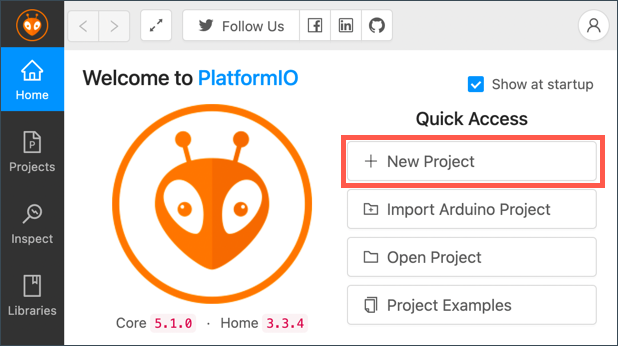

<!--
CO_OP_TRANSLATOR_METADATA:
{
  "original_hash": "a4f0c166010e31fd7b6ca20bc88dec6d",
  "translation_date": "2025-08-25T17:30:58+00:00",
  "source_file": "1-getting-started/lessons/1-introduction-to-iot/wio-terminal.md",
  "language_code": "hi"
}
-->
# वियो टर्मिनल

[सीड स्टूडियोज का वियो टर्मिनल](https://www.seeedstudio.com/Wio-Terminal-p-4509.html) एक Arduino-संगत माइक्रोकंट्रोलर है, जिसमें वाईफाई और कुछ सेंसर और एक्ट्यूएटर्स पहले से ही शामिल हैं। इसके अलावा, इसमें [Grove](https://www.seeedstudio.com/category/Grove-c-1003.html) नामक हार्डवेयर इकोसिस्टम का उपयोग करके और अधिक सेंसर और एक्ट्यूएटर्स जोड़ने के लिए पोर्ट्स भी हैं।


## सेटअप

अपने वियो टर्मिनल का उपयोग करने के लिए, आपको अपने कंप्यूटर पर कुछ मुफ्त सॉफ़्टवेयर इंस्टॉल करने की आवश्यकता होगी। इसके अलावा, वाईफाई से कनेक्ट करने से पहले आपको वियो टर्मिनल का फर्मवेयर अपडेट करना होगा।

### कार्य - सेटअप

आवश्यक सॉफ़्टवेयर इंस्टॉल करें और फर्मवेयर अपडेट करें।

1. **विजुअल स्टूडियो कोड (VS Code) इंस्टॉल करें।** यह वह एडिटर है जिसका उपयोग आप C/C++ में डिवाइस कोड लिखने के लिए करेंगे। VS Code इंस्टॉल करने के निर्देशों के लिए [VS Code डाक्यूमेंटेशन](https://code.visualstudio.com?WT.mc_id=academic-17441-jabenn) देखें।

    > 💁 Arduino विकास के लिए एक और लोकप्रिय IDE [Arduino IDE](https://www.arduino.cc/en/software) है। यदि आप पहले से ही इस टूल से परिचित हैं, तो आप इसे VS Code और PlatformIO के बजाय उपयोग कर सकते हैं, लेकिन पाठों में VS Code का उपयोग करने के निर्देश दिए जाएंगे।

1. **VS Code PlatformIO एक्सटेंशन इंस्टॉल करें।** यह VS Code के लिए एक एक्सटेंशन है जो C/C++ में माइक्रोकंट्रोलर प्रोग्रामिंग को सपोर्ट करता है। इस एक्सटेंशन को VS Code में इंस्टॉल करने के निर्देशों के लिए [PlatformIO एक्सटेंशन डाक्यूमेंटेशन](https://marketplace.visualstudio.com/items?WT.mc_id=academic-17441-jabenn&itemName=platformio.platformio-ide) देखें। यह एक्सटेंशन Microsoft C/C++ एक्सटेंशन पर निर्भर करता है, जो PlatformIO इंस्टॉल करते समय स्वचालित रूप से इंस्टॉल हो जाता है।

1. **अपने वियो टर्मिनल को अपने कंप्यूटर से कनेक्ट करें।** वियो टर्मिनल के नीचे एक USB-C पोर्ट है, जिसे आपके कंप्यूटर के USB पोर्ट से कनेक्ट करना होगा। वियो टर्मिनल के साथ एक USB-C से USB-A केबल आता है, लेकिन यदि आपके कंप्यूटर में केवल USB-C पोर्ट हैं, तो आपको या तो एक USB-C केबल या USB-A से USB-C एडाप्टर की आवश्यकता होगी।

1. **[वियो टर्मिनल विकी वाईफाई ओवरव्यू डाक्यूमेंटेशन](https://wiki.seeedstudio.com/Wio-Terminal-Network-Overview/)** में दिए गए निर्देशों का पालन करें और अपने वियो टर्मिनल को सेटअप करें और फर्मवेयर अपडेट करें।

## हैलो वर्ल्ड

किसी नई प्रोग्रामिंग भाषा या तकनीक के साथ शुरुआत करते समय, पारंपरिक रूप से एक 'हैलो वर्ल्ड' एप्लिकेशन बनाया जाता है - एक छोटा सा एप्लिकेशन जो `"Hello World"` जैसा टेक्स्ट आउटपुट करता है, यह सुनिश्चित करने के लिए कि सभी टूल सही तरीके से कॉन्फ़िगर किए गए हैं।

वियो टर्मिनल के लिए हैलो वर्ल्ड ऐप यह सुनिश्चित करेगा कि आपने VS Code को सही तरीके से PlatformIO के साथ इंस्टॉल किया है और माइक्रोकंट्रोलर विकास के लिए सेटअप किया है।

### PlatformIO प्रोजेक्ट बनाएं

पहला कदम PlatformIO का उपयोग करके वियो टर्मिनल के लिए कॉन्फ़िगर किया गया एक नया प्रोजेक्ट बनाना है।

#### कार्य - PlatformIO प्रोजेक्ट बनाएं

PlatformIO प्रोजेक्ट बनाएं।

1. वियो टर्मिनल को अपने कंप्यूटर से कनेक्ट करें।

1. VS Code लॉन्च करें।

1. साइड मेनू बार में PlatformIO आइकन होगा:

    

    इस मेनू आइटम को चुनें, फिर *PIO Home -> Open* चुनें।

    

1. वेलकम स्क्रीन से, **+ New Project** बटन चुनें।

    

1. *प्रोजेक्ट विज़ार्ड* में प्रोजेक्ट को कॉन्फ़िगर करें:

    1. अपने प्रोजेक्ट का नाम `nightlight` रखें।

    1. *Board* ड्रॉपडाउन से `WIO` टाइप करें ताकि बोर्ड्स को फिल्टर किया जा सके, और *Seeeduino Wio Terminal* चुनें।

    1. *Framework* को *Arduino* पर छोड़ दें।

    1. *Use default location* चेकबॉक्स को चेक्ड छोड़ दें, या इसे अनचेक करें और अपने प्रोजेक्ट के लिए एक लोकेशन चुनें।

    1. **Finish** बटन चुनें।

    

    PlatformIO वियो टर्मिनल के लिए कोड को कंपाइल करने के लिए आवश्यक घटकों को डाउनलोड करेगा और आपका प्रोजेक्ट बनाएगा। इसमें कुछ मिनट लग सकते हैं।

### PlatformIO प्रोजेक्ट की जांच करें

VS Code एक्सप्लोरर PlatformIO विज़ार्ड द्वारा बनाए गए कई फाइल्स और फोल्डर्स दिखाएगा।

#### फोल्डर्स

* `.pio` - यह फोल्डर PlatformIO द्वारा आवश्यक अस्थायी डेटा जैसे लाइब्रेरीज़ या कंपाइल कोड को रखता है। इसे डिलीट करने पर यह स्वचालित रूप से फिर से बन जाता है, और यदि आप अपना प्रोजेक्ट GitHub जैसी साइट्स पर साझा कर रहे हैं, तो इसे सोर्स कोड कंट्रोल में जोड़ने की आवश्यकता नहीं है।
* `.vscode` - यह फोल्डर PlatformIO और VS Code द्वारा उपयोग की जाने वाली कॉन्फ़िगरेशन को रखता है। इसे डिलीट करने पर यह स्वचालित रूप से फिर से बन जाता है, और इसे भी सोर्स कोड कंट्रोल में जोड़ने की आवश्यकता नहीं है।
* `include` - यह फोल्डर बाहरी हेडर फाइल्स के लिए है, जब आप अपने कोड में अतिरिक्त लाइब्रेरीज़ जोड़ते हैं। इन पाठों में आप इस फोल्डर का उपयोग नहीं करेंगे।
* `lib` - यह फोल्डर बाहरी लाइब्रेरीज़ के लिए है जिन्हें आप अपने कोड से कॉल करना चाहते हैं। इन पाठों में आप इस फोल्डर का उपयोग नहीं करेंगे।
* `src` - यह फोल्डर आपके एप्लिकेशन के मुख्य सोर्स कोड को रखता है। प्रारंभ में, इसमें केवल एक फाइल होगी - `main.cpp`।
* `test` - यह फोल्डर आपके कोड के लिए किसी भी यूनिट टेस्ट को रखने के लिए है।

#### फाइल्स

* `main.cpp` - `src` फोल्डर में यह फाइल आपके एप्लिकेशन के एंट्री पॉइंट को रखती है। इस फाइल को खोलें, और इसमें निम्नलिखित कोड होगा:

    ```cpp
    #include <Arduino.h>
    
    void setup() {
      // put your setup code here, to run once:
    }
    
    void loop() {
      // put your main code here, to run repeatedly:
    }
    ```

    जब डिवाइस शुरू होता है, तो Arduino फ्रेमवर्क `setup` फंक्शन को एक बार चलाएगा, फिर `loop` फंक्शन को बार-बार चलाएगा जब तक कि डिवाइस बंद न हो जाए।

* `.gitignore` - यह फाइल उन फाइल्स और डायरेक्टरीज़ को सूचीबद्ध करती है जिन्हें गिट सोर्स कोड कंट्रोल में जोड़ने से अनदेखा किया जाना चाहिए, जैसे कि GitHub पर एक रिपॉजिटरी में अपलोड करना।

* `platformio.ini` - यह फाइल आपके डिवाइस और ऐप के लिए कॉन्फ़िगरेशन को रखती है। इस फाइल को खोलें, और इसमें निम्नलिखित कोड होगा:

    ```ini
    [env:seeed_wio_terminal]
    platform = atmelsam
    board = seeed_wio_terminal
    framework = arduino
    ```

    `[env:seeed_wio_terminal]` सेक्शन वियो टर्मिनल के लिए कॉन्फ़िगरेशन रखता है। आप कई `env` सेक्शन रख सकते हैं ताकि आपका कोड कई बोर्ड्स के लिए कंपाइल हो सके।

    अन्य मान प्रोजेक्ट विज़ार्ड की कॉन्फ़िगरेशन से मेल खाते हैं:

  * `platform = atmelsam` वियो टर्मिनल द्वारा उपयोग किए जाने वाले हार्डवेयर को परिभाषित करता है (ATSAMD51-आधारित माइक्रोकंट्रोलर)।
  * `board = seeed_wio_terminal` माइक्रोकंट्रोलर बोर्ड के प्रकार को परिभाषित करता है (वियो टर्मिनल)।
  * `framework = arduino` परिभाषित करता है कि यह प्रोजेक्ट Arduino फ्रेमवर्क का उपयोग कर रहा है।

### हैलो वर्ल्ड ऐप लिखें

अब आप हैलो वर्ल्ड ऐप लिखने के लिए तैयार हैं।

#### कार्य - हैलो वर्ल्ड ऐप लिखें

हैलो वर्ल्ड ऐप लिखें।

1. VS Code में `main.cpp` फाइल खोलें।

1. कोड को निम्नलिखित से बदलें:

    ```cpp
    #include <Arduino.h>

    void setup()
    {
        Serial.begin(9600);

        while (!Serial)
            ; // Wait for Serial to be ready
    
        delay(1000);
    }
    
    void loop()
    {
        Serial.println("Hello World");
        delay(5000);
    }
    ```

    `setup` फंक्शन सीरियल पोर्ट से कनेक्शन को इनिशियलाइज़ करता है - इस मामले में, USB पोर्ट जो वियो टर्मिनल को आपके कंप्यूटर से कनेक्ट करने के लिए उपयोग किया जाता है। पैरामीटर `9600` [बॉड रेट](https://wikipedia.org/wiki/Symbol_rate) (जिसे सिंबल रेट भी कहा जाता है) या गति है, जिस पर डेटा सीरियल पोर्ट पर प्रति सेकंड बिट्स में भेजा जाएगा। यह सेटिंग प्रति सेकंड 9,600 बिट्स (0s और 1s) डेटा भेजने का मतलब है। इसके बाद यह सीरियल पोर्ट के तैयार होने का इंतजार करता है।

    `loop` फंक्शन सीरियल पोर्ट पर `Hello World!` लाइन भेजता है, यानी `Hello World!` के अक्षर और एक नई लाइन कैरेक्टर। इसके बाद यह 5,000 मिलीसेकंड या 5 सेकंड के लिए सोता है। `loop` समाप्त होने के बाद, इसे फिर से चलाया जाता है, और यह तब तक चलता रहता है जब तक माइक्रोकंट्रोलर चालू रहता है।

1. अपने वियो टर्मिनल को अपलोड मोड में डालें। आपको हर बार डिवाइस पर नया कोड अपलोड करते समय ऐसा करना होगा:

    1. पावर स्विच को जल्दी से दो बार नीचे खींचें - यह हर बार ऑन पोजीशन पर वापस आ जाएगा।

    1. USB पोर्ट के दाईं ओर नीली स्टेटस LED की जांच करें। यह पल्सिंग होनी चाहिए।
    
    [](https://youtu.be/LeKU_7zLRrQ)
    
    इसे करने का तरीका दिखाने के लिए ऊपर दी गई छवि पर क्लिक करें।

1. कोड को वियो टर्मिनल पर बिल्ड और अपलोड करें:

    1. VS Code कमांड पैलेट खोलें।

    1. `PlatformIO Upload` टाइप करें ताकि अपलोड विकल्प खोजा जा सके, और *PlatformIO: Upload* चुनें।

        

        PlatformIO आवश्यकता होने पर कोड को स्वचालित रूप से बिल्ड करेगा और फिर अपलोड करेगा।

    1. कोड को कंपाइल किया जाएगा और वियो टर्मिनल पर अपलोड किया जाएगा।

        > 💁 यदि आप macOS का उपयोग कर रहे हैं, तो *DISK NOT EJECTED PROPERLY* के बारे में एक नोटिफिकेशन दिखाई देगा। ऐसा इसलिए है क्योंकि वियो टर्मिनल फ्लैशिंग प्रक्रिया के हिस्से के रूप में एक ड्राइव के रूप में माउंट हो जाता है, और जब कंपाइल कोड डिवाइस पर लिखा जाता है तो यह डिस्कनेक्ट हो जाता है। आप इस नोटिफिकेशन को अनदेखा कर सकते हैं।

    ⚠️ यदि आपको अपलोड पोर्ट उपलब्ध न होने के बारे में त्रुटियां मिलती हैं, तो पहले सुनिश्चित करें कि आपने वियो टर्मिनल को अपने कंप्यूटर से कनेक्ट किया है, और स्क्रीन के बाईं ओर स्विच का उपयोग करके इसे चालू किया है, और अपलोड मोड में सेट किया है। नीचे की हरी लाइट चालू होनी चाहिए, और नीली लाइट पल्सिंग होनी चाहिए। यदि आपको अभी भी त्रुटि मिलती है, तो वियो टर्मिनल को अपलोड मोड में मजबूर करने के लिए स्विच को जल्दी से दो बार नीचे खींचें और फिर से अपलोड करने का प्रयास करें।

PlatformIO में एक सीरियल मॉनिटर है जो वियो टर्मिनल से USB केबल के माध्यम से भेजे गए डेटा की निगरानी कर सकता है। यह `Serial.println("Hello World");` कमांड द्वारा भेजे गए डेटा की निगरानी करने की अनुमति देता है।

1. VS Code कमांड पैलेट खोलें।

1. `PlatformIO Serial` टाइप करें ताकि सीरियल मॉनिटर विकल्प खोजा जा सके, और *PlatformIO: Serial Monitor* चुनें।

    

    एक नया टर्मिनल खुलेगा, और सीरियल पोर्ट के माध्यम से भेजा गया डेटा इस टर्मिनल में स्ट्रीम होगा:

    ```output
    > Executing task: platformio device monitor <
    
    --- Available filters and text transformations: colorize, debug, default, direct, hexlify, log2file, nocontrol, printable, send_on_enter, time
    --- More details at http://bit.ly/pio-monitor-filters
    --- Miniterm on /dev/cu.usbmodem101  9600,8,N,1 ---
    --- Quit: Ctrl+C | Menu: Ctrl+T | Help: Ctrl+T followed by Ctrl+H ---
    Hello World
    Hello World
    ```

    `Hello World` हर 5 सेकंड में सीरियल मॉनिटर पर प्रिंट होगा।

> 💁 आप इस कोड को [code/wio-terminal](../../../../../1-getting-started/lessons/1-introduction-to-iot/code/wio-terminal) फोल्डर में पा सकते हैं।

😀 आपका 'हैलो वर्ल्ड' प्रोग्राम सफल रहा!

**अस्वीकरण**:  
यह दस्तावेज़ AI अनुवाद सेवा [Co-op Translator](https://github.com/Azure/co-op-translator) का उपयोग करके अनुवादित किया गया है। जबकि हम सटीकता सुनिश्चित करने का प्रयास करते हैं, कृपया ध्यान दें कि स्वचालित अनुवाद में त्रुटियां या अशुद्धियां हो सकती हैं। मूल भाषा में उपलब्ध मूल दस्तावेज़ को प्रामाणिक स्रोत माना जाना चाहिए। महत्वपूर्ण जानकारी के लिए, पेशेवर मानव अनुवाद की सिफारिश की जाती है। इस अनुवाद के उपयोग से उत्पन्न किसी भी गलतफहमी या गलत व्याख्या के लिए हम उत्तरदायी नहीं हैं।