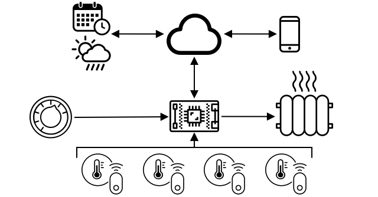

<!--
CO_OP_TRANSLATOR_METADATA:
{
  "original_hash": "9dd7f645ad1c6f20b72fee512987f772",
  "translation_date": "2025-08-25T17:32:08+00:00",
  "source_file": "1-getting-started/lessons/2-deeper-dive/README.md",
  "language_code": "hi"
}
-->
# IoT में गहराई से समझना

> स्केच नोट [नित्या नरसिम्हन](https://github.com/nitya) द्वारा। बड़ी छवि देखने के लिए चित्र पर क्लिक करें।

यह पाठ [Hello IoT श्रृंखला](https://youtube.com/playlist?list=PLmsFUfdnGr3xRts0TIwyaHyQuHaNQcb6-) के हिस्से के रूप में [Microsoft Reactor](https://developer.microsoft.com/reactor/?WT.mc_id=academic-17441-jabenn) द्वारा पढ़ाया गया था। यह पाठ 2 वीडियो के रूप में प्रस्तुत किया गया - एक 1 घंटे का पाठ और एक 1 घंटे का ऑफिस आवर, जिसमें पाठ के हिस्सों को गहराई से समझाया गया और प्रश्नों के उत्तर दिए गए।

> 🎥 ऊपर दिए गए चित्रों पर क्लिक करें और वीडियो देखें

## प्री-लेक्चर क्विज़

[प्री-लेक्चर क्विज़](https://black-meadow-040d15503.1.azurestaticapps.net/quiz/3)

## परिचय

यह पाठ पिछले पाठ में कवर किए गए कुछ अवधारणाओं को गहराई से समझाता है।

इस पाठ में हम कवर करेंगे:

* [IoT एप्लिकेशन के घटक](../../../../../1-getting-started/lessons/2-deeper-dive)
* [माइक्रोकंट्रोलर्स में गहराई से समझना](../../../../../1-getting-started/lessons/2-deeper-dive)
* [सिंगल-बोर्ड कंप्यूटर में गहराई से समझना](../../../../../1-getting-started/lessons/2-deeper-dive)

## IoT एप्लिकेशन के घटक

IoT एप्लिकेशन के दो घटक होते हैं - *इंटरनेट* और *चीज़*। आइए इन दोनों घटकों को विस्तार से समझते हैं।

### चीज़

IoT में **चीज़** उस डिवाइस को संदर्भित करता है जो भौतिक दुनिया के साथ इंटरैक्ट कर सकता है। ये डिवाइस आमतौर पर छोटे, कम कीमत वाले कंप्यूटर होते हैं, जो कम गति और कम ऊर्जा का उपयोग करते हैं - उदाहरण के लिए, साधारण माइक्रोकंट्रोलर्स जिनमें केवल कुछ किलोबाइट्स RAM होती है (PC में गीगाबाइट्स के बजाय), और जो केवल कुछ सौ मेगाहर्ट्ज पर चलते हैं (PC में गीगाहर्ट्ज के बजाय), लेकिन इतनी कम ऊर्जा का उपयोग करते हैं कि वे बैटरी पर हफ्तों, महीनों या यहां तक कि वर्षों तक चल सकते हैं।

ये डिवाइस भौतिक दुनिया के साथ इंटरैक्ट करते हैं, या तो सेंसर का उपयोग करके अपने आसपास से डेटा इकट्ठा करते हैं या आउटपुट या एक्टुएटर्स को नियंत्रित करके भौतिक परिवर्तन करते हैं। इसका एक सामान्य उदाहरण स्मार्ट थर्मोस्टेट है - एक डिवाइस जिसमें तापमान सेंसर होता है, एक डायल या टचस्क्रीन जैसे वांछित तापमान सेट करने का साधन होता है, और एक हीटिंग या कूलिंग सिस्टम से कनेक्शन होता है जिसे तब चालू किया जा सकता है जब पता लगाया गया तापमान वांछित सीमा से बाहर हो। तापमान सेंसर यह पता लगाता है कि कमरा बहुत ठंडा है और एक एक्टुएटर हीटिंग चालू कर देता है।

IoT डिवाइस के रूप में काम करने वाली चीज़ों की एक बड़ी विविधता है, जैसे कि एक समर्पित हार्डवेयर जो केवल एक चीज़ को सेंसर करता है, या सामान्य प्रयोजन डिवाइस, यहां तक कि आपका स्मार्टफोन भी! एक स्मार्टफोन सेंसर का उपयोग करके अपने आसपास की दुनिया का पता लगा सकता है और एक्टुएटर्स का उपयोग करके दुनिया के साथ इंटरैक्ट कर सकता है - उदाहरण के लिए, GPS सेंसर का उपयोग करके आपका स्थान पता लगाना और स्पीकर का उपयोग करके आपको गंतव्य तक नेविगेशन निर्देश देना।

✅ उन अन्य सिस्टम्स के बारे में सोचें जो आपके आसपास सेंसर से डेटा पढ़ते हैं और इसका उपयोग निर्णय लेने के लिए करते हैं। एक उदाहरण ओवन का थर्मोस्टेट हो सकता है। क्या आप और अधिक खोज सकते हैं?

### इंटरनेट

IoT एप्लिकेशन का **इंटरनेट** पक्ष उन एप्लिकेशन से बना होता है जिनसे IoT डिवाइस डेटा भेज और प्राप्त कर सकता है, साथ ही अन्य एप्लिकेशन जो IoT डिवाइस से डेटा को प्रोसेस कर सकते हैं और यह तय करने में मदद कर सकते हैं कि IoT डिवाइस के एक्टुएटर्स को कौन से अनुरोध भेजे जाएं।

एक सामान्य सेटअप में एक प्रकार की क्लाउड सेवा होती है जिससे IoT डिवाइस कनेक्ट होता है, और यह क्लाउड सेवा सुरक्षा जैसी चीजों को संभालती है, साथ ही IoT डिवाइस से संदेश प्राप्त करती है और डिवाइस को संदेश वापस भेजती है। यह क्लाउड सेवा अन्य एप्लिकेशन से जुड़ती है जो सेंसर डेटा को प्रोसेस या स्टोर कर सकते हैं, या अन्य सिस्टम्स से डेटा के साथ सेंसर डेटा का उपयोग करके निर्णय ले सकते हैं।

डिवाइस हमेशा सीधे इंटरनेट से वाईफाई या वायर्ड कनेक्शन के माध्यम से कनेक्ट नहीं करते। कुछ डिवाइस ब्लूटूथ जैसी तकनीकों के माध्यम से एक-दूसरे से बात करने के लिए मेष नेटवर्किंग का उपयोग करते हैं, और एक हब डिवाइस के माध्यम से कनेक्ट होते हैं जिसमें इंटरनेट कनेक्शन होता है।

स्मार्ट थर्मोस्टेट के उदाहरण में, थर्मोस्टेट होम वाईफाई का उपयोग करके क्लाउड में चल रही क्लाउड सेवा से कनेक्ट होगा। यह तापमान डेटा इस क्लाउड सेवा को भेजेगा, और वहां से इसे किसी प्रकार के डेटाबेस में लिखा जाएगा जिससे गृहस्वामी फोन ऐप का उपयोग करके वर्तमान और पिछले तापमान की जांच कर सके। क्लाउड में एक अन्य सेवा यह जानती होगी कि गृहस्वामी कौन सा तापमान चाहता है, और क्लाउड सेवा के माध्यम से IoT डिवाइस को संदेश भेजेगी ताकि हीटिंग सिस्टम को चालू या बंद किया जा सके।

एक और स्मार्ट संस्करण क्लाउड में AI का उपयोग कर सकता है, जो अन्य IoT डिवाइस जैसे कि ऑक्यूपेंसी सेंसर से जुड़े अन्य सेंसर से डेटा के साथ-साथ मौसम और यहां तक कि आपके कैलेंडर जैसे डेटा का उपयोग करके स्मार्ट तरीके से तापमान सेट करने के निर्णय ले सकता है। उदाहरण के लिए, यह आपके कैलेंडर से पढ़कर हीटिंग बंद कर सकता है यदि आप छुट्टी पर हैं, या कमरे के उपयोग के आधार पर कमरे-दर-कमरे हीटिंग बंद कर सकता है, डेटा से सीखते हुए समय के साथ अधिक सटीक होता जा सकता है।

✅ कौन सा अन्य डेटा इंटरनेट से जुड़े थर्मोस्टेट को और अधिक स्मार्ट बना सकता है?

### एज पर IoT

हालांकि IoT में 'I' का मतलब इंटरनेट है, इन डिवाइसों को इंटरनेट से कनेक्ट करने की आवश्यकता नहीं होती। कुछ मामलों में, डिवाइस 'एज' डिवाइसों से कनेक्ट कर सकते हैं - गेटवे डिवाइस जो आपके स्थानीय नेटवर्क पर चलते हैं, जिससे आप डेटा को इंटरनेट पर कॉल किए बिना प्रोसेस कर सकते हैं। यह तब तेज हो सकता है जब आपके पास बहुत सारा डेटा हो या इंटरनेट कनेक्शन धीमा हो, यह आपको ऑफलाइन चलाने की अनुमति देता है जहां इंटरनेट कनेक्टिविटी संभव नहीं है जैसे कि जहाज पर या मानवीय संकट के दौरान आपदा क्षेत्र में प्रतिक्रिया करते समय, और यह आपको डेटा को निजी रखने की अनुमति देता है। कुछ डिवाइस क्लाउड टूल्स का उपयोग करके बनाए गए प्रोसेसिंग कोड को शामिल करेंगे और इसे स्थानीय रूप से चलाएंगे ताकि डेटा को इकट्ठा किया जा सके और इंटरनेट कनेक्शन का उपयोग किए बिना निर्णय लिया जा सके।

इसका एक उदाहरण स्मार्ट होम डिवाइस जैसे कि Apple HomePod, Amazon Alexa, या Google Home है, जो क्लाउड में प्रशिक्षित AI मॉडल का उपयोग करके आपकी आवाज़ सुनते हैं, लेकिन डिवाइस पर स्थानीय रूप से चलते हैं। ये डिवाइस तब 'जागते' हैं जब कोई निश्चित शब्द या वाक्यांश बोला जाता है, और केवल तभी आपकी आवाज़ को प्रोसेसिंग के लिए इंटरनेट पर भेजते हैं। डिवाइस आपकी आवाज़ को तब तक भेजना बंद कर देगा जब तक कि वह आपके भाषण में विराम का पता न लगा ले। जो कुछ भी आप डिवाइस को जगाने वाले शब्द से पहले कहते हैं, और जो कुछ भी आप डिवाइस के सुनना बंद करने के बाद कहते हैं, वह इंटरनेट पर डिवाइस प्रदाता को नहीं भेजा जाएगा, और इसलिए वह निजी रहेगा।

✅ उन अन्य परिदृश्यों के बारे में सोचें जहां गोपनीयता महत्वपूर्ण है, इसलिए डेटा प्रोसेसिंग क्लाउड के बजाय एज पर की जानी चाहिए। एक संकेत के रूप में - IoT डिवाइसों पर कैमरे या अन्य इमेजिंग डिवाइस के बारे में सोचें।

### IoT सुरक्षा

किसी भी इंटरनेट कनेक्शन के साथ, सुरक्षा एक महत्वपूर्ण विचार है। एक पुराना मजाक है कि 'IoT में S का मतलब सुरक्षा है' - IoT में कोई 'S' नहीं है, यह संकेत देता है कि यह सुरक्षित नहीं है।

IoT डिवाइस क्लाउड सेवा से कनेक्ट होते हैं, और इसलिए वे केवल उतने ही सुरक्षित होते हैं जितनी वह क्लाउड सेवा - यदि आपकी क्लाउड सेवा किसी भी डिवाइस को कनेक्ट करने की अनुमति देती है तो दुर्भावनापूर्ण डेटा भेजा जा सकता है, या वायरस हमले हो सकते हैं। इसका बहुत वास्तविक दुनिया में प्रभाव हो सकता है क्योंकि IoT डिवाइस अन्य डिवाइसों के साथ इंटरैक्ट और नियंत्रण करते हैं। उदाहरण के लिए, [Stuxnet वर्म](https://wikipedia.org/wiki/Stuxnet) ने सेंट्रीफ्यूज में वाल्व को हेरफेर करके उन्हें नुकसान पहुंचाया। हैकर्स ने [खराब सुरक्षा का लाभ उठाकर बेबी मॉनिटर](https://www.npr.org/sections/thetwo-way/2018/06/05/617196788/s-c-mom-says-baby-monitor-was-hacked-experts-say-many-devices-are-vulnerable) और अन्य होम सर्विलांस डिवाइस तक पहुंच प्राप्त की है।

> 💁 कभी-कभी IoT डिवाइस और एज डिवाइस पूरी तरह से इंटरनेट से अलग नेटवर्क पर चलते हैं ताकि डेटा को निजी और सुरक्षित रखा जा सके। इसे [एयर-गैपिंग](https://wikipedia.org/wiki/Air_gap_(networking)) कहा जाता है।

## माइक्रोकंट्रोलर्स में गहराई से समझना

पिछले पाठ में हमने माइक्रोकंट्रोलर्स का परिचय दिया था। अब आइए उन्हें गहराई से समझते हैं।

### CPU

CPU माइक्रोकंट्रोलर का 'मस्तिष्क' है। यह वह प्रोसेसर है जो आपका कोड चलाता है और किसी भी जुड़े डिवाइस से डेटा भेज और प्राप्त कर सकता है। CPU में एक या अधिक कोर हो सकते हैं - मूल रूप से एक या अधिक CPU जो आपके कोड को चलाने के लिए एक साथ काम कर सकते हैं।

CPU एक घड़ी पर निर्भर करता है जो प्रति सेकंड लाखों या अरबों बार टिक करता है। प्रत्येक टिक, या चक्र, CPU द्वारा किए जा सकने वाले कार्यों को सिंक्रनाइज़ करता है। प्रत्येक टिक के साथ, CPU प्रोग्राम से एक निर्देश निष्पादित कर सकता है, जैसे कि बाहरी डिवाइस से डेटा प्राप्त करना या गणितीय गणना करना। यह नियमित चक्र सभी कार्यों को पूरा करने की अनुमति देता है इससे पहले कि अगला निर्देश प्रोसेस किया जाए।

जितनी तेज़ घड़ी की गति, उतने अधिक निर्देश प्रति सेकंड प्रोसेस किए जा सकते हैं, और इसलिए CPU उतना ही तेज़ होता है। CPU की गति [हर्ट्ज (Hz)](https://wikipedia.org/wiki/Hertz) में मापी जाती है, एक मानक इकाई जहां 1 Hz का मतलब प्रति सेकंड एक चक्र या घड़ी टिक है।

> 🎓 CPU की गति अक्सर MHz या GHz में दी जाती है। 1MHz 1 मिलियन Hz है, 1GHz 1 बिलियन Hz है।

> 💁 CPU प्रोग्राम को [फेच-डिकोड-एक्ज़ीक्यूट चक्र](https://wikipedia.org/wiki/Instruction_cycle) का उपयोग करके निष्पादित करता है। प्रत्येक घड़ी टिक के लिए, CPU मेमोरी से अगला निर्देश फेच करेगा, इसे डिकोड करेगा, फिर इसे निष्पादित करेगा जैसे कि दो संख्याओं को जोड़ने के लिए एक एरिथमेटिक लॉजिक यूनिट (ALU) का उपयोग करना। कुछ निष्पादन को चलाने में कई टिक लगते हैं, इसलिए अगला चक्र उस टिक पर चलेगा जब निर्देश पूरा हो जाएगा।

माइक्रोकंट्रोलर्स में डेस्कटॉप या लैपटॉप कंप्यूटर, या यहां तक कि अधिकांश स्मार्टफोन की तुलना में बहुत कम घड़ी की गति होती है। उदाहरण के लिए, Wio Terminal में एक CPU होता है जो 120MHz या 120,000,000 चक्र प्रति सेकंड पर चलता है।

✅ एक औसत PC या Mac में कई कोर वाले CPU होते हैं जो कई गीगाहर्ट्ज पर चलते हैं, जिसका मतलब है कि घड़ी प्रति सेकंड अरबों बार टिक करती है। अपने कंप्यूटर की घड़ी की गति का शोध करें और तुलना करें कि यह Wio टर्मिनल से कितनी बार तेज़ है।

प्रत्येक घड़ी चक्र ऊर्जा खींचता है और गर्मी उत्पन्न करता है। जितने तेज़ टिक, उतनी अधिक ऊर्जा खपत और अधिक गर्मी उत्पन्न होती है। PC में गर्मी को हटाने के लिए हीट सिंक और पंखे होते हैं, जिनके बिना वे सेकंडों में ओवरहीट होकर बंद हो जाएंगे। माइक्रोकंट्रोलर्स में अक्सर इनमें से कोई भी नहीं होता क्योंकि वे बहुत ठंडे चलते हैं और इसलिए बहुत धीमे। PC मुख्य बिजली या बड़ी बैटरी पर कुछ घंटों के लिए चलते हैं, माइक्रोकंट्रोलर्स छोटे बैटरी पर दिनों, महीनों, या यहां तक कि वर्षों तक चल सकते हैं। माइक्रोकंट्रोलर्स में ऐसे कोर भी हो सकते हैं जो अलग-अलग गति पर चलते हैं, जब CPU पर मांग कम होती है तो धीमे कम ऊर्जा वाले कोर पर स्विच करके ऊर्जा खपत को कम करते हैं।

> 💁 कुछ PC और Mac भी तेज़ उच्च ऊर्जा वाले कोर और धीमे कम ऊर्जा वाले कोर के उसी मिश्रण को अपनाते हैं, बैटरी बचाने के लिए स्विच करते हैं। उदाहरण के लिए, नवीनतम Apple लैपटॉप में M1 चिप 4 प्रदर्शन कोर और 4 दक्षता कोर के बीच स्विच कर सकता है ताकि बैटरी जीवन या गति को अनुकूलित किया जा सके, यह इस बात पर निर्भर करता है कि कौन सा कार्य चल रहा है।

✅ थोड़ा शोध करें: CPU पर [Wikipedia CPU लेख](https://wikipedia.org/wiki/Central_processing_unit) पढ़ें।

#### कार्य

Wio टर्मिनल की जांच करें।

यदि आप इन पाठों के लिए Wio टर्मिनल का उपयोग कर रहे हैं, तो CPU खोजने का प्रयास करें। [Wio टर्मिनल उत्पाद पृष्ठ](https://www.seeedstudio.com/Wio-Terminal-p-4509.html) के *हार्डवेयर अवलोकन* अनुभाग में आंतरिक भागों की तस्वीर खोजें, और पीछे की पारदर्शी प्लास्टिक विंडो के माध्यम से CPU को खोजने का प्रयास करें।

### मेमोरी

माइक्रोकंट्रोलर्स में आमतौर पर दो प्रकार की मेमोरी होती है - प्रोग्राम मेमोरी और रैंडम-एक्सेस मेमोरी (RAM)।

प्रोग्राम मेमोरी गैर-वाष्पशील होती है, जिसका मतलब है कि जो कुछ भी इसमें लिखा जाता है वह तब भी रहता है जब डिवाइस में कोई बिजली नहीं होती। यह वह मेमोरी है जो आपके प्रोग्राम कोड को संग्रहीत करती है।

RAM वह मेमोरी है जिसका उपयोग प्रोग्राम द्वारा चलाने के लिए किया जाता है, जिसमें आपके प्रोग्राम द्वारा आवंटित वेरिएबल्स और परिधीय उपकरणों से एकत्रित डेटा होता है। RAM वाष्पशील होती है, जब बिजली चली जाती है तो सामग्री खो जाती है, प्रभावी रूप से आपके प्रोग्राम को रीसेट कर देती है।
🎓 प्रोग्राम मेमोरी आपके कोड को संग्रहीत करती है और तब भी बनी रहती है जब बिजली न हो।
🎓 RAM का उपयोग आपके प्रोग्राम को चलाने के लिए किया जाता है और बिजली न होने पर इसे रीसेट कर दिया जाता है।

CPU की तरह, माइक्रोकंट्रोलर में मेमोरी पीसी या मैक की तुलना में बहुत छोटी होती है। एक सामान्य पीसी में 8 गीगाबाइट (GB) RAM हो सकती है, यानी 8,000,000,000 बाइट्स, जिसमें प्रत्येक बाइट में एक अक्षर या 0-255 तक की संख्या को स्टोर करने की जगह होती है। एक माइक्रोकंट्रोलर में केवल किलोबाइट्स (KB) RAM होती है, जिसमें एक किलोबाइट 1,000 बाइट्स के बराबर होता है। ऊपर उल्लेखित Wio टर्मिनल में 192KB RAM है, यानी 192,000 बाइट्स - एक औसत पीसी की तुलना में 40,000 गुना कम!

नीचे दिए गए चित्र में 192KB और 8GB के बीच आकार का अंतर दिखाया गया है - केंद्र में छोटा बिंदु 192KB का प्रतिनिधित्व करता है।

प्रोग्राम स्टोरेज भी पीसी की तुलना में छोटी होती है। एक सामान्य पीसी में प्रोग्राम स्टोरेज के लिए 500GB हार्ड ड्राइव हो सकती है, जबकि एक माइक्रोकंट्रोलर में केवल किलोबाइट्स या शायद कुछ मेगाबाइट्स (MB) स्टोरेज होती है (1MB = 1,000KB, या 1,000,000 बाइट्स)। Wio टर्मिनल में 4MB प्रोग्राम स्टोरेज है।

✅ थोड़ा शोध करें: जिस कंप्यूटर का उपयोग आप इसे पढ़ने के लिए कर रहे हैं, उसमें कितनी RAM और स्टोरेज है? इसकी तुलना एक माइक्रोकंट्रोलर से कैसे होती है?

### इनपुट/आउटपुट

माइक्रोकंट्रोलर को सेंसर से डेटा पढ़ने और एक्ट्यूएटर्स को नियंत्रण संकेत भेजने के लिए इनपुट और आउटपुट (I/O) कनेक्शन की आवश्यकता होती है। इनमें आमतौर पर कई सामान्य-उद्देश्य इनपुट/आउटपुट (GPIO) पिन होते हैं। इन पिन्स को सॉफ़्टवेयर में इनपुट (यानी वे सिग्नल प्राप्त करते हैं) या आउटपुट (वे सिग्नल भेजते हैं) के रूप में कॉन्फ़िगर किया जा सकता है।

🧠⬅️ इनपुट पिन्स का उपयोग सेंसर से मान पढ़ने के लिए किया जाता है।

🧠➡️ आउटपुट पिन्स एक्ट्यूएटर्स को निर्देश भेजते हैं।

✅ आप इसके बारे में अगले पाठ में अधिक जानेंगे।

#### कार्य

Wio टर्मिनल की जांच करें।

यदि आप इन पाठों के लिए Wio टर्मिनल का उपयोग कर रहे हैं, तो GPIO पिन्स खोजें। [Wio टर्मिनल उत्पाद पृष्ठ](https://www.seeedstudio.com/Wio-Terminal-p-4509.html) के *Pinout डायग्राम* अनुभाग को खोजें ताकि यह जान सकें कि कौन से पिन कौन से हैं। Wio टर्मिनल के साथ एक स्टिकर आता है जिसे आप पीछे लगा सकते हैं जिसमें पिन नंबर होते हैं, इसलिए यदि आपने इसे अभी तक नहीं लगाया है तो इसे जोड़ें।

### भौतिक आकार

माइक्रोकंट्रोलर आमतौर पर आकार में छोटे होते हैं, सबसे छोटे, [Freescale Kinetis KL03 MCU](https://www.edn.com/tiny-arm-cortex-m0-based-mcu-shrinks-package/) इतना छोटा है कि यह गोल्फ बॉल के डिंपल में फिट हो सकता है। एक पीसी में केवल CPU का आकार 40mm x 40mm हो सकता है, और इसमें हीट सिंक और फैन शामिल नहीं हैं जो यह सुनिश्चित करने के लिए आवश्यक हैं कि CPU कुछ सेकंड से अधिक समय तक बिना ओवरहीटिंग के चल सके, जो एक पूर्ण माइक्रोकंट्रोलर की तुलना में काफी बड़ा है। Wio टर्मिनल डेवलपर किट जिसमें माइक्रोकंट्रोलर, केस, स्क्रीन और कनेक्शन और घटकों की एक श्रृंखला शामिल है, एक नंगे Intel i9 CPU से बहुत बड़ा नहीं है, और हीट सिंक और फैन वाले CPU से काफी छोटा है!

| डिवाइस                          | आकार                  |
| ------------------------------- | --------------------- |
| Freescale Kinetis KL03          | 1.6mm x 2mm x 1mm     |
| Wio टर्मिनल                     | 72mm x 57mm x 12mm    |
| Intel i9 CPU, हीट सिंक और फैन   | 136mm x 145mm x 103mm |

### फ्रेमवर्क और ऑपरेटिंग सिस्टम

उनकी कम गति और मेमोरी आकार के कारण, माइक्रोकंट्रोलर एक ऑपरेटिंग सिस्टम (OS) नहीं चलाते हैं जैसा कि डेस्कटॉप के संदर्भ में होता है। आपके कंप्यूटर को चलाने वाला ऑपरेटिंग सिस्टम (Windows, Linux या macOS) बहुत सारी मेमोरी और प्रोसेसिंग पावर की आवश्यकता होती है ताकि ऐसे कार्य चलाए जा सकें जो माइक्रोकंट्रोलर के लिए पूरी तरह से अनावश्यक हैं। याद रखें कि माइक्रोकंट्रोलर आमतौर पर एक या अधिक बहुत विशिष्ट कार्यों को करने के लिए प्रोग्राम किए जाते हैं, जबकि एक सामान्य उद्देश्य कंप्यूटर जैसे पीसी या मैक को उपयोगकर्ता इंटरफ़ेस का समर्थन करने, संगीत या फिल्में चलाने, दस्तावेज़ या कोड लिखने के उपकरण प्रदान करने, गेम खेलने, या इंटरनेट ब्राउज़ करने की आवश्यकता होती है।

एक OS के बिना माइक्रोकंट्रोलर को प्रोग्राम करने के लिए आपको कुछ टूलिंग की आवश्यकता होती है जो आपको अपना कोड इस तरह से बनाने की अनुमति देती है कि माइक्रोकंट्रोलर इसे चला सके, और किसी भी परिधीय से बात करने के लिए APIs का उपयोग कर सके। प्रत्येक माइक्रोकंट्रोलर अलग होता है, इसलिए निर्माता आमतौर पर मानक फ्रेमवर्क का समर्थन करते हैं जो आपको एक मानक 'रेसिपी' का पालन करने की अनुमति देते हैं ताकि आपका कोड बनाया जा सके और किसी भी माइक्रोकंट्रोलर पर चल सके जो उस फ्रेमवर्क का समर्थन करता है।

आप माइक्रोकंट्रोलर को एक OS का उपयोग करके प्रोग्राम कर सकते हैं - जिसे अक्सर रियल-टाइम ऑपरेटिंग सिस्टम (RTOS) कहा जाता है, क्योंकि इन्हें वास्तविक समय में परिधीयों से डेटा भेजने और प्राप्त करने को संभालने के लिए डिज़ाइन किया गया है। ये ऑपरेटिंग सिस्टम बहुत हल्के होते हैं और निम्नलिखित सुविधाएँ प्रदान करते हैं:

* मल्टी-थ्रेडिंग, जिससे आपका कोड एक ही समय में एक से अधिक कोड ब्लॉक चला सकता है, चाहे वह कई कोर पर हो या एक कोर पर बारी-बारी से।
* नेटवर्किंग, जो इंटरनेट पर सुरक्षित रूप से संचार करने की अनुमति देती है।
* ग्राफिकल यूजर इंटरफेस (GUI) घटक, जो स्क्रीन वाले उपकरणों पर यूजर इंटरफेस (UI) बनाने के लिए होते हैं।

✅ कुछ अलग-अलग RTOSes के बारे में पढ़ें: [Azure RTOS](https://azure.microsoft.com/services/rtos/?WT.mc_id=academic-17441-jabenn), [FreeRTOS](https://www.freertos.org), [Zephyr](https://www.zephyrproject.org)

#### Arduino

[Arduino](https://www.arduino.cc) शायद सबसे लोकप्रिय माइक्रोकंट्रोलर फ्रेमवर्क है, खासकर छात्रों, शौकियों और निर्माताओं के बीच। Arduino एक ओपन सोर्स इलेक्ट्रॉनिक्स प्लेटफॉर्म है जो सॉफ़्टवेयर और हार्डवेयर को जोड़ता है। आप Arduino संगत बोर्ड Arduino से या अन्य निर्माताओं से खरीद सकते हैं, फिर Arduino फ्रेमवर्क का उपयोग करके कोड कर सकते हैं।

Arduino बोर्ड C या C++ में कोड किए जाते हैं। C/C++ का उपयोग करने से आपका कोड बहुत छोटा और तेज़ी से चलने योग्य होता है, जो माइक्रोकंट्रोलर जैसे सीमित डिवाइस पर आवश्यक होता है। Arduino एप्लिकेशन का मुख्य भाग एक स्केच कहलाता है और इसमें 2 फंक्शन होते हैं - `setup` और `loop`। जब बोर्ड चालू होता है, तो Arduino फ्रेमवर्क कोड पहले `setup` फंक्शन को एक बार चलाएगा, फिर `loop` फंक्शन को बार-बार चलाएगा, इसे तब तक लगातार चलाएगा जब तक कि पावर बंद न हो जाए।

आप अपने सेटअप कोड को `setup` फंक्शन में लिखेंगे, जैसे WiFi और क्लाउड सेवाओं से कनेक्ट करना या इनपुट और आउटपुट के लिए पिन्स को इनिशियलाइज़ करना। आपका लूप कोड फिर प्रोसेसिंग कोड को शामिल करेगा, जैसे सेंसर से डेटा पढ़ना और इसे क्लाउड पर भेजना। आप आमतौर पर प्रत्येक लूप में एक देरी जोड़ेंगे, उदाहरण के लिए, यदि आप केवल हर 10 सेकंड में सेंसर डेटा भेजना चाहते हैं, तो आप लूप के अंत में 10 सेकंड की देरी जोड़ेंगे ताकि माइक्रोकंट्रोलर सो सके, पावर बचा सके, और फिर 10 सेकंड बाद जब आवश्यक हो तो लूप को फिर से चलाए।

✅ इस प्रोग्राम आर्किटेक्चर को *इवेंट लूप* या *मैसेज लूप* के रूप में जाना जाता है। कई एप्लिकेशन इसे बैकग्राउंड में उपयोग करते हैं और यह अधिकांश डेस्कटॉप एप्लिकेशन के लिए मानक है जो Windows, macOS या Linux जैसे OS पर चलते हैं। `loop` यूजर इंटरफेस घटकों जैसे बटन, या कीबोर्ड जैसे उपकरणों से संदेशों को सुनता है और उनका जवाब देता है। आप इसके बारे में अधिक पढ़ सकते हैं इस [इवेंट लूप पर लेख](https://wikipedia.org/wiki/Event_loop) में।

Arduino मानक लाइब्रेरी प्रदान करता है जो माइक्रोकंट्रोलर और I/O पिन्स के साथ इंटरैक्ट करने के लिए होती हैं, और अलग-अलग माइक्रोकंट्रोलर पर चलने के लिए अलग-अलग कार्यान्वयन प्रदान करती हैं। उदाहरण के लिए, [`delay` फंक्शन](https://www.arduino.cc/reference/en/language/functions/time/delay/) प्रोग्राम को एक निश्चित समय के लिए रोक देगा, [`digitalRead` फंक्शन](https://www.arduino.cc/reference/en/language/functions/digital-io/digitalread/) दिए गए पिन से `HIGH` या `LOW` मान पढ़ेगा, चाहे कोड किस बोर्ड पर चल रहा हो। ये मानक लाइब्रेरी सुनिश्चित करती हैं कि एक बोर्ड के लिए लिखा गया Arduino कोड किसी अन्य Arduino बोर्ड के लिए पुनः संकलित किया जा सकता है और चलेगा, बशर्ते कि पिन्स समान हों और बोर्ड समान सुविधाओं का समर्थन करें।

Arduino के लिए एक बड़ा थर्ड-पार्टी लाइब्रेरी इकोसिस्टम है जो आपको अपने Arduino प्रोजेक्ट्स में अतिरिक्त सुविधाएँ जोड़ने की अनुमति देता है, जैसे सेंसर और एक्ट्यूएटर्स का उपयोग करना या क्लाउड IoT सेवाओं से कनेक्ट करना।

##### कार्य

Wio टर्मिनल की जांच करें।

यदि आप इन पाठों के लिए Wio टर्मिनल का उपयोग कर रहे हैं, तो पिछले पाठ में लिखे गए कोड को फिर से पढ़ें। `setup` और `loop` फंक्शन खोजें। सीरियल आउटपुट की निगरानी करें कि `loop` फंक्शन बार-बार कॉल किया जा रहा है। `setup` फंक्शन में सीरियल पोर्ट पर लिखने के लिए कोड जोड़ने का प्रयास करें और देखें कि यह कोड हर बार डिवाइस को रीबूट करने पर केवल एक बार कॉल किया जाता है। डिवाइस को साइड पर पावर स्विच के साथ रीबूट करने का प्रयास करें ताकि यह दिखाया जा सके कि यह हर बार डिवाइस रीबूट होने पर कॉल किया जाता है।

## सिंगल-बोर्ड कंप्यूटरों में गहराई से गोता लगाना

पिछले पाठ में, हमने सिंगल-बोर्ड कंप्यूटरों का परिचय दिया। अब आइए उनके बारे में गहराई से जानें।

### Raspberry Pi

[Raspberry Pi Foundation](https://www.raspberrypi.org) एक यूके की चैरिटी है जिसे 2009 में कंप्यूटर विज्ञान के अध्ययन को बढ़ावा देने के लिए स्थापित किया गया था, विशेष रूप से स्कूल स्तर पर। इस मिशन के हिस्से के रूप में, उन्होंने एक सिंगल-बोर्ड कंप्यूटर विकसित किया, जिसे Raspberry Pi कहा जाता है। Raspberry Pis वर्तमान में 3 वेरिएंट में उपलब्ध हैं - एक पूर्ण आकार का संस्करण, छोटा Pi Zero, और एक कंप्यूट मॉड्यूल जिसे आपके अंतिम IoT डिवाइस में बनाया जा सकता है।

पूर्ण आकार के Raspberry Pi का नवीनतम संस्करण Raspberry Pi 4B है। इसमें 1.5GHz पर चलने वाला क्वाड-कोर (4 कोर) CPU, 2, 4, या 8GB RAM, गीगाबिट ईथरनेट, WiFi, 2 HDMI पोर्ट जो 4k स्क्रीन का समर्थन करते हैं, एक ऑडियो और कंपोजिट वीडियो आउटपुट पोर्ट, USB पोर्ट (2 USB 2.0, 2 USB 3.0), 40 GPIO पिन्स, Raspberry Pi कैमरा मॉड्यूल के लिए एक कैमरा कनेक्टर, और एक SD कार्ड स्लॉट है। यह सब एक बोर्ड पर है जो 88mm x 58mm x 19.5mm है और 3A USB-C पावर सप्लाई द्वारा संचालित होता है। ये US$35 से शुरू होते हैं, जो पीसी या मैक की तुलना में बहुत सस्ते हैं।

> 💁 एक Pi400 ऑल-इन-वन कंप्यूटर भी है जिसमें एक कीबोर्ड में Pi4 बनाया गया है।

Pi Zero आकार में बहुत छोटा है, और कम पावर वाला है। इसमें एक सिंगल कोर 1GHz CPU, 512MB RAM, WiFi (Zero W मॉडल में), एक सिंगल HDMI पोर्ट, एक माइक्रो-USB पोर्ट, 40 GPIO पिन्स, Raspberry Pi कैमरा मॉड्यूल के लिए एक कैमरा कनेक्टर, और एक SD कार्ड स्लॉट है। इसका आकार 65mm x 30mm x 5mm है, और यह बहुत कम पावर खींचता है। Zero US$5 है, जबकि WiFi वाला W संस्करण US$10 है।

> 🎓 दोनों में उपयोग किए गए CPU ARM प्रोसेसर हैं, जो Intel/AMD x86 या x64 प्रोसेसर से अलग हैं जो अधिकांश पीसी और मैक में पाए जाते हैं। ये कुछ माइक्रोकंट्रोलर में पाए जाने वाले CPU के समान हैं, साथ ही लगभग सभी मोबाइल फोन, Microsoft Surface X, और नए Apple Silicon आधारित Apple Macs में भी।

Raspberry Pi के सभी वेरिएंट Debian Linux का एक संस्करण चलाते हैं जिसे Raspberry Pi OS कहा जाता है। यह एक लाइट संस्करण के रूप में उपलब्ध है जिसमें कोई डेस्कटॉप नहीं है, जो 'हेडलैस' प्रोजेक्ट्स के लिए बिल्कुल सही है जहां आपको स्क्रीन की आवश्यकता नहीं है, या एक पूर्ण संस्करण जिसमें एक पूर्ण डेस्कटॉप वातावरण है, जिसमें वेब ब्राउज़र, ऑफिस एप्लिकेशन, कोडिंग टूल और गेम्स शामिल हैं। चूंकि OS Debian Linux का एक संस्करण है, आप कोई भी एप्लिकेशन या टूल इंस्टॉल कर सकते हैं जो Debian पर चलता है और Pi के अंदर ARM प्रोसेसर के लिए बनाया गया है।

#### कार्य

Raspberry Pi की जांच करें।

यदि आप इन पाठों के लिए Raspberry Pi का उपयोग कर रहे हैं, तो बोर्ड पर विभिन्न हार्डवेयर घटकों के बारे में पढ़ें।

* आप [Raspberry Pi हार्डवेयर दस्तावेज़ पृष्ठ](https://www.raspberrypi.org/documentation/hardware/raspberrypi/) पर उपयोग किए गए प्रोसेसर के विवरण पा सकते हैं। उस प्रोसेसर के बारे में पढ़ें जो आपके Pi में उपयोग किया गया है।
* GPIO पिन्स का पता लगाएं। उनके बारे में अधिक पढ़ें [Raspberry Pi GPIO दस्तावेज़](https://www.raspberrypi.org/documentation/hardware/raspberrypi/gpio/README.md) पर। [GPIO पिन उपयोग गाइड](https://www.raspberrypi.org/documentation/usage/gpio/README.md) का उपयोग करके अपने Pi पर विभिन्न पिन्स की पहचान करें।

### सिंगल-बोर्ड कंप्यूटरों को प्रोग्राम करना

सिंगल-बोर्ड कंप्यूटर पूर्ण कंप्यूटर होते हैं, जो एक पूर्ण OS चलाते हैं। इसका मतलब है कि आप उन्हें कोड करने के लिए प्रोग्रामिंग भाषाओं, फ्रेमवर्क और टूल्स की एक विस्तृत श्रृंखला का उपयोग कर सकते हैं, जबकि माइक्रोकंट्रोलर बोर्डों पर निर्भर करते हैं जैसे Arduino फ्रेमवर्क में समर्थन। अधिकांश प्रोग्रामिंग भाषाओं में GPIO पिन्स तक पहुंचने के लिए लाइब्रेरी होती हैं ताकि सेंसर और एक्ट्यूएटर्स से डेटा भेजा और प्राप्त किया जा सके।

✅ आप कौन-कौन सी प्रोग्रामिंग भाषाओं से परिचित हैं? क्या वे Linux पर समर्थित हैं?

Raspberry Pi पर IoT एप्लिकेशन बनाने के लिए सबसे सामान्य प्रोग्रामिंग भाषा Python है। Pi के लिए डिज़ाइन किए गए हार्डवेयर का एक बड़ा इकोसिस्टम है, और इनमें से लगभग सभी में Python लाइब्रेरी के रूप में उपयोग करने के लिए आवश्यक कोड शामिल है। इनमें से कुछ इकोसिस्टम 'हैट्स' पर आधारित हैं - इन्हें इसलिए कहा जाता है क्योंकि वे Pi के ऊपर एक हैट की तरह बैठते हैं और 40 GPIO पिन्स के बड़े सॉकेट से जुड़ते हैं। ये हैट्स अतिरिक्त क्षमताएँ प्रदान करते हैं, जैसे स्क्रीन, सेंसर, रिमोट कंट्रोल कार, या सेंसर को प्लग इन करने के लिए अडैप्टर।
### पेशेवर IoT तैनाती में सिंगल-बोर्ड कंप्यूटर का उपयोग

सिंगल-बोर्ड कंप्यूटर केवल डेवलपर किट के रूप में ही नहीं, बल्कि पेशेवर IoT तैनाती में भी उपयोग किए जाते हैं। ये हार्डवेयर को नियंत्रित करने और मशीन लर्निंग मॉडल चलाने जैसे जटिल कार्यों को संचालित करने का एक शक्तिशाली तरीका प्रदान कर सकते हैं। उदाहरण के लिए, [Raspberry Pi 4 compute module](https://www.raspberrypi.org/blog/raspberry-pi-compute-module-4/) है, जो Raspberry Pi 4 की सारी शक्ति प्रदान करता है लेकिन एक कॉम्पैक्ट और सस्ते रूप में, जिसमें अधिकांश पोर्ट नहीं होते हैं। इसे कस्टम हार्डवेयर में स्थापित करने के लिए डिज़ाइन किया गया है।

---

## 🚀 चुनौती

पिछले पाठ में चुनौती थी कि आप अपने घर, स्कूल या कार्यस्थल में जितने IoT उपकरण हो सकते हैं, उनकी सूची बनाएं। इस सूची में प्रत्येक उपकरण के लिए, क्या आपको लगता है कि वे माइक्रोकंट्रोलर, सिंगल-बोर्ड कंप्यूटर, या दोनों के मिश्रण पर आधारित हैं?

## पोस्ट-लेक्चर क्विज़

[पोस्ट-लेक्चर क्विज़](https://black-meadow-040d15503.1.azurestaticapps.net/quiz/4)

## समीक्षा और स्व-अध्ययन

* [Arduino गेटिंग स्टार्टेड गाइड](https://www.arduino.cc/en/Guide/Introduction) पढ़ें ताकि Arduino प्लेटफॉर्म के बारे में अधिक समझ सकें।
* [Raspberry Pi 4 का परिचय](https://www.raspberrypi.org/products/raspberry-pi-4-model-b/) पढ़ें ताकि Raspberry Pis के बारे में अधिक जान सकें।
* [Electrical Engineering Journal में CPUs, MPUs, MCUs, और GPUs क्या हैं?](https://www.eejournal.com/article/what-the-faq-are-cpus-mpus-mcus-and-gpus/) लेख में कुछ अवधारणाओं और संक्षेपाक्षरों के बारे में अधिक जानें।

✅ इन गाइड्स का उपयोग करें, साथ ही [हार्डवेयर गाइड](../../../hardware.md) में दिए गए लिंक के माध्यम से दिखाए गए लागतों को देखें, ताकि आप तय कर सकें कि कौन सा हार्डवेयर प्लेटफॉर्म उपयोग करना है, या आप वर्चुअल डिवाइस का उपयोग करना पसंद करेंगे।

## असाइनमेंट

[माइक्रोकंट्रोलर और सिंगल-बोर्ड कंप्यूटर की तुलना और विरोधाभास](assignment.md)

**अस्वीकरण**:  
यह दस्तावेज़ AI अनुवाद सेवा [Co-op Translator](https://github.com/Azure/co-op-translator) का उपयोग करके अनुवादित किया गया है। जबकि हम सटीकता सुनिश्चित करने का प्रयास करते हैं, कृपया ध्यान दें कि स्वचालित अनुवाद में त्रुटियां या अशुद्धियां हो सकती हैं। मूल भाषा में उपलब्ध मूल दस्तावेज़ को आधिकारिक स्रोत माना जाना चाहिए। महत्वपूर्ण जानकारी के लिए, पेशेवर मानव अनुवाद की सिफारिश की जाती है। इस अनुवाद के उपयोग से उत्पन्न किसी भी गलतफहमी या गलत व्याख्या के लिए हम उत्तरदायी नहीं हैं।