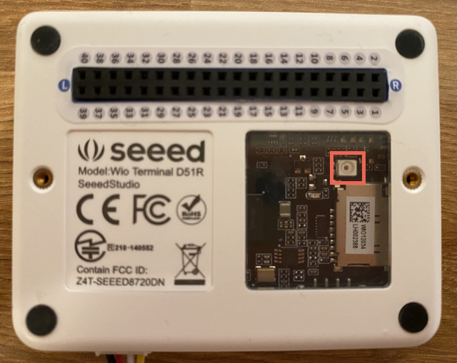

<!--
CO_OP_TRANSLATOR_METADATA:
{
  "original_hash": "7f4ad0ef54f248b85b92187c94cf9dcb",
  "translation_date": "2025-08-25T17:24:46+00:00",
  "source_file": "1-getting-started/lessons/3-sensors-and-actuators/wio-terminal-sensor.md",
  "language_code": "hi"
}
-->
# सेंसर जोड़ें - Wio Terminal

इस पाठ के इस भाग में, आप अपने Wio Terminal पर लाइट सेंसर का उपयोग करेंगे।

## हार्डवेयर

इस पाठ के लिए सेंसर एक **लाइट सेंसर** है जो [फोटोडायोड](https://wikipedia.org/wiki/Photodiode) का उपयोग करके प्रकाश को विद्युत संकेत में बदलता है। यह एक एनालॉग सेंसर है जो 0 से 1,023 तक का पूर्णांक मान भेजता है, जो प्रकाश की सापेक्ष मात्रा को दर्शाता है। यह किसी मानक माप इकाई जैसे [लक्स](https://wikipedia.org/wiki/Lux) से मेल नहीं खाता।

लाइट सेंसर Wio Terminal में अंतर्निहित है और पीछे की पारदर्शी प्लास्टिक खिड़की के माध्यम से दिखाई देता है।



## लाइट सेंसर को प्रोग्राम करें

अब डिवाइस को अंतर्निहित लाइट सेंसर का उपयोग करने के लिए प्रोग्राम किया जा सकता है।

### कार्य

डिवाइस को प्रोग्राम करें।

1. VS Code में नाइटलाइट प्रोजेक्ट खोलें जिसे आपने इस असाइनमेंट के पिछले भाग में बनाया था।

1. `setup` फ़ंक्शन के अंत में निम्नलिखित पंक्ति जोड़ें:

    ```cpp
    pinMode(WIO_LIGHT, INPUT);
    ```

    यह पंक्ति सेंसर हार्डवेयर के साथ संचार करने के लिए उपयोग किए जाने वाले पिन को कॉन्फ़िगर करती है।

    `WIO_LIGHT` पिन उस GPIO पिन का नंबर है जो ऑन-बोर्ड लाइट सेंसर से जुड़ा है। इस पिन को `INPUT` पर सेट किया गया है, जिसका अर्थ है कि यह सेंसर से जुड़ा है और पिन से डेटा पढ़ा जाएगा।

1. `loop` फ़ंक्शन की सामग्री को हटा दें।

1. अब खाली `loop` फ़ंक्शन में निम्नलिखित कोड जोड़ें:

    ```cpp
    int light = analogRead(WIO_LIGHT);
    Serial.print("Light value: ");
    Serial.println(light);
    ```

    यह कोड `WIO_LIGHT` पिन से एक एनालॉग मान पढ़ता है। यह ऑन-बोर्ड लाइट सेंसर से 0-1,023 तक का मान पढ़ता है। यह मान फिर सीरियल पोर्ट पर भेजा जाता है ताकि आप इस कोड के चलने पर इसे सीरियल मॉनिटर में पढ़ सकें। `Serial.print` टेक्स्ट को बिना नई लाइन के अंत में लिखता है, इसलिए प्रत्येक लाइन `Light value:` से शुरू होगी और वास्तविक लाइट मान पर समाप्त होगी।

1. `loop` के अंत में एक सेकंड (1,000ms) की छोटी देरी जोड़ें क्योंकि लाइट स्तरों को लगातार जांचने की आवश्यकता नहीं है। देरी डिवाइस की पावर खपत को कम करती है।

    ```cpp
    delay(1000);
    ```

1. Wio Terminal को अपने कंप्यूटर से फिर से कनेक्ट करें और पहले की तरह नया कोड अपलोड करें।

1. सीरियल मॉनिटर से कनेक्ट करें। लाइट मान टर्मिनल पर आउटपुट होंगे। Wio Terminal के पीछे के लाइट सेंसर को ढकें और हटाएं, और मान बदल जाएंगे।

    ```output
    > Executing task: platformio device monitor <

    --- Available filters and text transformations: colorize, debug, default, direct, hexlify, log2file, nocontrol, printable, send_on_enter, time
    --- More details at http://bit.ly/pio-monitor-filters
    --- Miniterm on /dev/cu.usbmodem101  9600,8,N,1 ---
    --- Quit: Ctrl+C | Menu: Ctrl+T | Help: Ctrl+T followed by Ctrl+H ---
    Light value: 4
    Light value: 5
    Light value: 4
    Light value: 158
    Light value: 343
    Light value: 348
    Light value: 344
    ```

> 💁 आप इस कोड को [code-sensor/wio-terminal](../../../../../1-getting-started/lessons/3-sensors-and-actuators/code-sensor/wio-terminal) फ़ोल्डर में पा सकते हैं।

😀 अपने नाइटलाइट प्रोग्राम में सेंसर जोड़ना सफल रहा!

**अस्वीकरण**:  
यह दस्तावेज़ AI अनुवाद सेवा [Co-op Translator](https://github.com/Azure/co-op-translator) का उपयोग करके अनुवादित किया गया है। जबकि हम सटीकता सुनिश्चित करने का प्रयास करते हैं, कृपया ध्यान दें कि स्वचालित अनुवाद में त्रुटियां या अशुद्धियां हो सकती हैं। मूल भाषा में उपलब्ध मूल दस्तावेज़ को प्रामाणिक स्रोत माना जाना चाहिए। महत्वपूर्ण जानकारी के लिए, पेशेवर मानव अनुवाद की सिफारिश की जाती है। इस अनुवाद के उपयोग से उत्पन्न किसी भी गलतफहमी या गलत व्याख्या के लिए हम उत्तरदायी नहीं हैं।