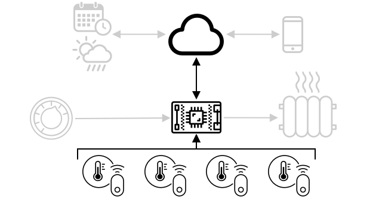

<!--
CO_OP_TRANSLATOR_METADATA:
{
  "original_hash": "71b5040e0b3472f1c0949c9b55f224c0",
  "translation_date": "2025-08-25T17:13:54+00:00",
  "source_file": "1-getting-started/lessons/4-connect-internet/README.md",
  "language_code": "hi"
}
-->
# अपने डिवाइस को इंटरनेट से कनेक्ट करें


> स्केच नोट [नित्या नरसिम्हन](https://github.com/nitya) द्वारा। बड़ी छवि देखने के लिए क्लिक करें।

यह पाठ [Microsoft Reactor](https://developer.microsoft.com/reactor/?WT.mc_id=academic-17441-jabenn) के [Hello IoT series](https://youtube.com/playlist?list=PLmsFUfdnGr3xRts0TIwyaHyQuHaNQcb6-) का हिस्सा है। यह पाठ दो वीडियो में पढ़ाया गया था - एक 1 घंटे का पाठ और एक 1 घंटे का ऑफिस आवर, जिसमें पाठ के हिस्सों को गहराई से समझाया गया और सवालों के जवाब दिए गए।

[](https://youtu.be/O4dd172mZhs)

[](https://youtu.be/j-cVCzRDE2Q)

> 🎥 ऊपर दी गई छवियों पर क्लिक करें और वीडियो देखें

## प्री-लेक्चर क्विज़

[प्री-लेक्चर क्विज़](https://black-meadow-040d15503.1.azurestaticapps.net/quiz/7)

## परिचय

IoT में **I** का मतलब **इंटरनेट** है - क्लाउड कनेक्टिविटी और सेवाएं जो IoT डिवाइस की कई विशेषताओं को सक्षम बनाती हैं, जैसे कि डिवाइस से जुड़े सेंसर से माप एकत्र करना और एक्टुएटर्स को नियंत्रित करने के लिए संदेश भेजना। IoT डिवाइस आमतौर पर एक मानक संचार प्रोटोकॉल का उपयोग करके एकल क्लाउड IoT सेवा से जुड़ते हैं, और वह सेवा आपके IoT एप्लिकेशन के बाकी हिस्सों से जुड़ी होती है, जैसे कि AI सेवाएं जो आपके डेटा के आसपास स्मार्ट निर्णय लेती हैं, या नियंत्रण और रिपोर्टिंग के लिए वेब ऐप्स।

> 🎓 सेंसर से एकत्र किया गया डेटा और क्लाउड को भेजा गया डेटा टेलीमेट्री कहलाता है।

IoT डिवाइस क्लाउड से संदेश प्राप्त कर सकते हैं। अक्सर ये संदेश कमांड होते हैं - यानी किसी कार्य को करने के निर्देश, चाहे वह आंतरिक रूप से हो (जैसे कि रीबूट या फर्मवेयर अपडेट), या एक्टुएटर का उपयोग करके (जैसे कि लाइट चालू करना)।

यह पाठ IoT डिवाइस को क्लाउड से कनेक्ट करने के लिए उपयोग किए जाने वाले कुछ संचार प्रोटोकॉल और वे किस प्रकार का डेटा भेज या प्राप्त कर सकते हैं, इसका परिचय देता है। आप इन दोनों के साथ व्यावहारिक अनुभव भी प्राप्त करेंगे, अपने नाइटलाइट में इंटरनेट नियंत्रण जोड़ेंगे और LED नियंत्रण लॉजिक को 'सर्वर' कोड में स्थानांतरित करेंगे जो स्थानीय रूप से चल रहा है।

इस पाठ में हम निम्नलिखित को कवर करेंगे:

* [संचार प्रोटोकॉल](../../../../../1-getting-started/lessons/4-connect-internet)
* [मैसेज क्यूइंग टेलीमेट्री ट्रांसपोर्ट (MQTT)](../../../../../1-getting-started/lessons/4-connect-internet)
* [टेलीमेट्री](../../../../../1-getting-started/lessons/4-connect-internet)
* [कमांड्स](../../../../../1-getting-started/lessons/4-connect-internet)

## संचार प्रोटोकॉल

IoT डिवाइस द्वारा इंटरनेट से संवाद करने के लिए कई लोकप्रिय संचार प्रोटोकॉल हैं। सबसे लोकप्रिय प्रोटोकॉल किसी प्रकार के ब्रॉकर के माध्यम से प्रकाशित/सदस्यता संदेश पर आधारित हैं। IoT डिवाइस ब्रॉकर से जुड़ते हैं और टेलीमेट्री प्रकाशित करते हैं और कमांड्स की सदस्यता लेते हैं। क्लाउड सेवाएं भी ब्रॉकर से जुड़ती हैं और सभी टेलीमेट्री संदेशों की सदस्यता लेती हैं और विशिष्ट डिवाइसों या डिवाइस समूहों को कमांड्स प्रकाशित करती हैं।

![IoT डिवाइस ब्रॉकर से जुड़ते हैं, टेलीमेट्री प्रकाशित करते हैं और कमांड्स की सदस्यता लेते हैं। क्लाउड सेवाएं ब्रॉकर से जुड़ती हैं, सभी टेलीमेट्री की सदस्यता लेती हैं और विशिष्ट डिवाइसों को कमांड्स भेजती हैं।](../../../../../translated_images/pub-sub.7c7ed43fe9fd15d4e1f81a3fd95440413c457acd9bcbe9a43341e30e88db5264.hi.png)

MQTT IoT डिवाइस के लिए सबसे लोकप्रिय संचार प्रोटोकॉल है और इसे इस पाठ में कवर किया गया है। अन्य प्रोटोकॉल में AMQP और HTTP/HTTPS शामिल हैं।

## मैसेज क्यूइंग टेलीमेट्री ट्रांसपोर्ट (MQTT)

[MQTT](http://mqtt.org) एक हल्का, ओपन स्टैंडर्ड मैसेजिंग प्रोटोकॉल है जो डिवाइसों के बीच संदेश भेज सकता है। इसे 1999 में तेल पाइपलाइनों की निगरानी के लिए डिज़ाइन किया गया था, और 15 साल बाद IBM द्वारा एक ओपन स्टैंडर्ड के रूप में जारी किया गया।

MQTT में एक ब्रॉकर और कई क्लाइंट होते हैं। सभी क्लाइंट ब्रॉकर से जुड़ते हैं, और ब्रॉकर संदेशों को संबंधित क्लाइंट्स तक पहुंचाता है। संदेशों को नामित टॉपिक्स का उपयोग करके रूट किया जाता है, बजाय इसके कि उन्हें सीधे किसी व्यक्तिगत क्लाइंट को भेजा जाए। एक क्लाइंट किसी टॉपिक पर प्रकाशित कर सकता है, और उस टॉपिक की सदस्यता लेने वाले सभी क्लाइंट्स को संदेश प्राप्त होगा।


✅ शोध करें। यदि आपके पास बहुत सारे IoT डिवाइस हैं, तो आप कैसे सुनिश्चित कर सकते हैं कि आपका MQTT ब्रॉकर सभी संदेशों को संभाल सके?

### अपने IoT डिवाइस को MQTT से कनेक्ट करें

अपने नाइटलाइट में इंटरनेट नियंत्रण जोड़ने का पहला भाग इसे MQTT ब्रॉकर से कनेक्ट करना है।

#### कार्य

अपने डिवाइस को MQTT ब्रॉकर से कनेक्ट करें।

इस पाठ के इस भाग में, आप अपने IoT नाइटलाइट को इंटरनेट से कनेक्ट करेंगे ताकि इसे दूरस्थ रूप से नियंत्रित किया जा सके। इस पाठ में बाद में, आपका IoT डिवाइस MQTT के माध्यम से एक सार्वजनिक MQTT ब्रॉकर को प्रकाश स्तर का टेलीमेट्री संदेश भेजेगा, जहां इसे कुछ सर्वर कोड द्वारा उठाया जाएगा जिसे आप लिखेंगे। यह कोड प्रकाश स्तर की जांच करेगा और डिवाइस को LED चालू या बंद करने का निर्देश देने वाला एक कमांड संदेश वापस भेजेगा।

ऐसी सेटअप के लिए वास्तविक दुनिया का उपयोग मामला यह हो सकता है कि कई प्रकाश सेंसरों से डेटा एकत्र किया जाए और फिर निर्णय लिया जाए कि लाइट्स चालू करनी हैं या नहीं, जैसे कि एक स्टेडियम में जहां बहुत सारी लाइट्स हैं। यह लाइट्स को चालू होने से रोक सकता है यदि केवल एक सेंसर बादलों या पक्षी द्वारा ढका हुआ हो, लेकिन अन्य सेंसर पर्याप्त प्रकाश का पता लगाते हों।

✅ और कौन से ऐसे परिदृश्य हो सकते हैं जहां कई सेंसरों से डेटा का मूल्यांकन करने के बाद ही कमांड भेजने की आवश्यकता हो?

इस असाइनमेंट के हिस्से के रूप में MQTT ब्रॉकर सेटअप की जटिलताओं से निपटने के बजाय, आप [Eclipse Mosquitto](https://www.mosquitto.org) द्वारा संचालित एक सार्वजनिक परीक्षण सर्वर का उपयोग कर सकते हैं, जो एक ओपन-सोर्स MQTT ब्रॉकर है। यह परीक्षण ब्रॉकर [test.mosquitto.org](https://test.mosquitto.org) पर सार्वजनिक रूप से उपलब्ध है और इसे सेटअप करने के लिए किसी खाते की आवश्यकता नहीं है, जिससे यह MQTT क्लाइंट्स और सर्वर का परीक्षण करने के लिए एक शानदार उपकरण बन जाता है।

> 💁 यह परीक्षण ब्रॉकर सार्वजनिक और असुरक्षित है। कोई भी आपके द्वारा प्रकाशित सामग्री को सुन सकता है, इसलिए इसे किसी भी निजी डेटा के साथ उपयोग नहीं किया जाना चाहिए।


MQTT ब्रॉकर से अपने डिवाइस को कनेक्ट करने के लिए नीचे दिए गए संबंधित चरण का पालन करें:

* [Arduino - Wio Terminal](wio-terminal-mqtt.md)
* [सिंगल-बोर्ड कंप्यूटर - Raspberry Pi/Virtual IoT डिवाइस](single-board-computer-mqtt.md)

### MQTT में गहराई से जानकारी

टॉपिक्स में एक पदानुक्रम हो सकता है, और क्लाइंट्स वाइल्डकार्ड का उपयोग करके पदानुक्रम के विभिन्न स्तरों की सदस्यता ले सकते हैं। उदाहरण के लिए, आप `/telemetry/temperature` टॉपिक पर तापमान टेलीमेट्री संदेश भेज सकते हैं और `/telemetry/humidity` टॉपिक पर आर्द्रता संदेश भेज सकते हैं, फिर अपने क्लाउड ऐप में `/telemetry/*` टॉपिक की सदस्यता लेकर दोनों टेलीमेट्री संदेश प्राप्त कर सकते हैं।

संदेशों को गुणवत्ता सेवा (QoS) के साथ भेजा जा सकता है, जो संदेश प्राप्त होने की गारंटी को निर्धारित करता है।

* अधिकतम एक बार - संदेश केवल एक बार भेजा जाता है और क्लाइंट और ब्रॉकर डिलीवरी की पुष्टि करने के लिए कोई अतिरिक्त कदम नहीं उठाते (फायर एंड फॉरगेट)।
* कम से कम एक बार - संदेश को कई बार पुनः प्रयास किया जाता है जब तक कि पुष्टि प्राप्त न हो जाए (पुष्टि की गई डिलीवरी)।
* बिल्कुल एक बार - भेजने वाला और प्राप्त करने वाला एक दो-स्तरीय हैंडशेक में संलग्न होते हैं ताकि यह सुनिश्चित किया जा सके कि संदेश की केवल एक प्रति प्राप्त हो (आश्वस्त डिलीवरी)।

✅ कौन से परिदृश्य में आश्वस्त डिलीवरी संदेश की आवश्यकता हो सकती है, जबकि फायर एंड फॉरगेट संदेश पर्याप्त हो सकता है?

हालांकि नाम मैसेज क्यूइंग (MQTT में शुरुआती अक्षर), यह वास्तव में संदेश कतारों का समर्थन नहीं करता है। इसका मतलब है कि यदि कोई क्लाइंट डिस्कनेक्ट हो जाता है, तो पुनः कनेक्ट होने पर उसे डिस्कनेक्शन के दौरान भेजे गए संदेश प्राप्त नहीं होंगे, सिवाय उन संदेशों के जिन्हें उसने पहले ही QoS प्रक्रिया का उपयोग करके संसाधित करना शुरू कर दिया था। संदेशों में एक रिटेन फ्लैग सेट किया जा सकता है। यदि यह सेट है, तो MQTT ब्रॉकर उस टॉपिक पर भेजे गए अंतिम संदेश को इस फ्लैग के साथ संग्रहीत करेगा और इसे किसी भी क्लाइंट्स को भेजेगा जो बाद में उस टॉपिक की सदस्यता लेते हैं। इस तरह, क्लाइंट्स हमेशा नवीनतम संदेश प्राप्त करेंगे।

MQTT एक कीप अलाइव फ़ंक्शन का भी समर्थन करता है जो संदेशों के बीच लंबे अंतराल के दौरान कनेक्शन की जांच करता है।

> 🦟 [Eclipse Foundation से Mosquitto](https://mosquitto.org) एक मुफ्त MQTT ब्रॉकर प्रदान करता है जिसे आप स्वयं चला सकते हैं और MQTT के साथ प्रयोग कर सकते हैं, साथ ही एक सार्वजनिक MQTT ब्रॉकर भी प्रदान करता है जिसे आप अपने कोड का परीक्षण करने के लिए उपयोग कर सकते हैं, जो [test.mosquitto.org](https://test.mosquitto.org) पर होस्ट किया गया है।

MQTT कनेक्शन सार्वजनिक और खुले हो सकते हैं, या उपयोगकर्ता नाम और पासवर्ड, या प्रमाणपत्रों का उपयोग करके एन्क्रिप्ट और सुरक्षित किए जा सकते हैं।

> 💁 MQTT TCP/IP पर संवाद करता है, वही अंतर्निहित नेटवर्क प्रोटोकॉल जो HTTP का उपयोग करता है, लेकिन एक अलग पोर्ट पर। आप MQTT को वेब ऐप्स के साथ संवाद करने के लिए वेब सॉकेट्स के माध्यम से भी उपयोग कर सकते हैं, जो ब्राउज़र में चल रहे हैं, या उन स्थितियों में जहां फायरवॉल या अन्य नेटवर्किंग नियम मानक MQTT कनेक्शन को ब्लॉक करते हैं।

## टेलीमेट्री

टेलीमेट्री शब्द ग्रीक मूल से लिया गया है जिसका अर्थ है दूर से मापना। टेलीमेट्री सेंसरों से डेटा एकत्र करने और इसे क्लाउड में भेजने की क्रिया है।

> 💁 सबसे शुरुआती टेलीमेट्री उपकरणों में से एक 1874 में फ्रांस में आविष्कार किया गया था और यह मोंट ब्लांक से पेरिस तक वास्तविक समय में मौसम और बर्फ की गहराई भेजता था। उस समय वायरलेस तकनीक उपलब्ध नहीं थी, इसलिए इसमें भौतिक तारों का उपयोग किया गया।

पाठ 1 के स्मार्ट थर्मोस्टेट के उदाहरण पर वापस चलते हैं।



थर्मोस्टेट में टेलीमेट्री एकत्र करने के लिए तापमान सेंसर होते हैं। इसमें सबसे अधिक संभावना है कि एक तापमान सेंसर अंतर्निहित होगा, और यह [ब्लूटूथ लो एनर्जी](https://wikipedia.org/wiki/Bluetooth_Low_Energy) (BLE) जैसे वायरलेस प्रोटोकॉल के माध्यम से कई बाहरी तापमान सेंसरों से जुड़ सकता है।

यह टेलीमेट्री डेटा का एक उदाहरण हो सकता है जिसे यह भेजेगा:

| नाम | मान | विवरण |
| ---- | ----- | ----------- |
| `thermostat_temperature` | 18°C | थर्मोस्टेट के अंतर्निर्मित तापमान सेंसर द्वारा मापा गया तापमान |
| `livingroom_temperature` | 19°C | एक दूरस्थ तापमान सेंसर द्वारा मापा गया तापमान जिसे `livingroom` नाम दिया गया है ताकि उस कमरे की पहचान की जा सके जिसमें यह है |
| `bedroom_temperature` | 21°C | एक दूरस्थ तापमान सेंसर द्वारा मापा गया तापमान जिसे `bedroom` नाम दिया गया है ताकि उस कमरे की पहचान की जा सके जिसमें यह है |

क्लाउड सेवा इस टेलीमेट्री डेटा का उपयोग हीटिंग को नियंत्रित करने के लिए कौन से कमांड्स भेजने हैं, इस पर निर्णय लेने के लिए कर सकती है।

### अपने IoT डिवाइस से टेलीमेट्री भेजें

अपने नाइटलाइट में इंटरनेट नियंत्रण जोड़ने का अगला भाग टेलीमेट्री टॉपिक पर MQTT ब्रॉकर को प्रकाश स्तर टेलीमेट्री भेजना है।

#### कार्य - अपने IoT डिवाइस से टेलीमेट्री भेजें

प्रकाश स्तर टेलीमेट्री को MQTT ब्रॉकर पर भेजें।

डेटा JSON के रूप में एन्कोड किया जाता है - JavaScript Object Notation का संक्षिप्त नाम, जो टेक्स्ट में डेटा को कुंजी/मान जोड़े का उपयोग करके एन्कोड करने का एक मानक है।

✅ यदि आपने पहले JSON के बारे में नहीं सुना है, तो आप [JSON.org दस्तावेज़](https://www.json.org/) पर इसके बारे में अधिक जान सकते हैं।

अपने डिवाइस से MQTT ब्रॉकर को टेलीमेट्री भेजने के लिए नीचे दिए गए संबंधित चरण का पालन करें:

* [Arduino - Wio Terminal](wio-terminal-telemetry.md)
* [सिंगल-बोर्ड कंप्यूटर - Raspberry Pi/Virtual IoT डिवाइस](single-board-computer-telemetry.md)

### MQTT ब्रॉकर से टेलीमेट्री प्राप्त करें

टेलीमेट्री भेजने का कोई मतलब नहीं है यदि इसे सुनने के लिए कुछ भी नहीं है। प्रकाश स्तर टेलीमेट्री को इसे संसाधित करने के लिए कुछ सुनने की आवश्यकता है। यह 'सर्वर' कोड वह प्रकार का कोड है जिसे आप एक बड़े IoT एप्लिकेशन के हिस्से के रूप में क्लाउड सेवा पर तैनात करेंगे, लेकिन यहां आप इस कोड को अपने कंप्यूटर पर (या अपने Pi पर यदि आप सीधे वहां कोडिंग कर रहे हैं) चलाने जा रहे हैं। सर्वर कोड में एक Python ऐप शामिल है जो MQTT के माध्यम से प्रकाश स्तर के साथ टेलीमेट्री संदेशों को सुनता है। इस पाठ में बाद में आप इसे LED चालू या बंद करने के निर्देशों के साथ एक कमांड संदेश के साथ उत्तर देने के लिए बनाएंगे।

✅ शोध करें: यदि कोई श्रोता नहीं है तो MQTT संदेशों का क्या होता है?

#### Python और VS Code इंस्टॉल करें

यदि आपके पास स्थानीय रूप से Python और VS Code इंस्टॉल नहीं है, तो आपको सर्वर को कोड करने के लिए दोनों को इंस्टॉल करना होगा। यदि आप एक वर्चुअल IoT डिवाइस का उपयोग कर रहे हैं, या अपने Raspberry Pi पर काम कर रहे हैं तो आप इस चरण को छोड़ सकते हैं क्योंकि आपके पास इसे पहले से इंस्टॉल और कॉन्फ़िगर किया हुआ होना चाहिए।

##### कार्य - Python और VS Code इंस्टॉल करें

Python और VS Code इंस्टॉल करें।

1. Python इंस्टॉल करें। Python का नवीनतम संस्करण इंस्टॉल करने के निर्देशों के लिए [Python डाउनलोड पेज](https://www.python.org/downloads/) देखें।

1. Visual Studio Code (VS Code) इंस्टॉल करें। यह वह एडिटर है जिसे आप Python में अपने वर्चुअल डिवाइस कोड लिखने के लिए उपयोग करेंगे। VS Code इंस्टॉल करने के निर्देशों के लिए [VS Code दस्तावेज़](https://code.visualstudio.com?WT.mc_id=academic-17441-jabenn) देखें।
💁 आप इन पाठों के लिए किसी भी पसंदीदा Python IDE या संपादक का उपयोग करने के लिए स्वतंत्र हैं, लेकिन पाठों में निर्देश VS Code का उपयोग करने के आधार पर दिए जाएंगे।
1. VS Code Pylance एक्सटेंशन इंस्टॉल करें। यह VS Code के लिए एक एक्सटेंशन है जो Python भाषा का समर्थन प्रदान करता है। इस एक्सटेंशन को VS Code में इंस्टॉल करने के निर्देशों के लिए [Pylance एक्सटेंशन डाक्यूमेंटेशन](https://marketplace.visualstudio.com/items?WT.mc_id=academic-17441-jabenn&itemName=ms-python.vscode-pylance) देखें।

#### Python वर्चुअल एनवायरनमेंट कॉन्फ़िगर करें

Python की एक शक्तिशाली विशेषता [pip पैकेज](https://pypi.org) इंस्टॉल करने की क्षमता है - ये कोड के पैकेज हैं जो अन्य लोगों द्वारा लिखे गए हैं और इंटरनेट पर प्रकाशित किए गए हैं। आप एक कमांड के साथ अपने कंप्यूटर पर एक pip पैकेज इंस्टॉल कर सकते हैं और फिर उस पैकेज का उपयोग अपने कोड में कर सकते हैं। आप MQTT पर संचार करने के लिए एक पैकेज इंस्टॉल करने के लिए pip का उपयोग करेंगे।

डिफ़ॉल्ट रूप से, जब आप एक पैकेज इंस्टॉल करते हैं, तो यह आपके कंप्यूटर पर हर जगह उपलब्ध होता है, और यह पैकेज संस्करणों के साथ समस्याओं का कारण बन सकता है - जैसे कि एक एप्लिकेशन एक पैकेज के एक संस्करण पर निर्भर करता है जो तब टूट जाता है जब आप किसी अन्य एप्लिकेशन के लिए एक नया संस्करण इंस्टॉल करते हैं। इस समस्या से बचने के लिए, आप [Python वर्चुअल एनवायरनमेंट](https://docs.python.org/3/library/venv.html) का उपयोग कर सकते हैं, जो मूल रूप से एक समर्पित फ़ोल्डर में Python की एक प्रति है, और जब आप pip पैकेज इंस्टॉल करते हैं, तो वे केवल उस फ़ोल्डर में इंस्टॉल होते हैं।

##### कार्य - Python वर्चुअल एनवायरनमेंट कॉन्फ़िगर करें

Python वर्चुअल एनवायरनमेंट कॉन्फ़िगर करें और MQTT pip पैकेज इंस्टॉल करें।

1. अपने टर्मिनल या कमांड लाइन से, अपनी पसंद के स्थान पर निम्नलिखित कमांड चलाएं ताकि एक नया डायरेक्टरी बनाई जा सके और उसमें नेविगेट किया जा सके:

    ```sh
    mkdir nightlight-server
    cd nightlight-server
    ```

1. अब `.venv` फ़ोल्डर में एक वर्चुअल एनवायरनमेंट बनाने के लिए निम्नलिखित कमांड चलाएं:

    ```sh
    python3 -m venv .venv
    ```

    > 💁 आपको वर्चुअल एनवायरनमेंट बनाने के लिए स्पष्ट रूप से `python3` कॉल करना होगा, यह सुनिश्चित करने के लिए कि आपके पास Python 2 के साथ-साथ Python 3 (नवीनतम संस्करण) इंस्टॉल है। यदि आपके पास Python 2 इंस्टॉल है, तो `python` कॉल करने पर Python 2 का उपयोग होगा, न कि Python 3 का।

1. वर्चुअल एनवायरनमेंट को सक्रिय करें:

    * Windows पर:
        * यदि आप Command Prompt या Windows Terminal के माध्यम से Command Prompt का उपयोग कर रहे हैं, तो निम्नलिखित चलाएं:

            ```cmd
            .venv\Scripts\activate.bat
            ```

        * यदि आप PowerShell का उपयोग कर रहे हैं, तो निम्नलिखित चलाएं:

            ```powershell
            .\.venv\Scripts\Activate.ps1
            ```

    * macOS या Linux पर, निम्नलिखित चलाएं:

        ```cmd
        source ./.venv/bin/activate
        ```

    > 💁 ये कमांड उसी स्थान से चलाए जाने चाहिए जहां आपने वर्चुअल एनवायरनमेंट बनाने का कमांड चलाया था। आपको कभी भी `.venv` फ़ोल्डर में नेविगेट करने की आवश्यकता नहीं होगी, आपको हमेशा सक्रिय करने का कमांड और पैकेज इंस्टॉल करने या कोड चलाने के लिए कमांड उसी फ़ोल्डर से चलाना चाहिए जहां आपने वर्चुअल एनवायरनमेंट बनाया था।

1. एक बार वर्चुअल एनवायरनमेंट सक्रिय हो जाने के बाद, डिफ़ॉल्ट `python` कमांड उस Python संस्करण को चलाएगा जिसका उपयोग वर्चुअल एनवायरनमेंट बनाने के लिए किया गया था। संस्करण प्राप्त करने के लिए निम्नलिखित चलाएं:

    ```sh
    python --version
    ```

    आउटपुट निम्नलिखित के समान होगा:

    ```output
    (.venv) ➜  nightlight-server python --version
    Python 3.9.1
    ```

    > 💁 आपका Python संस्करण अलग हो सकता है - जब तक यह संस्करण 3.6 या उससे अधिक है, तब तक आप ठीक हैं। यदि नहीं, तो इस फ़ोल्डर को हटा दें, Python का नया संस्करण इंस्टॉल करें और पुनः प्रयास करें।

1. [Paho-MQTT](https://pypi.org/project/paho-mqtt/) के लिए pip पैकेज इंस्टॉल करने के लिए निम्नलिखित कमांड चलाएं, जो एक लोकप्रिय MQTT लाइब्रेरी है।

    ```sh
    pip install paho-mqtt
    ```

    यह pip पैकेज केवल वर्चुअल एनवायरनमेंट में इंस्टॉल होगा और इसके बाहर उपलब्ध नहीं होगा।

#### सर्वर कोड लिखें

अब सर्वर कोड Python में लिखा जा सकता है।

##### कार्य - सर्वर कोड लिखें

सर्वर कोड लिखें।

1. वर्चुअल एनवायरनमेंट के अंदर, अपने टर्मिनल या कमांड लाइन से निम्नलिखित चलाएं ताकि `app.py` नामक एक Python फ़ाइल बनाई जा सके:

    * Windows से चलाएं:

        ```cmd
        type nul > app.py
        ```

    * macOS या Linux पर चलाएं:

        ```cmd
        touch app.py
        ```

1. वर्तमान फ़ोल्डर को VS Code में खोलें:

    ```sh
    code .
    ```

1. जब VS Code लॉन्च होगा, तो यह Python वर्चुअल एनवायरनमेंट को सक्रिय करेगा। यह नीचे की स्टेटस बार में रिपोर्ट किया जाएगा:

    

1. यदि VS Code टर्मिनल पहले से चल रहा है जब VS Code शुरू होता है, तो इसमें वर्चुअल एनवायरनमेंट सक्रिय नहीं होगा। सबसे आसान तरीका है टर्मिनल को **Kill the active terminal instance** बटन का उपयोग करके बंद करना:

    

1. *Terminal -> New Terminal* का चयन करके या `` CTRL+` `` दबाकर एक नया VS Code टर्मिनल लॉन्च करें। नया टर्मिनल वर्चुअल एनवायरनमेंट को लोड करेगा, और इसे सक्रिय करने का कॉल टर्मिनल में दिखाई देगा। वर्चुअल एनवायरनमेंट का नाम (`.venv`) भी प्रॉम्प्ट में होगा:

    ```output
    ➜  nightlight-server source .venv/bin/activate
    (.venv) ➜  nightlight 
    ```

1. VS Code एक्सप्लोरर से `app.py` फ़ाइल खोलें और निम्नलिखित कोड जोड़ें:

    ```python
    import json
    import time
    
    import paho.mqtt.client as mqtt
    
    id = '<ID>'
    
    client_telemetry_topic = id + '/telemetry'
    client_name = id + 'nightlight_server'
    
    mqtt_client = mqtt.Client(client_name)
    mqtt_client.connect('test.mosquitto.org')
    
    mqtt_client.loop_start()
    
    def handle_telemetry(client, userdata, message):
        payload = json.loads(message.payload.decode())
        print("Message received:", payload)
    
    mqtt_client.subscribe(client_telemetry_topic)
    mqtt_client.on_message = handle_telemetry
    
    while True:
        time.sleep(2)
    ```

    लाइन 6 में `<ID>` को उस यूनिक ID से बदलें जिसे आपने अपना डिवाइस कोड बनाते समय उपयोग किया था।

    ⚠️ यह **उसी** ID के समान होना चाहिए जिसे आपने अपने डिवाइस पर उपयोग किया था, अन्यथा सर्वर कोड सही टॉपिक पर सब्सक्राइब या पब्लिश नहीं करेगा।

    यह कोड एक यूनिक नाम के साथ एक MQTT क्लाइंट बनाता है और *test.mosquitto.org* ब्रोकर्स से कनेक्ट करता है। फिर यह एक प्रोसेसिंग लूप शुरू करता है जो बैकग्राउंड थ्रेड में किसी भी सब्सक्राइब किए गए टॉपिक पर संदेश सुनने के लिए चलता है।

    क्लाइंट फिर टेलीमेट्री टॉपिक पर संदेशों को सब्सक्राइब करता है और एक फ़ंक्शन परिभाषित करता है जिसे संदेश प्राप्त होने पर कॉल किया जाता है। जब एक टेलीमेट्री संदेश प्राप्त होता है, तो `handle_telemetry` फ़ंक्शन को कॉल किया जाता है, जो कंसोल में प्राप्त संदेश को प्रिंट करता है।

    अंत में, एक अनंत लूप एप्लिकेशन को चलाता रहता है। MQTT क्लाइंट बैकग्राउंड थ्रेड में संदेशों को सुन रहा है और मुख्य एप्लिकेशन के चलने तक चलता रहता है।

1. VS Code टर्मिनल से, अपने Python ऐप को चलाने के लिए निम्नलिखित चलाएं:

    ```sh
    python app.py
    ```

    ऐप IoT डिवाइस से संदेश सुनना शुरू कर देगा।

1. सुनिश्चित करें कि आपका डिवाइस चल रहा है और टेलीमेट्री संदेश भेज रहा है। अपने भौतिक या वर्चुअल डिवाइस द्वारा डिटेक्ट किए गए प्रकाश स्तरों को समायोजित करें। प्राप्त संदेश टर्मिनल में प्रिंट किए जाएंगे।

    ```output
    (.venv) ➜  nightlight-server python app.py
    Message received: {'light': 0}
    Message received: {'light': 400}
    ```

    nightlight वर्चुअल एनवायरनमेंट में `app.py` फ़ाइल को चलाना आवश्यक है ताकि nightlight-server वर्चुअल एनवायरनमेंट में `app.py` फ़ाइल द्वारा भेजे गए संदेश प्राप्त किए जा सकें।

> 💁 आप इस कोड को [code-server/server](../../../../../1-getting-started/lessons/4-connect-internet/code-server/server) फ़ोल्डर में पा सकते हैं।

### टेलीमेट्री कितनी बार भेजी जानी चाहिए?

टेलीमेट्री के साथ एक महत्वपूर्ण विचार यह है कि डेटा को कितनी बार मापा और भेजा जाना चाहिए? जवाब है - यह निर्भर करता है। यदि आप बार-बार मापते हैं, तो आप माप में बदलावों पर तेजी से प्रतिक्रिया कर सकते हैं, लेकिन आप अधिक पावर, अधिक बैंडविड्थ का उपयोग करते हैं, अधिक डेटा उत्पन्न करते हैं और इसे प्रोसेस करने के लिए अधिक क्लाउड संसाधनों की आवश्यकता होती है। आपको पर्याप्त बार मापना चाहिए, लेकिन बहुत बार नहीं।

थर्मोस्टेट के लिए, हर कुछ मिनटों में मापना शायद पर्याप्त से अधिक है क्योंकि तापमान इतनी बार नहीं बदलता। यदि आप केवल दिन में एक बार मापते हैं, तो आप एक धूप वाले दिन के बीच में रात के तापमान के लिए अपने घर को गर्म कर सकते हैं, जबकि यदि आप हर सेकंड मापते हैं, तो आपके पास हजारों अनावश्यक रूप से डुप्लिकेट तापमान माप होंगे जो उपयोगकर्ता के इंटरनेट की गति और बैंडविड्थ को खा जाएंगे (सीमित बैंडविड्थ योजनाओं वाले लोगों के लिए एक समस्या), अधिक पावर का उपयोग करेंगे जो बैटरी चालित डिवाइस जैसे रिमोट सेंसर के लिए समस्या हो सकती है, और प्रोसेसिंग और स्टोरेज के लिए प्रदाता के क्लाउड कंप्यूटिंग संसाधनों की लागत बढ़ाएंगे।

यदि आप किसी फैक्ट्री में एक मशीनरी के आसपास डेटा की निगरानी कर रहे हैं, जो यदि विफल हो जाती है तो विनाशकारी क्षति और लाखों डॉलर के राजस्व का नुकसान हो सकता है, तो प्रति सेकंड कई बार मापना आवश्यक हो सकता है। बैंडविड्थ बर्बाद करना बेहतर है बजाय इसके कि टेलीमेट्री को मिस कर दिया जाए जो यह संकेत दे सकती है कि मशीन को तोड़ने से पहले रोका और ठीक किया जाना चाहिए।

> 💁 इस स्थिति में, आप इंटरनेट पर निर्भरता को कम करने के लिए पहले टेलीमेट्री को प्रोसेस करने के लिए एक एज डिवाइस रखने पर विचार कर सकते हैं।

### कनेक्टिविटी का नुकसान

इंटरनेट कनेक्शन अविश्वसनीय हो सकते हैं, और आउटेज आम हैं। ऐसे में IoT डिवाइस को क्या करना चाहिए - क्या उसे डेटा खो देना चाहिए, या कनेक्टिविटी बहाल होने तक इसे स्टोर करना चाहिए? फिर से, जवाब है - यह निर्भर करता है।

थर्मोस्टेट के लिए डेटा को खो देना ठीक हो सकता है जैसे ही एक नया तापमान माप लिया गया हो। हीटिंग सिस्टम को इस बात की परवाह नहीं है कि 20 मिनट पहले तापमान 20.5°C था, अगर अब तापमान 19°C है, तो यह वर्तमान तापमान है जो यह निर्धारित करता है कि हीटिंग चालू होनी चाहिए या नहीं।

मशीनरी के लिए आप डेटा को रखना चाह सकते हैं, खासकर यदि इसका उपयोग ट्रेंड्स देखने के लिए किया जाता है। मशीन लर्निंग मॉडल हैं जो डेटा की स्ट्रीम में अनियमितताओं का पता लगाने के लिए एक परिभाषित समय अवधि (जैसे पिछले घंटे) के डेटा को देखकर अनियमित डेटा की पहचान करते हैं। यह अक्सर प्रेडिक्टिव मेंटेनेंस के लिए उपयोग किया जाता है, यह देखने के लिए कि कुछ टूटने वाला है ताकि आप इसे टूटने से पहले ठीक कर सकें। आप मशीन के लिए हर टेलीमेट्री को प्रोसेसिंग के लिए भेजना चाह सकते हैं, इसलिए जैसे ही IoT डिवाइस फिर से कनेक्ट हो, यह इंटरनेट आउटेज के दौरान उत्पन्न सभी टेलीमेट्री को भेज देगा।

IoT डिवाइस डिज़ाइनरों को यह भी विचार करना चाहिए कि क्या IoT डिवाइस इंटरनेट आउटेज या स्थान के कारण सिग्नल की हानि के दौरान उपयोग किया जा सकता है। एक स्मार्ट थर्मोस्टेट को कुछ सीमित निर्णय लेने में सक्षम होना चाहिए ताकि यदि यह क्लाउड को टेलीमेट्री नहीं भेज सकता है, तो भी हीटिंग को नियंत्रित किया जा सके।

[](https://twitter.com/internetofshit/status/1315736960082808832)

MQTT के लिए कनेक्टिविटी के नुकसान को संभालने के लिए, डिवाइस और सर्वर कोड को यह सुनिश्चित करने की जिम्मेदारी लेनी होगी कि संदेश डिलीवरी आवश्यक होने पर सुनिश्चित हो, उदाहरण के लिए सभी भेजे गए संदेशों को एक रिप्लाई टॉपिक पर अतिरिक्त संदेशों द्वारा उत्तर देने की आवश्यकता हो, और यदि नहीं, तो उन्हें मैन्युअल रूप से कतारबद्ध किया जाए ताकि बाद में रिप्ले किया जा सके।

## कमांड्स

कमांड वे संदेश हैं जो क्लाउड से डिवाइस को भेजे जाते हैं, उन्हें कुछ करने का निर्देश देते हैं। अधिकांश समय यह किसी प्रकार का आउटपुट देने के लिए एक एक्टुएटर के माध्यम से होता है, लेकिन यह डिवाइस के लिए एक निर्देश भी हो सकता है, जैसे कि रीबूट करना, या अतिरिक्त टेलीमेट्री एकत्र करना और इसे कमांड के उत्तर के रूप में वापस करना।


एक थर्मोस्टेट क्लाउड से हीटिंग चालू करने का कमांड प्राप्त कर सकता है। सभी सेंसरों से टेलीमेट्री डेटा के आधार पर, यदि क्लाउड सेवा ने तय किया है कि हीटिंग चालू होनी चाहिए, तो यह संबंधित कमांड भेजता है।

### MQTT ब्रोकर्स को कमांड्स भेजें

हमारे इंटरनेट नियंत्रित नाइटलाइट के लिए अगला कदम यह है कि सर्वर कोड IoT डिवाइस को प्रकाश स्तरों के आधार पर लाइट को नियंत्रित करने के लिए एक कमांड वापस भेजे।

1. VS Code में सर्वर कोड खोलें

1. `client_telemetry_topic` की घोषणा के बाद निम्नलिखित लाइन जोड़ें ताकि यह परिभाषित किया जा सके कि कौन से टॉपिक पर कमांड्स भेजे जाएं:

    ```python
    server_command_topic = id + '/commands'
    ```

1. `handle_telemetry` फ़ंक्शन के अंत में निम्नलिखित कोड जोड़ें:

    ```python
    command = { 'led_on' : payload['light'] < 300 }
    print("Sending message:", command)
    
    client.publish(server_command_topic, json.dumps(command))
    ```

    यह कमांड टॉपिक पर एक JSON संदेश भेजता है जिसमें `led_on` का मान true या false होता है, यह इस पर निर्भर करता है कि प्रकाश 300 से कम है या नहीं। यदि प्रकाश 300 से कम है, तो true भेजा जाता है ताकि डिवाइस को LED चालू करने का निर्देश दिया जा सके।

1. पहले की तरह कोड चलाएं

1. अपने भौतिक या वर्चुअल डिवाइस द्वारा डिटेक्ट किए गए प्रकाश स्तरों को समायोजित करें। प्राप्त संदेश और भेजे गए कमांड्स टर्मिनल में लिखे जाएंगे:

    ```output
    (.venv) ➜  nightlight-server python app.py
    Message received: {'light': 0}
    Sending message: {'led_on': True}
    Message received: {'light': 400}
    Sending message: {'led_on': False}
    ```

> 💁 टेलीमेट्री और कमांड्स एक ही टॉपिक पर भेजे जा रहे हैं। इसका मतलब है कि कई डिवाइसों से टेलीमेट्री एक ही टेलीमेट्री टॉपिक पर दिखाई देगी, और कई डिवाइसों को भेजे गए कमांड्स एक ही कमांड्स टॉपिक पर दिखाई देंगे। यदि आप किसी विशिष्ट डिवाइस को कमांड भेजना चाहते हैं, तो आप कई टॉपिक्स का उपयोग कर सकते हैं, जिन्हें एक यूनिक डिवाइस आईडी के साथ नामित किया गया है, जैसे `/commands/device1`, `/commands/device2`। इस तरह एक डिवाइस केवल उन संदेशों को सुन सकता है जो केवल उस एक डिवाइस के लिए हैं।

> 💁 आप इस कोड को [code-commands/server](../../../../../1-getting-started/lessons/4-connect-internet/code-commands/server) फ़ोल्डर में पा सकते हैं।

### IoT डिवाइस पर कमांड्स को संभालें

अब जब सर्वर से कमांड्स भेजे जा रहे हैं, तो आप अब कोड को IoT डिवाइस में जोड़ सकते हैं ताकि उन्हें संभाला जा सके और LED को नियंत्रित किया जा सके।

MQTT ब्रोकर्स से कमांड्स सुनने के लिए नीचे दिए गए संबंधित चरण का पालन करें:

* [Arduino - Wio Terminal](wio-terminal-commands.md)
* [सिंगल-बोर्ड कंप्यूटर - Raspberry Pi/वर्चुअल IoT डिवाइस](single-board-computer-commands.md)

एक बार यह कोड लिखा और चल रहा हो, प्रकाश स्तरों को बदलने के साथ प्रयोग करें। सर्वर और डिवाइस से आउटपुट देखें, और जैसे ही आप प्रकाश स्तर बदलते हैं, LED को देखें।

### कनेक्टिविटी का नुकसान

यदि किसी IoT डिवाइस को ऑफलाइन होने पर क्लाउड सेवा को कमांड भेजने की आवश्यकता हो, तो उसे क्या करना चाहिए? फिर से, जवाब है - यह निर्भर करता है।

यदि नवीनतम कमांड पहले वाले को ओवरराइड करता है, तो पहले वाले को शायद अनदेखा किया जा सकता है। यदि क्लाउड सेवा हीटिंग चालू करने का कमांड भेजती है, फिर इसे बंद करने का कमांड भेजती है, तो चालू करने का कमांड अनदेखा किया जा सकता है और पुनः नहीं भेजा जा सकता।

यदि कमांड्स को क्रम में प्रोसेस करने की आवश्यकता है, जैसे कि एक रोबोट आर्म को ऊपर ले जाना, फिर एक ग्रैबर को बंद करना, तो उन्हें कनेक्टिविटी बहाल
इन उपकरणों के बारे में सोचें, वे कौन से संदेश भेज या प्राप्त कर सकते हैं। वे कौन सा टेलीमेट्री डेटा भेजते हैं? वे कौन से संदेश या कमांड प्राप्त कर सकते हैं? क्या आपको लगता है कि वे सुरक्षित हैं?

## पोस्ट-लेक्चर क्विज़

[पोस्ट-लेक्चर क्विज़](https://black-meadow-040d15503.1.azurestaticapps.net/quiz/8)

## समीक्षा और स्व-अध्ययन

MQTT के बारे में अधिक पढ़ें [MQTT विकिपीडिया पेज](https://wikipedia.org/wiki/MQTT) पर।

खुद एक MQTT ब्रोकर चलाने की कोशिश करें [Mosquitto](https://www.mosquitto.org) का उपयोग करके और अपने IoT डिवाइस और सर्वर कोड से इसे कनेक्ट करें।

> 💁 टिप - डिफ़ॉल्ट रूप से Mosquitto गुमनाम कनेक्शन (यानी बिना उपयोगकर्ता नाम और पासवर्ड के कनेक्शन) की अनुमति नहीं देता है, और उस कंप्यूटर के बाहर से कनेक्शन की अनुमति नहीं देता जिस पर यह चल रहा है।  
> आप इसे [`mosquitto.conf` कॉन्फ़िग फाइल](https://www.mosquitto.org/man/mosquitto-conf-5.html) के साथ ठीक कर सकते हैं, जिसमें निम्नलिखित हो:
>
> ```sh
> listener 1883 0.0.0.0
> allow_anonymous true
> ```

## असाइनमेंट

[MQTT की तुलना अन्य संचार प्रोटोकॉल के साथ करें](assignment.md)

**अस्वीकरण**:  
यह दस्तावेज़ AI अनुवाद सेवा [Co-op Translator](https://github.com/Azure/co-op-translator) का उपयोग करके अनुवादित किया गया है। जबकि हम सटीकता सुनिश्चित करने का प्रयास करते हैं, कृपया ध्यान दें कि स्वचालित अनुवाद में त्रुटियां या अशुद्धियां हो सकती हैं। मूल भाषा में उपलब्ध मूल दस्तावेज़ को प्रामाणिक स्रोत माना जाना चाहिए। महत्वपूर्ण जानकारी के लिए, पेशेवर मानव अनुवाद की सिफारिश की जाती है। इस अनुवाद के उपयोग से उत्पन्न किसी भी गलतफहमी या गलत व्याख्या के लिए हम उत्तरदायी नहीं हैं।