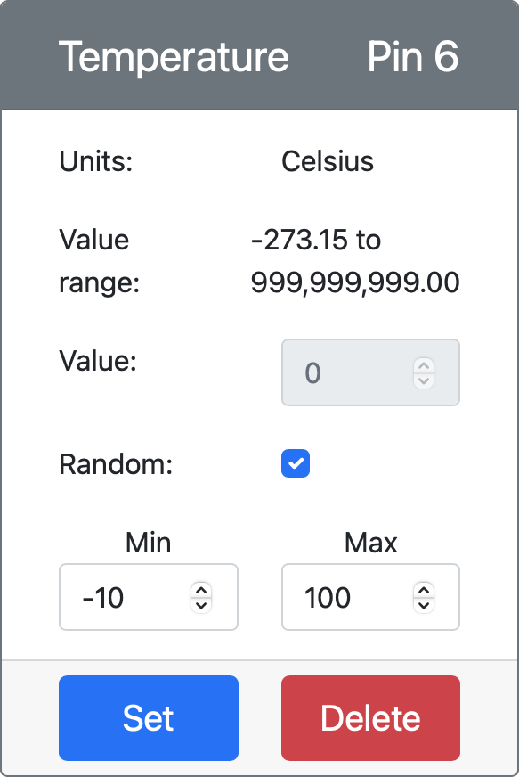

<!--
CO_OP_TRANSLATOR_METADATA:
{
  "original_hash": "d105b44deae539165855c976dcdeca99",
  "translation_date": "2025-08-25T16:43:34+00:00",
  "source_file": "2-farm/lessons/1-predict-plant-growth/README.md",
  "language_code": "hi"
}
-->
## पौधों की वृद्धि की भविष्यवाणी IoT के साथ


> स्केच नोट [नित्या नरसिम्हन](https://github.com/nitya) द्वारा। बड़े संस्करण के लिए छवि पर क्लिक करें।

## व्याख्यान से पहले की प्रश्नोत्तरी

[व्याख्यान से पहले की प्रश्नोत्तरी](https://black-meadow-040d15503.1.azurestaticapps.net/quiz/9)

## परिचय

पौधों को बढ़ने के लिए कुछ चीजों की आवश्यकता होती है - पानी, कार्बन डाइऑक्साइड, पोषक तत्व, प्रकाश और गर्मी। इस पाठ में, आप वायु तापमान को मापकर पौधों की वृद्धि और परिपक्वता दर की गणना करना सीखेंगे।

इस पाठ में हम निम्नलिखित विषयों को कवर करेंगे:

* [डिजिटल कृषि](../../../../../2-farm/lessons/1-predict-plant-growth)
* [खेती में तापमान क्यों महत्वपूर्ण है?](../../../../../2-farm/lessons/1-predict-plant-growth)
* [परिवेश तापमान मापें](../../../../../2-farm/lessons/1-predict-plant-growth)
* [ग्रोइंग डिग्री डेज़ (GDD)](../../../../../2-farm/lessons/1-predict-plant-growth)
* [तापमान सेंसर डेटा का उपयोग करके GDD की गणना करें](../../../../../2-farm/lessons/1-predict-plant-growth)

## डिजिटल कृषि

डिजिटल कृषि खेती के तरीके को बदल रही है, जिसमें खेती से डेटा एकत्र करने, संग्रहीत करने और उसका विश्लेषण करने के लिए उपकरणों का उपयोग किया जाता है। वर्तमान में हम एक ऐसे युग में हैं जिसे वर्ल्ड इकोनॉमिक फोरम द्वारा 'चौथी औद्योगिक क्रांति' कहा गया है, और डिजिटल कृषि के उदय को 'चौथी कृषि क्रांति' या 'कृषि 4.0' के रूप में जाना जाता है।

> 🎓 डिजिटल कृषि शब्द में 'कृषि मूल्य श्रृंखला' भी शामिल है, यानी खेत से लेकर टेबल तक की पूरी यात्रा। इसमें खाद्य गुणवत्ता को ट्रैक करना, जब इसे शिप और प्रोसेस किया जाता है, गोदाम और ई-कॉमर्स सिस्टम, यहां तक कि ट्रैक्टर किराए पर लेने वाले ऐप्स भी शामिल हैं!

ये बदलाव किसानों को उपज बढ़ाने, कम उर्वरकों और कीटनाशकों का उपयोग करने और पानी का अधिक कुशलता से उपयोग करने की अनुमति देते हैं। हालांकि मुख्य रूप से अमीर देशों में उपयोग किया जाता है, सेंसर और अन्य उपकरण धीरे-धीरे सस्ते हो रहे हैं, जिससे वे विकासशील देशों में अधिक सुलभ हो रहे हैं।

डिजिटल कृषि द्वारा सक्षम कुछ तकनीकें हैं:

* तापमान मापन - तापमान मापने से किसानों को पौधों की वृद्धि और परिपक्वता की भविष्यवाणी करने में मदद मिलती है।
* स्वचालित सिंचाई - मिट्टी की नमी को मापना और जब मिट्टी बहुत सूखी हो तो सिंचाई प्रणाली को चालू करना, समयबद्ध सिंचाई के बजाय। समयबद्ध सिंचाई गर्म, शुष्क मौसम के दौरान फसलों को कम पानी देने या बारिश के दौरान अधिक पानी देने का कारण बन सकती है। केवल तभी पानी देकर जब मिट्टी को इसकी आवश्यकता हो, किसान अपने पानी के उपयोग को अनुकूलित कर सकते हैं।
* कीट नियंत्रण - किसान स्वचालित रोबोट या ड्रोन पर कैमरों का उपयोग करके कीटों की जांच कर सकते हैं, फिर केवल आवश्यक स्थानों पर कीटनाशकों का उपयोग कर सकते हैं, जिससे कीटनाशकों के उपयोग और स्थानीय जल आपूर्ति में कीटनाशक के बहाव को कम किया जा सकता है।

✅ कुछ शोध करें। खेती की उपज बढ़ाने के लिए और कौन-कौन सी तकनीकों का उपयोग किया जाता है?

> 🎓 'सटीक कृषि' शब्द का उपयोग प्रति-क्षेत्र या यहां तक कि क्षेत्र के हिस्सों के आधार पर फसलों का अवलोकन, मापन और प्रतिक्रिया देने को परिभाषित करने के लिए किया जाता है। इसमें पानी, पोषक तत्व और कीट स्तरों को मापना और सटीक प्रतिक्रिया देना शामिल है, जैसे कि केवल क्षेत्र के एक छोटे हिस्से को पानी देना।

## खेती में तापमान क्यों महत्वपूर्ण है?

पौधों के बारे में सीखते समय, अधिकांश छात्रों को पानी, प्रकाश, कार्बन डाइऑक्साइड और पोषक तत्वों की आवश्यकता के बारे में सिखाया जाता है। पौधों को बढ़ने के लिए गर्मी की भी आवश्यकता होती है - यही कारण है कि वसंत में तापमान बढ़ने पर पौधे खिलते हैं, क्यों बर्फ के फूल या डैफोडिल्स एक छोटे गर्म मौसम के कारण जल्दी अंकुरित हो सकते हैं, और क्यों हॉटहाउस और ग्रीनहाउस पौधों को बढ़ने में मदद करते हैं।

> 🎓 हॉटहाउस और ग्रीनहाउस एक समान काम करते हैं, लेकिन एक महत्वपूर्ण अंतर के साथ। हॉटहाउस कृत्रिम रूप से गर्म किए जाते हैं और किसानों को तापमान को अधिक सटीक रूप से नियंत्रित करने की अनुमति देते हैं, जबकि ग्रीनहाउस सूर्य पर निर्भर करते हैं और आमतौर पर केवल खिड़कियों या अन्य उद्घाटनों के माध्यम से गर्मी को बाहर निकालने का नियंत्रण होता है।

पौधों का एक आधार या न्यूनतम तापमान, इष्टतम तापमान और अधिकतम तापमान होता है, जो सभी दैनिक औसत तापमान पर आधारित होते हैं।

* **आधार तापमान** - यह पौधे के बढ़ने के लिए आवश्यक न्यूनतम दैनिक औसत तापमान है।
* **इष्टतम तापमान** - यह सबसे अच्छा दैनिक औसत तापमान है जिससे सबसे अधिक वृद्धि होती है।
* **अधिकतम तापमान** - यह वह अधिकतम तापमान है जिसे पौधा सहन कर सकता है। इसके ऊपर पौधा पानी बचाने और जीवित रहने के प्रयास में अपनी वृद्धि को रोक देगा।

> 💁 ये औसत तापमान हैं, जो दिन और रात के तापमान का औसत हैं। पौधों को दिन और रात में अलग-अलग तापमान की भी आवश्यकता होती है ताकि वे अधिक कुशलता से प्रकाश संश्लेषण कर सकें और रात में ऊर्जा बचा सकें।

प्रत्येक पौधे की प्रजाति के लिए उनके आधार, इष्टतम और अधिकतम तापमान के लिए अलग-अलग मान होते हैं। यही कारण है कि कुछ पौधे गर्म देशों में पनपते हैं, और अन्य ठंडे देशों में।

✅ कुछ शोध करें। अपने बगीचे, स्कूल, या स्थानीय पार्क में किसी भी पौधे के लिए देखें कि क्या आप उनके आधार तापमान का पता लगा सकते हैं।


ऊपर दिया गया ग्राफ तापमान के अनुसार वृद्धि दर का एक उदाहरण दिखाता है। आधार तापमान तक कोई वृद्धि नहीं होती। वृद्धि दर इष्टतम तापमान तक बढ़ती है, फिर इस शिखर तक पहुंचने के बाद गिर जाती है। 

इस ग्राफ का आकार पौधे की प्रजातियों के अनुसार भिन्न होता है। कुछ में इष्टतम के ऊपर तेज गिरावट होती है, कुछ में आधार से इष्टतम तक धीमी वृद्धि होती है।

> 💁 एक किसान को सबसे अच्छी वृद्धि प्राप्त करने के लिए, उन्हें तीन तापमान मानों को जानने और उनके द्वारा उगाए जा रहे पौधों के लिए ग्राफ के आकार को समझने की आवश्यकता होगी।

यदि किसान के पास तापमान का नियंत्रण है, उदाहरण के लिए एक व्यावसायिक हॉटहाउस में, तो वे अपने पौधों के लिए इसे अनुकूलित कर सकते हैं। उदाहरण के लिए, टमाटर उगाने वाला एक व्यावसायिक हॉटहाउस दिन के दौरान तापमान को लगभग 25°C और रात में 20°C पर सेट करेगा ताकि सबसे तेज़ वृद्धि हो सके।

> 🍅 इन तापमानों को कृत्रिम रोशनी, उर्वरकों और नियंत्रित CO
यह कोड CSV फाइल को खोलता है और फिर अंत में एक नई पंक्ति जोड़ता है। इस पंक्ति में वर्तमान तिथि और समय को एक मानव-पढ़ने योग्य प्रारूप में स्वरूपित किया गया है, उसके बाद IoT डिवाइस से प्राप्त तापमान है। डेटा को [ISO 8601 प्रारूप](https://wikipedia.org/wiki/ISO_8601) में टाइमज़ोन के साथ संग्रहीत किया जाता है, लेकिन माइक्रोसेकंड के बिना।

1. इस कोड को पहले की तरह ही चलाएं, यह सुनिश्चित करते हुए कि आपका IoT डिवाइस डेटा भेज रहा है। एक CSV फाइल जिसका नाम `temperature.csv` है, उसी फोल्डर में बनाई जाएगी। यदि आप इसे देखेंगे, तो आपको तिथि/समय और तापमान माप दिखाई देंगे:

    ```output
    date,temperature
    2021-04-19T17:21:36-07:00,25
    2021-04-19T17:31:36-07:00,24
    2021-04-19T17:41:36-07:00,25
    ```

1. डेटा कैप्चर करने के लिए इस कोड को कुछ समय तक चलाएं। आदर्श रूप से, आपको इसे पूरे दिन चलाना चाहिए ताकि GDD गणना के लिए पर्याप्त डेटा एकत्र किया जा सके।

    
> 💁 यदि आप वर्चुअल IoT डिवाइस का उपयोग कर रहे हैं, तो रैंडम चेकबॉक्स का चयन करें और एक रेंज सेट करें ताकि हर बार तापमान मान लौटने पर एक ही तापमान न मिले।
     

    > 💁 यदि आप इसे पूरे दिन चलाना चाहते हैं, तो आपको यह सुनिश्चित करना होगा कि जिस कंप्यूटर पर आपका सर्वर कोड चल रहा है, वह स्लीप मोड में न जाए। इसके लिए आप अपनी पावर सेटिंग्स बदल सकते हैं या [यह सिस्टम को सक्रिय रखने वाला पायथन स्क्रिप्ट](https://github.com/jaqsparow/keep-system-active) चला सकते हैं।
    
> 💁 आप इस कोड को [code-server/temperature-sensor-server](../../../../../2-farm/lessons/1-predict-plant-growth/code-server/temperature-sensor-server) फोल्डर में पा सकते हैं।

### कार्य - संग्रहीत डेटा का उपयोग करके GDD की गणना करें

एक बार जब सर्वर ने तापमान डेटा कैप्चर कर लिया, तो किसी पौधे के लिए GDD की गणना की जा सकती है।

इसे मैन्युअल रूप से करने के चरण:

1. पौधे के लिए बेस तापमान खोजें। उदाहरण के लिए, स्ट्रॉबेरी के लिए बेस तापमान 10°C है।

1. `temperature.csv` से दिन के लिए सबसे अधिक और सबसे कम तापमान खोजें।

1. पहले दिए गए GDD फॉर्मूले का उपयोग करके GDD की गणना करें।

उदाहरण के लिए, यदि दिन का सबसे अधिक तापमान 25°C है और सबसे कम 12°C:


* 25 + 12 = 37
* 37 / 2 = 18.5
* 18.5 - 10 = 8.5

इसलिए, स्ट्रॉबेरी ने **8.5** GDD प्राप्त किए। स्ट्रॉबेरी को फल देने के लिए लगभग 250 GDD की आवश्यकता होती है, इसलिए अभी इसमें समय लगेगा।

---

## 🚀 चुनौती

पौधों को बढ़ने के लिए केवल गर्मी की आवश्यकता नहीं होती। और किन चीजों की आवश्यकता होती है?

इनके लिए, पता करें कि क्या इन्हें मापने के लिए सेंसर उपलब्ध हैं। इन स्तरों को नियंत्रित करने के लिए एक्ट्यूएटर्स के बारे में क्या? आप पौधों की वृद्धि को अनुकूलित करने के लिए एक या अधिक IoT डिवाइस कैसे तैयार करेंगे?

## व्याख्यान के बाद का क्विज़

[व्याख्यान के बाद का क्विज़](https://black-meadow-040d15503.1.azurestaticapps.net/quiz/10)

## समीक्षा और स्व-अध्ययन

* [डिजिटल कृषि विकिपीडिया पेज](https://wikipedia.org/wiki/Digital_agriculture) पर डिजिटल कृषि के बारे में और पढ़ें। साथ ही [सटीक कृषि विकिपीडिया पेज](https://wikipedia.org/wiki/Precision_agriculture) पर सटीक कृषि के बारे में और जानें।
* पूर्ण ग्रोइंग डिग्री डेज़ (GDD) की गणना यहां दिए गए सरल फॉर्मूले से अधिक जटिल है। [ग्रोइंग डिग्री डे विकिपीडिया पेज](https://wikipedia.org/wiki/Growing_degree-day) पर अधिक जटिल समीकरण और बेसलाइन से नीचे के तापमान से निपटने के तरीके के बारे में पढ़ें।
* यदि हम खेती के लिए वही पुराने तरीके अपनाते रहे, तो भविष्य में भोजन की कमी हो सकती है। इस [भविष्य के हाई-टेक फार्म्स वीडियो](https://www.youtube.com/watch?v=KIEOuKD9KX8) में हाई-टेक खेती तकनीकों के बारे में जानें।

## असाइनमेंट

[Jupyter Notebook का उपयोग करके GDD डेटा को विज़ुअलाइज़ करें](assignment.md)

**अस्वीकरण**:  
यह दस्तावेज़ AI अनुवाद सेवा [Co-op Translator](https://github.com/Azure/co-op-translator) का उपयोग करके अनुवादित किया गया है। जबकि हम सटीकता सुनिश्चित करने का प्रयास करते हैं, कृपया ध्यान दें कि स्वचालित अनुवाद में त्रुटियां या अशुद्धियां हो सकती हैं। मूल भाषा में उपलब्ध मूल दस्तावेज़ को आधिकारिक स्रोत माना जाना चाहिए। महत्वपूर्ण जानकारी के लिए, पेशेवर मानव अनुवाद की सिफारिश की जाती है। इस अनुवाद के उपयोग से उत्पन्न किसी भी गलतफहमी या गलत व्याख्या के लिए हम जिम्मेदार नहीं हैं।