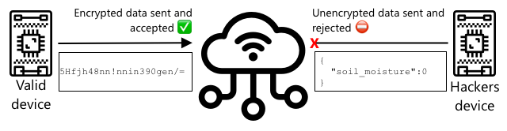

<!--
CO_OP_TRANSLATOR_METADATA:
{
  "original_hash": "81c437c568eee1b0dda1f04e88150d37",
  "translation_date": "2025-08-25T17:08:58+00:00",
  "source_file": "2-farm/lessons/6-keep-your-plant-secure/README.md",
  "language_code": "hi"
}
-->
# अपने पौधे को सुरक्षित रखें


> स्केच नोट [नित्या नरसिम्हन](https://github.com/nitya) द्वारा। बड़े संस्करण के लिए छवि पर क्लिक करें।

## प्री-लेक्चर क्विज़

[प्री-लेक्चर क्विज़](https://black-meadow-040d15503.1.azurestaticapps.net/quiz/19)

## परिचय

पिछले कुछ पाठों में आपने एक मिट्टी निगरानी IoT डिवाइस बनाया और इसे क्लाउड से जोड़ा। लेकिन क्या होगा अगर किसी प्रतिद्वंद्वी किसान के लिए काम करने वाले हैकर्स ने आपके IoT डिवाइस का नियंत्रण अपने हाथ में ले लिया? क्या होगा अगर उन्होंने उच्च मिट्टी की नमी के रीडिंग भेजे ताकि आपके पौधों को कभी पानी न मिले, या आपके सिंचाई सिस्टम को हमेशा चालू रखा, जिससे आपके पौधे अधिक पानी से मर जाएं और आपको पानी के बिल में भारी नुकसान हो?

इस पाठ में आप IoT डिवाइस को सुरक्षित करने के बारे में जानेंगे। चूंकि यह इस प्रोजेक्ट का अंतिम पाठ है, आप यह भी सीखेंगे कि अपने क्लाउड संसाधनों को कैसे साफ करें, जिससे संभावित लागत कम हो सके।

इस पाठ में हम कवर करेंगे:

* [IoT डिवाइस को सुरक्षित क्यों करना आवश्यक है?](../../../../../2-farm/lessons/6-keep-your-plant-secure)
* [क्रिप्टोग्राफी](../../../../../2-farm/lessons/6-keep-your-plant-secure)
* [अपने IoT डिवाइस को सुरक्षित करें](../../../../../2-farm/lessons/6-keep-your-plant-secure)
* [एक X.509 प्रमाणपत्र बनाएं और उपयोग करें](../../../../../2-farm/lessons/6-keep-your-plant-secure)

> 🗑 यह इस प्रोजेक्ट का अंतिम पाठ है, इसलिए इस पाठ और असाइनमेंट को पूरा करने के बाद, अपने क्लाउड सेवाओं को साफ करना न भूलें। असाइनमेंट पूरा करने के लिए आपको सेवाओं की आवश्यकता होगी, इसलिए पहले इसे पूरा करना सुनिश्चित करें।
>
> यदि आवश्यक हो, तो निर्देशों के लिए [अपने प्रोजेक्ट को साफ करने की गाइड](../../../clean-up.md) देखें।

## IoT डिवाइस को सुरक्षित क्यों करना आवश्यक है?

IoT सुरक्षा का मतलब है यह सुनिश्चित करना कि केवल अपेक्षित डिवाइस ही आपके क्लाउड IoT सेवा से कनेक्ट हो सकें और टेलीमेट्री भेज सकें, और केवल आपकी क्लाउड सेवा ही आपके डिवाइस को कमांड भेज सके। IoT डेटा व्यक्तिगत भी हो सकता है, जिसमें चिकित्सा या निजी डेटा शामिल हो सकता है, इसलिए आपके पूरे एप्लिकेशन को इस डेटा के लीक होने से रोकने के लिए सुरक्षा पर विचार करना चाहिए।

यदि आपका IoT एप्लिकेशन सुरक्षित नहीं है, तो कई जोखिम हो सकते हैं:

* एक नकली डिवाइस गलत डेटा भेज सकता है, जिससे आपका एप्लिकेशन गलत तरीके से प्रतिक्रिया कर सकता है। उदाहरण के लिए, वे लगातार उच्च मिट्टी की नमी के रीडिंग भेज सकते हैं, जिससे आपका सिंचाई सिस्टम कभी चालू न हो और आपके पौधे पानी की कमी से मर जाएं।
* अनधिकृत उपयोगकर्ता IoT डिवाइस से डेटा पढ़ सकते हैं, जिसमें व्यक्तिगत या व्यवसायिक रूप से महत्वपूर्ण डेटा शामिल हो सकता है।
* हैकर्स डिवाइस को इस तरह से नियंत्रित करने के लिए कमांड भेज सकते हैं, जिससे डिवाइस या जुड़े हार्डवेयर को नुकसान हो सकता है।
* IoT डिवाइस से कनेक्ट करके, हैकर्स अतिरिक्त नेटवर्क तक पहुंच सकते हैं और निजी सिस्टम तक पहुंच प्राप्त कर सकते हैं।
* दुर्भावनापूर्ण उपयोगकर्ता व्यक्तिगत डेटा तक पहुंच सकते हैं और इसे ब्लैकमेल के लिए उपयोग कर सकते हैं।

ये वास्तविक दुनिया के परिदृश्य हैं और अक्सर होते रहते हैं। कुछ उदाहरण पहले के पाठों में दिए गए थे, लेकिन यहां कुछ और हैं:

* 2018 में, हैकर्स ने एक मछली टैंक थर्मोस्टेट पर खुले वाईफाई एक्सेस पॉइंट का उपयोग करके एक कैसीनो के नेटवर्क तक पहुंच प्राप्त की और डेटा चुरा लिया। [The Hacker News - Casino Gets Hacked Through Its Internet-Connected Fish Tank Thermometer](https://thehackernews.com/2018/04/iot-hacking-thermometer.html)
* 2016 में, मिराई बॉटनेट ने Dyn, एक इंटरनेट सेवा प्रदाता, के खिलाफ एक डिनायल ऑफ सर्विस अटैक लॉन्च किया, जिससे इंटरनेट के बड़े हिस्से ठप हो गए। इस बॉटनेट ने DVRs और कैमरों जैसे IoT डिवाइस का उपयोग किया, जो डिफ़ॉल्ट उपयोगकर्ता नाम और पासवर्ड का उपयोग करते थे। [The Guardian - DDoS attack that disrupted internet was largest of its kind in history, experts say](https://www.theguardian.com/technology/2016/oct/26/ddos-attack-dyn-mirai-botnet)
* Spiral Toys ने अपने CloudPets कनेक्टेड खिलौनों के उपयोगकर्ताओं का डेटाबेस इंटरनेट पर सार्वजनिक रूप से उपलब्ध रखा। [Troy Hunt - Data from connected CloudPets teddy bears leaked and ransomed, exposing kids' voice messages](https://www.troyhunt.com/data-from-connected-cloudpets-teddy-bears-leaked-and-ransomed-exposing-kids-voice-messages/).
* Strava ने धावकों को टैग किया और उनके रूट दिखाए, जिससे अजनबियों को यह पता चल सकता था कि आप कहां रहते हैं। [Kim Komndo - Fitness app could lead a stranger right to your home — change this setting](https://www.komando.com/security-privacy/strava-fitness-app-privacy/755349/).

✅ शोध करें: IoT हैक्स और IoT डेटा के उल्लंघनों के और उदाहरण खोजें, विशेष रूप से इंटरनेट से जुड़े टूथब्रश या वजन मापने वाले उपकरण जैसे व्यक्तिगत आइटम के साथ। सोचें कि इन हैक्स का पीड़ितों या ग्राहकों पर क्या प्रभाव हो सकता है।

> 💁 सुरक्षा एक विशाल विषय है, और यह पाठ केवल आपके डिवाइस को क्लाउड से कनेक्ट करने के कुछ बुनियादी पहलुओं को छुएगा। अन्य विषयों में डेटा परिवर्तनों की निगरानी, डिवाइस को सीधे हैक करना, या डिवाइस कॉन्फ़िगरेशन में बदलाव शामिल हैं, जो कवर नहीं किए जाएंगे। IoT हैकिंग एक बड़ा खतरा है, और [Azure Defender for IoT](https://azure.microsoft.com/services/azure-defender-for-iot/?WT.mc_id=academic-17441-jabenn) जैसे उपकरण विकसित किए गए हैं। ये उपकरण आपके कंप्यूटर पर मौजूद एंटी-वायरस और सुरक्षा उपकरणों के समान हैं, लेकिन छोटे, कम पावर वाले IoT डिवाइस के लिए डिज़ाइन किए गए हैं।

## क्रिप्टोग्राफी

जब कोई डिवाइस IoT सेवा से कनेक्ट होता है, तो यह खुद को पहचानने के लिए एक आईडी का उपयोग करता है। समस्या यह है कि इस आईडी को क्लोन किया जा सकता है - एक हैकर एक दुर्भावनापूर्ण डिवाइस सेट कर सकता है जो एक असली डिवाइस की तरह ही आईडी का उपयोग करता है लेकिन गलत डेटा भेजता है।


इस समस्या का समाधान यह है कि भेजे जा रहे डेटा को एक गुप्त प्रारूप में बदल दिया जाए, जिसे केवल डिवाइस और क्लाउड ही जानते हों। इस प्रक्रिया को *एन्क्रिप्शन* कहा जाता है, और डेटा को एन्क्रिप्ट करने के लिए उपयोग किए जाने वाले मान को *एन्क्रिप्शन कुंजी* कहा जाता है।



क्लाउड सेवा तब डेटा को एक पठनीय प्रारूप में बदल सकती है, जिसे *डिक्रिप्शन* कहा जाता है, और यह प्रक्रिया या तो उसी एन्क्रिप्शन कुंजी या एक *डिक्रिप्शन कुंजी* का उपयोग करके की जाती है। यदि एन्क्रिप्टेड संदेश को कुंजी द्वारा डिक्रिप्ट नहीं किया जा सकता है, तो डिवाइस हैक हो गया है और संदेश अस्वीकार कर दिया जाता है।

एन्क्रिप्शन और डिक्रिप्शन की तकनीक को *क्रिप्टोग्राफी* कहा जाता है।

### प्रारंभिक क्रिप्टोग्राफी

सबसे प्रारंभिक प्रकार की क्रिप्टोग्राफी प्रतिस्थापन सिफर थे, जो 3,500 साल पहले के हैं। प्रतिस्थापन सिफर में एक अक्षर को दूसरे अक्षर से बदलना शामिल होता है। उदाहरण के लिए, [सीज़र सिफर](https://wikipedia.org/wiki/Caesar_cipher) में वर्णमाला को एक परिभाषित मात्रा में स्थानांतरित करना शामिल है, और केवल एन्क्रिप्टेड संदेश के प्रेषक और इच्छित प्राप्तकर्ता को यह पता होता है कि कितने अक्षरों को स्थानांतरित करना है।

[विजनेयर सिफर](https://wikipedia.org/wiki/Vigenère_cipher) ने इसे और आगे बढ़ाया, जिसमें शब्दों का उपयोग करके टेक्स्ट को एन्क्रिप्ट किया गया, ताकि मूल टेक्स्ट में प्रत्येक अक्षर को अलग-अलग मात्रा में स्थानांतरित किया जा सके, बजाय हमेशा एक ही संख्या में स्थानांतरित करने के।

क्रिप्टोग्राफी का उपयोग विभिन्न उद्देश्यों के लिए किया गया, जैसे प्राचीन मेसोपोटामिया में एक कुम्हार के ग्लेज़ नुस्खे की रक्षा करना, भारत में गुप्त प्रेम पत्र लिखना, या प्राचीन मिस्र के जादुई मंत्रों को गुप्त रखना।

### आधुनिक क्रिप्टोग्राफी

आधुनिक क्रिप्टोग्राफी बहुत अधिक उन्नत है, जिससे इसे प्रारंभिक तरीकों की तुलना में तोड़ना कठिन हो गया है। आधुनिक क्रिप्टोग्राफी जटिल गणित का उपयोग करती है ताकि डेटा को एन्क्रिप्ट किया जा सके, जिसमें संभावित कुंजियों की इतनी बड़ी संख्या होती है कि बलपूर्वक हमले असंभव हो जाते हैं।

क्रिप्टोग्राफी का उपयोग सुरक्षित संचार के लिए कई अलग-अलग तरीकों से किया जाता है। यदि आप GitHub पर यह पृष्ठ पढ़ रहे हैं, तो आप देख सकते हैं कि वेबसाइट का पता *HTTPS* से शुरू होता है, जिसका अर्थ है कि आपके ब्राउज़र और GitHub के वेब सर्वर के बीच का संचार एन्क्रिप्टेड है। यदि कोई आपके ब्राउज़र और GitHub के बीच बहने वाले इंटरनेट ट्रैफिक को पढ़ने में सक्षम हो, तो वे डेटा को नहीं पढ़ पाएंगे क्योंकि यह एन्क्रिप्टेड है। आपका कंप्यूटर यहां तक कि आपकी हार्ड ड्राइव पर सभी डेटा को एन्क्रिप्ट कर सकता है ताकि यदि कोई इसे चुरा ले, तो वे आपके डेटा को आपके पासवर्ड के बिना नहीं पढ़ सकें।

> 🎓 HTTPS का मतलब है HyperText Transfer Protocol **Secure**

दुर्भाग्य से, सब कुछ सुरक्षित नहीं है। कुछ डिवाइसों में कोई सुरक्षा नहीं होती, अन्य को आसानी से तोड़ी जा सकने वाली कुंजियों के साथ सुरक्षित किया जाता है, या कभी-कभी एक ही प्रकार के सभी डिवाइस एक ही कुंजी का उपयोग करते हैं। बहुत ही व्यक्तिगत IoT डिवाइसों के ऐसे मामले सामने आए हैं, जिनमें वाईफाई या ब्लूटूथ के माध्यम से कनेक्ट करने के लिए सभी का पासवर्ड एक जैसा होता है। यदि आप अपने डिवाइस से कनेक्ट कर सकते हैं, तो आप किसी और के डिवाइस से भी कनेक्ट कर सकते हैं। एक बार कनेक्ट होने के बाद, आप कुछ बहुत ही निजी डेटा तक पहुंच सकते हैं, या उनके डिवाइस को नियंत्रित कर सकते हैं।

> 💁 आधुनिक क्रिप्टोग्राफी की जटिलताओं और इस दावे के बावजूद कि एन्क्रिप्शन को तोड़ने में अरबों साल लग सकते हैं, क्वांटम कंप्यूटिंग के उदय ने ज्ञात सभी एन्क्रिप्शन को बहुत कम समय में तोड़ने की संभावना को जन्म दिया है!

### सममित और असममित कुंजियाँ

एन्क्रिप्शन दो प्रकार का होता है - सममित और असममित।

**सममित** एन्क्रिप्शन डेटा को एन्क्रिप्ट और डिक्रिप्ट करने के लिए एक ही कुंजी का उपयोग करता है। प्रेषक और प्राप्तकर्ता दोनों को एक ही कुंजी जाननी होती है। यह कम सुरक्षित प्रकार है, क्योंकि कुंजी को किसी न किसी तरह से साझा करना पड़ता है। प्रेषक को प्राप्तकर्ता को एन्क्रिप्टेड संदेश भेजने के लिए पहले कुंजी भेजनी पड़ सकती है।


यदि कुंजी को ट्रांजिट में चुरा लिया जाता है, या प्रेषक या प्राप्तकर्ता हैक हो जाते हैं और कुंजी मिल जाती है, तो एन्क्रिप्शन को तोड़ा जा सकता है।


**असममित** एन्क्रिप्शन 2 कुंजियों का उपयोग करता है - एक एन्क्रिप्शन कुंजी और एक डिक्रिप्शन कुंजी, जिन्हें सार्वजनिक/निजी कुंजी जोड़ी कहा जाता है। सार्वजनिक कुंजी का उपयोग संदेश को एन्क्रिप्ट करने के लिए किया जाता है, लेकिन इसे डिक्रिप्ट करने के लिए उपयोग नहीं किया जा सकता, निजी कुंजी का उपयोग संदेश को डिक्रिप्ट करने के लिए किया जाता है लेकिन इसे एन्क्रिप्ट करने के लिए उपयोग नहीं किया जा सकता।


प्राप्तकर्ता अपनी सार्वजनिक कुंजी साझा करता है, और प्रेषक इसका उपयोग संदेश को एन्क्रिप्ट करने के लिए करता है। एक बार संदेश भेजे जाने के बाद, प्राप्तकर्ता इसे अपनी निजी कुंजी से डिक्रिप्ट करता है। असममित एन्क्रिप्शन अधिक सुरक्षित है क्योंकि निजी कुंजी को प्राप्तकर्ता द्वारा निजी रखा जाता है और कभी साझा नहीं किया जाता। सार्वजनिक कुंजी को कोई भी प्राप्त कर सकता है क्योंकि इसका उपयोग केवल संदेशों को एन्क्रिप्ट करने के लिए किया जा सकता है।

सममित एन्क्रिप्शन असममित एन्क्रिप्शन की तुलना में तेज़ है, लेकिन असममित अधिक सुरक्षित है। कुछ सिस्टम दोनों का उपयोग करते हैं - सममित कुंजी को एन्क्रिप्ट और साझा करने के लिए असममित एन्क्रिप्शन का उपयोग करते हैं, और फिर सभी डेटा को एन्क्रिप्ट करने के लिए सममित कुंजी का उपयोग करते हैं। यह प्रेषक और प्राप्तकर्ता के बीच सममित कुंजी को साझा करना अधिक सुरक्षित बनाता है, और डेटा को एन्क्रिप्ट और डिक्रिप्ट करते समय तेज़ बनाता है।

## अपने IoT डिवाइस को सुरक्षित करें

IoT डिवाइस को सममित या असममित एन्क्रिप्शन का उपयोग करके सुरक्षित किया जा सकता है। सममित आसान है, लेकिन कम सुरक्षित।

### सममित कुंजियाँ

जब आपने अपने IoT डिवाइस को IoT हब के साथ इंटरैक्ट करने के लिए सेट किया, तो आपने एक कनेक्शन स्ट्रिंग का उपयोग किया। एक उदाहरण कनेक्शन स्ट्रिंग है:

```output
HostName=soil-moisture-sensor.azure-devices.net;DeviceId=soil-moisture-sensor;SharedAccessKey=Bhry+ind7kKEIDxubK61RiEHHRTrPl7HUow8cEm/mU0=
```

यह कनेक्शन स्ट्रिंग तीन भागों से बनी होती है, जो सेमी-कोलन द्वारा अलग होती है, और प्रत्येक भाग एक कुंजी और एक मान होता है:

| कुंजी | मान | विवरण |
| --- | ----- | ----------- |
| HostName | `soil-moisture-sensor.azure-devices.net` | IoT हब का URL |
| DeviceId | `soil-moisture-sensor` | डिवाइस का अद्वितीय आईडी |
| SharedAccessKey | `Bhry+ind7kKEIDxubK61RiEHHRTrPl7HUow8cEm/mU0=` | एक सममित कुंजी जिसे डिवाइस और IoT हब दोनों जानते हैं |

इस कनेक्शन स्ट्रिंग का अंतिम भाग, `SharedAccessKey`, वह सममित कुंजी है जिसे डिवाइस और IoT हब दोनों जानते हैं। यह कुंजी कभी भी डिवाइस से क्लाउड या क्लाउड से डिवाइस तक नहीं भेजी जाती। इसके बजाय, इसका उपयोग भेजे गए या प्राप्त डेटा को एन्क्रिप्ट करने के लिए किया जाता है।

✅ एक प्रयोग करें। क्या होगा अगर आप अपने IoT डिवाइस को कनेक्ट करते समय कनेक्शन स्ट्रिंग के `SharedAccessKey` भाग को बदल दें? इसे आज़माएं।

जब डिवाइस पहली बार कनेक्ट करने की कोशिश करता है, तो यह एक साझा एक्सेस सिग्नेचर (SAS) टोकन भेजता है, जिसमें IoT हब का URL, एक समय सीमा जब एक्सेस सिग्नेचर समाप्त होगा (आमतौर पर वर्तमान समय से 1 दिन), और एक सिग्नेचर शामिल होता है। यह सिग्नेचर URL और समाप्ति समय को कनेक्शन स्ट्रिंग से साझा एक्सेस कुंजी के साथ एन्क्रिप्ट करके बनता है।

IoT हब इस सिग्नेचर को साझा एक्सेस कुंजी के साथ डिक्रिप्ट करता है, और यदि डिक्रिप्टेड मान URL और समाप्ति से मेल खाता है, तो डिवाइस को कनेक्ट करने की अनुमति दी जाती है। यह यह भी सत्यापित करता है कि वर्तमान समय समाप्ति से पहले है, ताकि एक दुर्भावनापूर्ण डिवाइस किसी वास्तविक डिवाइस के SAS टोकन को कैप्चर करके उसका उपयोग न कर सके।

यह प्रेषक को सत्यापित करने का एक सुंदर तरीका है। कुछ ज्ञात डेटा को डिक्रिप
💁 आपके IoT डिवाइस को सटीक समय की जानकारी होनी चाहिए, जो आमतौर पर [NTP](https://wikipedia.org/wiki/Network_Time_Protocol) सर्वर से प्राप्त किया जाता है। यदि समय सटीक नहीं है, तो कनेक्शन विफल हो जाएगा।
कनेक्शन के बाद, डिवाइस से IoT हब या IoT हब से डिवाइस तक भेजे गए सभी डेटा को साझा एक्सेस कुंजी के साथ एन्क्रिप्ट किया जाएगा।

✅ क्या आप सोच सकते हैं कि अगर कई डिवाइस एक ही कनेक्शन स्ट्रिंग साझा करते हैं तो क्या होगा?

> 💁 कोड में इस कुंजी को स्टोर करना एक खराब सुरक्षा प्रथा है। यदि कोई हैकर आपके सोर्स कोड तक पहुंच जाता है, तो वह आपकी कुंजी प्राप्त कर सकता है। कोड रिलीज़ करते समय यह और भी मुश्किल हो जाता है क्योंकि हर डिवाइस के लिए अपडेटेड कुंजी के साथ कोड को फिर से कंपाइल करना पड़ता है। बेहतर यह है कि इस कुंजी को हार्डवेयर सुरक्षा मॉड्यूल से लोड किया जाए - IoT डिवाइस पर एक चिप जो एन्क्रिप्टेड मानों को स्टोर करती है और जिसे आपका कोड पढ़ सकता है।
>
> IoT सीखते समय, जैसा आपने पहले के पाठ में किया था, कोड में कुंजी डालना अक्सर आसान होता है, लेकिन आपको यह सुनिश्चित करना चाहिए कि यह कुंजी सार्वजनिक सोर्स कोड कंट्रोल में चेक इन न हो।

डिवाइस के पास 2 कुंजियां और 2 संबंधित कनेक्शन स्ट्रिंग होती हैं। यह आपको कुंजियों को घुमाने की अनुमति देता है - यानी यदि पहली कुंजी से समझौता हो जाता है, तो आप दूसरी कुंजी पर स्विच कर सकते हैं और पहली कुंजी को फिर से जनरेट कर सकते हैं।

### X.509 प्रमाणपत्र

जब आप सार्वजनिक/निजी कुंजी जोड़ी के साथ असममित एन्क्रिप्शन का उपयोग कर रहे होते हैं, तो आपको अपना सार्वजनिक कुंजी उन सभी को प्रदान करनी होती है जो आपको डेटा भेजना चाहते हैं। समस्या यह है कि आपके कुंजी प्राप्तकर्ता को कैसे यकीन हो सकता है कि यह वास्तव में आपकी सार्वजनिक कुंजी है, न कि कोई और जो आपकी जगह होने का नाटक कर रहा है? कुंजी प्रदान करने के बजाय, आप इसके बजाय अपनी सार्वजनिक कुंजी को एक प्रमाणपत्र के अंदर प्रदान कर सकते हैं जिसे एक विश्वसनीय तृतीय पक्ष द्वारा सत्यापित किया गया है, जिसे X.509 प्रमाणपत्र कहा जाता है।

X.509 प्रमाणपत्र डिजिटल दस्तावेज़ होते हैं जिनमें सार्वजनिक/निजी कुंजी जोड़ी का सार्वजनिक कुंजी भाग होता है। इन्हें आमतौर पर [प्रमाणन प्राधिकरणों](https://wikipedia.org/wiki/Certificate_authority) (CAs) नामक विश्वसनीय संगठनों में से एक द्वारा जारी किया जाता है और CA द्वारा डिजिटल रूप से हस्ताक्षरित किया जाता है ताकि यह संकेत दिया जा सके कि कुंजी मान्य है और आपसे आई है। आप प्रमाणपत्र पर भरोसा करते हैं और यह कि सार्वजनिक कुंजी उसी से है जो प्रमाणपत्र कहता है, क्योंकि आप CA पर भरोसा करते हैं, जैसे आप पासपोर्ट या ड्राइविंग लाइसेंस पर भरोसा करते हैं क्योंकि आप इसे जारी करने वाले देश पर भरोसा करते हैं। प्रमाणपत्रों की लागत होती है, इसलिए आप 'स्वयं-हस्ताक्षरित' भी कर सकते हैं, यानी परीक्षण उद्देश्यों के लिए स्वयं द्वारा हस्ताक्षरित एक प्रमाणपत्र बना सकते हैं।

> 💁 आपको कभी भी उत्पादन रिलीज़ के लिए स्वयं-हस्ताक्षरित प्रमाणपत्र का उपयोग नहीं करना चाहिए।

इन प्रमाणपत्रों में कई फ़ील्ड होती हैं, जिनमें सार्वजनिक कुंजी किसकी है, इसे जारी करने वाले CA का विवरण, यह कितने समय तक मान्य है, और स्वयं सार्वजनिक कुंजी शामिल है। किसी प्रमाणपत्र का उपयोग करने से पहले, इसे सत्यापित करना एक अच्छा अभ्यास है, यह जांचकर कि इसे मूल CA द्वारा हस्ताक्षरित किया गया था।

✅ आप प्रमाणपत्र में फ़ील्ड की पूरी सूची [Microsoft Understanding X.509 Public Key Certificates tutorial](https://docs.microsoft.com/azure/iot-hub/tutorial-x509-certificates?WT.mc_id=academic-17441-jabenn#certificate-fields) में पढ़ सकते हैं।

जब X.509 प्रमाणपत्रों का उपयोग किया जाता है, तो प्रेषक और प्राप्तकर्ता दोनों के पास अपनी सार्वजनिक और निजी कुंजियां होती हैं, साथ ही दोनों के पास X.509 प्रमाणपत्र होते हैं जिनमें सार्वजनिक कुंजी होती है। वे फिर किसी तरह X.509 प्रमाणपत्रों का आदान-प्रदान करते हैं, एक-दूसरे की सार्वजनिक कुंजियों का उपयोग करके डेटा को एन्क्रिप्ट करते हैं जो वे भेजते हैं, और अपनी निजी कुंजी का उपयोग करके डेटा को डिक्रिप्ट करते हैं जो वे प्राप्त करते हैं।


X.509 प्रमाणपत्रों का उपयोग करने का एक बड़ा लाभ यह है कि इन्हें डिवाइसों के बीच साझा किया जा सकता है। आप एक प्रमाणपत्र बना सकते हैं, इसे IoT हब पर अपलोड कर सकते हैं, और इसे अपने सभी डिवाइसों के लिए उपयोग कर सकते हैं। प्रत्येक डिवाइस को केवल निजी कुंजी जानने की आवश्यकता होती है ताकि वह IoT हब से प्राप्त संदेशों को डिक्रिप्ट कर सके।

आपके डिवाइस द्वारा IoT हब को भेजे गए संदेशों को एन्क्रिप्ट करने के लिए उपयोग किया जाने वाला प्रमाणपत्र Microsoft द्वारा प्रकाशित किया गया है। यह वही प्रमाणपत्र है जिसे Azure की कई सेवाएं उपयोग करती हैं, और यह कभी-कभी SDKs में निर्मित होता है।

> 💁 याद रखें, सार्वजनिक कुंजी केवल सार्वजनिक होती है। Azure सार्वजनिक कुंजी का उपयोग केवल Azure को भेजे गए डेटा को एन्क्रिप्ट करने के लिए किया जा सकता है, इसे डिक्रिप्ट करने के लिए नहीं, इसलिए इसे हर जगह साझा किया जा सकता है, जिसमें सोर्स कोड भी शामिल है। उदाहरण के लिए, आप इसे [Azure IoT C SDK सोर्स कोड](https://github.com/Azure/azure-iot-sdk-c/blob/master/certs/certs.c) में देख सकते हैं।

✅ X.509 प्रमाणपत्रों के साथ बहुत सारा तकनीकी शब्दजाल होता है। आप [The layman’s guide to X.509 certificate jargon](https://techcommunity.microsoft.com/t5/internet-of-things/the-layman-s-guide-to-x-509-certificate-jargon/ba-p/2203540?WT.mc_id=academic-17441-jabenn) में उन शब्दों की परिभाषाएं पढ़ सकते हैं जिनसे आप सामना कर सकते हैं।

## X.509 प्रमाणपत्र बनाएं और उपयोग करें

X.509 प्रमाणपत्र बनाने के चरण:

1. सार्वजनिक/निजी कुंजी जोड़ी बनाएं। सार्वजनिक/निजी कुंजी जोड़ी बनाने के लिए सबसे व्यापक रूप से उपयोग किए जाने वाले एल्गोरिदम में से एक [Rivest–Shamir–Adleman](https://wikipedia.org/wiki/RSA_(cryptosystem))(RSA) कहलाता है।

1. सार्वजनिक कुंजी को संबद्ध डेटा के साथ हस्ताक्षर के लिए सबमिट करें, या तो CA द्वारा या स्वयं-हस्ताक्षरित करके।

Azure CLI में IoT हब में एक नया डिवाइस पहचान बनाने और सार्वजनिक/निजी कुंजी जोड़ी को स्वचालित रूप से जनरेट करने और एक स्वयं-हस्ताक्षरित प्रमाणपत्र बनाने के लिए कमांड होते हैं।

> 💁 यदि आप Azure CLI का उपयोग करने के बजाय चरणों को विस्तार से देखना चाहते हैं, तो आप इसे [Microsoft IoT Hub दस्तावेज़ में OpenSSL का उपयोग करके स्वयं-हस्ताक्षरित प्रमाणपत्र बनाने की ट्यूटोरियल](https://docs.microsoft.com/azure/iot-hub/tutorial-x509-self-sign?WT.mc_id=academic-17441-jabenn) में पा सकते हैं।

### कार्य - X.509 प्रमाणपत्र का उपयोग करके डिवाइस पहचान बनाएं

1. निम्नलिखित कमांड चलाएं ताकि नई डिवाइस पहचान को पंजीकृत किया जा सके, कुंजियों और प्रमाणपत्रों को स्वचालित रूप से जनरेट किया जा सके:

    ```sh
    az iot hub device-identity create --device-id soil-moisture-sensor-x509 \
                                      --am x509_thumbprint \
                                      --output-dir . \
                                      --hub-name <hub_name>
    ```

    `<hub_name>` को अपने IoT हब के लिए उपयोग किए गए नाम से बदलें।

    यह `soil-moisture-sensor-x509` नामक एक डिवाइस बनाएगा ताकि इसे पिछले पाठ में बनाई गई डिवाइस पहचान से अलग किया जा सके। यह कमांड वर्तमान निर्देशिका में 2 फाइलें भी बनाएगा:

    * `soil-moisture-sensor-x509-key.pem` - यह फाइल डिवाइस के लिए निजी कुंजी को रखती है।
    * `soil-moisture-sensor-x509-cert.pem` - यह डिवाइस के लिए X.509 प्रमाणपत्र फाइल है।

    इन फाइलों को सुरक्षित रखें! निजी कुंजी फाइल को सार्वजनिक सोर्स कोड कंट्रोल में चेक इन नहीं किया जाना चाहिए।

### कार्य - अपने डिवाइस कोड में X.509 प्रमाणपत्र का उपयोग करें

अपने IoT डिवाइस को X.509 प्रमाणपत्र का उपयोग करके क्लाउड से कनेक्ट करने के लिए संबंधित गाइड का पालन करें:

* [Arduino - Wio Terminal](wio-terminal-x509.md)
* [सिंगल-बोर्ड कंप्यूटर - Raspberry Pi/Virtual IoT डिवाइस](single-board-computer-x509.md)

---

## 🚀 चुनौती

Azure सेवाओं जैसे Resource Groups और IoT Hubs को बनाने, प्रबंधित करने और हटाने के कई तरीके हैं। एक तरीका [Azure Portal](https://portal.azure.com?WT.mc_id=academic-17441-jabenn) है - एक वेब-आधारित इंटरफ़ेस जो आपको अपने Azure सेवाओं को प्रबंधित करने के लिए GUI प्रदान करता है।

[portal.azure.com](https://portal.azure.com?WT.mc_id=academic-17441-jabenn) पर जाएं और पोर्टल की जांच करें। देखें कि क्या आप पोर्टल का उपयोग करके एक IoT हब बना सकते हैं, फिर इसे हटा सकते हैं।

**संकेत** - जब आप पोर्टल के माध्यम से सेवाएं बना रहे होते हैं, तो आपको पहले से Resource Group बनाने की आवश्यकता नहीं होती है, इसे सेवा बनाते समय बनाया जा सकता है। सुनिश्चित करें कि जब आप समाप्त कर लें तो इसे हटा दें!

आप [Azure पोर्टल दस्तावेज़](https://docs.microsoft.com/azure/azure-portal/?WT.mc_id=academic-17441-jabenn) में Azure पोर्टल पर बहुत सारे दस्तावेज़, ट्यूटोरियल और गाइड पा सकते हैं।

## व्याख्यान के बाद क्विज़

[व्याख्यान के बाद क्विज़](https://black-meadow-040d15503.1.azurestaticapps.net/quiz/20)

## समीक्षा और स्व-अध्ययन

* [क्रिप्टोग्राफी का इतिहास](https://wikipedia.org/wiki/History_of_cryptography) पेज पर क्रिप्टोग्राफी के इतिहास के बारे में पढ़ें।
* [X.509](https://wikipedia.org/wiki/X.509) पेज पर X.509 प्रमाणपत्रों के बारे में पढ़ें।

## असाइनमेंट

[एक नया IoT डिवाइस बनाएं](assignment.md)

**अस्वीकरण**:  
यह दस्तावेज़ AI अनुवाद सेवा [Co-op Translator](https://github.com/Azure/co-op-translator) का उपयोग करके अनुवादित किया गया है। जबकि हम सटीकता सुनिश्चित करने का प्रयास करते हैं, कृपया ध्यान दें कि स्वचालित अनुवाद में त्रुटियां या अशुद्धियां हो सकती हैं। मूल दस्तावेज़, जो इसकी मूल भाषा में है, को आधिकारिक स्रोत माना जाना चाहिए। महत्वपूर्ण जानकारी के लिए, पेशेवर मानव अनुवाद की सिफारिश की जाती है। इस अनुवाद के उपयोग से उत्पन्न किसी भी गलतफहमी या गलत व्याख्या के लिए हम उत्तरदायी नहीं हैं।