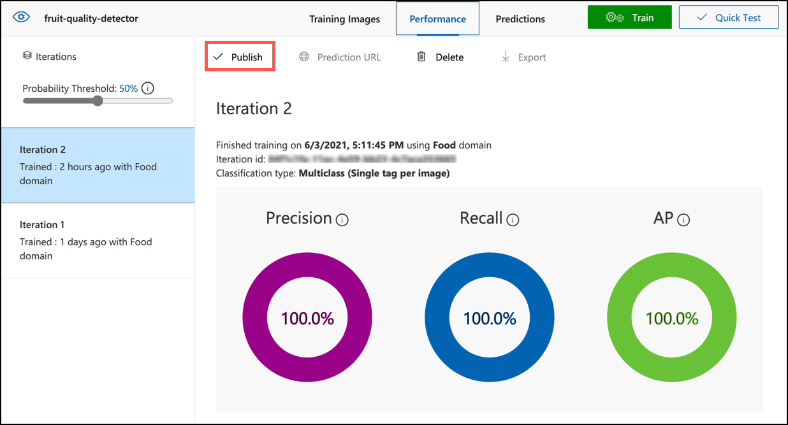

<!--
CO_OP_TRANSLATOR_METADATA:
{
  "original_hash": "557f4ee96b752e0651d2e6e74aa6bd14",
  "translation_date": "2025-08-25T16:28:46+00:00",
  "source_file": "4-manufacturing/lessons/2-check-fruit-from-device/README.md",
  "language_code": "hi"
}
-->
# IoT डिवाइस से फलों की गुणवत्ता जांचें


> स्केच नोट [नित्या नरसिम्हन](https://github.com/nitya) द्वारा। बड़ी छवि देखने के लिए क्लिक करें।

## प्री-लेक्चर क्विज़

[प्री-लेक्चर क्विज़](https://black-meadow-040d15503.1.azurestaticapps.net/quiz/31)

## परिचय

पिछले पाठ में आपने इमेज क्लासिफायर के बारे में सीखा था और उन्हें अच्छे और खराब फलों का पता लगाने के लिए प्रशिक्षित करना सीखा था। इस इमेज क्लासिफायर को IoT एप्लिकेशन में उपयोग करने के लिए, आपको किसी प्रकार के कैमरे का उपयोग करके छवि कैप्चर करने और इसे क्लाउड में भेजने की आवश्यकता होगी ताकि इसे वर्गीकृत किया जा सके।

इस पाठ में आप कैमरा सेंसर के बारे में जानेंगे और IoT डिवाइस के साथ उनका उपयोग करके छवि कैप्चर करना सीखेंगे। आप यह भी सीखेंगे कि अपने IoT डिवाइस से इमेज क्लासिफायर को कैसे कॉल करें।

इस पाठ में हम निम्नलिखित विषयों को कवर करेंगे:

* [कैमरा सेंसर](../../../../../4-manufacturing/lessons/2-check-fruit-from-device)
* [IoT डिवाइस का उपयोग करके छवि कैप्चर करें](../../../../../4-manufacturing/lessons/2-check-fruit-from-device)
* [अपने इमेज क्लासिफायर को प्रकाशित करें](../../../../../4-manufacturing/lessons/2-check-fruit-from-device)
* [IoT डिवाइस से छवियों को वर्गीकृत करें](../../../../../4-manufacturing/lessons/2-check-fruit-from-device)
* [मॉडल में सुधार करें](../../../../../4-manufacturing/lessons/2-check-fruit-from-device)

## कैमरा सेंसर

कैमरा सेंसर, जैसा कि नाम से पता चलता है, ऐसे कैमरे हैं जिन्हें आप अपने IoT डिवाइस से कनेक्ट कर सकते हैं। ये स्थिर छवियां ले सकते हैं या स्ट्रीमिंग वीडियो कैप्चर कर सकते हैं। कुछ कच्चे इमेज डेटा लौटाते हैं, जबकि अन्य इमेज डेटा को JPEG या PNG जैसे इमेज फाइल में संपीड़ित करते हैं। आमतौर पर IoT डिवाइस के साथ काम करने वाले कैमरे छोटे और कम रिज़ॉल्यूशन वाले होते हैं, लेकिन आप उच्च रिज़ॉल्यूशन वाले कैमरे प्राप्त कर सकते हैं जो उच्च गुणवत्ता वाले फोन के बराबर होते हैं। आप विभिन्न प्रकार के इंटरचेंजेबल लेंस, मल्टीपल कैमरा सेटअप, इंफ्रारेड थर्मल कैमरे, या UV कैमरे प्राप्त कर सकते हैं।


अधिकांश कैमरा सेंसर इमेज सेंसर का उपयोग करते हैं जहां प्रत्येक पिक्सेल एक फोटो डायोड होता है। एक लेंस छवि को इमेज सेंसर पर केंद्रित करता है, और हजारों या लाखों फोटो डायोड प्रत्येक पर पड़ने वाले प्रकाश का पता लगाते हैं और इसे पिक्सेल डेटा के रूप में रिकॉर्ड करते हैं।

> 💁 लेंस छवियों को उल्टा कर देते हैं, कैमरा सेंसर फिर छवि को सही दिशा में पलट देता है। आपके आंखों में भी यही होता है - जो आप देखते हैं वह आपकी आंख के पीछे उल्टा होता है और आपका मस्तिष्क इसे सही करता है।

> 🎓 इमेज सेंसर को एक्टिव-पिक्सेल सेंसर (APS) के रूप में जाना जाता है, और APS का सबसे लोकप्रिय प्रकार एक कॉम्प्लिमेंटरी मेटल-ऑक्साइड सेमीकंडक्टर सेंसर, या CMOS है। आपने कैमरा सेंसर के लिए CMOS सेंसर शब्द सुना होगा।

कैमरा सेंसर डिजिटल सेंसर होते हैं, जो इमेज डेटा को डिजिटल डेटा के रूप में भेजते हैं, आमतौर पर एक लाइब्रेरी की मदद से जो संचार प्रदान करती है। कैमरे SPI जैसे प्रोटोकॉल का उपयोग करके कनेक्ट होते हैं ताकि वे बड़ी मात्रा में डेटा भेज सकें - छवियां तापमान सेंसर जैसे सेंसर से एकल संख्या की तुलना में काफी बड़ी होती हैं।

✅ IoT डिवाइस के साथ इमेज साइज की सीमाओं के बारे में क्या प्रतिबंध हैं? विशेष रूप से माइक्रोकंट्रोलर हार्डवेयर पर प्रतिबंधों के बारे में सोचें।

## IoT डिवाइस का उपयोग करके छवि कैप्चर करें

आप अपने IoT डिवाइस का उपयोग करके एक छवि कैप्चर कर सकते हैं जिसे वर्गीकृत किया जाएगा।

### कार्य - IoT डिवाइस का उपयोग करके छवि कैप्चर करें

अपने IoT डिवाइस का उपयोग करके छवि कैप्चर करने के लिए संबंधित गाइड का पालन करें:

* [Arduino - Wio Terminal](wio-terminal-camera.md)
* [सिंगल-बोर्ड कंप्यूटर - Raspberry Pi](pi-camera.md)
* [सिंगल-बोर्ड कंप्यूटर - वर्चुअल डिवाइस](virtual-device-camera.md)

## अपने इमेज क्लासिफायर को प्रकाशित करें

आपने पिछले पाठ में अपने इमेज क्लासिफायर को प्रशिक्षित किया था। इसे अपने IoT डिवाइस से उपयोग करने से पहले, आपको मॉडल को प्रकाशित करना होगा।

### मॉडल पुनरावृत्तियां

जब आपका मॉडल पिछले पाठ में प्रशिक्षण ले रहा था, तो आपने देखा होगा कि **Performance** टैब साइड में पुनरावृत्तियां दिखाता है। जब आपने पहली बार मॉडल को प्रशिक्षित किया, तो आपने प्रशिक्षण में *Iteration 1* देखा होगा। जब आपने भविष्यवाणी छवियों का उपयोग करके मॉडल में सुधार किया, तो आपने प्रशिक्षण में *Iteration 2* देखा होगा।

हर बार जब आप मॉडल को प्रशिक्षित करते हैं, तो आपको एक नई पुनरावृत्ति मिलती है। यह विभिन्न डेटा सेट पर प्रशिक्षित आपके मॉडल के विभिन्न संस्करणों को ट्रैक करने का एक तरीका है। जब आप **Quick Test** करते हैं, तो एक ड्रॉप-डाउन होता है जिसे आप पुनरावृत्ति का चयन करने के लिए उपयोग कर सकते हैं, ताकि आप कई पुनरावृत्तियों में परिणामों की तुलना कर सकें।

जब आप किसी पुनरावृत्ति से संतुष्ट होते हैं, तो आप इसे बाहरी एप्लिकेशन से उपयोग के लिए उपलब्ध कराने के लिए प्रकाशित कर सकते हैं। इस तरह आप एक प्रकाशित संस्करण प्राप्त कर सकते हैं जिसे आपके डिवाइस द्वारा उपयोग किया जाता है, फिर एक नए संस्करण पर कई पुनरावृत्तियों में काम कर सकते हैं, फिर इसे प्रकाशित कर सकते हैं जब आप इससे संतुष्ट हों।

### कार्य - एक पुनरावृत्ति प्रकाशित करें

पुनरावृत्तियां कस्टम विजन पोर्टल से प्रकाशित की जाती हैं।

1. [CustomVision.ai](https://customvision.ai) पर कस्टम विजन पोर्टल लॉन्च करें और साइन इन करें यदि आपने इसे पहले से नहीं खोला है। फिर अपने `fruit-quality-detector` प्रोजेक्ट को खोलें।

1. शीर्ष पर विकल्पों से **Performance** टैब का चयन करें।

1. साइड में *Iterations* सूची से नवीनतम पुनरावृत्ति का चयन करें।

1. पुनरावृत्ति के लिए **Publish** बटन का चयन करें।

    

1. *Publish Model* डायलॉग में, *Prediction resource* को उस `fruit-quality-detector-prediction` संसाधन पर सेट करें जिसे आपने पिछले पाठ में बनाया था। नाम को `Iteration2` के रूप में छोड़ दें और **Publish** बटन का चयन करें।

1. प्रकाशित होने के बाद, **Prediction URL** बटन का चयन करें। यह भविष्यवाणी API का विवरण दिखाएगा, और आपको अपने IoT डिवाइस से मॉडल को कॉल करने के लिए इनकी आवश्यकता होगी। निचला भाग *If you have an image file* लेबल वाला है, और यही विवरण आपको चाहिए। दिखाए गए URL की एक प्रति लें जो कुछ इस तरह होगी:

    ```output
    https://<location>.api.cognitive.microsoft.com/customvision/v3.0/Prediction/<id>/classify/iterations/Iteration2/image
    ```

    जहां `<location>` वह स्थान होगा जिसे आपने अपना कस्टम विजन संसाधन बनाते समय उपयोग किया था, और `<id>` अक्षरों और संख्याओं से बना एक लंबा ID होगा।

    *Prediction-Key* मान की भी एक प्रति लें। यह एक सुरक्षित कुंजी है जिसे आपको मॉडल को कॉल करते समय पास करना होगा। केवल वे एप्लिकेशन जो इस कुंजी को पास करते हैं, मॉडल का उपयोग करने की अनुमति प्राप्त करते हैं, अन्य सभी एप्लिकेशन अस्वीकार कर दिए जाते हैं।

    

✅ जब एक नई पुनरावृत्ति प्रकाशित होती है, तो इसका नाम अलग होता है। आप कैसे सोचते हैं कि आप IoT डिवाइस द्वारा उपयोग की जा रही पुनरावृत्ति को बदलेंगे?

## IoT डिवाइस से छवियों को वर्गीकृत करें

अब आप इन कनेक्शन विवरणों का उपयोग करके अपने IoT डिवाइस से इमेज क्लासिफायर को कॉल कर सकते हैं।

### कार्य - IoT डिवाइस से छवियों को वर्गीकृत करें

अपने IoT डिवाइस का उपयोग करके छवियों को वर्गीकृत करने के लिए संबंधित गाइड का पालन करें:

* [Arduino - Wio Terminal](wio-terminal-classify-image.md)
* [सिंगल-बोर्ड कंप्यूटर - Raspberry Pi/Virtual IoT डिवाइस](single-board-computer-classify-image.md)

## मॉडल में सुधार करें

आप देख सकते हैं कि आपके IoT डिवाइस से जुड़े कैमरे का उपयोग करते समय प्राप्त परिणाम आपके अपेक्षित परिणामों से मेल नहीं खाते। भविष्यवाणियां हमेशा उतनी सटीक नहीं होती जितनी आपके कंप्यूटर से अपलोड की गई छवियों का उपयोग करते समय होती हैं। ऐसा इसलिए है क्योंकि मॉडल को अलग डेटा पर प्रशिक्षित किया गया था जो भविष्यवाणियों के लिए उपयोग किए जा रहे डेटा से अलग है।

एक इमेज क्लासिफायर के लिए सर्वोत्तम परिणाम प्राप्त करने के लिए, आप चाहते हैं कि मॉडल को उन छवियों के साथ प्रशिक्षित किया जाए जो भविष्यवाणियों के लिए उपयोग की जाने वाली छवियों के जितना संभव हो उतना समान हों। उदाहरण के लिए, यदि आपने प्रशिक्षण के लिए अपने फोन कैमरे का उपयोग करके छवियां कैप्चर की हैं, तो छवि गुणवत्ता, तीक्ष्णता, और रंग IoT डिवाइस से जुड़े कैमरे से अलग होंगे।


ऊपर दी गई छवि में, बाईं ओर का केला चित्र Raspberry Pi कैमरे का उपयोग करके लिया गया था, और दाईं ओर का चित्र उसी केले का उसी स्थान पर iPhone का उपयोग करके लिया गया था। गुणवत्ता में एक स्पष्ट अंतर है - iPhone चित्र अधिक तीक्ष्ण है, उज्जवल रंगों और अधिक कंट्रास्ट के साथ।

✅ आपके IoT डिवाइस द्वारा कैप्चर की गई छवियों में गलत भविष्यवाणियां होने का कारण और क्या हो सकता है? उस वातावरण के बारे में सोचें जिसमें IoT डिवाइस का उपयोग किया जा सकता है, कौन से कारक छवि को प्रभावित कर सकते हैं?

मॉडल में सुधार करने के लिए, आप IoT डिवाइस से कैप्चर की गई छवियों का उपयोग करके इसे पुनः प्रशिक्षित कर सकते हैं।

### कार्य - मॉडल में सुधार करें

1. अपने IoT डिवाइस का उपयोग करके पके और अधपके फलों की कई छवियों को वर्गीकृत करें।

1. कस्टम विजन पोर्टल में, *Predictions* टैब पर छवियों का उपयोग करके मॉडल को पुनः प्रशिक्षित करें।

    > ⚠️ यदि आवश्यक हो तो [पाठ 1 में अपने क्लासिफायर को पुनः प्रशिक्षित करने के निर्देशों का संदर्भ लें](../1-train-fruit-detector/README.md#retrain-your-image-classifier)।

1. यदि आपकी छवियां मूल छवियों से बहुत अलग दिखती हैं जिनका उपयोग प्रशिक्षण के लिए किया गया था, तो आप *Training Images* टैब में उन्हें चुनकर और **Delete** बटन का चयन करके सभी मूल छवियों को हटा सकते हैं। किसी छवि का चयन करने के लिए, उस पर अपना कर्सर ले जाएं और एक टिक दिखाई देगा, उस टिक को चुनें या अचयनित करें।

1. मॉडल की एक नई पुनरावृत्ति को प्रशिक्षित करें और ऊपर दिए गए चरणों का उपयोग करके इसे प्रकाशित करें।

1. अपने कोड में एंडपॉइंट URL को अपडेट करें और ऐप को पुनः चलाएं।

1. इन चरणों को तब तक दोहराएं जब तक आप भविष्यवाणियों के परिणामों से संतुष्ट न हों।

---

## 🚀 चुनौती

छवि का रिज़ॉल्यूशन या रोशनी भविष्यवाणी को कितना प्रभावित करती है?

अपने डिवाइस कोड में छवियों के रिज़ॉल्यूशन को बदलने का प्रयास करें और देखें कि क्या यह छवियों की गुणवत्ता में अंतर करता है। रोशनी बदलने का भी प्रयास करें।

यदि आप खेतों या फैक्ट्रियों को बेचने के लिए एक उत्पादन डिवाइस बनाते, तो आप कैसे सुनिश्चित करते कि यह हर समय सुसंगत परिणाम देता है?

## पोस्ट-लेक्चर क्विज़

[पोस्ट-लेक्चर क्विज़](https://black-meadow-040d15503.1.azurestaticapps.net/quiz/32)

## समीक्षा और स्व-अध्ययन

आपने पोर्टल का उपयोग करके अपना कस्टम विजन मॉडल प्रशिक्षित किया। यह छवियों के उपलब्ध होने पर निर्भर करता है - और वास्तविक दुनिया में आपको प्रशिक्षण डेटा प्राप्त करने में कठिनाई हो सकती है जो आपके डिवाइस के कैमरे द्वारा कैप्चर की गई छवियों से मेल खाता हो। आप प्रशिक्षण API का उपयोग करके सीधे अपने डिवाइस से प्रशिक्षण देकर इस समस्या को हल कर सकते हैं, ताकि IoT डिवाइस से कैप्चर की गई छवियों का उपयोग करके मॉडल को प्रशिक्षित किया जा सके।

* [कस्टम विजन SDK क्विक स्टार्ट](https://docs.microsoft.com/azure/cognitive-services/custom-vision-service/quickstarts/image-classification?WT.mc_id=academic-17441-jabenn&tabs=visual-studio&pivots=programming-language-python) में प्रशिक्षण API के बारे में पढ़ें।

## असाइनमेंट

[वर्गीकरण परिणामों पर प्रतिक्रिया दें](assignment.md)

**अस्वीकरण**:  
यह दस्तावेज़ AI अनुवाद सेवा [Co-op Translator](https://github.com/Azure/co-op-translator) का उपयोग करके अनुवादित किया गया है। जबकि हम सटीकता सुनिश्चित करने का प्रयास करते हैं, कृपया ध्यान दें कि स्वचालित अनुवाद में त्रुटियां या अशुद्धियां हो सकती हैं। मूल भाषा में उपलब्ध मूल दस्तावेज़ को प्रामाणिक स्रोत माना जाना चाहिए। महत्वपूर्ण जानकारी के लिए, पेशेवर मानव अनुवाद की सिफारिश की जाती है। इस अनुवाद के उपयोग से उत्पन्न किसी भी गलतफहमी या गलत व्याख्या के लिए हम उत्तरदायी नहीं हैं।