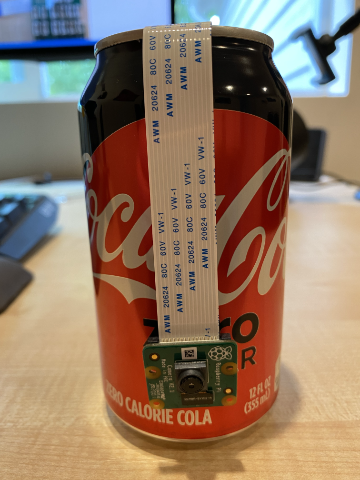

<!--
CO_OP_TRANSLATOR_METADATA:
{
  "original_hash": "c677667095f6133eee418c7e53615d05",
  "translation_date": "2025-08-25T16:30:10+00:00",
  "source_file": "4-manufacturing/lessons/2-check-fruit-from-device/pi-camera.md",
  "language_code": "hi"
}
-->
# रास्पबेरी पाई पर इमेज कैप्चर करें

इस पाठ के इस भाग में, आप अपने रास्पबेरी पाई में एक कैमरा सेंसर जोड़ेंगे और उससे इमेज पढ़ेंगे।

## हार्डवेयर

रास्पबेरी पाई को एक कैमरे की आवश्यकता है।

आप जो कैमरा उपयोग करेंगे वह [रास्पबेरी पाई कैमरा मॉड्यूल](https://www.raspberrypi.org/products/camera-module-v2/) है। यह कैमरा विशेष रूप से रास्पबेरी पाई के साथ काम करने के लिए डिज़ाइन किया गया है और पाई पर एक समर्पित कनेक्टर के माध्यम से जुड़ता है।

> 💁 यह कैमरा [कैमरा सीरियल इंटरफेस, जो मोबाइल इंडस्ट्री प्रोसेसर इंटरफेस एलायंस का एक प्रोटोकॉल है](https://wikipedia.org/wiki/Camera_Serial_Interface), जिसे MIPI-CSI के नाम से जाना जाता है, का उपयोग करता है। यह इमेज भेजने के लिए एक समर्पित प्रोटोकॉल है।

## कैमरा कनेक्ट करें

कैमरा को रास्पबेरी पाई से एक रिबन केबल का उपयोग करके जोड़ा जा सकता है।

### कार्य - कैमरा कनेक्ट करें


1. पाई को बंद करें।

1. कैमरे के साथ आने वाली रिबन केबल को कैमरे से कनेक्ट करें। ऐसा करने के लिए, होल्डर में काले प्लास्टिक की क्लिप को धीरे से खींचें ताकि वह थोड़ा बाहर आ जाए, फिर केबल को सॉकेट में डालें, इस तरह कि नीली साइड लेंस से दूर और धातु की पिन स्ट्रिप्स लेंस की ओर हों। जब यह पूरी तरह से अंदर हो जाए, तो काले प्लास्टिक की क्लिप को वापस जगह पर धकेलें।

    आप [रास्पबेरी पाई गेटिंग स्टार्टेड विद कैमरा मॉड्यूल डाक्यूमेंटेशन](https://projects.raspberrypi.org/en/projects/getting-started-with-picamera/2) पर क्लिप खोलने और केबल डालने का एक एनीमेशन देख सकते हैं।

    

1. पाई से ग्रोव बेस हैट को हटा दें।

1. रिबन केबल को ग्रोव बेस हैट के कैमरा स्लॉट से पास करें। सुनिश्चित करें कि केबल की नीली साइड एनालॉग पोर्ट्स **A0**, **A1** आदि की ओर हो।

    

1. रिबन केबल को पाई के कैमरा पोर्ट में डालें। फिर से, काले प्लास्टिक की क्लिप को ऊपर खींचें, केबल डालें, और फिर क्लिप को वापस धकेलें। केबल की नीली साइड USB और ईथरनेट पोर्ट्स की ओर होनी चाहिए।

    

1. ग्रोव बेस हैट को फिर से फिट करें।

## कैमरा प्रोग्राम करें

अब रास्पबेरी पाई को [PiCamera](https://pypi.org/project/picamera/) पायथन लाइब्रेरी का उपयोग करके कैमरा चलाने के लिए प्रोग्राम किया जा सकता है।

### कार्य - लेगेसी कैमरा मोड सक्षम करें

दुर्भाग्यवश, रास्पबेरी पाई OS Bullseye के रिलीज़ के साथ, OS के साथ आने वाला कैमरा सॉफ़्टवेयर बदल गया, जिससे PiCamera डिफ़ॉल्ट रूप से काम नहीं करता। इसका एक विकल्प तैयार किया जा रहा है, जिसे PiCamera2 कहा जाता है, लेकिन यह अभी उपयोग के लिए तैयार नहीं है।

फिलहाल, आप अपने पाई को लेगेसी कैमरा मोड में सेट कर सकते हैं ताकि PiCamera काम कर सके। कैमरा सॉकेट भी डिफ़ॉल्ट रूप से अक्षम होता है, लेकिन लेगेसी कैमरा सॉफ़्टवेयर को चालू करने से यह स्वचालित रूप से सक्षम हो जाता है।

1. पाई को चालू करें और इसे बूट होने दें।

1. VS Code लॉन्च करें, या तो सीधे पाई पर, या रिमोट SSH एक्सटेंशन के माध्यम से कनेक्ट करें।

1. अपने टर्मिनल से निम्नलिखित कमांड चलाएं:

    ```sh
    sudo raspi-config nonint do_legacy 0
    sudo reboot
    ```

    यह सेटिंग को लेगेसी कैमरा सॉफ़्टवेयर सक्षम करने के लिए टॉगल करेगा, फिर इस सेटिंग को प्रभावी बनाने के लिए पाई को रीबूट करेगा।

1. पाई के रीबूट होने की प्रतीक्षा करें, फिर VS Code को फिर से लॉन्च करें।

### कार्य - कैमरा प्रोग्राम करें

डिवाइस को प्रोग्राम करें।

1. टर्मिनल से, `pi` उपयोगकर्ता के होम डायरेक्टरी में एक नया फोल्डर बनाएं जिसका नाम `fruit-quality-detector` हो। इस फोल्डर में `app.py` नाम की एक फाइल बनाएं।

1. इस फोल्डर को VS Code में खोलें।

1. कैमरे के साथ इंटरैक्ट करने के लिए, आप PiCamera पायथन लाइब्रेरी का उपयोग कर सकते हैं। इसके लिए Pip पैकेज को निम्नलिखित कमांड से इंस्टॉल करें:

    ```sh
    pip3 install picamera
    ```

1. अपने `app.py` फाइल में निम्नलिखित कोड जोड़ें:

    ```python
    import io
    import time
    from picamera import PiCamera
    ```

    यह कोड आवश्यक लाइब्रेरीज़ को इंपोर्ट करता है, जिसमें `PiCamera` लाइब्रेरी भी शामिल है।

1. इसके नीचे कैमरा को इनिशियलाइज़ करने के लिए निम्नलिखित कोड जोड़ें:

    ```python
    camera = PiCamera()
    camera.resolution = (640, 480)
    camera.rotation = 0
    
    time.sleep(2)
    ```

    यह कोड एक PiCamera ऑब्जेक्ट बनाता है और रिज़ॉल्यूशन को 640x480 पर सेट करता है। हालांकि उच्च रिज़ॉल्यूशन (3280x2464 तक) समर्थित हैं, इमेज क्लासिफायर छोटे इमेज (227x227) पर काम करता है, इसलिए बड़े इमेज कैप्चर और भेजने की आवश्यकता नहीं है।

    `camera.rotation = 0` लाइन इमेज की रोटेशन सेट करती है। रिबन केबल कैमरे के नीचे से आती है, लेकिन यदि आपका कैमरा उस वस्तु की ओर आसानी से इंगित करने के लिए घुमाया गया है जिसे आप क्लासिफाई करना चाहते हैं, तो आप इस लाइन को रोटेशन के डिग्री के अनुसार बदल सकते हैं।

    

    उदाहरण के लिए, यदि आप रिबन केबल को किसी वस्तु के ऊपर लटकाते हैं ताकि वह कैमरे के शीर्ष पर हो, तो रोटेशन को 180 पर सेट करें:

    ```python
    camera.rotation = 180
    ```

    कैमरे को स्टार्ट होने में कुछ सेकंड लगते हैं, इसलिए `time.sleep(2)` का उपयोग किया गया है।

1. इसके नीचे इमेज को बाइनरी डेटा के रूप में कैप्चर करने के लिए निम्नलिखित कोड जोड़ें:

    ```python
    image = io.BytesIO()
    camera.capture(image, 'jpeg')
    image.seek(0)
    ```

    यह कोड बाइनरी डेटा स्टोर करने के लिए एक `BytesIO` ऑब्जेक्ट बनाता है। इमेज को कैमरे से JPEG फाइल के रूप में पढ़ा जाता है और इस ऑब्जेक्ट में स्टोर किया जाता है। इस ऑब्जेक्ट में डेटा की स्थिति को ट्रैक करने के लिए एक पोजिशन इंडिकेटर होता है, ताकि यदि आवश्यक हो तो और डेटा को अंत में लिखा जा सके। `image.seek(0)` लाइन इस स्थिति को शुरुआत में ले जाती है ताकि बाद में सभी डेटा को पढ़ा जा सके।

1. इसके नीचे इमेज को फाइल में सेव करने के लिए निम्नलिखित जोड़ें:

    ```python
    with open('image.jpg', 'wb') as image_file:
        image_file.write(image.read())
    ```

    यह कोड `image.jpg` नाम की एक फाइल को लिखने के लिए खोलता है, फिर `BytesIO` ऑब्जेक्ट से सभी डेटा को पढ़ता है और इसे फाइल में लिखता है।

    > 💁 आप इमेज को सीधे फाइल में कैप्चर कर सकते हैं `BytesIO` ऑब्जेक्ट के बजाय, फाइल का नाम `camera.capture` कॉल में पास करके। `BytesIO` ऑब्जेक्ट का उपयोग करने का कारण यह है कि बाद में इस पाठ में आप इमेज को अपने इमेज क्लासिफायर को भेज सकें।

1. कैमरे को किसी वस्तु की ओर इंगित करें और इस कोड को चलाएं।

1. एक इमेज कैप्चर की जाएगी और वर्तमान फोल्डर में `image.jpg` के रूप में सेव होगी। आप इस फाइल को VS Code एक्सप्लोरर में देखेंगे। फाइल को चुनें और इमेज देखें। यदि इसे रोटेशन की आवश्यकता हो, तो `camera.rotation = 0` लाइन को आवश्यकतानुसार अपडेट करें और फिर से तस्वीर लें।

> 💁 आप इस कोड को [code-camera/pi](../../../../../4-manufacturing/lessons/2-check-fruit-from-device/code-camera/pi) फोल्डर में पा सकते हैं।

😀 आपका कैमरा प्रोग्राम सफल रहा!

**अस्वीकरण**:  
यह दस्तावेज़ AI अनुवाद सेवा [Co-op Translator](https://github.com/Azure/co-op-translator) का उपयोग करके अनुवादित किया गया है। जबकि हम सटीकता सुनिश्चित करने का प्रयास करते हैं, कृपया ध्यान दें कि स्वचालित अनुवाद में त्रुटियां या अशुद्धियां हो सकती हैं। मूल भाषा में उपलब्ध मूल दस्तावेज़ को प्रामाणिक स्रोत माना जाना चाहिए। महत्वपूर्ण जानकारी के लिए, पेशेवर मानव अनुवाद की सिफारिश की जाती है। इस अनुवाद के उपयोग से उत्पन्न किसी भी गलतफहमी या गलत व्याख्या के लिए हम उत्तरदायी नहीं हैं।