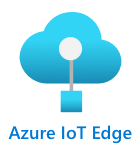

<!--
CO_OP_TRANSLATOR_METADATA:
{
  "original_hash": "2625af24587465c5547ae33d6cc000a5",
  "translation_date": "2025-08-25T16:34:14+00:00",
  "source_file": "4-manufacturing/lessons/3-run-fruit-detector-edge/README.md",
  "language_code": "hi"
}
-->
# अपने फल डिटेक्टर को एज पर चलाएं


> स्केच नोट [नित्या नरसिम्हन](https://github.com/nitya) द्वारा। बड़े संस्करण के लिए छवि पर क्लिक करें।

यह वीडियो IoT डिवाइस पर इमेज क्लासिफायर चलाने का अवलोकन देता है, जो इस पाठ में कवर किया गया विषय है।

[](https://www.youtube.com/watch?v=_K5fqGLO8us)

## व्याख्यान से पहले का क्विज़

[व्याख्यान से पहले का क्विज़](https://black-meadow-040d15503.1.azurestaticapps.net/quiz/33)

## परिचय

पिछले पाठ में आपने अपने इमेज क्लासिफायर का उपयोग करके पके और कच्चे फलों को वर्गीकृत किया था, जिसमें आपके IoT डिवाइस के कैमरे द्वारा कैप्चर की गई छवि को इंटरनेट के माध्यम से एक क्लाउड सेवा पर भेजा गया था। ये कॉल समय लेते हैं, पैसे खर्च करते हैं, और आपके द्वारा उपयोग किए जा रहे इमेज डेटा के प्रकार के आधार पर गोपनीयता के मुद्दे हो सकते हैं।

इस पाठ में आप सीखेंगे कि मशीन लर्निंग (ML) मॉडल को एज पर कैसे चलाया जाए - यानी IoT डिवाइस पर जो आपके अपने नेटवर्क पर चलते हैं, न कि क्लाउड में। आप एज कंप्यूटिंग बनाम क्लाउड कंप्यूटिंग के लाभ और नुकसान, अपने AI मॉडल को एज पर तैनात करने का तरीका, और इसे अपने IoT डिवाइस से एक्सेस करने का तरीका सीखेंगे।

इस पाठ में हम निम्नलिखित विषयों को कवर करेंगे:

* [एज कंप्यूटिंग](../../../../../4-manufacturing/lessons/3-run-fruit-detector-edge)
* [Azure IoT Edge](../../../../../4-manufacturing/lessons/3-run-fruit-detector-edge)
* [IoT Edge डिवाइस को रजिस्टर करें](../../../../../4-manufacturing/lessons/3-run-fruit-detector-edge)
* [IoT Edge डिवाइस सेट करें](../../../../../4-manufacturing/lessons/3-run-fruit-detector-edge)
* [अपने मॉडल को एक्सपोर्ट करें](../../../../../4-manufacturing/lessons/3-run-fruit-detector-edge)
* [तैनाती के लिए अपने कंटेनर को तैयार करें](../../../../../4-manufacturing/lessons/3-run-fruit-detector-edge)
* [अपने कंटेनर को तैनात करें](../../../../../4-manufacturing/lessons/3-run-fruit-detector-edge)
* [अपने IoT Edge डिवाइस का उपयोग करें](../../../../../4-manufacturing/lessons/3-run-fruit-detector-edge)

## एज कंप्यूटिंग

एज कंप्यूटिंग का मतलब है कि IoT डेटा को वहीं प्रोसेस करना जहां डेटा उत्पन्न होता है। क्लाउड में प्रोसेसिंग करने के बजाय, इसे क्लाउड के किनारे पर ले जाया जाता है - यानी आपके आंतरिक नेटवर्क पर।


अब तक के पाठों में, आपने डेटा इकट्ठा करने और उसे क्लाउड में भेजने वाले डिवाइस का उपयोग किया है, जहां डेटा का विश्लेषण किया जाता है, जैसे कि क्लाउड में सर्वरलेस फंक्शन या AI मॉडल चलाना।


एज कंप्यूटिंग में कुछ क्लाउड सेवाओं को क्लाउड से हटाकर IoT डिवाइस के समान नेटवर्क पर चलने वाले कंप्यूटरों पर ले जाया जाता है, और केवल आवश्यकता होने पर क्लाउड से संपर्क किया जाता है। उदाहरण के लिए, आप एज डिवाइस पर AI मॉडल चला सकते हैं ताकि फलों की पकी अवस्था का विश्लेषण किया जा सके, और केवल एनालिटिक्स को क्लाउड पर भेजा जा सके, जैसे कि पके और कच्चे फलों की संख्या।

✅ सोचें कि आपने अब तक जो IoT एप्लिकेशन बनाए हैं, उनके कौन से हिस्से को एज पर ले जाया जा सकता है।

### फायदे

एज कंप्यूटिंग के फायदे निम्नलिखित हैं:

1. **गति** - एज कंप्यूटिंग समय-संवेदनशील डेटा के लिए आदर्श है क्योंकि कार्य डिवाइस के समान नेटवर्क पर किए जाते हैं, न कि इंटरनेट पर कॉल करने से। यह उच्च गति सक्षम करता है क्योंकि आंतरिक नेटवर्क इंटरनेट कनेक्शन की तुलना में काफी तेज गति से चल सकते हैं, और डेटा को बहुत कम दूरी तय करनी होती है।

    > 💁 भले ही इंटरनेट कनेक्शन के लिए ऑप्टिकल केबल का उपयोग किया जाता है, जिससे डेटा प्रकाश की गति से यात्रा कर सकता है, डेटा को क्लाउड प्रदाताओं तक पहुंचने में समय लग सकता है। उदाहरण के लिए, यदि आप यूरोप से यूएस में क्लाउड सेवाओं को डेटा भेज रहे हैं, तो डेटा को अटलांटिक पार करने में कम से कम 28ms लगते हैं, और इसमें डेटा को ट्रांसअटलांटिक केबल तक पहुंचाने, इलेक्ट्रिकल से प्रकाश संकेतों में बदलने और फिर से क्लाउड प्रदाता तक पहुंचने का समय शामिल नहीं है।

    एज कंप्यूटिंग को कम नेटवर्क ट्रैफिक की आवश्यकता होती है, जिससे आपके डेटा के धीमा होने का जोखिम कम हो जाता है क्योंकि इंटरनेट कनेक्शन के लिए उपलब्ध सीमित बैंडविड्थ पर भीड़भाड़ हो सकती है।

1. **दूरस्थ पहुंच** - एज कंप्यूट तब काम करता है जब आपके पास सीमित या कोई कनेक्टिविटी नहीं होती है, या कनेक्टिविटी का उपयोग लगातार करना बहुत महंगा होता है। उदाहरण के लिए, मानवीय आपदा क्षेत्रों में काम करते समय जहां बुनियादी ढांचा सीमित है, या विकासशील देशों में।

1. **कम लागत** - डेटा संग्रह, भंडारण, विश्लेषण, और एज डिवाइस पर कार्यों को ट्रिगर करने से क्लाउड सेवाओं का उपयोग कम हो जाता है, जिससे आपके IoT एप्लिकेशन की कुल लागत कम हो सकती है। हाल ही में एज कंप्यूटिंग के लिए डिज़ाइन किए गए उपकरणों में वृद्धि हुई है, जैसे कि [NVIDIA का Jetson Nano](https://developer.nvidia.com/embedded/jetson-nano-developer-kit), जो US$100 से कम लागत वाले उपकरणों पर GPU-आधारित हार्डवेयर का उपयोग करके AI वर्कलोड चला सकता है।

1. **गोपनीयता और सुरक्षा** - एज कंप्यूट के साथ, डेटा आपके नेटवर्क पर रहता है और क्लाउड पर अपलोड नहीं किया जाता है। यह संवेदनशील और व्यक्तिगत रूप से पहचान योग्य जानकारी के लिए अक्सर पसंद किया जाता है, खासकर क्योंकि डेटा का विश्लेषण करने के बाद इसे संग्रहीत करने की आवश्यकता नहीं होती है, जिससे डेटा लीक का जोखिम काफी कम हो जाता है। उदाहरणों में चिकित्सा डेटा और सुरक्षा कैमरा फुटेज शामिल हैं।

1. **असुरक्षित उपकरणों को संभालना** - यदि आपके पास ऐसे उपकरण हैं जिनमें ज्ञात सुरक्षा खामियां हैं जिन्हें आप सीधे अपने नेटवर्क या इंटरनेट से कनेक्ट नहीं करना चाहते हैं, तो आप उन्हें एक अलग नेटवर्क से एक गेटवे IoT Edge डिवाइस से कनेक्ट कर सकते हैं। यह एज डिवाइस तब आपके व्यापक नेटवर्क या इंटरनेट से कनेक्शन भी कर सकता है और डेटा प्रवाह को प्रबंधित कर सकता है।

1. **असंगत उपकरणों के लिए समर्थन** - यदि आपके पास ऐसे उपकरण हैं जो IoT हब से कनेक्ट नहीं हो सकते हैं, उदाहरण के लिए ऐसे उपकरण जो केवल HTTP कनेक्शन का उपयोग करके कनेक्ट कर सकते हैं या केवल ब्लूटूथ के माध्यम से कनेक्ट कर सकते हैं, तो आप IoT Edge डिवाइस को गेटवे डिवाइस के रूप में उपयोग कर सकते हैं, जो IoT हब को संदेश अग्रेषित करता है।

✅ कुछ शोध करें: एज कंप्यूटिंग के और कौन से फायदे हो सकते हैं?

### नुकसान

एज कंप्यूटिंग के नुकसान भी हैं, जहां क्लाउड एक पसंदीदा विकल्प हो सकता है:

1. **स्केल और लचीलापन** - क्लाउड कंप्यूटिंग नेटवर्क और डेटा की जरूरतों के अनुसार वास्तविक समय में सर्वर और अन्य संसाधनों को जोड़ या घटा सकता है। अधिक एज कंप्यूटर जोड़ने के लिए मैन्युअल रूप से अधिक उपकरण जोड़ने की आवश्यकता होती है।

1. **विश्वसनीयता और लचीलापन** - क्लाउड कंप्यूटिंग अक्सर कई स्थानों पर कई सर्वर प्रदान करता है, जो आपदा वसूली और पुनरावृत्ति के लिए उपयोगी होते हैं। एज पर समान स्तर की पुनरावृत्ति के लिए बड़े निवेश और बहुत सारे कॉन्फ़िगरेशन कार्य की आवश्यकता होती है।

1. **रखरखाव** - क्लाउड सेवा प्रदाता सिस्टम रखरखाव और अपडेट प्रदान करते हैं।

✅ कुछ शोध करें: एज कंप्यूटिंग के और कौन से नुकसान हो सकते हैं?

ये नुकसान वास्तव में क्लाउड का उपयोग करने के फायदे के विपरीत हैं - आपको इन उपकरणों को स्वयं बनाना और प्रबंधित करना होगा, बजाय इसके कि क्लाउड प्रदाताओं की विशेषज्ञता और स्केल पर निर्भर रहें।

कुछ जोखिम एज कंप्यूटिंग की प्रकृति से ही कम हो जाते हैं। उदाहरण के लिए, यदि आपके पास एक फैक्ट्री में एक एज डिवाइस चल रहा है जो मशीनरी से डेटा एकत्र करता है, तो आपको कुछ आपदा वसूली परिदृश्यों के बारे में सोचने की आवश्यकता नहीं है। यदि फैक्ट्री की बिजली चली जाती है, तो आपको बैकअप एज डिवाइस की आवश्यकता नहीं है क्योंकि मशीनें जो डेटा उत्पन्न करती हैं, वे भी बिना बिजली के होंगी।

IoT सिस्टम के लिए, आप अक्सर क्लाउड और एज कंप्यूटिंग का मिश्रण चाहते हैं, जो सिस्टम, उसके ग्राहकों और उसके रखरखावकर्ताओं की जरूरतों के आधार पर प्रत्येक सेवा का लाभ उठाते हैं।

## Azure IoT Edge



Azure IoT Edge एक सेवा है जो आपको वर्कलोड को क्लाउड से हटाकर एज पर ले जाने में मदद कर सकती है। आप एक डिवाइस को एज डिवाइस के रूप में सेट करते हैं, और क्लाउड से उस एज डिवाइस पर कोड तैनात कर सकते हैं। यह आपको क्लाउड और एज की क्षमताओं को मिलाने की अनुमति देता है।

> 🎓 *वर्कलोड* एक शब्द है जो किसी भी सेवा के लिए उपयोग किया जाता है जो किसी प्रकार का कार्य करती है, जैसे कि AI मॉडल, एप्लिकेशन, या सर्वरलेस फंक्शन।

उदाहरण के लिए, आप क्लाउड में एक इमेज क्लासिफायर को प्रशिक्षित कर सकते हैं, फिर क्लाउड से इसे एक एज डिवाइस पर तैनात कर सकते हैं। आपका IoT डिवाइस तब छवियों को वर्गीकृत करने के लिए एज डिवाइस पर भेजता है, बजाय इसके कि छवियों को इंटरनेट पर भेजा जाए। यदि आपको मॉडल के नए संस्करण को तैनात करने की आवश्यकता है, तो आप इसे क्लाउड में प्रशिक्षित कर सकते हैं और IoT Edge का उपयोग करके एज डिवाइस पर मॉडल को अपडेट कर सकते हैं।

> 🎓 IoT Edge पर तैनात सॉफ़्टवेयर को *मॉड्यूल* कहा जाता है। डिफ़ॉल्ट रूप से IoT Edge ऐसे मॉड्यूल चलाता है जो IoT हब के साथ संवाद करते हैं, जैसे `edgeAgent` और `edgeHub` मॉड्यूल। जब आप एक इमेज क्लासिफायर तैनात करते हैं, तो इसे एक अतिरिक्त मॉड्यूल के रूप में तैनात किया जाता है।

IoT Edge IoT हब में बनाया गया है, इसलिए आप एज डिवाइस को उसी सेवा का उपयोग करके प्रबंधित कर सकते हैं जिसका उपयोग आप IoT डिवाइस को प्रबंधित करने के लिए करेंगे, और वह भी समान स्तर की सुरक्षा के साथ।

IoT Edge *कंटेनरों* से कोड चलाता है - स्व-निहित एप्लिकेशन जो आपके कंप्यूटर पर अन्य एप्लिकेशन से अलग-थलग चलाए जाते हैं। जब आप एक कंटेनर चलाते हैं, तो यह आपके कंप्यूटर के अंदर एक अलग कंप्यूटर की तरह कार्य करता है, जिसमें इसका अपना सॉफ़्टवेयर, सेवाएं और एप्लिकेशन चलते हैं। अधिकांश समय कंटेनर आपके कंप्यूटर पर कुछ भी एक्सेस नहीं कर सकते जब तक आप फ़ोल्डर जैसी चीज़ों को साझा करने का विकल्प नहीं चुनते। कंटेनर तब एक खुले पोर्ट के माध्यम से सेवाओं को उजागर करता है जिसे आप कनेक्ट कर सकते हैं या अपने नेटवर्क पर उजागर कर सकते हैं।


उदाहरण के लिए, आप एक कंटेनर में एक वेबसाइट चला सकते हैं जो पोर्ट 80 पर चल रही है, जो डिफ़ॉल्ट HTTP पोर्ट है, और आप इसे अपने कंप्यूटर से भी पोर्ट 80 पर उजागर कर सकते हैं।

✅ कुछ शोध करें: कंटेनरों और Docker या Moby जैसी सेवाओं के बारे में पढ़ें।

आप Custom Vision का उपयोग करके इमेज क्लासिफायर डाउनलोड कर सकते हैं और उन्हें कंटेनरों के रूप में तैनात कर सकते हैं, या तो सीधे डिवाइस पर चलाकर या IoT Edge के माध्यम से तैनात करके। एक बार जब वे कंटेनर में चल रहे होते हैं, तो उन्हें उसी REST API का उपयोग करके एक्सेस किया जा सकता है जैसा कि क्लाउड संस्करण के लिए होता है, लेकिन एज डिवाइस पर चलने वाले कंटेनर को इंगित करने वाले एंडपॉइंट के साथ।

## IoT Edge डिवाइस को रजिस्टर करें

IoT Edge डिवाइस का उपयोग करने के लिए, इसे IoT हब में रजिस्टर करना होगा।

### कार्य - IoT Edge डिवाइस को रजिस्टर करें

1. `fruit-quality-detector` संसाधन समूह में एक IoT हब बनाएं। इसे `fruit-quality-detector` पर आधारित एक अद्वितीय नाम दें।

1. अपने IoT हब में `fruit-quality-detector-edge` नामक एक IoT Edge डिवाइस रजिस्टर करें। यह कमांड एक गैर-एज डिवाइस को रजिस्टर करने के लिए उपयोग किए गए कमांड के समान है, सिवाय इसके कि आप `--edge-enabled` फ्लैग पास करते हैं।

    ```sh
    az iot hub device-identity create --edge-enabled \
                                      --device-id fruit-quality-detector-edge \
                                      --hub-name <hub_name>
    ```

    `<hub_name>` को अपने IoT हब के नाम से बदलें।

1. अपने डिवाइस के लिए कनेक्शन स्ट्रिंग प्राप्त करने के लिए निम्नलिखित कमांड का उपयोग करें:

    ```sh
    az iot hub device-identity connection-string show --device-id fruit-quality-detector-edge \
                                                      --output table \
                                                      --hub-name <hub_name>
    ```

    `<hub_name>` को अपने IoT हब के नाम से बदलें।

    आउटपुट में दिखाए गए कनेक्शन स्ट्रिंग की एक प्रति लें।

## IoT Edge डिवाइस सेट करें

एक बार जब आपने अपने IoT हब में एज डिवाइस रजिस्ट्रेशन बना लिया है, तो आप एज डिवाइस सेट कर सकते हैं।

### कार्य - IoT Edge Runtime इंस्टॉल करें और शुरू करें

**IoT Edge रनटाइम केवल Linux कंटेनरों को चलाता है।** इसे Linux पर चलाया जा सकता है, या Windows पर Linux वर्चुअल मशीनों का उपयोग करके।

* यदि आप अपने IoT डिवाइस के रूप में Raspberry Pi का उपयोग कर रहे हैं, तो यह Linux का एक समर्थित संस्करण चलाता है और IoT Edge रनटाइम की मेजबानी कर सकता है। [Microsoft Docs पर Linux के लिए Azure IoT Edge इंस्टॉल करने के गाइड](https://docs.microsoft.com/azure/iot-edge/how-to-install-iot-edge?WT.mc_id=academic-17441-jabenn) का पालन करें ताकि IoT Edge इंस्टॉल किया जा सके और कनेक्शन स्ट्रिंग सेट की जा सके।

    > 💁 याद रखें, Raspberry Pi OS Debian Linux का एक संस्करण है।

* यदि आप Raspberry Pi का उपयोग नहीं कर रहे हैं, लेकिन आपके पास एक Linux कंप्यूटर है, तो आप IoT Edge रनटाइम चला सकते हैं। [Microsoft Docs पर Linux के लिए Azure IoT Edge इंस्टॉल करने के गाइड](https://docs.microsoft.com/azure/iot-edge/how-to-install-iot-edge?WT.mc_id=academic-17441-jabenn) का पालन करें ताकि IoT Edge इंस्टॉल किया जा सके और कनेक्शन स्ट्रिंग सेट की जा सके।

* यदि आप Windows का उपयोग कर रहे हैं, तो आप Linux वर्चुअल मशीन में IoT Edge रनटाइम इंस्टॉल कर सकते हैं। [Microsoft Docs पर Windows डिवाइस पर अपना पहला IoT Edge मॉड्यूल तैनात करें](https://docs.microsoft.com/azure/iot-edge/quickstart?WT.mc_id=academic-17441-jabenn#install-and-start-the-iot-edge-runtime) के त्वरित प्रारंभ के "IoT Edge रनटाइम इंस्टॉल करें और शुरू करें" अनुभाग का पालन करें। आप *मॉड्यूल तैनात करें* अनुभाग तक पहुंचने पर रुक सकते हैं।

* यदि आप macOS का उपयोग कर रहे हैं, तो आप अपने IoT Edge डिवाइस के लिए क्लाउड में एक वर्चुअल मशीन (VM) बना सकते हैं। ये कंप्यूटर हैं जिन्हें आप क्लाउड में बना सकते हैं और इंटरनेट पर एक्सेस कर सकते हैं। आप एक Linux VM बना सकते हैं जिसमें IoT Edge इंस्टॉल हो। [IoT Edge चलाने वाली वर्चुअल मशीन बनाएं गाइड](vm-iotedge.md) का पालन करें।

## अपने मॉडल को एक्सपोर्ट करें

एज पर क्लासिफायर चलाने के लिए, इसे Custom Vision से एक्सपोर्ट करना होगा। Custom Vision दो प्रकार के मॉडल उत्पन्न कर सकता है - मानक मॉडल और कॉम्पैक्ट मॉडल। कॉम्पैक्ट मॉडल विभिन्न तकनीकों का उपयोग करके मॉडल के आकार को कम करते हैं, जिससे इसे IoT डिवाइस पर डाउनलोड और तैनात किया जा सके।

जब आपने इमेज क्लासिफायर बनाया, तो आपने *Food* डोमेन का उपयोग किया, जो खाद्य छवियों पर प्रशिक्षण के लिए अनुकूलित मॉडल का एक संस्करण है। Custom Vision में, आप अपने प्रोजेक्ट के डोमेन को बदल सकते हैं, अपने प्रशिक्षण डेटा का उपयोग करके नए डोमेन के साथ एक नया मॉडल प्रशिक्षित कर सकते हैं। Custom Vision द्वारा समर्थित सभी डोमेन मानक और कॉम्पैक्ट दोनों के रूप में उपलब्ध हैं।

### कार्य - अपने मॉडल को Food (कॉम्पैक्ट)
1. [CustomVision.ai](https://customvision.ai) पोर्टल लॉन्च करें और साइन इन करें यदि आपने इसे पहले से नहीं खोला है। फिर अपने `fruit-quality-detector` प्रोजेक्ट को खोलें।

1. **Settings** बटन (⚙ आइकन) चुनें।

1. *Domains* सूची में, *Food (compact)* चुनें।

1. *Export Capabilities* के तहत, सुनिश्चित करें कि *Basic platforms (Tensorflow, CoreML, ONNX, ...)* चयनित है।

1. Settings पेज के नीचे **Save Changes** पर क्लिक करें।

1. **Train** बटन का उपयोग करके मॉडल को पुनः प्रशिक्षित करें, और *Quick training* चुनें।

### कार्य - अपने मॉडल को एक्सपोर्ट करें

एक बार मॉडल प्रशिक्षित हो जाने के बाद, इसे कंटेनर के रूप में एक्सपोर्ट करना होगा।

1. **Performance** टैब चुनें और अपने नवीनतम iteration को खोजें जिसे compact domain का उपयोग करके प्रशिक्षित किया गया था।

1. शीर्ष पर **Export** बटन चुनें।

1. **DockerFile** चुनें, फिर अपने edge device से मेल खाने वाला संस्करण चुनें:

    * यदि आप Linux कंप्यूटर, Windows कंप्यूटर या Virtual Machine पर IoT Edge चला रहे हैं, तो *Linux* संस्करण चुनें।
    * यदि आप Raspberry Pi पर IoT Edge चला रहे हैं, तो *ARM (Raspberry Pi 3)* संस्करण चुनें।

> 🎓 Docker कंटेनरों को प्रबंधित करने के लिए सबसे लोकप्रिय टूल्स में से एक है, और DockerFile कंटेनर सेटअप करने के निर्देशों का एक सेट है।

1. **Export** चुनें ताकि Custom Vision संबंधित फाइलें बना सके, फिर **Download** पर क्लिक करें और उन्हें zip फाइल में डाउनलोड करें।

1. फाइलों को अपने कंप्यूटर पर सेव करें, फिर फोल्डर को अनज़िप करें।

## अपने कंटेनर को डिप्लॉयमेंट के लिए तैयार करें


एक बार जब आपने अपना मॉडल डाउनलोड कर लिया है, तो इसे कंटेनर में बनाया जाना चाहिए, फिर कंटेनर रजिस्ट्री में पुश किया जाना चाहिए - एक ऑनलाइन स्थान जहां आप कंटेनरों को स्टोर कर सकते हैं। IoT Edge फिर रजिस्ट्री से कंटेनर डाउनलोड कर सकता है और इसे आपके डिवाइस पर पुश कर सकता है।


इस पाठ के लिए आप जो कंटेनर रजिस्ट्री उपयोग करेंगे वह Azure Container Registry है। यह एक मुफ्त सेवा नहीं है, इसलिए पैसे बचाने के लिए सुनिश्चित करें कि आप [अपने प्रोजेक्ट को साफ करें](../../../clean-up.md) जब आप इसे समाप्त कर लें।

> 💁 Azure Container Registry का उपयोग करने की लागत आप [Azure Container Registry प्राइसिंग पेज](https://azure.microsoft.com/pricing/details/container-registry/?WT.mc_id=academic-17441-jabenn) पर देख सकते हैं।

### कार्य - Docker इंस्टॉल करें

क्लासिफायर को बनाने और डिप्लॉय करने के लिए, आपको [Docker](https://www.docker.com/) इंस्टॉल करने की आवश्यकता हो सकती है।

आपको केवल तभी ऐसा करना होगा यदि आप अपने कंटेनर को उस डिवाइस से अलग डिवाइस पर बनाना चाहते हैं जिस पर आपने IoT Edge इंस्टॉल किया है - IoT Edge इंस्टॉल करने के हिस्से के रूप में, Docker आपके लिए इंस्टॉल किया जाता है।

1. यदि आप अपने IoT Edge डिवाइस से अलग डिवाइस पर Docker कंटेनर बना रहे हैं, तो [Docker इंस्टॉल पेज](https://www.docker.com/products/docker-desktop) पर Docker Desktop या Docker इंजन इंस्टॉल करने के निर्देशों का पालन करें। इंस्टॉल करने के बाद सुनिश्चित करें कि यह चल रहा है।

### कार्य - कंटेनर रजिस्ट्री संसाधन बनाएं

1. अपने टर्मिनल या कमांड प्रॉम्प्ट से निम्नलिखित कमांड चलाएं ताकि Azure Container Registry संसाधन बनाया जा सके:

    ```sh
    az acr create --resource-group fruit-quality-detector \
                  --sku Basic \
                  --name <Container registry name>
    ```

    `<Container registry name>` को अपने कंटेनर रजिस्ट्री के लिए एक अद्वितीय नाम से बदलें, जिसमें केवल अक्षर और संख्याएं हों। इसे `fruitqualitydetector` के आधार पर बनाएं। यह नाम कंटेनर रजिस्ट्री तक पहुंचने के URL का हिस्सा बन जाता है, इसलिए इसे वैश्विक रूप से अद्वितीय होना चाहिए।

1. निम्नलिखित कमांड का उपयोग करके Azure Container Registry में लॉग इन करें:

    ```sh
    az acr login --name <Container registry name>
    ```

    `<Container registry name>` को अपने कंटेनर रजिस्ट्री के नाम से बदलें।

1. कंटेनर रजिस्ट्री को एडमिन मोड में सेट करें ताकि आप पासवर्ड जनरेट कर सकें:

    ```sh
    az acr update --admin-enabled true \
                 --name <Container registry name>
    ```

    `<Container registry name>` को अपने कंटेनर रजिस्ट्री के नाम से बदलें।

1. अपने कंटेनर रजिस्ट्री के लिए पासवर्ड जनरेट करने के लिए निम्नलिखित कमांड चलाएं:

    ```sh
     az acr credential renew --password-name password \
                             --output table \
                             --name <Container registry name>
    ```

    `<Container registry name>` को अपने कंटेनर रजिस्ट्री के नाम से बदलें।

    `PASSWORD` के मान की एक कॉपी लें, क्योंकि आपको इसकी बाद में आवश्यकता होगी।

### कार्य - अपने कंटेनर को बनाएं

Custom Vision से आपने जो डाउनलोड किया था वह एक DockerFile था जिसमें कंटेनर को कैसे बनाया जाए इसके निर्देश थे, साथ ही एप्लिकेशन कोड जो कंटेनर के अंदर चलाया जाएगा ताकि आपका Custom Vision मॉडल होस्ट किया जा सके, और एक REST API जिसे कॉल किया जा सके। आप Docker का उपयोग करके DockerFile से टैग किए गए कंटेनर को बना सकते हैं, फिर इसे अपने कंटेनर रजिस्ट्री में पुश कर सकते हैं।

> 🎓 कंटेनरों को एक टैग दिया जाता है जो उनके नाम और संस्करण को परिभाषित करता है। जब आपको कंटेनर को अपडेट करने की आवश्यकता होती है, तो आप इसे उसी टैग के साथ लेकिन नए संस्करण के साथ बना सकते हैं।

1. अपने टर्मिनल या कमांड प्रॉम्प्ट को खोलें और उस अनज़िप किए गए मॉडल पर जाएं जिसे आपने Custom Vision से डाउनलोड किया था।

1. इमेज को बनाने और टैग करने के लिए निम्नलिखित कमांड चलाएं:

    ```sh
    docker build --platform <platform> -t <Container registry name>.azurecr.io/classifier:v1 .
    ```

    `<platform>` को उस प्लेटफॉर्म से बदलें जिस पर यह कंटेनर चलेगा। यदि आप Raspberry Pi पर IoT Edge चला रहे हैं, तो इसे `linux/armhf` सेट करें, अन्यथा इसे `linux/amd64` सेट करें।

    > 💁 यदि आप यह कमांड उस डिवाइस से चला रहे हैं जिस पर आप IoT Edge चला रहे हैं, जैसे कि Raspberry Pi से, तो आप `--platform <platform>` भाग को छोड़ सकते हैं क्योंकि यह डिफ़ॉल्ट रूप से वर्तमान प्लेटफॉर्म पर सेट होता है।

    `<Container registry name>` को अपने कंटेनर रजिस्ट्री के नाम से बदलें।

    > 💁 यदि आप Linux या Raspberry Pi OS पर चल रहे हैं तो आपको यह कमांड चलाने के लिए `sudo` का उपयोग करना पड़ सकता है।

    Docker इमेज बनाएगा, जिसमें आवश्यक सभी सॉफ़्टवेयर कॉन्फ़िगर किए जाएंगे। इमेज को `classifier:v1` के रूप में टैग किया जाएगा।

    ```output
    ➜  d4ccc45da0bb478bad287128e1274c3c.DockerFile.Linux docker build --platform linux/amd64 -t  fruitqualitydetectorjimb.azurecr.io/classifier:v1 .
    [+] Building 102.4s (11/11) FINISHED
     => [internal] load build definition from Dockerfile
     => => transferring dockerfile: 131B
     => [internal] load .dockerignore
     => => transferring context: 2B
     => [internal] load metadata for docker.io/library/python:3.7-slim
     => [internal] load build context
     => => transferring context: 905B
     => [1/6] FROM docker.io/library/python:3.7-slim@sha256:b21b91c9618e951a8cbca5b696424fa5e820800a88b7e7afd66bba0441a764d6
     => => resolve docker.io/library/python:3.7-slim@sha256:b21b91c9618e951a8cbca5b696424fa5e820800a88b7e7afd66bba0441a764d6
     => => sha256:b4d181a07f8025e00e0cb28f1cc14613da2ce26450b80c54aea537fa93cf3bda 27.15MB / 27.15MB
     => => sha256:de8ecf497b753094723ccf9cea8a46076e7cb845f333df99a6f4f397c93c6ea9 2.77MB / 2.77MB
     => => sha256:707b80804672b7c5d8f21e37c8396f319151e1298d976186b4f3b76ead9f10c8 10.06MB / 10.06MB
     => => sha256:b21b91c9618e951a8cbca5b696424fa5e820800a88b7e7afd66bba0441a764d6 1.86kB / 1.86kB
     => => sha256:44073386687709c437586676b572ff45128ff1f1570153c2f727140d4a9accad 1.37kB / 1.37kB
     => => sha256:3d94f0f2ca798607808b771a7766f47ae62a26f820e871dd488baeccc69838d1 8.31kB / 8.31kB
     => => sha256:283715715396fd56d0e90355125fd4ec57b4f0773f306fcd5fa353b998beeb41 233B / 233B
     => => sha256:8353afd48f6b84c3603ea49d204bdcf2a1daada15f5d6cad9cc916e186610a9f 2.64MB / 2.64MB
     => => extracting sha256:b4d181a07f8025e00e0cb28f1cc14613da2ce26450b80c54aea537fa93cf3bda
     => => extracting sha256:de8ecf497b753094723ccf9cea8a46076e7cb845f333df99a6f4f397c93c6ea9
     => => extracting sha256:707b80804672b7c5d8f21e37c8396f319151e1298d976186b4f3b76ead9f10c8
     => => extracting sha256:283715715396fd56d0e90355125fd4ec57b4f0773f306fcd5fa353b998beeb41
     => => extracting sha256:8353afd48f6b84c3603ea49d204bdcf2a1daada15f5d6cad9cc916e186610a9f
     => [2/6] RUN pip install -U pip
     => [3/6] RUN pip install --no-cache-dir numpy~=1.17.5 tensorflow~=2.0.2 flask~=1.1.2 pillow~=7.2.0
     => [4/6] RUN pip install --no-cache-dir mscviplib==2.200731.16
     => [5/6] COPY app /app
     => [6/6] WORKDIR /app
     => exporting to image
     => => exporting layers
     => => writing image sha256:1846b6f134431f78507ba7c079358ed66d944c0e185ab53428276bd822400386
     => => naming to fruitqualitydetectorjimb.azurecr.io/classifier:v1
    ```

### कार्य - अपने कंटेनर को कंटेनर रजिस्ट्री में पुश करें

1. अपने कंटेनर को कंटेनर रजिस्ट्री में पुश करने के लिए निम्नलिखित कमांड का उपयोग करें:

    ```sh
    docker push <Container registry name>.azurecr.io/classifier:v1
    ```

    `<Container registry name>` को अपने कंटेनर रजिस्ट्री के नाम से बदलें।

    > 💁 यदि आप Linux पर चल रहे हैं तो आपको यह कमांड चलाने के लिए `sudo` का उपयोग करना पड़ सकता है।

    कंटेनर कंटेनर रजिस्ट्री में पुश किया जाएगा।

    ```output
    ➜  d4ccc45da0bb478bad287128e1274c3c.DockerFile.Linux docker push fruitqualitydetectorjimb.azurecr.io/classifier:v1
    The push refers to repository [fruitqualitydetectorjimb.azurecr.io/classifier]
    5f70bf18a086: Pushed 
    8a1ba9294a22: Pushed 
    56cf27184a76: Pushed 
    b32154f3f5dd: Pushed 
    36103e9a3104: Pushed 
    e2abb3cacca0: Pushed 
    4213fd357bbe: Pushed 
    7ea163ba4dce: Pushed 
    537313a13d90: Pushed 
    764055ebc9a7: Pushed 
    v1: digest: sha256:ea7894652e610de83a5a9e429618e763b8904284253f4fa0c9f65f0df3a5ded8 size: 2423
    ```

1. पुश को सत्यापित करने के लिए, आप निम्नलिखित कमांड का उपयोग करके अपनी रजिस्ट्री में कंटेनरों की सूची देख सकते हैं:

    ```sh
    az acr repository list --output table \
                           --name <Container registry name> 
    ```

    `<Container registry name>` को अपने कंटेनर रजिस्ट्री के नाम से बदलें।

    ```output
    ➜  d4ccc45da0bb478bad287128e1274c3c.DockerFile.Linux az acr repository list --name fruitqualitydetectorjimb --output table
    Result
    ----------
    classifier
    ```

    आप आउटपुट में अपने क्लासिफायर को सूचीबद्ध देखेंगे।

## अपने कंटेनर को डिप्लॉय करें

अब आपका कंटेनर आपके IoT Edge डिवाइस पर डिप्लॉय किया जा सकता है। डिप्लॉय करने के लिए आपको एक डिप्लॉयमेंट मैनिफेस्ट परिभाषित करना होगा - एक JSON दस्तावेज़ जो उन मॉड्यूल्स को सूचीबद्ध करता है जिन्हें edge device पर डिप्लॉय किया जाएगा।

### कार्य - डिप्लॉयमेंट मैनिफेस्ट बनाएं

1. अपने कंप्यूटर पर कहीं एक नई फाइल बनाएं जिसका नाम `deployment.json` हो।

1. इस फाइल में निम्नलिखित जोड़ें:

    ```json
    {
        "content": {
            "modulesContent": {
                "$edgeAgent": {
                    "properties.desired": {
                        "schemaVersion": "1.1",
                        "runtime": {
                            "type": "docker",
                            "settings": {
                                "minDockerVersion": "v1.25",
                                "loggingOptions": "",
                                "registryCredentials": {
                                    "ClassifierRegistry": {
                                        "username": "<Container registry name>",
                                        "password": "<Container registry password>",
                                        "address": "<Container registry name>.azurecr.io"
                                      }
                                }
                            }
                        },
                        "systemModules": {
                            "edgeAgent": {
                                "type": "docker",
                                "settings": {
                                    "image": "mcr.microsoft.com/azureiotedge-agent:1.1",
                                    "createOptions": "{}"
                                }
                            },
                            "edgeHub": {
                                "type": "docker",
                                "status": "running",
                                "restartPolicy": "always",
                                "settings": {
                                    "image": "mcr.microsoft.com/azureiotedge-hub:1.1",
                                    "createOptions": "{\"HostConfig\":{\"PortBindings\":{\"5671/tcp\":[{\"HostPort\":\"5671\"}],\"8883/tcp\":[{\"HostPort\":\"8883\"}],\"443/tcp\":[{\"HostPort\":\"443\"}]}}}"
                                }
                            }
                        },
                        "modules": {
                            "ImageClassifier": {
                                "version": "1.0",
                                "type": "docker",
                                "status": "running",
                                "restartPolicy": "always",
                                "settings": {
                                    "image": "<Container registry name>.azurecr.io/classifier:v1",
                                    "createOptions": "{\"ExposedPorts\": {\"80/tcp\": {}},\"HostConfig\": {\"PortBindings\": {\"80/tcp\": [{\"HostPort\": \"80\"}]}}}"
                                }
                            }
                        }
                    }
                },
                "$edgeHub": {
                    "properties.desired": {
                        "schemaVersion": "1.1",
                        "routes": {
                            "upstream": "FROM /messages/* INTO $upstream"
                        },
                        "storeAndForwardConfiguration": {
                            "timeToLiveSecs": 7200
                        }
                    }
                }
            }
        }
    }
    ```

    > 💁 आप इस फाइल को [code-deployment/deployment](../../../../../4-manufacturing/lessons/3-run-fruit-detector-edge/code-deployment/deployment) फोल्डर में पा सकते हैं।

    `<Container registry name>` के तीन उदाहरणों को अपने कंटेनर रजिस्ट्री के नाम से बदलें। एक `ImageClassifier` मॉड्यूल सेक्शन में है, अन्य दो `registryCredentials` सेक्शन में हैं।

    `registryCredentials` सेक्शन में `<Container registry password>` को अपने कंटेनर रजिस्ट्री पासवर्ड से बदलें।

1. उस फोल्डर से जहां आपका डिप्लॉयमेंट मैनिफेस्ट है, निम्नलिखित कमांड चलाएं:

    ```sh
    az iot edge set-modules --device-id fruit-quality-detector-edge \
                            --content deployment.json \
                            --hub-name <hub_name>
    ```

    `<hub_name>` को अपने IoT Hub के नाम से बदलें।

    इमेज क्लासिफायर मॉड्यूल आपके edge device पर डिप्लॉय किया जाएगा।

### कार्य - क्लासिफायर के चलने की पुष्टि करें

1. IoT edge device से कनेक्ट करें:

    * यदि आप Raspberry Pi का उपयोग करके IoT Edge चला रहे हैं, तो अपने टर्मिनल से ssh का उपयोग करें या VS Code में एक रिमोट SSH सत्र के माध्यम से कनेक्ट करें।
    * यदि आप Windows पर Linux कंटेनर में IoT Edge चला रहे हैं, तो [सफल कॉन्फ़िगरेशन सत्यापन गाइड](https://docs.microsoft.com/azure/iot-edge/how-to-install-iot-edge-on-windows?WT.mc_id=academic-17441-jabenn&view=iotedge-2018-06&tabs=powershell#verify-successful-configuration) में दिए गए चरणों का पालन करें।
    * यदि आप IoT Edge को वर्चुअल मशीन पर चला रहे हैं, तो आप VM बनाने के समय सेट किए गए `adminUsername` और `password` का उपयोग करके मशीन में SSH कर सकते हैं, और IP पता या DNS नाम का उपयोग कर सकते हैं:

        ```sh
        ssh <adminUsername>@<IP address>
        ```

        या:

        ```sh
        ssh <adminUsername>@<DNS Name>
        ```

        जब पासवर्ड मांगा जाए तो दर्ज करें।

1. एक बार कनेक्ट होने के बाद, IoT Edge मॉड्यूल्स की सूची प्राप्त करने के लिए निम्नलिखित कमांड चलाएं:

    ```sh
    iotedge list
    ```

    > 💁 आपको यह कमांड `sudo` के साथ चलाने की आवश्यकता हो सकती है।

    आप चल रहे मॉड्यूल्स को देखेंगे:

    ```output
    jim@fruit-quality-detector-jimb:~$ iotedge list
    NAME             STATUS           DESCRIPTION      CONFIG
    ImageClassifier  running          Up 42 minutes    fruitqualitydetectorjimb.azurecr.io/classifier:v1
    edgeAgent        running          Up 42 minutes    mcr.microsoft.com/azureiotedge-agent:1.1
    edgeHub          running          Up 42 minutes    mcr.microsoft.com/azureiotedge-hub:1.1
    ```

1. इमेज क्लासिफायर मॉड्यूल के लॉग्स की जांच करने के लिए निम्नलिखित कमांड चलाएं:

    ```sh
    iotedge logs ImageClassifier
    ```

    > 💁 आपको यह कमांड `sudo` के साथ चलाने की आवश्यकता हो सकती है।

    ```output
    jim@fruit-quality-detector-jimb:~$ iotedge logs ImageClassifier
    2021-07-05 20:30:15.387144: I tensorflow/core/platform/cpu_feature_guard.cc:142] Your CPU supports instructions that this TensorFlow binary was not compiled to use: AVX2 FMA
    2021-07-05 20:30:15.392185: I tensorflow/core/platform/profile_utils/cpu_utils.cc:94] CPU Frequency: 2394450000 Hz
    2021-07-05 20:30:15.392712: I tensorflow/compiler/xla/service/service.cc:168] XLA service 0x55ed9ac83470 executing computations on platform Host. Devices:
    2021-07-05 20:30:15.392806: I tensorflow/compiler/xla/service/service.cc:175]   StreamExecutor device (0): Host, Default Version
    Loading model...Success!
    Loading labels...2 found. Success!
     * Serving Flask app "app" (lazy loading)
     * Environment: production
       WARNING: This is a development server. Do not use it in a production deployment.
       Use a production WSGI server instead.
     * Debug mode: off
     * Running on http://0.0.0.0:80/ (Press CTRL+C to quit)
    ```

### कार्य - इमेज क्लासिफायर का परीक्षण करें

1. आप CURL का उपयोग करके इमेज क्लासिफायर का परीक्षण कर सकते हैं, IoT Edge एजेंट चलाने वाले कंप्यूटर के IP पते या होस्ट नाम का उपयोग करके। IP पता खोजें:

    * यदि आप उसी मशीन पर हैं जिस पर IoT Edge चल रहा है, तो आप होस्ट नाम के रूप में `localhost` का उपयोग कर सकते हैं।
    * यदि आप VM का उपयोग कर रहे हैं, तो आप VM के IP पते या DNS नाम का उपयोग कर सकते हैं।
    * अन्यथा आप IoT Edge चलाने वाले मशीन का IP पता प्राप्त कर सकते हैं:
      * Windows 10 पर, [अपना IP पता खोजें गाइड](https://support.microsoft.com/windows/find-your-ip-address-f21a9bbc-c582-55cd-35e0-73431160a1b9?WT.mc_id=academic-17441-jabenn) का पालन करें।
      * macOS पर, [Mac पर अपना IP पता कैसे खोजें गाइड](https://www.hellotech.com/guide/for/how-to-find-ip-address-on-mac) का पालन करें।
      * Linux पर, [Linux में अपना IP पता कैसे खोजें गाइड](https://opensource.com/article/18/5/how-find-ip-address-linux) में निजी IP पता खोजने वाले सेक्शन का पालन करें।

1. आप निम्नलिखित CURL कमांड चलाकर एक स्थानीय फाइल के साथ कंटेनर का परीक्षण कर सकते हैं:

    ```sh
    curl --location \
         --request POST 'http://<IP address or name>/image' \
         --header 'Content-Type: image/png' \
         --data-binary '@<file_Name>' 
    ```

    `<IP address or name>` को IoT Edge चलाने वाले कंप्यूटर के IP पते या होस्ट नाम से बदलें। `<file_Name>` को परीक्षण करने के लिए फाइल के नाम से बदलें।

    आप आउटपुट में भविष्यवाणी परिणाम देखेंगे:

    ```output
    {
        "created": "2021-07-05T21:44:39.573181",
        "id": "",
        "iteration": "",
        "predictions": [
            {
                "boundingBox": null,
                "probability": 0.9995615482330322,
                "tagId": "",
                "tagName": "ripe"
            },
            {
                "boundingBox": null,
                "probability": 0.0004384400090202689,
                "tagId": "",
                "tagName": "unripe"
            }
        ],
        "project": ""
    }
    ```

    > 💁 यहां भविष्यवाणी कुंजी प्रदान करने की आवश्यकता नहीं है, क्योंकि यह Azure संसाधन का उपयोग नहीं कर रहा है। इसके बजाय सुरक्षा को आंतरिक नेटवर्क पर आंतरिक सुरक्षा आवश्यकताओं के आधार पर कॉन्फ़िगर किया जाएगा, न कि सार्वजनिक एंडपॉइंट और API कुंजी पर निर्भरता के साथ।

## अपने IoT Edge डिवाइस का उपयोग करें

अब जब आपका इमेज क्लासिफायर IoT Edge डिवाइस पर डिप्लॉय हो गया है, तो आप इसे अपने IoT डिवाइस से उपयोग कर सकते हैं।

### कार्य - अपने IoT Edge डिवाइस का उपयोग करें

IoT Edge क्लासिफायर का उपयोग करके इमेज को वर्गीकृत करने के लिए संबंधित गाइड के माध्यम से काम करें:

* [Arduino - Wio Terminal](wio-terminal.md)
* [Single-board computer - Raspberry Pi/Virtual IoT device](single-board-computer.md)

### मॉडल पुनः प्रशिक्षण

IoT Edge पर इमेज क्लासिफायर चलाने का एक नुकसान यह है कि वे आपके Custom Vision प्रोजेक्ट से जुड़े नहीं हैं। यदि आप Custom Vision में **Predictions** टैब देखते हैं, तो आपको Edge-आधारित क्लासिफायर का उपयोग करके वर्गीकृत की गई इमेज दिखाई नहीं देंगी।

यह अपेक्षित व्यवहार है - इमेज को क्लाउड में वर्गीकृत करने के लिए नहीं भेजा जाता है, इसलिए वे क्लाउड में उपलब्ध नहीं होंगी। IoT Edge का उपयोग करने का एक फायदा गोपनीयता है, यह सुनिश्चित करना कि इमेज आपके नेटवर्क को नहीं छोड़ती हैं, दूसरा फायदा ऑफलाइन काम करने की क्षमता है, इसलिए जब डिवाइस के पास इंटरनेट कनेक्शन नहीं हो तो इमेज अपलोड करने पर निर्भरता नहीं होती। नुकसान यह है कि आपके मॉडल को सुधारना - आपको इमेज को मैन्युअल रूप से पुनः वर्गीकृत करने के लिए स्टोर करने का एक और तरीका लागू करना होगा ताकि इमेज क्लासिफायर को सुधार और पुनः प्रशिक्षित किया जा सके।

✅ उन तरीकों के बारे में सोचें जिनसे क्लासिफायर को पुनः प्रशिक्षित करने के लिए इमेज अपलोड की जा सकती हैं।

---

## 🚀 चुनौती

Edge डिवाइस पर AI मॉडल चलाना क्लाउड की तुलना में तेज़ हो सकता है - नेटवर्क होप छोटा होता है। यह धीमा भी हो सकता है क्योंकि मॉडल चलाने वाला हार्डवेयर क्लाउड जितना शक्तिशाली नहीं हो सकता।

कुछ समय लें और तुलना करें कि क्या आपके Edge डिवाइस पर कॉल क्लाउड पर कॉल की तुलना में तेज़ या धीमा है? अंतर को समझाने के कारणों के बारे में सोचें, या अंतर की कमी के बारे में। Edge पर AI मॉडल को तेज़ी से चलाने के लिए विशेष हार्डवेयर का उपयोग करने के तरीकों पर शोध करें।

## पोस्ट-लेक्चर क्विज़

[पोस्ट-लेक्चर क्विज़](https://black-meadow-040d15503.1.azurestaticapps.net/quiz/34)

## समीक्षा और स्व-अध्ययन

* कंटेनरों के बारे में अधिक पढ़ें [OS-level वर्चुअलाइजेशन पेज पर Wikipedia](https://wikipedia.org/wiki/OS-level_virtualization)
* 5G के माध्यम से एज कंप्यूटिंग को कैसे बढ़ाया जा सकता है, इस पर जोर देते हुए एज कंप्यूटिंग के बारे में अधिक जानें [एज कंप्यूटिंग क्या है और यह क्यों महत्वपूर्ण है? NetworkWorld के लेख](https://www.networkworld.com/article/3224893/what-is-edge-computing-and-how-its-changing-the-network.html) में।

* IoT Edge में AI सेवाओं को चलाने के बारे में अधिक जानें [Microsoft Channel9 पर Learn Live के एपिसोड "एज पर भाषा पहचान करने के लिए Azure IoT Edge का उपयोग करना सीखें"](https://channel9.msdn.com/Shows/Learn-Live/Sharpen-Your-AI-Edge-Skills-Episode-4-Learn-How-to-Use-Azure-IoT-Edge-on-a-Pre-Built-AI-Service-on-t?WT.mc_id=academic-17441-jabenn) को देखकर।

## असाइनमेंट

[एज पर अन्य सेवाएं चलाएं](assignment.md)

**अस्वीकरण**:  
यह दस्तावेज़ AI अनुवाद सेवा [Co-op Translator](https://github.com/Azure/co-op-translator) का उपयोग करके अनुवादित किया गया है। जबकि हम सटीकता सुनिश्चित करने का प्रयास करते हैं, कृपया ध्यान दें कि स्वचालित अनुवाद में त्रुटियां या अशुद्धियां हो सकती हैं। मूल भाषा में उपलब्ध मूल दस्तावेज़ को प्रामाणिक स्रोत माना जाना चाहिए। महत्वपूर्ण जानकारी के लिए, पेशेवर मानव अनुवाद की सिफारिश की जाती है। इस अनुवाद के उपयोग से उत्पन्न किसी भी गलतफहमी या गलत व्याख्या के लिए हम उत्तरदायी नहीं हैं।