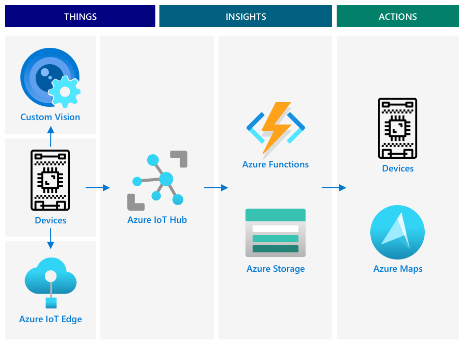

<!--
CO_OP_TRANSLATOR_METADATA:
{
  "original_hash": "f74f4ccb61f00e5f7e9f49c3ed416e36",
  "translation_date": "2025-08-25T16:38:46+00:00",
  "source_file": "4-manufacturing/lessons/4-trigger-fruit-detector/README.md",
  "language_code": "hi"
}
-->
# सेंसर से फल की गुणवत्ता का पता लगाना शुरू करें


> स्केच नोट [नित्या नरसिम्हन](https://github.com/nitya) द्वारा। बड़े संस्करण के लिए छवि पर क्लिक करें।

## प्री-लेक्चर क्विज़

[प्री-लेक्चर क्विज़](https://black-meadow-040d15503.1.azurestaticapps.net/quiz/35)

## परिचय

एक IoT एप्लिकेशन केवल एक डिवाइस द्वारा डेटा कैप्चर करके उसे क्लाउड पर भेजने तक सीमित नहीं है। अक्सर यह कई डिवाइसों का समूह होता है, जो सेंसर का उपयोग करके भौतिक दुनिया से डेटा कैप्चर करते हैं, उस डेटा के आधार पर निर्णय लेते हैं, और एक्ट्यूएटर्स या विज़ुअलाइज़ेशन के माध्यम से भौतिक दुनिया के साथ इंटरैक्ट करते हैं।

इस पाठ में, आप जटिल IoT एप्लिकेशन डिज़ाइन करना, कई सेंसर और क्लाउड सेवाओं को डेटा विश्लेषण और संग्रहण के लिए शामिल करना, और एक्ट्यूएटर के माध्यम से प्रतिक्रिया दिखाना सीखेंगे। आप यह भी जानेंगे कि फल की गुणवत्ता नियंत्रण प्रणाली का प्रोटोटाइप कैसे डिज़ाइन करें, जिसमें IoT एप्लिकेशन को ट्रिगर करने के लिए प्रॉक्सिमिटी सेंसर का उपयोग करना और इस प्रोटोटाइप की आर्किटेक्चर कैसी होगी।

इस पाठ में हम निम्नलिखित विषयों को कवर करेंगे:

* [जटिल IoT एप्लिकेशन डिज़ाइन करें](../../../../../4-manufacturing/lessons/4-trigger-fruit-detector)
* [फल की गुणवत्ता नियंत्रण प्रणाली डिज़ाइन करें](../../../../../4-manufacturing/lessons/4-trigger-fruit-detector)
* [सेंसर से फल की गुणवत्ता जांच शुरू करें](../../../../../4-manufacturing/lessons/4-trigger-fruit-detector)
* [फल गुणवत्ता डिटेक्टर के लिए उपयोग किया गया डेटा](../../../../../4-manufacturing/lessons/4-trigger-fruit-detector)
* [कई IoT डिवाइसों को सिमुलेट करने के लिए डेवलपर डिवाइस का उपयोग करें](../../../../../4-manufacturing/lessons/4-trigger-fruit-detector)
* [प्रोडक्शन में जाना](../../../../../4-manufacturing/lessons/4-trigger-fruit-detector)

> 🗑 यह इस प्रोजेक्ट का अंतिम पाठ है, इसलिए इस पाठ और असाइनमेंट को पूरा करने के बाद, अपने क्लाउड सेवाओं को साफ करना न भूलें। असाइनमेंट पूरा करने के लिए आपको सेवाओं की आवश्यकता होगी, इसलिए पहले इसे पूरा करना सुनिश्चित करें।
>
> यदि आवश्यक हो, तो निर्देशों के लिए [अपने प्रोजेक्ट को साफ करें गाइड](../../../clean-up.md) देखें।

## जटिल IoT एप्लिकेशन डिज़ाइन करें

IoT एप्लिकेशन कई घटकों से बने होते हैं। इसमें विभिन्न प्रकार की चीजें और इंटरनेट सेवाएं शामिल होती हैं।

IoT एप्लिकेशन को *चीजें* (डिवाइस) के रूप में वर्णित किया जा सकता है जो डेटा भेजती हैं और *इनसाइट्स* उत्पन्न करती हैं। ये *इनसाइट्स* *एक्शन* उत्पन्न करते हैं जो किसी व्यवसाय या प्रक्रिया को बेहतर बनाते हैं। उदाहरण के लिए, एक इंजन (चीज) तापमान डेटा भेजता है। इस डेटा का उपयोग यह मूल्यांकन करने के लिए किया जाता है कि इंजन अपेक्षा के अनुसार प्रदर्शन कर रहा है या नहीं (इनसाइट)। इस इनसाइट का उपयोग इंजन के रखरखाव शेड्यूल को प्राथमिकता देने के लिए किया जाता है (एक्शन)।

* विभिन्न चीजें अलग-अलग प्रकार का डेटा एकत्र करती हैं।
* IoT सेवाएं उस डेटा पर इनसाइट्स प्रदान करती हैं, कभी-कभी इसे अतिरिक्त स्रोतों के डेटा के साथ बढ़ाती हैं।
* ये इनसाइट्स एक्शन को प्रेरित करती हैं, जिसमें डिवाइस में एक्ट्यूएटर्स को नियंत्रित करना या डेटा को विज़ुअलाइज़ करना शामिल है।

### संदर्भ IoT आर्किटेक्चर


ऊपर दिया गया आरेख एक संदर्भ IoT आर्किटेक्चर दिखाता है।

> 🎓 एक *संदर्भ आर्किटेक्चर* एक उदाहरण आर्किटेक्चर है जिसका उपयोग आप नए सिस्टम डिज़ाइन करते समय संदर्भ के रूप में कर सकते हैं। इस मामले में, यदि आप एक नया IoT सिस्टम बना रहे हैं, तो आप संदर्भ आर्किटेक्चर का अनुसरण कर सकते हैं, जहां उपयुक्त हो, अपने स्वयं के डिवाइस और सेवाओं को प्रतिस्थापित कर सकते हैं।

* **चीजें** वे डिवाइस हैं जो सेंसर से डेटा एकत्र करती हैं, शायद उस डेटा की व्याख्या करने के लिए एज सेवाओं के साथ इंटरैक्ट करती हैं, जैसे कि छवि डेटा की व्याख्या करने के लिए इमेज क्लासिफायर। डिवाइस से डेटा IoT सेवा को भेजा जाता है।
* **इनसाइट्स** सर्वरलेस एप्लिकेशन से आते हैं, या संग्रहीत डेटा पर चलाए गए एनालिटिक्स से।
* **एक्शन** डिवाइस को भेजे गए कमांड हो सकते हैं, या डेटा का विज़ुअलाइज़ेशन जो मनुष्यों को निर्णय लेने की अनुमति देता है।



ऊपर दिया गया आरेख इन पाठों में अब तक कवर किए गए कुछ घटकों और सेवाओं को दिखाता है और वे संदर्भ IoT आर्किटेक्चर में कैसे जुड़े हुए हैं।

* **चीजें** - आपने सेंसर से डेटा कैप्चर करने के लिए डिवाइस कोड लिखा है, और कस्टम विज़न का उपयोग करके छवियों का विश्लेषण किया है, जो क्लाउड और एज डिवाइस दोनों पर चल रहा है। यह डेटा IoT हब को भेजा गया था।
* **इनसाइट्स** - आपने IoT हब को भेजे गए संदेशों का जवाब देने के लिए Azure Functions का उपयोग किया है, और बाद में विश्लेषण के लिए डेटा को Azure Storage में संग्रहीत किया है।
* **एक्शन** - आपने क्लाउड में किए गए निर्णयों और डिवाइसों को भेजे गए कमांड के आधार पर एक्ट्यूएटर्स को नियंत्रित किया है, और आपने Azure Maps का उपयोग करके डेटा को विज़ुअलाइज़ किया है।

✅ उन अन्य IoT डिवाइसों के बारे में सोचें जिनका आपने उपयोग किया है, जैसे कि स्मार्ट होम उपकरण। उस डिवाइस और उसके सॉफ़्टवेयर में शामिल चीजें, इनसाइट्स और एक्शन क्या हैं?

इस पैटर्न को आपकी आवश्यकता के अनुसार बड़ा या छोटा किया जा सकता है, अधिक डिवाइस और अधिक सेवाएं जोड़कर।

### डेटा और सुरक्षा

जब आप अपने सिस्टम की आर्किटेक्चर को परिभाषित करते हैं, तो आपको लगातार डेटा और सुरक्षा पर विचार करना चाहिए।

* आपका डिवाइस कौन सा डेटा भेजता और प्राप्त करता है?
* उस डेटा को कैसे सुरक्षित और संरक्षित किया जाना चाहिए?
* डिवाइस और क्लाउड सेवा तक पहुंच को कैसे नियंत्रित किया जाना चाहिए?

✅ अपने किसी भी IoT डिवाइस की डेटा सुरक्षा के बारे में सोचें। उस डेटा में से कितना व्यक्तिगत है और इसे ट्रांज़िट में या संग्रहीत होने पर निजी रखा जाना चाहिए? कौन सा डेटा संग्रहीत नहीं किया जाना चाहिए?

## फल की गुणवत्ता नियंत्रण प्रणाली डिज़ाइन करें

अब आइए चीजों, इनसाइट्स और एक्शन के इस विचार को लें और इसे हमारे फल गुणवत्ता डिटेक्टर पर लागू करें ताकि एक बड़े एंड-टू-एंड एप्लिकेशन को डिज़ाइन किया जा सके।

कल्पना करें कि आपको एक फल गुणवत्ता डिटेक्टर बनाने का कार्य सौंपा गया है जिसे एक प्रोसेसिंग प्लांट में उपयोग किया जाएगा। फल एक कन्वेयर बेल्ट सिस्टम पर यात्रा करते हैं, जहां वर्तमान में कर्मचारी हाथ से फल की जांच करते हैं और जैसे ही यह आता है, किसी भी कच्चे फल को हटा देते हैं। लागत कम करने के लिए, प्लांट मालिक एक स्वचालित प्रणाली चाहता है।

✅ IoT (और सामान्य रूप से प्रौद्योगिकी) के उदय के साथ एक प्रवृत्ति यह है कि मैनुअल नौकरियों को मशीनों द्वारा प्रतिस्थापित किया जा रहा है। कुछ शोध करें: IoT के कारण कितनी नौकरियां खोने का अनुमान है? IoT डिवाइस बनाने में कितनी नई नौकरियां पैदा होंगी?

आपको एक ऐसी प्रणाली बनानी होगी जहां फल के कन्वेयर बेल्ट पर पहुंचते ही उसका पता लगाया जाए, फिर उसकी तस्वीर खींची जाए और एज पर चल रहे AI मॉडल का उपयोग करके उसकी जांच की जाए। परिणामों को क्लाउड पर संग्रहीत किया जाता है, और यदि फल कच्चा है तो एक सूचना दी जाती है ताकि कच्चे फल को हटा दिया जाए।

|   |   |
| - | - |
| **चीजें** | कन्वेयर बेल्ट पर आने वाले फल का पता लगाने वाला डिटेक्टर<br>फल की तस्वीर खींचने और वर्गीकृत करने के लिए कैमरा<br>क्लासिफायर चलाने वाला एज डिवाइस<br>कच्चे फल की सूचना देने वाला डिवाइस |
| **इनसाइट्स** | फल की पकी हुई स्थिति की जांच करने का निर्णय लें<br>पकी हुई स्थिति वर्गीकरण के परिणाम संग्रहीत करें<br>कच्चे फल के बारे में अलर्ट की आवश्यकता है या नहीं, यह निर्धारित करें |
| **एक्शन** | फल की तस्वीर खींचने और इसे इमेज क्लासिफायर से जांचने के लिए डिवाइस को कमांड भेजें<br>कच्चे फल के बारे में अलर्ट करने के लिए डिवाइस को कमांड भेजें |

### अपने एप्लिकेशन का प्रोटोटाइप बनाना


ऊपर दिया गया आरेख इस प्रोटोटाइप एप्लिकेशन के लिए संदर्भ आर्किटेक्चर दिखाता है।

* एक IoT डिवाइस जिसमें प्रॉक्सिमिटी सेंसर है, फल के आगमन का पता लगाता है। यह क्लाउड को एक संदेश भेजता है कि फल का पता चला है।
* क्लाउड में एक सर्वरलेस एप्लिकेशन एक अन्य डिवाइस को एक कमांड भेजता है ताकि वह तस्वीर खींचे और छवि को वर्गीकृत करे।
* एक IoT डिवाइस जिसमें कैमरा है, एक तस्वीर खींचता है और इसे एज पर चल रहे इमेज क्लासिफायर को भेजता है। परिणाम फिर क्लाउड पर भेजे जाते हैं।
* क्लाउड में एक सर्वरलेस एप्लिकेशन इस जानकारी को संग्रहीत करता है ताकि बाद में विश्लेषण किया जा सके कि कितने प्रतिशत फल कच्चे हैं। यदि फल कच्चा है, तो यह एक अन्य IoT डिवाइस को एक कमांड भेजता है ताकि फैक्ट्री कर्मचारियों को LED के माध्यम से कच्चे फल के बारे में सूचित किया जा सके।

> 💁 इस पूरे IoT एप्लिकेशन को एक ही डिवाइस के रूप में लागू किया जा सकता है, जिसमें इमेज क्लासिफिकेशन शुरू करने और LED को नियंत्रित करने के लिए सभी लॉजिक अंतर्निहित हो। यह केवल कच्चे फलों की संख्या को ट्रैक करने और डिवाइस को कॉन्फ़िगर करने के लिए IoT हब का उपयोग कर सकता है। इस पाठ में इसे बड़े पैमाने पर IoT एप्लिकेशन की अवधारणाओं को प्रदर्शित करने के लिए विस्तारित किया गया है।

प्रोटोटाइप के लिए, आप इसे एक ही डिवाइस पर लागू करेंगे। यदि आप माइक्रोकंट्रोलर का उपयोग कर रहे हैं, तो आप इमेज क्लासिफायर चलाने के लिए एक अलग एज डिवाइस का उपयोग करेंगे। आपने पहले ही उन अधिकांश चीजों को सीख लिया है जिनकी आपको इसे बनाने के लिए आवश्यकता होगी।

## सेंसर से फल की गुणवत्ता जांच शुरू करें

IoT डिवाइस को किसी प्रकार के ट्रिगर की आवश्यकता होती है ताकि यह संकेत मिल सके कि फल को वर्गीकृत करने के लिए तैयार है। एक ट्रिगर यह हो सकता है कि कन्वेयर बेल्ट पर फल सही स्थान पर है या नहीं, इसे सेंसर से दूरी मापकर जांचा जाए।


प्रॉक्सिमिटी सेंसर का उपयोग सेंसर से वस्तु की दूरी मापने के लिए किया जा सकता है। वे आमतौर पर विद्युत चुम्बकीय विकिरण जैसे लेज़र बीम या इन्फ्रारेड लाइट को प्रसारित करते हैं, फिर किसी वस्तु से विकिरण को उछलते हुए पहचानते हैं। लेज़र बीम भेजे जाने और सिग्नल के वापस उछलने के बीच का समय सेंसर से दूरी की गणना के लिए उपयोग किया जा सकता है।

> 💁 आपने शायद प्रॉक्सिमिटी सेंसर का उपयोग किया होगा और आपको इसके बारे में पता भी नहीं होगा। अधिकांश स्मार्टफोन कॉल के दौरान स्क्रीन को बंद कर देते हैं ताकि आप गलती से अपने कान से कॉल समाप्त न कर दें। यह प्रॉक्सिमिटी सेंसर का उपयोग करके काम करता है, जो कॉल के दौरान स्क्रीन के पास किसी वस्तु का पता लगाता है और फोन को एक निश्चित दूरी पर होने तक टच क्षमताओं को अक्षम कर देता है।

### कार्य - दूरी सेंसर से फल गुणवत्ता जांच शुरू करें

अपने IoT डिवाइस का उपयोग करके किसी वस्तु का पता लगाने के लिए प्रॉक्सिमिटी सेंसर का उपयोग करने के लिए संबंधित गाइड के माध्यम से कार्य करें:

* [Arduino - Wio Terminal](wio-terminal-proximity.md)
* [सिंगल-बोर्ड कंप्यूटर - Raspberry Pi](pi-proximity.md)
* [सिंगल-बोर्ड कंप्यूटर - वर्चुअल डिवाइस](virtual-device-proximity.md)

## फल गुणवत्ता डिटेक्टर के लिए उपयोग किया गया डेटा

प्रोटोटाइप फल डिटेक्टर में कई घटक एक-दूसरे के साथ संवाद करते हैं।


* प्रॉक्सिमिटी सेंसर जो फल से दूरी मापता है और इसे IoT हब को भेजता है
* कैमरा डिवाइस को नियंत्रित करने का कमांड IoT हब से आता है
* इमेज क्लासिफिकेशन के परिणाम IoT हब को भेजे जाते हैं
* LED को नियंत्रित करने का कमांड, जब फल कच्चा हो, IoT हब से LED वाले डिवाइस को भेजा जाता है

इन संदेशों की संरचना को पहले से परिभाषित करना अच्छा होता है, इससे पहले कि आप एप्लिकेशन को बनाना शुरू करें।

> 💁 लगभग हर अनुभवी डेवलपर ने अपने करियर में किसी न किसी समय डेटा में अंतर के कारण बग्स को ट्रैक करने में घंटों, दिनों या यहां तक कि हफ्तों बिताए हैं।

उदाहरण के लिए - यदि आप तापमान की जानकारी भेज रहे हैं, तो आप JSON को कैसे परिभाषित करेंगे? आपके पास `temperature` नाम का एक फ़ील्ड हो सकता है, या आप सामान्य संक्षिप्त रूप `temp` का उपयोग कर सकते हैं।

```json
{
    "temperature": 20.7
}
```

की तुलना में:

```json
{
    "temp": 20.7
}
```

आपको इकाइयों पर भी विचार करना होगा - क्या तापमान °C में है या °F में? यदि आप उपभोक्ता डिवाइस का उपयोग करके तापमान माप रहे हैं और वे डिस्प्ले इकाइयों को बदलते हैं, तो आपको यह सुनिश्चित करना होगा कि क्लाउड को भेजी गई इकाइयां सुसंगत रहें।

✅ कुछ शोध करें: इकाई की समस्याओं ने $125 मिलियन के मार्स क्लाइमेट ऑर्बिटर को कैसे क्रैश कर दिया?

फल गुणवत्ता डिटेक्टर के लिए भेजे जा रहे डेटा के बारे में सोचें। आप प्रत्येक संदेश को कैसे परिभाषित करेंगे? आप डेटा का विश्लेषण कहां करेंगे और कौन सा डेटा भेजने का निर्णय लेंगे?

उदाहरण के लिए - प्रॉक्सिमिटी सेंसर का उपयोग करके इमेज क्लासिफिकेशन को ट्रिगर करना। IoT डिवाइस दूरी मापता है, लेकिन निर्णय कहां लिया जाता है? क्या डिवाइस यह तय करता है कि फल पर्याप्त करीब है और IoT हब को क्लासिफिकेशन ट्रिगर करने के लिए संदेश भेजता है? या यह प्रॉक्सिमिटी माप भेजता है और IoT हब निर्णय लेता है?

इस तरह के सवालों का जवाब है - यह निर्भर करता है। प्रत्येक उपयोग का मामला अलग होता है, यही कारण है कि एक IoT डेवलपर के रूप में आपको उस सिस्टम को समझने की आवश्यकता है जिसे आप बना रहे हैं, इसका उपयोग कैसे किया जाता है, और पता लगाए गए डेटा को कैसे संभालना है।

* यदि निर्णय IoT हब द्वारा लिया जाता है, तो आपको कई दूरी माप भेजने होंगे।
* यदि आप बहुत अधिक संदेश भेजते हैं, तो यह IoT हब की लागत और आपके IoT डिवाइसों द्वारा आवश्यक बैंडविड्थ (विशेष रूप से एक फैक्ट्री में जहां लाखों डिवाइस हैं) को बढ़ा देता है। यह आपके डिवाइस को धीमा भी कर सकता है।
* यदि आप डिवाइस पर निर्णय लेते हैं, तो आपको मशीन को ठीक से ट्यून करने के लिए डिवाइस को कॉन्फ़िगर करने का एक तरीका प्रदान करना होगा।

## कई IoT डिवाइसों को सिमुलेट करने के लिए डेवलपर डिवाइस का उपयोग करें

अपने प्रोटोटाइप को बनाने के लिए, आपको अपने IoT डिव किट का उपयोग करना होगा ताकि यह कई डिवाइसों की तरह काम कर सके, टेलीमेट्री भेज सके और कमांड का जवाब दे सके।

### Raspberry Pi या वर्चुअल IoT हार्डवेयर पर कई IoT डिवाइसों का सिमुलेशन

सिंगल-बोर्ड कंप्यूटर जैसे Raspberry Pi का उपयोग करते समय, आप एक साथ कई एप्लिकेशन चला सकते हैं। इसका मतलब है कि आप कई IoT डिवाइसों का सिमुलेशन कर सकते हैं, प्रत्येक 'IoT डिवाइस' के लिए एक अलग एप्लिकेशन बनाकर। उदाहरण के लिए, आप प्रत्येक डिवाइस को एक अलग Python फ़ाइल के रूप में लागू कर
💁 ध्यान दें कि कुछ हार्डवेयर एक साथ कई एप्लिकेशन द्वारा एक्सेस किए जाने पर काम नहीं करेगा।
### माइक्रोकंट्रोलर पर कई डिवाइस का सिमुलेशन

माइक्रोकंट्रोलर पर कई डिवाइस का सिमुलेशन करना थोड़ा जटिल होता है। सिंगल बोर्ड कंप्यूटर की तरह आप एक साथ कई एप्लिकेशन नहीं चला सकते। आपको सभी अलग-अलग IoT डिवाइस के लिए लॉजिक को एक ही एप्लिकेशन में शामिल करना होता है।

इस प्रक्रिया को आसान बनाने के लिए कुछ सुझाव:

* प्रत्येक IoT डिवाइस के लिए एक या अधिक क्लास बनाएं - उदाहरण के लिए `DistanceSensor`, `ClassifierCamera`, `LEDController` नामक क्लास। प्रत्येक क्लास में अपना `setup` और `loop` मेथड हो सकता है, जिसे मुख्य `setup` और `loop` फंक्शन द्वारा कॉल किया जाएगा।
* कमांड को एक ही स्थान पर हैंडल करें और आवश्यकतानुसार उन्हें संबंधित डिवाइस क्लास में निर्देशित करें।
* मुख्य `loop` फंक्शन में, आपको प्रत्येक अलग डिवाइस के लिए टाइमिंग पर विचार करना होगा। उदाहरण के लिए, यदि आपके पास एक डिवाइस क्लास है जिसे हर 10 सेकंड में प्रोसेस करना है, और दूसरा जिसे हर 1 सेकंड में प्रोसेस करना है, तो मुख्य `loop` फंक्शन में 1 सेकंड की देरी का उपयोग करें। हर `loop` कॉल उस डिवाइस के लिए कोड को ट्रिगर करता है जिसे हर सेकंड प्रोसेस करना है, और एक काउंटर का उपयोग करके प्रत्येक लूप को गिनें, दूसरे डिवाइस को तब प्रोसेस करें जब काउंटर 10 तक पहुंच जाए (इसके बाद काउंटर को रीसेट करें)।

## प्रोडक्शन में जाना

प्रोटोटाइप अंतिम प्रोडक्शन सिस्टम का आधार बनेगा। जब आप प्रोडक्शन में जाते हैं, तो कुछ अंतर हो सकते हैं:

* मजबूत घटक - ऐसे हार्डवेयर का उपयोग करना जो फैक्ट्री के शोर, गर्मी, कंपन और तनाव को सहन कर सके।
* आंतरिक संचार का उपयोग - कुछ घटक सीधे संवाद करेंगे और क्लाउड तक जाने की आवश्यकता को टालेंगे, केवल डेटा को क्लाउड में स्टोर करने के लिए भेजेंगे। यह कैसे किया जाता है, यह फैक्ट्री सेटअप पर निर्भर करता है, या तो सीधे संचार द्वारा, या गेटवे डिवाइस का उपयोग करके IoT सेवा का एक हिस्सा एज पर चलाकर।
* कॉन्फ़िगरेशन विकल्प - प्रत्येक फैक्ट्री और उपयोग का मामला अलग होता है, इसलिए हार्डवेयर को कॉन्फ़िगर करने योग्य होना चाहिए। उदाहरण के लिए, प्रॉक्सिमिटी सेंसर को अलग-अलग दूरी पर अलग-अलग फल का पता लगाने की आवश्यकता हो सकती है। क्लासिफिकेशन को ट्रिगर करने के लिए दूरी को हार्ड कोड करने के बजाय, आप इसे क्लाउड के माध्यम से कॉन्फ़िगर करने योग्य बनाना चाहेंगे, उदाहरण के लिए डिवाइस ट्विन का उपयोग करके।
* स्वचालित फल हटाना - फल के अपरिपक्व होने पर एलईडी के बजाय, स्वचालित डिवाइस इसे हटा देंगे।

✅ कुछ शोध करें: प्रोडक्शन डिवाइस डेवलपर किट से और किन तरीकों से अलग होते हैं?

---

## 🚀 चुनौती

इस पाठ में आपने IoT सिस्टम को आर्किटेक्ट करने के लिए आवश्यक कुछ अवधारणाओं को सीखा। पिछले प्रोजेक्ट्स को याद करें। वे ऊपर दिखाए गए संदर्भ आर्किटेक्चर में कैसे फिट होते हैं?

अब तक के प्रोजेक्ट्स में से एक को चुनें और एक अधिक जटिल समाधान के डिज़ाइन के बारे में सोचें, जो कई क्षमताओं को एक साथ लाता है, जो प्रोजेक्ट्स में शामिल नहीं थे। आर्किटेक्चर बनाएं और उन सभी डिवाइस और सेवाओं के बारे में सोचें जिनकी आपको आवश्यकता होगी।

उदाहरण - एक वाहन ट्रैकिंग डिवाइस जो GPS को सेंसर के साथ जोड़ता है ताकि रेफ्रिजरेटेड ट्रक में तापमान, इंजन ऑन और ऑफ टाइम्स, और ड्राइवर की पहचान जैसी चीजों की निगरानी की जा सके। इसमें कौन-कौन से डिवाइस शामिल हैं, कौन-कौन सी सेवाएं शामिल हैं, कौन सा डेटा ट्रांसमिट हो रहा है, और सुरक्षा और गोपनीयता के क्या विचार हैं?

## पोस्ट-लेक्चर क्विज़

[पोस्ट-लेक्चर क्विज़](https://black-meadow-040d15503.1.azurestaticapps.net/quiz/36)

## समीक्षा और स्व-अध्ययन

* IoT आर्किटेक्चर के बारे में अधिक पढ़ें [Microsoft Docs पर Azure IoT संदर्भ आर्किटेक्चर दस्तावेज़](https://docs.microsoft.com/azure/architecture/reference-architectures/iot?WT.mc_id=academic-17441-jabenn) पर।
* डिवाइस ट्विन्स के बारे में अधिक पढ़ें [Microsoft Docs पर IoT Hub दस्तावेज़ में डिवाइस ट्विन्स को समझें और उपयोग करें](https://docs.microsoft.com/azure/iot-hub/iot-hub-devguide-device-twins?WT.mc_id=academic-17441-jabenn) पर।
* OPC-UA के बारे में पढ़ें, जो औद्योगिक स्वचालन में उपयोग किया जाने वाला मशीन-टू-मशीन संचार प्रोटोकॉल है, [Wikipedia पर OPC-UA पेज](https://wikipedia.org/wiki/OPC_Unified_Architecture) पर।

## असाइनमेंट

[फलों की गुणवत्ता का डिटेक्टर बनाएं](assignment.md)

**अस्वीकरण**:  
यह दस्तावेज़ AI अनुवाद सेवा [Co-op Translator](https://github.com/Azure/co-op-translator) का उपयोग करके अनुवादित किया गया है। जबकि हम सटीकता के लिए प्रयासरत हैं, कृपया ध्यान दें कि स्वचालित अनुवाद में त्रुटियां या अशुद्धियां हो सकती हैं। मूल भाषा में उपलब्ध मूल दस्तावेज़ को आधिकारिक स्रोत माना जाना चाहिए। महत्वपूर्ण जानकारी के लिए, पेशेवर मानव अनुवाद की सिफारिश की जाती है। इस अनुवाद के उपयोग से उत्पन्न किसी भी गलतफहमी या गलत व्याख्या के लिए हम उत्तरदायी नहीं हैं।